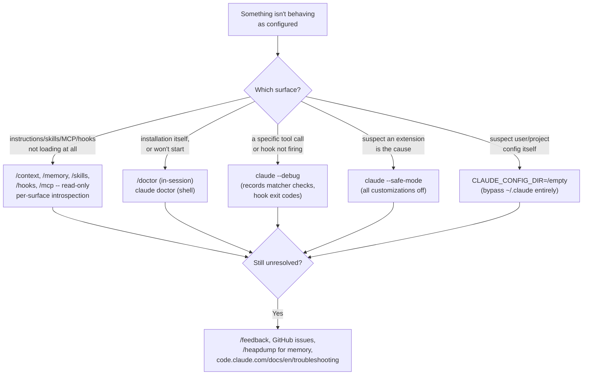
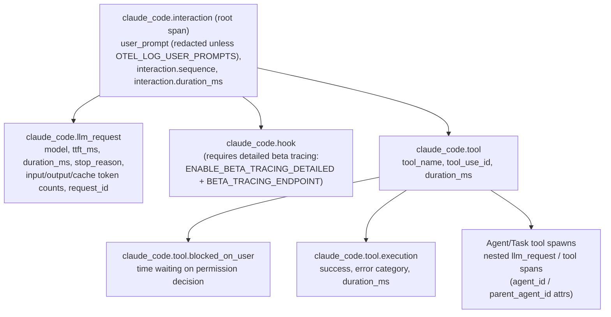
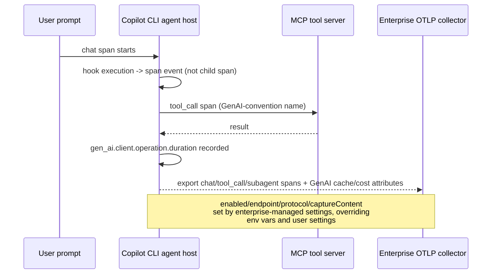
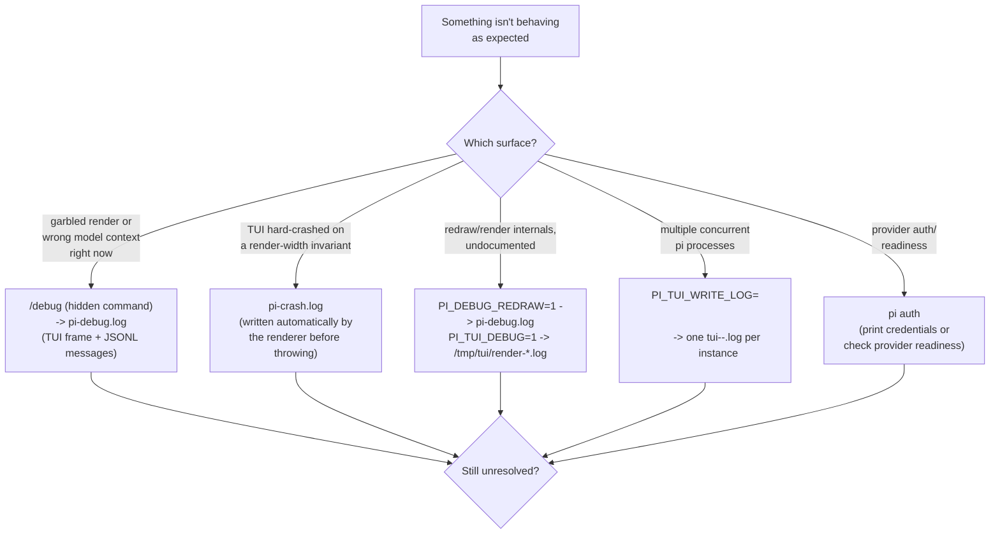
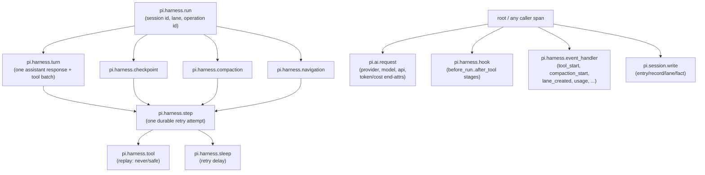
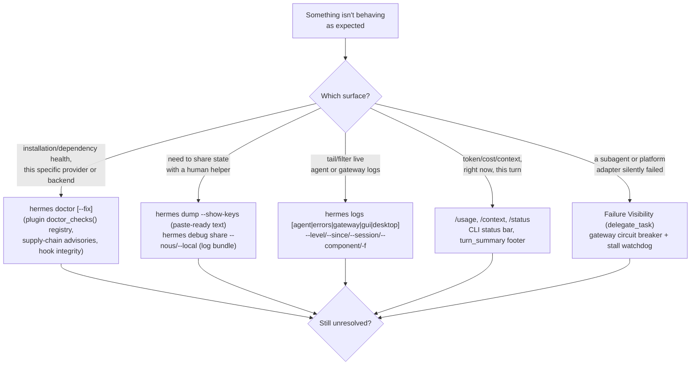
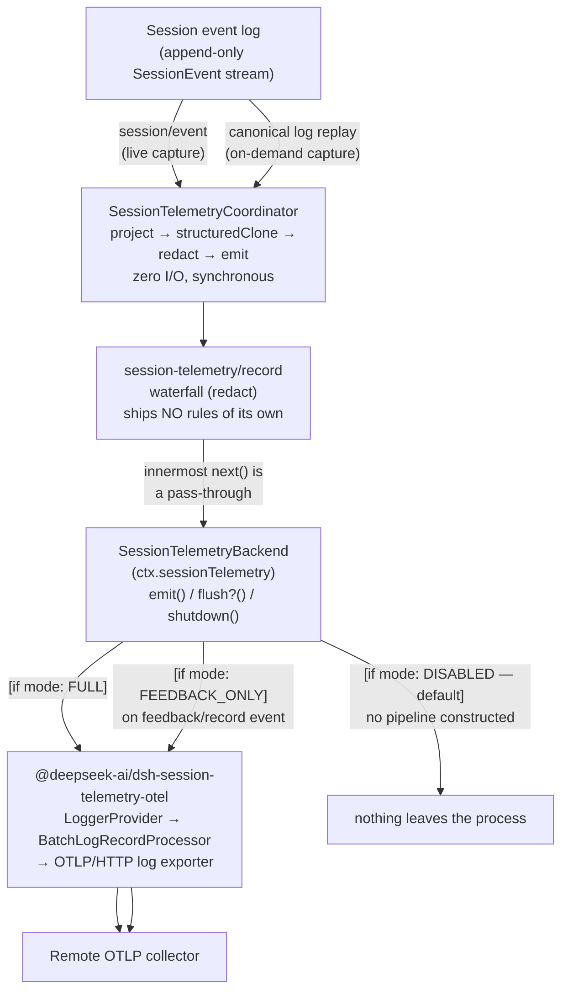
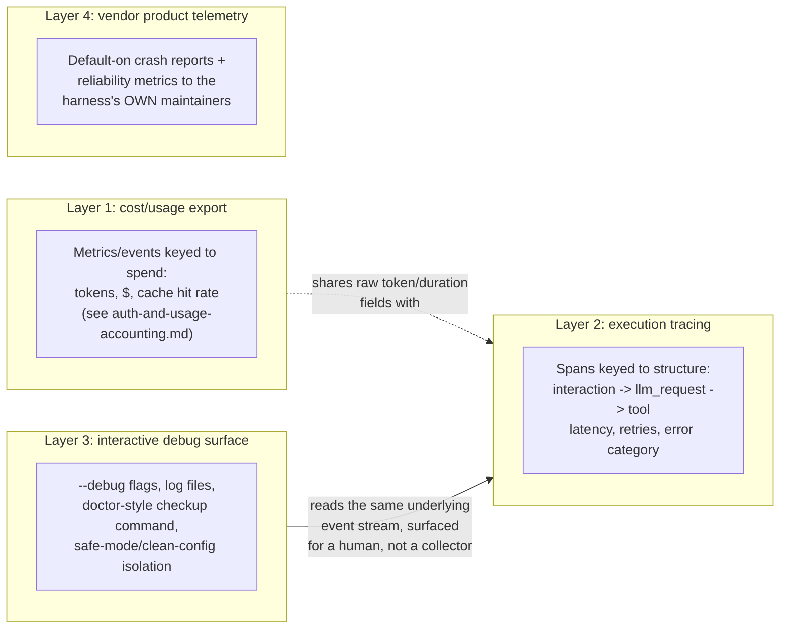

# Observability and self-diagnostics

Every harness examined in this book emits *some* signal about its own execution beyond
the conversation transcript itself -- a debug log line, a span, a crash report, a
diagnostics command. This page is about that layer specifically: how a harness lets a
developer or operator see what the harness's own process is doing (which tool fired,
which hook matched, which config file loaded, why a request failed, how long a step
took), as distinct from **what it costs**. [Auth & usage
accounting](auth-and-usage-accounting.md) §1.4 already documents Claude Code's
OpenTelemetry **metrics and log/event** catalogue in full (`claude_code.token.usage`,
`claude_code.cost.usage`, `claude_code.api_request`, the four `OTEL_LOG_*` content
gates) -- that catalogue is priced-and-billed-oriented: every metric and event in it
exists to answer "how much did this session spend, and on what." This page does not
repeat that catalogue; it cross-references it precisely and covers the two things that
catalogue does not: (1) Claude Code's separate, less mature **traces** signal, whose
spans model *execution structure* (interaction -> LLM request -> tool -> tool
execution) rather than spend, and (2) the debugging/diagnostic surface every harness
exposes for a human to answer "why did the harness itself just do that, or fail to do
that" -- debug flags, log files, doctor-style installation checkups, and the vendor's
own default telemetry about the harness's reliability, which is a different audience
(the harness's own engineering team) than a customer's OTel collector.

The general vocabulary this page assumes -- what a "span," a "trace," and "distributed
tracing" mean, and why an agentic system with tool calls and subagents is a natural fit
for tracing rather than flat logging -- is not re-derived here; it is the same
OpenTelemetry-standard vocabulary used throughout this book's own citations (see
[MCP supply-chain trust/vetting](mcp-supply-chain-trust.md) and
[auth-and-usage-accounting.md](auth-and-usage-accounting.md) for prior uses). This page
treats it as background, not something to teach from scratch.

## 1. Claude Code

### 1.1 Debug flags, log files, and the debug-log format

VERIFIED (`code.claude.com/docs/en/cli-reference`, fetched this session): `claude
--debug` enables debug mode; `--debug='category1,category2'` filters to specific
categories (for example `--debug='mcp,startup'`), and a leading `!` negates a category
(`--debug='!1p'`). `--debug-file <path>` writes debug logs to a specific file, implicitly
turns debug mode on, and takes precedence over the `CLAUDE_CODE_DEBUG_LOGS_DIR`
environment variable. `--safe-mode` starts a session with every customization disabled
(`CLAUDE.md`, skills, plugins, hooks, MCP servers, custom commands, themes, keybindings)
so a misbehaving extension can be ruled out by comparison, and sets the
`CLAUDE_CODE_SAFE_MODE` environment variable for the session. `claude doctor` (run from
the shell, not inside a session) prints read-only installation and settings diagnostics
without starting a session at all -- the shell-level escape hatch for when `claude`
won't even launch.

VERIFIED (`code.claude.com/docs/en/debug-your-config`, fetched this session): inside a
running session, `/debug [issue]` enables debug logging for that session and prompts
Claude to diagnose the problem itself using the log output and settings paths as
context -- a self-referential debugging affordance distinct from the shell-level
`--debug` flag. The same page gives a concrete debug-log location and workflow: when an
MCP server connects but reports zero tools, the documented recovery is to run `claude
--debug=mcp` and read the server's stderr in the debug log at
`~/.claude/debug/<session-id>.txt`. Starting a session with `claude --debug` and
triggering the tool call in question causes the debug log to record, per the docs,
"each event, which matchers were checked, and the hook's exit code and output" for
hooks specifically -- i.e. the debug log is also the mechanism for watching hook
matcher evaluation live, cross-referenced against
[hooks-lifecycle-extensibility.md](hooks-lifecycle-extensibility.md)'s own fuller
treatment of hook semantics (this page does not re-derive matcher syntax or the
exit-code-2-blocks rule, only how to *observe* them).

### 1.2 `/doctor` and the other built-in introspection commands

VERIFIED ([built-in-skills.md](built-in-skills.md) §1, already documented in this book,
cross-referenced rather than repeated): `/doctor` ships as a bundled skill present in
every session (with a `claude doctor` shell-level equivalent, per §1.1 above), performing
a "setup checkup: installation health, unused skills/MCP servers/plugins, slow hooks,
newer-version checks, `CLAUDE.md` deduplication," and is the sole bundled skill that
stays typable even when `disableBundledSkills` turns every other bundled skill off.
VERIFIED (`code.claude.com/docs/en/debug-your-config`, fetched this session, extending
built-in-skills.md's account): from the terminal, `claude doctor` prints the same class
of diagnostics without starting a session; from v2.1.206 onward `/doctor` additionally
checks for and proposes trimming checked-in `CLAUDE.md` content Claude could derive from
the codebase itself, applying fixes only after explicit confirmation. `/doctor` is
explicitly one tool in a small family of introspection commands the same page documents
together: `/context` (what is actually occupying the context window right now, broken
down by category), `/memory`, `/skills`, `/hooks`, `/mcp`, `/permissions`, and `/status`
each give a scoped, read-only view of one configuration surface, letting a user
distinguish "the file didn't load" from "it loaded from the wrong scope" from "another
file overrode it" without needing to read source or guess.



VERIFIED (`code.claude.com/docs/en/debug-your-config`, fetched this session): beyond the
per-surface commands, the docs describe a "test against a clean configuration"
escalation path -- `CLAUDE_CONFIG_DIR=/tmp/claude-clean claude` launched from a directory
with no `.claude` folder, `.mcp.json`, or `CLAUDE.md` bypasses everything under the
normal `~/.claude` directory (managed settings still apply, since they live outside
`~/.claude`); if a problem disappears there, the cause is somewhere in the user's own
`~/.claude` or project `.claude` files, isolated by reintroducing them one at a time.

VERIFIED (`code.claude.com/docs/en/troubleshooting`, fetched this session): a dedicated
performance/stability page documents `/heapdump` for memory-growth diagnosis -- typing
it in full (it doesn't appear in the command menu) writes a JavaScript heap snapshot
(`<session-id>.heapsnapshot`) and a memory-statistics file
(`<session-id>-diagnostics.json`) to the desktop, prints a summary in the conversation
(resident set size, JS heap, array buffers, unaccounted native memory, and any detected
leak indicators such as an unusually high open-handle count), and explicitly warns that
the `.heapsnapshot` file "contains every string in the process, including your full
conversation and credentials" and should never be attached to a public issue -- only the
`-diagnostics.json` file is safe to attach to a GitHub issue. The same page documents
`USE_BUILTIN_RIPGREP=0` plus a system `ripgrep` install as the fix when the bundled
search binary can't run on a given platform, with `claude doctor`'s "Search" line as the
way to confirm the switch took effect.

### 1.3 OpenTelemetry traces (beta) -- structural, not cost-oriented

VERIFIED (`code.claude.com/docs/en/monitoring-usage`, fetched this session): distinct
from the metrics/logs signals [auth-and-usage-accounting.md](auth-and-usage-accounting.md)
§1.4 already documents, Claude Code ships a third OTel signal type -- **traces** -- gated
behind its own separate opt-in: `CLAUDE_CODE_ENABLE_TELEMETRY=1` *and*
`CLAUDE_CODE_ENHANCED_TELEMETRY_BETA=1` (or its alias
`ENABLE_ENHANCED_TELEMETRY_BETA`) together, plus `OTEL_TRACES_EXPORTER` set to `otlp`,
`console`, or `none`. Standard OTel OTLP configuration applies (`OTEL_EXPORTER_OTLP_
ENDPOINT`/`_PROTOCOL`, with trace-specific overrides `OTEL_EXPORTER_OTLP_TRACES_
ENDPOINT`/`_PROTOCOL`/`_HEADERS`, and `OTEL_TRACES_EXPORT_INTERVAL` for the span batch
export interval, default 5000ms).



Span attributes are the structural counterpart to the cost-oriented event fields already
documented in auth-and-usage-accounting.md's `claude_code.api_request` event: the
`claude_code.llm_request` span carries `ttft_ms` (time to first token), `attempt` count,
`response.has_tool_call`, and the OTel GenAI semantic-convention fields `gen_ai.system`,
`gen_ai.request.model`, `gen_ai.response.id`, and `gen_ai.response.finish_reasons`
alongside the same token-count fields the cost event reports -- the same numbers serve
both a spend dashboard and a latency/reliability trace, but only the trace's span
hierarchy and duration fields let an operator see *where in the turn* time was spent, or
which specific tool call in a chain of subagent calls was slow, which a flat metrics
export cannot represent. The same content-gating environment variables auth-and-usage-
accounting.md documents for events (`OTEL_LOG_TOOL_DETAILS`) also gate span attributes
such as `file_path`, `full_command`, and `skill_name` on the `claude_code.tool` span, and
a separate `OTEL_LOG_TOOL_CONTENT=1` additionally attaches a `tool.output` span event
with truncated (60KB default) tool input/output bodies.

VERIFIED (same source): tracing propagates using the **W3C trace context** standard.
When tracing is active, Bash and PowerShell subprocesses Claude Code spawns
automatically inherit a `TRACEPARENT` environment variable carrying the active tool
span's context, so a subprocess that itself understands W3C trace context can parent its
own spans under the same trace -- genuine end-to-end distributed tracing through scripts
Claude Code runs, not merely tracing of Claude Code's own internals. On the inbound side,
in Agent SDK and `-p` (print/non-interactive) sessions, Claude Code reads `TRACEPARENT`/
`TRACESTATE` from its own environment when starting each interaction span, letting an
embedding application's trace context become the parent of Claude Code's own spans;
interactive sessions deliberately ignore inbound `TRACEPARENT` "to avoid accidentally
inheriting ambient values from CI or container environments." Outbound, each model
request carries a `traceparent` header to the Anthropic API (recording the API's
`traceresponse` header back as a span link) and to outbound HTTP MCP requests, but by
default *not* to a custom `ANTHROPIC_BASE_URL` proxy unless
`CLAUDE_CODE_PROPAGATE_TRACEPARENT=1` is set, "since some proxies reject unrecognised
headers" -- and never to third-party model providers regardless of that setting.

VERIFIED (same source): the docs are explicit that this is a **beta, off-by-default,
unstable** signal -- distinct from the stable metrics/logs catalogue auth-and-usage-
accounting.md documents. The `claude_code.hook` span specifically requires additional,
separate gating beyond the base trace opt-in (`ENABLE_BETA_TRACING_DETAILED=1` and
`BETA_TRACING_ENDPOINT`), and in interactive CLI sessions detailed hook tracing further
requires organization allowlisting (Agent SDK and non-interactive `-p` sessions are not
allowlist-gated). Several content-bearing hook-span attributes
(`system_prompt_preview`, `tool_input`, `response.model_output`) are documented as
explicitly outside the stable span schema and subject to change. Two dated correctness
fixes are called out directly in the docs rather than left to changelog archaeology:
before v2.1.214, records emitted outside an active span's async context (such as inside
a permission-prompt callback) carried the wrong trace/span IDs; before v2.1.212, such
records carried no `trace_id`/`span_id` at all.

### 1.4 Default vendor-side telemetry -- a third, non-customer-configured layer

VERIFIED (`code.claude.com/docs/en/data-usage`, fetched this session): independent of
both the customer-configured OTel metrics/logs (auth-and-usage-accounting.md §1.4) and
the customer-configured OTel traces (§1.3 above), Claude Code sends its own **default
operational telemetry to Anthropic** about the harness's own reliability -- a third
observability layer with a different audience (Anthropic's own engineering team
monitoring the product, not a customer's observability stack). The docs name two kinds:
"**Metrics**: latency, reliability, and usage patterns, sent to Anthropic and to
third-party logging infrastructure over TLS. Metrics never include your code, prompts,
or file paths," opted out of via `DISABLE_TELEMETRY=1`; and "**Error reports**: error
messages and stack traces from Claude Code's own internals, sent to a third-party error
tracking service over TLS," with "known patterns of secrets, file paths, email
addresses, and other personal information" redacted before anything leaves the machine,
opted out of via `DISABLE_ERROR_REPORTING=1`. Error reporting specifically is on only
when *all* of: the user is signed in with a Claude Pro or Max subscription, running
v2.1.198 or later, connecting directly to the Claude API, and the organization has no
zero-data-retention or HIPAA agreement -- meaning most Team/Enterprise/API and every
Bedrock/Vertex/Foundry/AWS-native session has this specific stream off by default, per
the docs' own provider-by-provider default table (metrics default *on* for direct
Claude-API use, default *off* for Vertex/Bedrock/Foundry/Claude-Platform-on-AWS unless
the corresponding `CLAUDE_CODE_USE_*` flag is set). `CLAUDE_CODE_DISABLE_NONESSENTIAL_
TRAFFIC` turns off all of it (plus session-quality surveys) in one setting, and also
disables the feature-flag evaluation that Remote Control depends on, a coupling the docs
flag explicitly (`DISABLE_TELEMETRY` shares that side effect; `DISABLE_ERROR_REPORTING`
does not). The `/feedback`, `/bug`, and `/share` commands are a related but conceptually
different, explicitly user-initiated channel: they upload a copy of conversation
history (redacted for known secret/token patterns) only when a user actively runs the
command, retained up to 5 years per data-usage's own retention table, with a local-
archive fallback under `~/.claude/feedback-bundles/` on third-party-provider or
credential-less sessions where nothing leaves the machine automatically.

This distinction matters for a from-scratch harness builder (§7 below): a mature
harness's observability surface is not one pipe but (at minimum) three separable ones --
customer-configured cost/usage export, customer-configured execution tracing, and the
vendor's own default product-reliability telemetry -- each with its own opt-out, its own
audience, and its own default-on/off posture that should be stated as plainly as Claude
Code's data-usage page states it, not left implicit.

## 2. GitHub Copilot CLI

### 2.1 Debug flags and log files

VERIFIED (`github.com/github/copilot-cli`'s own `changelog.md`, fetched via `gh api`
this session, full 2,979-line file): a persistent `log_level` option was added to
`~/.copilot/config` with possible values `["none", "error", "warning", "info", "debug",
"all", "default"]`, described as "improved debug log collection convenience." A
`--print-debug-info` flag was added later to "display version, terminal capabilities,
and environment variables" for quick environment-mismatch triage. `--log-dir` is a
documented flag whose relative-path resolution the changelog records fixing (resolving
against a session's saved working directory rather than the launch directory, once
`copilot --continue` began restoring the saved cwd). One dated entry records "Collect
debug logs without truncating large files or dropping multiline secrets" as a fix,
implying debug-log collection was a pre-existing, if imperfect, capability well before
that fix landed. VERIFIED (`docs.github.com/en/copilot/troubleshooting-github-copilot/
viewing-logs-for-github-copilot-in-your-environment`, fetched this session): this
official troubleshooting page is written primarily around IDE-integration log viewing
(JetBrains, Visual Studio, VS Code, Vim/Neovim, Xcode) and its one direct Copilot-CLI
reference is the **Agent Debug Panel** -- "shows a chronological event log of agent
interactions during a Copilot CLI session" -- surfaced through the JetBrains
integration's own debug-file-logging toggle (Tools > Copilot > Chat > "Enable Agent
debug File Logging"), not through a documented Copilot-CLI-native flag on that specific
page. This is a real, flagged documentation gap: `docs.github.com` does not carry a
CLI-native equivalent of Claude Code's `code.claude.com/docs/en/troubleshooting` page at
the same level of specificity as of this session; the changelog is the more precise
source for the CLI's own logging surface, consistent with this book's general finding
(see [packaging-distribution-and-self-update.md](packaging-distribution-and-self-update.md)
and [retries.md](retries.md)) that `github/copilot-cli`'s changelog is frequently more
authoritative for CLI-specific mechanics than `docs.github.com`'s prose docs, which skew
toward the IDE extension and the Copilot SDK.

### 2.2 OpenTelemetry -- genuinely spans, not just cost metrics, and enterprise-managed

This is the most consequential correction this page makes to the picture
auth-and-usage-accounting.md's Copilot section and [caching.md](caching.md) §1.6 leave
implicit: those pages document Copilot CLI's OTel export only through its **cost-shaped
GenAI attributes** (`gen_ai.usage.cache_read.input_tokens`,
`gen_ai.usage.cache_creation.input_tokens`, `gen_ai.usage.reasoning.output_tokens`).
VERIFIED (same `changelog.md`, fetched this session): Copilot CLI's OTel export is not
limited to those cost attributes -- it includes genuine execution-structure **spans**,
tracking closely with what Claude Code's beta traces model (§1.3 above), and shipped
earlier / with less of an explicit beta label than Claude Code's own tracing signal.
Dated entries read directly from the changelog: "OpenTelemetry monitoring: subagent
spans now use INTERNAL span kind, and chat spans include a `github.copilot.
time_to_first_chunk` attribute (streaming only)" (v1.0.19, 2026-04-06); "OpenTelemetry
output aligns with GenAI semantic conventions: MCP tool calls now use standard
`tool_call` spans, and a new `gen_ai.client.operation.duration` metric tracks tool
execution time"; "OpenTelemetry: chat spans after a successful compaction carry
`gen_ai.conversation.compacted=true`, and the summary is emitted as a `CompactionPart`
in `gen_ai.input.messages`"; and "OTEL hook executions are now recorded as span events
instead of child spans, reducing trace clutter" -- a direct structural analogue to
Claude Code's `claude_code.hook` span, with the changelog itself documenting a
span-granularity design *reversal* (hooks demoted from child spans to span events)
that Claude Code's own docs do not record making in the other direction.

VERIFIED (`github.blog/changelog/2026-07-08-enterprise-managed-opentelemetry-export-for-
vs-code-and-cli`, fetched this session, and `docs.github.com/en/copilot/reference/
enterprise-administrators/enterprise-managed-settings`, fetched this session): as of
July 2026, an enterprise-managed `telemetry` settings block routes OTel export for both
the VS Code Copilot Chat extension *and* "the agent host process that powers Copilot
CLI" to an administrator-chosen collector. The documented sub-keys are `enabled`
(on/off), `endpoint` (the OTLP collector URL), `protocol` (`http/json` or
`http/protobuf`; the changelog post additionally names `otlp-http`/`otlp-grpc` as
transport choices), `captureContent` (whether prompt/response/tool content is included
at all) and `lockCaptureContent` (prevents a user from overriding that at their own
scope), `serviceName`, `resourceAttributes`, and `headers` (for exporter authentication).
Docs state plainly that "this property is supported for Copilot CLI and VS Code" but
explicitly *not* for the standalone GitHub Copilot app or JetBrains IDEs, and that an
MDM-managed value always wins over environment variables and user-level settings --
the same managed-settings-overrides-everything precedence pattern
[configuration.md](configuration.md) already documents for Copilot CLI's non-telemetry
settings, extended here to the telemetry surface specifically.



### 2.3 Debugging commands and adjacent tooling

VERIFIED (same changelog): `/feedback` submits a report (with a saved-bundle fallback
to `TEMP` when the working directory isn't writable, per a later hardening entry), and
`--print-debug-info` is the closest Copilot-CLI-native analogue to Claude Code's `claude
doctor` -- a version/environment/terminal-capability dump rather than a full
configuration-health checkup; this book found no Copilot CLI command that performs the
broader "check installation health, unused MCP servers, stale settings files" class of
audit `/doctor` performs for Claude Code, and flags that as a real, not merely
undocumented, capability gap rather than assuming an equivalent exists unexamined.
BEST CURRENT UNDERSTANDING, UNCONFIRMED: the separate `gh-debug-cli` tool found via
`copilot-extensions/gh-debug-cli` on GitHub (a CLI for locally chatting with an agent for
faster feedback, with its own `DEBUG`/`TRACE`/`NONE` log levels, `TRACE` printing raw
HTTP responses) reads as a developer-facing debugging utility adjacent to Copilot CLI's
own agent-extension ecosystem rather than a documented, first-party diagnostic surface
of Copilot CLI itself -- named here as a lead worth flagging, not asserted as part of
Copilot CLI's own observability surface, since it was not independently corroborated by
`docs.github.com` or the `copilot-cli` changelog this session.

## 3. OpenCode

### 3.1 Logging flags -- fully documented, source-unverified this session

VERIFIED (`opencode.ai/docs/troubleshooting/`, fetched this session): `opencode
--log-level DEBUG` raises verbosity; `opencode --print-logs` streams log output directly
to the terminal rather than only to a file, useful specifically for diagnosing startup
failures before a log file would even be readable; combining both
(`opencode --print-logs --log-level DEBUG 2> log_file.txt`) is the documented way to
capture a debug session to a file. Log files are written to `~/.local/share/opencode/
log/` on macOS/Linux and the Windows-path equivalent under `%USERPROFILE%\.local\share\
opencode\log`, named by timestamp (for example `2025-01-09T123456.log`), with the docs
stating the ten most recent log files are retained and older ones pruned automatically.
This is documentation-level grounding only: this session did not locate OpenCode's
logger implementation in `packages/opencode/src/util/` (a targeted directory listing on
the `dev` branch turned up no `log.ts`-equivalent file there), so the exact rotation/
retention mechanism and log-record schema are not independently source-verified the way
this book source-verifies other OpenCode subsystems -- flagged as a gap rather than
extrapolated from the docs' own claim.

### 3.2 No native OpenTelemetry -- a third-party plugin ecosystem fills the gap

VERIFIED (`gh pr view 5245 --repo anomalyco/opencode`, fetched this session): a pull
request titled "feat: integrate OpenTelemetry," proposing to "add back" OTel
dependencies and instrumentation, remains **open and unmerged** as of this session
(`"state": "OPEN"`, `"mergedAt": null`) -- the PR's own body ("wanted to add back some
code to the project") implies OTel support may have existed in some earlier, now-removed
form, though this session did not independently confirm that history. A `gh api
search/code` sweep for `opentelemetry` scoped to `anomalyco/opencode` returned zero
hits, corroborating that no OTel instrumentation is currently present in the core
repository. This is the same negative-finding shape this book already documented for
OpenCode's native RAG support in
[context-retrieval-and-agentic-search.md](context-retrieval-and-agentic-search.md): a
capability repeatedly requested and partly attempted upstream, never merged into core,
with the gap filled entirely by community plugins instead. BEST CURRENT UNDERSTANDING,
UNCONFIRMED (from WebSearch results describing, but not independently fetched-and-
verified in full this session, third-party plugin READMEs): community packages such as
`@devtheops/opencode-plugin-otel` and `opencode-telemetry-plugin` export OTLP
traces/metrics/logs by hooking OpenCode's plugin event bus
([hooks-lifecycle-extensibility.md](hooks-lifecycle-extensibility.md) §3's `event` bus
and `packages/plugin/src/index.ts` `Hooks` interface -- already source-verified in this
book -- is the plausible mechanism such a plugin would use, though this session did not
open the plugin's own source to confirm it uses exactly that surface), configured
through `opencode.json` or environment variables with keys such as `enabled`,
`endpoint`, `protocol`, `metricPrefix`, `resourceAttributes`, and `disabledTraces`
mirroring the shape of Claude Code's and Copilot CLI's own OTel configuration
vocabulary -- named as a lead for a reader who needs this today, not as a claim about
OpenCode's own shipped behavior.

### 3.3 No doctor-equivalent diagnostic command found

VERIFIED (`opencode.ai/docs/troubleshooting/`, fetched this session): the troubleshooting
page's own guidance is manual -- check the log file, check config precedence, retry with
a raised log level -- and does not name any single diagnostic command comparable to
`claude doctor`/`/doctor` or even Copilot CLI's narrower `--print-debug-info`. This is
stated as an absence found, not proven: this book's general practice (see
[mcp-supply-chain-trust.md](mcp-supply-chain-trust.md)'s absence findings) is to flag a
missing feature as "not found this session" rather than "does not exist," since OpenCode
ships new CLI surface area quickly and a `dev`-branch-only feature could exist without
yet appearing in the published docs.

## 4. pi

VERIFIED (`gh api repos/earendil-works/pi/contents/...`, fetched this session, `main`
branch): before this section's own findings, a naming point this book's other pi
sections leave implicit is worth settling directly, since the task that produced this
section was asked to check it. The harness lives in one monorepo, `github.com/
earendil-works/pi`, containing (at minimum) the packages `coding-agent`, `ai`, `agent`,
`telemetry`, `client`, `protocol`, `tui`, `server`, `session-backends`, and `evals`, each
its own separately-published npm package -- confirmed by fetching each package's own
`package.json` directly rather than inferring names from prose. The CLI harness this
book's other pi sections document (permissions-and-sandboxing.md, hooks-lifecycle-
extensibility.md, session-persistence.md, configuration.md, auth-and-usage-
accounting.md, built-in-skills.md, context-compression.md, model-routing-and-
selection.md) -- the `pi` binary itself -- publishes as `@earendil-works/pi-coding-agent`
(`packages/coding-agent/package.json`: `"name": "@earendil-works/pi-coding-agent"`,
`"bin": {"pi": "dist/bundle/cli.js"}`). `@earendil-works/pi-ai`, the name
[llm-api-contract.md](llm-api-contract.md) §3.5 cites, is a real, separate, correctly-
named sibling package too -- the multi-provider LLM client library that
`pi-coding-agent` itself depends on (`"@earendil-works/pi-ai": "^0.84.4"` appears
directly in `coding-agent`'s own `dependencies`) -- so the two spellings this book uses
across its pi sections are not actually an inconsistency to fix: they name two
different, both-real packages in the same monorepo, and a citation should specify which
one it means (the harness product vs. the LLM-client layer underneath it) rather than
treating "pi-ai" as a loose synonym for the harness as a whole. This section's own
subject pulls in two more packages from that same monorepo by name: `@earendil-works/
pi-telemetry` (§4.2's vendor-neutral span contract) and `@earendil-works/pi-agent-core`
(which owns the actual telemetry schemas built on that contract).

### 4.1 Debug flags, log files, and an internal render-invariant crash log

VERIFIED (`packages/coding-agent/src/cli/args.ts`'s own `printHelp()` function and
`packages/coding-agent/README.md`, both fetched this session): pi's one documented,
public CLI verbosity flag is `--verbose`, described in the CLI's own help text as
"Force verbose startup (overrides quietStartup setting)" -- narrower in scope than
Claude Code's `--debug` or OpenCode's `--log-level`, since the changelog itself
(`packages/coding-agent/CHANGELOG.md`, fetched via `gh api`, PR #3147/#906) documents its
effect precisely as showing "expanded startup help and loaded resource listings" rather
than raising ongoing runtime log verbosity.

VERIFIED (source-read this session, not inferred from docs): pi's real interactive
diagnostic surface is the hidden `/debug` slash command, implemented in
`packages/coding-agent/src/modes/interactive/interactive-mode.ts`'s
`handleDebugCommand()`. It renders the current TUI frame, writes every rendered line
(escaped raw content plus a computed visible-width annotation per line) to a debug log,
then appends the entire in-session message history serialized as JSONL to the same
file, and prints the confirmation `"✓ Debug log written"` with the file's path back into
the chat. The destination path comes from `packages/coding-agent/src/config.ts`'s
`getDebugLogPath()`, which resolves to `join(getAgentDir(), "pi-debug.log")` -- i.e.
`~/.pi/agent/pi-debug.log` by default, under whatever directory `PI_CODING_AGENT_DIR`
(or a rebuild's own `piConfig.configDir`, per `development.md`'s forking instructions)
overrides it to. This matches and sharpens `packages/coding-agent/docs/development.md`'s
own one-line claim ("`/debug` (hidden) writes to `~/.pi/agent/pi-debug.log`: Rendered TUI
lines with ANSI codes, Last messages sent to the LLM") with the exact source
implementation: a state dump of *right now* (what the screen looks like, what the model
has actually seen), not a retroactive log of what already happened.

VERIFIED (source-read this session, `packages/tui/src/tui-main-screen.ts`): pi's TUI
renderer performs its own internal render-invariant check independently of `/debug` --
if any rendered line's visible width (via the same `visibleWidth()` helper) exceeds the
detected terminal width, the renderer treats this as an unrecoverable rendering bug, not
a recoverable state: it writes every currently rendered line, each annotated with its
own visible width, to `pi-crash.log` (same `getAgentDir()`-relative path pattern as
`pi-debug.log`), calls `this.stop()` to clean up raw terminal state, and throws an error
whose message names the crash-log path directly and attributes the likely cause to "a
custom TUI component not truncating its output," pointing the reader at `visibleWidth()`
and `truncateToWidth()` by name as the fix. VERIFIED (changelog, PR #6958 by
@davidbrai): a dated fix specifically corrected both `pi-debug.log` and `pi-crash.log`
to respect `PI_CODING_AGENT_DIR`/rebrand-configDir overrides "instead of always writing
under `~/.pi/agent`" -- i.e. both log destinations were hardcoded at one point and are
documented as fixed to follow the same config-dir override every other pi state file
follows (per configuration.md's own account of `PI_CODING_AGENT_DIR`).

BEST CURRENT UNDERSTANDING, UNCONFIRMED in the sense that it is source-read but absent
from every docs page examined this session (`environment-variables.md`, `README.md`,
`development.md`): two additional debug environment variables exist directly in
`tui-main-screen.ts`'s own source and are not named in pi's own published environment-
variable tables, so they should be treated as real-but-unstable internal switches, not
part of pi's stated public interface. `PI_DEBUG_REDRAW=1` gates a `logRedraw()` helper
that appends one line per redraw decision (`"first render"`, a terminal-width-changed
event with old/new widths, a terminal-height-changed event) to the same `pi-debug.log`
path `getAgentDir()` resolves. `PI_TUI_DEBUG=1` gates a separate, more verbose dump --
`firstChanged`, `viewportTop`, `cursorRow`, `hardwareCursorRow`, `renderEnd`, and the
full JSON of both the new and previous rendered-line arrays -- to a fixed path under
`/tmp/tui/render-<timestamp>-<random>.log`, notably *not* under `getAgentDir()` and so
not subject to the same `PI_CODING_AGENT_DIR` override the fix above applied to the
other two logs.

VERIFIED (changelog, PR #2508 by @mrexodia): a third, independently documented (in the
changelog, not in `environment-variables.md`) logging mechanism, `PI_TUI_WRITE_LOG`,
takes a directory path and creates one uniquely-named log file per pi instance
(`tui-<timestamp>-<pid>.log`) inside it -- described in the changelog itself as "for
easier debugging of multiple pi sessions," i.e. a disambiguation mechanism for a
developer running several concurrent pi processes against the same terminal
multiplexer, distinct in both purpose and path convention from the fixed-name
`pi-debug.log`/`pi-crash.log` pair above.



VERIFIED (`packages/coding-agent/src/cli/args.ts`'s `printHelp()`, fetched this
session): the CLI's own `pi auth <command>` subcommand -- "Print credentials or check
provider readiness" -- is the closest analogue this session found to Claude Code's
`claude doctor` or Copilot CLI's `--print-debug-info`, but it is scoped narrowly to
provider authentication/readiness, not a general installation or configuration health
checkup. This session found no broader `pi doctor`-equivalent command in the CLI's own
`--help` output, `environment-variables.md`, or `settings.md` -- an absence found this
session, not proven absent outright, the same caveat this book already applies to
OpenCode's comparable gap (§3.3).

VERIFIED (changelog, dated entry): "Hook errors now display full stack traces for easier
debugging" -- cross-referenced against
[hooks-lifecycle-extensibility.md](hooks-lifecycle-extensibility.md)'s own pi section
for the hook lifecycle stage names themselves (`before_run`, `before_request`,
`before_tool`, `after_tool`, `before_compaction`, `before_navigation`, and others), which
are the same stage-name vocabulary §4.2's `pi.harness.hook` telemetry schema below fires
spans for -- the debugging surface and the tracing surface name the same lifecycle
points independently, a consistency this book's other harness sections do not get to
observe as directly since Claude Code's and Copilot CLI's hook-tracing and hook-
debugging vocabularies are not generated from one shared source file the way pi's
appear to be.

### 4.2 No default OpenTelemetry export -- a vendor-neutral, adapter-only telemetry substrate

VERIFIED (`packages/telemetry/README.md`, fetched this session in full): pi ships a
dedicated package, `@earendil-works/pi-telemetry`, described in its own README as
providing "vendor-neutral telemetry contracts and typed schema utilities for pi
packages" -- an explicit, callback-based `TelemetryContext`/`TelemetrySpan` contract
modeling spans, parent/child nesting, attributes, events, and a two-valued `ok`/`error`
status, plus a shared `NOOP_TELEMETRY_CONTEXT` and a reference `InMemoryTelemetryContext`
implementation for tests and local process-local capture. The README states its own
scope boundary in as many words: the package provides "no exporter, global current-span
state, or dependency on a telemetry backend" -- "Applications can use the in-memory
reference or provide an adapter for OpenTelemetry, Sentry, logs, or another backend."
Package ownership inside the monorepo is split deliberately, per the same README:
`pi-telemetry` owns the vendor-neutral contract and adapter-conformance test suite;
`@earendil-works/pi-ai` accepts and propagates a `telemetryContext` through provider
request options but "owns no telemetry schema" of its own; `@earendil-works/
pi-agent-core` owns and exports the actual pi AI-request and harness schemas built on
top of the contract, using pi-owned `pi.ai.*`, `pi.harness.*`, and `pi.session.*` span
names that "adapters may translate... to backend conventions without changing the
emitted pi vocabulary."

VERIFIED (`packages/agent/docs/telemetry-schema.md`, fetched in full this session -- a
file whose own header states it is machine-"Generated by generate-telemetry-docs.ts",
not hand-written prose): the schema this substrate carries is genuinely rich and
directly comparable in shape to Claude Code's beta trace spans (§1.3) and Copilot CLI's
OTel spans (§2.2) -- a `pi.ai.request` span (provider/model/API-id/streaming attributes,
plus stop-reason and full token/cost end-attributes) sitting alongside a `pi.harness.*`
family rooted at `pi.harness.run` (one admitted in-process run, carrying session id,
lane name, and a durable operation id) with child spans for `pi.harness.turn` (one
assistant response and its tool batch), `pi.harness.checkpoint`, `pi.harness.compaction`,
and `pi.harness.navigation`, each of which in turn parents `pi.harness.step` (one
durable retry attempt, with outcomes `succeeded`/`retry`/`failed`/`aborted`/`deferred`/
`overflow`), which itself parents `pi.harness.tool` (one raw tool execution, with
`pi.tool.replay` values `never`/`safe` recording the tool's declared replay policy) and
`pi.harness.sleep` (one retry delay). `pi.harness.hook` (one registered hook-handler
invocation, enumerating the same `before_run`/`before_request`/`before_tool`/`after_tool`
stage vocabulary §4.1 cross-references) and `pi.harness.event_handler` (one passive
event-listener invocation, enumerating a 25-plus-value closed set of harness event types
such as `tool_start`, `compaction_start`, `lane_created`, and `usage`) both parent from
"root or any caller span" rather than from the run tree specifically, and
`pi.session.write` records one committed session mutation (`entry`, `record`, `lane`, or
`fact`) with its committed sequence number as an end attribute.



VERIFIED (this session, checked directly): none of the ten packages in the
`earendil-works/pi` monorepo -- including `coding-agent`, `agent`, `ai`, and
`telemetry` itself -- lists any `@opentelemetry/*` or Sentry package as a dependency in
its own `package.json`. Combined with the CLI's own `--help` output, `environment-
variables.md`, `settings.md`, and `README.md` all showing no OTLP-endpoint flag,
environment variable, or settings key anywhere in the surface this session examined,
this is a real, structural difference from Claude Code (§1.3) and Copilot CLI (§2.2):
both of those harnesses ship a built-in OTLP exporter behind env-var opt-in gates,
whereas pi ships the *schema and the plumbing to carry a `TelemetryContext` through the
agent loop* and stops there -- turning the spans above into an actual OTel/Sentry/other
export is left entirely to whatever application embeds `@earendil-works/pi-agent-core`
and `@earendil-works/pi-coding-agent` as libraries and supplies its own adapter.
BEST CURRENT UNDERSTANDING, UNCONFIRMED: the `pi` CLI binary run standalone (rather than
embedded as an SDK) most plausibly wires these schemas to the package's own
`NOOP_TELEMETRY_CONTEXT` by default, since no CLI flag or settings key this session
found selects any other adapter -- but this session did not locate the specific call
site in `packages/coding-agent/src` that decides that default for the CLI entry point,
so that particular default-wiring claim is held to this weaker tag rather than asserted
as source-verified.

VERIFIED (`packages/coding-agent/README.md` and `docs/environment-variables.md`, both
fetched this session): a genuine terminology collision is worth naming plainly for a
reader of this page, since pi's own docs use the word "telemetry" for something
unrelated to either of the above. `PI_TELEMETRY` (env var) and `enableInstallTelemetry`
(settings key) gate only an anonymous install/update version ping to
`https://pi.dev/api/report-install`, plus optional provider-attribution headers for
OpenRouter/Cloudflare/NVIDIA-NIM requests -- a Layer-4-shaped, vendor-facing signal in
this page's own §5 taxonomy (below), unrelated to execution tracing. A reader of this
book's pi sections should keep three same-area, similarly-named things straight: (1) the
install/update ping (`PI_TELEMETRY`, product-usage-shaped, phones home to pi.dev), (2)
the vendor-neutral span/attribute *contract* package (`@earendil-works/pi-telemetry`)
and the `pi.ai.*`/`pi.harness.*`/`pi.session.*` schemas built on it (execution-structure-
shaped, phones home to nowhere by default), and (3) the local-file debug/crash logging
this section's §4.1 documents (`pi-debug.log`, `pi-crash.log`), which never leaves the
machine at all.

## 5. Hermes Agent (Nous Research)

VERIFIED (`hermes-agent.nousresearch.com/docs`, fetched this session via the docs
site's own combined `llms-full.txt` export, which the site itself describes as
"the entire Hermes Agent documentation concatenated for LLM context ingestion" --
each excerpt below is cited by the specific page its own `<!-- source: ... -->`
marker names, not the export file as an undifferentiated whole): Hermes Agent is
a sixth, independent, self-hosted product with no dependency on any harness
covered elsewhere on this page -- see
[Hooks and lifecycle extensibility](hooks-lifecycle-extensibility.md) §6 and
[Permissions & sandboxing architecture](permissions-and-sandboxing.md) §6 for
this book's fuller architectural introduction to the harness itself, not
repeated here. Hermes' own observability surface is, by a wide margin, the
most extensively documented of any harness on this page -- a `hermes doctor`
command whose checks are populated by a plugin registry rather than
hardcoded, five separate log files with a filtering DSL, a redaction
guarantee stated as a structural default rather than an opt-in, an explicit
"Failure Visibility" doctrine for subagent failures, and a bundled,
fail-open third-party tracing plugin in place of either a built-in OTLP
exporter or a vendor-neutral schema-only contract.

### 5.1 `hermes doctor`: an extensible, plugin-populated health-check registry, not a fixed checklist

VERIFIED (`website/docs/developer-guide/model-provider-plugin.md` and
`website/docs/developer-guide/terminal-environment-plugin.md`, both fetched this
session): unlike Claude Code's `/doctor`/`claude doctor` (§1.2 above), whose
checks are a fixed, Anthropic-authored list ("installation health, unused
skills/MCP servers/plugins, slow hooks, newer-version checks,
`CLAUDE.md` deduplication"), Hermes' `hermes doctor [--fix]` is explicitly
architected as a **registry that plugins populate themselves**. A model-provider
plugin need only implement a `doctor_checks()`-shaped health probe (the
documented example: "Health check for `ACME_API_KEY` + `{base_url}/models`
probe") and it "auto-wires" into `hermes_cli/doctor.py` with no other edit to
the doctor command itself; a terminal-backend plugin registers the same
`doctor_checks()` hook and participates in both `hermes doctor` and `hermes
status` identically to a built-in backend. The docs name the design goal
directly: declaring these flags on a provider "closes the classic 'new backend
missed classification site N' bug class -- the core consults the registry at
each site instead of a hardcoded list of names." The concrete checks this
produces span far outside anything Claude Code's or Copilot CLI's own
installation-health commands document: a supply-chain **advisory scanner**
(`hermes_cli/security_advisories.py`) flags known-compromised Python package
versions in the active venv (the docs cite the "May 2026 `mistralai 2.4.6`
poisoning" as a named, dated example) and is dismissible per-advisory via
`hermes doctor --ack <advisory-id>`, persisted to
`config.security.acked_advisories`; a hook-specific `doctor` check verifies
"exec bit, allowlist, mtime drift, JSON validity, and synthetic run timing" for
every configured shell hook; an Azure Entra ID check runs "a 10s probe against
`DefaultAzureCredential`... reporting which inner credential won"; a stale-config
check flags retired model references and orphaned NeMo Relay environment
variables (`HERMES_NEMO_RELAY_ATOF_*`/`_ATIF_*`) "when no replacement
`plugins.toml` is selected" (cross-referenced against §5.5 below). This is a
structurally different design point than any doctor-equivalent this page
documents elsewhere: not one team's fixed checklist, but a health-check
*contract* every extension author can implement for their own subsystem, closer
in shape to pi's telemetry-schema-as-contract design (§4.2) than to Claude
Code's or Copilot CLI's own closed, vendor-authored diagnostic commands.

VERIFIED (`website/docs/reference/cli-commands.md`, fetched this session):
alongside `doctor`, three further commands round out the filesystem-first
diagnostic surface, each with a distinct sharing posture. `hermes dump
[--show-keys]` prints a compact, ANSI-free plain-text summary (version, git
commit hash, OS/Python/OpenAI-SDK versions, active profile, model/provider,
terminal backend, a presence check across 22 provider/tool API keys, enabled
toolsets, MCP server count, gateway status, cron job counts, installed skill
count, and any config values that differ from defaults) explicitly "designed to
be copy-pasted into Discord, GitHub issues, or Telegram when asking for
support" -- the closest Hermes analogue to Claude Code's `/feedback`/`/bug`
bundle or Copilot CLI's `--print-debug-info`, except delivered as inert text a
human pastes manually rather than an automated upload. `hermes debug share`
goes one step further and performs the upload itself: it packages system info
plus recent `agent`/`gateway`/`gui`/`desktop` logs (512KB per file, `--lines`
configurable) and pushes the bundle to a public paste service (`paste.rs` then
`dpaste.com`, tried in order), a private Nous-internal diagnostics store via
`--nous` (auto-deleting after 14 days), or prints the report locally with
`--local` instead of uploading at all -- three distinct sharing postures
(public, vendor-private, none) that none of this page's other six harnesses'
doctor-equivalent commands document choosing between explicitly. `hermes
status [--all] [--deep]` gives the visual, in-terminal overview `hermes dump`
intentionally leaves out ("For interactive diagnostics, use `hermes doctor`.
For a visual overview, use `hermes status`," per the docs' own explicit
division of labor across all three commands).



VERIFIED (`website/docs/reference/cli-commands.md`, fetched this session):
`hermes logs [log_name] [options]` is the flat-file logging layer beneath all
of the above -- five named files (`agent.log`: all API-call/tool-dispatch/
session-lifecycle activity at INFO+; `errors.log`: a filtered WARNING+ subset;
`gateway.log`: messaging-platform connection/dispatch/webhook activity;
`gui.log`: dashboard/TUI-gateway/PTY-bridge/websocket events; `desktop.log`:
the Electron app's boot output and "recent Python tracebacks") stored under
`~/.hermes/logs/` (or `<profile>/logs/` for a non-default profile), rotated
automatically via Python's `RotatingFileHandler` (`agent.log.1`,
`agent.log.2`, ...). The filter surface is a small combinable query language
in its own right -- `--level` (`DEBUG`/`INFO`/`WARNING`/`ERROR`/`CRITICAL`),
`--since` (relative durations: `30m`/`1h`/`2d`), `--session <ID-substring>`,
and `--component` (`gateway`/`agent`/`tools`/`cli`/`cron`) all combine with AND
semantics, and lines lacking a parseable timestamp or level are included
rather than silently dropped when the corresponding filter is active, an
explicit anti-false-negative design choice the docs state directly. `-f`/
`--follow` streams the file like `tail -f`. The same five-file taxonomy and
filter surface is reused verbatim by the web dashboard's own **Logs** page
(VERIFIED, `website/docs/user-guide/features/web-dashboard.md`, fetched this
session: file/level/component/lines selectors plus a 5-second auto-refresh
poll and severity-based line coloring), so the CLI and the browser UI are two
renderings of one underlying log surface rather than two independently
maintained ones.

### 5.2 Redaction as a structural default across every observability surface, not an opt-in

VERIFIED (`website/docs/user-guide/security.md` and
`website/docs/user-guide/configuration.md`, both fetched this session): where
Claude Code documents redaction as a property of *specific* surfaces (the
`/heapdump` docs, §1.2 above, warn a human explicitly that the raw
`.heapsnapshot` "contains every string in the process, including your full
conversation and credentials" and must not be shared, placing the redaction
burden on the operator), Hermes states `security.redact_secrets: true` as a
config-level, on-by-default guarantee that automatically detects and redacts
"patterns that look like API keys, tokens, and passwords in tool output
**before it enters the conversation context and logs**" -- redaction is
upstream of both the model's own context window and the disk, not a
downstream warning label on an artifact a human might forward. This same
guarantee is threaded through every logging and export surface this section
documents rather than restated per-surface as a separate feature: setting
`display.tool_progress: log` (§5.3 below) routes every tool call to
`~/.hermes/logs/tool_calls.log` "run through the same secret-redacting
formatter as regular logs, so credentials never land on disk"; `hermes dump
--show-keys` shows only the first-and-last-4-character prefix of an API key,
never the value itself; `hermes sessions export --redact` and `hermes debug
share`'s own default-on redaction (opted out of explicitly via `--no-redact`)
both extend the same guarantee to anything meant to leave the machine; and the
messaging-gateway logs apply an additional, platform-specific redaction pass
("Phone numbers are automatically redacted in logs... This applies to both
Hermes gateway logs and the global redaction system," per the WhatsApp/SMS
messaging docs). VERIFIED (`website/docs/user-guide/features/hooks.md`,
fetched this session, cross-referenced against this book's own prior citation
of the same page in
[hooks-lifecycle-extensibility.md](hooks-lifecycle-extensibility.md)): the
`pre_approval_request` observer hook's own documented privacy note states
plainly that "smart observer preparation force-redacts" a command payload
"even when `security.redact_secrets` is disabled" -- redaction for the
smart-approval reviewer path specifically cannot be turned off by the same
switch that governs everything else, a narrower and stricter guarantee than
the general-purpose toggle. This is a genuinely distinctive design emphasis
among this page's seven harnesses: none of Claude Code's, Copilot CLI's,
OpenCode's, pi's, or DeepSeek Harness's own documented logging/tracing surfaces state a
comparable blanket "redact before it ever reaches a log file or a context
window" guarantee as a named, load-bearing security property of the
observability layer itself, as opposed to a content-gating opt-in (Claude
Code's `OTEL_LOG_TOOL_CONTENT`, §1.3) that defaults to *not* capturing
content at all rather than capturing and then redacting it.

### 5.3 In-session accounting: the CLI status bar, `turn_summary`, the file-mutation verifier, and the gateway's `runtime_footer`

VERIFIED (`website/docs/user-guide/cli.md` and
`website/docs/user-guide/configuration.md`, both fetched this session): Hermes'
interactive-session accounting surface is denser than any other harness this
page documents, built from several independently-toggleable display layers
rather than one fixed status line. The persistent CLI **status bar** --
```
 ⚕ claude-sonnet-4-20250514 │ 12.4K/200K │ [██████░░░░] 6% │ $0.06 │ 15m
```
-- shows model, context tokens used/max with a color-coded fill bar (green
`<50%`, yellow `50-80%`, orange `80-95%`, red `≥95%` -- "consider
`/compress`"), an estimated dollar cost (or `n/a` for zero-priced models), a
compression-count badge that appears once the session has actually
auto-compressed, an active-background-task counter, session duration, and an
explicit `⚠ YOLO` badge whenever approvals are bypassed -- a persistent,
impossible-to-miss warning of the harness's own current safety posture,
mirrored in the startup banner too. `display.status_bar.fields` additionally
exposes `cache_hit` (prompt-cache hit ratio), `latency` and `tps` (rolling
mean over the last 10 API calls), and an explicitly opt-in `total_tokens`
session total ("visibility only... never shown by default"). Two further,
independently-configured display layers add per-turn and per-session
accounting on top of the status bar: `display.turn_summary` (default `true`)
prints one dim line after each interactive turn --
`⋯ 12.4s · edited 2 files +18 -3 · read 4 files · ran 3 commands` -- tallied
from the same tool-progress feed the CLI already receives ("costs nothing
extra"), with failed tool calls explicitly excluded from the count so a denied
write is never rendered as a successful edit; and `display.spinner_token_flow`
(default `true`) appends the running turn's live cumulative output-token count
to the CLI's busy spinner (`⚡ Reading cli.py (2.3s · ↓ 1.2k tok)`), suppressing
the token figure entirely until the first usage report lands rather than
showing a misleading `↓ 0 tok`.

A third, more unusual accounting layer is the **file-mutation verifier**
(`display.file_mutation_verifier`, default `true`): when a `write_file` or
`patch` call fails during a turn and is never superseded by a later successful
write to the same path, Hermes appends a standalone advisory to the
assistant's own final reply naming each unmodified file and its failure
reason (a patch string-match miss, a write denied by the credential
denylist, a JSON/YAML/TOML syntax gate) --
`⚠️ File-mutation verifier: 3 file(s) were NOT modified this turn despite any
wording above that may suggest otherwise`. The docs state the design intent
directly: "**Trust the verifier over the model's summary.**" This is a
self-diagnostic mechanism aimed specifically at model over-claiming --
catching the case where the assistant's own closing message says a task
succeeded while the harness's own instrumentation shows otherwise -- a
category of self-check this page has not sourced from any of Claude Code's,
Copilot CLI's, OpenCode's, or pi's own documented observability surfaces
(the closest analogue on this page is Claude Code's `/debug [issue]`
prompting the model to diagnose *itself* using the log as evidence, §1.1,
which relies on the model choosing to look rather than an unconditional
harness-side check).

For the messaging gateway specifically, `display.runtime_footer` (default
`enabled: false`) appends a small provenance line to only the **final**
message of a turn --
`— claude-opus-4.7 · 12 tool calls · 2m 14s · $0.042` -- toggleable per-field
(`model`, `context_pct`, `latency`, `cwd`) and at runtime via `/footer`. In-chat
commands complete the accounting surface: `/usage` reports "token usage,
estimated cost breakdown (input/output), context window state, session
duration, and -- when available from the active provider -- an **Account
limits** section with remaining quota/credits/plan usage pulled live from the
provider's own API" (the OpenAI-Codex provider specifically surfaces banked
ChatGPT usage-limit resets this way); `/context [all]` renders a "visual
context-usage breakdown -- glyph block grid + per-category token table (system
prompt / tools / skills / memory / conversation / free space)," with `/context
all` adding a per-skill and per-toolset cost breakdown -- structurally the same
job Claude Code's own `/context` command performs (§1.2), independently named
identically by both harnesses. The web dashboard's own **Analytics** page
(VERIFIED, `website/docs/user-guide/features/web-dashboard.md`) extends the
same accounting data across a 7/30/90-day window as a stacked daily
input/output token chart with per-day cache-hit-rate and cost, plus a
per-model cost/session/token breakdown table -- the historical counterpart to
the CLI's own per-turn and per-session figures, all computed, per the docs,
from Hermes' own "canonical `agent.usage_pricing` numbers" rather than a
separately-tracked estimate (cross-referenced against §5.5 below, where the
same canonical numbers are shown feeding the Langfuse plugin's own cost
attribution).

### 5.4 Failure visibility as an explicit design principle: subagent failures, gateway circuit breakers, and the stall watchdog

VERIFIED (`website/docs/user-guide/features/delegation.md`, fetched this
session, section titled "Failure Visibility" in the docs' own words): Hermes
states as an explicit design rule that "a subagent that fails -- non-retryable
provider error (404/400), timeout, crash, or no usable output -- is never
silent," and names three separate surfaces that each get told: the **CLI**
prints a one-line reason directly in the delegation tree
(`⚠️ Subagent failed — "your goal": HTTP 404: model not found (after 12s)`),
**gateway platforms** (Telegram/Discord/Slack) receive the identical clean
line as a standalone chat notice "even when `tool_progress` is off for that
platform," and the **parent agent** itself receives a tool-result entry
carrying `status: "failed"` plus the full `error` text so the model can react
by retrying, re-routing, or reporting up. Error text is deliberately reduced
to "the single most informative line (the exception message, not a traceback
wall)" for all three surfaces -- a stated design trade-off toward
readability over completeness that this page has not seen argued explicitly
by any of the other six harnesses' own subagent-failure documentation. A
sharper diagnostic is reserved for one specific pathological case: when a
hard per-child timeout fires having made **zero** API calls (provider
unreachable, auth failure, or tool-schema rejection), `delegate_task` writes a
structured diagnostic to
`~/.hermes/logs/subagent-timeout-<session>-<timestamp>.log` containing "the
subagent's config snapshot, credential-resolution trace, any early error
messages, and stack traces for **all** live threads (not just the child's
own)" -- the docs' own stated reason is that "a child parked waiting on a
nested helper thread is indistinguishable from a slow provider without the
full picture," i.e. the terse one-line surfaces above are deliberately
insufficient for this specific failure mode, so the harness escalates to a
full multi-thread stack dump written to disk rather than surfaced in chat.

VERIFIED (`website/docs/user-guide/messaging/index.md`, fetched this session):
at the gateway level, each messaging-platform adapter is independently wrapped
in its own **circuit breaker**. Repeated retryable failures (network blips,
rate-limit replies, 5xx responses, websocket disconnects) trip it: the
adapter auto-pauses, "an operator notification is sent to the home channel of
another live platform when one is configured," and a structured log line is
emitted. The breaker deliberately does **not** auto-resume -- "if a platform
is in a sustained outage, you don't want the gateway thrashing reconnects" --
requiring an explicit `/platform resume <name>` once the underlying platform
is confirmed healthy. VERIFIED
(`website/docs/user-guide/configuration.md`, fetched this session): a second,
complementary mechanism, the **session stall watchdog**
(`agent.session_stall_timeout`, default 300s), is explicitly notify-only rather
than corrective -- "the watchdog never kills the turn" -- logging a WARNING
and sending a one-shot chat notice
(`⚠️ Agent session appears stalled (last activity N min ago). Try /new to
reset.`) when a busy session has a pending inbound follow-up and the shared
activity clock has gone idle past the threshold, contrasted explicitly in the
same docs against `agent.gateway_timeout`, which *does* cancel a run after
prolonged inactivity. A third mechanism, **reconnect attention escalation**
(`agent.reconnect_attention_after`, default 7200s), distinguishes a
permanently-broken platform connection from a transient one by exception
*type* rather than by retry count alone -- "failures whose exception type
proves they can never self-heal" (a revoked Telegram token, missing Discord
privileged intents, missing sidecar dependencies) are classified fatal
immediately rather than entered into the indefinite retry queue at all, while
ambiguous errors keep retrying with capped exponential backoff until they
either succeed or cross the attention threshold and set a `needs_attention:
true` flag (visible in `hermes status`) plus a WARNING log -- "this is a
signal, not a circuit breaker," the docs state explicitly, distinguishing it
in kind from the per-adapter breaker above rather than treating the two as the
same mechanism at different severities. Three independent, differently-scoped
failure-visibility mechanisms -- terse chat-level subagent-failure lines, a
per-adapter circuit breaker, and a notify-only stall watchdog -- covering three
different failure surfaces (a delegated child agent, a messaging-platform
connection, and a wedged-but-not-crashed session) is a more elaborated
taxonomy of "tell a human something is wrong, without necessarily stopping
anything" than this page has sourced from any other harness's own docs.

### 5.5 No native OpenTelemetry; a bundled, fail-open, single-backend Langfuse plugin instead of a vendor-neutral contract

VERIFIED (this session, checked directly against every doc page examined for
this section): no OTLP endpoint flag, `OTEL_*` environment variable, or
`opentelemetry`-named settings key surfaced anywhere in the pages fetched for
this section -- an absence found this session, not proven absent outright,
the same caveat this page already applies to OpenCode's comparable gap
(§3.3) and to the honestly-flagged limits of pi's own OTel search (§4.2).
Where Claude Code and Copilot CLI each ship a built-in, vendor-neutral OTLP
exporter (§1.3, §2.2) and pi ships a schema-and-plumbing-only contract with no
exporter at all (§4.2), Hermes' functional equivalent is a **bundled,
first-party, single-named-backend plugin**: `observability/langfuse`, which
VERIFIED (`website/docs/user-guide/features/built-in-plugins.md`, fetched in
full this session) "traces Hermes turns, LLM calls, and tool invocations to
Langfuse -- an open-source LLM observability platform," using Hermes' own
existing hook system (§6 of
[hooks-lifecycle-extensibility.md](hooks-lifecycle-extensibility.md)) rather
than a separate instrumentation layer: `pre_api_request`/`pre_llm_call` opens
or reuses a root "Hermes turn" span and starts a `generation` child
observation with serialized recent messages as input; `post_api_request`/
`post_llm_call` closes the generation and attaches `usage_details`,
`cost_details`, and `finish_reason`; `pre_tool_call`/`post_tool_call` open and
close a `tool` child observation with sanitized args/results, with large
`read_file` payloads summarized (head + tail + omitted-line count) to respect
`HERMES_LANGFUSE_MAX_CHARS`. Session grouping keys off Hermes' own session ID
(or task ID for a subagent), so an entire `hermes chat` session lands under
one Langfuse session rather than one trace per API call. The docs state the
plugin is explicitly **fail-open**: "no SDK installed, no credentials, or a
transient Langfuse error -- all turn into a silent no-op in the hook. The
agent loop is never impacted" -- the same fail-open posture Copilot CLI's own
hook-timeout design states for a different purpose (§2.3's "must not silently
block tool calls"), applied here to the tracing layer itself rather than to a
policy hook.

```mermaid
sequenceDiagram
    participant U as User turn
    participant Hook as pre/post_api_request,\npre/post_tool_call hooks
    participant LF as Langfuse SDK client (cached, fail-open)
    participant Cloud as Langfuse Cloud / self-hosted

    U->>Hook: turn starts
    Hook->>LF: open/reuse "Hermes turn" span
    Hook->>LF: start "generation" observation (serialized messages)
    Hook->>LF: start "tool" observation (sanitized args)
    Hook-->>LF: close "tool" observation (sanitized result)
    Hook-->>LF: close "generation" (usage_details, cost_details, finish_reason)
    LF-->>Cloud: export trace, grouped by Hermes session id
    Note over LF,Cloud: missing SDK / credentials / transient error ->\nsilent no-op; agent loop never blocked
```

VERIFIED (same source): a second, narrower integration exists for one named
enterprise partner rather than a general-purpose exporter -- **NeMo Relay**,
which the docs describe with a pointed migration note: "NeMo Relay is no
longer a bundled Hermes plugin... Hermes core now owns the Relay session,
turn, LLM, and tool lifecycles." Opting into Relay's own middleware or
exporters requires authoring a standard Relay `plugins.toml` and pointing
`HERMES_NEMO_RELAY_PLUGINS_TOML` at it (a process-wide policy applied to
every profile the process hosts), at which point Relay's own documented
"ATOF, ATIF, and OpenTelemetry options" become available -- i.e. an
OpenTelemetry path exists, but only transitively through a third party's own
plugin surface (`docs.nvidia.com/nemo/relay`, named in Hermes' own docs but
not independently fetched and read this session, so its OTel semantics are
held to BEST CURRENT UNDERSTANDING, UNCONFIRMED beyond what Hermes' own page
states about the integration point). Hermes' own `hermes doctor` (§5.1)
detects and flags the superseded `HERMES_NEMO_RELAY_ATOF_*`/`_ATIF_*`
environment variables from the plugin's prior, now-retired incarnation,
another concrete instance of the extensible doctor-check registry §5.1
documents catching a stale-configuration class of problem specific to this
one integration.

Positioned against this page's other four harnesses, Hermes occupies a
fourth, distinct point in observability-architecture space: not Claude
Code's or Copilot CLI's built-in, vendor-neutral OTLP exporter (customer
picks any OTLP-speaking backend); not pi's schema-only, exporter-free
contract (an embedding application must supply its own adapter entirely);
not OpenCode's total absence filled only by unverified community plugins
(§3.2); but a **bundled, opinionated, single-named-backend** integration --
Langfuse specifically, wired through the harness's own general-purpose hook
system rather than a purpose-built tracing API -- that ships working
out of the box for one particular observability vendor, at the cost of not
offering the vendor-choice flexibility either Claude Code's/Copilot CLI's
OTLP path or pi's adapter contract give a customer who already runs a
different collector.

## 6. DeepSeek Harness

VERIFIED (`github.com/deepseek-ai/deepseek-harness`'s own repository, `master` branch, fetched via `gh api` this session -- every cited document, README, and source file was read directly): DeepSeek Harness (`dsh`) is a TypeScript, open-source, developer-preview agent harness whose architectural motto is *everything is a plugin* -- every subsystem, from the LLM adapter to the filesystem to session persistence, is a Cordis plugin loaded through `cordis.yml` composition, with no hard-coded service beyond what the plugin graph provides (VERIFIED, `README.md`, fetched this session, line "built on an **everything-is-a-plugin** architecture and powered by Cordis"). Its observability surface is therefore both architecturally distinct from every other harness on this page (capabilities exist only when a deployment loads the plugin that provides them) and unusually well-documented at the contract level (every capability seam has a README and a subsystem doc page with machine-verified type-equivalent blocks). This section covers four surfaces: the built-in, OTel-JS-SDK-backed session-telemetry seam and its feedback-gated delivery modes; the per-session token meter and stats projections that give an in-session cost and performance accounting independent of any external collector; the runtime-invariants registry that turns package-owned internal assertions into load-time diagnostics; and the deliberately absent Layer-4 vendor-telemetry surface -- DeepSeek Harness phones home nothing by default, by design.

### 6.1 Session telemetry as a capability seam -- OTel logs, not spans, with mandatory deployment redaction

VERIFIED (`packages/session/session-telemetry/README.md`, `packages/session/session-telemetry-otel/README.md`, and `docs/subsystems/session-telemetry.md`, all fetched in full this session): DeepSeek Harness's outbound session reporting is split as a **capability seam** -- a Cordis service definition plus a separate, loadable service provider. The Service Definition package, `@deepseek-ai/dsh-session-telemetry`, owns the `SessionTelemetryBackend` abstract seam (`ctx.sessionTelemetry`), the capture coordinator, the fixed chunk projection, the redaction waterfall, and the minimal backend contract; the Service Provider a deployment loads, `@deepseek-ai/dsh-session-telemetry-otel`, is the OpenTelemetry JS SDK's log pipeline configured verbatim. The seam's own README states the boundary axiom directly: "the harness's aspect ends at `emit()`; batching, retry, queueing, and loss policy belong to the reporting SDK." This is the same boundary pi's own `@earendil-works/pi-telemetry` draws (§4.2 above) -- the schema and capture plumbing are the harness's; the delivery pipeline is the SDK's -- except that DeepSeek Harness *also* ships a concrete, loadable provider backed by the real OTel JS SDK, whereas pi stops at a no-op/in-memory default and leaves adapter authorship entirely to the embedding application.



VERIFIED (same sources): the logical record model is a `SessionTelemetryRecord` with two channels: `ledger` records mirror session-log events one-to-one (with the fixed projection that only the first `assistant/chunk` of each `(turn, step)` ships, so `seq` gaps on the wire are routine and never a loss signal), and `ops` records carry the two signals with no log home (`agent-error`, `shutdown`) -- deliberately omitting `event.seq`-style identity so they can never be mistaken for ledger rows. Severity is pre-mapped at capture: `error` for events whose own outcome flag says so (the tool-result block's `isError`, `turn/end` error reasons) and for `agent-error` operational records; `info` otherwise; `warn` remains available to `session-telemetry/record` policies and backends. Every other session event type, including plugin-merged ones the seam never heard of, passes through whole. Delivery is best-effort: the coordinator marks handed-off records, not delivered ones, records can be lost (crash, reload window) and duplicated (cursor-less re-adoption, SDK retries), so receivers dedupe ledger records on `(session.id, event.seq)`.

VERIFIED (`packages/session/session-telemetry-otel/README.md` and `packages/session/session-telemetry-otel/package.json`, both fetched this session): the OTel backend ships real `@opentelemetry/*` dependencies -- `@opentelemetry/api`, `@opentelemetry/sdk-logs`, `@opentelemetry/exporter-logs-otlp-http`, `@opentelemetry/otlp-exporter-base`, `@opentelemetry/resources`, confirmed by reading the package's `dependencies` block directly. Two instrumentation scopes separate record channels -- ledger records on `@deepseek-ai/dsh-session-telemetry-otel`, operational records on `@deepseek-ai/dsh-session-telemetry-otel/ops` -- so receivers can alert on ops without summing them. Resource identity carries `service.name`/`service.version` from `dsh-llm`'s `APP_IDENTITY` plus the package's anonymous `user.id` (from `$DSH_HOME/.anonymous-user-id`), once per export batch rather than per record. The field mapping is direct: each seam record's `time`, `severity`, `body`, and `attributes` map onto the SDK log record's timestamp, severity, body, and attributes verbatim.

VERIFIED (`packages/session/session-telemetry-otel/README.md`, fetched this session): the backend exposes three explicitly named `mode` values, which are the decisive structural difference from both Claude Code's beta OTel traces (§1.3, always-once-enabled streaming) and Hermes' single-named-backend Langfuse plugin (§5.5, always-on once configured):

| `mode` | Behavior | Analogy on this page |
|---|---|---|
| `FULL` | Every projected record, including lifecycle ops records, is handed to the OTel SDK immediately | Claude Code's `CLAUDE_CODE_ENABLE_TELEMETRY=1` + `CLAUDE_CODE_ENHANCED_TELEMETRY_BETA=1` (§1.3) |
| `FEEDBACK_ONLY` | Each `feedback/record` event replays, projects, and redacts the canonical session-log suffix through that event; later records wait for another feedback event and remain local if none arrives | No exact analogue on this page; Hermes' `/feedback` is user-initiated upload of a log bundle (§5.1), not a gate on streaming telemetry |
| `DISABLED` (default) | No coordinator, provider, processor, or exporter is constructed; no telemetry record leaves the process, and a `feedback/record` logs that nothing will be shared | pi's plausibly-NOOP default (§4.2), except stated explicitly and with a local feedback warning |

Mode resolution is a closed, fail-before-setup check: an unknown direct-construction value fails before transport configuration is read, only `FULL` accepts direct `ctx.sessionTelemetry.emit()` calls, and `FEEDBACK_ONLY` treats only the exact `feedback/record` object already stored in the canonical log as consent. The mounted service discloses the resolved mode through the seam's `SessionTelemetrySharingStatus` vocabulary (`full` / `feedback-only` / `disabled`), so the `/feedback` acknowledgement reports whether and how the session is shared -- even `DISABLED` discloses `disabled`.

VERIFIED (`packages/session/session-telemetry/README.md` and the revival Agent Note `/.agents/notes/implemented/feature/2026-07-23-session-telemetry-otel-revival.md`, both fetched this session): the `session-telemetry/record` Cordis waterfall is the seam's redaction extension point, and this is where the design departs from every other harness on this page. The seam ships **NO rules of its own**: the innermost `next()` passes the record through unchanged, and with no listener mounted, records reach the backend exactly as captured -- so exported data is precisely as clean as the rules a deployment mounts. Listeners stack by transforming `next()`'s return value; returning without `next()` replaces everything beneath; a throwing listener withholds that one record fail-closed inside the coordinator's containment. Redaction applies to the exported copy only -- the canonical session log is never rewritten. The revival Agent Note records the explicitly rejected alternative of "no in-process redaction point, delegating to receiver-side collector processors" with the rationale "receiver-side redaction ships the secret first and scrubs it second" -- the waterfall puts an auditable, stackable scrubbing point before bytes leave the process. The same note also rejects "a built-in conservative rule set as the waterfall's innermost `next()`" on the ground that "as an SDK we cannot know which patterns are secrets in a given deployment, a shipped list invites false confidence while catching only known shapes, and false positives would corrupt exported bodies" -- the seam owns the mechanism; the deployment owns the policy. This is a third, distinct position in the redaction-design space this page maps: not Claude Code's content-gating opt-in (`OTEL_LOG_TOOL_CONTENT`, §1.3, which defaults to *not capturing* content at all rather than capturing and then redacting it), not Hermes' on-by-default `security.redact_secrets: true` blanket (§5.2, which scrubs known secret patterns before they ever reach a log file or the context window), but a **deployment-authored, waterfall-composable redaction pipeline with no shipped defaults** -- the deployment must opt in to *both* the mechanism (by loading the backend plugin) *and* the policy (by mounting waterfall listeners), or nothing is exported at all (the `DISABLED` default).

VERIFIED (same Agent Note): in uploading modes, records carry the complete `event.data` as the waterfall returns it -- message content, tool arguments and results, the system prompt and tool schemas, todo text, compaction summaries, feedback text, and the session `cwd`. Provider credentials never appear: adapter API keys are constructor parameters, not session events, so they are structurally absent from the log and therefore from telemetry.

VERIFIED (`packages/session/session-telemetry-otel/README.md`, fetched this session): the backend deliberately implements no `flush()`: the batch processor owns ordinary flushing, and forwarding the hint to `forceFlush()` would create the sole source of concurrent flushes whose interaction with shutdown's drain is undocumented -- the OTel JS SDK's concurrent-flush guard can make shutdown's internal drain skip. The Agent Note records three distinct silent-loss paths the initial `flush()` forwarding created, all eliminated by removing it. During shutdown, OTel awaits `exporter.forceFlush()` before the processor's bounded completion promise; if that transport promise never settles, the backend abandons the wait at `shutdownTimeoutMillis` (default 3000ms), logs the contained failure, and lets application teardown continue -- records still pending then may be lost at process exit. The OTel README states directly that receivers can detect crashes by `shutdown`-record absence: the marker is emitted at the session's own disposal or application teardown, and a marker followed by more events is a telemetry reload. In `FEEDBACK_ONLY` mode, a released prefix normally has no later `shutdown` marker, so its absence is not a crash signal.

### 6.2 In-session accounting: the token meter and session-stats projection

VERIFIED (`docs/subsystems/token-meter.md` and `packages/session/session-stats/README.md`, both fetched this session): DeepSeek Harness provides two in-session accounting surfaces independent of the outbound telemetry pipeline above, both operating as projection folds over the append-only session event log.

The **token meter** (`ctx.tokenMeter`, package `@deepseek-ai/dsh-token-meter`) exposes one detached, immutable replay snapshot per session measuring request pressure and positional surface pricing. A `TokenMeasurement` carries `logRevision` (the number of durable events consumed), `baseline` (whether a reusable conservative usage anchor exists from a provider response), `surfaceDeltaTokens` (signed repricing of current surface content relative to that anchor), `totalTokens` (non-negative current request-and-response pressure), `surfaceTokens` (total route-priced request tokens across the current surface), and `nodes` (current surface nodes in positional head-to-tail order, each carrying both route-priced `tokens` and fixed `heuristicTokens`). Every measurement resolves the effective envelope's routed provider/model to that route's declared request-image pricing through `ctx.llm`, so image occurrences are priced as the visual tokens plus model-visible text the request actually sends; routes without declared pricing keep the fixed heuristic. `baseline.kind === 'usage'` means the latest successful provider call has the same canonical request envelope and its total is no lower than that call's full route-priced anchor; `estimated` means no reusable anchor exists, so the complete envelope and surface are priced from scratch. A later successful request replaces the earlier anchor; signed `surfaceDeltaTokens` preserves growth and shrinkage relative to a matching anchor. This is a richer position than the purely-numerical token counts Claude Code exposes through `/context` (§1.2) or Hermes' status-bar percentage (§5.3): the token meter provides an *attributed, positional breakdown* of where tokens live on the surface, so a client UI can render per-section cost rather than a single aggregate number.

The **session-stats** projection unit (`@deepseek-ai/dsh-session-stats`) serves whole-log conversation figures -- turn and step counts plus LLM wall time, tool wall time, first-token latency, and decode-time totals -- as the `sessionStats` projection key. The fold state holds eight totals plus in-flight boundaries; the wire view is a strict subset, so the persisted-cache state schema extends the view schema with boundary fields. The reference consumer is the web chat stats strip. Every field is 0 until its first contributing event; the composed registry always serves the key, so clients read the value rather than key presence. This is the same job Hermes' `display.turn_summary` performs (§5.3, "edited 2 files +18 -3 · read 4 files · ran 3 commands") and Claude Code's per-turn token accounting does, except DeepSeek Harness factors it into a separate, composable projection unit that any client (TUI, web, or headless) can consume from the projection registry's snapshot and change feed without depending on a specific UI layer.

### 6.3 Runtime invariants: package-owned, registry-mediated self-diagnostic checks

VERIFIED (`docs/subsystems/invariants.md`, fetched this session): `@deepseek-ai/dsh-invariants` is a configurable registry service (`ctx.invariants`) for **package-owned runtime invariant checks** -- a self-diagnostic mechanism with no direct analogue on this page. Every workspace package may publish a `./invariant` companion plugin that registers checks under its exact npm package name. The registry owns selection (a global `enabled` switch plus `package_allowlist`/`package_blocklist` regex patterns), name reservation, child-fiber lifecycle, and package-attributed failure; what a check may assert -- authoritative event streams or mutable data, never service or method presence -- is the runtime-invariants convention. A companion installs a check only when its package owns an observable event or mutable-data relationship; otherwise it exports an empty installer whose leading comment starts `No runtime invariant:` and explains, package-specifically, why nothing is checkable. A mechanical verification script (`pnpm run verify-package-invariants`) rejects generated markers, unexplained empty installers, non-empty installers that omit or ignore the reporter, incorrect registration names, and incomplete export, publication, dependency, or bundle wiring.

The key design point, compared to the doctor-style checkups this page documents for Claude Code (§1.2) and Hermes (§5.1), is that runtime invariants are *package-attributed assertions about the harness's own internal consistency*, not *installation-health checks about the user's configuration environment*. An enabled installer runs in a dedicated child Cordis fiber; `fail(message)` throws `InvariantError` (extends `Error` with stable `code: 'INVARIANT'`, the owning `packageName`, and a message prefixed `invariant violated by "<package>": …`), so a violation is attributable without the registry importing any product package. This is the static-analysis analogue of Hermes' plugin-populated `doctor_checks()` registry (§5.1), except that Hermes' checks are interactive and user-facing (a human runs `hermes doctor` and sees a pass/fail list), while DeepSeek Harness' invariants are load-time assertions that throw if violated -- a developer/safety check at the structural seam boundary, not a user-facing diagnostic surface. A from-scratch harness that needs both should consider providing both: load-time, package-attributed invariants for catching structural seam violations early (before the first request), and interactive doctor-check equivalents for users who need to understand *why* something configured one way is not loading.

### 6.4 No vendor telemetry: an explicit, default-off stance with acknowledged trade-offs

VERIFIED (this session, checked against every doc page and README fetched for this section, plus the Agent Note `2026-08-10-telemetry-default-off.md` cross-referenced in the feedback-gated-telemetry note): DeepSeek Harness has no Layer-4 vendor-telemetry surface at all -- no default-on crash reports, no anonymized reliability metrics, no install/update version ping comparable to pi's `PI_TELEMETRY` (§4.2). The default mode for session telemetry is `DISABLED`, which constructs no reporting pipeline and hands no capture to a backend, and the only OTel export path is the explicitly loaded `dsh-session-telemetry-otel` plugin with its own `mode: FULL` opt-in. The anonymous `user.id` written to `$DSH_HOME/.anonymous-user-id` is used only as a resource attribute on the OTel exporter (when a deployment opts in to exporting), not as a phone-home identifier. This is a deliberate design stance: as an open-source, self-hosted product, DeepSeek Harness has no vendor recipient for crash data even if it wanted to send one, and the explicit `DISABLED` default ensures that a deployment running the default composition never sends session data anywhere. The trade-off this makes -- versus Claude Code's default-on (for qualifying sessions) error reporting giving Anthropic first-party visibility into field failures (§1.4) -- is that DeepSeek Harness's own maintainers have strictly *less* first-party signal about how their software behaves in the field than a closed-source, hosted harness would. The Agent Note `2026-08-10-telemetry-default-off.md` (named but not independently fetched this session) is the documented rationale for making `DISABLED` the default; the revival Agent Note (VERIFIED, fetched this session) records that an earlier version of the telemetry seam on a feature branch exported raw session events verbatim, which "legal review declined," directly motivating both the `session-telemetry/record` redaction waterfall and the default-off posture.

## 7. Synthesis: instrumenting a from-scratch harness for observability

Read across all six harnesses, a from-scratch harness builder should treat
observability not as one feature but as (at least) four separable layers, each with a
different question it answers, a different default posture, and a different consumer --
conflating them, as an early design might, produces exactly the kind of ambiguity this
page had to untangle for Copilot CLI's OTel export (cost attributes and execution spans
sharing one pipe without the docs distinguishing them by name):



**Layer 1 (cost/usage export)** and **Layer 2 (execution tracing)** are easy to conflate
because they often share the same transport (OTLP) and even overlapping raw fields
(token counts, duration), as Copilot CLI's `gen_ai.usage.*` cache attributes and its
`tool_call`/subagent spans both being "OpenTelemetry" demonstrate concretely (§2.2). The
design lesson worth taking from Claude Code's split into two independently-gated env
vars (`CLAUDE_CODE_ENABLE_TELEMETRY` for metrics/logs, plus
`CLAUDE_CODE_ENHANCED_TELEMETRY_BETA` for traces, §1.3) is that a from-scratch harness
should make the same distinction structurally, not just documentally: a span's *purpose*
is to answer "where did time go, and in what order did things happen" (which requires
parent/child structure and durations), while a cost event's purpose is to answer "how
much did this cost, broken down by what" (which requires accurate categorical
attribution, not causal structure) -- a harness that only ever emits one flat stream
tagged with both kinds of attribute makes both jobs harder for the consumer trying to
build a dashboard for either question alone. DeepSeek Harness's OTel backend maps
session records onto OTel *logs*, not spans, and explicitly records that it rejected
a span model for this revival because "the span model is lossy for forkable,
interruptible sessions" (§6.1) -- a design choice that reinforces the same distinction
from the opposite direction: a session log is a replayable event stream, not a
causal trace, and the right OTel signal for it is a log record, not a span.

**Layer 3 (interactive debug surface)** is the layer every harness examined here treats
as table stakes, but with real depth differences worth building toward deliberately
rather than accreting ad hoc: Claude Code's family of scoped read-only introspection
commands (`/context`, `/hooks`, `/mcp`, `/permissions`, `/status`) each answer one
narrow "what actually loaded, from where" question, composed with an isolation ladder
(`--safe-mode` to rule out extensions, then `CLAUDE_CONFIG_DIR` pointed at an empty
directory to rule out the user's own config entirely) that lets a user bisect a
misbehavior's cause without needing a single omniscient diagnostic command to already
know what's wrong (§1.1-1.2). A from-scratch harness's own `--debug` output should, per
the concrete behavior Claude Code documents, be structured enough that a support agent
or an automated system (as Claude Code's own `/debug [issue]` does, feeding the debug
log back to the model itself) can read *what was checked and why it did or didn't
match*, not merely a firehose of internal state. Hermes' own Layer 3 surface
(§5.1-§5.3) pushes this lesson further in two directions Claude Code's own
design does not: first, its `hermes doctor` command is a **plugin-populated
registry** rather than a fixed checklist, so a from-scratch harness that
expects third parties to add model providers, terminal backends, or other
extensible subsystems should consider designing the health-check surface as a
contract those extensions implement themselves, closing the "new backend
missed classification site N" bug class Hermes' own docs name directly, rather
than as a hardcoded list its own maintainers must remember to update per
extension. Second, Hermes states secret redaction as a structural, on-by-default
property of the observability layer itself -- upstream of both the model's
context window and the disk, not a downstream warning label a human must
remember to heed before sharing an artifact (contrast Claude Code's
`/heapdump`, which generates an unredacted heap snapshot and instead warns the
operator not to share it, §1.2) -- a stronger and more general guarantee worth
building in from the start rather than retrofitting once a debug artifact has
already leaked something once.

**Layer 4 (vendor product telemetry)** is the layer most likely to be skipped by a
from-scratch harness built for a single team's internal use, but Claude Code's own
data-usage docs (§1.4) show the reasoning for including it even then: separating
"is my product reliable across all users" telemetry from a customer's own configured
observability pipeline lets the two evolve independently -- a customer can turn off
their own OTel export without blinding the harness's own maintainers to a crash pattern,
and the harness's own crash-reporting default can be redaction-hardened and opted out of
independently (`DISABLE_ERROR_REPORTING` vs. `DISABLE_TELEMETRY` as two separate levers)
without requiring the customer to also give up their own tracing. A harness with no
such layer at all -- the state this session found for OpenCode's core, where the entire
observability surface beyond flat debug logs is either absent or delegated to
third-party plugins (§3.2), and for DeepSeek Harness, where no vendor-telemetry
surface exists at all (§6.4) -- trades that separation for simplicity, at the cost of the
maintainers themselves having no first-party signal of how their own software behaves
in the field short of what users choose to report manually. pi (§4) lands in a third,
distinct position worth naming as its own design point rather than folding into either
extreme: its own `PI_TELEMETRY`/`enableInstallTelemetry` Layer-4-shaped signal (§4.2)
reports only an anonymous version ping, never a crash or a stack trace, to pi.dev --
every genuine crash artifact this section found (`pi-crash.log`, §4.1) is written to a
local file only and is never itself transmitted anywhere, so pi's own maintainers have
strictly less first-party visibility into field failures than Claude Code's default-on
(for qualifying sessions) error reporting gives Anthropic, while simultaneously giving
an embedding *application* strictly more structural detail than either Claude Code or
Copilot CLI expose by default, via §4.2's adapter-optional Layer 2 schema -- richness of
the schema and richness of the vendor's own default visibility are not the same
variable, and pi is the clearest evidence in this page that a harness can maximize one
while minimizing the other. DeepSeek Harness (§6.4) lands at the same extreme as
OpenCode on this axis -- no vendor telemetry at all -- while simultaneously shipping a
richer Layer 2 surface than either OpenCode or pi: a fully wired OTel log pipeline
with feedback-gated delivery modes, deployment-authored redaction rules, and per-record
channel separation, all default-off but structurally complete once opted in. The lesson
is that the four-layer taxonomy does not predict richness within any single layer --
a harness can have a minimalist Layer 4 and a maximalist Layer 2 at the same time.

pi's Layer 2 story (§4.2) is itself the sharpest illustration in this page of a fourth
lesson beyond the three drawn above: a from-scratch harness does not have to choose
between "ship a built-in exporter" and "ship nothing." `@earendil-works/pi-telemetry`'s
own README states its design principle directly -- provide the span/attribute/event
*contract* and a no-op/in-memory reference implementation, but no exporter and no
dependency on any specific backend, leaving the choice of OTel, Sentry, or plain logs to
whichever application embeds the schema-bearing packages as a library. This is a strictly
more decoupled position than Claude Code's or Copilot CLI's own beta/GA OTel exporters
(§1.3, §2.2), which are real and useful for a customer who already runs an OTLP
collector, but which also make "add tracing" and "pick an exporter" the same decision;
pi's split lets a harness ship a fully-specified, versioned span vocabulary
(`pi.harness.run` down through `pi.harness.tool`/`pi.harness.hook`/`pi.harness.sleep`,
§4.2's own hierarchy) years before committing to any particular backend, at the
documented cost that the CLI binary run standalone has, as far as this session could
verify, no path to seeing any of those spans exported anywhere without an embedder
supplying the missing adapter.

DeepSeek Harness (§6.1) occupies a sixth, distinct point in this same Layer 2 design space
-- not the pipeline-exporter split Claude Code and Copilot CLI ship, not the schema-only
contract pi ships, not the absent-core-and-community-plugins state OpenCode occupies
(§3.2), not Hermes' bundled-single-backend Langfuse plugin (§5.5), but a **capability
seam with a shipped-but-default-off concrete OTel backend**: the seam contract and
capture coordinator are always loadable; the OTel backend is a separate plugin that a
deployment explicitly adds to its composition; the default mode (`DISABLED`) constructs
nothing; and the two uploading modes (`FULL`, `FEEDBACK_ONLY`) ship the full OTel JS SDK
pipeline behind their respective opt-in gates. The redaction-design choice is similarly
distinct: the seam's `session-telemetry/record` waterfall provides the mechanism but
ships no rules, so a deployment that loads the backend with `mode: FULL` but mounts no
redaction listeners exports records exactly as captured -- including file contents and
command output. This is a strictly more composable but also more deployment-burdensome
position than Hermes' blanket `security.redact_secrets: true` (§5.2): the deployment
that wants redaction must author and mount its own rules rather than relying on a
shipped default, but the deployment that wants a different redaction policy (or none at
all) is never fighting against a built-in list that over-scrubs or under-scrubs for its
particular environment.

Hermes (§5.5) supplies a fifth data point on this same axis, distinct from
all three positions named above: rather than a built-in vendor-neutral OTLP
exporter (Claude Code, Copilot CLI) or a schema-only, exporter-free contract
(pi), it ships a **bundled, opinionated, single-named-backend** plugin
(`observability/langfuse`) wired through its own general-purpose hook system
rather than a purpose-built tracing API, and states that plugin's failure mode
explicitly as fail-open -- a missing SDK, missing credentials, or a transient
backend error degrades silently to a no-op rather than blocking the agent
loop, the same fail-open discipline Copilot CLI's own hook-timeout design
states for policy hooks (§2.3) applied here to the tracing layer itself. The
trade this makes plain: a customer gets a working trace pipeline with zero
integration work, for exactly one vendor, whereas Claude Code's/Copilot CLI's
OTLP path and pi's adapter contract both cost more integration effort up
front in exchange for not committing the harness to any particular backend by
default. A from-scratch harness does not have to pick only one of these three
shapes for its entire observability surface, either -- Hermes itself runs a
bundled single-backend plugin for Layer 2 tracing alongside a Claude-Code-like
Layer 3 debug surface (§5.1) and a Layer 4 supply-chain-advisory-plus-doctor-
registry design with no equivalent named on this page for any other harness,
demonstrating that the four-layer taxonomy above is a way to *reason about*
an observability surface's separable concerns, not a prescription that one
harness must pick one strategy per layer and apply it uniformly.

## 8. Sources

**Claude Code (authoritative for Claude Code's documented behavior only):**
- `code.claude.com/docs/en/cli-reference`, fetched this session -- `--debug`,
  `--debug-file`, `--safe-mode`, `claude doctor`, `--output-format` flag syntax.
- `code.claude.com/docs/en/debug-your-config`, fetched this session in full -- `/context`,
  `/doctor`, `/debug`, `/status`, `/hooks`, `/mcp` introspection commands, the debug-log
  path for MCP (`~/.claude/debug/<session-id>.txt`), safe-mode and `CLAUDE_CONFIG_DIR`
  isolation, hook-matcher troubleshooting table.
- `code.claude.com/docs/en/troubleshooting`, fetched this session in full --
  `/heapdump`, `USE_BUILTIN_RIPGREP`, `/feedback`, GitHub-issues escalation path.
- `code.claude.com/docs/en/monitoring-usage`, fetched this session -- the "Traces
  (beta)" section in full: env vars, span hierarchy, per-span attribute tables, W3C
  `traceparent` propagation rules, beta/allowlisting caveats, dated correctness fixes
  (v2.1.212, v2.1.214).
- `code.claude.com/docs/en/data-usage`, fetched this session in full -- the "Telemetry
  services" and "Default behaviors by API provider" sections: `DISABLE_TELEMETRY`,
  `DISABLE_ERROR_REPORTING`, `CLAUDE_CODE_DISABLE_NONESSENTIAL_TRAFFIC`, provider-by-
  provider default table, `/feedback`/`/bug`/`/share` data-handling.
- [built-in-skills.md](built-in-skills.md) and
  [auth-and-usage-accounting.md](auth-and-usage-accounting.md) (this book's own prior
  pages), cross-referenced for `/doctor`'s bundled-skill status and the metrics/logs
  OTel catalogue, respectively -- not re-derived here.

**GitHub Copilot CLI (authoritative for Copilot CLI's documented behavior and its own
repository's real change history only):**
- `github.com/github/copilot-cli`'s `changelog.md`, fetched in full (2,979 lines) via
  `gh api repos/github/copilot-cli/contents/changelog.md` this session -- `log_level`
  config key, `--print-debug-info`, `--log-dir` cwd-resolution fix, and every dated
  OpenTelemetry span/metric entry cited in §2.2 (subagent `INTERNAL` span kind,
  `tool_call` spans, `gen_ai.client.operation.duration`, compaction-marking spans, the
  hook-span-to-span-event demotion).
- `docs.github.com/copilot/troubleshooting-github-copilot/viewing-logs-for-github-
  copilot-in-your-environment`, fetched this session -- scoped explicitly as
  IDE-centric, with the Agent Debug Panel as its one direct Copilot-CLI reference.
- `docs.github.com/en/copilot/how-tos/troubleshoot-copilot`, fetched this session --
  confirmed as a general hub with no CLI-specific debug/verbose/log-location content.
- `github.blog/changelog/2026-07-08-enterprise-managed-opentelemetry-export-for-vs-
  code-and-cli`, fetched this session -- the enterprise-managed OTel export feature
  announcement.
- `docs.github.com/en/copilot/reference/enterprise-administrators/enterprise-managed-
  settings`, fetched this session -- the `telemetry` settings block's exact sub-keys
  (`enabled`, `endpoint`, `protocol`, `captureContent`, `lockCaptureContent`,
  `serviceName`, `resourceAttributes`, `headers`) and its Copilot-CLI-and-VS-Code-only
  scope statement.
- `github.com/copilot-extensions/gh-debug-cli` (named via WebSearch, not independently
  opened and read this session) -- cited only as an unconfirmed lead, per §2.3.

**OpenCode (authoritative for OpenCode's own documented behavior; `dev`-branch caveat
applies to any source-code claim):**
- `opencode.ai/docs/troubleshooting/`, fetched this session -- `--log-level`,
  `--print-logs`, log file location/naming/retention.
- `gh pr view 5245 --repo anomalyco/opencode`, fetched this session -- the open,
  unmerged "feat: integrate OpenTelemetry" PR, confirming no native OTel support is
  currently merged.
- `gh api "search/code?q=repo:anomalyco/opencode+..."` and a directory listing of
  `packages/opencode/src/util` on the `dev` branch, both run this session -- corroborating
  zero OTel-related source hits and no located logger-implementation file, an honestly
  flagged gap rather than a claim of thorough source coverage.
- Community plugin names (`@devtheops/opencode-plugin-otel`, `opencode-telemetry-
  plugin`) surfaced via WebSearch only, not independently fetched and read this
  session -- held explicitly to BEST CURRENT UNDERSTANDING, UNCONFIRMED per §3.2.
- [hooks-lifecycle-extensibility.md](hooks-lifecycle-extensibility.md) (this book's own
  prior, source-verified page), cross-referenced for the plugin event-bus mechanism a
  third-party OTel plugin would plausibly use.

**pi (authoritative for pi's own repository content only, `github.com/earendil-works/
pi`, `main` branch -- fetched via `gh api repos/earendil-works/pi/contents/...` this
session unless noted):**
- `packages/coding-agent/package.json` and every other package's own `package.json`
  (`agent`, `ai`, `telemetry`, `client`, `protocol`, `tui`, `server`,
  `session-backends`, `evals`), fetched this session -- confirmed `@earendil-works/
  pi-coding-agent`'s exact name/`bin` field and confirmed zero `@opentelemetry/*` or
  Sentry dependency anywhere in the monorepo, resolving this section's own opening
  package/repo-naming question.
- `packages/coding-agent/src/cli/args.ts`, fetched and read in full this session --
  the real `parseArgs()`/`printHelp()` implementation: the `--verbose` flag, the
  `pi auth <command>` subcommand description, and confirmation of no CLI-level OTel
  endpoint flag.
- `packages/coding-agent/README.md`, `docs/environment-variables.md`, and
  `docs/settings.md`, all fetched in full this session -- the complete documented
  environment-variable and settings surface, confirmed to contain no OTLP/exporter
  configuration and to use "telemetry" only for the install/update ping
  (`PI_TELEMETRY`, `enableInstallTelemetry`).
- `packages/coding-agent/docs/development.md`, fetched this session -- the one-line
  `/debug` documentation this section's source-read sharpens.
- `packages/coding-agent/src/modes/interactive/interactive-mode.ts` and
  `packages/coding-agent/src/config.ts`, both fetched and read in full this session --
  `handleDebugCommand()`'s exact TUI-frame-plus-JSONL-messages dump and
  `getDebugLogPath()`'s exact `pi-debug.log` path resolution.
- `packages/tui/src/tui-main-screen.ts`, fetched and read in full this session -- the
  render-invariant `pi-crash.log` write path, and the undocumented `PI_DEBUG_REDRAW`/
  `PI_TUI_DEBUG` environment variables (source-verified, absent from all docs pages
  examined -- held to that caveat explicitly in §4.1).
- `packages/coding-agent/CHANGELOG.md`, fetched in full (5,625 lines) via `gh api
  repos/earendil-works/pi/contents/packages/coding-agent/CHANGELOG.md` this session --
  the `PI_TUI_WRITE_LOG` addition (#2508), the `pi-debug.log`/`pi-crash.log`
  config-dir-override fix (#6958), the `--verbose` flag's own addition and later fix
  (#906, #3147), and the "Hook errors now display full stack traces" entry.
- `packages/telemetry/README.md`, fetched and read in full this session -- the
  `@earendil-works/pi-telemetry` package's own stated no-exporter/no-backend-dependency
  design, its `TelemetryContext`/`TelemetrySpan`/`NOOP_TELEMETRY_CONTEXT`/
  `InMemoryTelemetryContext` API, and its Pi Package Integration section naming exactly
  how `pi-ai` and `pi-agent-core` divide schema ownership.
- `packages/agent/docs/telemetry-schema.md`, fetched and read in full this session -- a
  machine-generated reference naming every `pi.ai.*`/`pi.harness.*`/`pi.session.*` span,
  its parent rule, and its start/end attributes, underlying §4.2's span-hierarchy
  diagram in full.
- [llm-api-contract.md](llm-api-contract.md) §3.5,
  [hooks-lifecycle-extensibility.md](hooks-lifecycle-extensibility.md), and
  [configuration.md](configuration.md) (this book's own prior pages), cross-referenced
  for `@earendil-works/pi-ai`'s own scope, the hook lifecycle-stage vocabulary, and
  `PI_CODING_AGENT_DIR`'s override semantics, respectively -- not re-derived here.

**Hermes Agent (authoritative for Hermes Agent's own documented behavior only;
fetched this session via `hermes-agent.nousresearch.com/docs`'s own combined
`llms-full.txt` export, cited below by the specific page each excerpt's own
`<!-- source: ... -->` marker names, matching the source path convention
`website/docs/<path>.md` -> `hermes-agent.nousresearch.com/docs/<path>`):**
- `website/docs/reference/cli-commands.md`, fetched in full this session --
  `hermes doctor [--fix]`, `hermes dump [--show-keys]` (and its full example
  output), `hermes debug share` (`--lines`, `--expire`, `--nous`, `--local`,
  `--no-redact`), `hermes status [--all] [--deep]`, `hermes logs` (the five
  named log files, `--level`/`--since`/`--session`/`--component`/`-f`/`-n`
  filters, `RotatingFileHandler`-based rotation), and `hermes prompt-size`.
- `website/docs/reference/slash-commands.md`, fetched in full this session --
  `/usage`, `/context [all]`, `/status`, `/footer`, `/debug`, `/insights`, and
  the CLI-vs-messaging-gateway command-availability tables.
- `website/docs/user-guide/cli.md`, fetched in full this session -- the CLI
  status bar's exact field set and color-coding thresholds, `!` shell mode,
  and the `/context`/`/status` command descriptions.
- `website/docs/user-guide/configuration.md`, fetched in full this session --
  `display.turn_summary`, `display.spinner_token_flow`,
  `display.file_mutation_verifier` (with both example footers),
  `display.runtime_footer` (fields, example output), `security.redact_secrets`,
  `approvals.denial_breaker_threshold`, `agent.session_stall_timeout`
  (session stall watchdog), and `agent.reconnect_attention_after` (terminal
  classification vs. needs-attention escalation).
- `website/docs/user-guide/security.md`, fetched in full this session --
  `security.redact_secrets`'s stated scope ("before it enters the conversation
  context and logs"), Tirith command scanning, and the website blocklist.
- `website/docs/user-guide/features/delegation.md`, fetched in full this
  session -- the "Failure Visibility" section verbatim (CLI/gateway/parent-
  agent surfaces, the single-most-informative-line error-text rule) and the
  zero-API-call timeout diagnostic dump to
  `~/.hermes/logs/subagent-timeout-<session>-<timestamp>.log`.
- `website/docs/user-guide/messaging/index.md`, fetched in full this session --
  the per-adapter circuit breaker (`/platform` command, trip conditions,
  no-auto-resume policy) and where its trip events are logged.
- `website/docs/user-guide/features/built-in-plugins.md`, fetched in full this
  session -- the `observability/langfuse` plugin's exact hook wiring
  (`pre`/`post_api_request`, `pre`/`post_tool_call`), its fail-open failure
  mode, its session-grouping key, and the NeMo Relay migration note
  (`HERMES_NEMO_RELAY_PLUGINS_TOML`, the retired `_ATOF_`/`_ATIF_` env vars).
- `website/docs/user-guide/features/web-dashboard.md`, fetched in full this
  session -- the dashboard's Logs page (file/level/component/lines filters,
  auto-refresh) and Analytics page (daily token chart, per-model cost/session
  breakdown, all computed from Hermes' own `agent.usage_pricing` numbers).
- `website/docs/developer-guide/model-provider-plugin.md` and
  `website/docs/developer-guide/terminal-environment-plugin.md`, both fetched
  in full this session -- the `doctor_checks()` plugin-registration contract
  and its documented auto-wiring into `hermes doctor`/`hermes status`,
  underlying §5.1's "extensible registry, not a fixed checklist" finding.
- `website/docs/user-guide/security.md` (advisory scanner section) and
  `website/docs/user-guide/features/hooks.md`, both fetched in full this
  session -- the supply-chain advisory scanner (`hermes doctor --ack`) and the
  `pre_approval_request` hook's own documented mandatory-redaction note,
  respectively; the latter cross-referenced against this book's prior citation
  of the same hooks page in
  [hooks-lifecycle-extensibility.md](hooks-lifecycle-extensibility.md).
- [hooks-lifecycle-extensibility.md](hooks-lifecycle-extensibility.md) §6 and
  [permissions-and-sandboxing.md](permissions-and-sandboxing.md) §6 (this
  book's own prior pages), cross-referenced for Hermes' own architectural
  introduction (the shared `AIAgent` class, the three hook systems, the
  eight-layer defense-in-depth security model) -- not re-derived here.

**DeepSeek Harness (authoritative for DeepSeek Harness's own repository content only,
`github.com/deepseek-ai/deepseek-harness`, `master` branch -- fetched via `gh api
repos/deepseek-ai/deepseek-harness/contents/...` this session unless noted):**
- `README.md`, fetched this session -- the developer-preview notice, the
  everything-is-a-plugin architecture description, and the Cordis framework
  reference.
- `docs/subsystems/session-telemetry.md`, fetched in full this session -- the
  capability-seam split, the `SessionTelemetryRecord` type (channel, time,
  severity, attributes, body), the `SessionTelemetrySink` contract (`emit`/`flush?`/`shutdown`),
  the `session-telemetry/record` waterfall declaration, the sharing-disclosure
  vocabulary, and the two capture modes (live, on-demand).
- `packages/session/session-telemetry/README.md`, fetched in full this session --
  the backend contract, the capture coordinator design, the handoff cursor, the
  redaction waterfall semantics ("ships NO rules of its own"), the best-effort
  delivery stance, and the at-most-once crash-durability boundary.
- `packages/session/session-telemetry-otel/README.md`, fetched in full this session
  -- the three `mode` values (`FULL`/`FEEDBACK_ONLY`/`DISABLED`), the OTel JS SDK
  pipeline composition (`LoggerProvider` → `BatchLogRecordProcessor` → OTLP/HTTP
  exporter), the `cordis.yml` configuration example, the field mapping, the
  deliberate omission of `flush()`, the `shutdownTimeoutMillis` deadline, the
  two instrumentation scopes, resource identity, and all known limitations.
- `packages/session/session-telemetry-otel/package.json`, fetched this session --
  confirmed real `@opentelemetry/*` dependencies (`api`, `api-logs`,
  `exporter-logs-otlp-http`, `otlp-exporter-base`, `resources`, `sdk-logs`).
- `.agents/notes/implemented/feature/2026-07-23-session-telemetry-otel-revival.md`,
  fetched in full this session -- the revival decision rationale, the rejected
  alternatives (outbox, receiver-side redaction, built-in conservative rule set,
  span model, full-log replay, `flush()` forwarding), the boundary axiom, and
  the legal-review motivation for the redaction waterfall.
- `.agents/notes/implemented/feature/2026-08-05-feedback-gated-session-telemetry.md`,
  fetched in full this session -- the three delivery modes, the feedback-gated
  consent model, the on-demand capture design, and the rejected alternatives
  (permanent-open session, retained capture-time records, temporary public-emit
  flag, unmounted-plugin-as-disabled).
- `docs/subsystems/token-meter.md`, fetched this session -- the `TokenMeasurement`
  and `TokenSurfaceNode` types, the baseline/estimated anchor model, route-priced
  image tokens, the `ctx.tokenMeter.measure()` API.
- `packages/session/session-stats/README.md`, fetched this session -- the
  `sessionStats` projection unit, the eight fold fields (`turns`, `steps`, `llmMs`,
  `toolMs`, `ttftMs`, `ttftSteps`, `decodeMs`, `decodeTokens`), and the web chat
  stats strip as reference consumer.
- `docs/subsystems/invariants.md`, fetched this session -- the `ctx.invariants`
  registry, `InvariantInstaller` and `InvariantFailure` types, package-allowlist/
  blocklist selection, child-fiber lifecycle, and the `./invariant` companion
  contract with mechanical verification.
- `docs/event-producer-consumer.md`, fetched this session -- the full
  event-dispatch/listener matrix confirming `session-telemetry` as a listener on
  `agent/error`, `session/created`, `session/disposed`, `session/event`, and
  `session/flush`, and `session-telemetry-otel` as a listener on `session/event`
  only.
- `docs/subsystems/feedback.md`, fetched this session -- the `MessageFeedbackItem`
  model (deliberately separate from the immutable session-level `feedback/record`
  event), confirming that message feedback is a local storage sidecar, not telemetry.
- `docs/subsystems/core.md`, fetched this session -- the spine architecture
  (session → system-prompt → tools → agent → agent-loop → scope), confirming the
  session-event log as the single source of truth that all observability surfaces
  feed from.
- `docs/subsystems/session.md`, fetched this session -- the `SessionEventMap`
  discriminated union (every event type from `turn/start` through `session/end-seed`)
  and the `EpochHeader` request-reconstruction model, underlying the telemetry
  seam's log-mirror capture design.
- `docs/subsystems/commands.md`, fetched this session -- the human-command
  registry and the `feedback/record` event model that the `FEEDBACK_ONLY` telemetry
  mode uses as consent gate.
- `docs/defensive-patterns.md`, fetched this session -- the "Never hand untrusted
  output the ambient environment or predictable paths" rule (scrubbed `*KEY*`/
  `*SECRET*`/`*TOKEN*`/`*PASSWORD*` env vars in spawned commands), complementary
  to the telemetry seam's redaction boundary.
- `docs/development.md`, fetched this session -- the TypeScript project layout,
  build commands, and environment-variable surface (`DEEPSEEK_API_KEY`,
  `DEEPSEEK_BASE_URL`), confirming no dedicated debug/diagnostic CLI flags beyond
  the project composition system.
- `docs/config-catalog.md`, fetched in full this session -- the generated
  configuration catalog for every loadable plugin, including the
  `dsh-session-telemetry-otel` config block (`mode`, `exporter`, `processor`,
  `shutdownTimeoutMillis`).
