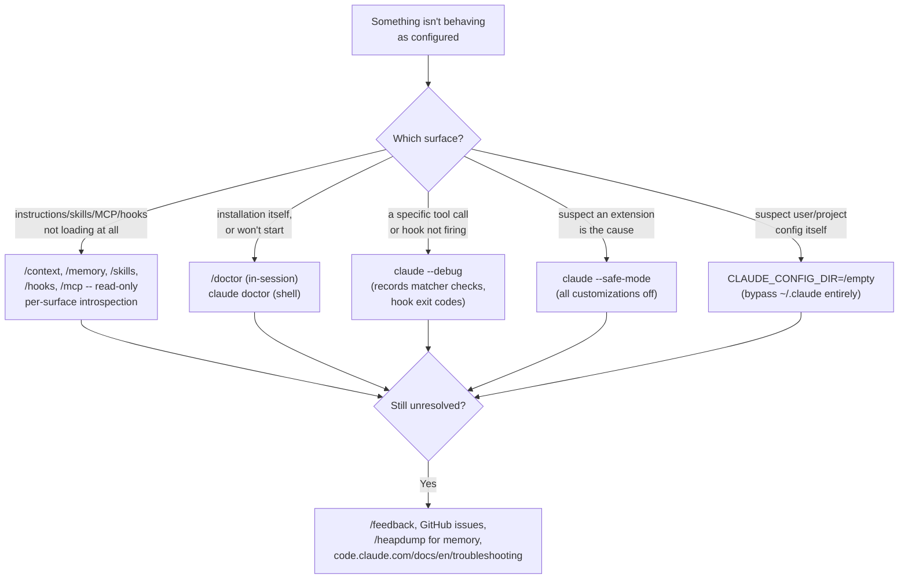
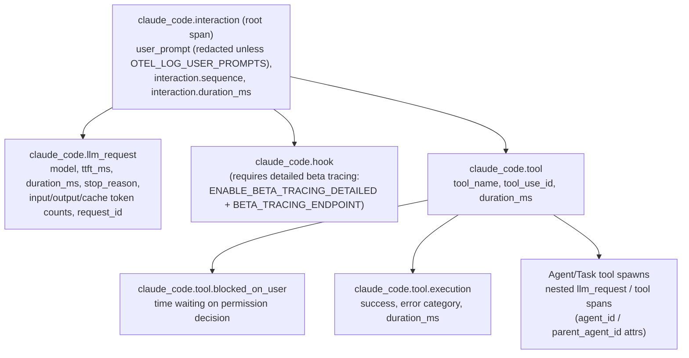
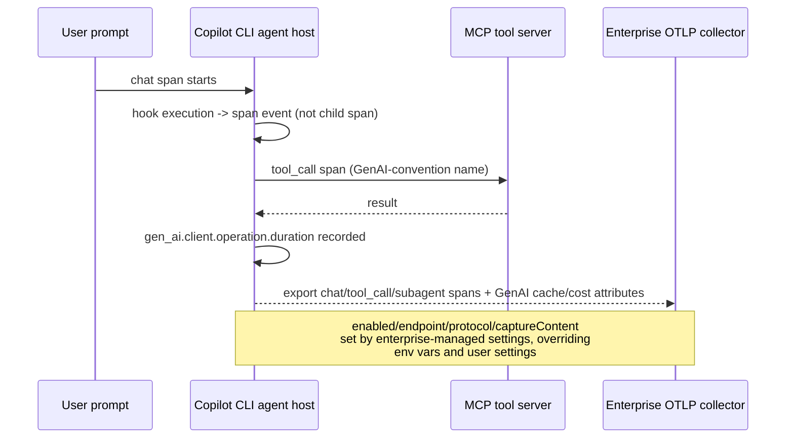
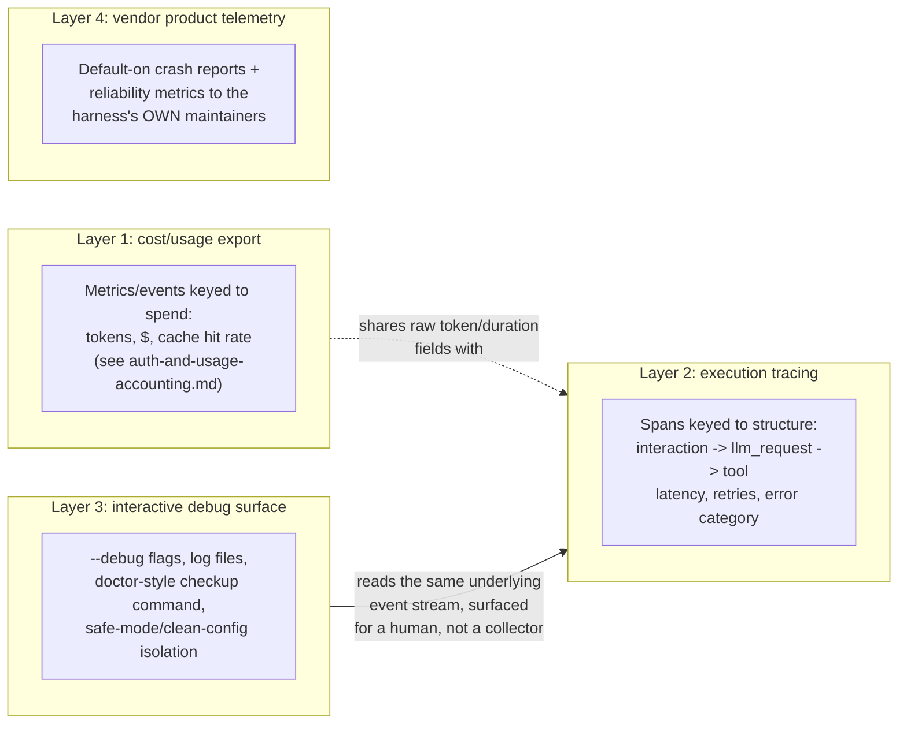

# Observability and self-diagnostics

Every harness examined in this book emits *some* signal about its own execution beyond
the conversation transcript itself -- a debug log line, a span, a crash report, a
diagnostics command. This page is about that layer specifically: how a harness lets a
developer or operator see what the harness's own process is doing (which tool fired,
which hook matched, which config file loaded, why a request failed, how long a step
took), as distinct from **what it costs**. [Auth & usage
accounting](auth-and-usage-accounting.md) §1.4 already documents Claude Code's
OpenTelemetry **metrics and log/event** catalogue in full (`claude_code.token.usage`,
`claude_code.cost.usage`, `claude_code.api_request`, the four `OTEL_LOG_*` content
gates) -- that catalogue is priced-and-billed-oriented: every metric and event in it
exists to answer "how much did this session spend, and on what." This page does not
repeat that catalogue; it cross-references it precisely and covers the two things that
catalogue does not: (1) Claude Code's separate, less mature **traces** signal, whose
spans model *execution structure* (interaction -> LLM request -> tool -> tool
execution) rather than spend, and (2) the debugging/diagnostic surface every harness
exposes for a human to answer "why did the harness itself just do that, or fail to do
that" -- debug flags, log files, doctor-style installation checkups, and the vendor's
own default telemetry about the harness's reliability, which is a different audience
(the harness's own engineering team) than a customer's OTel collector.

The general vocabulary this page assumes -- what a "span," a "trace," and "distributed
tracing" mean, and why an agentic system with tool calls and subagents is a natural fit
for tracing rather than flat logging -- is not re-derived here; it is the same
OpenTelemetry-standard vocabulary used throughout this book's own citations (see
[MCP supply-chain trust/vetting](mcp-supply-chain-trust.md) and
[auth-and-usage-accounting.md](auth-and-usage-accounting.md) for prior uses). This page
treats it as background, not something to teach from scratch.

## 1. Claude Code

### 1.1 Debug flags, log files, and the debug-log format

VERIFIED (`code.claude.com/docs/en/cli-reference`, fetched this session): `claude
--debug` enables debug mode; `--debug='category1,category2'` filters to specific
categories (for example `--debug='mcp,startup'`), and a leading `!` negates a category
(`--debug='!1p'`). `--debug-file <path>` writes debug logs to a specific file, implicitly
turns debug mode on, and takes precedence over the `CLAUDE_CODE_DEBUG_LOGS_DIR`
environment variable. `--safe-mode` starts a session with every customization disabled
(`CLAUDE.md`, skills, plugins, hooks, MCP servers, custom commands, themes, keybindings)
so a misbehaving extension can be ruled out by comparison, and sets the
`CLAUDE_CODE_SAFE_MODE` environment variable for the session. `claude doctor` (run from
the shell, not inside a session) prints read-only installation and settings diagnostics
without starting a session at all -- the shell-level escape hatch for when `claude`
won't even launch.

VERIFIED (`code.claude.com/docs/en/debug-your-config`, fetched this session): inside a
running session, `/debug [issue]` enables debug logging for that session and prompts
Claude to diagnose the problem itself using the log output and settings paths as
context -- a self-referential debugging affordance distinct from the shell-level
`--debug` flag. The same page gives a concrete debug-log location and workflow: when an
MCP server connects but reports zero tools, the documented recovery is to run `claude
--debug=mcp` and read the server's stderr in the debug log at
`~/.claude/debug/<session-id>.txt`. Starting a session with `claude --debug` and
triggering the tool call in question causes the debug log to record, per the docs,
"each event, which matchers were checked, and the hook's exit code and output" for
hooks specifically -- i.e. the debug log is also the mechanism for watching hook
matcher evaluation live, cross-referenced against
[hooks-lifecycle-extensibility.md](hooks-lifecycle-extensibility.md)'s own fuller
treatment of hook semantics (this page does not re-derive matcher syntax or the
exit-code-2-blocks rule, only how to *observe* them).

### 1.2 `/doctor` and the other built-in introspection commands

VERIFIED ([built-in-skills.md](built-in-skills.md) §1, already documented in this book,
cross-referenced rather than repeated): `/doctor` ships as a bundled skill present in
every session (with a `claude doctor` shell-level equivalent, per §1.1 above), performing
a "setup checkup: installation health, unused skills/MCP servers/plugins, slow hooks,
newer-version checks, `CLAUDE.md` deduplication," and is the sole bundled skill that
stays typable even when `disableBundledSkills` turns every other bundled skill off.
VERIFIED (`code.claude.com/docs/en/debug-your-config`, fetched this session, extending
built-in-skills.md's account): from the terminal, `claude doctor` prints the same class
of diagnostics without starting a session; from v2.1.206 onward `/doctor` additionally
checks for and proposes trimming checked-in `CLAUDE.md` content Claude could derive from
the codebase itself, applying fixes only after explicit confirmation. `/doctor` is
explicitly one tool in a small family of introspection commands the same page documents
together: `/context` (what is actually occupying the context window right now, broken
down by category), `/memory`, `/skills`, `/hooks`, `/mcp`, `/permissions`, and `/status`
each give a scoped, read-only view of one configuration surface, letting a user
distinguish "the file didn't load" from "it loaded from the wrong scope" from "another
file overrode it" without needing to read source or guess.

VERIFIED (`code.claude.com/docs/en/debug-your-config`, fetched this session): beyond the
per-surface commands, the docs describe a "test against a clean configuration"
escalation path -- `CLAUDE_CONFIG_DIR=/tmp/claude-clean claude` launched from a directory
with no `.claude` folder, `.mcp.json`, or `CLAUDE.md` bypasses everything under the
normal `~/.claude` directory (managed settings still apply, since they live outside
`~/.claude`); if a problem disappears there, the cause is somewhere in the user's own
`~/.claude` or project `.claude` files, isolated by reintroducing them one at a time.

VERIFIED (`code.claude.com/docs/en/troubleshooting`, fetched this session): a dedicated
performance/stability page documents `/heapdump` for memory-growth diagnosis -- typing
it in full (it doesn't appear in the command menu) writes a JavaScript heap snapshot
(`<session-id>.heapsnapshot`) and a memory-statistics file
(`<session-id>-diagnostics.json`) to the desktop, prints a summary in the conversation
(resident set size, JS heap, array buffers, unaccounted native memory, and any detected
leak indicators such as an unusually high open-handle count), and explicitly warns that
the `.heapsnapshot` file "contains every string in the process, including your full
conversation and credentials" and should never be attached to a public issue -- only the
`-diagnostics.json` file is safe to attach to a GitHub issue. The same page documents
`USE_BUILTIN_RIPGREP=0` plus a system `ripgrep` install as the fix when the bundled
search binary can't run on a given platform, with `claude doctor`'s "Search" line as the
way to confirm the switch took effect.

### 1.3 OpenTelemetry traces (beta) -- structural, not cost-oriented

VERIFIED (`code.claude.com/docs/en/monitoring-usage`, fetched this session): distinct
from the metrics/logs signals [auth-and-usage-accounting.md](auth-and-usage-accounting.md)
§1.4 already documents, Claude Code ships a third OTel signal type -- **traces** -- gated
behind its own separate opt-in: `CLAUDE_CODE_ENABLE_TELEMETRY=1` *and*
`CLAUDE_CODE_ENHANCED_TELEMETRY_BETA=1` (or its alias
`ENABLE_ENHANCED_TELEMETRY_BETA`) together, plus `OTEL_TRACES_EXPORTER` set to `otlp`,
`console`, or `none`. Standard OTel OTLP configuration applies (`OTEL_EXPORTER_OTLP_
ENDPOINT`/`_PROTOCOL`, with trace-specific overrides `OTEL_EXPORTER_OTLP_TRACES_
ENDPOINT`/`_PROTOCOL`/`_HEADERS`, and `OTEL_TRACES_EXPORT_INTERVAL` for the span batch
export interval, default 5000ms).

Span attributes are the structural counterpart to the cost-oriented event fields already
documented in auth-and-usage-accounting.md's `claude_code.api_request` event: the
`claude_code.llm_request` span carries `ttft_ms` (time to first token), `attempt` count,
`response.has_tool_call`, and the OTel GenAI semantic-convention fields `gen_ai.system`,
`gen_ai.request.model`, `gen_ai.response.id`, and `gen_ai.response.finish_reasons`
alongside the same token-count fields the cost event reports -- the same numbers serve
both a spend dashboard and a latency/reliability trace, but only the trace's span
hierarchy and duration fields let an operator see *where in the turn* time was spent, or
which specific tool call in a chain of subagent calls was slow, which a flat metrics
export cannot represent. The same content-gating environment variables auth-and-usage-
accounting.md documents for events (`OTEL_LOG_TOOL_DETAILS`) also gate span attributes
such as `file_path`, `full_command`, and `skill_name` on the `claude_code.tool` span, and
a separate `OTEL_LOG_TOOL_CONTENT=1` additionally attaches a `tool.output` span event
with truncated (60KB default) tool input/output bodies.

VERIFIED (same source): tracing propagates using the **W3C trace context** standard.
When tracing is active, Bash and PowerShell subprocesses Claude Code spawns
automatically inherit a `TRACEPARENT` environment variable carrying the active tool
span's context, so a subprocess that itself understands W3C trace context can parent its
own spans under the same trace -- genuine end-to-end distributed tracing through scripts
Claude Code runs, not merely tracing of Claude Code's own internals. On the inbound side,
in Agent SDK and `-p` (print/non-interactive) sessions, Claude Code reads `TRACEPARENT`/
`TRACESTATE` from its own environment when starting each interaction span, letting an
embedding application's trace context become the parent of Claude Code's own spans;
interactive sessions deliberately ignore inbound `TRACEPARENT` "to avoid accidentally
inheriting ambient values from CI or container environments." Outbound, each model
request carries a `traceparent` header to the Anthropic API (recording the API's
`traceresponse` header back as a span link) and to outbound HTTP MCP requests, but by
default *not* to a custom `ANTHROPIC_BASE_URL` proxy unless
`CLAUDE_CODE_PROPAGATE_TRACEPARENT=1` is set, "since some proxies reject unrecognised
headers" -- and never to third-party model providers regardless of that setting.

VERIFIED (same source): the docs are explicit that this is a **beta, off-by-default,
unstable** signal -- distinct from the stable metrics/logs catalogue auth-and-usage-
accounting.md documents. The `claude_code.hook` span specifically requires additional,
separate gating beyond the base trace opt-in (`ENABLE_BETA_TRACING_DETAILED=1` and
`BETA_TRACING_ENDPOINT`), and in interactive CLI sessions detailed hook tracing further
requires organization allowlisting (Agent SDK and non-interactive `-p` sessions are not
allowlist-gated). Several content-bearing hook-span attributes
(`system_prompt_preview`, `tool_input`, `response.model_output`) are documented as
explicitly outside the stable span schema and subject to change. Two dated correctness
fixes are called out directly in the docs rather than left to changelog archaeology:
before v2.1.214, records emitted outside an active span's async context (such as inside
a permission-prompt callback) carried the wrong trace/span IDs; before v2.1.212, such
records carried no `trace_id`/`span_id` at all.

### 1.4 Default vendor-side telemetry -- a third, non-customer-configured layer

VERIFIED (`code.claude.com/docs/en/data-usage`, fetched this session): independent of
both the customer-configured OTel metrics/logs (auth-and-usage-accounting.md §1.4) and
the customer-configured OTel traces (§1.3 above), Claude Code sends its own **default
operational telemetry to Anthropic** about the harness's own reliability -- a third
observability layer with a different audience (Anthropic's own engineering team
monitoring the product, not a customer's observability stack). The docs name two kinds:
"**Metrics**: latency, reliability, and usage patterns, sent to Anthropic and to
third-party logging infrastructure over TLS. Metrics never include your code, prompts,
or file paths," opted out of via `DISABLE_TELEMETRY=1`; and "**Error reports**: error
messages and stack traces from Claude Code's own internals, sent to a third-party error
tracking service over TLS," with "known patterns of secrets, file paths, email
addresses, and other personal information" redacted before anything leaves the machine,
opted out of via `DISABLE_ERROR_REPORTING=1`. Error reporting specifically is on only
when *all* of: the user is signed in with a Claude Pro or Max subscription, running
v2.1.198 or later, connecting directly to the Claude API, and the organization has no
zero-data-retention or HIPAA agreement -- meaning most Team/Enterprise/API and every
Bedrock/Vertex/Foundry/AWS-native session has this specific stream off by default, per
the docs' own provider-by-provider default table (metrics default *on* for direct
Claude-API use, default *off* for Vertex/Bedrock/Foundry/Claude-Platform-on-AWS unless
the corresponding `CLAUDE_CODE_USE_*` flag is set). `CLAUDE_CODE_DISABLE_NONESSENTIAL_
TRAFFIC` turns off all of it (plus session-quality surveys) in one setting, and also
disables the feature-flag evaluation that Remote Control depends on, a coupling the docs
flag explicitly (`DISABLE_TELEMETRY` shares that side effect; `DISABLE_ERROR_REPORTING`
does not). The `/feedback`, `/bug`, and `/share` commands are a related but conceptually
different, explicitly user-initiated channel: they upload a copy of conversation
history (redacted for known secret/token patterns) only when a user actively runs the
command, retained up to 5 years per data-usage's own retention table, with a local-
archive fallback under `~/.claude/feedback-bundles/` on third-party-provider or
credential-less sessions where nothing leaves the machine automatically.

This distinction matters for a from-scratch harness builder (§4 below): a mature
harness's observability surface is not one pipe but (at minimum) three separable ones --
customer-configured cost/usage export, customer-configured execution tracing, and the
vendor's own default product-reliability telemetry -- each with its own opt-out, its own
audience, and its own default-on/off posture that should be stated as plainly as Claude
Code's data-usage page states it, not left implicit.

## 2. GitHub Copilot CLI

### 2.1 Debug flags and log files

VERIFIED (`github.com/github/copilot-cli`'s own `changelog.md`, fetched via `gh api`
this session, full 2,979-line file): a persistent `log_level` option was added to
`~/.copilot/config` with possible values `["none", "error", "warning", "info", "debug",
"all", "default"]`, described as "improved debug log collection convenience." A
`--print-debug-info` flag was added later to "display version, terminal capabilities,
and environment variables" for quick environment-mismatch triage. `--log-dir` is a
documented flag whose relative-path resolution the changelog records fixing (resolving
against a session's saved working directory rather than the launch directory, once
`copilot --continue` began restoring the saved cwd). One dated entry records "Collect
debug logs without truncating large files or dropping multiline secrets" as a fix,
implying debug-log collection was a pre-existing, if imperfect, capability well before
that fix landed. VERIFIED (`docs.github.com/en/copilot/troubleshooting-github-copilot/
viewing-logs-for-github-copilot-in-your-environment`, fetched this session): this
official troubleshooting page is written primarily around IDE-integration log viewing
(JetBrains, Visual Studio, VS Code, Vim/Neovim, Xcode) and its one direct Copilot-CLI
reference is the **Agent Debug Panel** -- "shows a chronological event log of agent
interactions during a Copilot CLI session" -- surfaced through the JetBrains
integration's own debug-file-logging toggle (Tools > Copilot > Chat > "Enable Agent
debug File Logging"), not through a documented Copilot-CLI-native flag on that specific
page. This is a real, flagged documentation gap: `docs.github.com` does not carry a
CLI-native equivalent of Claude Code's `code.claude.com/docs/en/troubleshooting` page at
the same level of specificity as of this session; the changelog is the more precise
source for the CLI's own logging surface, consistent with this book's general finding
(see [packaging-distribution-and-self-update.md](packaging-distribution-and-self-update.md)
and [retries.md](retries.md)) that `github/copilot-cli`'s changelog is frequently more
authoritative for CLI-specific mechanics than `docs.github.com`'s prose docs, which skew
toward the IDE extension and the Copilot SDK.

### 2.2 OpenTelemetry -- genuinely spans, not just cost metrics, and enterprise-managed

This is the most consequential correction this page makes to the picture
auth-and-usage-accounting.md's Copilot section and [caching.md](caching.md) §1.6 leave
implicit: those pages document Copilot CLI's OTel export only through its **cost-shaped
GenAI attributes** (`gen_ai.usage.cache_read.input_tokens`,
`gen_ai.usage.cache_creation.input_tokens`, `gen_ai.usage.reasoning.output_tokens`).
VERIFIED (same `changelog.md`, fetched this session): Copilot CLI's OTel export is not
limited to those cost attributes -- it includes genuine execution-structure **spans**,
tracking closely with what Claude Code's beta traces model (§1.3 above), and shipped
earlier / with less of an explicit beta label than Claude Code's own tracing signal.
Dated entries read directly from the changelog: "OpenTelemetry monitoring: subagent
spans now use INTERNAL span kind, and chat spans include a `github.copilot.
time_to_first_chunk` attribute (streaming only)" (v1.0.19, 2026-04-06); "OpenTelemetry
output aligns with GenAI semantic conventions: MCP tool calls now use standard
`tool_call` spans, and a new `gen_ai.client.operation.duration` metric tracks tool
execution time"; "OpenTelemetry: chat spans after a successful compaction carry
`gen_ai.conversation.compacted=true`, and the summary is emitted as a `CompactionPart`
in `gen_ai.input.messages`"; and "OTEL hook executions are now recorded as span events
instead of child spans, reducing trace clutter" -- a direct structural analogue to
Claude Code's `claude_code.hook` span, with the changelog itself documenting a
span-granularity design *reversal* (hooks demoted from child spans to span events)
that Claude Code's own docs do not record making in the other direction.

VERIFIED (`github.blog/changelog/2026-07-08-enterprise-managed-opentelemetry-export-for-
vs-code-and-cli`, fetched this session, and `docs.github.com/en/copilot/reference/
enterprise-administrators/enterprise-managed-settings`, fetched this session): as of
July 2026, an enterprise-managed `telemetry` settings block routes OTel export for both
the VS Code Copilot Chat extension *and* "the agent host process that powers Copilot
CLI" to an administrator-chosen collector. The documented sub-keys are `enabled`
(on/off), `endpoint` (the OTLP collector URL), `protocol` (`http/json` or
`http/protobuf`; the changelog post additionally names `otlp-http`/`otlp-grpc` as
transport choices), `captureContent` (whether prompt/response/tool content is included
at all) and `lockCaptureContent` (prevents a user from overriding that at their own
scope), `serviceName`, `resourceAttributes`, and `headers` (for exporter authentication).
Docs state plainly that "this property is supported for Copilot CLI and VS Code" but
explicitly *not* for the standalone GitHub Copilot app or JetBrains IDEs, and that an
MDM-managed value always wins over environment variables and user-level settings --
the same managed-settings-overrides-everything precedence pattern
[configuration.md](configuration.md) already documents for Copilot CLI's non-telemetry
settings, extended here to the telemetry surface specifically.

### 2.3 Debugging commands and adjacent tooling

VERIFIED (same changelog): `/feedback` submits a report (with a saved-bundle fallback
to `TEMP` when the working directory isn't writable, per a later hardening entry), and
`--print-debug-info` is the closest Copilot-CLI-native analogue to Claude Code's `claude
doctor` -- a version/environment/terminal-capability dump rather than a full
configuration-health checkup; this book found no Copilot CLI command that performs the
broader "check installation health, unused MCP servers, stale settings files" class of
audit `/doctor` performs for Claude Code, and flags that as a real, not merely
undocumented, capability gap rather than assuming an equivalent exists unexamined.
BEST CURRENT UNDERSTANDING, UNCONFIRMED: the separate `gh-debug-cli` tool found via
`copilot-extensions/gh-debug-cli` on GitHub (a CLI for locally chatting with an agent for
faster feedback, with its own `DEBUG`/`TRACE`/`NONE` log levels, `TRACE` printing raw
HTTP responses) reads as a developer-facing debugging utility adjacent to Copilot CLI's
own agent-extension ecosystem rather than a documented, first-party diagnostic surface
of Copilot CLI itself -- named here as a lead worth flagging, not asserted as part of
Copilot CLI's own observability surface, since it was not independently corroborated by
`docs.github.com` or the `copilot-cli` changelog this session.

## 3. OpenCode

### 3.1 Logging flags -- fully documented, source-unverified this session

VERIFIED (`opencode.ai/docs/troubleshooting/`, fetched this session): `opencode
--log-level DEBUG` raises verbosity; `opencode --print-logs` streams log output directly
to the terminal rather than only to a file, useful specifically for diagnosing startup
failures before a log file would even be readable; combining both
(`opencode --print-logs --log-level DEBUG 2> log_file.txt`) is the documented way to
capture a debug session to a file. Log files are written to `~/.local/share/opencode/
log/` on macOS/Linux and the Windows-path equivalent under `%USERPROFILE%\.local\share\
opencode\log`, named by timestamp (for example `2025-01-09T123456.log`), with the docs
stating the ten most recent log files are retained and older ones pruned automatically.
This is documentation-level grounding only: this session did not locate OpenCode's
logger implementation in `packages/opencode/src/util/` (a targeted directory listing on
the `dev` branch turned up no `log.ts`-equivalent file there), so the exact rotation/
retention mechanism and log-record schema are not independently source-verified the way
this book source-verifies other OpenCode subsystems -- flagged as a gap rather than
extrapolated from the docs' own claim.

### 3.2 No native OpenTelemetry -- a third-party plugin ecosystem fills the gap

VERIFIED (`gh pr view 5245 --repo anomalyco/opencode`, fetched this session): a pull
request titled "feat: integrate OpenTelemetry," proposing to "add back" OTel
dependencies and instrumentation, remains **open and unmerged** as of this session
(`"state": "OPEN"`, `"mergedAt": null`) -- the PR's own body ("wanted to add back some
code to the project") implies OTel support may have existed in some earlier, now-removed
form, though this session did not independently confirm that history. A `gh api
search/code` sweep for `opentelemetry` scoped to `anomalyco/opencode` returned zero
hits, corroborating that no OTel instrumentation is currently present in the core
repository. This is the same negative-finding shape this book already documented for
OpenCode's native RAG support in
[context-retrieval-and-agentic-search.md](context-retrieval-and-agentic-search.md): a
capability repeatedly requested and partly attempted upstream, never merged into core,
with the gap filled entirely by community plugins instead. BEST CURRENT UNDERSTANDING,
UNCONFIRMED (from WebSearch results describing, but not independently fetched-and-
verified in full this session, third-party plugin READMEs): community packages such as
`@devtheops/opencode-plugin-otel` and `opencode-telemetry-plugin` export OTLP
traces/metrics/logs by hooking OpenCode's plugin event bus
([hooks-lifecycle-extensibility.md](hooks-lifecycle-extensibility.md) §3's `event` bus
and `packages/plugin/src/index.ts` `Hooks` interface -- already source-verified in this
book -- is the plausible mechanism such a plugin would use, though this session did not
open the plugin's own source to confirm it uses exactly that surface), configured
through `opencode.json` or environment variables with keys such as `enabled`,
`endpoint`, `protocol`, `metricPrefix`, `resourceAttributes`, and `disabledTraces`
mirroring the shape of Claude Code's and Copilot CLI's own OTel configuration
vocabulary -- named as a lead for a reader who needs this today, not as a claim about
OpenCode's own shipped behavior.

### 3.3 No doctor-equivalent diagnostic command found

VERIFIED (`opencode.ai/docs/troubleshooting/`, fetched this session): the troubleshooting
page's own guidance is manual -- check the log file, check config precedence, retry with
a raised log level -- and does not name any single diagnostic command comparable to
`claude doctor`/`/doctor` or even Copilot CLI's narrower `--print-debug-info`. This is
stated as an absence found, not proven: this book's general practice (see
[mcp-supply-chain-trust.md](mcp-supply-chain-trust.md)'s absence findings) is to flag a
missing feature as "not found this session" rather than "does not exist," since OpenCode
ships new CLI surface area quickly and a `dev`-branch-only feature could exist without
yet appearing in the published docs.

## 4. Synthesis: instrumenting a from-scratch harness for observability

Read across all three harnesses, a from-scratch harness builder should treat
observability not as one feature but as (at least) four separable layers, each with a
different question it answers, a different default posture, and a different consumer --
conflating them, as an early design might, produces exactly the kind of ambiguity this
page had to untangle for Copilot CLI's OTel export (cost attributes and execution spans
sharing one pipe without the docs distinguishing them by name):

**Layer 1 (cost/usage export)** and **Layer 2 (execution tracing)** are easy to conflate
because they often share the same transport (OTLP) and even overlapping raw fields
(token counts, duration), as Copilot CLI's `gen_ai.usage.*` cache attributes and its
`tool_call`/subagent spans both being "OpenTelemetry" demonstrate concretely (§2.2). The
design lesson worth taking from Claude Code's split into two independently-gated env
vars (`CLAUDE_CODE_ENABLE_TELEMETRY` for metrics/logs, plus
`CLAUDE_CODE_ENHANCED_TELEMETRY_BETA` for traces, §1.3) is that a from-scratch harness
should make the same distinction structurally, not just documentally: a span's *purpose*
is to answer "where did time go, and in what order did things happen" (which requires
parent/child structure and durations), while a cost event's purpose is to answer "how
much did this cost, broken down by what" (which requires accurate categorical
attribution, not causal structure) -- a harness that only ever emits one flat stream
tagged with both kinds of attribute makes both jobs harder for the consumer trying to
build a dashboard for either question alone.

**Layer 3 (interactive debug surface)** is the layer every harness examined here treats
as table stakes, but with real depth differences worth building toward deliberately
rather than accreting ad hoc: Claude Code's family of scoped read-only introspection
commands (`/context`, `/hooks`, `/mcp`, `/permissions`, `/status`) each answer one
narrow "what actually loaded, from where" question, composed with an isolation ladder
(`--safe-mode` to rule out extensions, then `CLAUDE_CONFIG_DIR` pointed at an empty
directory to rule out the user's own config entirely) that lets a user bisect a
misbehavior's cause without needing a single omniscient diagnostic command to already
know what's wrong (§1.1-1.2). A from-scratch harness's own `--debug` output should, per
the concrete behavior Claude Code documents, be structured enough that a support agent
or an automated system (as Claude Code's own `/debug [issue]` does, feeding the debug
log back to the model itself) can read *what was checked and why it did or didn't
match*, not merely a firehose of internal state.

**Layer 4 (vendor product telemetry)** is the layer most likely to be skipped by a
from-scratch harness built for a single team's internal use, but Claude Code's own
data-usage docs (§1.4) show the reasoning for including it even then: separating
"is my product reliable across all users" telemetry from a customer's own configured
observability pipeline lets the two evolve independently -- a customer can turn off
their own OTel export without blinding the harness's own maintainers to a crash pattern,
and the harness's own crash-reporting default can be redaction-hardened and opted out of
independently (`DISABLE_ERROR_REPORTING` vs. `DISABLE_TELEMETRY` as two separate levers)
without requiring the customer to also give up their own tracing. A harness with no
such layer at all -- the state this session found for OpenCode's core, where the entire
observability surface beyond flat debug logs is either absent or delegated to
third-party plugins (§3.2) -- trades that separation for simplicity, at the cost of the
maintainers themselves having no first-party signal of how their own software behaves
in the field short of what users choose to report manually.

## 5. Sources

**Claude Code (authoritative for Claude Code's documented behavior only):**
- `code.claude.com/docs/en/cli-reference`, fetched this session -- `--debug`,
  `--debug-file`, `--safe-mode`, `claude doctor`, `--output-format` flag syntax.
- `code.claude.com/docs/en/debug-your-config`, fetched this session in full -- `/context`,
  `/doctor`, `/debug`, `/status`, `/hooks`, `/mcp` introspection commands, the debug-log
  path for MCP (`~/.claude/debug/<session-id>.txt`), safe-mode and `CLAUDE_CONFIG_DIR`
  isolation, hook-matcher troubleshooting table.
- `code.claude.com/docs/en/troubleshooting`, fetched this session in full --
  `/heapdump`, `USE_BUILTIN_RIPGREP`, `/feedback`, GitHub-issues escalation path.
- `code.claude.com/docs/en/monitoring-usage`, fetched this session -- the "Traces
  (beta)" section in full: env vars, span hierarchy, per-span attribute tables, W3C
  `traceparent` propagation rules, beta/allowlisting caveats, dated correctness fixes
  (v2.1.212, v2.1.214).
- `code.claude.com/docs/en/data-usage`, fetched this session in full -- the "Telemetry
  services" and "Default behaviors by API provider" sections: `DISABLE_TELEMETRY`,
  `DISABLE_ERROR_REPORTING`, `CLAUDE_CODE_DISABLE_NONESSENTIAL_TRAFFIC`, provider-by-
  provider default table, `/feedback`/`/bug`/`/share` data-handling.
- [built-in-skills.md](built-in-skills.md) and
  [auth-and-usage-accounting.md](auth-and-usage-accounting.md) (this book's own prior
  pages), cross-referenced for `/doctor`'s bundled-skill status and the metrics/logs
  OTel catalogue, respectively -- not re-derived here.

**GitHub Copilot CLI (authoritative for Copilot CLI's documented behavior and its own
repository's real change history only):**
- `github.com/github/copilot-cli`'s `changelog.md`, fetched in full (2,979 lines) via
  `gh api repos/github/copilot-cli/contents/changelog.md` this session -- `log_level`
  config key, `--print-debug-info`, `--log-dir` cwd-resolution fix, and every dated
  OpenTelemetry span/metric entry cited in §2.2 (subagent `INTERNAL` span kind,
  `tool_call` spans, `gen_ai.client.operation.duration`, compaction-marking spans, the
  hook-span-to-span-event demotion).
- `docs.github.com/copilot/troubleshooting-github-copilot/viewing-logs-for-github-
  copilot-in-your-environment`, fetched this session -- scoped explicitly as
  IDE-centric, with the Agent Debug Panel as its one direct Copilot-CLI reference.
- `docs.github.com/en/copilot/how-tos/troubleshoot-copilot`, fetched this session --
  confirmed as a general hub with no CLI-specific debug/verbose/log-location content.
- `github.blog/changelog/2026-07-08-enterprise-managed-opentelemetry-export-for-vs-
  code-and-cli`, fetched this session -- the enterprise-managed OTel export feature
  announcement.
- `docs.github.com/en/copilot/reference/enterprise-administrators/enterprise-managed-
  settings`, fetched this session -- the `telemetry` settings block's exact sub-keys
  (`enabled`, `endpoint`, `protocol`, `captureContent`, `lockCaptureContent`,
  `serviceName`, `resourceAttributes`, `headers`) and its Copilot-CLI-and-VS-Code-only
  scope statement.
- `github.com/copilot-extensions/gh-debug-cli` (named via WebSearch, not independently
  opened and read this session) -- cited only as an unconfirmed lead, per §2.3.

**OpenCode (authoritative for OpenCode's own documented behavior; `dev`-branch caveat
applies to any source-code claim):**
- `opencode.ai/docs/troubleshooting/`, fetched this session -- `--log-level`,
  `--print-logs`, log file location/naming/retention.
- `gh pr view 5245 --repo anomalyco/opencode`, fetched this session -- the open,
  unmerged "feat: integrate OpenTelemetry" PR, confirming no native OTel support is
  currently merged.
- `gh api "search/code?q=repo:anomalyco/opencode+..."` and a directory listing of
  `packages/opencode/src/util` on the `dev` branch, both run this session -- corroborating
  zero OTel-related source hits and no located logger-implementation file, an honestly
  flagged gap rather than a claim of thorough source coverage.
- Community plugin names (`@devtheops/opencode-plugin-otel`, `opencode-telemetry-
  plugin`) surfaced via WebSearch only, not independently fetched and read this
  session -- held explicitly to BEST CURRENT UNDERSTANDING, UNCONFIRMED per §3.2.
- [hooks-lifecycle-extensibility.md](hooks-lifecycle-extensibility.md) (this book's own
  prior, source-verified page), cross-referenced for the plugin event-bus mechanism a
  third-party OTel plugin would plausibly use.
