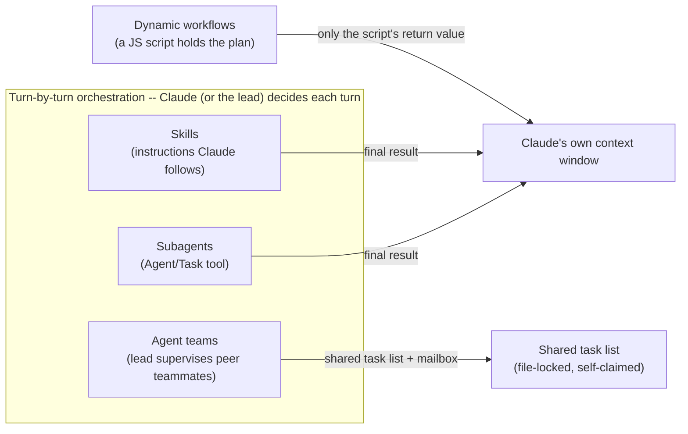
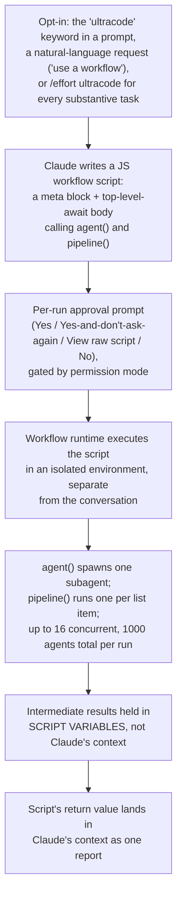
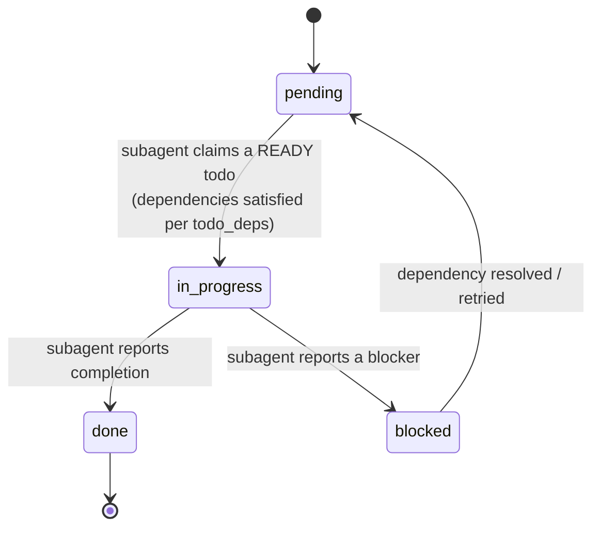
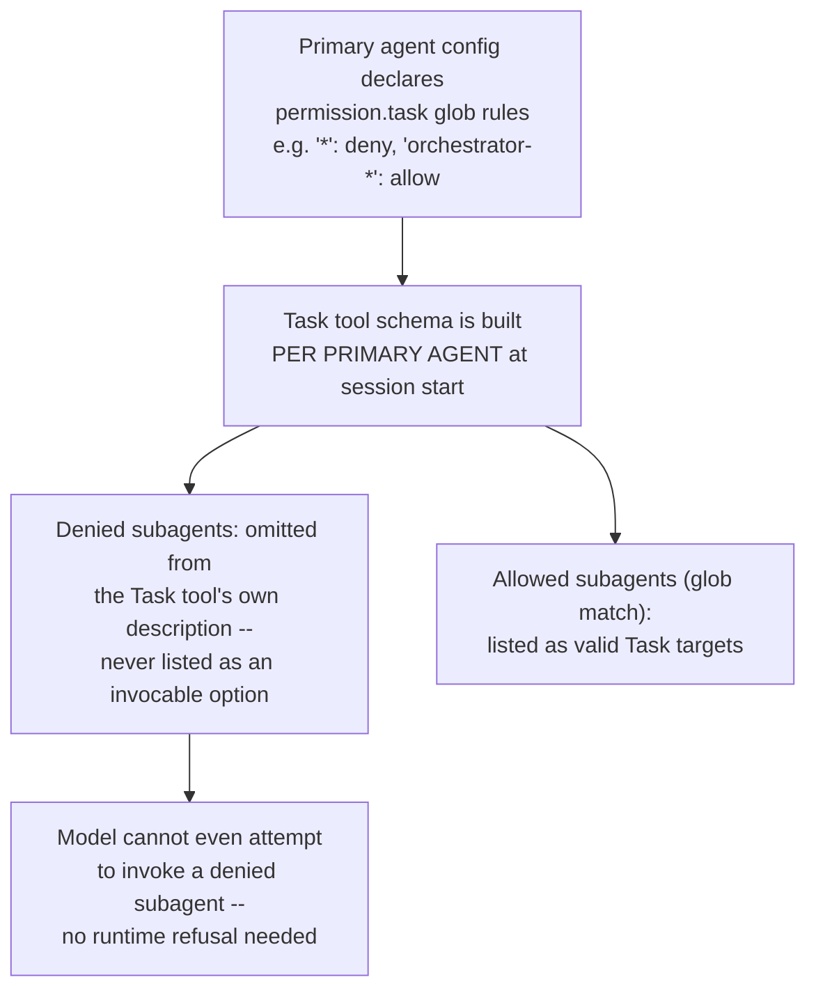
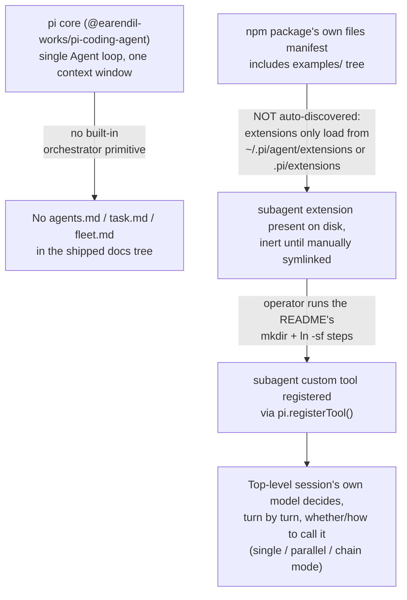
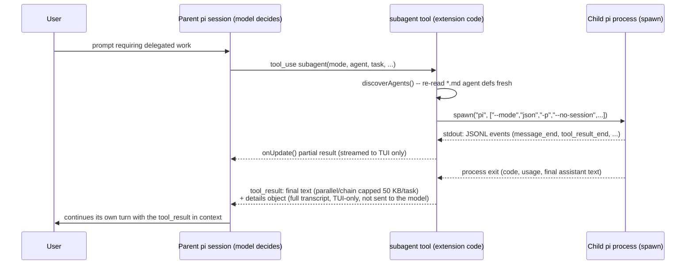
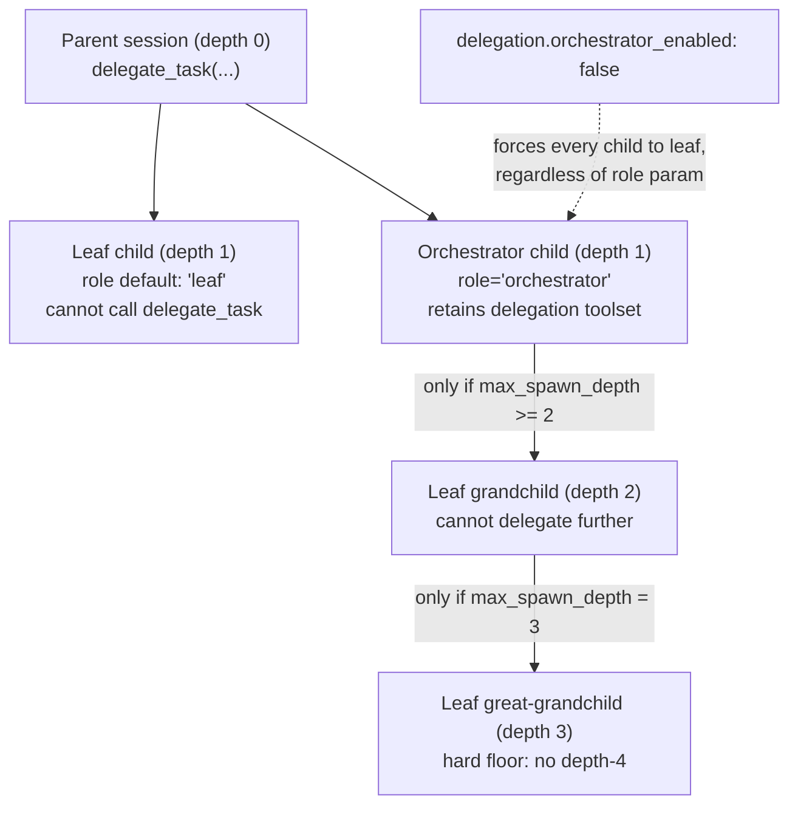
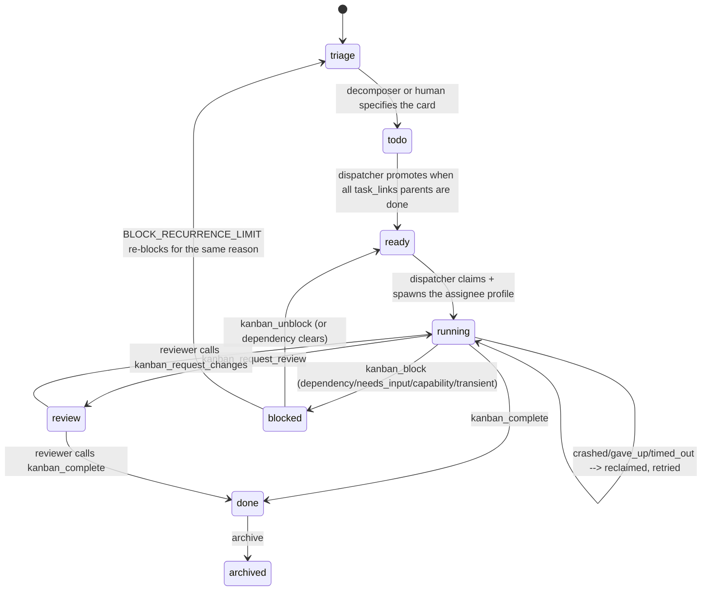
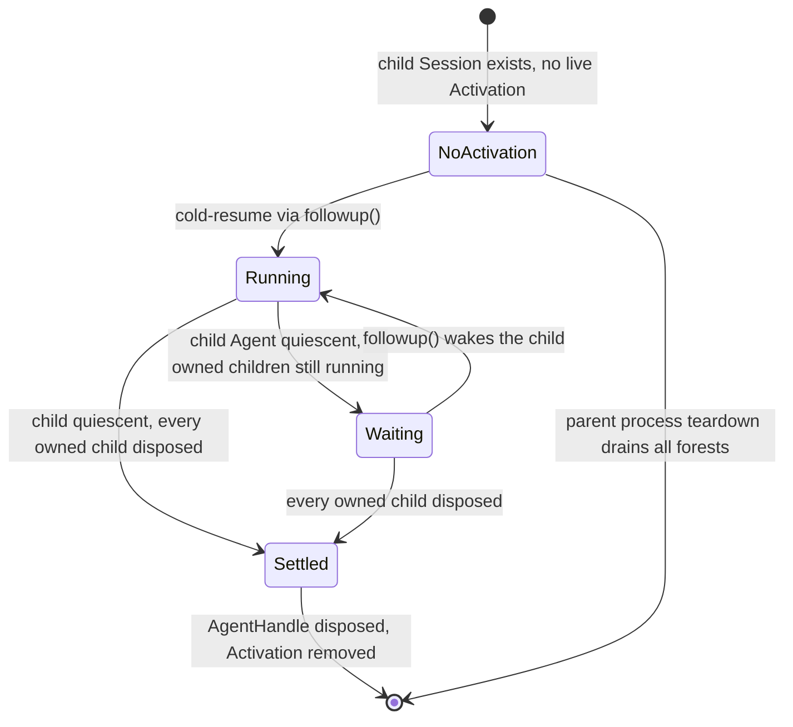
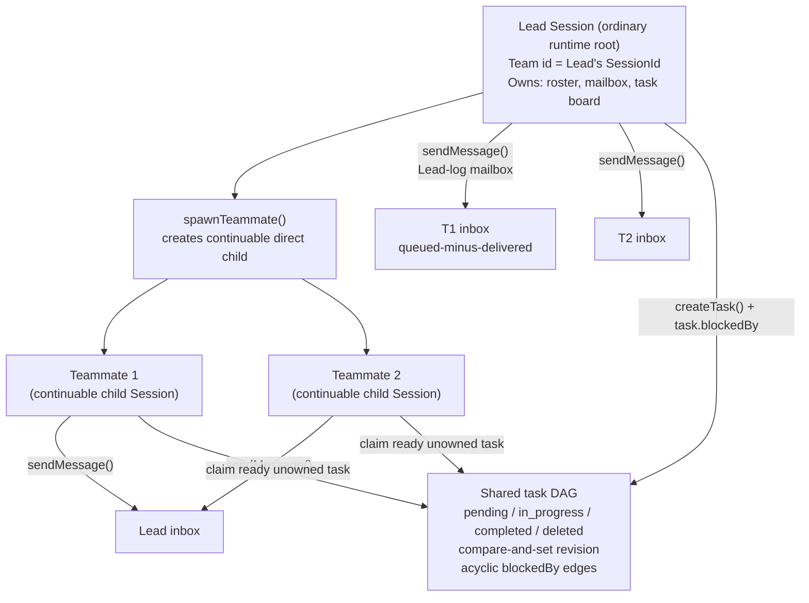

# Orchestration -- who holds the plan when multiple agents work one task

**Scope note.** [handoff-mechanism.md](handoff-mechanism.md) already covers
the mechanics of a single handoff -- what crosses the boundary when one
agent delegates to one subagent, teammate, or cloud agent. This page asks
a different question, one level up: once a task needs *several* agents
working together, what actually holds the plan for how they're divided,
sequenced, and reassembled -- a model deciding turn by turn, a lead agent
supervising peers, a config-declared allow/deny list, or a script the
runtime executes outside any conversation at all? Two adjacent topics
this page deliberately leaves for their own pages when written: **fan-out
(subagent dispatch)** -- the mechanics of *launching* several agents at
once (batching, concurrency mechanics) -- and **inter-agent messaging**
-- the wire format and delivery mechanics of messages once agents are
already talking to each other. This page is about the coordinating layer
itself: what decides the division of labor and what tracks its state.

---

## 0. The general concept: the orchestrator/manager pattern

VERIFIED (`huggingface.co/learn/agents-course/en/unit2/smolagents/multi_agent_systems`,
Hugging Face Agents Course, fetched 2026-07-31 -- authoritative for
GENERAL agent-engineering vocabulary, not for any one harness's specific
behavior): "Multi-agent systems enable specialized agents to collaborate
on complex tasks, improving modularity, scalability, and robustness," and
"A multi-agent system consists of multiple specialized agents working
together under the coordination of an Orchestrator Agent." The course
uses **manager agent**, **orchestrator agent**, and **coordinator**
interchangeably for the coordinating role, and **managed agents** or
**worker agents** for the agents it dispatches to; the motivating
rationale it gives is memory efficiency ("separating memories reduces the
count of input tokens at each step, thus reducing latency and cost") and
focus ("each agent is more focused on its core task, thus more
performant"). This is the shared vocabulary the sections below map onto
-- each of the three products researched here names or implements
*something* that plays this coordinating role, but the three implementations
diverge sharply in whether that role is a conversational agent making
turn-by-turn choices, a config-declared permission boundary, or a script
running outside any model's context window at all.

---

## 1. Claude Code

Sources for this section: `code.claude.com/docs/en/workflows`,
fetched 2026-07-31. VERIFIED unless tagged otherwise.

### 1.1 The default case -- Claude itself is the turn-by-turn orchestrator

Every multi-agent primitive already documented in
[handoff-mechanism.md](handoff-mechanism.md) section 1 -- subagents, and
the peer-to-peer agent-team shape -- shares one property the Workflow
tool's own documentation states explicitly by contrast: in all of them,
"Claude is the orchestrator: it decides turn by turn what to spawn or
assign next, and every result lands in a context window." The docs lay
out this comparison directly as a table across four primitives
(subagents, skills, agent teams, and workflows -- reproduced here
verbatim because it is the single clearest primary-source statement of
what "holds the plan" means across Claude Code's whole multi-agent
surface):

| | Subagents | Skills | Agent teams | Workflows |
|---|---|---|---|---|
| What it is | A worker Claude spawns | Instructions Claude follows | A lead agent supervising peer sessions | A script the runtime executes |
| Who decides what runs next | Claude, turn by turn | Claude, following the prompt | The lead agent, turn by turn | The script |
| Where intermediate results live | Claude's context window | Claude's context window | A shared task list | Script variables |
| What's repeatable | The worker definition | The instructions | The team definition | The orchestration itself |
| Scale | A few delegated tasks per turn | Same as subagents | A handful of long-running peers | Dozens to hundreds of agents per run |
| Interruption | Restarts the turn | Restarts the turn | Teammates keep running | Resumable in the same session |



Agent teams (see [handoff-mechanism.md](handoff-mechanism.md) section
1.5 for the mailbox/plan-approval/shutdown mechanics) are, from this
page's coordination-layer angle, Claude Code's one primitive where the
orchestrator is explicitly a **different agent than the one you're
talking to** -- the lead -- and where the coordination artifact is not a
context window at all but a shared, file-locked task list that teammates
self-claim from, rather than waiting for the lead to assign work item by
item.

### 1.2 Dynamic workflows -- moving the plan into a script

VERIFIED (`code.claude.com/docs/en/workflows`): "A dynamic workflow is a
JavaScript script that orchestrates subagents at scale. Claude writes the
script for the task you describe, and a runtime executes it in the
background while your session stays responsive." This is Claude Code's
answer to the ceiling the turn-by-turn model runs into: "reach for a
workflow when a task needs more agents than one conversation can
coordinate, or when you want the orchestration codified as a script you
can read and rerun." Requires Claude Code v2.1.154 or later, available on
all paid plans plus Anthropic API/Bedrock/Google Cloud Agent
Platform/Microsoft Foundry access; on Pro it must be enabled from
`/config`.



**What a saved workflow script actually looks like** -- VERIFIED, quoted
directly from the docs' own example:

```javascript
export const meta = {
  name: 'audit-routes',
  description: 'Audit every route handler for missing auth checks',
}

const found = await agent('List every .ts file under src/routes/.', {
  schema: { type: 'object', required: ['files'], properties: { files: { type: 'array', items: { type: 'string' } } } },
})

const audits = await pipeline(found.files, file =>
  agent(`Audit ${file} for missing authentication checks.`, { label: file }),
)

return audits.filter(Boolean)
```

`agent()` spawns one subagent per call; `pipeline()` fans a callback out
across a list, one subagent per item -- this is the literal mechanism
behind "dozens to hundreds of agents per run" in the comparison table
above. The runtime enforces four constraints regardless of what the
script asks for: **no mid-run user input** (only agent permission
prompts can pause a run -- "for sign-off between stages, run each stage
as its own workflow"); **no direct filesystem or shell access from the
script itself** ("agents read, write, and run commands; the script
coordinates the agents" -- i.e. the orchestrator layer is deliberately
side-effect-free, all effects happen inside spawned agents); **up to 16
concurrent agents** (fewer on CPU-constrained machines); and a hard
**1,000-agents-total-per-run** ceiling "to prevent runaway loops." A
**size guideline** (`/config` or the `workflowSizeGuideline` settings
key, v2.1.219+) tells Claude an *advisory*, not enforced, target agent
count when it writes a new script -- `small` (<5), `medium` (<15,
default since v2.1.219), `large` (<50), or `unrestricted` -- and Claude
Code separately flags (not blocks) any run projected past 25 scheduled
agents or 1.5M tokens with a "Large workflow" warning in the task panel.

**Orchestration state and resumability** are the concrete payoff of
moving the plan into a script rather than a conversation: "the runtime
tracks each agent's result as the run progresses, which is what makes a
run resumable within the same session." Two rules govern what a resumed
run keeps: an agent still running when you stopped is discarded and
reruns from scratch; and replay follows **start order**, not completion
order -- "cached results stop at the first agent that didn't finish, and
every agent that started after that one runs again, even if it
completed." The docs' own worked example: agents A, B, C, D start in
that order; you stop mid-run while B is still going; on resume A returns
from cache, but B, C, and D all rerun -- C and D even though they'd
already finished -- because they started after the one unfinished agent
in the sequence. The practical corollary stated directly: "a workflow
that fans work out across many small agents therefore preserves more
progress than one long agent."

**Every workflow agent runs under one fixed permission posture**,
independent of the session's own mode: "the subagents the workflow
spawns always run in `acceptEdits` mode and inherit your tool
allowlist... File edits are auto-approved," though "shell commands, web
fetches, and MCP tools that aren't in your allowlist can still prompt you
mid-run." The launch of the workflow itself, by contrast, is gated by the
session's permission mode: prompted every run in default/accept-edits
mode (unless "don't ask again" was previously selected for that
workflow+project), prompted only on first launch in Auto mode, and never
prompted in `bypassPermissions`/`claude -p`/Agent SDK contexts.

**Distribution and reuse:** a workflow run's script can be saved as a
reusable `/<name>` command, to `.claude/workflows/` (project-shared) or
`~/.claude/workflows/` (personal, or under `CLAUDE_CONFIG_DIR` if set);
a monorepo with several `.claude/` directories resolves to the closest
one along the path from working directory to repo root; a project
workflow wins over a same-named personal one. Workflows also distribute
inside a **plugin**, namespaced by plugin name (`/acme-tools:release-audit`
for a plugin `acme-tools` whose script's `meta.name` is
`release-audit`), and accept runtime input via an `args` global passed
from the invoking prompt. Claude Code ships one built-in workflow,
`/deep-research`, which "fans out web searches on a question across
several angles, fetches and cross-checks the sources it finds, votes on
each claim, and returns a cited report with claims that didn't survive
cross-checking filtered out" -- itself an instance of the
orchestrator-worker pattern from section 0 above, with the workflow
script playing the orchestrator role and per-angle search agents playing
workers, and a documented adversarial-review quality pattern layered on
top ("independent agents adversarially review each other's findings
before they're reported").

Workflows can be turned off per-user (`/config` toggle,
`"disableWorkflows": true` in `~/.claude/settings.json`,
`CLAUDE_CODE_DISABLE_WORKFLOWS=1`) or organization-wide (the same
settings key in managed settings, or the toggle on the Claude Code admin
settings page).

---

## 2. GitHub Copilot CLI

Sources for this section: `docs.github.com/en/copilot/concepts/agents/copilot-cli/fleet`,
fetched 2026-07-31 (authoritative for Copilot CLI's own `/fleet`
command specifically); `docs.github.com/en/copilot/how-tos/copilot-sdk/features/fleet-mode`,
fetched 2026-07-31 -- a broader, separate product surface (the Copilot
SDK, not the CLI) checked here only for the underlying runtime pattern
the CLI feature is presumably built on, per this project's AUTHORITY
OVERREACH discipline; treat SDK-page detail as background on the shared
runtime, not a confirmed statement of what the CLI slash command itself
exposes.

### 2.1 Ordinary custom-agent delegation has no orchestrator role

The local custom-agent subagent delegation documented in
[handoff-mechanism.md](handoff-mechanism.md) section 2.1 is, in this
page's terms, orchestrator-free: the main Copilot CLI agent decides
turn by turn whether to delegate to a matching custom agent, the same
shape as Claude Code's default turn-by-turn subagent case in section 1.1
above. `/fleet` is the primitive that introduces an explicit orchestrator
role on top of that.

### 2.2 `/fleet` -- an explicit, named orchestrator agent

VERIFIED (`docs.github.com/en/copilot/concepts/agents/copilot-cli/fleet`):
"The `/fleet` slash command in Copilot CLI is designed to take an
implementation plan and break it down into smaller, independent tasks
that can be executed in parallel by subagents." The decomposition step is
itself agent-driven, not a fixed algorithm: "the main Copilot agent
analyzes the prompt and determines whether it can be divided into
smaller subtasks. It will assess, based on the nature of the subtasks and
their dependencies, whether these can be efficiently executed by
subagents." Once decomposed, the coordinating role is named explicitly
as an **orchestrator agent**: "Where possible, the orchestrator agent
will run the subagents in parallel, allowing the whole task to be
completed more quickly" -- parallel execution is conditional on
dependency analysis, not automatic for every subtask. A subtask can be
routed to a specific custom agent by name inside the prompt via
`@CUSTOM-AGENT-NAME`, so `/fleet`'s decomposition composes with the
custom-agent specialization mechanism from section 2.1/handoff-mechanism
2.1 rather than replacing it.

**The documented cost trade-off**, stated directly: "Each subagent can
interact with the LLM independently of the main agent, so splitting work
up into smaller tasks that are run by subagents may result in more LLM
interactions than if the work was handled by the main agent" -- more
decomposition means more GitHub AI Credits consumed, a design trade-off
the docs surface to the user rather than hide.



**BEST CURRENT UNDERSTANDING, UNCONFIRMED, on the runtime mechanism
underneath `/fleet` specifically:** the Copilot SDK's separate
"Fleet mode" page describes what reads as the same pattern under the
hood at a lower level of implementation detail -- "the runtime's
built-in pattern for dispatching multiple sub-agents in parallel via the
task tool, with SQL todos as the shared coordination state." On that
page, the parent session plays the orchestrator role by decomposing work
into individual todo items, assigning ownership, and collecting results,
using **explicit coordination state rather than implicit shared memory**:
each todo transitions `pending -> in_progress -> done` or `blocked`
through a SQL-backed state machine, with a `todo_deps` table letting the
orchestrator "query ready work using dependency-satisfaction logic," and
the page states the mechanism's design principle plainly -- "dependencies
reduce parallelism," so the pattern deliberately minimizes them. Workers
are stateless across calls ("requiring complete context provision per
invocation"), invoked at the SDK level via `session.rpc.fleet.start()`
across several supported languages, with `subagent.started`/
`subagent.completed` lifecycle events streamed back to the parent
session -- the same event-naming convention already noted for ordinary
custom-agent sub-agents in [handoff-mechanism.md](handoff-mechanism.md)
section 2.1. Because this detail comes from the SDK's own page rather
than the CLI's `/fleet` page, treat it as *the runtime `/fleet` is
plausibly built on*, not as a confirmed description of `/fleet`'s own
internals -- the CLI page itself never mentions SQL, todos, or
`todo_deps` directly.

---

## 3. OpenCode

Sources for this section: `opencode.ai/docs/agents/`, fetched
2026-07-31. VERIFIED unless tagged otherwise. See
[handoff-mechanism.md](handoff-mechanism.md) section 3 for the `Task`
tool's own dispatch/resume/permission-inheritance mechanics
(source-verified against `packages/opencode/src/tool/task.ts` and
`packages/opencode/src/agent/subagent-permissions.ts`, `dev` branch);
this section covers the coordination layer sitting above that tool --
who is allowed to orchestrate whom, declared in configuration rather than
decided turn by turn.

### 3.1 Primary agents as the orchestrator role, subagents as workers

VERIFIED: "Primary agents are the main assistants you interact with
directly," cycled through with Tab, while "Subagents are specialized
assistants that primary agents can invoke for specific tasks," invoked
"automatically by primary agents for specialized tasks based on their
descriptions" or "manually by @ mentioning a subagent." OpenCode ships a
documented built-in taxonomy that maps the general orchestrator/worker
split from section 0 onto concrete named agents: **Build** is "the
default primary agent with all tools enabled" for ordinary development
work; **Plan** is a "restricted [primary] agent designed for planning and
analysis" with file edits and Bash set to `ask` rather than allowed
outright; **General** is a full-tool-access subagent for "multi-step"
delegated work; **Explore** is "a fast, read-only agent for exploring
codebases"; and **Scout** is "a read-only agent for external docs and
dependency research" -- Explore and Scout playing an analogous role to
Claude Code's own built-in Explore/Plan subagents documented in
[handoff-mechanism.md](handoff-mechanism.md) section 1.1, though the two
products' naming and role split are independent (Claude Code's "Plan" is
a one-shot subagent; OpenCode's "Plan" is a *primary* agent mode).

### 3.2 `permission.task` -- orchestration boundaries declared in config, not decided per-turn

VERIFIED: "Control which subagents an agent can invoke via the Task tool
with `permission.task`. Uses glob patterns for flexible matching." An
orchestrator-restricting example given directly in the docs:

```json
"orchestrator": {
  "mode": "primary",
  "permission": {
    "task": {
      "*": "deny",
      "orchestrator-*": "allow"
    }
  }
}
```

The mechanism's enforcement point is the sharpest fact here: "When set to
`deny`, the subagent is removed from the Task tool description entirely,
so the model won't attempt to invoke it." This is a materially different
orchestration-control strategy from a runtime permission check performed
*after* the model requests an action (the way Claude Code's own
permission modes and OpenCode's own `deny`/`external_directory`
inheritance in [handoff-mechanism.md](handoff-mechanism.md) section 3.2
work) -- here the boundary is enforced by editing the **tool schema
itself** before the model ever sees it, so a denied subagent is not a
request the model gets refused, it is an option the model's own Task
tool definition never lists in the first place.



### 3.3 Fan-out is a prompted convention, not a scripted runtime

As already established in [handoff-mechanism.md](handoff-mechanism.md)
section 3.3, OpenCode's own `Task` tool description text tells the
calling model directly: "Launch multiple agents concurrently whenever
possible, to maximize performance; to do that, use a single message with
multiple tool uses." Read against this page's framing, that sentence is
OpenCode's whole answer to "how does orchestration scale beyond one
agent at a time" -- there is no separate scripted-orchestration primitive
analogous to Claude Code's Workflow tool or a named parallel-dispatch
command analogous to Copilot CLI's `/fleet`; the orchestrating primary
agent is simply instructed, in its own tool's prompt text, to batch
several `Task` calls into one turn. BEST CURRENT UNDERSTANDING,
UNCONFIRMED: whether a scripted/declarative orchestration primitive
exists elsewhere in OpenCode (e.g. a workflow-file format under
`packages/core/` or `packages/cli/`) was not found in the docs page or
source files read this session or during the handoff-mechanism.md
research; this would need a further `gh api` directory listing of
`packages/core/src/` before ruling out.

---

## 4. pi

Sources for this section: `github.com/earendil-works/pi`, `main` branch,
fetched fresh 1 September 2026 via `gh api`/`curl` against
`raw.githubusercontent.com` -- `packages/coding-agent/docs/index.md`
(the docs' own table of contents, checked for the *absence* of an
orchestration/agents/task/fleet page), `packages/coding-agent/docs/`
`extensions.md` (in full, including its "Examples Reference" table),
`packages/coding-agent/docs/packages.md`, `packages/coding-agent/docs/`
`sessions.md`, `packages/coding-agent/docs/usage.md`,
`packages/coding-agent/docs/prompt-templates.md`, and the full source of
the officially-shipped-but-opt-in `examples/extensions/subagent/`
directory (`README.md`, `index.ts`, `agents.ts`, one sample agent
definition `agents/scout.md`, and one workflow prompt
`prompts/implement.md`). VERIFIED unless tagged otherwise.

### 4.0 Resolving this book's own inconsistent spelling: two real, differently-scoped packages, not an error

This book has cited pi under two spellings across its pages --
`@earendil-works/pi-ai` ([llm-api-contract.md](llm-api-contract.md)
§3.5) and `@earendil-works/pi-coding-agent`
([deterministic-orchestration.md](deterministic-orchestration.md),
[session-persistence.md](session-persistence.md),
[permissions-and-sandboxing.md](permissions-and-sandboxing.md)'s blog
citation). VERIFIED, read directly from each package's own
`package.json` this session: **both spellings are correct, and neither
citation was in error** -- they name two distinct, real npm packages
published from the same `earendil-works/pi` monorepo, at genuinely
different scopes. `packages/ai/package.json` declares
`"name": "@earendil-works/pi-ai"`, described as "Unified LLM API with
automatic model discovery and provider configuration" -- this is the
wire-protocol abstraction layer llm-api-contract.md §3.5 documents, not
a harness in its own right. `packages/coding-agent/package.json`
declares `"name": "@earendil-works/pi-coding-agent"`, described as
"Coding agent CLI with read, bash, edit, write tools and session
management," with a `bin` entry mapping the `pi` command itself to
`dist/bundle/cli.js` -- this is the actual harness a user runs, and the
one this page's own question (who holds the plan across multiple
agents) is about. A third, related package this section also draws on,
`@earendil-works/pi-agent-core` (`packages/agent`, "General-purpose
agent with transport abstraction, state management, and attachment
support"), supplies the single-agent loop primitives (`Agent`,
`AgentToolResult`, tool-execution-mode configuration) that
`pi-coding-agent` builds its own tool-calling turn loop on top of, and
that the example extension covered below imports directly. Citing
`pi-ai` when discussing the wire contract and `pi-coding-agent` when
discussing the harness itself, as this book's own prior pages already
happened to do, is the factually correct convention going forward, not
an inconsistency to resolve away.

### 4.1 No built-in orchestrator ships in the core product

VERIFIED, `packages/coding-agent/docs/index.md` (the docs' own full
table of contents): pi's documented surface runs from "Start here"
(quickstart, providers, security, sessions, compaction) through
"Customization" (extensions, skills, prompt templates, themes, packages,
custom models/providers) to "Programmatic usage" (SDK, RPC mode, JSON
event-stream mode, TUI components) and "Reference" -- **no page named
`agents`, `task`, `subagents`, `fleet`, `orchestration`, or anything
equivalent appears anywhere in that list.** This is a genuine negative
finding, not an omission of this page's own research: pi's core CLI, as
shipped and documented, has no analogue to Claude Code's built-in
`Agent`/Task-spawning subagent primitive
([handoff-mechanism.md](handoff-mechanism.md) §1), Copilot CLI's
built-in `/fleet` slash command (§2 above), or OpenCode's built-in
`Task` tool gated by `permission.task` (§3 above). A single pi session
is, by default, exactly what [agent-loop.md](agent-loop.md) and this
package's own `@earendil-works/pi-agent-core` describe: one model, one
tool-execution loop, one context window -- `pi-agent-core`'s own README
(cross-referenced from [llm-api-contract.md](llm-api-contract.md) §3.5's
research, not re-quoted here) documents `parallel`/`sequential` **tool**
execution modes within that one loop, which is a different concern
entirely from spawning or coordinating separate agents.

The only place a multi-agent coordination capability exists for pi at
all is **extension space** -- and specifically, one officially-authored
example extension shipped inside the same npm package's own `files`
manifest (`package.json`'s `"files": ["dist", "docs", "examples", ...]`
array genuinely includes the `examples/` tree) but **not
auto-loaded or active by default**: pi's extension auto-discovery only
scans `~/.pi/agent/extensions/` (global) and `.pi/extensions/`
(project-local, per `extensions.md`'s own documented locations table),
never the installed package's own `examples/` directory. Activating it
requires a user to manually symlink or copy
`examples/extensions/subagent/index.ts` and `agents.ts` into one of
those two discovery paths -- the example's own `README.md` gives the
exact `mkdir`/`ln -sf` sequence. This is the single most consequential
structural fact this section has to report: **pi ships the code for a
subagent-style orchestrator, but does not enable it out of the box**,
in contrast to all three harnesses in sections 1-3 above, where the
equivalent capability (subagents, `/fleet`, `Task`) is live the moment
the product is installed.



### 4.2 Once installed: the top-level session's own model is the (only) orchestrator

VERIFIED, `examples/extensions/subagent/index.ts` (full source read this
session): the example registers exactly one custom tool, `subagent`, via
`pi.registerTool()` -- the same generic custom-tool-registration
mechanism [built-in-skills.md](built-in-skills.md) and
[hooks-lifecycle-extensibility.md](hooks-lifecycle-extensibility.md)
already document for pi's extension surface generally, not a distinct
orchestration API. This places pi's coordination model architecturally
closest to this page's §1.1 (Claude Code's default turn-by-turn case)
and §2.1 (Copilot CLI's ordinary custom-agent delegation, orchestrator-
free): there is no separate lead/orchestrator agent, named or otherwise
-- the single top-level session's own model decides, turn by turn,
whether to call the `subagent` tool at all, and which of its three
mutually exclusive modes to invoke it with, exactly the way it would
decide to call `read` or `bash`. The tool's own parameter schema
(`SubagentParams`, a `typebox` `Type.Object` read directly from source)
enforces "exactly one mode" server-side -- `agent`+`task` (single),
`tasks: [...]` (parallel), or `chain: [...]` (sequential) -- rejecting a
call that sets more than one or none.

| Mode | Parameter shape | Coordination logic |
|---|---|---|
| Single | `{ agent, task, cwd? }` | One subprocess, awaited directly |
| Parallel | `{ tasks: [{agent, task, cwd?}, ...] }`, max 8 entries | A hand-rolled bounded worker pool (`mapWithConcurrencyLimit`, read in full from source): a shared `nextIndex` counter and a fixed-size array of `MAX_CONCURRENCY = 4` async workers, each looping `while (true) { claim next index; await runSingleAgent(...); }` until the shared counter is exhausted |
| Chain | `{ chain: [{agent, task, cwd?}, ...] }` | A plain sequential `for` loop; each step's `task` string has any `{previous}` substring replaced with the prior step's final assistant text before dispatch; the loop returns early with an error the moment one step fails |

There is no dependency graph, no `todo_deps`-style scheduler (contrast
Copilot CLI's Fleet-mode SDK detail in §2.2 above), and no declarative
allow/deny config gating which agent names a session may invoke
(contrast OpenCode's `permission.task` in §3.2 above) -- the entire
"orchestration" logic visible in this extension is the three code shapes
in the table above, hand-written in the extension's own TypeScript, not
supplied by any core pi runtime primitive.

### 4.3 Process-level isolation: a genuinely separate `pi` binary per subagent, not a shared context object

VERIFIED, `runSingleAgent()` and `getPiInvocation()`, read in full from
source: each subagent invocation -- whether the single, one-of-parallel,
or one-of-chain case -- is dispatched via Node's own
`child_process.spawn()`, launching **a full separate `pi` process**,
constructed as `pi --mode json -p --no-session [--model <m>] [--thinking
<level>] [--tools <list>] [--append-system-prompt <tmpfile>] "Task:
<task text>"`. This is a materially stronger and more expensive
isolation boundary than any other harness in this book's own default
subagent mechanism provides: Claude Code's subagents and OpenCode's
`Task`-tool children are both documented in
[handoff-mechanism.md](handoff-mechanism.md) (§1, §3) as separate
*context windows* or child *sessions* inside the same running process
and the same agent-loop implementation -- pi's reference extension
instead pays the cost of a **second OS process and a second cold model
client**, per subagent call, communicating with the parent exclusively
through the child's own stdout stream in pi's `--mode json` structured
event format (documented separately in `packages/coding-agent/docs/`
`json.md`, not re-read in full this session; only the two event types
the extension actually consumes, `message_end` and `tool_result_end`,
were confirmed directly from `index.ts`'s own `processLine()` parser).
`--no-session` makes each child subprocess deliberately ephemeral --
VERIFIED, `sessions.md`'s own `--no-session` flag description ("Ephemeral
mode; do not save") -- so a subagent's own conversation is never
persisted as a session file the way the dispatching parent session is
(per [session-persistence.md](session-persistence.md)); only the
extracted final assistant text and aggregated usage numbers survive
past the child process's exit.

Model/thinking-level inheritance is explicit in source: `ctx.model` and
`ctx.thinkingLevel` from the dispatching session populate a
`dispatchDefaults` object, and `runSingleAgent()` only appends
`--model`/`--thinking` flags to the child invocation when the target
agent's own frontmatter omits a `model` field -- i.e. an agent
definition with no `model:` line inherits whatever model/thinking-level
the parent session currently has active, while one that names a model
(e.g. the sample `scout` agent's `model: claude-haiku-4-5`, read
directly from `agents/scout.md`) pins its own model regardless of the
parent's. Abort propagation is likewise process-level: an `AbortSignal`
passed into `execute()` triggers `proc.kill("SIGTERM")` with a 5-second
`SIGKILL` escalation timer if the child hasn't exited by then --
documented in the example's own README as "Ctrl+C propagates to kill
subagent processes."



### 4.4 Agent definitions, discovery, and project-trust gating

VERIFIED, `agents.ts` and the example's own `README.md`: an "agent" in
this scheme is a plain Markdown file with YAML frontmatter --
`name`, `description`, `tools` (accepting either a comma-separated
string or a YAML array, per `parseToolList()`'s explicit
both-spellings-are-valid-YAML comment read directly from source), and an
optional `model` -- with the Markdown body becoming the child process's
system-prompt append. `discoverAgents()` re-reads these files **fresh
on every single tool invocation** (no caching), explicitly so a
definition can be edited mid-session and take effect on the very next
call. Two locations are recognized: `~/.pi/agent/agents/*.md`
(user-level, loaded by default, scope `"user"`) and `.pi/agents/*.md`
(project-level, loaded only when the tool call itself sets
`agentScope: "project"` or `"both"` -- a per-call parameter on the
`subagent` tool's own schema, not a global setting). When project-local
agents are requested and the project has not already been trusted
(`ctx.isProjectTrusted()`, the same project-trust mechanism
[permissions-and-sandboxing.md](permissions-and-sandboxing.md)'s pi
section covers generally, not repeated here), the tool blocks on an
explicit `ctx.ui.confirm()` prompt naming which project-local agents
were requested and from which directory, unless
`confirmProjectAgents: false` was also passed -- the example's own
README states the rationale plainly: "Project-local agents... are
repo-controlled prompts that can instruct the model to read files, run
bash commands, etc." A project agent's own name wins over a same-named
user agent only when `agentScope: "both"` is set.

### 4.5 Workflow prompts: canned natural-language chains, not a scripted runtime

VERIFIED, `packages/coding-agent/docs/prompt-templates.md` and the
example's own `prompts/implement.md` (read in full): the example ships
three additional Markdown files under `prompts/` --
`implement.md`, `scout-and-plan.md`, `implement-and-review.md` -- using
pi's ordinary, general-purpose prompt-template mechanism (any
`~/.pi/agent/prompts/*.md` or `.pi/prompts/*.md` file becomes a
`/filename` slash command, per `prompt-templates.md`, unrelated to
subagents specifically). `implement.md`'s literal body: "Use the
subagent tool with the chain parameter to execute this workflow: 1.
First, use the 'scout' agent to find all code relevant to: $@ 2. Then,
use the 'planner' agent to create an implementation plan... 3. Finally,
use the 'worker' agent to implement the plan..." -- i.e. the entire
"workflow" is a natural-language instruction, expanded verbatim into the
user turn at invocation time (`$@` substituting the slash command's own
argument text), telling the model which chain steps to request. Nothing
about this differs mechanically from an operator typing the same
instructions by hand; the model still decides, turn by turn, whether to
actually follow the prompt's suggested chain, and the `subagent` tool's
own chain-mode code (§4.2 above) does not know or care that a prompt
template was the thing that requested it. This is architecturally the
same category of "coordination" this page's §3.3 already found in
OpenCode -- prompt-level encouragement toward a batching/sequencing
pattern, not a scripted runtime with its own control flow -- with pi's
version expressed as a pre-written, invokable slash command rather than
inline tool-description text, and, unlike OpenCode's `Task` tool
description (which ships active in every OpenCode session), gated
behind the same opt-in extension-installation step documented in §4.1.

---

## 5. Hermes Agent (Nous Research)

Sources for this section: VERIFIED, fetched fresh 1 September 2026 from
`hermes-agent.nousresearch.com`'s own documentation site -- pulled via the
site's bundled full-docs export (`docs/assets/files/llms-full-*.txt`, a
single-file concatenation of every page the site itself publishes and
links from its `/docs` root) and spot-checked directly against the live
individual pages `.../docs/user-guide/features/delegation`,
`.../docs/user-guide/features/kanban`,
`.../docs/user-guide/features/kanban-worker-lanes`,
`.../docs/user-guide/features/mixture-of-agents`, and
`.../docs/user-guide/messaging/a2a` (all returned HTTP 200 this session;
the delegation page's `role="orchestrator"`/`max_spawn_depth` text was
diffed against the bundle and matches verbatim). This book's existing
Hermes coverage -- [fan-out.md](fan-out.md) §5 and
[permissions-and-sandboxing.md](permissions-and-sandboxing.md) §6 -- was
fetched 24 August 2026; see those sections for `delegate_task`'s basic
isolated-context/own-terminal-session shape and Bot Mode's peer
group-chat coordination pattern, neither repeated in full here. The
documentation has visibly grown in the intervening week: `role=`
`"orchestrator"` nested delegation, the Kanban board, and the A2A
`a2a_orchestrate` fan-out tool all appear in this session's fetch with no
trace in this book's earlier Hermes citations -- treat this section as a
materially later snapshot of the same product, not a correction of
§5/§6 elsewhere in the book.

Where every harness in sections 1-4 above answers "who holds the plan"
with essentially one primitive (Claude's turn-by-turn conversation or its
Workflow script; Copilot's `/fleet`; OpenCode's `Task` tool;
pi's opt-in `subagent` extension), Hermes documents **three
structurally distinct coordination layers that coexist**, each answering
a different version of the question: an in-conversation, turn-by-turn
layer (`delegate_task`, optionally self-nesting); a durable, out-of-process
layer that survives the spawning conversation's own death (the Kanban
board); and a cross-machine layer for coordinating with agents outside
the local Hermes process entirely (A2A's `a2a_orchestrate`). None of the
other harnesses this book has sourced ships a documented equivalent to
the second or third of these.

### 5.1 `delegate_task` as an in-conversation orchestrator -- flat by default, self-nesting behind an explicit `role` flag

VERIFIED (`.../docs/user-guide/features/delegation`): by default, "delegation
is **flat**: a parent (depth 0) spawns children (depth 1), and those
children cannot delegate further. This prevents runaway recursive
delegation" -- architecturally the same authority shape as Claude Code's
default turn-by-turn subagents (§1.1) and Copilot CLI's ordinary
custom-agent delegation (§2.1): the model decides, per call, whether to
delegate at all, and a spawned child has no further coordinating power of
its own. Hermes' documented escape hatch from that flatness is a
model-facing parameter on the same tool, not a separate primitive: a
parent can pass `role="orchestrator"` on a `delegate_task` call, and the
docs state directly what that buys the child: "child retains the
`delegation` toolset. Gated by `delegation.max_spawn_depth` (default **1**
= flat, so `role="orchestrator"` is a no-op at defaults). Raise
`max_spawn_depth` to 2 to allow orchestrator children to spawn leaf
grandchildren; 3+ for deeper trees. There is no upper ceiling -- cost is
the practical limit." A global kill switch,
`delegation.orchestrator_enabled` (default `true`), "forces every child to
`leaf` regardless of the `role` parameter" when set to `false` -- config
overrides what the model asks for, the same
declarative-boundary-over-model-request shape this page's §3.2 already
documents for OpenCode's `permission.task`, though here the boundary is a
depth cap and a kill switch rather than a per-subagent allow/deny list.



The documented cost trade-off is stated as bluntly as Copilot CLI's own
`/fleet` cost disclosure (§2.2): "With `max_spawn_depth: 3` and
`max_concurrent_children: 3`, the tree can reach 3x3x3 = 27 concurrent
leaf agents. Each extra level multiplies spend -- raise `max_spawn_depth`
intentionally." Synchronization differs by role: "Top-level model calls
run in the background automatically. Hermes returns a handle immediately
so the conversation can continue, then posts the result back as a new
message. An orchestrator subagent waits for its own workers so it can
synthesize their results before returning" -- i.e. the top-level session
never blocks on its own children, but an orchestrator *child* is
synchronous with respect to the grandchildren it spawns, because it must
read their results before it can hand its own summary back up the tree.
The docs also name a "cost strategy: frontier planner, inexpensive
workers" pattern directly comparable to the planner/worker cost split
this page has not previously sourced as an explicit design
recommendation from any other harness: "Decomposing a problem into
well-specified subtasks takes frontier-level judgment; executing a
subtask... usually doesn't... Pinning `delegation.model` to an
inexpensive model while your main session stays on a frontier model keeps
the planning quality where it matters and cuts spend where the volume
is" -- with the caveat that the pin is global per session, not
per-task: "`delegate_task` has no per-task model parameter, so every
child in a batch runs on the configured delegation model."

### 5.2 Kanban: a durable, out-of-process task board as the coordination artifact

VERIFIED (`.../docs/user-guide/features/kanban`): Kanban is explicitly
positioned against `delegate_task` as a different primitive, not a bigger
version of the same one -- the docs' own comparison table states the
core distinction as "Shape: RPC call (fork -> join)" vs. "Durable message
queue + state machine," "Coordination: Hierarchical (caller -> callee)"
vs. "Peer -- any profile reads/writes any task," and "Audit trail: Lost on
context compression" vs. "Durable rows in SQLite forever." Every task is
a row in `~/.hermes/kanban.db` moving through a documented state machine
-- `triage | todo | ready | running | blocked | review | done |
archived` -- and a `task_links` row records a `parent -> child`
dependency edge that "the dispatcher promotes `todo -> ready`" on once
every parent is `done`, the same dependency-gated promotion concept this
page's §2.2 sources (with lower confidence) for Copilot CLI's SDK-level
`todo_deps` table, except here it is a first-party, fully-documented core
feature rather than adjacent-surface background. The coordinating actor
is a **dispatcher** -- "a long-lived loop that, every N seconds (default
60): reclaims stale claims, reclaims crashed workers..., promotes ready
tasks, atomically claims, spawns assigned profiles," running "**inside
the gateway** by default" -- i.e. the entity that decides what runs next
is not a conversational agent's own turn-by-turn judgment (contrast
§5.1 and every harness in §1-§4) but a scheduler process that outlives
any single chat session and keeps working whether or not the agent that
created the tasks is still connected.



**Orchestration is itself just another profile role on the board, not a
separate code path.** VERIFIED: "An **orchestrator** is a Hermes profile
whose toolset includes `kanban` but excludes `terminal`/`file`/`code`/`web`
for implementation. Its job is decomposing a high-level goal into child
tasks via `kanban_create` + `kanban_link` and stepping back" -- "A
well-behaved orchestrator does not do the work itself." A canonical
orchestrator turn fans a goal into parallel research cards that both
gate a downstream synthesis card via `parents=[...]`, then calls
`kanban_complete` on its own decomposition task without ever touching an
implementation tool -- enforced not by a runtime permission check but by
the orchestrator profile's own toolset configuration simply never
including `terminal`/`file`/`code`/`web` in the first place, the same
capability-omission-over-runtime-refusal design already documented for
OpenCode's `permission.task` (§3.2). The docs state a design rule
directly worth quoting for how it differs from every scripted-workflow
mechanism elsewhere on this page: "**Decide before you fan out.** Design
decisions belong to the orchestrator, not to the workers... Workers cannot
see sibling cards, so every child card body must carry every decision it
depends on" -- because Kanban tasks are independent rows with no shared
context window or script-scoped variable the way Claude Code's Workflow
script (§1.2) or a batched `Task` call (§3.3) would give siblings, the
orchestrator's decomposition step has to *serialize* every cross-cutting
decision into each child's own task body up front.

A second decomposition path exists alongside the profile-driven one:
VERIFIED, an **auto-decompose** dispatcher behavior (`kanban.auto_decompose`,
default `true`) runs "the built-in decomposer on tasks that land [in
triage]... reads your installed profiles + their descriptions, and asks
the LLM to produce a JSON task graph: which tasks to spawn, who they go
to, and which depend on which" -- this is an LLM call the dispatcher
itself makes (via a configurable `auxiliary.kanban_decomposer` model
slot), independent of any orchestrator *profile*'s own conversational
turn, closer in shape to Copilot CLI's own agent-driven `/fleet`
decomposition step (§2.2) than to anything else on this page, except that
the decomposing call here is triggered by the dispatcher's polling loop
rather than by a user's own prompt to the main agent.

### 5.3 `a2a_orchestrate`: capability-based fan-out across process and machine boundaries

VERIFIED (`.../docs/user-guide/messaging/a2a`): Hermes ships an outbound
`a2a` toolset (off by default, enabled per surface with `hermes tools
enable a2a --platform <name>`) implementing the Linux-Foundation-stewarded
A2A protocol, and among its tools is `a2a_orchestrate(capability, message,
mode?)`, documented plainly as: "Fan a task out to every peer advertising
a capability (`all` / `first` / `best`)." Peers are configured with their
own advertised capabilities (`capabilities: [web_search, research]` in
`a2a_agents` config) and discovered/addressed by capability name rather
than by a hard-coded agent identifier, so the calling agent's own model
decides which capability to invoke and the fan-out mode (broadcast to
every matching peer, race the first responder, or select the best) --
this is orchestration whose participants are **independently-running
Hermes processes on separate machines, or any other A2A-compliant agent
framework** ("another Hermes, LangChain, CrewAI, Google ADK agents, or
anything built on the official `a2a-sdk`"), a boundary the docs draw
explicitly against the two mechanisms above: "When you want multiple
agents on the **same machine**, prefer [delegation] (in-process
subagents) or the [kanban board] (durable multi-profile work queue) --
A2A is for crossing process/machine/framework boundaries." None of
Claude Code, Copilot CLI, OpenCode, or pi documents an equivalent
capability-addressed, cross-process/cross-organization fan-out primitive
anywhere this book has sourced; each of their own coordination layers
(§1-§4) is scoped to agents the same process spawned.

### 5.4 A boundary worth naming: Mixture of Agents is not a task-decomposition orchestrator

VERIFIED (`.../docs/user-guide/features/mixture-of-agents`), included
here only to close off a plausible misreading of Hermes' own "orchestrate"
vocabulary: Mixture of Agents ("MoA") is "a virtual model provider,"
selected the same way any other model is selected (`/model default
--provider moa`), where "reference models run first and provide analysis"
that an "aggregator" model then folds into the single response it writes
for that turn -- "Use MoA when a hard task benefits from multiple model
perspectives but still needs Hermes' normal agent loop." This is an
ensemble of parallel model *calls* contributing advisory text to one
turn of one agent, with no separate task list, no spawned child session,
no result that "rejoins" a parent the way every mechanism in §5.1-§5.3
does -- it does not answer this page's own question ("who holds the
plan when multiple agents work one task") at all, because there is only
ever one agent and one turn's worth of plan. It is named here, briefly,
for the same reason this page's §3.3 and pi's §4.5 draw their own
scope boundaries: a reader encountering "aggregator," "reference models,"
and Hermes' own comparative-perspectives framing could otherwise mistake
it for a fourth coordination layer that belongs beside §5.1-§5.3, and it
is not one.

---

## 7. DeepSeek Harness

Sources for this section: VERIFIED, fetched fresh 1 September 2026 from
`github.com/deepseek-ai/deepseek-harness`, `master` branch, via
`raw.githubusercontent.com` and `gh api` -- `docs/architecture.md`,
`docs/cordis-primer.md`, `docs/agent-lifecycle.md`,
`docs/subsystems/subagent.md`, `docs/subsystems/agent-team.md`,
`docs/subsystems/workflow.md`, `docs/subsystems/core.md`,
`docs/capability-seams.md`, `README.md`, and
`.agents/notes/implemented/feature/2026-08-05-agent-teams.md`. VERIFIED
unless tagged otherwise. DeepSeek Harness (`dsh`) is in developer preview;
the repo's own README states "THERE WILL BE COMPATIBILITY-BREAKING
CHANGES," and the Agent Teams feature ships under
`packages/experimental/` and is explicitly excluded from released CLI/Web
bundles per the feature note's own "Alternatives considered" section.

DeepSeek Harness is architecturally unlike any other harness on this page
in one structural way: it has no monolithic, single-answer orchestration
primitive. Instead, orchestration is decomposed into **three pluggable
capability seams** -- `ctx.subagents` (the subagent seam), `ctx.agentTeams`
(the Agent Teams seam), and `ctx.workflowEngine` (the workflow seam) --
each of which is an **optional, replaceable plugin** rather than a
hard-wired runtime feature. The Cordis plugin framework underlying dsh
makes this possible: "plugins contribute services, typed events, and
reversible effects to a shared context. Every part of the product is a
plugin, including the model adapter, the tool registry, the session log,
and the agent loop itself, so each is replaceable from configuration"
(VERIFIED, `docs/architecture.md`). A deployment that mounts none of these
three seams has no multi-agent coordination surface at all; a deployment
that mounts all three has three structurally distinct answers to "who holds
the plan," layered over a common event-sourced session log, each with its
own lifecycle, state artifact, and concurrency model.

### 7.1 The turn-by-turn default: the model itself as orchestrator, via `ctx.subagents`

VERIFIED (`docs/subsystems/subagent.md`): "The subagent seam lets an
agent delegate work to a child agent. Like bash, it is **one optional
capability**, not part of the agent loop." The seam exposes
`ctx.subagents` -- a **named provider registry** ("multiple provider
implementations coexist in one context, registered by name"), unlike bash
which allows only one executor. Six provider implementations ship in the
repo: `subagent-spawn-in-process` (fresh child, no inherited conversation),
`subagent-fork-in-process` (child seeded with the parent's
completed-turn prefix), `subagent-acp` (delegates to an out-of-process ACP
server), `subagent-codex` (delegates to OpenAI Codex CLI), and
`subagent-claude-code` (delegates to Claude Code), plus `subagent-dsh-sdk`
(delegates to a child `dsh --profile sdk` process) -- VERIFIED,
`docs/capability-seams.md`'s own service table lists all six as
implementations of `ctx.subagents`.

In this seam's default, one-shot mode, the coordination model is
architecturally identical to Claude Code's turn-by-turn default (§1.1) and
Copilot CLI's ordinary custom-agent delegation (§2.1): the model
decides, per tool call, which provider to invoke and what prompt to send.
The subagent tool (`dsh-tool-subagent`) submits a `SubagentStartRequest`
to the selected provider, the provider composes and runs the child agent,
and the terminal `SubagentResult` returns to the parent's context as one
tool result. There is no separate orchestrator agent, no shared task
board, and no topology the model did not ask for explicitly -- the
parent's own context window is the coordination artifact, exactly the same
shape as sections 1.1 and 2.1 above.

**Delegation depth and capability gating.** VERIFIED
(`docs/subsystems/subagent.md`): "Delegation depth is durable
`SessionHeader.delegationDepth` plus the merge-extensible runtime field
`AgentOptions.subagentDepth`; absence means top-level depth zero, and the
greater present value is authoritative." The seam rejects a start request
whose derived depth exceeds a caller-supplied `maxDepth` cap -- "every
start rejects a derived depth outside the safe-integer domain or above a
defined absolute `request.maxDepth` cap." This is a declarative,
config-level boundary on recursion depth, the same *declared-over-model*
authority shape this page documents for OpenCode's `permission.task`
(§3.2) and Hermes' `max_spawn_depth` (§5.1), though dsh's implementation
carries the cap per-request rather than in a global or session-wide config
key. The seam also validates **start-time capabilities** before dispatch:
"a request that needs one the provider lacks is rejected loud
(`SubagentError('UNSUPPORTED_CAPABILITY')`), never accepted-then-ignored."
The five capability flags -- `agentOptions`, `outputSchema`, `depthLimit`,
`toolFilter`, `persona` -- each correspond one-to-one to an optional start
parameter; the service rejects the call at the boundary rather than
allowing a provider to silently ignore what it cannot fulfill.

### 7.2 Continuable children: moving coordination state into the session log

VERIFIED (`docs/subagents/subagent.md`): a **continuable background
subagent** is "one durable child Session with at most one process-local
Activation, the period when a reconstructed child Agent is resident."
This is dsh's answer to the resumable-subagent pattern this page's §1.2
(Claude Code's Workflow tool) and §5.2 (Hermes' Kanban board) each
approach differently. Unlike Claude's Workflow, where a script holds the
plan, or Hermes' Kanban, where a dispatcher holds it, dsh's continuable
children store coordination state in the **append-only Session event log**
itself -- the same log that records model-visible turn/step history.
"The session log is the source of the context the model sees...
Model-visible means logged. Anything that reaches a model request must be
reconstructable from the log" (VERIFIED, `docs/architecture.md`).

The continuation manager owns activation admission, the live ownership
graph, and a **child-first disposal** order:

```text
persisted Session
  -> optional live Activation
       -> one retained AgentHandle
       -> Agent inbox as the only turn FIFO
       -> zero or more owned child Activations
```

VERIFIED: "An Activation is not a request, result, cancellation, or Task:
it may execute many FIFO turns and stays resident while descendants it
created are still running." `followup()` is the sole continuation
operation, and its behavior depends only on whether an Activation is
resident:

| Activation state | `followup` behavior |
|---|---|
| `running` | Enqueue in the same Activation |
| `waiting` | Wake the same Activation (quiescent but owns running children) |
| No Activation | Cold-resume a new Activation from persisted Session |

A settled Activation (quiescent with every owned child disposed) triggers
handle disposal, removing the Activation entirely. A cold-resumed child
does not dispatch through the provider at all: "the manager folds the
generic descriptor, calls `ctx.agents.resume()` through the same
activation-owner scope, and submits the waiting turn" -- the provider's
only participation is preparing the initial `ContinuableCreateSpec`
(whether the child is seeded with parent history).

**The report and settled notices.** VERIFIED: a continuable child can
explicitly report to its parent via `SubagentRuntime.reportFrom()`, with
delivery modes `quiet` (inject without waking) or `next-step` (wake an
idle parent or join a running parent's nearest step boundary). Reporting
does not conclude the child's turn. Separately, when an Activation
settles, the continuation manager delivers one unconditional
`subagent-settled` notice to the durable direct parent, describing how the
epoch ended and carrying its final assistant content. The docs enforce a
provenance distinction: "`SubagentSettledMessageSource`... deliberately a
different kind from `SubagentReportMessageSource`: a report is content the
child chose, while this message is the manager stating what became of the
child, and a transcript that merged them would credit the child with words
it never wrote."



### 7.3 Agent Teams: a durable task DAG and peer mailbox over the Lead session

VERIFIED (`docs/subsystems/agent-team.md` and
`.agents/notes/implemented/feature/2026-08-05-agent-teams.md`): Agent
Teams is "a private opt-in coordination seam on `ctx.agentTeams`, with a
durable roster, task board, and mailbox layered over continuable
subagents." It is architecturally the richest single coordination layer
any harness on this page ships -- combining a named roster, a peer mailbox,
and a shared task DAG in one seam -- and also the most explicitly
experimental: both packages live under `packages/experimental/`, and the
feature note's "Alternatives considered" section records the decision to
exclude Team packages from shipped dependency graphs until public contracts
stabilize.

**The implicit-root Team.** "Every ordinary runtime root is the implicit
Lead of a Team identified by that root's `SessionId`. The Team has no
creation event: its Lead pseudo-row exists by identity, while durable
state begins with the first member, message, or task event." A roster is
flat (no nested sub-teams) and "contains at most the configured number of
immutable lowercase-kebab-case names." Each teammate is a continuable
direct child of the Lead; "only the Lead creates or interrupts teammates."
Ordinary subagents outside the roster are not Team members. A fork of the
root creates a new root whose inherited Team records are excluded by their
ancestor `TeamId` -- "events inherited by an ordinary fork retain the
ancestor id and never enter the new root's state" (VERIFIED,
`docs/subsystems/agent-team.md`, `foldTeam()` replay rule).

**The shared task DAG.** VERIFIED, `TeamTaskSnapshot` read directly from
the docs:

```ts type-equiv
interface TeamTaskSnapshot {
  readonly id: TeamTaskId
  readonly revision: number
  readonly subject: string
  readonly description: string
  readonly status: TeamTaskStatus
  readonly ownerId?: SessionId
  readonly blockedBy: TeamTaskId[]
  readonly writeScopes: string[]
}
```

Task status follows: "`pending` is unstarted or released, `in_progress`
carries an owner, `completed` satisfies blockers, and `deleted` is a
retained tombstone." `blockedBy` edges "must name non-deleted tasks and
keep the graph acyclic" -- this is dsh's equivalent of Hermes' `task_links`
(§5.2) and Copilot CLI's SDK-level `todo_deps` (§2.2), except that dsh
enforces acyclicity at write time and uses compare-and-set (`expectedRevision`)
rather than an auto-promoting dispatcher. `writeScopes` are "normalized
advisory path prefixes" that produce overlap diagnostics but "never block
claim or authorize a write" -- an explicit decision recorded in the
feature note: "Treating task ownership or write scopes as locks... false
mutual exclusion is more dangerous than an explicit warning." `TeamTaskId`
is Team-local and "monotonically allocated as `task-<n>`," with the same
safe-integer exhaustion-fails-without-reuse discipline.

**The durable peer mailbox.** "Peer communication is a Lead-log mailbox."
`team/message/queued` is appended and flushed in the Lead Session before
delivery. Each message carries a `delivery` mode: `'quiet'` (inject
without waking the target) or `'wakeup'` (becomes the target's next FIFO
turn, cold-resuming it if necessary). Receipt acknowledgement
(`team/message/delivered`) fires after the target's pending inbox item or
recorded user message is flushed -- "the target Session keeps message
identity and sender attribution on both the pending inbox item and the
eventual user message" for de-duplication. "Immediate admission is
serialized per target in queued-log order" and "recovery retries
queued-minus-delivered in the same order," so the mailbox is durable
across process restarts, the same property Hermes' Kanban board provides
(§5.2), but implemented as event-sourced replay over the Lead session log
rather than a separate SQLite database.

**Shared checkout boundary.** The feature note records an explicit design
choice relevant to real concurrent editing: "All members use the same cwd
and observe writes immediately. The policy tells members to partition
tasks, record advisory write scopes, order dependent work, and let the
Lead inspect the final diff and run tests." Worktree isolation is not a
harness runtime behavior -- "a deployment or prompt may arrange separate
worktrees, but the Team domain does not infer branches, merge changes, or
silently change cwd." This is a boundary this page's other harnesses are
silent on: Claude Code's agent teams share a task list but do not document
a shared-checkout concurrency policy; Hermes' Kanban workers operate on
independent tasks with no documented shared-filesystem rule. DSH's
explicit statement of "advisory, not enforced" is a data point this page
had not previously sourced.



### 7.4 The workflow seam: a model-written orchestration script, executed in a worker thread

VERIFIED (`docs/subsystems/workflow.md`): "The workflow seam lets an
agent run a model-written orchestration SCRIPT that starts subagents. Like
subagent it is **one optional capability**, not part of the agent loop."
Like bash, "it permits ONE engine implementation per context to provide
`ctx.workflowEngine`; there is no named-provider registry." The shipped
engine is `dsh-workflow-worker-thread` ("a `node:worker_threads` engine --
one worker per run, the script's vm context inside it"); the model-facing
consumer is `dsh-tool-workflow`.

This is the same *script-holds-the-plan* category as Claude Code's
Dynamic Workflows (§1.2): the model writes a JavaScript script at
invocation time, the engine executes it, and the script orchestrates
subagent dispatch via `agent()` calls. The `WorkflowMeta` identity block
("name," "description," optional "whenToUse" and "phases") "matches the
Claude Code dynamic-workflows meta block" vocabulary (VERIFIED,
`docs/subsystems/workflow.md`), indicating a deliberate API compatibility
choice. The script runs with top-level await in its own worker-thread vm
context; intermediate results live in script variables, not in any agent's
context window, the same isolation Claude's Workflow tool provides.

**The `WorkflowStartRequest`** carries `parent` (required -- "every
`agent()` spawned by the script is attributed to that live Agent"), an
optional `subagentProvider` override, and an optional `maxTotalAgents`
ceiling ("per-run total-child ceiling") -- contrast Claude Code's
hard-coded 16-concurrent/1,000-total agent caps (§1.2), which are
runtime-enforced rather than per-request. DSH's `maxTotalAgents` is set
per-run by the caller (the tool, not the script), so the ceiling can vary
between workflow invocations on the same deployment.

**Failure discipline.** VERIFIED: "Hook misuse inside a script... throws
a `WorkflowError` with `fatal: true`. The `parallel()`/`pipeline()`
combinators RE-THROW fatal errors instead of mapping the item to `null`:
a typo'd option must kill the script loudly, never dissolve into something
that reads as an ordinary child failure." This is a design choice this
page has not seen stated explicitly for any other harness's workflow
primitive: Claude Code's Workflow tool documents no analogous
fail-loud-vs-map-to-null distinction; the closest structural cousin is
pi's chain mode (§4.2), which returns early with an error the moment one
step fails, but pi's extension does not distinguish "misconfiguration"
from "child failure" as separate error categories.

**Events and durable records.** The `workflow/*` events
(`workflow/start`, `workflow/phase`, `workflow/log`,
`workflow/agent-start`, `workflow/agent-end`, `workflow/end`) are
"observe-only emits carrying DATA SNAPSHOTS" that deliberately exclude
the mutable `WorkflowRun` handle and the result value. The tool consumer
writes `tool-workflow/run-start` and `tool-workflow/run-end` durable
records into the calling parent Session, with an invariant checker
(`dsh-tool-workflow/invariant`) that validates "one start per run,
positive unique member sequences, paired member endings, no run ending
with open members, and no updates after the run ending" -- the same
append-only, invariant-checked session-log discipline the subagent and
Agent Teams seams already use, applied to the workflow's own lifecycle
records.

### 7.5 The Cordis architecture consequence: orchestration is declared in composition, not discovered at runtime

A fact that distinguishes dsh from every other harness on this page:
which orchestration primitives are available to a given agent is a
**composition-time** decision, not a runtime discovery. A dsh instance is
composed from an ordered stack of bundles and patches (VERIFIED,
`docs/architecture.md`, "Profiles and bundles" section); the `dsh-base`
bundle includes the subagent seam and the workflow engine, while Agent
Teams requires explicit mounting of the `experimental-agent-team` and
`experimental-tool-agent-team` packages. A profile that omits those two
packages has no Team tools at all -- not "present but disabled," but
genuinely absent from the composed plugin tree. This is a stronger
version of the composition-gating this page documents for OpenCode's
`permission.task` (§3.2): where OpenCode edits the tool schema to hide a
denied subagent from the model, dsh edits the *entire plugin tree* before
the agent even starts. The Cordis framework's `ctx.effect()` / `ctx.on()`
registration mechanism is reversible -- "registrations are reversible
effects... so reload and teardown unwind them predictably" (VERIFIED,
`docs/cordis-primer.md`) -- so plugin unload during a hot-reload
genuinely removes the capability from the live context, not merely marks
it dormant.

BEST CURRENT UNDERSTANDING, UNCONFIRMED: whether the default `web` and
`headless` profiles mount the workflow engine in the composed plugin tree,
or whether it too requires an explicit opt-in step analogous to Agent
Teams' experimental-package installation, was not confirmed from the
docs fetched this session. `docs/capability-seams.md`'s service table
lists `ctx.workflowEngine` as a seam owned by `workflow` with
`workflow-worker-thread` as its implementation and `tool-workflow` and
`tool-ralph` as consumers, and `dsh-base` is listed as a consumer of
`ctx.agentLoop`, but the specific question of which profiles include
`dsh-workflow` in their bundle stack was not traceable from the files
read this session.

---

## 8. Synthesis

| Dimension | Claude Code (turn-by-turn) | Claude Code (Workflow tool) | Copilot CLI (`/fleet`) | OpenCode (Task + `permission.task`) | pi (reference `subagent` extension, opt-in) | Hermes Agent (`delegate_task`/Kanban/A2A) | DeepSeek Harness (`ctx.subagents`/`ctx.agentTeams`/`ctx.workflowEngine`) |
|---|---|---|---|---|---|---|---|
| Who plays the orchestrator role | Claude itself, or the team lead | A JS script, run by a separate runtime | An explicitly named "orchestrator agent" (the main Copilot agent) | The primary agent invoking `Task`, scoped by its own `permission.task` config | The top-level session's own model, turn by turn -- no distinct lead/orchestrator agent at all | Three separate answers depending on layer: the calling model itself (`delegate_task`, optionally `role="orchestrator"` self-nesting); a named Kanban profile whose toolset is scoped to `kanban` only, stepping back from implementation; or the calling model choosing an `a2a_orchestrate` fan-out mode across independently-running peers | Three separate, *composition-gated* answers: the calling model itself (one-shot or continuable subagents, turn-by-turn); the Lead Session of an implicit-root Team (durable roster + task DAG + peer mailbox); or a model-written JS script executed in a worker thread (workflow engine). All three are optional plugins; a deployment need not mount any of them |
| Decomposition mechanism | Model judgment, turn by turn | Claude writes the script once; the script's own logic (loops, `pipeline()`) decomposes at run time | Model judgment (dependency/nature analysis of the prompt) at `/fleet` invocation | Model judgment, encouraged toward batching via the tool's own prompt text | Model judgment, optionally nudged by a canned natural-language prompt template (§4.5) | Model judgment for `delegate_task`/A2A; for Kanban, either an orchestrator profile's own `kanban_create`/`kanban_link` calls or the dispatcher's own scheduled `auxiliary.kanban_decomposer` LLM call on triage-column tasks | Model judgment for subagents/Teams; for workflows, the model writes a JS script whose own `agent()`/`pipeline()`/`parallel()` calls decompose at run time (same category as Claude Code's §1.2) |
| Coordination/state artifact | Claude's context window (subagents/skills) or a shared file-locked task list (agent teams) | Script variables in an isolated runtime; run state tracked for resumability | SQL-backed todo state machine (`pending/in_progress/done/blocked`) with a `todo_deps` table (SDK-page detail, not CLI-page-confirmed) | No dedicated state store found; ordinary session/subagent-session records only | An in-memory `SingleResult[]`/`SubagentDetails` array, scoped to one `execute()` call; nothing persists past the tool call returning | `delegate_task`: none beyond the calling turn. Kanban: durable SQLite rows (`~/.hermes/kanban.db`) with a `task_links` dependency table, outliving the conversation that created them and surviving process restart. A2A: per-peer `context_id`-keyed conversation state, external to any single Hermes process | Subagents: the parent's own Session event log (continuable children replay from persisted Session). Agent Teams: the Lead Session's event log (roster snapshots, mailbox queued/delivered records, task snapshots with CAS revisions). Workflow: script variables in a worker-thread vm context (same shape as Claude Code's §1.2); lifecycle events projected into the parent Session log |
| Concurrency ceiling | No documented numeric cap (subagents), no cap for teams | 16 concurrent, 1,000 total agents per run (hard runtime limits) | Conditional on dependency analysis; no numeric cap documented | No enforced cap found; model is encouraged, not limited, to batch calls | Hard-coded in the extension: 8 tasks max, 4 concurrent (`MAX_PARALLEL_TASKS`/`MAX_CONCURRENCY`), not a core-runtime limit | `delegate_task`: 3 concurrent children per batch by default, no hard ceiling (`max_concurrent_children`); nested trees bounded by `max_spawn_depth` (1-3, no upper ceiling -- 3x3x3 = 27 leaves at depth 3). Kanban: bounded only by however many profiles the dispatcher can spawn; `auto_decompose_per_tick` caps triage decompositions to 3/tick | Subagents: no documented numeric cap per session; delegation depth is per-request (`maxDepth`). Agent Teams: roster size is configured, not hard-coded. Workflow: optional per-run `maxTotalAgents` ceiling (caller-supplied, not runtime-enforced) |
| Dependency handling between subtasks | Not applicable at this granularity | Script's own control flow (sequential `await`, or `pipeline()` for independent items) | Explicit: "assess... whether these can be efficiently executed... in parallel," `todo_deps` table (SDK-page detail) | Not applicable -- no dependency-aware scheduler documented | Flat linear chain only, with a `{previous}` string-substitution placeholder; no DAG | `delegate_task`: none (parallel batch or sequential nesting only). Kanban: explicit `task_links` parent-child edges; dispatcher promotes `todo -> ready` only once every parent is `done` -- a documented, first-party dependency DAG, not an adjacent-surface inference | Subagents/Workflow: none beyond the script's own control flow (same category as Claude Code's §1.2). Agent Teams: explicit `blockedBy` edges forming an acyclic DAG, enforced at write time; compare-and-set `revision` prevents stale mutations |
| Result aggregation | One final message per subagent/teammate, read by Claude/lead | Script's own return value; only that final value reaches Claude's context | Not detailed on the CLI's own `/fleet` page | Last text part of each child session's final message (per handoff-mechanism.md 3.3) | Final assistant text per subprocess, capped 50 KB/task for parallel/chain modes; full transcript kept only in a TUI-only `details` object | `delegate_task`: consolidated summary posted back as a new message (top-level) or synthesized in-turn (orchestrator children). Kanban: `kanban_complete(summary, metadata)` -- a durable row any profile can later read, not a value returned to a caller | Subagents (one-shot): `SubagentResult` with `output` (final assistant content blocks), optional `structured` (schema-validated), and `stopReason`. Continuable children: `subagent-settled` notice delivered to the parent when an Activation ends; explicit `reportFrom()` for child-initiated mid-turn reporting. Workflow: `WorkflowResult.value` (script's return value, host-realm JSON) plus `agentsStarted` count |
| Resumability of the orchestration itself | Subagents/teammates individually resumable; no run-level resume concept | Yes -- run-level resume with documented start-order replay semantics | Undocumented | Individual subagent sessions resumable via `task_id`; no fleet-level run object | None -- child processes run `--no-session` (ephemeral) and are killed outright on abort; no persisted run state | `delegate_task`: background completions are durably queued (survive a Hermes restart for delivery, though a running child does not resume after a crash). Kanban: fully resumable by design -- a crashed/stale worker's task is reclaimed and re-dispatched; the board itself is the persistence layer | Subagents (continuable): cold-resumable from persisted Session via `ctx.agents.resume()`; `--no-session` not used. Agent Teams: fully durable -- roster, mailbox, and task board are event-sourced in the Lead Session's log and replayed by `foldTeam()`. Workflow: per-run `WorkflowRun` handle is process-local; no cross-restart resume of a running script documented |
| Declared vs. runtime-enforced boundary | Runtime permission-mode check per action | Fixed `acceptEdits` posture for all workflow agents, set once at launch | Undocumented | Declarative: denied subagents omitted from the Task tool schema itself, pre-empting the request entirely | Project-local agent definitions gated by an explicit `ctx.ui.confirm()` prompt when the project isn't yet trusted; otherwise no declared allow/deny surface | Declarative depth/kill-switch config (`max_spawn_depth`, `orchestrator_enabled: false`) overrides whatever `role` the model requests; Kanban's orchestrator/worker split is enforced by the profile's own toolset configuration simply omitting `terminal`/`file`/`code`/`web`, not a runtime check | Composition-level (strongest on this page): which orchestration primitives exist at all is determined by which plugins the profile composes. Capability flags (`SubagentCapabilities`) validated before dispatch, not after. Delegation depth (`maxDepth`) per-request, CAS revision on tasks, acyclic `blockedBy` enforced at write time |
| Ships active by default | Yes | Yes (opt-in per-workflow approval, but the primitive itself is core) | Yes | Yes | **No** -- the capability exists only as an example extension bundled in the npm package but not auto-loaded; a user must manually install it | `delegate_task`: yes, core. Kanban: requires `hermes kanban init` plus a running gateway (`hermes gateway start`) to dispatch; the toolset itself ships core but is inert until a board exists. A2A: off by default, `hermes tools enable a2a` required per surface | Subagents: yes, in `dsh-base` (the shared first layer of all profiles). Agent Teams: **no** -- ships in `packages/experimental/`, excluded from released bundles, requires explicit profile mounting. Workflow: BEST CURRENT UNDERSTANDING, UNCONFIRMED -- likely in `dsh-base` (capability-seams table lists it alongside core services) but not confirmed this session |
| Verifiability | Docs-only | Docs-only, but unusually mechanistic (concrete limits, exact resume algorithm) | CLI docs-only; deeper mechanism only on the separate SDK surface (flagged) | Docs-only for `permission.task`; Task tool mechanics themselves are source-verified (handoff-mechanism.md 3) | Fully source-verified (the example extension's own TypeScript, read in full) -- but source-verifying an opt-in example, not a core-runtime guarantee | Docs-only, but unusually mechanistic for a first-party CLI product (explicit depth-cap arithmetic, dispatcher tick interval, state-machine transitions all stated directly, not inferred from an adjacent SDK) | Docs-plus-source (the subagent, agent-team, and workflow subsystem docs include verbatim TypeScript type definitions read from `types.ts` and `runtime-types.ts`; the Cordis API sections are generated from source by `gen-cordis-catalog.ts` and verified by `verify-cordis-catalog` in doc-sync). Developer-preview caveat applies |

**The design lesson.** All five harnesses name or imply the same
orchestrator/worker role from section 0, but they diverge on where that
role's *authority* actually lives and on how many structurally distinct
coordination layers coexist. Claude Code keeps the orchestrator
inside the conversation by default (Claude itself, turn by turn) and
offers an explicit escape hatch -- the Workflow tool -- that moves the
plan into a script the runtime executes with its own hard concurrency
and total-agent ceilings, at the cost of losing mid-run interactivity
("no mid-run user input... for sign-off between stages, run each stage
as its own workflow"). Copilot CLI names its orchestrator explicitly
("the orchestrator agent") but keeps it inside a single `/fleet`
invocation's lifetime, trading dependency-aware parallelism for a
documented LLM-call cost multiplier the user is told about up front.
OpenCode is the odd one out among the first three: it has no scripted or
explicitly-named orchestrator primitive at all -- its entire
orchestration story is (a) prompt-level encouragement to batch `Task`
calls in one turn, and (b) a declarative, config-level boundary
(`permission.task`) on *which* subagents a given primary agent is even
allowed to see as options, enforced by editing the tool schema itself
rather than by a runtime policy check. pi is the odd one out on a
different axis entirely: every other harness on this page ships *some*
version of its coordination primitive active the moment the product is
installed, even where that primitive is thin (OpenCode's prompt-text
nudge) or config-gated (OpenCode's `permission.task`, Claude Code's
per-workflow approval prompt). pi ships **no** orchestrator at all in
its core, documented product surface -- what this page describes as pi's
coordination layer is a single officially-authored but inert example
extension, bundled in the same npm package yet requiring a manual
symlink step to activate, after which it behaves like a stripped-down,
single-file combination of Claude Code's turn-by-turn subagents (§1.1,
same "the model decides" authority) and Copilot CLI's Fleet-mode SQL-todo
bookkeeping ambition (§2.2, minus the SQL, the dependency graph, and the
shared server) -- reimplemented from first principles in extension-space
TypeScript, using genuine OS-process isolation rather than an in-process
context boundary as its one architecturally distinctive choice.

**Hermes Agent and DeepSeek Harness both break this page's earlier
assumption that a harness has *one* coordination layer to look for.**
Hermes gives three simultaneously-shipped answers scoped to three
different lifetimes. `delegate_task`'s `role="orchestrator"` flag
reproduces §1.1's and §2.1's turn-by-turn, model-decides authority
almost exactly, but adds a depth cap and a global kill switch neither
Claude Code's nor Copilot CLI's own turn-by-turn cases document -- a
declarative ceiling laid over model-requested recursion, closer in spirit
to OpenCode's `permission.task` (§3.2) than to anything either
turn-by-turn harness does. The Kanban board is this page's first fully
first-party-documented instance of the durable, SQL-backed,
dependency-DAG coordination shape that §2.2 could previously only source
as adjacent SDK-surface background for Copilot CLI's Fleet mode -- and it
goes further than that shape by running its dispatcher inside a persistent
gateway process rather than inside the lifetime of any single delegation
call, so the coordination artifact (the task board) outlives the
conversation that created it in a way no other mechanism on this page
does. A2A's `a2a_orchestrate` is this page's only sourced example of
orchestration reaching *outside* a single running process to fan a task
across independently-operated peers by advertised capability.

DeepSeek Harness arrives at the same "three layers" shape from a different
architectural direction: not three product features sharing one runtime,
but three *plugin seams* sharing one session log, each optionally
composed into the deployment. Where Hermes' three layers are all core
(or core-but-gated) product features, dsh's three layers are
**composition-level choices** -- a deployment that omits the Agent Teams
packages has no Team tools, not merely disabled ones; a deployment that
omits the workflow engine has no script-holds-the-plan primitive at all.
This is a strictly stronger boundary than any other harness on this page
enforces: Claude Code's Workflow tool is core infrastructure (you opt in
per-run, not per-install); OpenCode's `permission.task` edits the tool
schema but the `Task` tool itself always ships; even pi's inert extension
is at least *present* in the installed package. DSH's Agent Teams are
genuinely absent from the plugin tree until a profile mounts them, the
same way a Cordis plugin that was never installed simply does not exist
in the composed context. The consequence is that "who holds the plan" on
DSH is not merely a question of which tool the model calls, but of which
plugins the deployment author composed -- an orchestration boundary that
is architectural rather than conversational, set before any agent runs
its first turn.

The two "three-layer" harnesses also differ in how they persist
coordination state. Hermes' Kanban board persists in a standalone SQLite
database (`~/.hermes/kanban.db`) with its own dispatcher process; dsh's
Agent Teams persist in the Lead Session's own event-sourced log, replayed
by `foldTeam()` from the same `SessionEvent` stream that records
turn/step history. This is a genuine architectural split: Hermes' Kanban
is an outboard coordination artifact, closer to a job scheduler than to a
conversation log, while dsh's Agent Teams are an *inboard* coordination
artifact, closer to a specialized projection over the same append-only
stream the agent loop already reads. Both are durable across process
restarts, but they answer "where does the plan live?" with different
physical homes. The only other harness on this page that sources its
coordination state from the same event stream as its agent-loop history
is Claude Code's agent teams (§1.1, via the shared file-locked task
list), but Claude Code's task list is a separate file, not a projection
over the session log itself -- dsh is this page's first sourced instance
of the "orchestration state *is* session log state" design.

Read together, the two multi-layer harnesses draw their layers'
boundaries explicitly rather than leaving a reader to infer them.
Hermes' own documentation: "`delegate_task` for a same-process reasoning
answer with no human in the loop, Kanban for work that must survive
restarts or wait on a human, A2A for anything outside the local process."
DSH's architecture: subagents for same-process turn-by-turn delegation,
Agent Teams for named-roster peer work with a durable task DAG, and the
workflow engine for scripted fan-out at scale. Each harness is itself a
data point this page had not previously sourced: an explicit statement,
in the product's own docs, of *which* coordination primitive to reach for
and why, rather than one primitive presented as the only option.

---

## Sources

All fetched 2026-07-31, except the pi, Hermes Agent, and DeepSeek Harness
sources below (pi and Hermes fetched fresh 1 September 2026; DeepSeek
Harness fetched fresh 1 September 2026).

**Claude Code (authoritative for Claude Code's documented behavior only):**
- `https://code.claude.com/docs/en/workflows` -- the subagents/skills/agent-teams/workflows
  comparison table, the Workflow tool's script model (`agent()`,
  `pipeline()`, `meta` block), runtime constraints (concurrency/total-agent
  caps, no mid-run input, no direct filesystem/shell access from the
  script), resumability semantics (start-order replay), size guidelines,
  `ultracode` effort mode and keyword trigger, permission posture for
  workflow-spawned agents, save/distribute/plugin mechanics, the
  `/deep-research` bundled workflow, and the disable settings.
- Cross-referenced without re-fetching this session: `code.claude.com/docs/en/sub-agents`
  and `code.claude.com/docs/en/agent-teams`, both already fetched and
  cited in [handoff-mechanism.md](handoff-mechanism.md) section 1.

**GitHub Copilot CLI (authoritative for Copilot CLI's documented behavior only):**
- `https://docs.github.com/en/copilot/concepts/agents/copilot-cli/fleet` --
  the `/fleet` slash command's documented behavior: prompt decomposition,
  the named "orchestrator agent," conditional parallelism based on
  dependency analysis, `@CUSTOM-AGENT-NAME` targeting, and the
  documented LLM-call-count/cost trade-off.

**Adjacent, broader product surface -- checked only for background on the
runtime pattern, not treated as a confirmed statement of Copilot CLI's
own internals (AUTHORITY OVERREACH guard):**
- `https://docs.github.com/en/copilot/how-tos/copilot-sdk/features/fleet-mode` --
  the Copilot SDK's own "Fleet mode" page: SQL-backed todo state machine
  (`pending/in_progress/done/blocked`), the `todo_deps` dependency table,
  `session.rpc.fleet.start()`, stateless workers, and
  `subagent.started`/`subagent.completed` lifecycle events. A different
  product surface (the SDK) from the CLI specifically; presented above as
  BEST CURRENT UNDERSTANDING of what `/fleet` is plausibly built on, not
  as verified CLI-internal behavior.

**OpenCode (authoritative for OpenCode's documented behavior; this
page's specific claims are docs-level, not additionally source-verified
this session -- see [handoff-mechanism.md](handoff-mechanism.md) section
3 for the source-verified `Task`-tool mechanics this page builds on):**
- `https://opencode.ai/docs/agents/` -- primary-agent-vs-subagent
  definitions, the built-in agent taxonomy (Build, Plan, General,
  Explore, Scout), the `permission.task` config key, its glob-pattern
  allow/deny semantics, and the schema-omission enforcement mechanism for
  denied subagents.

**pi (authoritative for its own documented behavior and, unlike Claude
Code/Copilot CLI above, additionally verified against real source code
for its one relevant example extension; fetched fresh 1 September 2026
from `github.com/earendil-works/pi`, `main` branch):**
- `packages/ai/package.json` and `packages/coding-agent/package.json`
  (both read in full via `gh api`) -- the two packages' real, distinct
  npm names (`@earendil-works/pi-ai` vs. `@earendil-works/pi-coding-agent`)
  resolving this book's own cross-page spelling inconsistency, per §4.0.
- `packages/agent/README.md` -- `@earendil-works/pi-agent-core`'s own
  package description and single-agent-loop scope, cited in §4.0/§4.1 to
  distinguish the single-agent loop from any multi-agent coordination
  claim.
- `packages/coding-agent/docs/index.md` -- the full documented table of
  contents, checked for the absence of any agents/task/fleet/
  orchestration page; the basis for §4.1's core negative finding.
- `packages/coding-agent/docs/extensions.md` (in full) -- the "Examples
  Reference" table's `subagent/` row ("Spawn sub-agents"), the extension
  auto-discovery location table (`~/.pi/agent/extensions/`,
  `.pi/extensions/`) used in §4.1 to establish the example is not
  auto-loaded, and the general `registerTool()`/`ExtensionAPI` mechanism
  referenced in §4.2.
- `packages/coding-agent/docs/packages.md` -- cross-checked for the
  npm-package `files` manifest/auto-discovery distinction underlying
  §4.1's "ships but is not active" claim.
- `packages/coding-agent/docs/sessions.md` and `.../usage.md` -- the
  `--no-session` ephemeral-mode flag description quoted in §4.3.
- `packages/coding-agent/docs/prompt-templates.md` -- the general
  prompt-template mechanism (`/name` slash commands, `$@` argument
  substitution) underlying §4.5.
- `examples/extensions/subagent/README.md`, `index.ts` (full source,
  including `runSingleAgent()`, `getPiInvocation()`,
  `mapWithConcurrencyLimit()`, and the `SubagentParams` schema),
  `agents.ts` (`discoverAgents()`, frontmatter parsing), one sample
  agent definition `agents/scout.md`, and one workflow prompt
  `prompts/implement.md` -- the primary source for all of §4.2-§4.5:
  the three tool-call modes, the per-subprocess `pi` invocation and
  isolation model, model/thinking-level inheritance, abort propagation,
  agent-definition discovery and project-trust gating, and the
  natural-language chain prompt.

**Hermes Agent (Nous Research) (authoritative for its own documented
behavior; fetched fresh 1 September 2026 from
`hermes-agent.nousresearch.com`):**
- `docs/assets/files/llms-full-*.txt` (the docs site's own bundled
  full-export file, linked from `/docs`) -- the primary text this
  section's quotes are drawn from, cross-checked against the live pages
  below.
- `.../docs/user-guide/features/delegation` -- §5.1 in full: the
  flat-by-default depth model, `role="leaf"`/`role="orchestrator"`,
  `delegation.max_spawn_depth` and `delegation.orchestrator_enabled`,
  the top-level-background-vs-orchestrator-waits synchronization split,
  the 3x3x3=27 cost-multiplication warning, and the "frontier planner,
  inexpensive workers" cost-strategy guidance; spot-verified live this
  session (HTTP 200, `role="orchestrator"`/`max_spawn_depth` text
  diffed against the bundle and matching verbatim).
- `.../docs/user-guide/features/kanban` -- §5.2 in full: the
  `delegate_task`-vs-Kanban comparison table, the task/link/comment/
  workspace/dispatcher/tenant core-concepts glossary, the
  `triage/todo/ready/running/blocked/review/done/archived` state
  machine and `task_links` dependency-gated promotion, the
  orchestrator-profile-lane behavior ("does not do the work itself,"
  "decide before you fan out"), and the auto-decompose dispatcher
  behavior (`kanban.auto_decompose`, `auxiliary.kanban_decomposer`).
- `.../docs/user-guide/features/kanban-worker-lanes` -- the "Orchestrator
  profile lane" definition (toolset scoped to `kanban`, excluding
  `terminal`/`file`/`code`/`web`) quoted in §5.2, and the worker-lane
  contract (assignee string, spawn mechanism, lifecycle terminator)
  used for background only, not re-quoted in full.
- `.../docs/user-guide/features/mixture-of-agents` -- §5.4 in full: the
  virtual-model-provider framing, the reference-models-then-aggregator
  mechanism, and the explicit "still needs Hermes' normal agent loop"
  scoping used to draw MoA outside this page's own coordination-layer
  question.
- `.../docs/user-guide/messaging/a2a` -- §5.3 in full: the
  `a2a_orchestrate(capability, message, mode?)` tool description, the
  `a2a_agents`/`capabilities` peer-configuration shape, and the docs'
  own explicit same-machine-vs-cross-machine boundary statement against
  `delegate_task` and Kanban.
- This book's own prior Hermes coverage, cross-referenced but not
  re-fetched this session: [fan-out.md](fan-out.md) §5 (`delegate_task`'s
  isolated-context/terminal-session shape, Bot Mode) and
  [permissions-and-sandboxing.md](permissions-and-sandboxing.md) §6
  (the wider architectural introduction to the harness), both fetched
  24 August 2026 -- noted in this section's own opening as an earlier
  documentation snapshot than this session's fetch.

**General-concepts source (authoritative for shared agent-engineering
vocabulary only, never for any one harness's specific behavior):**
- `https://huggingface.co/learn/agents-course/en/unit2/smolagents/multi_agent_systems` --
  the orchestrator/manager-agent and managed/worker-agent vocabulary used
  throughout this page's framing, and the stated rationale (memory
  efficiency, focus) for splitting a task across agents at all.

**DeepSeek Harness (authoritative for its own documented behavior and
additionally source-verified against verbatim TypeScript type definitions
in the subsystem docs; fetched fresh 1 September 2026 from
`github.com/deepseek-ai/deepseek-harness`, `master` branch):**
- `docs/architecture.md` -- the Cordis plugin framework ("everything is a
  plugin"), profiles and bundles composition model, core packages table,
  turn-flow sequence, session-log invariant ("Model-visible means logged"),
  capability-seam definition, the "Where new behavior goes" table, and the
  Agent Teams positioning as "a private opt-in coordination seam on
  `ctx.agentTeams`."
- `docs/cordis-primer.md` -- the five Cordis ideas (plugin as Service,
  context as repository, inject for dependency, typed events, reversible
  effects), dispatch modes (emit/waterfall/parallel/serial/bail), waterfall
  semantics, loader configuration.
- `docs/agent-lifecycle.md` -- the turn-and-step lifecycle sequence
  diagram, the `agent/pre-step` rejection/enter decision path, compaction
  interaction with `agent/pre-step` and `agent/request-error`, the
  session-event vs. agent-event boundary.
- `docs/subsystems/subagent.md` (in full, including the generated Cordis
  API section) -- the subagent seam definition, `SubagentCapabilities`
  flags and "fail loud, no silent degradation" rule,
  `SubagentStartRequest` (including `maxDepth`, `toolFilter`, `persona`,
  `outputSchema`), `SubagentResult` and `SubagentStopReason`,
  continuable children and Activations (`startContinuable`, `followup`,
  the running/waiting/settled state machine), `SubagentRuntime.reportFrom()`
  and `SubagentReportDelivery` modes (quiet/next-step),
  `SubagentSettledMessageSource` provenance distinction, the continuation
  manager's ownership graph and child-first disposal, cold-resume via
  `ctx.agents.resume()`, `ContinuableCreateSpec` and `ContinuableCreateRequest`,
  provider contract (`SubagentProvider.start` and `prepareContinuable`),
  `SubagentRuntime.interrupt()` authority model, delegation depth
  (`SessionHeader.delegationDepth` + `AgentOptions.subagentDepth`),
  fork seeding (balanced completed-turn prefix via `CreateAgentOptions.seed`),
  the six shipped provider implementations, `listChildren`/`listDescendants`
  enumeration, and the projection-backed identity ladder.
- `docs/subsystems/agent-team.md` (in full, including the generated Cordis
  API section) -- the implicit-root Team model, `TeamId`/`TeamTaskId`/
  `TeamMessageId` branded ids, `TeamMemberSnapshot` and the
  `provisioning`/`active`/`failed` phase model, durable mailbox
  (`TeamMessageSnapshot`, `TeamMessageSource`, queued/delivered
  acknowledgement), shared task DAG (`TeamTaskSnapshot` with `blockedBy`,
  CAS `revision`, `writeScopes` as advisory-only), task status lifecycle
  (`pending`/`in_progress`/`completed`/`deleted`), `foldTeam()` replay
  rule (ancestor-id exclusion), the `ctx.agentTeams` service methods
  (`membership`, `spawnTeammate`, `sendMessage`, `createTask`, `updateTask`,
  `waitForChange`, `interrupt`, `remoteView`/`remoteCreateTask`/
  `remoteUpdateTask`).
- `docs/subsystems/workflow.md` (in full, including the generated Cordis
  API section) -- the workflow seam definition, `WorkflowStartRequest`
  (`script`, `meta`, `args`, `subagentProvider`, `maxTotalAgents`), the
  `WorkflowMeta` identity block (matching Claude Code dynamic-workflows
  vocabulary), `WorkflowResult` and closed `WorkflowStopReason` union
  (`completed`/`cancelled`/`error`), `WorkflowRun` handle (cancel, dispose,
  bounded settlement), `WorkflowError.fatal` failure discipline
  (re-throw on misuse, null on child failure), observe-only `workflow/*`
  events, durable Chat records (`tool-workflow/run-start`, `run-end`) and
  invariant checker, the worker-thread engine.
- `docs/subsystems/core.md` -- the `Agent` handle interface,
  `CreateAgentOptions`/`ResumeAgentOptions`, `AgentHandle` disposal
  contract, `AgentRegistry` factory and initiator scope, `AgentOptions`
  merge-extensible fields, `AgentStatus` (`idle`/`running`), `Agent.cancel`
  causes and `CancelOptions.keepInbox`, the `Agent.send`/`followup`/
  `steer`/`inject` routing, `InboxTarget` (`next-turn`/`next-step`),
  `PreStepDecision` and request-error recovery, `Session` as append-only
  log, the `…Map → derived-union` pattern, branded IDs.
- `docs/capability-seams.md` -- the full service capability graph (mermaid
  flowchart + table), confirming `ctx.subagents` as a seam with six
  implementations, `ctx.agentTeams` as core with two experimental
  consumers, `ctx.workflowEngine` as a seam with one implementation and
  two consumers (`tool-workflow`, `tool-ralph`), and `dsh-base` as the
  default composition layer consuming `ctx.agentLoop`.
- `.agents/notes/implemented/feature/2026-08-05-agent-teams.md` -- the
  feature decision note: implicit-root Team identity, flat roster, Lead
  session as transaction home, mailbox delivery serialized by queued-log
  order, CAS task mutations, acyclic `blockedBy` enforcement, shared
  checkout policy ("advisory write scopes, not locks"), worktree isolation
  rejected as a deployment choice, experimental-package exclusion from
  released bundles, alternatives considered (extend direct-child tools,
  store mail per-target, treat tasks as locks, auto-worktrees, in-memory
  board, untyped results -- all rejected with documented rationale).
- `README.md` -- developer-preview status, "THERE WILL BE
  COMPATIBILITY-BREAKING CHANGES."
