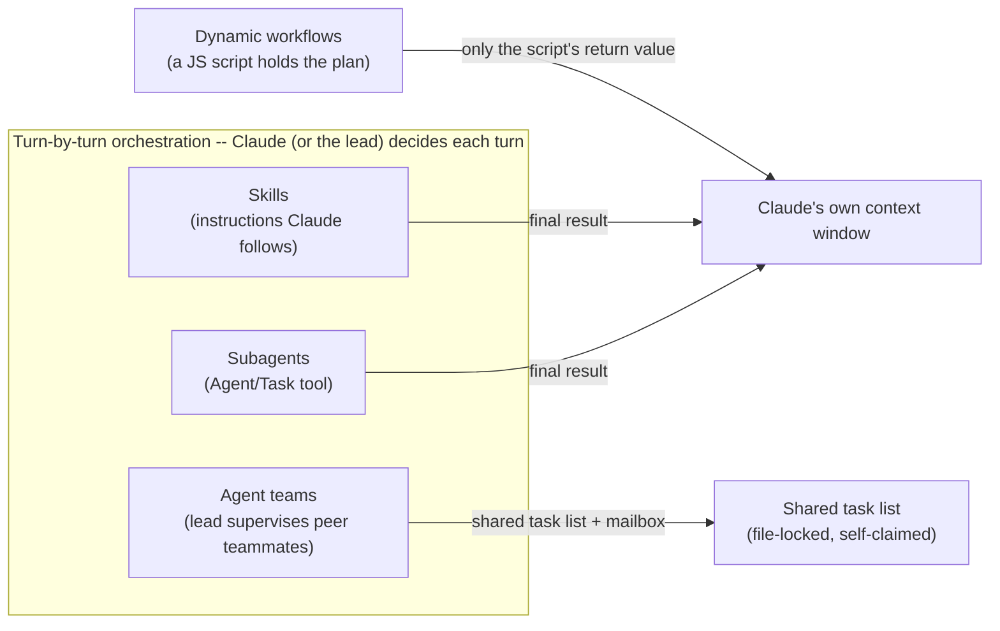
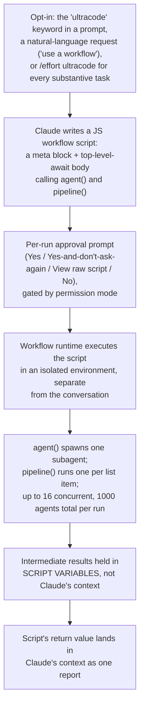
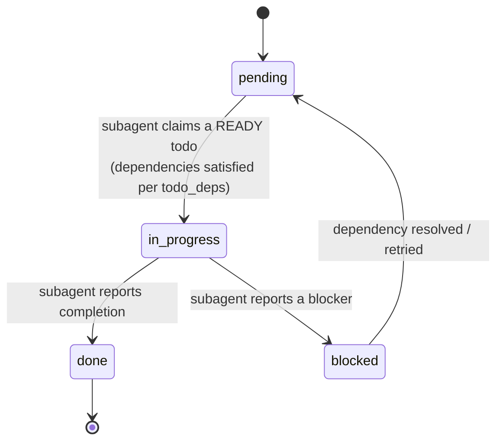
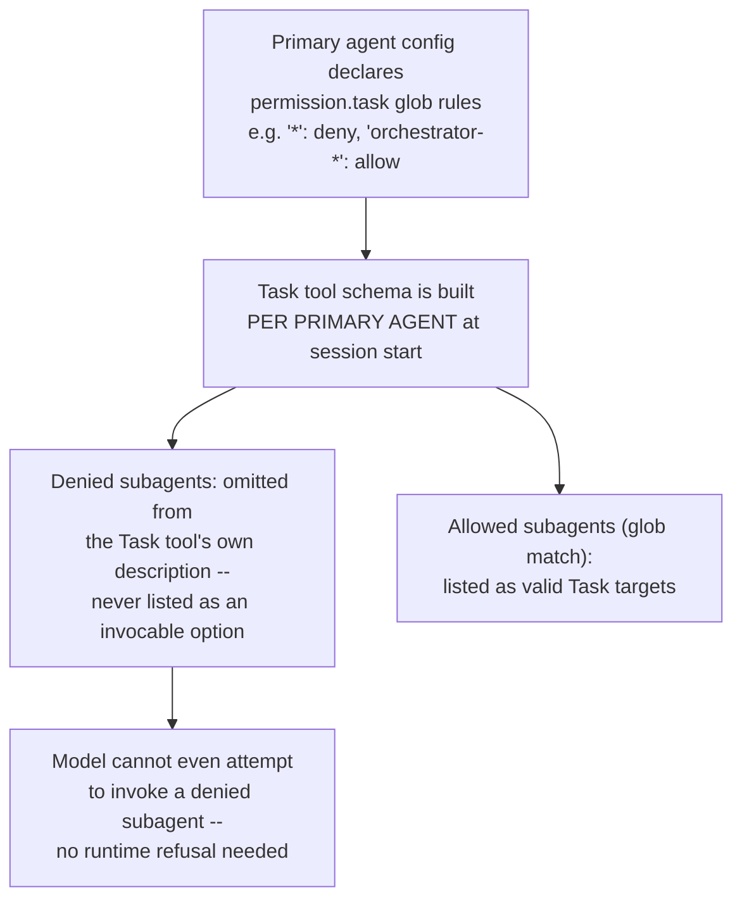
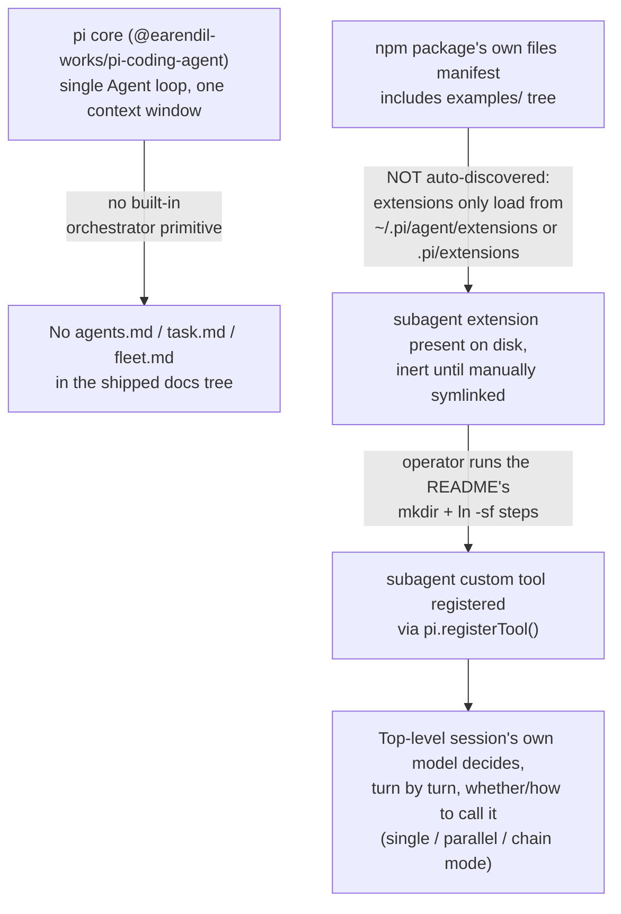
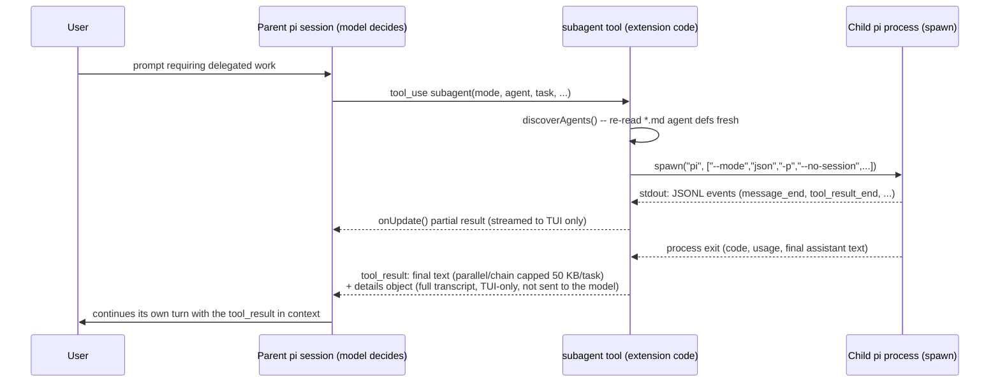

# Orchestration -- who holds the plan when multiple agents work one task

**Scope note.** [handoff-mechanism.md](handoff-mechanism.md) already covers
the mechanics of a single handoff -- what crosses the boundary when one
agent delegates to one subagent, teammate, or cloud agent. This page asks
a different question, one level up: once a task needs *several* agents
working together, what actually holds the plan for how they're divided,
sequenced, and reassembled -- a model deciding turn by turn, a lead agent
supervising peers, a config-declared allow/deny list, or a script the
runtime executes outside any conversation at all? Two adjacent topics
this page deliberately leaves for their own pages when written: **fan-out
(subagent dispatch)** -- the mechanics of *launching* several agents at
once (batching, concurrency mechanics) -- and **inter-agent messaging**
-- the wire format and delivery mechanics of messages once agents are
already talking to each other. This page is about the coordinating layer
itself: what decides the division of labor and what tracks its state.

---

## 0. The general concept: the orchestrator/manager pattern

VERIFIED (`huggingface.co/learn/agents-course/en/unit2/smolagents/multi_agent_systems`,
Hugging Face Agents Course, fetched 2026-07-31 -- authoritative for
GENERAL agent-engineering vocabulary, not for any one harness's specific
behavior): "Multi-agent systems enable specialized agents to collaborate
on complex tasks, improving modularity, scalability, and robustness," and
"A multi-agent system consists of multiple specialized agents working
together under the coordination of an Orchestrator Agent." The course
uses **manager agent**, **orchestrator agent**, and **coordinator**
interchangeably for the coordinating role, and **managed agents** or
**worker agents** for the agents it dispatches to; the motivating
rationale it gives is memory efficiency ("separating memories reduces the
count of input tokens at each step, thus reducing latency and cost") and
focus ("each agent is more focused on its core task, thus more
performant"). This is the shared vocabulary the sections below map onto
-- each of the three products researched here names or implements
*something* that plays this coordinating role, but the three implementations
diverge sharply in whether that role is a conversational agent making
turn-by-turn choices, a config-declared permission boundary, or a script
running outside any model's context window at all.

---

## 1. Claude Code

Sources for this section: `code.claude.com/docs/en/workflows`,
fetched 2026-07-31. VERIFIED unless tagged otherwise.

### 1.1 The default case -- Claude itself is the turn-by-turn orchestrator

Every multi-agent primitive already documented in
[handoff-mechanism.md](handoff-mechanism.md) section 1 -- subagents, and
the peer-to-peer agent-team shape -- shares one property the Workflow
tool's own documentation states explicitly by contrast: in all of them,
"Claude is the orchestrator: it decides turn by turn what to spawn or
assign next, and every result lands in a context window." The docs lay
out this comparison directly as a table across four primitives
(subagents, skills, agent teams, and workflows -- reproduced here
verbatim because it is the single clearest primary-source statement of
what "holds the plan" means across Claude Code's whole multi-agent
surface):

| | Subagents | Skills | Agent teams | Workflows |
|---|---|---|---|---|
| What it is | A worker Claude spawns | Instructions Claude follows | A lead agent supervising peer sessions | A script the runtime executes |
| Who decides what runs next | Claude, turn by turn | Claude, following the prompt | The lead agent, turn by turn | The script |
| Where intermediate results live | Claude's context window | Claude's context window | A shared task list | Script variables |
| What's repeatable | The worker definition | The instructions | The team definition | The orchestration itself |
| Scale | A few delegated tasks per turn | Same as subagents | A handful of long-running peers | Dozens to hundreds of agents per run |
| Interruption | Restarts the turn | Restarts the turn | Teammates keep running | Resumable in the same session |



Agent teams (see [handoff-mechanism.md](handoff-mechanism.md) section
1.5 for the mailbox/plan-approval/shutdown mechanics) are, from this
page's coordination-layer angle, Claude Code's one primitive where the
orchestrator is explicitly a **different agent than the one you're
talking to** -- the lead -- and where the coordination artifact is not a
context window at all but a shared, file-locked task list that teammates
self-claim from, rather than waiting for the lead to assign work item by
item.

### 1.2 Dynamic workflows -- moving the plan into a script

VERIFIED (`code.claude.com/docs/en/workflows`): "A dynamic workflow is a
JavaScript script that orchestrates subagents at scale. Claude writes the
script for the task you describe, and a runtime executes it in the
background while your session stays responsive." This is Claude Code's
answer to the ceiling the turn-by-turn model runs into: "reach for a
workflow when a task needs more agents than one conversation can
coordinate, or when you want the orchestration codified as a script you
can read and rerun." Requires Claude Code v2.1.154 or later, available on
all paid plans plus Anthropic API/Bedrock/Google Cloud Agent
Platform/Microsoft Foundry access; on Pro it must be enabled from
`/config`.



**What a saved workflow script actually looks like** -- VERIFIED, quoted
directly from the docs' own example:

```javascript
export const meta = {
  name: 'audit-routes',
  description: 'Audit every route handler for missing auth checks',
}

const found = await agent('List every .ts file under src/routes/.', {
  schema: { type: 'object', required: ['files'], properties: { files: { type: 'array', items: { type: 'string' } } } },
})

const audits = await pipeline(found.files, file =>
  agent(`Audit ${file} for missing authentication checks.`, { label: file }),
)

return audits.filter(Boolean)
```

`agent()` spawns one subagent per call; `pipeline()` fans a callback out
across a list, one subagent per item -- this is the literal mechanism
behind "dozens to hundreds of agents per run" in the comparison table
above. The runtime enforces four constraints regardless of what the
script asks for: **no mid-run user input** (only agent permission
prompts can pause a run -- "for sign-off between stages, run each stage
as its own workflow"); **no direct filesystem or shell access from the
script itself** ("agents read, write, and run commands; the script
coordinates the agents" -- i.e. the orchestrator layer is deliberately
side-effect-free, all effects happen inside spawned agents); **up to 16
concurrent agents** (fewer on CPU-constrained machines); and a hard
**1,000-agents-total-per-run** ceiling "to prevent runaway loops." A
**size guideline** (`/config` or the `workflowSizeGuideline` settings
key, v2.1.219+) tells Claude an *advisory*, not enforced, target agent
count when it writes a new script -- `small` (<5), `medium` (<15,
default since v2.1.219), `large` (<50), or `unrestricted` -- and Claude
Code separately flags (not blocks) any run projected past 25 scheduled
agents or 1.5M tokens with a "Large workflow" warning in the task panel.

**Orchestration state and resumability** are the concrete payoff of
moving the plan into a script rather than a conversation: "the runtime
tracks each agent's result as the run progresses, which is what makes a
run resumable within the same session." Two rules govern what a resumed
run keeps: an agent still running when you stopped is discarded and
reruns from scratch; and replay follows **start order**, not completion
order -- "cached results stop at the first agent that didn't finish, and
every agent that started after that one runs again, even if it
completed." The docs' own worked example: agents A, B, C, D start in
that order; you stop mid-run while B is still going; on resume A returns
from cache, but B, C, and D all rerun -- C and D even though they'd
already finished -- because they started after the one unfinished agent
in the sequence. The practical corollary stated directly: "a workflow
that fans work out across many small agents therefore preserves more
progress than one long agent."

**Every workflow agent runs under one fixed permission posture**,
independent of the session's own mode: "the subagents the workflow
spawns always run in `acceptEdits` mode and inherit your tool
allowlist... File edits are auto-approved," though "shell commands, web
fetches, and MCP tools that aren't in your allowlist can still prompt you
mid-run." The launch of the workflow itself, by contrast, is gated by the
session's permission mode: prompted every run in default/accept-edits
mode (unless "don't ask again" was previously selected for that
workflow+project), prompted only on first launch in Auto mode, and never
prompted in `bypassPermissions`/`claude -p`/Agent SDK contexts.

**Distribution and reuse:** a workflow run's script can be saved as a
reusable `/<name>` command, to `.claude/workflows/` (project-shared) or
`~/.claude/workflows/` (personal, or under `CLAUDE_CONFIG_DIR` if set);
a monorepo with several `.claude/` directories resolves to the closest
one along the path from working directory to repo root; a project
workflow wins over a same-named personal one. Workflows also distribute
inside a **plugin**, namespaced by plugin name (`/acme-tools:release-audit`
for a plugin `acme-tools` whose script's `meta.name` is
`release-audit`), and accept runtime input via an `args` global passed
from the invoking prompt. Claude Code ships one built-in workflow,
`/deep-research`, which "fans out web searches on a question across
several angles, fetches and cross-checks the sources it finds, votes on
each claim, and returns a cited report with claims that didn't survive
cross-checking filtered out" -- itself an instance of the
orchestrator-worker pattern from section 0 above, with the workflow
script playing the orchestrator role and per-angle search agents playing
workers, and a documented adversarial-review quality pattern layered on
top ("independent agents adversarially review each other's findings
before they're reported").

Workflows can be turned off per-user (`/config` toggle,
`"disableWorkflows": true` in `~/.claude/settings.json`,
`CLAUDE_CODE_DISABLE_WORKFLOWS=1`) or organization-wide (the same
settings key in managed settings, or the toggle on the Claude Code admin
settings page).

---

## 2. GitHub Copilot CLI

Sources for this section: `docs.github.com/en/copilot/concepts/agents/copilot-cli/fleet`,
fetched 2026-07-31 (authoritative for Copilot CLI's own `/fleet`
command specifically); `docs.github.com/en/copilot/how-tos/copilot-sdk/features/fleet-mode`,
fetched 2026-07-31 -- a broader, separate product surface (the Copilot
SDK, not the CLI) checked here only for the underlying runtime pattern
the CLI feature is presumably built on, per this project's AUTHORITY
OVERREACH discipline; treat SDK-page detail as background on the shared
runtime, not a confirmed statement of what the CLI slash command itself
exposes.

### 2.1 Ordinary custom-agent delegation has no orchestrator role

The local custom-agent subagent delegation documented in
[handoff-mechanism.md](handoff-mechanism.md) section 2.1 is, in this
page's terms, orchestrator-free: the main Copilot CLI agent decides
turn by turn whether to delegate to a matching custom agent, the same
shape as Claude Code's default turn-by-turn subagent case in section 1.1
above. `/fleet` is the primitive that introduces an explicit orchestrator
role on top of that.

### 2.2 `/fleet` -- an explicit, named orchestrator agent

VERIFIED (`docs.github.com/en/copilot/concepts/agents/copilot-cli/fleet`):
"The `/fleet` slash command in Copilot CLI is designed to take an
implementation plan and break it down into smaller, independent tasks
that can be executed in parallel by subagents." The decomposition step is
itself agent-driven, not a fixed algorithm: "the main Copilot agent
analyzes the prompt and determines whether it can be divided into
smaller subtasks. It will assess, based on the nature of the subtasks and
their dependencies, whether these can be efficiently executed by
subagents." Once decomposed, the coordinating role is named explicitly
as an **orchestrator agent**: "Where possible, the orchestrator agent
will run the subagents in parallel, allowing the whole task to be
completed more quickly" -- parallel execution is conditional on
dependency analysis, not automatic for every subtask. A subtask can be
routed to a specific custom agent by name inside the prompt via
`@CUSTOM-AGENT-NAME`, so `/fleet`'s decomposition composes with the
custom-agent specialization mechanism from section 2.1/handoff-mechanism
2.1 rather than replacing it.

**The documented cost trade-off**, stated directly: "Each subagent can
interact with the LLM independently of the main agent, so splitting work
up into smaller tasks that are run by subagents may result in more LLM
interactions than if the work was handled by the main agent" -- more
decomposition means more GitHub AI Credits consumed, a design trade-off
the docs surface to the user rather than hide.



**BEST CURRENT UNDERSTANDING, UNCONFIRMED, on the runtime mechanism
underneath `/fleet` specifically:** the Copilot SDK's separate
"Fleet mode" page describes what reads as the same pattern under the
hood at a lower level of implementation detail -- "the runtime's
built-in pattern for dispatching multiple sub-agents in parallel via the
task tool, with SQL todos as the shared coordination state." On that
page, the parent session plays the orchestrator role by decomposing work
into individual todo items, assigning ownership, and collecting results,
using **explicit coordination state rather than implicit shared memory**:
each todo transitions `pending -> in_progress -> done` or `blocked`
through a SQL-backed state machine, with a `todo_deps` table letting the
orchestrator "query ready work using dependency-satisfaction logic," and
the page states the mechanism's design principle plainly -- "dependencies
reduce parallelism," so the pattern deliberately minimizes them. Workers
are stateless across calls ("requiring complete context provision per
invocation"), invoked at the SDK level via `session.rpc.fleet.start()`
across several supported languages, with `subagent.started`/
`subagent.completed` lifecycle events streamed back to the parent
session -- the same event-naming convention already noted for ordinary
custom-agent sub-agents in [handoff-mechanism.md](handoff-mechanism.md)
section 2.1. Because this detail comes from the SDK's own page rather
than the CLI's `/fleet` page, treat it as *the runtime `/fleet` is
plausibly built on*, not as a confirmed description of `/fleet`'s own
internals -- the CLI page itself never mentions SQL, todos, or
`todo_deps` directly.

---

## 3. OpenCode

Sources for this section: `opencode.ai/docs/agents/`, fetched
2026-07-31. VERIFIED unless tagged otherwise. See
[handoff-mechanism.md](handoff-mechanism.md) section 3 for the `Task`
tool's own dispatch/resume/permission-inheritance mechanics
(source-verified against `packages/opencode/src/tool/task.ts` and
`packages/opencode/src/agent/subagent-permissions.ts`, `dev` branch);
this section covers the coordination layer sitting above that tool --
who is allowed to orchestrate whom, declared in configuration rather than
decided turn by turn.

### 3.1 Primary agents as the orchestrator role, subagents as workers

VERIFIED: "Primary agents are the main assistants you interact with
directly," cycled through with Tab, while "Subagents are specialized
assistants that primary agents can invoke for specific tasks," invoked
"automatically by primary agents for specialized tasks based on their
descriptions" or "manually by @ mentioning a subagent." OpenCode ships a
documented built-in taxonomy that maps the general orchestrator/worker
split from section 0 onto concrete named agents: **Build** is "the
default primary agent with all tools enabled" for ordinary development
work; **Plan** is a "restricted [primary] agent designed for planning and
analysis" with file edits and Bash set to `ask` rather than allowed
outright; **General** is a full-tool-access subagent for "multi-step"
delegated work; **Explore** is "a fast, read-only agent for exploring
codebases"; and **Scout** is "a read-only agent for external docs and
dependency research" -- Explore and Scout playing an analogous role to
Claude Code's own built-in Explore/Plan subagents documented in
[handoff-mechanism.md](handoff-mechanism.md) section 1.1, though the two
products' naming and role split are independent (Claude Code's "Plan" is
a one-shot subagent; OpenCode's "Plan" is a *primary* agent mode).

### 3.2 `permission.task` -- orchestration boundaries declared in config, not decided per-turn

VERIFIED: "Control which subagents an agent can invoke via the Task tool
with `permission.task`. Uses glob patterns for flexible matching." An
orchestrator-restricting example given directly in the docs:

```json
"orchestrator": {
  "mode": "primary",
  "permission": {
    "task": {
      "*": "deny",
      "orchestrator-*": "allow"
    }
  }
}
```

The mechanism's enforcement point is the sharpest fact here: "When set to
`deny`, the subagent is removed from the Task tool description entirely,
so the model won't attempt to invoke it." This is a materially different
orchestration-control strategy from a runtime permission check performed
*after* the model requests an action (the way Claude Code's own
permission modes and OpenCode's own `deny`/`external_directory`
inheritance in [handoff-mechanism.md](handoff-mechanism.md) section 3.2
work) -- here the boundary is enforced by editing the **tool schema
itself** before the model ever sees it, so a denied subagent is not a
request the model gets refused, it is an option the model's own Task
tool definition never lists in the first place.



### 3.3 Fan-out is a prompted convention, not a scripted runtime

As already established in [handoff-mechanism.md](handoff-mechanism.md)
section 3.3, OpenCode's own `Task` tool description text tells the
calling model directly: "Launch multiple agents concurrently whenever
possible, to maximize performance; to do that, use a single message with
multiple tool uses." Read against this page's framing, that sentence is
OpenCode's whole answer to "how does orchestration scale beyond one
agent at a time" -- there is no separate scripted-orchestration primitive
analogous to Claude Code's Workflow tool or a named parallel-dispatch
command analogous to Copilot CLI's `/fleet`; the orchestrating primary
agent is simply instructed, in its own tool's prompt text, to batch
several `Task` calls into one turn. BEST CURRENT UNDERSTANDING,
UNCONFIRMED: whether a scripted/declarative orchestration primitive
exists elsewhere in OpenCode (e.g. a workflow-file format under
`packages/core/` or `packages/cli/`) was not found in the docs page or
source files read this session or during the handoff-mechanism.md
research; this would need a further `gh api` directory listing of
`packages/core/src/` before ruling out.

---

## 4. pi

Sources for this section: `github.com/earendil-works/pi`, `main` branch,
fetched fresh 1 September 2026 via `gh api`/`curl` against
`raw.githubusercontent.com` -- `packages/coding-agent/docs/index.md`
(the docs' own table of contents, checked for the *absence* of an
orchestration/agents/task/fleet page), `packages/coding-agent/docs/`
`extensions.md` (in full, including its "Examples Reference" table),
`packages/coding-agent/docs/packages.md`, `packages/coding-agent/docs/`
`sessions.md`, `packages/coding-agent/docs/usage.md`,
`packages/coding-agent/docs/prompt-templates.md`, and the full source of
the officially-shipped-but-opt-in `examples/extensions/subagent/`
directory (`README.md`, `index.ts`, `agents.ts`, one sample agent
definition `agents/scout.md`, and one workflow prompt
`prompts/implement.md`). VERIFIED unless tagged otherwise.

### 4.0 Resolving this book's own inconsistent spelling: two real, differently-scoped packages, not an error

This book has cited pi under two spellings across its pages --
`@earendil-works/pi-ai` ([llm-api-contract.md](llm-api-contract.md)
§3.5) and `@earendil-works/pi-coding-agent`
([deterministic-orchestration.md](deterministic-orchestration.md),
[session-persistence.md](session-persistence.md),
[permissions-and-sandboxing.md](permissions-and-sandboxing.md)'s blog
citation). VERIFIED, read directly from each package's own
`package.json` this session: **both spellings are correct, and neither
citation was in error** -- they name two distinct, real npm packages
published from the same `earendil-works/pi` monorepo, at genuinely
different scopes. `packages/ai/package.json` declares
`"name": "@earendil-works/pi-ai"`, described as "Unified LLM API with
automatic model discovery and provider configuration" -- this is the
wire-protocol abstraction layer llm-api-contract.md §3.5 documents, not
a harness in its own right. `packages/coding-agent/package.json`
declares `"name": "@earendil-works/pi-coding-agent"`, described as
"Coding agent CLI with read, bash, edit, write tools and session
management," with a `bin` entry mapping the `pi` command itself to
`dist/bundle/cli.js` -- this is the actual harness a user runs, and the
one this page's own question (who holds the plan across multiple
agents) is about. A third, related package this section also draws on,
`@earendil-works/pi-agent-core` (`packages/agent`, "General-purpose
agent with transport abstraction, state management, and attachment
support"), supplies the single-agent loop primitives (`Agent`,
`AgentToolResult`, tool-execution-mode configuration) that
`pi-coding-agent` builds its own tool-calling turn loop on top of, and
that the example extension covered below imports directly. Citing
`pi-ai` when discussing the wire contract and `pi-coding-agent` when
discussing the harness itself, as this book's own prior pages already
happened to do, is the factually correct convention going forward, not
an inconsistency to resolve away.

### 4.1 No built-in orchestrator ships in the core product

VERIFIED, `packages/coding-agent/docs/index.md` (the docs' own full
table of contents): pi's documented surface runs from "Start here"
(quickstart, providers, security, sessions, compaction) through
"Customization" (extensions, skills, prompt templates, themes, packages,
custom models/providers) to "Programmatic usage" (SDK, RPC mode, JSON
event-stream mode, TUI components) and "Reference" -- **no page named
`agents`, `task`, `subagents`, `fleet`, `orchestration`, or anything
equivalent appears anywhere in that list.** This is a genuine negative
finding, not an omission of this page's own research: pi's core CLI, as
shipped and documented, has no analogue to Claude Code's built-in
`Agent`/Task-spawning subagent primitive
([handoff-mechanism.md](handoff-mechanism.md) §1), Copilot CLI's
built-in `/fleet` slash command (§2 above), or OpenCode's built-in
`Task` tool gated by `permission.task` (§3 above). A single pi session
is, by default, exactly what [agent-loop.md](agent-loop.md) and this
package's own `@earendil-works/pi-agent-core` describe: one model, one
tool-execution loop, one context window -- `pi-agent-core`'s own README
(cross-referenced from [llm-api-contract.md](llm-api-contract.md) §3.5's
research, not re-quoted here) documents `parallel`/`sequential` **tool**
execution modes within that one loop, which is a different concern
entirely from spawning or coordinating separate agents.

The only place a multi-agent coordination capability exists for pi at
all is **extension space** -- and specifically, one officially-authored
example extension shipped inside the same npm package's own `files`
manifest (`package.json`'s `"files": ["dist", "docs", "examples", ...]`
array genuinely includes the `examples/` tree) but **not
auto-loaded or active by default**: pi's extension auto-discovery only
scans `~/.pi/agent/extensions/` (global) and `.pi/extensions/`
(project-local, per `extensions.md`'s own documented locations table),
never the installed package's own `examples/` directory. Activating it
requires a user to manually symlink or copy
`examples/extensions/subagent/index.ts` and `agents.ts` into one of
those two discovery paths -- the example's own `README.md` gives the
exact `mkdir`/`ln -sf` sequence. This is the single most consequential
structural fact this section has to report: **pi ships the code for a
subagent-style orchestrator, but does not enable it out of the box**,
in contrast to all three harnesses in sections 1-3 above, where the
equivalent capability (subagents, `/fleet`, `Task`) is live the moment
the product is installed.



### 4.2 Once installed: the top-level session's own model is the (only) orchestrator

VERIFIED, `examples/extensions/subagent/index.ts` (full source read this
session): the example registers exactly one custom tool, `subagent`, via
`pi.registerTool()` -- the same generic custom-tool-registration
mechanism [built-in-skills.md](built-in-skills.md) and
[hooks-lifecycle-extensibility.md](hooks-lifecycle-extensibility.md)
already document for pi's extension surface generally, not a distinct
orchestration API. This places pi's coordination model architecturally
closest to this page's §1.1 (Claude Code's default turn-by-turn case)
and §2.1 (Copilot CLI's ordinary custom-agent delegation, orchestrator-
free): there is no separate lead/orchestrator agent, named or otherwise
-- the single top-level session's own model decides, turn by turn,
whether to call the `subagent` tool at all, and which of its three
mutually exclusive modes to invoke it with, exactly the way it would
decide to call `read` or `bash`. The tool's own parameter schema
(`SubagentParams`, a `typebox` `Type.Object` read directly from source)
enforces "exactly one mode" server-side -- `agent`+`task` (single),
`tasks: [...]` (parallel), or `chain: [...]` (sequential) -- rejecting a
call that sets more than one or none.

| Mode | Parameter shape | Coordination logic |
|---|---|---|
| Single | `{ agent, task, cwd? }` | One subprocess, awaited directly |
| Parallel | `{ tasks: [{agent, task, cwd?}, ...] }`, max 8 entries | A hand-rolled bounded worker pool (`mapWithConcurrencyLimit`, read in full from source): a shared `nextIndex` counter and a fixed-size array of `MAX_CONCURRENCY = 4` async workers, each looping `while (true) { claim next index; await runSingleAgent(...); }` until the shared counter is exhausted |
| Chain | `{ chain: [{agent, task, cwd?}, ...] }` | A plain sequential `for` loop; each step's `task` string has any `{previous}` substring replaced with the prior step's final assistant text before dispatch; the loop returns early with an error the moment one step fails |

There is no dependency graph, no `todo_deps`-style scheduler (contrast
Copilot CLI's Fleet-mode SDK detail in §2.2 above), and no declarative
allow/deny config gating which agent names a session may invoke
(contrast OpenCode's `permission.task` in §3.2 above) -- the entire
"orchestration" logic visible in this extension is the three code shapes
in the table above, hand-written in the extension's own TypeScript, not
supplied by any core pi runtime primitive.

### 4.3 Process-level isolation: a genuinely separate `pi` binary per subagent, not a shared context object

VERIFIED, `runSingleAgent()` and `getPiInvocation()`, read in full from
source: each subagent invocation -- whether the single, one-of-parallel,
or one-of-chain case -- is dispatched via Node's own
`child_process.spawn()`, launching **a full separate `pi` process**,
constructed as `pi --mode json -p --no-session [--model <m>] [--thinking
<level>] [--tools <list>] [--append-system-prompt <tmpfile>] "Task:
<task text>"`. This is a materially stronger and more expensive
isolation boundary than any other harness in this book's own default
subagent mechanism provides: Claude Code's subagents and OpenCode's
`Task`-tool children are both documented in
[handoff-mechanism.md](handoff-mechanism.md) (§1, §3) as separate
*context windows* or child *sessions* inside the same running process
and the same agent-loop implementation -- pi's reference extension
instead pays the cost of a **second OS process and a second cold model
client**, per subagent call, communicating with the parent exclusively
through the child's own stdout stream in pi's `--mode json` structured
event format (documented separately in `packages/coding-agent/docs/`
`json.md`, not re-read in full this session; only the two event types
the extension actually consumes, `message_end` and `tool_result_end`,
were confirmed directly from `index.ts`'s own `processLine()` parser).
`--no-session` makes each child subprocess deliberately ephemeral --
VERIFIED, `sessions.md`'s own `--no-session` flag description ("Ephemeral
mode; do not save") -- so a subagent's own conversation is never
persisted as a session file the way the dispatching parent session is
(per [session-persistence.md](session-persistence.md)); only the
extracted final assistant text and aggregated usage numbers survive
past the child process's exit.

Model/thinking-level inheritance is explicit in source: `ctx.model` and
`ctx.thinkingLevel` from the dispatching session populate a
`dispatchDefaults` object, and `runSingleAgent()` only appends
`--model`/`--thinking` flags to the child invocation when the target
agent's own frontmatter omits a `model` field -- i.e. an agent
definition with no `model:` line inherits whatever model/thinking-level
the parent session currently has active, while one that names a model
(e.g. the sample `scout` agent's `model: claude-haiku-4-5`, read
directly from `agents/scout.md`) pins its own model regardless of the
parent's. Abort propagation is likewise process-level: an `AbortSignal`
passed into `execute()` triggers `proc.kill("SIGTERM")` with a 5-second
`SIGKILL` escalation timer if the child hasn't exited by then --
documented in the example's own README as "Ctrl+C propagates to kill
subagent processes."



### 4.4 Agent definitions, discovery, and project-trust gating

VERIFIED, `agents.ts` and the example's own `README.md`: an "agent" in
this scheme is a plain Markdown file with YAML frontmatter --
`name`, `description`, `tools` (accepting either a comma-separated
string or a YAML array, per `parseToolList()`'s explicit
both-spellings-are-valid-YAML comment read directly from source), and an
optional `model` -- with the Markdown body becoming the child process's
system-prompt append. `discoverAgents()` re-reads these files **fresh
on every single tool invocation** (no caching), explicitly so a
definition can be edited mid-session and take effect on the very next
call. Two locations are recognized: `~/.pi/agent/agents/*.md`
(user-level, loaded by default, scope `"user"`) and `.pi/agents/*.md`
(project-level, loaded only when the tool call itself sets
`agentScope: "project"` or `"both"` -- a per-call parameter on the
`subagent` tool's own schema, not a global setting). When project-local
agents are requested and the project has not already been trusted
(`ctx.isProjectTrusted()`, the same project-trust mechanism
[permissions-and-sandboxing.md](permissions-and-sandboxing.md)'s pi
section covers generally, not repeated here), the tool blocks on an
explicit `ctx.ui.confirm()` prompt naming which project-local agents
were requested and from which directory, unless
`confirmProjectAgents: false` was also passed -- the example's own
README states the rationale plainly: "Project-local agents... are
repo-controlled prompts that can instruct the model to read files, run
bash commands, etc." A project agent's own name wins over a same-named
user agent only when `agentScope: "both"` is set.

### 4.5 Workflow prompts: canned natural-language chains, not a scripted runtime

VERIFIED, `packages/coding-agent/docs/prompt-templates.md` and the
example's own `prompts/implement.md` (read in full): the example ships
three additional Markdown files under `prompts/` --
`implement.md`, `scout-and-plan.md`, `implement-and-review.md` -- using
pi's ordinary, general-purpose prompt-template mechanism (any
`~/.pi/agent/prompts/*.md` or `.pi/prompts/*.md` file becomes a
`/filename` slash command, per `prompt-templates.md`, unrelated to
subagents specifically). `implement.md`'s literal body: "Use the
subagent tool with the chain parameter to execute this workflow: 1.
First, use the 'scout' agent to find all code relevant to: $@ 2. Then,
use the 'planner' agent to create an implementation plan... 3. Finally,
use the 'worker' agent to implement the plan..." -- i.e. the entire
"workflow" is a natural-language instruction, expanded verbatim into the
user turn at invocation time (`$@` substituting the slash command's own
argument text), telling the model which chain steps to request. Nothing
about this differs mechanically from an operator typing the same
instructions by hand; the model still decides, turn by turn, whether to
actually follow the prompt's suggested chain, and the `subagent` tool's
own chain-mode code (§4.2 above) does not know or care that a prompt
template was the thing that requested it. This is architecturally the
same category of "coordination" this page's §3.3 already found in
OpenCode -- prompt-level encouragement toward a batching/sequencing
pattern, not a scripted runtime with its own control flow -- with pi's
version expressed as a pre-written, invokable slash command rather than
inline tool-description text, and, unlike OpenCode's `Task` tool
description (which ships active in every OpenCode session), gated
behind the same opt-in extension-installation step documented in §4.1.

---

## 5. Synthesis

| Dimension | Claude Code (turn-by-turn) | Claude Code (Workflow tool) | Copilot CLI (`/fleet`) | OpenCode (Task + `permission.task`) | pi (reference `subagent` extension, opt-in) |
|---|---|---|---|---|---|
| Who plays the orchestrator role | Claude itself, or the team lead | A JS script, run by a separate runtime | An explicitly named "orchestrator agent" (the main Copilot agent) | The primary agent invoking `Task`, scoped by its own `permission.task` config | The top-level session's own model, turn by turn -- no distinct lead/orchestrator agent at all |
| Decomposition mechanism | Model judgment, turn by turn | Claude writes the script once; the script's own logic (loops, `pipeline()`) decomposes at run time | Model judgment (dependency/nature analysis of the prompt) at `/fleet` invocation | Model judgment, encouraged toward batching via the tool's own prompt text | Model judgment, optionally nudged by a canned natural-language prompt template (§4.5) |
| Coordination/state artifact | Claude's context window (subagents/skills) or a shared file-locked task list (agent teams) | Script variables in an isolated runtime; run state tracked for resumability | SQL-backed todo state machine (`pending/in_progress/done/blocked`) with a `todo_deps` table (SDK-page detail, not CLI-page-confirmed) | No dedicated state store found; ordinary session/subagent-session records only | An in-memory `SingleResult[]`/`SubagentDetails` array, scoped to one `execute()` call; nothing persists past the tool call returning |
| Concurrency ceiling | No documented numeric cap (subagents), no cap for teams | 16 concurrent, 1,000 total agents per run (hard runtime limits) | Conditional on dependency analysis; no numeric cap documented | No enforced cap found; model is encouraged, not limited, to batch calls | Hard-coded in the extension: 8 tasks max, 4 concurrent (`MAX_PARALLEL_TASKS`/`MAX_CONCURRENCY`), not a core-runtime limit |
| Dependency handling between subtasks | Not applicable at this granularity | Script's own control flow (sequential `await`, or `pipeline()` for independent items) | Explicit: "assess... whether these can be efficiently executed... in parallel," `todo_deps` table (SDK-page detail) | Not applicable -- no dependency-aware scheduler documented | Flat linear chain only, with a `{previous}` string-substitution placeholder; no DAG |
| Result aggregation | One final message per subagent/teammate, read by Claude/lead | Script's own return value; only that final value reaches Claude's context | Not detailed on the CLI's own `/fleet` page | Last text part of each child session's final message (per handoff-mechanism.md 3.3) | Final assistant text per subprocess, capped 50 KB/task for parallel/chain modes; full transcript kept only in a TUI-only `details` object |
| Resumability of the orchestration itself | Subagents/teammates individually resumable; no run-level resume concept | Yes -- run-level resume with documented start-order replay semantics | Undocumented | Individual subagent sessions resumable via `task_id`; no fleet-level run object | None -- child processes run `--no-session` (ephemeral) and are killed outright on abort; no persisted run state |
| Declared vs. runtime-enforced boundary | Runtime permission-mode check per action | Fixed `acceptEdits` posture for all workflow agents, set once at launch | Undocumented | Declarative: denied subagents omitted from the Task tool schema itself, pre-empting the request entirely | Project-local agent definitions gated by an explicit `ctx.ui.confirm()` prompt when the project isn't yet trusted; otherwise no declared allow/deny surface |
| Ships active by default | Yes | Yes (opt-in per-workflow approval, but the primitive itself is core) | Yes | Yes | **No** -- the capability exists only as an example extension bundled in the npm package but not auto-loaded; a user must manually install it |
| Verifiability | Docs-only | Docs-only, but unusually mechanistic (concrete limits, exact resume algorithm) | CLI docs-only; deeper mechanism only on the separate SDK surface (flagged) | Docs-only for `permission.task`; Task tool mechanics themselves are source-verified (handoff-mechanism.md 3) | Fully source-verified (the example extension's own TypeScript, read in full) -- but source-verifying an opt-in example, not a core-runtime guarantee |

**The design lesson.** All four products name or imply the same
orchestrator/worker role from section 0, but they diverge on where that
role's *authority* actually lives. Claude Code keeps the orchestrator
inside the conversation by default (Claude itself, turn by turn) and
offers an explicit escape hatch -- the Workflow tool -- that moves the
plan into a script the runtime executes with its own hard concurrency
and total-agent ceilings, at the cost of losing mid-run interactivity
("no mid-run user input... for sign-off between stages, run each stage
as its own workflow"). Copilot CLI names its orchestrator explicitly
("the orchestrator agent") but keeps it inside a single `/fleet`
invocation's lifetime, trading dependency-aware parallelism for a
documented LLM-call cost multiplier the user is told about up front.
OpenCode is the odd one out among the first three: it has no scripted or
explicitly-named orchestrator primitive at all -- its entire
orchestration story is (a) prompt-level encouragement to batch `Task`
calls in one turn, and (b) a declarative, config-level boundary
(`permission.task`) on *which* subagents a given primary agent is even
allowed to see as options, enforced by editing the tool schema itself
rather than by a runtime policy check. pi is the odd one out among all
four, on a different axis entirely: every other harness on this page
ships *some* version of its coordination primitive active the moment the
product is installed, even where that primitive is thin (OpenCode's
prompt-text nudge) or config-gated (OpenCode's `permission.task`,
Claude Code's per-workflow approval prompt). pi ships **no** orchestrator
at all in its core, documented product surface -- what this page
describes as pi's coordination layer is a single officially-authored but
inert example extension, bundled in the same npm package yet requiring a
manual symlink step to activate, after which it behaves like a
stripped-down, single-file combination of Claude Code's turn-by-turn
subagents (§1.1, same "the model decides" authority) and Copilot CLI's
Fleet-mode SQL-todo bookkeeping ambition (§2.2, minus the SQL, the
dependency graph, and the shared server) -- reimplemented from
first principles in extension-space TypeScript, using genuine OS-process
isolation rather than an in-process context boundary as its one
architecturally distinctive choice. A workflow built assuming "there's a
name I can point at for the thing coordinating my agents" will find that
name on Claude Code (the Workflow tool) and Copilot CLI (`/fleet`'s
orchestrator agent), find only a permission config and a prompt-text
convention on OpenCode, and find nothing at all on a fresh pi install --
only an extension a user has to go and turn on themselves.

---

## Sources

All fetched 2026-07-31, except the pi sources below (fetched fresh
1 September 2026).

**Claude Code (authoritative for Claude Code's documented behavior only):**
- `https://code.claude.com/docs/en/workflows` -- the subagents/skills/agent-teams/workflows
  comparison table, the Workflow tool's script model (`agent()`,
  `pipeline()`, `meta` block), runtime constraints (concurrency/total-agent
  caps, no mid-run input, no direct filesystem/shell access from the
  script), resumability semantics (start-order replay), size guidelines,
  `ultracode` effort mode and keyword trigger, permission posture for
  workflow-spawned agents, save/distribute/plugin mechanics, the
  `/deep-research` bundled workflow, and the disable settings.
- Cross-referenced without re-fetching this session: `code.claude.com/docs/en/sub-agents`
  and `code.claude.com/docs/en/agent-teams`, both already fetched and
  cited in [handoff-mechanism.md](handoff-mechanism.md) section 1.

**GitHub Copilot CLI (authoritative for Copilot CLI's documented behavior only):**
- `https://docs.github.com/en/copilot/concepts/agents/copilot-cli/fleet` --
  the `/fleet` slash command's documented behavior: prompt decomposition,
  the named "orchestrator agent," conditional parallelism based on
  dependency analysis, `@CUSTOM-AGENT-NAME` targeting, and the
  documented LLM-call-count/cost trade-off.

**Adjacent, broader product surface -- checked only for background on the
runtime pattern, not treated as a confirmed statement of Copilot CLI's
own internals (AUTHORITY OVERREACH guard):**
- `https://docs.github.com/en/copilot/how-tos/copilot-sdk/features/fleet-mode` --
  the Copilot SDK's own "Fleet mode" page: SQL-backed todo state machine
  (`pending/in_progress/done/blocked`), the `todo_deps` dependency table,
  `session.rpc.fleet.start()`, stateless workers, and
  `subagent.started`/`subagent.completed` lifecycle events. A different
  product surface (the SDK) from the CLI specifically; presented above as
  BEST CURRENT UNDERSTANDING of what `/fleet` is plausibly built on, not
  as verified CLI-internal behavior.

**OpenCode (authoritative for OpenCode's documented behavior; this
page's specific claims are docs-level, not additionally source-verified
this session -- see [handoff-mechanism.md](handoff-mechanism.md) section
3 for the source-verified `Task`-tool mechanics this page builds on):**
- `https://opencode.ai/docs/agents/` -- primary-agent-vs-subagent
  definitions, the built-in agent taxonomy (Build, Plan, General,
  Explore, Scout), the `permission.task` config key, its glob-pattern
  allow/deny semantics, and the schema-omission enforcement mechanism for
  denied subagents.

**pi (authoritative for its own documented behavior and, unlike Claude
Code/Copilot CLI above, additionally verified against real source code
for its one relevant example extension; fetched fresh 1 September 2026
from `github.com/earendil-works/pi`, `main` branch):**
- `packages/ai/package.json` and `packages/coding-agent/package.json`
  (both read in full via `gh api`) -- the two packages' real, distinct
  npm names (`@earendil-works/pi-ai` vs. `@earendil-works/pi-coding-agent`)
  resolving this book's own cross-page spelling inconsistency, per §4.0.
- `packages/agent/README.md` -- `@earendil-works/pi-agent-core`'s own
  package description and single-agent-loop scope, cited in §4.0/§4.1 to
  distinguish the single-agent loop from any multi-agent coordination
  claim.
- `packages/coding-agent/docs/index.md` -- the full documented table of
  contents, checked for the absence of any agents/task/fleet/
  orchestration page; the basis for §4.1's core negative finding.
- `packages/coding-agent/docs/extensions.md` (in full) -- the "Examples
  Reference" table's `subagent/` row ("Spawn sub-agents"), the extension
  auto-discovery location table (`~/.pi/agent/extensions/`,
  `.pi/extensions/`) used in §4.1 to establish the example is not
  auto-loaded, and the general `registerTool()`/`ExtensionAPI` mechanism
  referenced in §4.2.
- `packages/coding-agent/docs/packages.md` -- cross-checked for the
  npm-package `files` manifest/auto-discovery distinction underlying
  §4.1's "ships but is not active" claim.
- `packages/coding-agent/docs/sessions.md` and `.../usage.md` -- the
  `--no-session` ephemeral-mode flag description quoted in §4.3.
- `packages/coding-agent/docs/prompt-templates.md` -- the general
  prompt-template mechanism (`/name` slash commands, `$@` argument
  substitution) underlying §4.5.
- `examples/extensions/subagent/README.md`, `index.ts` (full source,
  including `runSingleAgent()`, `getPiInvocation()`,
  `mapWithConcurrencyLimit()`, and the `SubagentParams` schema),
  `agents.ts` (`discoverAgents()`, frontmatter parsing), one sample
  agent definition `agents/scout.md`, and one workflow prompt
  `prompts/implement.md` -- the primary source for all of §4.2-§4.5:
  the three tool-call modes, the per-subprocess `pi` invocation and
  isolation model, model/thinking-level inheritance, abort propagation,
  agent-definition discovery and project-trust gating, and the
  natural-language chain prompt.

**General-concepts source (authoritative for shared agent-engineering
vocabulary only, never for any one harness's specific behavior):**
- `https://huggingface.co/learn/agents-course/en/unit2/smolagents/multi_agent_systems` --
  the orchestrator/manager-agent and managed/worker-agent vocabulary used
  throughout this page's framing, and the stated rationale (memory
  efficiency, focus) for splitting a task across agents at all.
