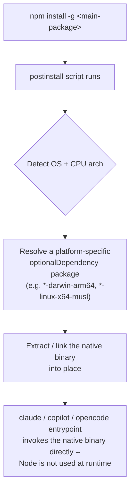
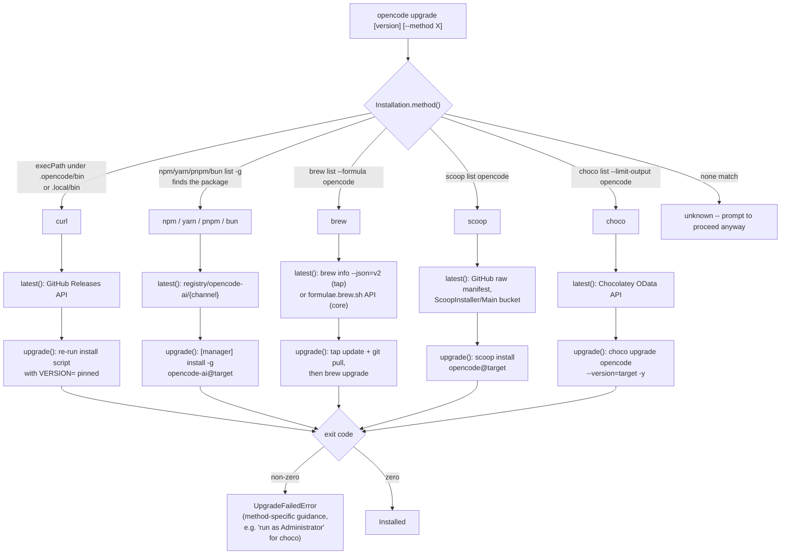
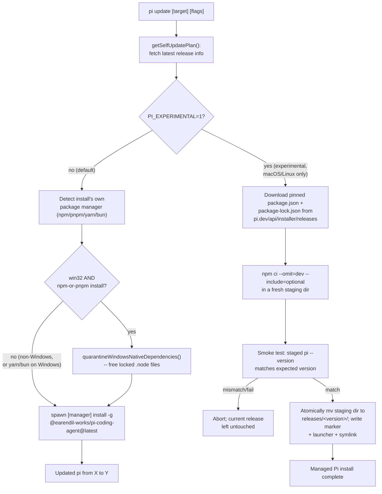
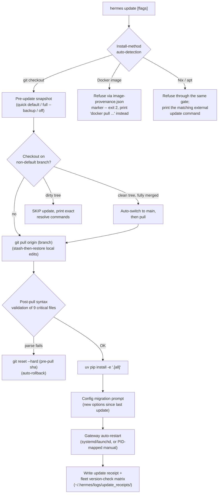

# Packaging, distribution, and self-update mechanics

**Scope note.** This page treats the harness's own binary/package -- not
the model it talks to, not the tools it exposes -- as the subject: how
`claude`, `copilot`, `opencode`, and `dsh` themselves get onto a machine, how a
build is produced for each operating system and CPU architecture, and how
a running installation discovers and applies a newer version of itself.
No other page in this book owns this ground. The only prior trace is a
single changelog line inside [retries.md](retries.md) naming Claude
Code's auto-updater as one of many subsystems that gained retry
hardening -- that citation is corrected and superseded here (see §1.4)
rather than repeated, and retries.md now points back to this page for
the full mechanism.

Like [tui-cli-application-architecture.md](tui-cli-application-architecture.md),
this is explicitly "table stakes" engineering, not a differentiating
design decision the way orchestration or context compression are -- every
mature CLI tool needs an install story and an update story, and the
interesting content here is mechanism and history, not design
philosophy. Claude Code and Copilot CLI are both closed source, so their
internal build tooling is not inspectable; this page's account of them
is built entirely from their own official docs and their own
`CHANGELOG.md`/`changelog.md` behavior-change histories, both fetched
fresh this session, with real reported bugs drawn from their own Issues
trackers where useful. OpenCode is genuinely open source, so its section
is grounded in its own install script, build script, publish script, and
CI workflow, read directly from the `dev` branch this session -- with
the branch caveat repeated wherever it matters, per this book's usual
practice.

Claude Code, Copilot CLI, and OpenCode arrived at the diagram above
independently -- see §7's synthesis for exactly how each one's own docs,
changelog, or source confirms its own piece of it. pi (§4) is the one
harness in this book that does **not** fit this diagram for its primary
npm package -- its own docs describe it as "distributed as an npm
package" outright, with no per-platform `optionalDependencies` binary
swap in the main package at all; §4.2 and §7's synthesis both return to
exactly where pi's own distribution shape diverges from the other
three's. Hermes Agent (§5) is a second, differently-shaped outlier again:
it ships no npm/pip package for the harness itself at all, distributing
instead as a git checkout inside a managed Python virtual environment.
DeepSeek Harness (§6) partially fits this diagram: its main `@deepseek-ai/dsh`
npm package has no per-platform `optionalDependencies` map at all (it is a
pure-JavaScript package requiring Node.js at runtime), but a *sibling*
npm package within the same monorepo -- `@deepseek-ai/node-addon-landlock-run`,
the Linux-only Landlock sandboxing launcher -- does follow the entry-plus-
platform-`optionalDependencies` pattern independently. The Python SDK
distribution (`deepseek-harness-sdk` / `deepseek-harness-runtime-bin` on PyPI)
bundles a precompiled platform-specific `dsh` executable inside a per-platform
wheel, another separate shape from any channel on this page.

---

## 1. Claude Code

### 1.1 Distribution mechanisms

VERIFIED from `code.claude.com/docs/en/setup`, fetched fresh this
session. Claude Code ships through six distinct channels, and the docs
are explicit about which one is "recommended":

- **Native installer (recommended).** `curl -fsSL https://claude.ai/install.sh | bash`
  on macOS/Linux/WSL, `irm https://claude.ai/install.ps1 | iex` in
  PowerShell, or a `curl`-then-run `.cmd` file in classic CMD on Windows.
  The docs state plainly: "Native installations automatically update in
  the background to keep you on the latest version." The same script
  accepts a channel name (`bash -s stable`) or an exact version
  (`bash -s 2.1.89`) as a positional argument, and that choice becomes
  the installation's default auto-update channel going forward.
- **Homebrew.** Two separate casks, not one cask with a flag:
  `brew install --cask claude-code` tracks the `stable` release channel
  ("typically about a week behind and skips releases with major
  regressions"), while `claude-code@latest` tracks every release as it
  ships. Homebrew installs do **not** auto-update by default; the docs
  are explicit that `brew upgrade claude-code` (or the `@latest` cask
  variant) is required.
- **WinGet.** `winget install Anthropic.ClaudeCode`, also manual-upgrade
  by default (`winget upgrade Anthropic.ClaudeCode`).
- **Linux package repositories.** Signed `apt`, `dnf`, and `apk`
  repositories, each offering the same `stable`/`latest` channel split
  as the native installer and Homebrew. Every repository is signed with
  a published Anthropic GPG key (fingerprint
  `31DD DE24 DDFA B679 F42D 7BD2 BAA9 29FF 1A7E CACE`, quoted directly
  from the docs), and package-manager installs update through the
  normal system upgrade workflow, not through Claude Code itself.
- **npm.** `npm install -g @anthropic-ai/claude-code`. As of v2.1.198
  the package declares a Node.js 22+ engine requirement, but this is
  advisory only: on an older Node the install completes with an
  `EBADENGINE` warning and `claude` still runs, because -- and this is
  the load-bearing structural fact -- "the package downloads a native
  binary that doesn't use your Node.js at runtime." npm pulls that
  binary in as a per-platform **optional dependency** (e.g.
  `@anthropic-ai/claude-code-darwin-arm64`), and a postinstall step
  links it into place; supported npm install platforms are
  `darwin-arm64`, `darwin-x64`, `linux-x64`, `linux-arm64`,
  `linux-x64-musl`, `linux-arm64-musl`, `win32-x64`, and `win32-arm64`.
  The docs explicitly warn against `sudo npm install -g`.
- **VS Code extension (`anthropic.claude-code`).** A structurally
  distinct distribution channel covered on its own in §1.5, because it
  bundles a *private copy* of the CLI rather than depending on any of
  the five channels above.

Also documented, and out of this page's CLI-focused scope beyond naming
it: a Desktop app for macOS/Windows/Linux, distributed independently of
all of the above.

### 1.2 Cross-platform build considerations

VERIFIED from the same docs page. The supported OS matrix is stated
precisely: macOS 13.0+, Windows 10 1809+/Server 2019+, Ubuntu 20.04+,
Debian 10+, and Alpine Linux 3.19+, on x64 or ARM64, with a 4 GB+ RAM
floor. Several cross-platform edge cases are named explicitly rather
than glossed over:

- **musl vs. glibc.** Alpine and other musl/uClibc-based distributions
  need `bash`, `curl`, `libgcc`, and `libstdc++` installed manually (not
  present by default on Alpine) before the install script will even run,
  plus a separate `ripgrep` package from Alpine's community repository
  and a `USE_BUILTIN_RIPGREP=0` settings override, because the bundled
  ripgrep binary Claude Code otherwise ships is not musl-compatible.
  This is a second, independent native dependency (ripgrep, for the
  `Grep` tool) riding along with the main binary, not just the main
  binary itself.
- **Windows has two genuinely different install targets, not one.**
  Native Windows and WSL are documented as separate options with
  different consequences: native Windows has no
  [sandboxing](permissions-and-sandboxing.md) support at all, while WSL2
  does; native Windows also branches at install time on whether Git for
  Windows is present, since that determines whether Claude Code's Bash
  tool has a real Bash to call (via Git Bash) or falls back to a
  documented, separate PowerShell tool.
- **The Windows ARM64 build is a later addition, not day-one coverage.**
  A fresh fetch of `CHANGELOG.md` this session (`gh`-fetched from
  `github.com/anthropics/claude-code`, 5,534 lines, covering v1.0.40
  through v2.1.233) shows "Added Windows ARM64 (`win32-arm64`) native
  binary support" landing at v2.1.41 -- confirming the eight-platform
  npm matrix above was built up incrementally, not shipped complete from
  the start.
- **Platform-specific native modules can fail independently of the main
  binary.** The same changelog documents two voice-mode regressions tied
  to platform packaging specifically, not to the agent loop or model
  behavior: the macOS native binary needed an added `audio-input`
  entitlement so the OS would even prompt for microphone permission, and
  the Windows native binary separately failed voice mode with "native
  audio module could not be loaded" -- two distinct per-platform native
  dependency bugs, fixed independently.

### 1.3 Binary integrity and code signing

VERIFIED from the docs page. Every release publishes a `manifest.json`
with SHA256 checksums for every platform binary, and from release
`2.1.89` onward that manifest itself carries a detached GPG signature
(`manifest.json.sig`) from the same Anthropic release-signing key named
in §1.1 -- the docs walk through importing the key, checking its
fingerprint, verifying the detached signature, then hashing the local
binary and comparing it against the signed manifest, which "transitively
verifies every binary it lists." Beyond that shared manifest signature,
individual binaries carry platform-native signatures where the platform
supports it: macOS binaries are signed by "Anthropic PBC" and notarized
by Apple (verifiable with `codesign --verify`), Windows binaries are
signed by "Anthropic, PBC" (verifiable with
`Get-AuthenticodeSignature`), and Linux binaries are **not**
individually code-signed -- the docs say integrity there rests on the
manifest signature (native installer / direct download) or on the
package manager's own repository-signing verification (`apt`/`dnf`/`apk`).

### 1.4 Auto-update flow

VERIFIED from `code.claude.com/docs/en/setup` and cross-checked against
the fresh `CHANGELOG.md` fetch above. The native installer is the one
channel with genuine background self-update:

- **Check cadence and application timing.** "Claude Code checks for
  updates on startup and periodically while running. Updates download
  and install in the background, then take effect the next time you
  start Claude Code" -- i.e. a running session is never hot-patched
  mid-turn; the new version is staged and picked up on the *next*
  launch. `claude doctor` reports the result of the most recent update
  attempt.
- **Launcher mechanics.** On macOS/Linux the installer manages
  `~/.local/bin/claude` as a symlink into `~/.local/share/claude/versions/`,
  so an update is really "install a new version directory, then decide
  whether the launcher should point at it." Before v2.1.207 the
  auto-updater unconditionally overwrote a hand-edited launcher symlink
  at that path on every release; the docs now describe the current,
  more cooperative behavior (auto-update and `claude update` leave a
  detected custom launcher alone, install new versions under
  `versions/` regardless, and let the custom launcher decide what to
  run), and the changelog independently confirms this landed at
  v2.1.207 and needed a further correctness fix at v2.1.221 ("Fixed the
  auto-updater overwriting a custom launcher script or symlink...on each
  release; `/doctor` now flags externally managed launchers").
- **Release channels.** The `autoUpdatesChannel` `settings.json` key
  takes `"latest"` (default -- "receive new features as soon as they're
  released") or `"stable"` (about a week behind, skipping
  major-regression releases), configurable via `/config` or directly in
  the settings file, and enforceable org-wide through managed settings.
  Homebrew picks its channel by cask name instead of this setting, as
  noted in §1.1.
- **Version floor, not just a channel.** A separate `minimumVersion`
  setting is a hard floor: "Background auto-updates and `claude update`
  refuse to install any version below this value" -- distinct from (and
  composable with) the channel choice, so switching from `latest` to
  `stable` cannot silently downgrade a machine that is already ahead of
  what `stable` currently serves. `requiredMinimumVersion` /
  `requiredMaximumVersion` are a further, managed-settings-only pair
  that make Claude Code *refuse to start* outside a version range,
  distinct from the update-time-only `minimumVersion` pin.
- **Disabling updates, two tiers deep.** `DISABLE_AUTOUPDATER=1` (an
  `env` key in `settings.json`) stops only the background check --
  `claude update` and `claude install` still work manually. A stricter,
  separate `DISABLE_UPDATES` variable "block[s] all update paths,
  including manual `claude update`," documented for organizations that
  distribute Claude Code through their own channel and need users
  pinned to a specific build. The changelog shows this distinction was
  hardened incrementally rather than shipped complete: v2.1.221's
  `CLAUDE_CODE_PACKAGE_MANAGER_AUTO_UPDATE` addition let Homebrew/WinGet
  users opt *into* an automatic background upgrade-command run (v2.1.221's neighbor
  in the changelog, added earlier, is the flag's actual introduction at
  what the changelog dates as the `2059`-line entry, "Added
  `CLAUDE_CODE_PACKAGE_MANAGER_AUTO_UPDATE`..."), and a later fix (the
  changelog's `2687`-line entry) closed a gap where
  `DISABLE_AUTOUPDATER` "not fully suppressing the npm registry version
  check and symlink modification on npm-based installs."
- **Manual trigger and observability.** `claude update` applies a
  pending update immediately and reports
  `Successfully updated from <old> to <new>` or
  `Claude Code is up to date (<version>)`; Homebrew/WinGet/apk-managed
  installs report `Claude is up to date!` instead, since the update
  itself is delegated to the package manager. `/doctor`'s "Updates"
  section (changelog-dated to the v4164-line-numbered entry in this
  session's fetch, i.e. an early-2.x-era release) shows the configured
  channel and available npm versions on both tracks.
- **npm installs get a distinct failure mode.** If the npm global
  directory isn't writable, Claude Code cannot self-update at all and
  instead shows a one-time startup notice (changelog: "Claude Code now
  shows a one-time notice when your npm global install can't
  auto-update; `/doctor` lists the fixes," and a separate, earlier
  changelog entry: "Added deprecation notification for npm
  installations -- run `claude install`...") -- both entries land well
  before the eventual native-installer-recommended framing seen in
  today's docs, and together read as a multi-release campaign to move
  users off the npm channel's auto-update limitations and onto the
  natively-managed one.
- **Robustness history is the single densest packaging-adjacent thread
  in the whole changelog.** A fresh grep of the 5,534-line file this
  session surfaced, among others: v2.1.207 streaming binary downloads to
  disk instead of buffering in memory ("reducing peak memory usage by
  approximately 400 MB during updates"); a fix for the auto-updater
  "starting overlapping binary downloads when the slash-command overlay
  repeatedly opened and closed, accumulating tens of gigabytes of
  memory"; v2.1.205's fix for installer/updater downloads aborting
  immediately on a mid-download proxy/network drop, now retried instead
  ("transient connection drops now retry" -- the entry retries.md
  originally, and mistakenly, dated to v2.1.144; the correct version,
  confirmed by re-reading the changelog's own version-numbered sections
  directly rather than trusting an earlier paraphrase, is **v2.1.147**,
  and retries.md has been corrected accordingly); a Windows-specific fix
  restoring a preserved executable automatically after an auto-update
  failure left `claude.exe` missing; and v2.1.200's background-agent
  daemon hardening so "a reinstalled older build can no longer take over
  the daemon," judged by "the version's embedded build timestamp" rather
  than a naively-compared version string.
- **Plugin auto-update is a related but distinct subsystem, not the
  same mechanism.** The changelog separately documents auto-update
  behavior for *plugins* (`extraKnownMarketplaces` `autoUpdate` policy,
  a `FORCE_AUTOUPDATE_PLUGINS` override, and several plugin-marketplace
  auto-update correctness fixes). This page keeps that scoped out: it
  is the [built-in-skills.md](built-in-skills.md)/plugin-ecosystem
  layer auto-updating *its own* content, not the Claude Code binary
  auto-updating itself, even though both surfaces reuse the word
  "auto-update" and both appear in the same changelog file.

### 1.5 The VS Code extension as its own distribution channel

VERIFIED from `code.claude.com/docs/en/vs-code`, fetched fresh this
session. This is the one channel that doesn't fit the "native installer
vs. package manager vs. npm" taxonomy above, because it distributes a
*second, private* copy of the CLI rather than pointing at any
system-wide install:

- **Marketplace distribution.** Installed from the VS Code Marketplace
  (`anthropic.claude-code`) or, for VS Code forks that can't reach that
  marketplace (Cursor, Devin Desktop, Kiro), from the Open VSX registry.
- **A bundled, private CLI copy, not the system `claude`.** The docs
  state directly: "The extension bundles its own copy of the CLI...for
  the chat panel," and separately, "Installing the extension does not
  put `claude` on your shell PATH. The extension bundles a private copy
  of the CLI for its chat panel, but typing `claude` in a terminal
  requires the standalone CLI install." A `claudeProcessWrapper` VS Code
  setting exists specifically to point the extension at a *different*,
  separately-installed `claude` binary when "the extension build doesn't
  include one for your platform" -- an explicit acknowledgment that the
  extension's own bundled-binary platform coverage can lag or omit a
  platform the standalone installer already supports.
- **A reverse auto-install mechanic unique to this channel.** Running
  the standalone CLI's `claude` inside VS Code's own integrated terminal
  causes Claude Code to *auto-install the VS Code extension itself* if
  it isn't already present -- the docs describe disabling this via
  `/config`'s "Auto-install IDE extension" toggle,
  `autoInstallIdeExtension: false` in `settings.json`, or the
  `CLAUDE_CODE_IDE_SKIP_AUTO_INSTALL=1` environment variable, and note
  that re-running `claude` from an integrated terminal reinstalls the
  extension again unless one of those is set. This is a genuinely
  distinct direction from every other update/install mechanic on this
  page: instead of the package auto-updating itself, running the CLI can
  install a *different* package (the extension) as a side effect.
- **VS Code's own extension host owns the extension's actual
  update cadence.** The docs do not describe a Claude-Code-specific
  update check for the extension separate from VS Code's built-in
  extension auto-update behavior; this is BEST CURRENT UNDERSTANDING,
  UNCONFIRMED rather than a direct docs quote; the docs' own
  troubleshooting section for "Extension won't install" simply points
  back at "the VS Code Marketplace" as the source of truth.

---

## 2. GitHub Copilot CLI

### 2.1 Distribution mechanisms

VERIFIED from `github.com/github/copilot-cli`'s own `README.md`,
fetched fresh this session. Four install paths, README-ordered
identically to Claude Code's own docs ordering (native script first):

- **Install script.** `curl -fsSL https://gh.io/copilot-install | bash`
  or the `wget` equivalent, for macOS and Linux. `| sudo bash` installs
  system-wide to `/usr/local/bin`; a `PREFIX` environment variable
  redirects the install directory (defaulting to `/usr/local` as root or
  `$HOME/.local` otherwise); a `VERSION` environment variable pins an
  exact release, quoted in the README with a literal worked example:
  `curl -fsSL https://gh.io/copilot-install | VERSION="v0.0.369" PREFIX="$HOME/custom" bash`.
- **Homebrew** (macOS and Linux): `brew install copilot-cli` for the
  stable release, or a separate `brew install copilot-cli@prerelease`
  cask for the prerelease channel -- the same one-cask-per-channel
  pattern Claude Code uses, independently named.
- **WinGet** (Windows): `winget install GitHub.Copilot`, with a
  parallel `winget install GitHub.Copilot.Prerelease` package ID for
  prerelease builds.
- **npm** (macOS, Linux, and Windows): `npm install -g @github/copilot`,
  with `npm install -g @github/copilot@prerelease` as the prerelease
  equivalent. The npm package's postinstall step requires script
  execution; if a user's `~/.npmrc` sets `ignore-scripts=true`, the
  README-documented workaround is
  `npm_config_ignore_scripts=false npm install -g @github/copilot`.

Prerequisites are minimal and platform-conditional: PowerShell v6+ on
Windows specifically, and an active Copilot subscription everywhere.
Direct platform executables are also published on the
`copilot-cli` GitHub repository's own Releases page as a fifth,
no-package-manager path.

### 2.2 Cross-platform build considerations

Mostly reconstructed from `changelog.md` rather than from an explicit
architecture document, since Copilot CLI publishes no build-tooling
docs of its own; each item below is dated against the 2,979-line
changelog fetched fresh this session (`gh`-raw-fetched from
`github.com/github/copilot-cli`, covering v0.0.328 through v1.0.80).

- **Dual native-binary-plus-JavaScript-fallback architecture.** At
  v1.0.56 (2026-05-29): "Native binary crash (e.g. SIGSEGV) now falls
  through to the JavaScript fallback instead of silently exiting" --
  this is the clearest direct confirmation that Copilot CLI, like Claude
  Code, ships a compiled native binary as its primary execution path
  with a pure-JS path kept as a safety net, not the other way around.
  Earlier, at v0.0.370 (2025-12-18), "Use platform-specific executable
  from npm install when available" shows this dual-path architecture
  being introduced into the npm distribution specifically, implying an
  earlier, pure-JS-only era of the npm package.
- **A likely Node.js Single Executable Application (SEA) basis.** At
  v1.0.64 (2026-06-23): "Use the correct Linux libc target when
  resolving and auto-updating SEA packages on musl hosts." This is a
  direct, verbatim changelog quote, and it is the only place in the
  fetched changelog that names the packaging technology outright.
  Reading "SEA" here as Node.js's own Single Executable Application
  feature is BEST CURRENT UNDERSTANDING, UNCONFIRMED -- reasonable given
  the term's specificity and Copilot CLI's Node/npm distribution
  history, but not independently confirmed against a Copilot-CLI-specific
  architecture document this session, and not assumed to imply anything
  about Claude Code's or OpenCode's own (differently, Bun-based for
  OpenCode -- see §3.2) compiled-binary toolchains.
- **musl/Alpine handling, independently confirmed twice.** Beyond the
  SEA-and-musl entry above, a separate, earlier fix (v0.0.something
  bundled inside the same file, quoted verbatim from the fetched
  changelog): "CLI auto-updater downloads the correct musl Linux package
  on Alpine systems" -- the same class of glibc-vs-musl bug Claude Code
  independently hit and fixed (§1.2), arrived at independently by a
  different closed-source team.
- **A universal vs. platform-specific package distinction, with a size
  incentive.** At v1.0.49 (2026-05-18): "Auto-update downloads the
  smaller platform-specific package instead of the universal one when
  available" -- confirming Copilot CLI maintains both a
  platform-specific artifact and a fallback "universal" one, and that
  the update path prefers the smaller, more specific artifact once it
  exists for a given target.
- **MSI installer and a removed Node version floor, same release.** At
  v0.0.389 (2026-01-22), two adjacent entries: "Add MSI installer for
  Windows" and "Remove Node version requirement from npm package" --
  read together, this is the same milestone Claude Code hit later at
  its own v2.1.198 (§1.1): once a native binary genuinely doesn't depend
  on the installed Node runtime, the npm `engines` gate protecting
  against an incompatible Node install stops being necessary, and both
  teams removed the corresponding constraint once their own dual-path
  architecture matured enough to make it safe.
- **Windows package-extraction races, one dated example.** At v1.0.42
  (2026-05-06): "CLI updates on Windows no longer fail with ENOENT when
  a transient EPERM occurs during package extraction" -- the same class
  of Windows-file-lock-during-update bug Claude Code independently
  documents (§1.4), again arrived at independently.

### 2.3 Auto-update flow

VERIFIED primarily from `changelog.md`, cross-checked against
`docs.github.com/en/copilot/reference/copilot-cli-reference/cli-command-reference`
and two live GitHub Issues/Discussions from `github/copilot-cli`, all
fetched fresh this session.

- **Commands.** `copilot update` ("Download and install the latest
  version," per the official command reference, quoted directly) and
  `copilot version` ("Display version information and check for
  updates") are the two persistent CLI-level commands; inside an
  interactive session, `/update` mirrors `copilot update` and `/upgrade`
  is a documented alias for it (changelog: "Add `/upgrade` as an alias
  for the `/update` command"). A separate, team-account-only
  `/downgrade VERSION` slash command ("Download and restart into a
  specific CLI version," per the command reference) is a distinct,
  explicit-rollback-to-an-older-version mechanic with no equivalent
  named in either other harness's own docs.
- **Update channels and prerelease.** `copilot update stable` and
  `/update stable` are documented to accept `"stable"` as an explicit
  channel argument (changelog: "Allow `copilot update` and `/update` to
  accept `stable` as a channel"), and a later release added an optional
  `prerelease` argument to the same two entry points to fetch "the
  latest prerelease build." A further hardening (changelog: "`/update`
  and `/version` commands now honor your configured update channel")
  closed a gap where the explicit commands could diverge from whatever
  channel setting the user had actually configured.
- **Disabling and controlling auto-update.** A real GitHub Issue,
  `github/copilot-cli#2615` ("`autoUpdate` in `config.json` is
  ignored," filed by user `czf`, fetched directly via `gh issue view`
  this session, open as of this fetch), reports that starting at
  v1.0.4 the `autoUpdate`/`auto_update` `config.json` setting stopped
  taking effect, while the reporter independently confirms in the same
  issue body that "the `--no-auto-update` [flag] still works" and "the
  `COPILOT_AUTO_UPDATE` environment variable set to false still works."
  This is treated here as VERIFIED that both the flag and the
  environment variable are real, functioning controls (a user directly
  testing and reporting their behavior against a real, running CLI), and
  the config-key regression itself is VERIFIED as a real, filed,
  as-of-this-session-still-open bug -- not as confirmation that GitHub's
  own docs describe these controls this way, since no first-party docs
  page naming `COPILOT_AUTO_UPDATE` or `--no-auto-update` was
  successfully fetched this session. A separate, resolved GitHub
  Discussion (`github/copilot-cli#1199`, closed, fetched via the GitHub
  API this session) shows a user pinning an older version and disabling
  auto-update entirely with
  `npm install -g @github/copilot@0.0.398 && copilot --no-auto-update`
  after a regression in v0.0.399 broke `AGENTS.md` parsing for them --
  independent corroboration that `--no-auto-update` is a real,
  user-facing flag, and that version-pinning via an explicit npm
  version tag is a normal recovery path Copilot CLI users actually use.
- **CI is auto-update-disabled by default.** Changelog, v0.0.407
  (2026-02-11): "Help text notes auto-update is disabled in CI
  environments by default" -- a documented default distinct from any of
  the explicit opt-out mechanisms above.
- **Storage path and update scope evolved.** Changelog, v0.0.421
  (2026-03-03): "Use consistent `~/.copilot/pkg` path for auto-update
  instead of `XDG_STATE_HOME`" -- narrowing where update artifacts live
  to a single, predictable location. One release earlier, v0.0.420
  (2026-02-27): "Auto-update now also updates the binary executable,
  not just the JS package" -- direct evidence that Copilot CLI's
  auto-updater originally updated only the JavaScript layer, with the
  native-binary half of the dual-path architecture (§2.2) being folded
  into the same update mechanism only after that point.
- **Disk-cleanup policy changed direction twice.** v0.0.388
  (2026-01-20) added "Clean up old package versions during auto-update
  check to free disk space"; v0.0.394 (2026-01-24) reversed course
  ("Auto-update no longer removes old CLI package versions"); v1.0.40
  (2026-05-01) reintroduced the behavior ("Automatically clean up old
  CLI package versions from disk during auto-update"). Whatever tradeoff
  drove the middle reversal is not stated in the changelog text itself,
  so this page records the sequence rather than speculating about the
  cause.
- **Windows update-race hardening, a small dated cluster.** v1.0.6
  (2026-03-16): "Auto-update correctly recovers from race conditions on
  Windows" and "CLI no longer fails to load on Windows after updating
  while another instance is running"; v1.0.7 (2026-03-17): "Resolve an
  edge case where auto-update could leave an incomplete package on
  Windows." v1.0.4 (2026-03-11) separately hardened the auth path
  specifically: "Auto-update now retries without authentication token on
  SAML enforcement errors," and the same release changed `/update`'s
  restart behavior ("`/update` command automatically restarts to apply
  updates instead of requiring manual exit").
- **Rate-limit hardening on the update path itself, already
  cross-referenced from retries.md.** [retries.md](retries.md) §2
  documents two entries this page treats as belonging to the packaging
  story rather than the model-request-retry story: v1.0.55 (2026-05-28,
  "`copilot update` and `copilot version` authenticate release API
  requests to avoid rate limit errors in shared-NAT environments") and
  v1.0.57 (2026-06-01, "Actionable error message shown when GitHub API
  rate limit is hit during `copilot update`"). Both are about the
  GitHub Releases API the updater itself calls, not the model-chat
  completions endpoint -- the same "rate limit" word spanning two
  unrelated surfaces that retries.md already flagged, restated here
  because this is the mechanism those two entries are actually
  hardening.
- **Observability additions.** v1.0.44 (2026-05-08) added an optional
  `prerelease` argument (noted above) in the same release that also
  "Show[s] download progress when running the update command"
  (v1.0.43, 2026-07-20 -- one release earlier in this changelog's
  numbering); v1.0.3 (2026-03-09) added a `--binary-version` flag "to
  query the CLI binary version without launching," a lighter-weight
  check than a full `copilot version` invocation.
- **Plugin auto-update is again a distinct, adjacent subsystem.**
  Mirroring §1.4's Claude Code finding, the changelog separately
  documents an `autoUpdate` setting scoped to plugin marketplaces
  ("Set `\"autoUpdate\": true` on an `extraKnownMarketplaces` entry...to
  auto-update its plugins at session start") and first-party plugins
  updating automatically at session start. This is the plugin
  ecosystem's own content-update mechanism, not the `copilot` binary
  updating itself, despite sharing both the word "autoUpdate" and, per
  GitHub Issue #2615 above, at least one adjacent regression report.

### 2.4 The GitHub Copilot VS Code extension -- a different, older product

Bounded, and deliberately kept short to avoid AUTHORITY OVERREACH: the
base "GitHub Copilot" VS Code extension (code completions and Copilot
Chat) is a separate, longer-standing GitHub product from Copilot CLI,
not the same codebase distributed through a second channel the way
Claude Code's extension bundles its own CLI (§1.5). Per
`docs.github.com/en/copilot/managing-copilot/configure-personal-settings/installing-the-github-copilot-extension-in-your-environment`,
fetched fresh this session: "When you set up GitHub Copilot in Visual
Studio Code for the first time, the required extensions are installed
automatically. You don't need to download or install them manually," and
it is also installable directly from the VS Code Marketplace; JetBrains
IDEs install it from the JetBrains Marketplace by name; Xcode, Vim/Neovim,
and Eclipse each have their own separate, docs-listed install paths (a
manual download from `github/CopilotForXcode`, a `git clone` of a plugin
repository, and the Eclipse Marketplace/Update Site respectively). The
fetched docs page does not state an explicit Copilot-specific auto-update
mechanism for any of these; that each IDE's own native extension-update
machinery is what actually keeps the extension current is BEST CURRENT
UNDERSTANDING, UNCONFIRMED, not a claim this session's fetch can source
directly. This page does not go further into that product's packaging,
since it is not Copilot CLI.

---

## 3. OpenCode

OpenCode is the one harness in this book whose packaging pipeline is
directly source-readable rather than reconstructed from docs and
changelogs alone. Every claim in this section not explicitly marked
docs-only was read directly from a raw file fetch of
`github.com/anomalyco/opencode` on the `dev` branch this session --
repeating this book's usual caveat that `dev` is not a tagged stable
release and may not match what a given install actually runs.

### 3.1 Distribution mechanisms

VERIFIED from `opencode.ai/docs/`, fetched fresh this session, and
cross-checked directly against the install script's own source (see
§3.2):

- **Install script (primary/recommended).**
  `curl -fsSL https://opencode.ai/install | bash`, listed first in the
  docs, matching both other harnesses' own choice to lead with a
  curl-based native installer rather than npm.
- **Node-ecosystem package managers.** `opencode-ai` is published for
  npm, Bun, pnpm, and Yarn alike -- i.e. it is a single, unscoped
  package name (not `@opencode-ai/opencode`; the `@opencode-ai` npm
  scope is used for OpenCode's *other* published packages -- the SDK,
  the plugin package, and internal tooling like the
  [`@opencode-ai/http-recorder`](evals-and-testing-a-harness.md) test
  package this book has already documented -- while the CLI itself
  ships unscoped).
- **System package managers.** Homebrew via a dedicated tap,
  `brew install anomalyco/tap/opencode` (the docs and independent
  community sources agree this tap tracks releases more closely than
  the separately-maintained, Homebrew-team-owned generic `opencode`
  formula); Arch Linux via `pacman`/`paru`; Windows via Chocolatey
  (`choco install opencode`) or Scoop (`scoop install opencode`); `mise`
  (`mise use -g github:anomalyco/opencode`); and a Docker image at
  `ghcr.io/anomalyco/opencode`.
- **Direct binary releases** are also published on GitHub, for anyone
  bypassing every package manager above.
- **Windows-native support is explicitly incomplete.** The docs note
  Bun installation on Windows is "currently in progress" and recommend
  WSL for "the best experience on Windows" -- an explicit, docs-stated
  platform-maturity gap neither closed-source harness's own docs
  concede as directly about their own native Windows path.

### 3.2 Cross-platform build considerations

Directly source-read this session from
`packages/opencode/script/build.ts` and the install script itself
(fetched via raw content from the `dev` branch).

```mermaid
flowchart LR
    subgraph Targets["12 build targets (build.ts)"]
        L1["linux-arm64 / linux-arm64-musl"]
        L2["linux-x64 / linux-x64-baseline / linux-x64-musl"]
        D1["darwin-arm64 / darwin-arm64-baseline"]
        D2["darwin-x64 / darwin-x64-baseline"]
        W1["win32-arm64 / win32-arm64-baseline"]
        W2["win32-x64 / win32-x64-baseline"]
    end
    Targets --> BunBuild["Bun.build() per target\n(ESM, splitting, minify,\ntarget: 'bun-&lt;os&gt;-&lt;arch&gt;')"]
    BunBuild --> Out["dist/{name}-{os}-{arch}[-baseline][-musl]/\n  bin/opencode\n  package.json"]
    Out --> Publish["publish.ts scans dist/*/package.json\nand builds the main opencode-ai\npackage's optionalDependencies map"]
```

- **Twelve distinct build targets, not a flat OS-times-arch grid.**
  Linux, macOS ("darwin"), and Windows are each built for both `arm64`
  and `x64`, and every one of those six combinations additionally gets
  a "**baseline**" variant that excludes AVX2 CPU instructions "for
  broader compatibility" (i.e. for older CPUs that predate AVX2), plus
  Linux additionally gets `musl` variants of both architectures for
  Alpine and other musl-libc systems -- twelve total build outputs from
  one script.
  Each target compiles via `Bun.build()` with the compile target string
  built dynamically (e.g. `"bun-linux-arm64"`), ESM output with code
  splitting and minification enabled, `autoloadTsconfig`/`autoloadPackageJson`
  turned on, and output landing at
  `dist/{package-name}-{os}-{arch}[-baseline][-abi]/bin/opencode`
  alongside a generated `package.json` for that specific platform
  package.
- **The install script independently re-derives the same target
  taxonomy at runtime**, confirming build-time and install-time target
  naming are kept in sync: `uname -s`/`uname -m` map to `darwin`/`linux`/
  `windows` and `arm64`/`x64`, with additional runtime detection for
  Rosetta (on Apple Silicon Macs running an Intel build), musl (on
  Linux, to pick the `-musl` artifact), and AVX2 support (to pick a
  `-baseline` artifact on older CPUs) -- the exact same baseline/musl
  axes the build script produces. The resulting archive is named
  `$APP-$target$archive_ext` (`.tar.gz` on Linux, `.zip` elsewhere,
  e.g. `opencode-linux-x64.tar.gz`), installs to
  `$HOME/.opencode/bin/opencode` with `755` permissions, and honors a
  `VERSION` environment variable or `--version <version>` flag, a
  `--binary <path>` local-file-install override, and a
  `--no-modify-path` flag to skip appending the install directory to
  shell config files.
- **CI build matrix and code signing**, read from
  `.github/workflows/publish.yml` this session: the CLI/preview-CLI
  binaries build across `macos-26-intel` (x86_64-apple-darwin),
  `macos-26` (aarch64-apple-darwin), `windows-2025`
  (aarch64-pc-windows-msvc), a `blacksmith`-hosted x64 Windows runner,
  and `blacksmith`-hosted x64/arm64 Ubuntu runners. macOS artifacts are
  signed via `apple-actions/import-codesign-certs` and notarized using
  an Apple API key; Windows CLI executables (arm64, x64, and
  x64-baseline variants specifically) are signed through Azure Trusted
  Signing, independently verified in the workflow itself via
  PowerShell's `Get-AuthenticodeSignature`. Publishing itself runs
  through `script/publish.ts` with `OPENCODE_VERSION`/`OPENCODE_RELEASE`
  environment variables and `NPM_CONFIG_PROVENANCE: false`, uploading
  to both the npm registry and GitHub Container Registry.
- **Two adjacent, non-CLI build/publish surfaces exist in the same
  workflow directory and are explicitly not this page's subject.** The
  same `.github/workflows/` directory (26 workflow files total,
  enumerated via a directory listing this session) contains a
  `build-electron` job driving `electron-builder` for a **separate
  Electron desktop app** (with its own macOS/Windows/Linux signing and
  RPM packaging via `electron-builder`) and a dedicated
  `publish-vscode.yml` workflow for **a separate VS Code extension**.
  Both are real, named build targets in OpenCode's own CI, but this page
  scopes to the terminal CLI's own packaging the same way it scopes
  Claude Code and Copilot CLI to their CLI/npm channels rather than
  their VS Code extensions' full internals (§1.5, §2.4) -- named here
  for completeness, not analyzed further.

### 3.3 npm package structure

Directly source-read this session from `packages/opencode/script/publish.ts`.
The main `opencode-ai` package's own `package.json` is not hand-authored
with a fixed dependency list; it is assembled at publish time by
scanning every `dist/*/package.json` produced by the build step
described in §3.2, building an `optionalDependencies` map keyed by each
platform package's name (e.g. `opencode-linux-arm64`,
`opencode-darwin-x64`), and pinning every one of them to the same
version (read from `Object.values(binaries)[0]`, i.e. the version is a
single source of truth shared by every platform package, not
independently bumped). The package is published with an explicit
`--tag ${Script.channel}` (typically `latest`, or a specific channel
identifier). A `postinstall.mjs` script performs the actual
platform-to-binary resolution at install time -- the same
optionalDependency-plus-postinstall shape both Claude Code and Copilot
CLI's own npm packages use (§1.1, §2.2), arrived at completely
independently by a third, unrelated team -- and a fallback stub `.exe`
ships alongside it that, if the postinstall step is ever skipped (e.g.
by an `ignore-scripts` npm setting, the same class of gap Copilot CLI's
own README documents a workaround for in §2.1), prints an error
directing the user to re-run the postinstall script manually rather than
silently doing nothing.

### 3.4 Auto-update flow

Directly source-read this session from
`packages/opencode/src/cli/cmd/upgrade.ts` and
`packages/opencode/src/installation/index.ts` (both `dev` branch), plus
one live-fetched GitHub Issue.

- **A real, explicit `opencode upgrade` command, not a passive
  background daemon.** `opencode upgrade` (bare) resolves and installs
  the latest version; `opencode upgrade v0.1.48` (an explicit version
  argument, with a leading `v` stripped if present) pins a specific
  release; a `--method` flag lets a user override auto-detection and
  force one of `curl`, `npm`, `pnpm`, `bun`, or `brew` explicitly,
  confirmed against `opencode.ai/docs/cli/` fetched fresh this session.
- **Installation method detection is itself layered and path-aware,
  read directly from `installation/index.ts`.** `method()` first checks
  whether the running executable's own path (`process.execPath`)
  lives under `.opencode/bin` or `.local/bin`, which identifies a
  curl-script install without needing to shell out to anything.
  Failing that, it probes each package manager in turn with that
  manager's own "is this package installed globally" query (`npm list
  -g --depth=0`, `yarn global list`, `pnpm list -g --depth=0`,
  `bun pm ls -g`, `brew list --formula opencode`,
  `scoop list opencode`, `choco list --limit-output opencode`),
  returning `"unknown"` if none of them mention the package by name --
  at which point `upgrade.ts` prompts the user to proceed anyway rather
  than refusing outright.
- **Every install method gets a genuinely different upgrade
  implementation, not one generic "re-run installer" path.** curl
  re-fetches and re-runs the install script from
  `https://opencode.ai/install` with `VERSION` set to the resolved
  target; npm/pnpm/bun run `[manager] install -g opencode-ai@[target]`
  directly; brew optionally re-taps `anomalyco/tap`, pulls the tap's git
  history, then runs `brew upgrade [formula]`; choco runs
  `choco upgrade opencode --version=[target] -y`; scoop runs
  `scoop install opencode@[target]`. Every path captures its own exit
  code and raises a shared `UpgradeFailedError` on failure, and that
  error carries method-specific remediation text -- the source
  explicitly special-cases Chocolatey on Windows with a
  "please run the terminal as Administrator" hint, since a Chocolatey
  upgrade commonly needs elevation that the others don't.
- **Version-check ("what's latest") queries a different endpoint per
  method too**, not one shared API: brew queries `brew info --json=v2`
  for the tap or `https://formulae.brew.sh/api/formula/opencode.json`
  for the core-Homebrew formula; npm/pnpm/bun query
  `[registry]/opencode-ai/[channel]`; choco queries the Chocolatey OData
  API; scoop reads a GitHub-hosted raw manifest from the
  `ScoopInstaller/Main` bucket; and curl, yarn, and the `"unknown"` case
  all fall back to the GitHub API's latest-release endpoint.
- **A real, filed, currently-open bug scopes what `opencode upgrade`
  actually touches.** GitHub Issue `anomalyco/opencode#10441`,
  surfaced via a targeted web search and confirmed to exist as a live
  issue title this session ("`opencode upgrade` doesn't update plugin
  dependencies in `~/.config/opencode/package.json`"), is exactly the
  same category of binary-vs-plugin-content conflation both other
  harnesses' own changelogs independently document (§1.4, §2.3): the
  CLI's own self-update is a distinct code path from whatever mechanism
  keeps plugin dependencies current, and at least one real user has hit
  the gap between them.
- **Whether anything runs `latest()`/`upgrade()` automatically, without
  an explicit `opencode upgrade` invocation, is not confirmed from
  source this session.** `opencode.ai/docs/`, fetched fresh, states
  plainly that "[m]ost users do not need to manually update, as OpenCode
  will stay up to date automatically," and separately documents an
  `OPENCODE_DISABLE_AUTOUPDATE` environment variable ("Disable automatic
  update checks") -- both are treated here as VERIFIED, since they come
  directly from the official docs site fetched this session. What this
  page could **not** verify is the mechanism behind that claim: a direct
  read of `installation/index.ts` this session found `method()`,
  `upgrade()`, and `latest()` as the file's only exported update-related
  functions, with no visible startup check, no background timer, and no
  reference to `OPENCODE_DISABLE_AUTOUPDATE` in that specific file.
  GitHub's code-search API also returned zero results for that
  environment variable name and for several related identifiers
  (`autoupdate`, `checkForUpdate`) scoped to this repository during this
  session's attempts -- most plausibly because GitHub code search only
  indexes a repository's default branch and this book already treats
  `dev` as the branch actually being read, rather than evidence the
  functionality doesn't exist. Net effect: the *existence* of some
  automatic update-staying-current behavior and its opt-out variable are
  VERIFIED from docs; *where in the codebase it fires, and whether it
  auto-applies an update or only checks/notifies*, is BEST CURRENT
  UNDERSTANDING, UNCONFIRMED, and this page declines to guess further
  than that.

---

## 4. pi

Primary sources this session: the npm registry API for
`@earendil-works/pi-coding-agent`, `@earendil-works/pi-ai`, and
`@mariozechner/pi-coding-agent` (fetched directly via `curl` against
`registry.npmjs.org`); `github.com/earendil-works/pi`'s own repository
metadata, `README.md`, `CHANGELOG.md`, `docs/quickstart.md`,
`docs/packages.md`, `docs/windows.md`, its Releases and Tags (all via
`gh api`); `packages/coding-agent/package.json`,
`scripts/build-binaries.sh`, `.github/workflows/build-binaries.yml`,
`src/utils/windows-self-update.ts`, and `src/package-manager-cli.ts`
(raw file fetches from the `main` branch -- pi's `main` is the
equivalent of Claude Code's and Copilot CLI's own tagged-release
branches, not a `dev`/preview branch the way OpenCode's is, so no
branch caveat applies the way it does in §3); the installer script
itself, fetched live from `https://pi.dev/install.sh`; and Mario
Zechner's own blog post on the project's move to Earendil, fetched
directly this session.

### 4.1 One repo, two real npm packages -- resolving this book's own inconsistent citation

This book's own pages disagree on pi's package name because they are
each correctly describing a *different* package inside the same
monorepo, not because either citation is wrong. `github.com/earendil-works/pi`'s
`packages/` directory (VERIFIED, listed directly this session) contains
eleven workspace packages, of which two matter for this page:
`packages/ai`, published to npm as **`@earendil-works/pi-ai`**
("Unified LLM API with automatic model discovery and provider
configuration," per its own registry metadata) and already the correct
subject of [llm-api-contract.md](llm-api-contract.md) §3.5's own
citation there -- and `packages/coding-agent`, published to npm as
**`@earendil-works/pi-coding-agent`**, whose own `package.json`
(VERIFIED, fetched directly this session) declares
`"bin": { "pi": "dist/bundle/cli.js" }` and the description "Coding
agent CLI with read, bash, edit, write tools and session management."
`@earendil-works/pi-coding-agent` -- the thing a user actually
`npm install -g`s to get the `pi` command -- is this page's subject; it
depends on `@earendil-works/pi-ai` (pinned as `^0.84.4` in the fetched
`package.json`, alongside sibling internal packages
`@earendil-works/pi-agent-core`, `-client`, `-protocol`, and `-tui`, all
version-locked to the same release number) rather than being a
different spelling of the same thing. Where this book has previously
written `@earendil-works/pi-coding-agent` (session-persistence.md,
deterministic-orchestration.md) it named the CLI correctly; where it
has written `@earendil-works/pi-ai` for the LLM-API-layer discussion
specifically (llm-api-contract.md §3.5) it also named its subject
correctly. No correction to either prior page is needed on this point;
this section exists so a reader landing on either citation understands
they are both right about two different, real, sibling packages.

### 4.2 Distribution mechanisms

VERIFIED, fetched directly this session from `docs/quickstart.md`,
`README.md`, and `docs/windows.md` at `github.com/earendil-works/pi`,
main branch, and cross-checked against the live `pi.dev/install.sh`
script and the GitHub Releases API. pi's own docs state its primary
channel in one sentence very different from any of the other three
harnesses' own framing: "Pi is distributed as an npm package."

- **npm (the documented primary channel, not a secondary one).**
  `npm install -g --ignore-scripts @earendil-works/pi-coding-agent`.
  The README explains the flag directly: "`--ignore-scripts` disables
  dependency lifecycle scripts during install. Pi does not require
  install scripts for normal npm installs" -- a structural tell that,
  unlike Claude Code's, Copilot CLI's, and OpenCode's own npm packages
  (§1.1, §2.1, §3.3), pi's main package has no postinstall step
  resolving a per-platform native binary, because there is no such
  binary in this package: `package.json`'s only `optionalDependencies`
  entry is `@mariozechner/clipboard` (a small native clipboard addon),
  not a platform-specific build of pi itself. `pnpm`, `yarn global`,
  and `bun` are documented as equally valid install/uninstall
  managers for the same package (`docs/quickstart.md`'s Uninstall
  section lists all four side by side).
- **A hard, not advisory, Node.js floor.** `package.json`'s
  `"engines": { "node": ">=22.19.0" }` is enforced, not merely
  warned about: `install.sh`'s own preflight check
  (`run_preflight_checks`, read directly from source this session)
  parses `process.versions.node` and refuses to proceed --
  "error: Pi requires Node.js 22.19.0 or newer" -- rather than letting
  an old Node continue with a warning the way Claude Code's own npm
  package does past its own 22+ engine declaration (§1.1). If Node or
  npm is missing or too old, the installer offers an *interactive*
  fix, detecting the platform's own Node install method (Homebrew,
  `apt`, `apk`, or a standalone download) and asking to install a
  fresh Node before continuing -- a genuinely more opinionated
  preflight step than any of the other three harnesses' own installers
  document.
- **The curl installer wraps npm; it does not replace it.**
  `curl -fsSL https://pi.dev/install.sh | sh` is documented as "an
  installer alternative" to the direct `npm install -g` command, and
  `docs/quickstart.md`'s own uninstall instructions state this
  outright: "The curl installer uses npm globally, so curl and npm
  installs are removed with npm." Reading the live script this session
  confirms this precisely: by default (`run_npm_install_pi`, gated
  behind `pi_managed_install_enabled() { [ "${PI_EXPERIMENTAL:-}" = 1 ];
  }`) the script's actual install step is
  `npm install -g --ignore-scripts --min-release-age=0 [--prefix <dir>]
  --no-fund --no-audit @earendil-works/pi-coding-agent` -- i.e. the
  same npm package as above, invoked on the user's behalf after the
  preflight checks, not a separately-built standalone binary the way
  `claude.ai/install.sh`, `gh.io/copilot-install`, or
  `opencode.ai/install` each independently are (§1.1, §2.1, §3.1). The
  one flag worth noting on its own -- `--min-release-age=0` -- exists
  specifically so the installer can bypass npm's release-age-based
  install gate (a supply-chain-hardening npm feature that otherwise
  refuses very recently published versions by default), and the
  script's own comment names the reason: "Pi publishes
  npm-shrinkwrap.json, so the explicit installer/reinstaller can bypass
  npm's release-age gate without reopening transitive dependency
  ranges" -- i.e. the shrinkwrap's fully pinned transitive dependency
  tree is treated as the safety net that makes bypassing the age gate
  acceptable for this one, controlled install path.
- **A separate, opt-in "managed install" mode exists behind
  `PI_EXPERIMENTAL=1`**, changing the shape of the install entirely; it
  is covered in full in §4.5 because it is really an update-lifecycle
  mechanism (stage, verify, atomically activate) rather than a
  distinct *distribution* channel -- the artifacts it fetches still
  come from the same npm registry, just via a pinned manifest instead
  of a floating `npm install -g` resolution.
- **No Homebrew, WinGet, or Linux system-package-repository channel at
  all.** Unlike all three other harnesses in this book, pi's own
  README and docs describe exactly two ways to get `pi` onto a machine
  (npm-family package manager, or the curl script that itself calls
  npm) plus one more, undocumented in prose, described next.
- **GitHub Release binary archives exist, but are not a documented
  install path.** A direct fetch of the v0.84.4 release via the GitHub
  API (VERIFIED this session) shows ten real assets attached:
  `pi-darwin-arm64.tar.gz`, `pi-darwin-x64.tar.gz`,
  `pi-linux-arm64.tar.gz`, `pi-linux-x64.tar.gz`,
  `pi-windows-arm64.zip`, `pi-windows-x64.zip`, a
  `pi-0.84.4-source.tar.gz` source archive, a `SHA256SUMS` checksum
  file, and `pi-coding-agent-install-package.json`/
  `-package-lock.json` (the exact pinned-manifest pair the managed
  install flow in §4.5 downloads). Neither `README.md` nor
  `docs/quickstart.md` mentions manually downloading these archives as
  a user-facing install option anywhere fetched this session; that
  their real purpose is backing the managed-install flow and the
  `pi.dev/api/installer/releases` endpoint it calls (rather than being
  an advertised sixth channel) is BEST CURRENT UNDERSTANDING,
  UNCONFIRMED, reasoned from the exact filename match against §4.5's
  own findings rather than a docs statement saying so directly.

### 4.3 Cross-platform build considerations

Directly source-read this session from `scripts/build-binaries.sh`,
`.github/workflows/build-binaries.yml`, and
`packages/coding-agent/src/utils/windows-self-update.ts` on the `main`
branch.

- **Six binary targets, built with `bun build --compile` from a single
  Linux CI runner, not per-platform native runners.** `build-binaries.sh`
  (its own header comment quoted directly) builds
  `darwin-arm64`, `darwin-x64`, `linux-x64`, `linux-arm64`,
  `windows-x64`, and `windows-arm64` -- six targets, not the eight (with
  musl variants) Claude Code's npm matrix covers (§1.2) or the twelve
  (with musl and AVX2-baseline variants) OpenCode's build script
  produces (§3.2) -- and `package.json`'s own `build:binary` script
  (quoted directly: `bun build --compile --no-compile-autoload-bunfig
  ./src/bun/cli.ts ...`) confirms Bun's own cross-compilation feature is
  the mechanism, matching OpenCode's own choice of build tool (§3.2)
  rather than Claude Code's or Copilot CLI's undisclosed closed-source
  toolchains. `.github/workflows/build-binaries.yml` (read directly)
  runs this entire six-platform build on a single `ubuntu-latest`
  runner via cross-compilation, unlike OpenCode's own CI matrix, which
  spins up dedicated macOS and Windows runners for at least some of its
  targets and code-signs/notarizes on them (§3.2).
- **No code-signing or notarization step found in the publish
  workflow.** A direct read of `build-binaries.yml` this session shows
  no macOS codesigning/notarization step and no Windows
  Authenticode/Trusted-Signing step anywhere in the job that produces
  these six archives -- only a final `sha256sum` pass writing
  `SHA256SUMS`. This is VERIFIED as true of *this specific workflow
  file, read this session*; it is not proof no signing happens anywhere
  else in pi's release process, but it is a real, sourced point of
  contrast against Claude Code's dual manifest-signature-plus-native-
  code-signing scheme (§1.3) and OpenCode's Apple-notarization-plus-
  Azure-Trusted-Signing CI steps (§3.2) -- pi's own binary-integrity
  story rests on the published checksum file alone.
- **Windows: Git Bash by default, an optional native PowerShell tool,
  and a source-level workaround for a Windows-specific self-update
  failure mode.** `docs/windows.md` (VERIFIED, fetched directly) states
  pi checks for Git Bash at `C:\Program Files\Git\bin\bash.exe` first,
  then any `bash.exe` on `PATH` (Cygwin, MSYS2, WSL), the same
  Git-for-Windows dependency Claude Code's own native-Windows Bash tool
  has (§1.2); a `powershell` tool exists as an opt-in `defaultTools`
  replacement, launched with `-NoProfile -NonInteractive
  -ExecutionPolicy Bypass`. Separately,
  `src/utils/windows-self-update.ts` (read directly from source this
  session) implements a **native-dependency quarantine** specifically
  to make `npm install -g` succeed as a self-update on Windows: because
  Windows keeps a loaded `.node` native-addon file locked while pi (or
  a loaded dependency like the clipboard addon) is running, npm cannot
  simply overwrite it in place. `quarantineWindowsNativeDependencies()`
  walks the currently-loaded shared objects reported by
  `process.report.getReport().sharedObjects`, and for each one living
  inside the package's own `node_modules` tree, renames it into a
  `.pi-native-quarantine` directory next to `node_modules` and copies a
  fresh, unlocked file back into its original path -- freeing the
  original filename for npm to overwrite while the just-quarantined
  copy keeps satisfying the *currently running* process's already-open
  file handle. `cleanupWindowsSelfUpdateQuarantine()` sweeps that
  directory clean on a later run once the old handle is no longer
  needed. `package-manager-cli.ts` (also read directly) calls this pair
  from `prepareWindowsNpmSelfUpdate()` only on `process.platform ===
  "win32"`, immediately before spawning the actual update command, and
  a second guard in the same file restricts *which* Windows installs
  this self-update path even covers: a quoted error string reads
  "`${APP_NAME} self-update on Windows is only supported for npm and
  pnpm installs`" -- Windows installs made via `yarn` or `bun` are
  refused an automatic self-update and pointed at a manual command
  instead (`printSelfUpdateFallback`). This is a real, source-verified
  Windows-native-module-locking workaround, arrived at independently
  from Claude Code's own Windows launcher-preservation fixes (§1.4) and
  Copilot CLI's own Windows package-extraction-race fixes (§2.2) --
  three different closed- and open-source teams, three structurally
  different fixes, for three variations on the same underlying
  Windows-file-locking-during-update problem class.

### 4.4 Version-number history and the two-hop rename off `@mariozechner/pi-coding-agent`

- **One shared version number across the whole monorepo, going back
  further than pi's own public history.** `packages/coding-agent/scripts/sync-versions.js`'s
  existence and `package.json`'s own version-locked sibling dependencies
  (§4.1) both point at a single, monorepo-wide version counter; a
  direct paginated fetch of `github.com/earendil-works/pi`'s own git
  tags this session (313 tags total) shows that counter running from
  `v0.0.1`/`v0.0.2` up through pre-public `v0.5.x`-`v0.8.x` releases,
  crossing into `v0.10.0` -- which `CHANGELOG.md` itself labels
  "Initial public release," dated 2025-11-25 -- and continuing
  unbroken to today's `v0.84.4` (2026-08-28). The version number was
  never reset at any of the rename events below.
- **A real, verified npm-package rename, not merely a citation
  inconsistency.** A direct fetch of `registry.npmjs.org
  /@mariozechner/pi-coding-agent` this session returns a real,
  still-resolvable package: 270 published versions, `0.6.2` through a
  `"latest"` dist-tag of `0.73.1`, and that latest version's own
  `deprecated` field reads, quoted verbatim from the registry response:
  **"please use @earendil-works/pi-coding-agent instead going
  forward."** A parallel fetch of `registry.npmjs.org
  /@earendil-works/pi-coding-agent` shows the successor package
  beginning at `0.74.0`, published 2026-05-07, with a `"legacy-node20"`
  dist-tag pinned at `0.74.2` alongside `"latest"` at `0.84.4` --
  independent, direct evidence that a Node-20-compatible line was
  maintained separately for at least one version after the Node 22.19+
  floor (§4.2) became the mainline requirement.
- **The rename is tied to the project's move from an individual
  maintainer to a company, confirmed from the maintainer's own words.**
  Mario Zechner's blog post announcing this (fetched directly this
  session, `mariozechner.at/posts/2026-04-08-ive-sold-out/`) states the
  GitHub repository would move from `badlogic/pi-mono` to
  `earendil-works/pi` and that the npm package would be renamed
  correspondingly, adding "We're hoping GitHub will set up a redirect
  so existing links and clones don't break" for the repo move and a
  similar promise of "a sort of redirect" for the package rename; the
  post also states plainly that `pi.dev` "remains pi's home" throughout
  the move. One concrete detail is worth flagging as a real
  planned-vs-shipped discrepancy: the post names the *target* npm
  package as `@earendil/pi`, but the package that actually shipped and
  is live on the registry today is `@earendil-works/pi-coding-agent` --
  a different scope and a different base name from what was announced.
  This page cannot confirm from this session's sources why the shipped
  name differs from the announced one; that gap is recorded rather than
  guessed at. That the acquiring company is named "Earendil" is
  VERIFIED directly from this fetched post; any further detail about
  Earendil's own location or founders was not independently fetched
  from a primary source this session and is not asserted here.
- **The rename is a distribution-history event this book has not
  documented for any other harness on this page.** Claude Code,
  Copilot CLI, and OpenCode's own package names and repository
  ownership have been stable across every changelog and doc this book
  has fetched for them; pi is the one harness on this page with a
  live, registry-confirmed "install the old name and get told to
  install the new one" deprecation message still resolvable today.

### 4.5 Self-update: a single `pi update` command family, plus an experimental staged/managed install

- **One command family, deliberately covering both binary self-update
  and package/extension updates, not two separate subsystems.** This is
  the one clear structural departure from Claude Code, Copilot CLI, and
  OpenCode, each of which keeps "the harness updates itself" and "the
  plugin/skill/extension layer updates its own content" as two
  distinct mechanisms that merely happen to share the word
  "auto-update" in their own changelogs (§1.4, §2.3, §3.4, and this
  page's own closing synthesis point 5 below). pi's docs (`README.md`,
  `docs/packages.md`, both fetched directly this session) instead
  define a single `pi update` verb with flags selecting scope:
  `pi update` bare or `pi update --self` (update pi only, the default
  when no target is given), `pi update --self --force` (reinstall even
  if already current), `pi update --extensions` (packages only),
  `pi update --models` (refresh provider model catalogs only --
  cross-referenced from [model-routing-and-selection.md](model-routing-and-selection.md),
  not re-derived here), `pi update --all` (pi, packages, and pinned-git-ref
  reconciliation together), and `pi update npm:@foo/pi-tools` (one named
  package). `docs/packages.md` states directly that `pi update` "can
  update the pi CLI installation" in the same breath as documenting
  package updates -- one verb, one mental model, flag-scoped rather than
  command-family-scoped.
- **Startup update-check and install/update telemetry are named as two
  separate features in pi's own docs, each independently disable-able.**
  `README.md`'s own "Telemetry and update checks" section (quoted
  directly): "**Update check:** fetches `https://pi.dev/api/latest-version`
  to check whether a newer Pi version exists. Disable it with
  `PI_SKIP_VERSION_CHECK=1`. Disabling update checks only turns off this
  check." and "**Install/update telemetry:** after first install or a
  changelog-detected update, sends an anonymous version ping to
  `https://pi.dev/api/report-install`... Opt out by setting
  `enableInstallTelemetry` to `false` in `settings.json`, or by setting
  `PI_TELEMETRY=0`. This does not disable update checks." A single
  `--offline`/`PI_OFFLINE=1` disables both plus package-update checks in
  one step. `pi update` itself is documented to never prompt for
  project trust, unlike `pi config` and other package commands
  (`docs/packages.md`, quoted in §4.2's neighbor discussion of project
  trust elsewhere in this book).
- **Package-manager detection drives which self-update command actually
  runs, source-confirmed.** `package-manager-cli.ts`'s
  `getSelfUpdateCommand()`/`getSelfUpdatePlan()` (read directly this
  session) resolve the installing package manager and construct the
  matching `[manager] install -g @earendil-works/pi-coding-agent@<version>`
  invocation, printing a manager-specific fallback command
  (`printSelfUpdateFallback`) if the spawned update itself fails, and a
  pnpm-specific hint (`printPnpmSelfUpdateMetadataHint`, quoted
  directly: "If pnpm reports missing package versions, its cached
  registry metadata may be stale. Run `pnpm store prune` and retry...")
  distinct from anything documented for the other three harnesses'
  own package-manager-specific update paths.
- **A renamed-package escape hatch is already wired into the self-update
  planner.** `getSelfUpdatePlan()`'s own logic (read directly) checks
  `packageName !== PACKAGE_NAME` against the fetched latest-release
  metadata and, if the *name* itself has changed server-side, plans an
  update that installs the new package name rather than the old one.
  Whether this exact code path is what handled the
  `@mariozechner/pi-coding-agent` -> `@earendil-works/pi-coding-agent`
  rename in §4.4 for existing installs is BEST CURRENT UNDERSTANDING,
  UNCONFIRMED -- the structural match is strong (this is precisely the
  kind of migration such a check would exist to handle) but this
  session did not find a changelog entry or doc sentence stating the
  historical rename was carried out through this specific mechanism.
- **The experimental "managed install" is a stage-verify-atomically-
  activate update mechanism, explicitly named as such in pi's own
  CHANGELOG.** `CHANGELOG.md`'s `[0.84.3]` entry (VERIFIED, quoted
  directly) lists "**Safer managed updates** — Stage, verify, and
  atomically activate updates for installer-managed installations," and
  `docs/packages.md` restates the mechanism in prose: "For experimental
  installer-managed installations, `pi update` installs the exact
  checked version into a staged, lockfile-backed release and activates
  it only after verification, leaving the current release intact if the
  update fails." Reading `install.sh` and
  `run_managed_install_pi()` directly this session confirms the
  mechanics behind that sentence: gated behind `PI_EXPERIMENTAL=1` and
  restricted to macOS/Linux (`ensure_managed_install_supported`
  rejects any other `uname -s`), the installer downloads a pinned
  `package.json`/`package-lock.json` pair for one specific version from
  `https://pi.dev/api/installer/releases/<version>/...` (validated
  node-side to actually describe that exact version and dependency
  tree before use), runs `npm ci --ignore-scripts --omit=dev
  --include=optional` inside a fresh staging directory, smoke-tests the
  staged binary's own `--version` output against the expected version,
  and only then atomically `mv`s the staging directory into
  `releases/<version>/` and rewrites a marker file, launcher script, and
  symlink to point at it -- a version that fails its own smoke test is
  simply discarded, leaving whatever release was previously active
  untouched. This is the one design in this section that reads like a
  genuine forward-update safety net beyond simple version pinning
  (§6's closing synthesis returns to this point), though its
  `PI_EXPERIMENTAL=1` gate and macOS/Linux-only scope mean it is not
  (yet, as of this session's fetch) pi's default install/update
  behavior for most users.

---

## 5. Hermes Agent (Nous Research)

Sources for this section: VERIFIED, fetched 1 September 2026 directly from
`hermes-agent.nousresearch.com/docs/getting-started/installation`,
`.../getting-started/platform-support`, `.../getting-started/updating`,
`.../user-guide/docker`, and `.../reference/cli-commands` (all via `curl`
this session, Hermes' Docusaurus site pre-renders full markdown content
into static HTML server-side, so a plain HTTP fetch returns the complete
prose rather than an empty JS shell); the repository's own release history
and metadata fetched via `gh api repos/NousResearch/hermes-agent` and
`gh api repos/NousResearch/hermes-agent/releases` this session. Hermes
Agent is a fifth, independent, self-hosted product -- see [Permissions &
sandboxing architecture](permissions-and-sandboxing.md) §6 for this book's
fuller architectural introduction to the harness itself (three entry
points funnelled into one `AIAgent` class, seven sandboxed terminal
execution backends), not repeated here.

### 5.1 Distribution mechanism: a git checkout inside a managed venv, not an npm/pip package

Hermes is the one harness in this book's packaging coverage that ships
**no package-registry artifact for the CLI harness itself at all** --
neither an npm package (Claude Code, Copilot CLI, OpenCode, pi, §1-§4
above) nor a PyPI package, despite being a Python-and-Node hybrid
codebase. The documented primary install path is a shell/PowerShell
installer piped directly from the project's own domain -- `curl -fsSL
https://hermes-agent.nousresearch.com/install.sh | bash` on Linux/macOS/
WSL2/Termux, or `iex (irm https://hermes-agent.nousresearch.com/install.ps1)`
on native Windows -- and the Installation page states plainly what that
script does: "The installer handles everything automatically -- all
dependencies (Python, Node.js, ripgrep, ffmpeg), the repo clone, virtual
environment, global `hermes` command setup, and LLM provider
configuration." Concretely, this is a `git clone` of
`NousResearch/hermes-agent` into `~/.hermes/hermes-agent/` (per-user
install) or `/usr/local/lib/hermes-agent/` (root-mode, an explicit FHS
layout for shared-machine deployments), a `uv`-managed Python virtual
environment built from that checkout, and a `hermes` launcher symlinked
onto the user's `PATH` (`~/.local/bin/hermes` per-user, `/usr/local/bin/
hermes` root-mode) -- the running artifact is source code plus a venv,
never a compiled binary or a registry-resolved package the way Claude
Code's, Copilot CLI's, OpenCode's, or pi's own npm packages are (§1.1,
§2.1, §3.1, §4.1-§4.2 above). A packaged **Hermes Desktop** installer
(macOS/Windows) wraps the same underlying CLI/venv install and adds a
GUI chat client, invoked afterward with `hermes desktop`. **Docker** is
the other Tier-1-supported distribution shape (§5.2, §5.5 below): a
published image, `nousresearch/hermes-agent`, pulled from Docker Hub
rather than built locally.

Platform Support (VERIFIED, quoted directly) is explicit that this is a
deliberate exclusion, not an oversight: PyPI installs ("`uv tool install
hermes-agent`, `pip install hermes-agent`, etc.") and Homebrew installs
(`brew install hermes-agent`) are both named under a dedicated
**Unsupported** heading, alongside the Arch User Repository, with the
stated policy that "PRs to fix them will *not* be accepted, and any code
that keeps compatibility with them may be removed at any point." This is
a materially different distribution philosophy from every other harness
this page documents: Claude Code, Copilot CLI, and OpenCode all treat
their npm packages as one first-class channel among several (§6's
closing synthesis point 2, unchanged above), and pi's own docs state
outright that "Pi is distributed as an npm package" (§4.2) with its curl
installer merely wrapping `npm install -g` underneath; Hermes inverts
that relationship entirely -- language-ecosystem package managers are
the explicitly rejected path, and the project's own installer script is
the one channel it commits to maintaining.

### 5.2 A named, three-tier platform-support policy -- a documentation pattern this page has not previously sourced

Distinct from any other harness on this page, Hermes' own docs name an
explicit, three-tier support commitment rather than leaving platform
coverage to be inferred from an install-methods list. **Tier 1**
("we strive to never break installations and updates for these... take
precedence over other platforms") covers macOS on Apple Silicon (Hermes
Desktop or `install.sh`), Windows 10/11 on x86_64 and aarch64 (Hermes
Desktop or `install.ps1`, with a named subset of features unavailable),
Linux/WSL2 on x86_64 and aarch64 (`install.sh`, tested against "the
latest Ubuntu and WSL2," with a documented informal requirement for
glibc, systemd, and Filesystem-Hierarchy-Standard compliance on other
distros), and the Docker container image on x86_64 and aarch64 -- the
same table noting directly that "Docker installs do not support `hermes
update`. Updating is done by running a new image," a distinction §5.4-
§5.5 below return to. **Tier 2** ("maintained in-tree only as a best
effort... releases may break them, and we can't promise we'll fix them
promptly") covers Android via Termux and Nix/NixOS, the latter captioned
bluntly: "Breaks often due to node.js packaging woes." **Unsupported**
is the PyPI/Homebrew/AUR list from §5.1 above, plus macOS on Intel (x86)
processors. No other harness this page has researched -- Claude Code,
Copilot CLI, OpenCode, or pi -- publishes a comparably explicit,
named-tier commitment distinguishing "we will never break this" from
"best effort" from "we will actively remove compatibility code for
this"; each of the other four instead documents a flat list of supported
platforms/architectures (§1.2, §2.2, §3.2, §4.3) without grading its own
support commitment by tier.

### 5.3 Versioning: CalVer release tags, no registry dist-tag channel to pin against

Hermes' own GitHub Releases (VERIFIED, fetched via `gh api
repos/NousResearch/hermes-agent/releases` this session) use a
**calendar-versioning** tag scheme, `vYYYY.M.D` with an optional
`.<patch>` suffix for same-day re-releases -- for example `v2026.8.31`,
`v2026.8.27`, `v2026.8.19`, `v2026.8.18`, `v2026.8.16.2`, `v2026.8.16`,
running back to `v2026.5.7` and beyond -- rather than the semantic-
versioning scheme (`major.minor.patch`) this book documents by inference
for Claude Code's, Copilot CLI's, and OpenCode's own npm-published
version numbers and pi's own `packages/coding-agent/CHANGELOG.md` (§4.4).
The observed cadence across the releases fetched this session is roughly
weekly to every few days -- nine tagged releases between 2026-08-03 and
2026-08-31 alone -- markedly tighter than this page's own citations for
Claude Code's and Copilot CLI's changelog-entry spacing, though this
book has not independently instrumented either project's actual release
cadence as a measured statistic, so the comparison is qualitative only.
The repository itself (VERIFIED, `gh api repos/NousResearch/hermes-agent`)
is MIT-licensed, created 2025-07-22, with a `pushed_at` timestamp from
this same session confirming active, current development. Because there
is no npm-registry or PyPI-registry distribution channel for the harness
itself (§5.1), Hermes has no dist-tag-style "stable vs. latest vs.
prerelease" channel concept to compare against Claude Code's
`autoUpdatesChannel`, Copilot CLI's channel-argument-plus-dist-tag pair,
or OpenCode's version-argument-only model (§6's closing synthesis point 3,
unchanged above) -- the closest equivalent is pinning a git install to a
specific release tag directly (§5.4) or pulling a specific Docker image
tag (§5.5), not selecting a named channel.

### 5.4 Self-update: `hermes update`, with more layered safety machinery than any other harness on this page

`hermes update` is a single command, gated by a documented
**install-method auto-detection** step that reads the install's own
layout (a `~/.hermes/hermes-agent/` git checkout, a Docker image-baked
provenance marker, or a Nix store path) rather than an environment
variable, and prints the matching update command for whichever method it
detects -- `hermes doctor` also surfaces the detected method under its
own environment summary. For a git-checkout install, the documented
sequence (Updating & Uninstalling page, quoted/paraphrased directly) is:
a pre-update snapshot (`updates.pre_update_backup`: `quick` by default --
pairing data, cron jobs, `config.yaml`, `.env`, `auth.json`, per-profile;
`full` for a complete zip of `HERMES_HOME`; `off` to disable, or
`--no-backup`/`--backup` per-run overrides), a `git pull` of the
configured update branch (`origin/main` by default, `--branch <name>` for
QA/release-candidate channels), **post-pull syntax validation** of the
nine critical files every `hermes` invocation imports at startup with an
**automatic `git reset --hard <pre-pull-sha>` rollback** if any fails to
parse, a dependency reinstall (`uv pip install -e ".[all]"`), a config-
migration prompt for options added since the user's last update, and a
gateway auto-restart (systemd/launchd for service-managed gateways,
PID-to-profile mapping for manually-launched ones, with a spawn-ledger-
recorded bind address so a network-bound `hermes serve`/`hermes
dashboard` backend relaunches on the same host and port a remote Desktop
client was already pointed at). This auto-rollback-on-syntax-failure
mechanism is a stronger, always-on safety net than anything this page
documents for Claude Code, Copilot CLI, or OpenCode's own forward-update
paths (§6's closing synthesis, unchanged above, already names the narrow
Windows-specific exception for Claude Code) and closer in spirit to pi's
own experimental stage-verify-atomically-activate managed install (§4.5)
-- except Hermes' version is not gated behind an experimental flag; it is
the default behavior of the one update path this harness ships.

Beyond the default path, `hermes update` carries a materially larger flag
surface than this page has sourced for any of the other four harnesses:
**`--check`** (fetch-and-compare against the remote branch, no writes, no
restarts -- for scripts/cron gating), **`--plan`** (a read-only "fleet
preview" naming every running Hermes service across every profile on the
machine, its supervisor, its currently-served code version, and the
restart mechanism it will get, explicitly including manually-launched
`serve`/`dashboard` backends discovered via a spawn ledger), **`--branch
<name>`** (update against a non-default branch, with dirty-tree/branch-
existence edge cases handled by an auto-stash-then-restore-on-failure
guarantee so a user is never left stranded mid-switch), **`--force-venv`**
(an explicit, narrower override than `--force` for Windows venv-recreation
locks specifically, deliberately *not* subsumed by `--force`), and
**`--keep-stash`** (used internally by the desktop-app updater so that
locally stashed source edits are parked in `git stash` rather than
silently auto-restored across a GUI-triggered update -- the update log
prints the exact `git stash apply <ref>` command to recover them). A
**fleet-version check** runs after every restart phase, comparing each
live gateway's running code against the freshly updated checkout over
that gateway's own local control socket where available, and the command
exits non-zero if any profile is still serving pre-update code -- "so
automation never treats a mixed-version fleet as healthy," in the docs'
own words. Windows carries two additional, source-visible guards: a
running-`hermes.exe`-holding-the-venv-executable check that blocks the
update outright (bypassable with `--force`, which still retries the
`.exe` rename with backoff and can schedule the replacement for next
reboot via `MoveFileEx(MOVEFILE_DELAY_UNTIL_REBOOT)`), and a second,
`--force`-*immune* guard against any process still running from the
venv's own Python interpreter, overridable only by the explicit
`--force-venv` flag -- a two-tier override structure (one bypassable
generically, one requiring a narrower, deliberate opt-in) this page has
not sourced for Claude Code's, Copilot CLI's, or OpenCode's own Windows
update-lock handling. Rollback for a git install is a manual, explicitly
documented procedure -- `git checkout <commit-hash-or-tag>` followed by
`uv pip install -e ".[all]"` and a gateway restart -- rather than an
automated undo command, with the docs naming release tags directly as
the rollback target ("a recent release like `v2026.5.16`, or any earlier
tag from `git tag --sort=-version:refname`") and warning that config
compatibility is not guaranteed across a rollback (`hermes config check`
is the documented recovery step). `hermes update` can also be triggered
remotely as `/update` from any connected messaging platform (Telegram,
Discord, Slack, WhatsApp, Teams), running the identical pull-reinstall-
restart sequence with the bot briefly offline (docs state "typically
5-15 seconds") during the gateway restart.

### 5.5 Docker: image-managed installs refuse `hermes update` by design, verified by an on-disk provenance marker

Docker is Hermes' one distribution shape that deliberately does **not**
route through §5.4's update path at all. The published image bakes a
small, read-only marker file, `/etc/hermes/image-provenance.json`, that
`hermes update`, `hermes update --check`, and the dashboard's own Update
button all consult before touching anything: on an image-managed
filesystem they refuse cleanly with **exit code 2**, print the actual
correct command (`docker pull nousresearch/hermes-agent:latest`), and
write a `refused` receipt into the same update-receipts directory §5.4
describes so fleet tooling can see the attempt happened rather than
silently no-op-ing. The refusal is keyed to "what the running filesystem
*is*, not what it looks like" -- the docs state directly that the marker
still wins even when a source checkout is bind-mounted into the
container, and a damaged or missing marker still refuses rather than
falling open (fail-closed, the same posture the docs use for Nix- and
apt-managed installs routed through the identical detection gate). The
documented upgrade sequence is instead `docker pull
nousresearch/hermes-agent:latest` followed by a container recreate
(`docker rm -f hermes && docker run ...`, or `docker compose pull &&
docker compose up -d`); the image itself is explicitly stateless, with
all user data (config, API keys, sessions, skills, memories) living on a
host bind mount at `/opt/data`, and the container runs **non-interactive
config-schema migrations** against the mounted `config.yaml` on startup,
writing timestamped backups of `config.yaml` and `.env` first when a
migration actually fires (`HERMES_SKIP_CONFIG_MIGRATION=1` opts out for
manual inspection). This "pull a new image, mount the same data volume,
let a startup migration reconcile config" pattern is architecturally the
image/container-native analogue of Claude Code's, Copilot CLI's, and
OpenCode's own npm-`optionalDependencies` binary-swap update mechanism
(§6's synthesis point 1, unchanged above) -- a real, independently
verified instance of "the running artifact's own packaging format
decides who owns the update," the same underlying principle this book's
synthesis already draws for install-method-determines-auto-update-
ownership (§6's synthesis point 4), now confirmed a further time by a
fifth harness whose Docker channel explicitly refuses to let its own
git-native update command reach across that boundary at all.

---

## 6. Cross-harness synthesis

Seven real, independently-arrived-at convergences-or-divergences and one
open gap, none of them re-derived past what §1-§5 actually sourced:

1. **Claude Code, Copilot CLI, and OpenCode independently converged on
   the identical npm distribution shape; pi's own main npm package does
   not follow it at all.** For the first three: a thin, mostly-metadata
   main package with a per-platform `optionalDependencies` map and a
   postinstall script that resolves and links the correct native
   binary, such that `npm install -g` never actually depends on Node.js
   at runtime. Claude Code's docs state this outright ("the package
   downloads a native binary that doesn't use your Node.js at
   runtime"); OpenCode's `publish.ts` builds the identical structure
   programmatically from its own `dist/*/package.json` outputs; Copilot
   CLI's changelog shows the same shape being introduced mid-lifecycle
   ("Use platform-specific executable from npm install when available,"
   "Native binary crash...falls through to the JavaScript fallback").
   See the flowchart at the top of this page. pi's own
   `@earendil-works/pi-coding-agent` package (§4.1-§4.2) is a genuine
   outlier here: it is a real, Node-runtime-dependent JavaScript
   package with a hard `>=22.19.0` engine floor enforced at
   install time, and its only `optionalDependencies` entry is a small
   native clipboard addon, not a platform build of pi itself. pi does
   publish per-platform compiled binaries (§4.3, via `bun build
   --compile`), but they ship as GitHub Release archives outside npm
   entirely, not folded into the main package the way all three other
   harnesses fold theirs in.
2. **Claude Code, Copilot CLI, and OpenCode all demote npm to a
   secondary install path and lead with a curl/`irm`-piped native
   installer or a platform package manager instead; pi's own docs do
   the opposite.** Claude Code's docs literally label the native
   installer "(Recommended)" and its own changelog shows a
   multi-release campaign pushing npm users toward `claude install`;
   Copilot CLI's README lists the curl script before npm; OpenCode's
   docs do the same. pi's own `docs/quickstart.md`, by contrast, states
   plainly "Pi is distributed as an npm package" and its curl installer
   is documented as "an installer alternative" that itself calls
   `npm install -g` under the hood (§4.2) -- rather than a fourth
   independently-arrived-at data point for this convergence, pi is a
   genuine counter-example to it.
3. **A stable-vs-latest/prerelease channel concept exists in some form
   in Claude Code, Copilot CLI, and OpenCode, but the mechanics differ
   structurally; pi documents no such channel concept at all.** Claude
   Code's is a persisted `settings.json` key (`autoUpdatesChannel`)
   plus separately-named Homebrew casks per channel; Copilot CLI's is a
   channel argument to explicit `copilot update`/`/update` invocations
   plus separately-named prerelease npm dist-tags/brew casks/WinGet
   package IDs; OpenCode documents no persisted channel concept at all
   -- only an explicit version argument or `--method` override to a
   user-invoked `opencode upgrade`. pi (§4.5) sits closest to OpenCode
   here: no stable/latest channel setting was found in any source
   fetched this session, only an explicit version (`@<version>`) target
   to `pi update` and the `--force` flag to reinstall the current
   version.
4. **The install method a user chose determines who owns auto-update,
   consistently across Claude Code and OpenCode.** Whichever channel is
   the harness's own "native"/curl-based installer gets real, silent,
   background self-update in Claude Code (§1.4) and is the one channel
   OpenCode's own docs credit with "stay[ing] up to date automatically"
   (§3.4, caveat noted); package-manager-based installs (Homebrew,
   WinGet, apt/dnf/apk, choco, scoop) are consistently treated as
   manual-upgrade-by-default across Claude Code (explicit in its docs)
   and OpenCode (each method's `upgrade()` implementation in §3.4 simply
   shells out to that package manager's own upgrade command, rather than
   replacing it) -- a repeated design stance of "the installer I fully
   own gets to auto-update; the installer you brought from your own
   package manager stays under your package manager's own control."
   Copilot CLI's docs did not yield an equally explicit statement of
   this same split this session, so that part of the claim is narrower
   for Copilot CLI specifically (its curl/npm paths are documented as
   auto-updating; whether its Homebrew/WinGet casks auto-update the same
   way was not confirmed either way this session). pi does not fit this
   pattern either way: there is only one real channel underneath both
   its curl installer and its direct npm install (the npm registry
   itself, §4.2), so there is no "installer-I-own vs. package-manager-
   you-brought" split left to draw -- `pi update --self` is the same
   mechanism (§4.5) regardless of which of npm/pnpm/yarn/bun originally
   installed it, only the specific spawned command differs.
5. **Every harness treats "plugin/marketplace content auto-update" as a
   distinct subsystem from "the harness binary auto-updates itself" --
   except pi, which deliberately unifies both under one command family
   instead.** Claude Code's `extraKnownMarketplaces` `autoUpdate` policy
   and `FORCE_AUTOUPDATE_PLUGINS` (§1.4), Copilot CLI's per-marketplace
   `autoUpdate` setting and first-party-plugin session-start
   auto-update (§2.3), and OpenCode's plugin-dependency gap documented
   in a live GitHub Issue against the very same `opencode upgrade`
   command that updates the binary (§3.4) are all real, repeated
   instances of the same naming collision -- one bare word,
   "auto-update," covering two genuinely different subsystems, worth
   carrying forward as a reading caution for anyone grepping any of
   those three changelogs and expecting every "auto-update" hit to be
   about the binary itself. pi's own `pi update` (§4.5) is the one
   design in this book that does not have this naming collision,
   because it was never two subsystems to begin with: `--self`,
   `--extensions`, `--models`, and `--all` are documented flags on one
   verb, not two verbs that happen to share a word.
6. **A harness's own npm package name is not assumed stable across this
   book's whole research history -- pi is the first, and so far only,
   harness on this page with a real, live, registry-confirmed rename
   mid-lifecycle.** §4.4's `@mariozechner/pi-coding-agent` ->
   `@earendil-works/pi-coding-agent` migration, tied to the project's
   move from an individual maintainer to the company Earendil, is a
   distribution-history event with no analogue found this session for
   Claude Code, Copilot CLI, or OpenCode, whose own package names and
   repository ownership have been stable across every source this book
   has fetched for them.
7. **Hermes Agent (§5) is the one harness on this page that rejects
   language-ecosystem package-manager distribution for its own CLI
   entirely, rather than merely demoting it (Claude Code, Copilot CLI,
   OpenCode, point 2 above) or leading with it (pi, §4.2).**
   PyPI and Homebrew installs are named explicitly as **Unsupported** in
   Hermes' own Platform Support docs, with "any code that keeps
   compatibility with them may be removed at any point" -- the opposite
   stance from every other harness this page documents, each of which
   maintains at least one package-registry channel as a first-class,
   actively-supported install path. Hermes' own primary artifact is a
   `git` checkout plus a `uv`-managed Python virtual environment (§5.1),
   its version identifiers are CalVer release tags rather than the
   semver-shaped version strings this page infers for the other four
   harnesses' own npm-published releases (§5.3), and its self-update
   command performs a real `git pull` plus dependency reinstall rather
   than a package-manager-mediated binary/package swap -- a genuinely
   different point on the distribution-mechanism spectrum from anything
   §1-§4 document, not a fifth instance of the same npm-centric shape.

**The one clear negative finding, nuanced first by pi's own experimental
mechanism and now a second time, differently, by Hermes' default
behavior.** None of Claude Code's, Copilot CLI's, or OpenCode's own
docs or changelog describe an automatic rollback-on-failed-update
safety net as a *general* policy -- the closest documented example is
Claude Code's narrow, Windows-specific fix ("failed updates now restore
the preserved executable automatically"), which reads as a targeted bug
fix rather than a designed-in rollback guarantee. The actual
user-facing safety mechanism in all three is version *pinning*, not
automatic rollback: Claude Code's `minimumVersion` floor and explicit
`VERSION` argument to its install script, Copilot CLI's `/downgrade
VERSION` team-account command and explicit npm-version-pin recovery
(directly demonstrated in the live GitHub Discussion cited in §2.3),
and OpenCode's explicit `opencode upgrade <version>` argument. Robustness
engineering effort across all three, per the changelog evidence
gathered in §1.4 and §2.2-2.3, has gone overwhelmingly into making the
*forward* update path more reliable (retry-on-transient-failure,
streamed-not-buffered downloads, launcher-preservation, Windows-lock-
race fixes) rather than into building a documented, general-purpose
undo. pi's own experimental managed install (§4.5) is the one mechanism
across the first four harnesses that reads like an actual designed-in
forward-then-abort safety net beyond simple version pinning -- stage,
smoke-test, and only then atomically activate, leaving a failed
candidate release un-activated rather than needing a rollback at all --
but it is gated behind `PI_EXPERIMENTAL=1`, restricted to macOS/Linux,
and not (as of this session's fetch) pi's default update behavior, so
it nuances this finding rather than overturning it. Hermes Agent (§5.4)
adds a third, distinct data point that nuances the finding differently
again: its post-pull **syntax-validation-triggered `git reset --hard
<pre-pull-sha>` auto-rollback** is not experimental or opt-in -- it is
the documented, default behavior of the one update path Hermes ships --
but it is deliberately narrow in scope, triggering only when one of the
nine startup-critical files fails to parse after the pull, not as a
general-purpose "this update introduced a regression, undo it" policy;
a change that pulls cleanly, parses correctly, and still breaks Hermes'
own runtime behavior is not caught by this mechanism and falls back to
the same manual `git checkout <tag>` rollback procedure this page
documents for the other four harnesses' own version-pinning-based
recovery paths. Taken together, this page now has three structurally
different answers to "what happens automatically when a self-update
goes wrong beyond a targeted bug fix": none of it (Claude Code, Copilot
CLI, OpenCode), an opt-in stage-verify-activate pipeline covering the
whole update (pi, experimental), and an always-on but narrowly-scoped
parse-failure trip-wire covering only one specific failure mode (Hermes,
default) -- no harness on this page ships a general-purpose, default-on,
"any regression, not just a syntax error, triggers automatic rollback"
guarantee.

---

## Sources

All fetched fresh this session unless noted otherwise.

**Claude Code (authoritative for its own documented behavior and its
own behavior-change history only; this repo ships no implementation
source):**
- `https://code.claude.com/docs/en/setup` -- the primary source for
  §1.1-§1.4: every install-method description, the system-requirements
  matrix, the Alpine/musl workaround, the Windows native-vs-WSL
  distinction, the full auto-update section (`autoUpdatesChannel`,
  `minimumVersion`, `DISABLE_AUTOUPDATER`/`DISABLE_UPDATES`,
  `CLAUDE_CODE_PACKAGE_MANAGER_AUTO_UPDATE`), the binary-integrity/
  code-signing walkthrough (manifest signature, per-platform code
  signing), and the uninstall instructions.
- `https://code.claude.com/docs/en/vs-code` -- the primary source for
  §1.5: the bundled-private-CLI-copy statement, `claudeProcessWrapper`,
  and the `autoInstallIdeExtension`/`CLAUDE_CODE_IDE_SKIP_AUTO_INSTALL`
  reverse-auto-install mechanic.
- `https://github.com/anthropics/claude-code` `CHANGELOG.md`, fetched
  fresh this session (raw content, 5,534 lines, covering v1.0.40 through
  v2.1.233) -- every dated entry cited in §1.2 and §1.4, including the
  v2.1.41 Windows ARM64 addition, the v2.1.147 auto-updater
  retry-hardening entry (the version number retries.md previously,
  incorrectly, cited as v2.1.144; corrected there and here after
  directly re-reading the changelog's own version-numbered sections
  this session), v2.1.198's Node 22 requirement, v2.1.200's daemon
  build-timestamp hardening, v2.1.205's connection-drop retry fix,
  v2.1.207's streamed-download memory fix and launcher-preservation fix,
  v2.1.221's launcher-overwrite fix, and the npm-deprecation-notice and
  npm-can't-auto-update-notice entries. Authoritative for its own
  behavior-change history only.

**GitHub Copilot CLI (authoritative for its own documented behavior and
its own behavior-change/Issues history only; no implementation source
exists in this repo):**
- `https://github.com/github/copilot-cli` `README.md`, fetched fresh
  this session (raw content) -- the primary source for §2.1: every
  install command, the `VERSION`/`PREFIX` install-script variables, the
  prerelease npm/brew/WinGet variants, and the `ignore-scripts`
  workaround.
- `https://github.com/github/copilot-cli` `changelog.md` (note the
  lowercase filename, distinct from Claude Code's `CHANGELOG.md`),
  fetched fresh this session (raw content, 2,979 lines, covering
  v0.0.328 through v1.0.80) -- every dated entry cited in §2.2 and §2.3,
  including the SEA/musl entry (v1.0.64), the dual native-binary/JS-
  fallback entries (v0.0.370, v1.0.56), the MSI-installer/Node-
  requirement-removal pair (v0.0.389), the `~/.copilot/pkg` path change
  (v0.0.421), the binary-vs-JS-package auto-update scope change
  (v0.0.420), the disk-cleanup policy reversal-and-reintroduction
  (v0.0.388/v0.0.394/v1.0.40), the Windows update-race cluster
  (v1.0.4/v1.0.6/v1.0.7), and the CI-auto-update-disabled-by-default
  entry (v0.0.407).
- `https://docs.github.com/en/copilot/reference/copilot-cli-reference/cli-command-reference` --
  the source for the verbatim `copilot update`/`copilot version`
  descriptions and the `/downgrade VERSION` team-account command, cited
  in §2.3.
- `https://docs.github.com/en/copilot/managing-copilot/configure-personal-settings/installing-the-github-copilot-extension-in-your-environment` --
  the source for §2.4's account of the separate GitHub Copilot VS Code
  extension's own install paths.
- `github/copilot-cli` Issue #2615 ("`autoUpdate` in `config.json` is
  ignored"), fetched via `gh issue view 2615 -R github/copilot-cli` this
  session -- the source for §2.3's `COPILOT_AUTO_UPDATE`/
  `--no-auto-update` confirmation and the v1.0.4 config-key regression,
  open as of this fetch.
- `github/copilot-cli` Discussion #1199 ("How do I revert back to an
  older release and stop cli from auto updating?"), fetched via
  `gh api repos/github/copilot-cli/discussions/1199` and its comments
  endpoint this session -- the source for §2.3's real-world
  version-pinning-plus-`--no-auto-update` recovery example, closed as
  of this fetch.

**OpenCode (authoritative for its own documented behavior and, unlike
the two repos above, its own real implementation; `dev`-branch caveat
applies to every source-code citation below):**
- `https://opencode.ai/docs/` and `https://opencode.ai/docs/cli/` --
  the source for §3.1's install-method list and §3.4's `opencode
  upgrade` usage, `--method` values, version-argument syntax, and the
  `OPENCODE_DISABLE_AUTOUPDATE` environment variable and
  "stay up to date automatically" claim.
- `https://raw.githubusercontent.com/anomalyco/opencode/dev/install`
  (the curl-installer script) -- the source for §3.1/§3.2's OS/arch
  detection, Rosetta/musl/AVX2-baseline handling, archive-naming
  convention, install location, and `VERSION`/`--version`/`--binary`/
  `--no-modify-path` handling.
- `https://raw.githubusercontent.com/anomalyco/opencode/dev/packages/opencode/script/build.ts` --
  the source for §3.2's twelve-target build matrix and `Bun.build()`
  invocation details.
- `https://raw.githubusercontent.com/anomalyco/opencode/dev/packages/opencode/script/publish.ts` --
  the source for §3.3's `optionalDependencies`-map-assembly and
  shared-version-pinning logic.
- `https://raw.githubusercontent.com/anomalyco/opencode/dev/.github/workflows/publish.yml`
  and a directory listing of
  `https://github.com/anomalyco/opencode/tree/dev/.github/workflows` --
  the source for §3.2's CI build-matrix, code-signing/notarization
  detail, and the adjacent Electron-desktop/VS Code-extension workflow
  names.
- `https://github.com/anomalyco/opencode/blob/dev/packages/opencode/src/cli/cmd/upgrade.ts`
  and
  `https://raw.githubusercontent.com/anomalyco/opencode/dev/packages/opencode/src/installation/index.ts` --
  the source for §3.4's `method()`/`upgrade()`/`latest()` mechanics, the
  per-method command list, and the explicit finding that this file
  contains no visible background/startup auto-update-check logic.
- `anomalyco/opencode` Issue #10441 ("`opencode upgrade` doesn't update
  plugin dependencies in `~/.config/opencode/package.json`"), confirmed
  to exist as a live issue title via a targeted web search this session
  -- the source for §3.4's plugin-vs-binary-update-scope finding.

**pi (authoritative for its own documented behavior and its own real
implementation; `main`-branch citations below are pi's equivalent of a
tagged-release branch, not a preview/`dev` branch, so no branch caveat
applies the way it does for OpenCode above):**
- `https://registry.npmjs.org/@earendil-works/pi-coding-agent`,
  `https://registry.npmjs.org/@earendil-works/pi-ai`, and
  `https://registry.npmjs.org/@mariozechner/pi-coding-agent`, fetched
  directly via `curl` this session -- the source for §4.1's package-name
  resolution and §4.4's full version-history and rename findings,
  including the verbatim `@mariozechner/pi-coding-agent` deprecation
  message and the `"legacy-node20"` dist-tag.
- `github.com/earendil-works/pi` repository metadata, `README.md`,
  `docs/quickstart.md`, `docs/packages.md`, `docs/windows.md`,
  `packages/coding-agent/package.json`, `packages/coding-agent/CHANGELOG.md`
  (raw content, 5,625 lines), its Releases (`v0.84.4` asset listing),
  and its Tags (313 tags, paginated), all fetched via `gh api`/`gh`-raw
  fetch this session -- the source for §4.1's `package.json` `bin`/
  `dependencies` fields, §4.2's install-command text and GitHub-Release-
  asset list, §4.4's tag range and "Initial public release" changelog
  entry, and §4.5's `pi update` flag list and "Safer managed updates"
  changelog entry.
- `https://raw.githubusercontent.com/earendil-works/pi/main/scripts/build-binaries.sh`
  and
  `https://raw.githubusercontent.com/earendil-works/pi/main/.github/workflows/build-binaries.yml` --
  the source for §4.3's six-target `bun build --compile` matrix, the
  single-`ubuntu-latest`-runner cross-compilation finding, and the
  no-code-signing-step finding.
- `https://raw.githubusercontent.com/earendil-works/pi/main/packages/coding-agent/src/utils/windows-self-update.ts`
  and
  `https://raw.githubusercontent.com/earendil-works/pi/main/packages/coding-agent/src/package-manager-cli.ts` --
  the source for §4.3's Windows native-dependency-quarantine mechanism
  and §4.5's `getSelfUpdatePlan()`/`getSelfUpdateCommand()` mechanics,
  package-manager-specific fallback messaging, and the
  `packageName !== PACKAGE_NAME` renamed-package-handling code path.
- `https://pi.dev/install.sh`, fetched live this session -- the source
  for §4.2's preflight-check/interactive-Node-install behavior and
  §4.5's `run_managed_install_pi()`/staging/verification/atomic-activation
  mechanics for the experimental managed install.
- Mario Zechner, `https://mariozechner.at/posts/2026-04-08-ive-sold-out/`,
  fetched directly this session -- the source for §4.4's
  `badlogic/pi-mono` -> `earendil-works/pi` repository-move account, the
  announced-vs-shipped npm package name discrepancy, and the
  confirmation that `pi.dev` remained the project's home through the
  move. Authoritative for the maintainer's own stated intent only, not
  independently cross-checked against a second primary source this
  session.

**Hermes Agent (authoritative for its own documented behavior only; this
repo ships no implementation source, and Hermes' underlying codebase is
not independently inspected in this section beyond what its own docs
state):**
- `https://hermes-agent.nousresearch.com/docs/getting-started/installation`,
  fetched via `curl` this session (the site is a Docusaurus build that
  server-renders full markdown content into static HTML, so the fetch
  returns complete prose, not an empty client-side shell) -- the primary
  source for §5.1's installer commands (`install.sh`/`install.ps1`),
  install-layout table (per-user vs. root-mode FHS layout), dependency
  list (`uv`, Python 3.11, Node.js v26, ripgrep, ffmpeg), and the
  install-method auto-detection statement quoted in §5.4.
- `https://hermes-agent.nousresearch.com/docs/getting-started/platform-support`,
  fetched via `curl` this session -- the primary source for §5.2's full
  Tier 1/Tier 2/Unsupported platform table, including the verbatim
  PyPI/Homebrew/AUR-unsupported language quoted in §5.1 and §5.2.
- `https://hermes-agent.nousresearch.com/docs/getting-started/updating`,
  fetched via `curl` this session -- the primary source for §5.4's full
  `hermes update` mechanism: the pre-update snapshot modes
  (`updates.pre_update_backup`), the post-pull syntax-validation-plus-
  `git reset --hard` auto-rollback, `--branch`/parked-branch handling,
  `--check`/`--plan`/`--backup`/`--force-venv`/`--keep-stash`, the
  Windows running-process/venv-lock guards, the SIGHUP-immunity and
  `update.log` mirroring behavior, the manual rollback-to-tag procedure,
  the Docker image-provenance-marker refusal mechanism, the Nix
  `nix flake update`/`nix profile rollback` path, and the `/update`
  messaging-platform command.
- `https://hermes-agent.nousresearch.com/docs/user-guide/docker`, fetched
  via `curl` this session -- the primary source for §5.5's Docker
  distribution account: the stateless-image-plus-`/opt/data`-bind-mount
  model, the `docker pull`/container-recreate upgrade sequence, the
  non-interactive config-schema migration on startup, and the
  `image-provenance.json` marker mechanics (cross-referenced from
  §5.4's updating-docs citation above, confirmed a second time in this
  page).
- `https://hermes-agent.nousresearch.com/docs/reference/cli-commands`,
  fetched via `curl` this session -- the source for §5.4's authoritative
  `hermes update` flag table (`--gateway`, `--check`, `--plan`,
  `--no-backup`, `--backup`, `--yes`) and exit-code semantics (`0`/`1`/`2`),
  and for `hermes uninstall`'s own `--full`/`--gui`/`--dry-run`/`--yes`
  flags.
- `gh api repos/NousResearch/hermes-agent` and
  `gh api repos/NousResearch/hermes-agent/releases --paginate`, fetched
  this session -- the source for §5.3's MIT license, repository creation
  date, active-development confirmation, and the CalVer (`vYYYY.M.D[.patch]`)
  release-tag scheme and observed release cadence.

**Cross-references within this book, not re-derived:**
[llm-api-contract.md](llm-api-contract.md) (§3.5's own, independently
correct citation of `@earendil-works/pi-ai`, confirmed rather than
corrected by §4.1's research this session),
[retries.md](retries.md) (corrected, this session, to cite v2.1.147
rather than v2.1.144 for Claude Code's auto-updater retry hardening, and
to point back to this page for the full mechanism; also the source of
the Copilot CLI 1.0.55/1.0.57 release-API rate-limit entries reused in
§2.3), [tui-cli-application-architecture.md](tui-cli-application-architecture.md)
(the sibling "table stakes" page this one follows in framing),
[built-in-skills.md](built-in-skills.md) (the plugin/skill-content layer
whose own auto-update mechanism §1.4/§2.3/§3.4 each explicitly
distinguish from binary self-update), and
[permissions-and-sandboxing.md](permissions-and-sandboxing.md) (cited in
passing in §1.2 for the native-Windows-vs-WSL sandboxing distinction, and
the source of §5's own architectural introduction to Hermes Agent as a
harness, not repeated in §5).
