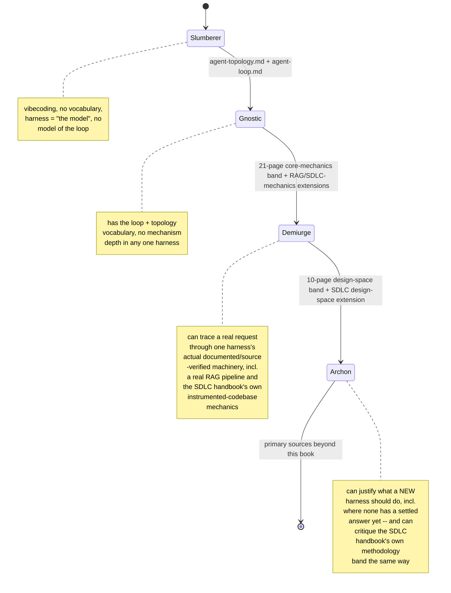

# Reader proficiency tiers: Slumberer -> Gnostic -> Demiurge -> Archon

## What this page is, and what it is not

Every other page in this wiki-book is a research page: a claim about
how Claude Code, GitHub Copilot CLI, or OpenCode actually behaves,
tagged VERIFIED (fetched this session or a prior one from a named
authoritative source) or BEST CURRENT UNDERSTANDING, UNCONFIRMED, per
this book's own grounding discipline. This page is different in kind.
The four tier names below -- **Slumberer**, **Gnostic**, **Demiurge**,
**Archon** -- and the zero-to-hero arc they sit on are an original
classification framework, authored by the book's operator and
recorded here for the first time this session (17 August 2026). They
are not a researched claim about any harness and must not be read as
one: nothing on this page is, or should be treated as, VERIFIED or
BEST CURRENT UNDERSTANDING in the sense those tags carry everywhere
else in this book. The names themselves are deliberately drawn from
Gnostic cosmology's own hierarchy (the sleeper who has not yet
"awoken" to knowledge; the one who possesses *gnosis*, direct
knowledge; the demiurge, the craftsman-god who actually shapes matter
according to received forms; the archon, a ruling power with
mastery over the created order) -- used here purely as a mnemonic
scaffold for a proficiency ladder, not as a claim about anything
external to this book.

What *is* grounded, in the ordinary sense this book uses that word, is
the mapping from each tier to a concrete reading list. Every page
named as a tier's syllabus below is cited against what that page's own
row in [index.md](index.md) says it covers -- a claim you can check
yourself by opening the page, not a claim about harness internals that
needs a VERIFIED/UNCONFIRMED tag. Where this page describes what a
reader "can now explain" after finishing a tier's reading list, that
description is this page's own synthesis of the cited pages' scope,
not a new factual claim about a harness.

This rubric formalizes the same zero-to-hero arc that already drove
two rounds of this book's own gap-analysis work (the 2026-08-17
eight-item list and its "two thinner gaps" follow-on, both tracked in
`HANDOFF-missing-topics.md` before that file was deleted once fully
resolved -- see the [Observability and self-diagnostics](observability-and-self-diagnostics.md)
and [MCP supply-chain trust/vetting](mcp-supply-chain-trust.md) rows
in `index.md` for the two closing entries). Those gap-analysis rounds
asked "what would a reader still be missing on the way from knowing
nothing to being able to build a harness that surpasses the existing
ones" without ever naming the intermediate stages. This page names
them.

## Tier 1 -- Slumberer (the zero end)

**Definition.** The Slumberer has used an AI coding agent -- possibly
extensively, possibly for real production work -- but holds no working
model of the harness wrapping the model. This is the "clueless /
vibecoding" end the operator named explicitly: someone who iterates by
trial-and-error prompt tweaking, treats the CLI or IDE extension as an
undifferentiated black box, and cannot say which part of the system a
given surprise came from.

**Proven absence of capacity, not proven incapacity.** A Slumberer
typically:
- Cannot distinguish "the model" from "the harness" -- attributes
  session memory, tool access, or a refusal to the model's own
  intelligence or mood rather than to a specific engineered mechanism
  (an injected instruction file, a permission rule, a context-window
  eviction). This book's own umbrella use of "harness" (borrowed from
  Claude Code's own glossary-defined term, per
  [agent-topology.md](agent-topology.md)) is not yet a meaningful
  distinction to them.
- Has no vocabulary for the request/response cycle underneath a
  single turn -- doesn't know the terms "tool call," "system prompt,"
  "context window," "compaction," or "hook," and so cannot describe a
  failure ("it forgot what I told it five minutes ago," "it ran a
  command I didn't approve") in terms of which lifecycle stage
  produced it.
- Debugs by re-phrasing the prompt rather than by forming a hypothesis
  about which mechanism (memory injection, tool schema, permission
  gate, retry policy) is responsible -- the defining behavior the
  operator's "vibecoding" label points at.
- Cannot yet meaningfully use most of this book: a Slumberer opening
  any of the 33 topic pages other than the two named below will
  encounter terms (ReAct, `stop_reason`, prompt caching, subagent
  fan-out) with no scaffolding to hang them on.

**Reading list to exit this tier.** None assigned by design -- a
Slumberer has, by definition, not yet done the two-page foundational
read that produces Gnostic-tier vocabulary. The exit path *is* the
Gnostic-tier reading list immediately below; there is no intermediate
assignment.

## Tier 2 -- Gnostic

**Definition.** The Gnostic has acquired *gnosis* -- direct conceptual
knowledge of what an agent harness is and how its control loop is
shaped -- without yet having traced that knowledge through any one
harness's real, documented machinery. This is the vocabulary-and-map
tier: a Gnostic can now describe a harness abstractly and correctly,
but has not yet built or operated one.

**Capacities a reader must demonstrate to be classified here:**
- Can state, unprompted, what a "harness" is as an engineering
  artifact distinct from the LLM it wraps, and place a harness on
  [agent-topology.md](agent-topology.md)'s own axes: reactive vs.
  deliberative, single-agent vs. multi-agent, tool-augmented vs. fully
  autonomous, and the "LLM + tools + memory + planning" component
  decomposition -- including knowing that this decomposition is
  narrower than Anthropic's own usage and broader than the Hugging
  Face agents course's and Lilian Weng's, per that page's own
  comparison.
- Can explain the Thought/Action/Observation cycle and the ReAct
  pattern by name, the while-loop framing of an agent's main loop,
  why observations get appended back into the prompt rather than
  handled out-of-band, and the stop-and-parse distinction between
  JSON-, code-, and function-calling-style agents -- all per
  [agent-loop.md](agent-loop.md).
- Given a concrete harness feature description (a changelog entry, a
  docs paragraph, a support forum complaint), can say roughly *which
  general category* of loop mechanism it touches -- without yet being
  able to say which specific config key, file path, or documented
  limit governs it in any one real harness. That specific-mechanism
  fluency is the Demiurge threshold, not this one.

**Reading list, Slumberer -> Gnostic:** [agent-topology.md](agent-topology.md)
followed by [agent-loop.md](agent-loop.md) -- in that order, per
`index.md`'s own explicit reading-order note that agent-topology.md
"is written to precede agent-loop.md." Both are GENERAL-CONCEPTS
pages with no harness-specific sections by design; that is precisely
why they are the entry pair -- a Gnostic's knowledge is meant to be
harness-agnostic vocabulary, not yet tied to Claude Code, Copilot CLI,
or OpenCode specifically.

## Tier 3 -- Demiurge

**Definition.** The Demiurge is the craftsman: someone who takes the
Gnostic's conceptual forms and actually shapes real matter with them --
operating, configuring, and reasoning about one or more real harnesses'
actual documented (or source-verified) machinery, across the full
mechanics surface this book covers. A Demiurge builds working things
from received forms; a Demiurge has not yet questioned whether those
forms are the *right* ones, or reasoned about what should exist where
no shipped harness has an answer at all. That distinction is exactly
what separates this tier from Archon.

**Capacities a reader must demonstrate to be classified here:**
- Can trace a concrete request end-to-end through at least one real
  harness's actual machinery, correctly, at the level of specific
  config keys, file paths, tool names, and named limits -- for
  example: which of Claude Code's four `settings.json` scopes
  (Managed/User/Project/Local) wins a merge conflict and where the
  documented exception to that ordering lives
  ([configuration.md](configuration.md)); what happens at Sonnet 5's
  documented ~967K auto-compact threshold and its thrash guard
  ([context-compression.md](context-compression.md)); how OpenCode's
  source-verified `FiberSet`-based concurrent dispatch joins parallel
  `Task` tool calls ([fan-out.md](fan-out.md)); or the exact
  precedence chain (`CLAUDE_CODE_SUBAGENT_MODEL` > invocation param >
  frontmatter > inherit) that resolves which model a Claude Code
  subagent actually runs on
  ([model-routing-and-selection.md](model-routing-and-selection.md)).
- Can operate a harness at power-user/administrator depth: write
  correct hook configurations and reason about the exit-code-2-only
  -blocks rule ([hooks-lifecycle-extensibility.md](hooks-lifecycle-extensibility.md)),
  author permission rules and explain why a given approval prompt did
  or didn't fire ([permissions-and-sandboxing.md](permissions-and-sandboxing.md)),
  and configure MCP servers with a working model of discovery,
  transport, and precedence ([mcp-integration.md](mcp-integration.md)).
- Can compare the same mechanism across Claude Code, Copilot CLI, and
  OpenCode and state precisely where they diverge or converge on a
  shared underlying idea -- e.g. all three harnesses' independently
  documented retry policies differ in specifics (retry counts,
  circuit breakers, fallback chains) while solving the same
  single-outbound-request failure-recovery problem
  ([retries.md](retries.md)).
- Can build and reason about a real retrieval-augmented-generation
  pipeline at the same config/parameter granularity as the
  core-mechanics band -- e.g. why `RecursiveCharacterTextSplitter`'s
  character-based `chunk_size` silently disagrees with a transformer
  tokenizer's token count and the token-aware fix
  ([Advanced RAG techniques](../rag/advanced-rag-techniques.md)), where
  a semantic cache sits (before retrieval, not before generation) and
  why FIFO eviction against a Euclidean `IndexFlatL2` threshold was
  chosen over an LRU policy
  ([Semantic caching for RAG](../rag/semantic-caching.md)), and how a
  synthetic-QA/critique-agent/LLM-as-judge evaluation pipeline is
  actually built rather than merely described
  ([RAG evaluation](../rag/rag-evaluation.md)) -- treating RAG as a
  technique with its own mechanics, prerequisite to (and distinct from)
  the Archon-tier question of whether any given harness *should* use it.
- Can operate the Agentic SDLC Handbook's instrumented-codebase
  machinery at the same depth: name the seven primitive types and their
  load modes, trace a primitive through the four-phase
  Resolve/Materialize/Bind/Activate lifecycle, and explain the
  window-vs-attention distinction and the U-shaped attention curve as a
  mechanism *distinct from but concordant with* this book's own
  [context-compression.md](context-compression.md)/[memory-management.md](memory-management.md) --
  while keeping straight that this material's authority is a single
  external source (`references/sdlc/`, "the handbook says"), not
  independently cross-verified the way this book's own pages are.
- Is not yet expected to have an opinion on the open design-space
  questions this book's original-survey pages raise, or to have
  attempted a from-scratch synthesis of a mechanism no shipped harness
  implements -- that is the Archon threshold.

**Reading list, Gnostic -> Demiurge (the core-mechanics band, 21
pages):** [Agent loop: Claude Code vs. OpenCode](agent-loop-implementations.md),
[Memory management](memory-management.md),
[MCP integration](mcp-integration.md),
[Instruction context budget](instruction-context-budget.md),
[Built-in tools](built-in-tools.md),
[Context compression](context-compression.md),
[Caching](caching.md),
[Orchestration](orchestration.md),
[Handoff mechanism](handoff-mechanism.md),
[Fan-out (subagent dispatch)](fan-out.md),
[Inter-agent messaging](inter-agent-messaging.md),
[Retries](retries.md),
[Configuration](configuration.md),
[Built-in skills](built-in-skills.md),
[The LLM API contract](llm-api-contract.md),
[Session & transcript persistence](session-persistence.md),
[Permissions & sandboxing architecture](permissions-and-sandboxing.md),
[Hooks and lifecycle extensibility](hooks-lifecycle-extensibility.md),
[Streaming & incremental rendering](streaming-and-incremental-rendering.md),
[Model routing / selection](model-routing-and-selection.md), and
[Auth & usage accounting](auth-and-usage-accounting.md). These are, in
this book's own words, the pages that document "how a real request
actually moves" through a shipped harness -- config, memory, tools,
context, coordination, transport, persistence, rendering, and money,
each grounded page by page against docs, changelogs, or source per
that page's own Sources section. No particular order is required
within this band (unlike the Slumberer->Gnostic pair); a Demiurge
candidate should expect to move back and forth across it, since many
pages explicitly cross-reference each other (e.g. context-compression.md
vs. memory-management.md's compaction-survival split, or
fan-out.md vs. handoff-mechanism.md vs. orchestration.md's three-way
split of "who launches, what crosses the boundary, who holds the
plan").

### Demiurge tier extensions: RAG and Agentic-SDLC practitioner mechanics

Two reference areas outside this wiki-book -- `references/rag/` and
`references/sdlc/` -- were added to this project after the four-tier
rubric above was first written, and this page is being revisited per
its own closing instruction (below) to slot them in rather than leave
them unclassified. Both extend the Demiurge tier's reading list; neither
displaces or shortens the 21-page core-mechanics band above, which
remains this tier's primary gate.

**Grounding-status caveat, load-bearing for both extensions.** Everything
in this subsection is sourced from areas with a *weaker* grounding
discipline than this wiki-book's own VERIFIED/BEST-CURRENT-UNDERSTANDING
tagging. `references/rag/` attributes claims directly to the HuggingFace
Cookbook notebooks and Lewis et al. (2020) -- "the source says," with no
independent cross-verification beyond what the source itself contains.
`references/sdlc/` attributes claims to the Agentic SDLC Handbook (Daniel
Meppiel) alone -- "the handbook says," re-checked only against the
handbook's own live chapter text, never against harness docs or any other
independent authority. A Demiurge-tier reader who has internalized this
extension's reading list is fluent in RAG-the-technique and in the
handbook's instrumented-codebase discipline, not in a claim this book
itself has independently verified the way it has verified, say, Claude
Code's `settings.json` merge order.

- **RAG cluster (9 pages, `references/rag/`):**
  [RAG foundations](../rag/foundations.md),
  [The basic RAG pipeline](../rag/basic-rag-pipeline.md),
  [Advanced RAG techniques](../rag/advanced-rag-techniques.md),
  [Vector store integrations](../rag/vector-store-integrations.md),
  [Semantic caching for RAG](../rag/semantic-caching.md),
  [Structured generation for RAG](../rag/structured-generation-for-rag.md),
  [RAG evaluation](../rag/rag-evaluation.md),
  [Agentic RAG with LlamaIndex](../rag/agentic-rag-with-llamaindex.md),
  and [RAG over heterogeneous data sources](../rag/heterogeneous-data-sources.md).
  This cluster is assigned here, rather than folded into the Gnostic
  entry pair, because its depth matches the core-mechanics band's own
  granularity -- specific chunk-size/tokenizer mismatches, specific
  reranker models (ColBERTv2 via RAGatouille), specific cache-eviction
  policies, specific vector-store integrations (Milvus, Elasticsearch,
  MongoDB Atlas) -- not the harness-agnostic abstraction the Gnostic tier
  is deliberately scoped to. It is also, concretely, the direct
  prerequisite body of knowledge for the already-existing Archon-tier
  page [Context retrieval / RAG vs. agentic search as a design
  space](context-retrieval-and-agentic-search.md), which presumes a
  reader already knows what a real RAG pipeline's moving parts are
  before it asks whether a harness *should* reach for one as its
  code-discovery strategy.
- **Agentic-SDLC practitioner-mechanics cluster (7 pages,
  `references/sdlc/`):**
  [The Agentic SDLC reference architecture](../sdlc/04-the-reference-architecture.md)
  (Ch. 4), [The agentic runtime machine](../sdlc/11-the-runtime-machine.md)
  (Ch. 11), [The instrumented codebase](../sdlc/12-the-instrumented-codebase.md)
  (Ch. 12), [The load lifecycle](../sdlc/14-the-load-lifecycle.md)
  (Ch. 14), [Attention and context economy](../sdlc/15-attention-and-context-economy.md)
  (Ch. 15), [Primitives as code](../sdlc/21-primitives-as-code.md)
  (Ch. 21), and [Appendix A: the cross-harness
  reference](../sdlc/appendix-a-cross-harness-reference.md). These seven
  pages are this cluster's *mechanics* half: the seven primitive types
  and their five load modes, the four-phase Resolve/Materialize/Bind
  /Activate pipeline, the window-vs-attention distinction and the
  U-shaped attention curve, and the package/lockfile/override model that
  turns a primitive from a file into a versioned dependency -- material
  that sits at the same "trace a real thing through its actual mechanism"
  depth as this tier's core-mechanics band, just sourced single-source
  from the handbook rather than cross-verified against harness docs. The
  handbook's own Appendix A master comparison table (ten primitive
  concepts across five harnesses' concrete file/config conventions) is
  assigned here specifically because it functions as a cross-harness
  ready-reference of exactly the kind a Demiurge-tier reader is expected
  to be able to produce from the core-mechanics band's own pages. The
  remaining, more speculative/methodological half of this source
  (PROSE, multi-agent orchestration patterns, anti-patterns, the
  execution meta-process, the Rosetta Stone pattern catalogue, and the
  case studies) is assigned at Archon tier instead -- see below.

## Tier 4 -- Archon (the HERO end)

**Definition.** The Archon holds a ruling, load-bearing command of the
domain: not just able to explain what existing harnesses do, but able
to justify what a *new* harness should do instead -- including, and
especially, in the areas this book's own original-survey pages found
that no shipped harness has a settled answer for. This is the tier the
operator named as the book's own stated end goal: someone capable of
building a harness that surpasses the existing implementations, not
merely reproducing one.

**Capacities a reader must demonstrate to be classified here:**
- Can read this book's own original design-space-survey pages
  critically rather than as received fact, and argue a position from
  primitives -- for example, engaging with
  [advanced-planning-and-execution-architectures.md](advanced-planning-and-execution-architectures.md)'s
  BEST-CURRENT-UNDERSTANDING account of *why* tree-search/MCTS
  planning, loop-integrated self-critique, per-step model ensembling,
  and speculative tool execution have not shipped in any of the three
  harnesses examined (cost metering, interactive-latency UX
  investment, and a permission architecture built around single
  deterministic decisions), and being able to say whether that
  account holds up or where it's incomplete.
- Can design a tool schema and permission-annotation scheme from the
  MCP specification's own four tool-annotation hints
  (`readOnlyHint`/`destructiveHint`/`idempotentHint`/`openWorldHint`)
  without simply copying an existing harness's choices, per
  [Tool schema / interface design](tool-schema-and-interface-design.md)'s
  treatment of the few-powerful-vs-many-narrow tradeoff and deferred
  -schema-loading strategies.
- Can sketch a four-layer testing pyramid (unit-level wire-format
  correctness through end-to-end capability evals) for a harness that
  does not yet exist, per
  [Evals and testing a harness](evals-and-testing-a-harness.md)'s own
  pyramid and OpenCode's fully source-read testing infrastructure as
  a concrete worked example.
- Can reason about multi-agent coordination topology (centralized,
  decentralized, layered, shared-message-pool, blackboard, consensus
  /voting, market-based allocation) as a genuine design choice for a
  system being designed, not only as a classification exercise applied
  after the fact to Claude Code's agent-team mailbox or `/deep-research`'s
  claim-voting, per
  [The multi-agent coordination design space](multi-agent-coordination-design-space.md) --
  including being able to name why market-based/competitive-bidding
  allocation, confirmed absent from all three harnesses examined, might
  still be worth building.
- Can make and defend, as genuine engineering tradeoffs rather than
  received defaults, a packaging/distribution/self-update strategy
  ([Packaging, distribution, and self-update mechanics](packaging-distribution-and-self-update.md)),
  an observability-signal-layering strategy that keeps cost export,
  execution tracing, interactive debugging, and vendor telemetry
  structurally distinct
  ([Observability and self-diagnostics](observability-and-self-diagnostics.md)),
  a TUI rendering-and-component-model architecture
  ([TUI/CLI application architecture](tui-cli-application-architecture.md)),
  a system-prompt-authoring discipline that survives compaction and
  resists prompt injection
  ([System-prompt / agent-instruction design as a craft](system-prompt-design-as-craft.md)),
  a code-discovery strategy positioned deliberately on the RAG-vs
  -agentic-search spectrum rather than by default
  ([Context retrieval / RAG vs. agentic search as a design space](context-retrieval-and-agentic-search.md)),
  and an MCP/plugin supply-chain trust model addressing identity,
  code-safety, and continuity as separable axes
  ([MCP supply-chain trust/vetting](mcp-supply-chain-trust.md)).
- Can critique, from primitives, the Agentic SDLC Handbook's own
  original methodological and design-space material -- for example,
  arguing whether the five-phase AUDIT/PLAN/WAVE/VALIDATE/SHIP execution
  meta-process ([The execution meta-process](../sdlc/18-the-execution-meta-process.md))
  is a genuinely general discipline or an artifact of the specific
  PR #394 case study it was extracted from, or whether the Rosetta
  Stone pattern catalogue's "precise/partial/weak-or-none" classical
  -analogue ratings ([Architectural patterns: a Rosetta
  Stone](../sdlc/19-architectural-patterns-rosetta-stone.md)) hold up
  against this book's own, independently-grounded treatment of the same
  structural problems (e.g. comparing its Composition-layer GoF mapping
  against [Tool schema / interface design](tool-schema-and-interface-design.md)'s
  own few-powerful-vs-many-narrow tradeoff) -- while keeping straight
  that this material carries the weaker "the handbook says" grounding
  status described in the Demiurge-tier extension above, not this
  book's own VERIFIED/BEST-CURRENT-UNDERSTANDING tagging.

**Reading list, Demiurge -> Archon (the design-space / original
-survey / production-completeness band, 10 pages):**
[The multi-agent coordination design space](multi-agent-coordination-design-space.md),
[Tool schema / interface design](tool-schema-and-interface-design.md),
[System-prompt / agent-instruction design as a craft](system-prompt-design-as-craft.md),
[Context retrieval / RAG vs. agentic search as a design space](context-retrieval-and-agentic-search.md),
[Advanced/novel planning and execution architectures](advanced-planning-and-execution-architectures.md),
[Evals and testing a harness](evals-and-testing-a-harness.md),
[MCP supply-chain trust/vetting](mcp-supply-chain-trust.md),
[Observability and self-diagnostics](observability-and-self-diagnostics.md),
[Packaging, distribution, and self-update mechanics](packaging-distribution-and-self-update.md),
and [TUI/CLI application architecture](tui-cli-application-architecture.md).
Several of these pages describe themselves, in their own `index.md`
rows, as "an ORIGINAL DESIGN-SPACE SURVEY, not a research-and-report
page like every other row" (advanced-planning-and-execution-architectures.md)
or as closing a deliberate gap-analysis pass rather than answering an
already-asked question -- that self-description is exactly why this
band, not the Gnostic->Demiurge band, is the one assigned here: these
pages require the Demiurge-tier mechanics underneath them as a
prerequisite (most cross-reference a core-mechanics page directly,
e.g. tool-schema-and-interface-design.md's explicit companion
relationship to built-in-tools.md) and then go one level further, into
territory where the honest answer is sometimes "no shipped harness has
solved this," which is precisely the terrain an Archon-tier reader
needs to be comfortable reasoning in.

### Archon tier extension: the Agentic-SDLC design-space/methodology cluster

**Reading list extension (10 items, `references/sdlc/`):**
[Part III preface & the practitioner's
mindset](../sdlc/09-10-part-iii-preface-and-practitioners-mindset.md)
(Ch. 9-10), [The PROSE framework](../sdlc/prose-framework.md) (Ch. 13),
[The deterministic/probabilistic
boundary](../sdlc/16-deterministic-probabilistic-boundary.md) (Ch. 16),
[Multi-agent orchestration](../sdlc/17-multi-agent-orchestration.md)
(Ch. 17), [The execution meta-process](../sdlc/18-the-execution-meta-process.md)
(Ch. 18), [Architectural patterns: a Rosetta
Stone](../sdlc/19-architectural-patterns-rosetta-stone.md) (Ch. 19),
[Anti-patterns and failure modes](../sdlc/20-anti-patterns-and-failure-modes.md)
(Ch. 20), [The reference architecture,
earned](../sdlc/22-the-reference-architecture-earned.md) (Ch. 22), the
four Part IV case studies read as one bundled item ([APM auth + logging
overhaul](../sdlc/23-case-study-apm-overhaul.md),
[handbook-writing](../sdlc/24-case-study-handbook-writing.md),
[publishing pipeline](../sdlc/25-case-study-publishing-pipeline.md),
[growth engine](../sdlc/26-case-study-growth-engine.md)), and
[Appendix B: Genesis worked
example](../sdlc/appendix-b-genesis-worked-example.md).

This ten-item extension is assigned at Archon rather than Demiurge tier
for the same reason the ten-page core design-space band above is: each
item is original synthesis or methodology, not a mechanics report, and
each demands the reader argue about tradeoffs rather than trace a
config value. PROSE's five constraints (Progressive Disclosure, Reduced
Scope, Orchestrated Composition, Safety Boundaries, and Explicit
Hierarchy) are a craft discipline for authoring agent-facing artifacts,
directly parallel in kind to this book's own
[System-prompt / agent-instruction design as a
craft](system-prompt-design-as-craft.md); the Rosetta Stone chapter's
four-layer substrate (Foundation/Assembly/Composition/Execution) and its
precise/partial/weak-or-none Gang-of-Four analogue ratings is a
pattern-catalogue exercise of the same shape this book's own
[Advanced/novel planning and execution
architectures](advanced-planning-and-execution-architectures.md) and
[The multi-agent coordination design
space](multi-agent-coordination-design-space.md) perform, just against a
different (single-source, practitioner-methodology) corpus; the
19-anti-pattern taxonomy and the five-phase AUDIT/PLAN/WAVE/VALIDATE/SHIP
execution meta-process are exactly the kind of "no shipped harness (or
in this case, no shipped methodology) has a settled, universally-agreed
answer" terrain this tier's definition names; and the four case studies
plus Appendix B's Genesis worked example are load-bearing because they
let an Archon-tier reader check whether a named methodology actually
survives contact with a real, messy, citation-bearing production
incident (PR #394's 75-file/6-agent/8-plan-iteration/5-wave overhaul;
Genesis's own before/after panel-in-one-thread fix) rather than only
reading well in the abstract. As with the Demiurge-tier extension above,
this material's grounding status is "the handbook says," re-verified
only against the handbook's own live chapter text -- an Archon-tier
reader engaging with it critically (per this tier's own capacities list)
is expected to hold that epistemic status in mind, not to treat a
methodology claim here with the same confidence as a VERIFIED claim
about Claude Code's or OpenCode's actual source.

**Ceiling note.** This book is a necessary but explicitly insufficient
input at Archon tier. It is written LAZY, on demand, as real questions
need each topic (per this book's own front-matter in `index.md`) --
it is not, and does not claim to be, an exhaustive treatment of any
harness. True Archon-level command requires primary-source fluency
this book deliberately does not replace: Claude Code's own Agent SDK
docs and changelog, OpenCode's live `dev`-branch source (flagged
throughout this book as not necessarily reflecting a stable release),
Copilot CLI's own docs and changelog, the Model Context Protocol
specification, and the academic literature cited across the
design-space pages (Tree of Thoughts, LATS, Reflexion, Mixture-of
-Agents, the Contract Net Protocol, and the rest). An Archon-tier
reader treats every page's own "Sources" section as a pointer back to
where the *next* question should actually be researched, not as a
closed case.

## How this rubric is meant to be used

This rubric exists as a calibration instrument, not a gatekeeping one.
Two concrete uses:

1. **Calibrating explanation depth.** `airchon-mentor` (or a reader
   assessing themselves) can use a reader's self-reported or
   demonstrated tier to decide how deep an explanation should go
   before it becomes noise rather than signal. A Slumberer asking "why
   did Claude Code run that command without asking me" needs the
   Gnostic-tier vocabulary (what a permission mode is, what the
   auto-mode classifier does in outline) introduced before the
   Demiurge-tier specifics (the classifier's exact decision pipeline,
   trust-scope rules, and consecutive/total fallback thresholds in
   [Permissions & sandboxing architecture](permissions-and-sandboxing.md))
   land as anything but noise. Conversely, an already-Demiurge reader
   asking the same question should be answered at the mechanism level
   directly, not re-walked through what a permission mode is.
2. **Self-assessment before the book's own stated end goal.** This
   book's gap-analysis history (the `HANDOFF-missing-topics.md` rounds
   referenced in `index.md`'s own entries) was explicitly driven by
   the question of what a reader still needs to go from knowing
   nothing to being able to build a harness that surpasses Claude
   Code, Copilot CLI, and OpenCode. A reader can use the four reading
   lists above as a literal, checkable gate before attempting that
   goal: if a reading-list page names a mechanism you cannot yet
   explain unprompted (a specific config precedence, a specific
   failure mode, a specific source-verified data structure), that is
   the concrete, actionable signal that you are not yet at the tier
   the list claims, regardless of how confident the vibe feels --
   which is, not coincidentally, exactly the gap this rubric's zero
   tier is named for.

This page will need revisiting as new topic pages are added to
`references/harnesses/` -- a newly written page should be slotted into
one of the three post-Slumberer reading lists (or flagged as not yet
fitting any of them) rather than left unclassified, so this rubric
stays a live map of the book rather than a snapshot of it. The same now
holds for `references/sdlc/` and `references/rag/`: this page was
revisited on 2026-08-24 to fold both areas' pages into the Demiurge- and
Archon-tier reading lists as the two extension subsections above
document, and any future page added to either area should likewise be
slotted into an existing tier band (or flagged as not yet fitting one)
rather than left unclassified. Both extensions carry a grounding-status
caveat this page's original four bands did not need to state, because
neither `references/sdlc/` nor `references/rag/` uses this wiki-book's
own VERIFIED/BEST-CURRENT-UNDERSTANDING tagging -- see the
"grounding-status caveat" paragraph under the Demiurge tier's extension
subsection for the exact wording a reader or mentor should carry forward
when discussing this material's evidentiary weight.
