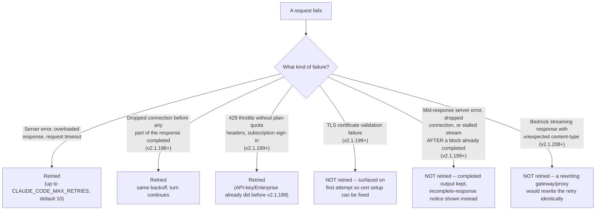
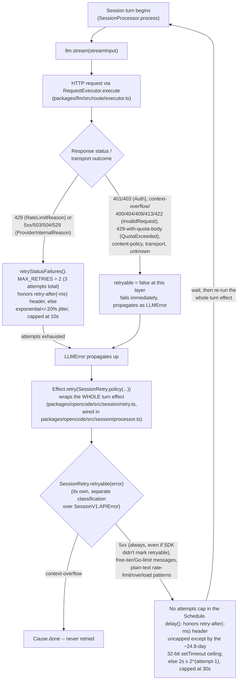
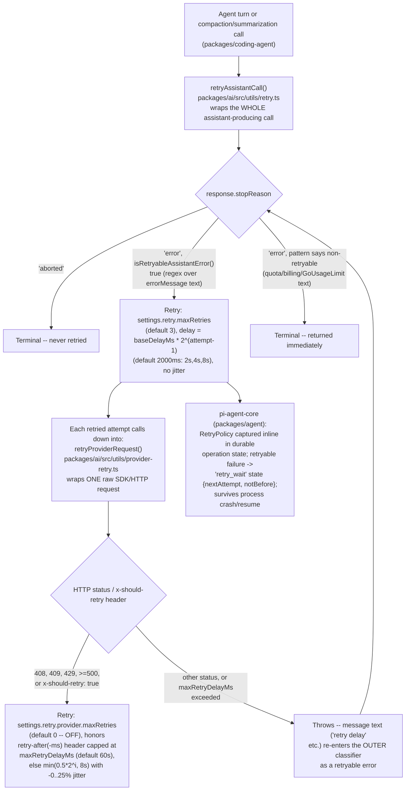

# Retries -- Claude Code, GitHub Copilot CLI, and OpenCode

**Scope note.** This page is about **failure recovery on a single outbound
model-provider request** -- what counts as a transient failure worth
retrying (a 5xx, a 429, a dropped connection, a stalled stream) versus a
terminal one that should surface immediately (auth failure, context
overflow, a malformed request), how the delay before the next attempt is
computed (fixed backoff, exponential backoff, jitter, an honoured
`Retry-After`/`retry-after-ms` response header), what caps exist on attempt
count and delay size, and what the user actually sees while it happens. It
is a distinct axis from [context-compression.md](context-compression.md)
(reacting to a **context-window overflow**, a different failure mode
entirely) and from [caching.md](caching.md) (reusing a **successful**
prior request's prefix) -- a request can retry cleanly with a warm cache,
and a context-overflow error is, as shown below, explicitly carved out of
every retry policy this page found rather than treated as a retryable
failure.

Every claim is tagged VERIFIED (fetched this session) or BEST CURRENT
UNDERSTANDING, UNCONFIRMED. Claude Code, Copilot CLI, and OpenCode are
three separate products; a retry rule confirmed for one is never assumed
to hold for another without its own citation.

---

## 1. Claude Code

Primary source: `code.claude.com/docs/en/errors`, fetched fresh this
session (2026-07-31) -- a dedicated "Automatic Retries in Claude Code"
section on the errors-reference page -- cross-referenced against
`github.com/anthropics/claude-code` `CHANGELOG.md` (fetched fresh this
session via `gh api repos/anthropics/claude-code/contents/CHANGELOG.md`,
full 5,248-line file, grepped for `retry`/`retries`/`backoff`/`529`/
`overloaded`/`CLAUDE_CODE_MAX_RETRIES`/`CLAUDE_CODE_RETRY_WATCHDOG`).
VERIFIED unless tagged otherwise.

### 1.1 The documented policy: bounded, category-gated, exponential

The docs state the top-line number directly: "Claude Code retries
transient failures up to **10 times** with exponential backoff before
showing an error. However, not all failures are retried." The categories
are split cleanly into retried and not-retried:

Two distinctions inside this classification are easy to miss and worth
stating precisely, both from the docs' own wording. First, **transient TLS
conditions** (a handshake timeout) are still retried -- only certificate
**validation** failures (a TLS-inspecting proxy, a missing
`NODE_EXTRA_CA_CERTS` bundle, an expired certificate) fail fast, because
those need a configuration fix the retry loop cannot produce. Second, the
mid-response carve-out is itself a version-dated behavior change: "Before
v2.1.199, partial output was discarded and the whole turn reported as
error" -- the current behavior preserves whatever text or tool call
already completed and appends `API Error: Server error mid-response. The
response above may be incomplete.` instead of failing the turn outright.

### 1.2 Environment variables

| Variable | Default | Effect |
|---|---|---|
| `CLAUDE_CODE_MAX_RETRIES` | 10 | Attempt count. Capped at 15 as of v2.1.186; as of v2.1.199, setting `CLAUDE_CODE_RETRY_WATCHDOG` raises the default and removes that cap entirely. Lowering it surfaces failures faster in scripts/CI. |
| `CLAUDE_CODE_RETRY_WATCHDOG` | unset | Set to `1` for unattended sessions (CI): retries `429`/`529` capacity errors **indefinitely** rather than failing after `CLAUDE_CODE_MAX_RETRIES` attempts, and (v2.1.199+) separately raises the default retry count for *other* transient errors (server errors, timeouts, dropped connections) to roughly 300 attempts (~3 hours of accumulated backoff) and lifts the 15-attempt cap on an explicitly set `CLAUDE_CODE_MAX_RETRIES`. |
| `API_TIMEOUT_MS` | 600000 | Per-request timeout in milliseconds; raise for slow networks/proxies. |

`CHANGELOG.md` independently confirms both halves of this table at the
versions the docs cite: v2.1.186 "Changed `CLAUDE_CODE_MAX_RETRIES` to cap
at 15; for unattended sessions, use `CLAUDE_CODE_RETRY_WATCHDOG` instead,"
and v2.1.199 "Transient server rate-limit errors (429s unrelated to your
usage limit) are now retried automatically with backoff for subscribers
instead of failing the turn" plus "`CLAUDE_CODE_RETRY_WATCHDOG` now raises
the default retry count for non-capacity transient errors to 300 and
lifts the cap of 15 on `CLAUDE_CODE_MAX_RETRIES`" -- independent
confirmation from a second source of the exact same version-gated change.

### 1.3 What the user sees, and how that UX itself changed release to release

While retrying, the spinner shows a `Retrying in Ns · attempt x/y`
countdown. The label reveal timing changed twice, and `CHANGELOG.md`
dates both changes precisely:

- **v2.1.185** ("Improved API retry UX" family): if no data arrives on the
  response stream for 20 seconds *before any retry has started*, the line
  reads `Waiting for API response · will retry in … · check your
  network` -- the request has not failed yet at this point, this is a
  stalled-connection countdown, not a retry-attempt countdown. The
  changelog's own wording for this change: "The stream-stall hint now
  reads 'Waiting for API response · will retry in …' instead of 'No
  response from API · Retrying in …', and triggers after 20s of silence
  instead of 10s."
- **v2.1.198**: the label switches from a generic `API error` to the
  specific failure reason (network down, TLS handshake failed, rate
  limit) starting from the **third** attempt (or the final attempt, if
  `CLAUDE_CODE_MAX_RETRIES` allows fewer than three) -- earlier versions
  only revealed the specific reason on the very last attempt. The same
  version also adds a status-page pointer once the reason is known to be
  a 529 overload: `status.claude.com` for the Anthropic API, or the
  provider/gateway hostname for anything else. `CHANGELOG.md`'s own line
  for the general shape of this change: "Improved API retry UX: the error
  reason is now shown after the second attempt, and a status page link
  replaces the spinner tip when the API is overloaded."
- **v2.1.214**: during [advisor](memory-management.md) consultation
  specifically, the stall banner's threshold is widened from 20 seconds
  to 90 seconds, "because advisor reviews can send nothing for well over
  20 seconds" -- a targeted exception to the general stall-detection
  timing to avoid a false-positive stall warning on a call whose own
  normal latency profile is longer.

Two further UX bugs the changelog records as fixed, evidence the
countdown display itself needed its own hardening independent of the
retry logic underneath it: v2.1.101 "Fixed the API retry indicator
('Retrying in 0s · attempt N/10') staying on screen after the retry
succeeded," and v2.1.101 (same entry set) "Fixed API retry countdown
sticking at '0s' instead of counting down between attempts."

### 1.4 Backoff-minimum and circuit-breaker fixes worth their own note

Two changelog entries describe Claude Code correcting its *own* backoff
math after it initially undercounted or over-retried:

- **v2.1.98**: "Fixed 429 retries burning all attempts in ~13s when the
  server returns a small `Retry-After` — exponential backoff now applies
  as a minimum." Before this fix, a server-supplied `Retry-After` shorter
  than the exponential schedule would be honoured literally, letting the
  client exhaust its entire 10-attempt budget in seconds against a
  server that kept returning a short `Retry-After` on every attempt; the
  fix makes the client-computed exponential delay a **floor**, not just a
  ceiling override, when the header value is smaller than what backoff
  would already produce.
- **v2.1.76**: "Fixed auto-compaction retrying indefinitely after
  consecutive failures — a circuit breaker now stops after 3 attempts."
  This is a *different* retry loop from the main API-request policy in
  §1.1-1.2 -- it is [compaction's](context-compression.md) own internal
  retry-the-summarization-call loop, and it is the one place this session
  found Claude Code applying a **small, hard-coded circuit breaker** (3
  attempts, no configurability) rather than the large-but-eventually-
  unbounded-via-watchdog policy the main request path uses. Worth flagging
  as a contrast point for §4.5 and §5: the same product ships two
  philosophically different retry postures for two different subsystems.

A related historical reversal, evidence Claude Code has previously
over-corrected in the *other* direction (too little retrying) and had to
revert: v2.1.111 "Reverted the v2.1.110 cap on non-streaming fallback
retries — it traded long waits for more outright failures during API
overload," following v2.1.110's own "Fixed non-streaming fallback retries
causing multi-minute hangs when the API is unreachable" -- a cap
introduced specifically to fix a hang, then reverted one version later
once it was shown to convert overload conditions into outright failures
instead of (slower, but eventually successful) waits.

### 1.5 `fallbackModel`: a bounded, error-type-gated retry-on-a-different-model

v2.1.166 adds a mechanism adjacent to, but distinct from, retrying the
*same* request: "Added `fallbackModel` setting to configure up to three
fallback models tried in order when the primary model is overloaded or
unavailable," paired in the same version with "Claude Code now retries a
turn once on the fallback model when the API rejects an unexpected
non-retryable error; auth, rate-limit, request-size, and transport errors
still surface immediately." The explicit carve-out list here -- auth,
rate-limit, request-size, transport -- mirrors the non-retryable
classification pattern this page also finds, independently, in OpenCode's
error-reason taxonomy (§3.2): every harness examined this session treats
authentication and malformed-request failures as never worth a retry of
any kind, same-model or fallback-model.

### 1.6 Retries as a pervasive engineering surface beyond the main API call

`CHANGELOG.md` records retry-hardening fixes across subsystems that are
not the primary model-request path at all, worth naming briefly to show
the full footprint of "retry" as a recurring engineering concern in this
codebase rather than a single policy object: MCP capability discovery
(v2.1.191, "capability discovery (`tools/list`, `prompts/list`,
`resources/list`) now retries transient network errors with short
backoff"), MCP server startup (v2.1.126, "MCP servers that hit a
transient error during startup now auto-retry up to 3 times instead of
staying disconnected"), MCP OAuth (v2.1.191, "discovery and token
requests now retry once after transient network errors"), the
auto-updater (v2.1.147, "retries transient network failures, reports
specific error categories and OS error codes on failure" -- corrected
from an earlier v2.1.144 mislabel here after a fresh re-fetch of
`CHANGELOG.md` while researching
[packaging-distribution-and-self-update.md](packaging-distribution-and-self-update.md);
that page treats the auto-updater as a first-class topic and is the
canonical citation for its full history), remote managed
settings (v2.1.140, "Fixed remote managed settings not retrying on 401 —
now retries once with a force-refreshed token"), and voice mode
(v2.1.204, "Fixed voice dictation retrying in an unbounded loop when the
microphone or audio recorder fails — repeated capture failures now pause
voice input" -- notably a case of an **unbounded** retry loop being fixed
by adding a bound, the opposite direction of the compaction circuit
breaker in §1.4 but the same underlying lesson).

### 1.7 Hook and permission-layer interaction

Retries are also exposed as a first-class outcome inside Claude Code's own
hook and auto-mode-classifier surfaces, not only inside the raw
API-request loop: v2.1.89 adds a `PermissionDenied` hook that "fires after
auto mode classifier denials — return `{retry: true}` to tell the model it
can retry," and the same version lets a user manually retry a denied
command from `/permissions` → Recent tab with the `r` key. This is a
retry decision made by a *policy/permission* layer, not a
transport/error-classification layer -- included here because it is the
one place in Claude Code's own vocabulary where "retry" names a
model-facing permission outcome rather than an HTTP-failure response.

---

## 2. GitHub Copilot CLI

Sources: `docs.github.com/en/enterprise-cloud@latest/copilot/tutorials/
copilot-chat-cookbook/debugging-errors/handling-api-rate-limits` (fetched
fresh this session, 2026-07-31) and `github.com/github/copilot-cli`
`changelog.md` (fetched fresh this session via `gh api
repos/github/copilot-cli/contents/changelog.md`, full 2,898-line file,
grepped for `retry`/`retries`/`backoff`/`rate.limit`/`429`/`throttle`).
Copilot CLI is closed source -- everything below is inferred from
documented behavior and the product's own changelog, never from an
implementation file, the same standing caveat as
[context-compression.md](context-compression.md) §2 and
[caching.md](caching.md) §2.

### 2.1 What is documented at the platform level -- and its real scope

The "Handling API rate limits" cookbook page is **not** a description of
Copilot CLI's own internal retry mechanism; it is generic guidance for
developers building *against* the Copilot Chat API, showing example client
code (a `Retry` class configured for `total=3`, `backoff_factor=0.3`,
targeting status codes 500/502/504). Checked directly this session: the
page never states that Copilot CLI itself implements this pattern, an
equivalent one, or any specific attempt count/backoff formula for its own
requests. This is flagged plainly rather than blended into a
CLI-specific-sounding claim: **the only source that actually describes
Copilot CLI's own retry behavior is its changelog** (§2.2), read as a
history of shipped fixes rather than a specification.

### 2.2 Changelog-traced evidence of the CLI's actual retry behavior

```mermaid
stateDiagram-v2
    state "0.0.389 (2026-01-22)<br/>Rate-limit errors show retry timing" as Era1
    state "0.0.407 (2026-02-11)<br/>Streaming auto-retries on server-error interruption" as Era2
    state "1.0.13/1.0.14 (2026-03-30/31)<br/>MCP registry lookups gain automatic retries" as Era3
    state "1.0.25 (2026-04-13)<br/>MCP remote server auto-retry on transient network failure" as Era4
    state "1.0.32 (2026-04-17)<br/>Rate-limited sessions pause+auto-retry queued messages" as Era5
    state "1.0.35 (2026-04-23)<br/>continueOnAutoMode: switch model instead of pausing" as Era6
    state "1.0.52 (2026-05-23)<br/>HTTP/2 upload stall retries over HTTP/1.1" as Era7
    state "1.0.55/1.0.57 (2026-05-28/06-01)<br/>update/version rate-limit auth + vote_memory throttling" as Era8
    state "1.0.66 (2026-06-30)<br/>Fixed a heartbeat retry loop retrying forever every few seconds" as Era9

    Era1 --> Era2: message clarity, then stream-level resilience
    Era2 --> Era3: MCP-specific retry surfaces begin appearing
    Era3 --> Era4
    Era4 --> Era5: session-level rate-limit handling matures
    Era5 --> Era6: automatic mitigation added, not just a pause
    Era6 --> Era7: transport-layer retry (protocol downgrade)
    Era7 --> Era8: peripheral (non-chat) endpoints get their own rate-limit handling
    Era8 --> Era9: an actual unbounded-retry bug gets fixed
```

Reading the changelog oldest-to-newest (it is itself newest-first):

- **0.0.389 (2026-01-22).** "Rate limit errors now show retry timing in
  user-friendly messages" -- the earliest entry this session found that
  names retry behavior explicitly, evidence the underlying retry
  mechanism (whatever it was) already existed and this fix is purely
  about how its timing is communicated.
- **0.0.407 (2026-02-11).** "Streaming responses automatically retry when
  interrupted by server errors" -- a stream-level auto-retry, the closest
  changelog analog to Claude Code's mid-response dropped-connection retry
  (§1.1), though without a stated attempt count or backoff formula.
- **1.0.13 (2026-03-30) / 1.0.14 (2026-03-31).** "MCP registry lookups are
  more reliable with automatic retries and request timeouts" -- appears
  identically worded across both versions, evidence of either a
  same-release backport or a fix re-landing; either way this is Copilot
  CLI's MCP-discovery-retry analog to Claude Code's own MCP
  capability-discovery retry (§1.6).
- **1.0.25 (2026-04-13).** "MCP remote server connections automatically
  retry on transient network failures" -- extends the same pattern from
  registry lookups to live remote MCP server connections.
- **1.0.32 (2026-04-17).** "Rate-limited sessions now pause queued
  messages and automatically retry instead of dropping them," alongside
  "Rate limit error messages now show specific context based on the type
  of limit reached" in the same release -- the first entry that
  describes session-level (not just single-request-level) rate-limit
  handling: queued user messages survive a rate-limit pause rather than
  being discarded.
- **1.0.34 (2026-04-20) / 1.0.35 (2026-04-23).** "Add `continueOnAutoMode`
  config option to automatically switch to auto model on rate limit
  instead of pausing" -- a documented *alternative* to retrying the same
  model: rather than waiting out a rate limit, this option reroutes the
  session to Copilot's automatic model-selection feature, trading model
  choice for continuity. This is a materially different mitigation
  strategy from anything found in Claude Code's or OpenCode's own retry
  logic -- neither of those switches models automatically on a rate limit
  the way this Copilot CLI setting does (Claude Code's `fallbackModel`,
  §1.5, is the closest analog, but it is gated on "overloaded or
  unavailable," not specifically rate-limit-only, and is a fixed ordered
  list rather than a live auto-selection feature).
- **1.0.52 (2026-05-23).** "Requests that time out due to an HTTP/2 upload
  stall automatically retry over HTTP/1.1" -- a protocol-downgrade retry,
  a distinct category from a same-protocol backoff-and-resend; notably,
  1.0.57 (2026-06-01) later changes the *default* transport to HTTP/1.1
  outright "improving reliability on some network paths," with
  `COPILOT_ENABLE_HTTP2=1` to opt back into HTTP/2 -- suggesting the
  underlying HTTP/2 stall problem this retry was mitigating was common
  enough to justify changing the default instead of only retrying around
  it.
- **1.0.55 (2026-05-28) / 1.0.57 (2026-06-01).** Two entries about
  rate-limit handling on *peripheral* (non-chat) endpoints specifically:
  "`copilot update` and `copilot version` authenticate release API
  requests to avoid rate limit errors in shared-NAT environments"
  (1.0.55) and "Actionable error message shown when GitHub API rate limit
  is hit during `copilot update`" (1.0.57) -- both about the GitHub
  release-API rate limit the updater itself can hit, not the model-chat
  rate limit this page is otherwise about; included to flag that "rate
  limit" in this changelog spans at least two independent rate-limited
  surfaces (chat completions and the GitHub REST API the updater calls).
  The same 1.0.55 release also throttles `vote_memory` tool calls "per
  response and per interaction to prevent runaway voting bursts" -- a
  self-imposed request-rate cap on the CLI's own side, the inverse
  direction from retrying *after* a provider-imposed limit is hit.
- **1.0.66 (2026-06-30).** "Fixed remote sessions continuing to send
  heartbeats after their worker was replaced, which left long-lived
  desktop and IDE processes retrying a rejected request every few seconds
  forever" -- a concrete, named instance of an actually-unbounded retry
  bug in Copilot CLI's own remote-session heartbeat path, structurally
  the same category of failure mode this page finds independently
  source-verified in OpenCode's session-level retry policy (§3.4),
  though found here only as a changelog bug-fix entry rather than as a
  standing architectural property -- this specific loop was fixed, not
  left as a documented limitation.

### 2.3 What is not documented

No page or changelog entry fetched this session states Copilot CLI's own
equivalent of `CLAUDE_CODE_MAX_RETRIES` (a user-configurable attempt
count), an explicit backoff formula (base delay, multiplier, jitter), a
stated maximum backoff delay, or whether a `Retry-After`/`retry-after-ms`
response header is honoured for the CLI's own model-completion requests
specifically (as opposed to the generic client-side example code on the
cookbook page in §2.1). Given the changelog's own repeated framing of
individual retry fixes as one-off, per-subsystem changes (MCP registry,
MCP remote servers, streaming responses, HTTP/2 stalls, remote-session
heartbeats) rather than references to one shared, named retry-policy
module, it is plausible each subsystem implements its own retry logic
independently rather than routing through one central policy the way
Claude Code's docs describe a single named mechanism (§1.1) or OpenCode's
source shows two explicit, shared modules (§3) -- but this is **BEST
CURRENT UNDERSTANDING, UNCONFIRMED**: no Copilot CLI source is public to
verify it, and no changelog entry or docs page states the architecture
explicitly either way.

---

## 3. OpenCode

Source: `github.com/anomalyco/opencode`, `dev` branch, fetched live via
`gh search code` and `gh api` this session (2026-07-31) -- flagging per
this project's standing caveat that `dev` is not a stable release tag and
this code may not reflect the current stable release. `opencode.ai/docs/
config/` was also fetched fresh this session and confirmed, as a checked
negative result, to document no retry-related configuration key (§3.6).
Unlike Claude Code and Copilot CLI, everything in this section is
verified from source, not inferred from documentation.

### 3.1 Two distinct, layered retry mechanisms

The critical architectural fact this diagram makes explicit: OpenCode
does not have *one* retry policy, it has two, layered, with genuinely
different bounding behavior. The inner layer
(`packages/llm/src/route/executor.ts`) retries a single HTTP request a
small, hard-coded number of times. If that is exhausted, the resulting
`LLMError` is not the end of the story -- it propagates up into
`packages/opencode/src/session/processor.ts`, where the **entire
turn-processing effect** is wrapped in `Effect.retry(SessionRetry.policy
(...))`, a second, independent retry loop with its own error
classification and, as shown below, no attempts cap at all.

### 3.2 The inner layer: `RequestExecutor`'s bounded, jittered transport retry

VERIFIED, `packages/llm/src/route/executor.ts`. The constants:
`MAX_RETRIES = 2` (so up to 2 retries, 3 attempts total),
`BASE_DELAY_MS = 500`, `MAX_DELAY_MS = 10_000`. `retryDelay()`'s logic:
if the failed response carried a `retry-after-ms` or `retry-after`
header, that value is used directly (`Math.min(error.retryAfterMs,
MAX_DELAY_MS)`, capped at 10 seconds regardless of what the header said);
otherwise the delay is `Random.nextBetween(base*2^attempt*0.8,
base*2^attempt*1.2)` -- an explicit **±20% jitter band** around the
exponential value, also capped at 10 seconds, computed via Effect's
`Random` service rather than a fixed multiply.

Retryability at this layer is determined by a `retryable` getter defined
per error-reason class in `packages/llm/src/schema/errors.ts`, source-read
in full this session:

| Reason (`_tag`) | HTTP trigger | `retryable` |
|---|---|---|
| `RateLimit` | 429 (without a quota-exceeded body pattern) | `true` |
| `ProviderInternal` | `status >= 500`, or `retryableStatus(status)` (429/503/504/529) | `true` |
| `Authentication` | 401, 403 | `false` |
| `QuotaExceeded` | 429 whose body matches `insufficient[-_\s]?quota\|quota[-_\s]?exceeded` | `false` |
| `ContentPolicy` | body matches `content[-_\s]?policy\|content_filter\|safety` | `false` |
| `InvalidRequest` | 400, 404, 409, 413, 422 (flags `classification: "context-overflow"` via `isContextOverflow(body)` when applicable) | `false` |
| `Transport` | timeout, connection failure, any non-HTTP client error | `false` |
| `InvalidProviderOutput`, `UnknownProvider`, `NoRoute` | malformed/unrecognized responses, no matching route | `false` |

Two details worth stating precisely because they are easy to
misread from the table alone: first, a 429 is routed to `QuotaExceeded`
(non-retryable) specifically when its body names an exhausted quota, and
to `RateLimit` (retryable) otherwise -- the same status code produces two
different retryability outcomes depending on body content, mirroring
Claude Code's own documented distinction between a plan-usage-limit 429
and a transient-capacity 429 (§1.1, §1.2). Second, **transport-level
failures (network errors, timeouts) are `retryable: false` at this inner
layer** -- they are not retried by `RequestExecutor` at all; any retrying
of a raw connection failure happens only if it survives up to the outer,
session-level layer (§3.3), a genuinely different code path with its own,
separate classification logic operating on a different error shape.

### 3.3 The outer layer: `SessionRetry`, wrapping the entire turn

VERIFIED, `packages/opencode/src/session/retry.ts` (full file read this
session) and its call site in `packages/opencode/src/session/
processor.ts` line 660-674, confirmed via `gh search code`. The wiring is
`Effect.retry(SessionRetry.policy({ provider, parse, set }))` applied to
the whole `Effect.gen` block that streams the turn and handles every
event -- not to a single HTTP call. `SessionRetry.policy()` returns an
Effect `Schedule` built with `Schedule.fromStepWithMetadata`: on every
failure it calls its own `retryable(error, provider)` function (a
different function from, and operating on a different error type than,
§3.2's per-reason `retryable` getters -- this one inspects
`SessionV1.APIError`, a higher-level representation, via
`SessionV1.APIError.isInstance(error)`) and, if that returns a truthy
`Retryable` object, computes a delay, publishes a `{ type: "retry",
attempt, message, action, next }` session-status update (this is what
drives the UI's own retry countdown, distinct from Claude Code's spinner
in §1.3 but serving the identical purpose), and schedules the next
attempt; if `retryable()` returns `undefined`, the schedule calls
`Cause.done(meta.attempt)` and the turn fails for good.

`retryable()`'s classification, read directly from source: **context-
overflow errors are never retried** (`SessionV1.ContextOverflowError.
isInstance(error)` short-circuits to `undefined` immediately, the same
carve-out every harness examined on this page applies); any `APIError`
whose status is `>= 500` is retried **even if the provider SDK's own
`isRetryable` flag says otherwise** -- a source comment states this
explicitly: "5xx errors are transient server failures and should always
be retried, even when the provider SDK doesn't explicitly mark them as
retryable." Beyond raw status codes, the function also special-cases two
named commercial conditions with their own user-facing messaging: a
`FreeUsageLimitError` response body produces a `"subscribe"`-labeled
action pointing at `opencode.ai/go` (the `GO_UPSELL_MESSAGE` constant,
literally "Free usage exceeded, subscribe to Go"), and a
`GoUsageLimitError` body produces a formatted "resets in N days/hours/
minutes" message computed from the response's `retry-after` header,
with an `"open settings"` action link to a workspace-specific Go page.
Beyond structured `APIError` instances, `retryable()` also pattern-
matches plain-text error messages for phrases like "rate limit," "too
many requests," and "rate increased too quickly," and JSON-encoded
provider error bodies for `type: "too_many_requests"`, an `error.code`
containing `"rate_limit"`, or a top-level `code` containing `"exhausted"`
or `"unavailable"` -- a materially broader, string-matching-based
retryability net than the inner layer's clean status-code/tag-based
table in §3.2.

`delay()`'s formula, also read directly: if the failing `APIError`
carries response headers, a `retry-after-ms` value (if present and
numeric) is used verbatim; otherwise a `retry-after` value is parsed
either as seconds or, failing that, as an HTTP date string and converted
to a remaining-millisecond offset; if neither header value parses, the
function falls through to `RETRY_INITIAL_DELAY * RETRY_BACKOFF_FACTOR **
(attempt - 1)` -- 2000ms times 2 to the power of (attempt minus one) --
**with headers present but no parseable value, this exponential result is
only capped by `RETRY_MAX_DELAY = 2_147_483_647`**, i.e. the maximum
32-bit signed integer JavaScript's `setTimeout` accepts, roughly 24.8
days. Only when the error carries **no response headers at all** does the
function apply the tighter `RETRY_MAX_DELAY_NO_HEADERS = 30_000` (30
seconds) cap instead. There is no cap on the **number** of attempts
anywhere in this file or at its call site -- the `Schedule` keeps
recursing for as long as `retryable()` keeps returning a truthy result,
which for a `>= 500` status is unconditional.

### 3.4 Corroborating this from a live, fetched GitHub Issue

VERIFIED, `gh issue view 17648 --repo anomalyco/opencode`, fetched fresh
this session. The issue reports precisely the behavior the source in §3.3
predicts: against a GitHub Copilot-backed provider endpoint returning
transient `"Could not relay message upstream"` errors (themselves 5xx-class,
per §3.3's always-retry-5xx rule), the reporter's logs show **173
consecutive retry failures over 2.5 hours**, with per-attempt backoff
growing from roughly 2 seconds at attempt 1 to over 7 minutes by attempt
10 and continuing to grow, with no circuit breaker and no way to abort
other than killing the process. The issue's own code excerpt quotes an
older version of `delay()` in which the with-headers branch had **no cap
applied at all** (not even the 24.8-day `RETRY_MAX_DELAY` ceiling this
session's fetch of the current `dev` branch shows via `cap()`) -- meaning
the `cap()` wrapper appears to be a partial mitigation added after this
issue was filed, narrowing the unbounded-growth window from "no ceiling"
to "a 24.8-day ceiling," which does not address the issue's actual
request (a sane, configurable maximum measured in minutes, plus an
attempts cap). The issue itself links to `github.com/sst/opencode` rather
than `anomalyco/opencode` in its source-code references -- a different
repository path this session did not independently resolve (possibly an
earlier name or a fork/rename in this project's history) -- flagged here
rather than silently normalized to the org this page otherwise cites.
Several adjacent issue titles surfaced by this session's `WebSearch` (not
individually fetched, so not claimed as independently verified, only
named as a consistent pattern of user reports): "Session processor
retries indefinitely with unbounded exponential backoff — no max retries
or circuit breaker," "Rate limit retries every ~1 second with no backoff
or max limit," "LLM provider SDK lacks retry logic for transient API
errors," "Infinite retry loop on HTTP 500 causes opencode to hang
indefinitely," "Excessive retry backoff (~2 weeks) on 'Quota Exceeded'
with no mechanism to reset/force retry," and two open feature requests
asking for exactly the missing levers: a configurable `maxAttempts`/
`maxDelay` for `SessionRetry`, and an option to swap exponential backoff
for a fixed interval.

### 3.5 A third, unrelated retry utility: `packages/core/src/util/retry.ts`

VERIFIED, full file read this session. This is a small, generic,
**bounded-by-default** retry helper (`attempts = 3`, `delay = 500`,
`factor = 2`, `maxDelay = 10000`) that retries based on a
string-substring match against a fixed list of transient network-error
message fragments (`"load failed"`, `"network connection was lost"`,
`"failed to fetch"`, `"econnreset"`, `"econnrefused"`, `"etimedout"`,
`"socket hang up"`) rather than on any structured HTTP-status
classification. This is architecturally unrelated to either §3.2's
`RequestExecutor` or §3.3's `SessionRetry` -- there is no source evidence
found this session that the LLM request path calls into this function --
and its existence, alongside the two purpose-built LLM-specific retry
layers, is worth naming precisely because it shows a third, independently
maintained retry implementation coexisting in the same codebase, each
with its own bound (or lack thereof).

### 3.6 Config surface: none found

`opencode.ai/docs/config/`, fetched fresh this session, was checked
specifically for a retry-related key and confirmed to define **no**
`retry`, `maxRetries`, `backoff`, or similar setting anywhere on the
page -- the only related keys documented there govern request and
stream-chunk **timeouts**, a different concern. This matches the pattern
[caching.md](caching.md) §3.5 found for OpenCode's prompt-caching policy:
a mechanism that is entirely programmatic (constants in `retry.ts`,
`executor.ts`) with no exposed user-facing lever, and, per §3.4's cited
Issues, an explicit, currently-unmet feature request from users of the
project to add one.

---

## 4. pi

**A package-naming note this book owes itself.** This session fetched
`github.com/earendil-works/pi`'s own `package.json` files directly (`gh api
repos/earendil-works/pi/contents/packages/ai/package.json` and .../
`packages/coding-agent/package.json`) to settle the spelling inconsistency
flagged across this book's existing pi sections. Both spellings this book has
used are correct -- they name two different sibling packages in the same
monorepo, not one package under two names: `packages/ai` publishes as
`@earendil-works/pi-ai` (`"description": "Unified LLM API with automatic model
discovery and provider configuration"`, the wire-protocol/multi-provider layer
[llm-api-contract.md](llm-api-contract.md) §3.5 and
[auth-and-usage-accounting.md](auth-and-usage-accounting.md) §4 document), and
`packages/coding-agent` publishes as `@earendil-works/pi-coding-agent`
(`"description": "Coding agent CLI with read, bash, edit, write tools and
session management"`, `"bin": {"pi": "dist/bundle/cli.js"}` -- the actual `pi`
CLI product every other pi section in this book, and the retry-specific
material below, is really about). A third sibling package this session's
research also surfaced, relevant specifically to this page, is
`packages/agent`, publishing as `@earendil-works/pi-agent-core`
(`"description": "General-purpose agent with transport abstraction, state
management, and attachment support"`) -- the durable execution engine
`pi-coding-agent` is itself built on top of, source of §4.6 below. All three
are versioned in lockstep (`0.84.4` at the time of this session's fetch) inside
one repository; treat any future single-spelling citation elsewhere in this
book as shorthand for whichever of the three the surrounding claim concerns,
not evidence of one package renaming itself.

### 4.1 Three layers, not one: transport retry, turn retry, and durable retry state

The critical fact this diagram makes explicit, source-verified across three
distinct files this session read in full: pi does not have one retry
mechanism, it has an **outer, turn-level policy wrapping an inner,
request-level policy**, both independently configurable and independently
capped, plus a third, structurally separate concern -- a durable,
crash-recoverable representation of retry state inside `pi-agent-core`'s own
operation state machine, covered in §4.6. This is architecturally closest to
OpenCode's own two-layer split (§3.1), but pi's two layers classify
retryability by genuinely different means from each other (regex/string
matching on error text at the outer layer; HTTP status codes and an
SDK-supplied header at the inner layer) rather than by two independent
readings of the same structured error taxonomy the way OpenCode's inner and
outer layers both do.

### 4.2 The inner, request layer: `retryProviderRequest` -- reimplementing the SDKs' own policy, made abortable

VERIFIED, `packages/ai/src/utils/provider-retry.ts`, full file read this
session. The module's own doc comment states its purpose plainly: "Reproduce
the retry behavior used by the OpenAI and Anthropic SDKs while making their
backoff sleep interruptible. Their built-in retry timers ignore the request
AbortSignal, so callers must invoke the SDK with `maxRetries: 0` and wrap the
request with this helper." A second comment marks this as a maintenance
liability pi's own authors flagged explicitly: `isRetryableProviderError`
carries the note "Mirrors the pinned OpenAI/Anthropic SDK retry policy; review
when either SDK is upgraded" -- i.e. this is a deliberately hand-copied
reimplementation of a third party's retry logic, not a wrapper that delegates
to it, and pi's own source acknowledges the resulting drift risk.

Retryability: an `x-should-retry` response header, if present, wins outright
(`"true"` retries, `"false"` does not); otherwise the function retries on HTTP
408, 409, 429, or any status `>= 500`, or on any error with no status at all
(a raw transport failure). Backoff: a `retry-after-ms` header value is used
verbatim if present and parseable; failing that, a `retry-after` header is
parsed as either a seconds count or an HTTP date and converted to a
millisecond offset; failing both, the function falls back to `Math.min(0.5 *
2 ** retryIndex, 8) * 1000` -- an exponential schedule capped at 8 seconds --
multiplied by `(1 - Math.random() * 0.25)`, i.e. **negative-only jitter**: the
computed delay is always shortened by 0-25%, never lengthened, a materially
different jitter shape from OpenCode's symmetric ±20% band (§3.2) or Claude
Code's floor-only treatment of a short server `Retry-After` (§1.4). Either
header-derived or computed, the delay is passed through
`validateServerRetryDelayMs()`, which **throws** rather than waits if the
value exceeds `maxRetryDelayMs` (default 60,000ms): "Server requested Ns retry
delay (max: Ms)." -- a fail-fast-on-an-excessive-server-requested-wait
behavior distinct from every other harness this page examines, none of which
document refusing to honor an oversized `Retry-After` outright.

`maxRetries` at this layer defaults to `0` -- **off** -- per the function
signature (`options.maxRetries ?? 0`) and confirmed independently by
`settings.md`'s own default table in §4.4 below. A comment on the retry loop
itself records a subtle correctness property: "Each retry is a fresh SDK
request, so X-Stainless-Retry-Count remains zero" -- because pi disables the
Stainless-generated OpenAI/Anthropic SDK client's own internal retry counter
(`maxRetries: 0`) and re-issues a wholly new request object per attempt
itself, the SDK's own telemetry header never reflects that a retry happened
at all, a client-observable side effect of choosing to reimplement rather than
delegate to the SDK's retry loop. Aborts are handled by an
`AbortSignal`-aware `abortableSleep()` that rejects immediately if the signal
is already aborted or fires mid-sleep, converting to a named `AbortError`.

### 4.3 The outer, turn layer: `retryAssistantCall` and its string-pattern error classifier

VERIFIED, `packages/ai/src/utils/retry.ts`, full file read this session,
cross-checked against `packages/ai/test/retry.test.ts`'s 20+ classification
cases. `retryAssistantCall()` wraps `produce(): Promise<AssistantMessage>` --
a whole assistant-message-producing call, which in practice is either one
agent turn or (per §4.5) one compaction/summarization call, not a single HTTP
request. Its own doc comment states the full behavior: "A successful response
is returned immediately. Aborts are terminal and never retried... A
non-retryable error... is returned immediately so deterministic errors fail
fast. Otherwise retries up to `maxRetries` times with exponential backoff."
The policy shape is the same `{enabled, maxRetries, baseDelayMs}` triple
`settings.md` documents (§4.4); the per-attempt delay is `baseDelayMs * 2 **
(attempt - 1)` with **no jitter at all** at this layer -- jitter here exists
only one layer down, inside §4.2's inner retry.

Classification (`isRetryableAssistantError`) is deliberately **not**
status-code-based -- it is two large, named, hand-maintained regular
expressions matched against the plain-text `errorMessage` string, source-read
in full: `NON_RETRYABLE_PROVIDER_LIMIT_ERROR_PATTERN` (checked first, wins on
a tie) matches OpenCode's own `GoUsageLimitError`/`FreeUsageLimitError` JSON
error-type names, subscription-limit wording ("Monthly usage limit reached,"
"available balance"), and generic quota/billing exhaustion text
(`insufficient_quota`, "out of budget," "quota exceeded," "billing");
`RETRYABLE_PROVIDER_ERROR_PATTERN` matches generic overload/rate-limit/HTTP
5xx wording, wrapper text for upstream failures (including an OpenRouter
"Provider returned error" pattern and an "exceeded request buffer limit while
retrying upstream" pattern, both tagged to specific pi GitHub issue numbers in
source comments, `#2264` and unlabeled respectively), a long list of
network/transport-failure substrings (`ENOTFOUND`, `EAI_AGAIN`, "socket hang
up," "connection refused," generic `timeout`), WebSocket-specific close/error
text, SDK-specific premature-stream-ending messages (Anthropic's "stream ended
before message_stop," tagged `#4433`; a Bedrock/Smithy HTTP/2 no-response
error, tagged `#3594`), explicit retry-guidance phrases some providers emit
mid-stream ("you can retry your request," "try your request again," tagged
`#6019`), gRPC's `ResourceExhausted` (for NVIDIA NIM), and -- the one pattern
that exists purely to couple this layer to §4.2 -- the literal substring
`"retry delay"`, with a source comment explaining why: "Provider-requested
retry delay cap failures should flow through the outer retry policy so
callers can surface/abort the backoff (`#1123`)." This is a **deliberate,
named cross-layer coupling**: when §4.2's inner layer throws its
`maxRetryDelayMs`-exceeded error, that thrown error's own message text is
worded so it matches this outer layer's retryable pattern, meaning an
inner-layer cap violation does not simply fail the turn outright -- it
re-enters the outer, turn-level retry budget and backoff instead, exactly as
the flowchart in §4.1 shows.

Callback hooks (`onRetryScheduled`, `onRetryAttemptStart`, `onRetryFinished`)
fire around each attempt; `onRetryScheduled` is what the coding-agent product
uses to drive user-facing retry countdown UI, and (per §4.5) the identical
mechanism is reused, under a different event name, for compaction's own
summarization retries. An abort that lands **during** the backoff sleep is
normalized to the same `stopReason: "aborted"` `AssistantMessage` shape a
provider-level abort would produce, "so callers do not need to care when
cancellation happened" -- the same don't-make-the-caller-distinguish-abort-
timing design goal §3.3 found, independently, in OpenCode's own
`SessionRetry`.

### 4.4 Settings surface, and the documented reason to keep the inner layer off

VERIFIED, `packages/coding-agent/docs/settings.md`, "Retry" section, fetched
in full this session.

| Setting | Type | Default | Effect |
|---|---|---|---|
| `retry.enabled` | boolean | `true` | Enables the outer, §4.3 turn-level retry |
| `retry.maxRetries` | number | `3` | Outer-layer attempt cap |
| `retry.baseDelayMs` | number | `2000` | Outer-layer backoff base (2s, 4s, 8s at attempts 1-3) |
| `retry.provider.timeoutMs` | number | SDK default | Per-request timeout passed to the underlying SDK client |
| `retry.provider.maxRetries` | number | `0` | Inner, §4.2-layer attempt cap -- **off** by default |
| `retry.provider.maxRetryDelayMs` | number | `60000` | Inner-layer cap beyond which a server-requested delay fails fast instead of waiting (§4.2); `0` disables the cap entirely |

The docs state the reason for the inner layer's off-by-default posture
directly, and it is a genuine architectural warning, not a generic
recommendation: "Keep `retry.provider.maxRetries` at `0` unless provider-level
retries are explicitly needed. Setting it above `0` can make SDK/provider
retries handle out-of-usage-limit errors before Pi sees them, which may block
the agent until the provider quota resets in some circumstances." In other
words, turning on the inner, status-code-based layer risks the SDK itself
silently absorbing and re-waiting-out an error that the outer,
string-pattern-based layer would have classified as a **non-retryable**
quota/billing exhaustion and failed fast on instead -- the two layers'
independently-authored classifiers can disagree, and the documented
recommendation is to let the outer layer see every failure first by leaving
the inner layer's own retry budget at zero.

### 4.5 Reuse by compaction: the same policy, not a separate hard-coded loop

VERIFIED, `packages/coding-agent/test/suite/regressions/
6647-compaction-retries-transient-stream-drop.test.ts`, full file read this
session, plus its own doc comment: "Regression for `#6647`: compaction runs a
single non-retried summarization call, so a transient mid-stream socket death
(`terminated`) failed the whole compaction. Verifies that summarization now
reuses `settings.retry` (bounded retries with exponential backoff gated on
`isRetryableAssistantError`), emits `summarization_retry_*` events, and that
aborts / non-retryable errors are not retried." The test suite exercises this
directly: a scripted transient `"terminated"` error retried twice before a
scripted success (asserting exactly `maxAttempts + 1` calls and a matching
`summarization_retry_scheduled`/`summarization_retry_finished` event pair), a
scripted `"insufficient_quota"` error that is **not** retried at all (zero
`summarization_retry_scheduled` events, immediate rejection), a case with
`retry.enabled: false` behaving identically to the non-retryable case, a case
where `maxRetries` is exhausted and the failure still propagates after the
correct number of attempts, and a case where `abortCompaction()` mid-backoff
is asserted to terminate the retry loop and mark `compaction_end` as
`aborted: true`.

This is a direct, worthwhile contrast against Claude Code's own compaction
retry loop (§1.4): Claude Code ships compaction's own **separate, small,
hard-coded circuit breaker** (3 attempts, no configurability, per its
changelog's v2.1.76 entry) rather than routing through its main API-request
policy. pi does the opposite -- compaction's summarization call is wired
through the exact same `retryAssistantCall`/`settings.retry` policy an
ordinary agent turn uses, configurable by the same two settings-file keys,
distinguished from an ordinary turn only by which `summarization_retry_*`
event name the callbacks emit. [context-compression.md](context-compression.md)
§4.5 documents the companion fact this page does not re-derive: pi keeps
**overflow recovery** (a context-window-exceeded failure) on a structurally
separate code path from this retry-with-backoff mechanism entirely --
`custom-provider.md`'s own guidance warns a custom-provider author
specifically against letting an overflow-error-message normalization also
match rate-limit/throttling text, "would falsely trigger compaction instead
of pi's normal retry-with-backoff path" -- the same clean-carve-out discipline
this page finds independently, from source, in OpenCode's context-overflow
handling (§3.2-3.3) and Claude Code's docs (§1.1).

### 4.6 A third, structurally distinct layer: durable, crash-recoverable retry state in `pi-agent-core`

VERIFIED, `github.com/earendil-works/pi`'s `packages/agent/docs/harness.md`
(the `@earendil-works/pi-agent-core` package's own design document, fetched in
full this session), read alongside `packages/agent/src/harness/
agent-harness.ts` (source, also fetched in full). This is a formal,
state-machine-level specification for a different concern than §4.2-4.5:
**surviving a process crash or restart mid-retry**, something no other
harness's retry mechanism this page documents is shown to do explicitly.
`agent-harness.ts` holds a `private retryPolicy: RetryPolicy` field defaulting
to `{ enabled: false, maxRetries: 0, baseDelayMs: 1000 }` when no policy is
supplied at construction -- **disabled by default at this framework layer**;
it is `pi-coding-agent`'s own `settings.md` defaults (§4.4) that turn it on
for end users of the actual CLI product, a distinct default from the
framework it is built on, worth stating precisely rather than conflating the
two.

`harness.md`'s own state tables describe the mechanism: at the moment an
assistant-generation checkpoint begins, the harness "conditionally
snapshot[s] current lane config, stream options, and normalized retry policy
inline into the context" as part of one atomic transaction moving the
operation into a `ready` state with `nextAttempt: 1`. On a retryable error
with attempts remaining, the operation moves to a dedicated `retry_wait`
state carrying `nextAttempt: k+1` and a `notBefore` timestamp -- a durable
register, not an in-memory timer -- and the doc states explicitly: "For each
attempt... an elapsed retry wait first returns to `ready`," meaning if the
process crashes or restarts while a retry backoff is pending, reopening the
operation reads this durable `retry_wait` state directly rather than
inferring position from a journal, and resumes the wait (or immediately
proceeds, if `notBefore` has already elapsed) "under the **captured** retry
policy" from when the operation began -- explicitly *not* whatever the
harness's live retry-policy setting might have changed to in the meantime.
The doc is equally explicit that this state machine checks context-window
**overflow** before retryable-error classification ("retryable `error`,
attempts remain / otherwise" is evaluated only after the overflow branch),
independently corroborating, from this different and more formal source, the
overflow-is-a-separate-path finding §4.5 already draws from
`custom-provider.md`. Numeric edges are stated precisely too:
`RetryPolicy`'s `maxRetries` and `baseDelayMs` "must be finite non-negative
safe integers and `maxRetries + 1` must remain safe; disabled retry
normalizes to one attempt," and "exponential delay and `notBefore` arithmetic
saturate at `Number.MAX_SAFE_INTEGER`" -- an explicit overflow guard on the
backoff math itself, a concern none of Claude Code's, Copilot CLI's, or
OpenCode's own retry documentation states this page found equivalently.

---

## 5. Synthesis

| Dimension | Claude Code | Copilot CLI | OpenCode | pi |
|---|---|---|---|---|
| Verifiability | Docs + changelog; no public implementation | Changelog only; docs page found is generic platform guidance, not CLI-specific | Source-verified (`packages/llm`, `packages/opencode`), `dev` branch (caveat applies) | Source-verified across all three sibling packages (`pi-ai`, `pi-coding-agent`, `pi-agent-core`), `main` branch, plus its own settings docs and a regression-test file |
| Architecture | One documented, named policy ("Automatic Retries") | Not documented as one named mechanism; changelog implies per-subsystem fixes (MCP, streaming, HTTP/2) rather than one shared module (BEST CURRENT UNDERSTANDING, UNCONFIRMED) | Two explicit, source-verified layers: bounded transport retry (`RequestExecutor`) wrapped by a separately-classified, effectively unbounded session-turn retry (`SessionRetry`) | Two explicit, source-verified layers with deliberately different classifiers (status-code-based inner `retryProviderRequest`, string-pattern-based outer `retryAssistantCall`), plus a third, durable crash-recovery state machine in `pi-agent-core` tracking retry state across process restarts |
| Default attempt cap | 10 (`CLAUDE_CODE_MAX_RETRIES`), capped at 15 unless `CLAUDE_CODE_RETRY_WATCHDOG` is set (then ~300 or unlimited for capacity errors) | Not documented | Inner layer: 2 retries (3 attempts). Outer layer: **no cap** in the `Schedule` itself | Outer layer: 3 (`retry.maxRetries`, configurable). Inner layer: 0 -- **off by default** (`retry.provider.maxRetries`), and `pi-agent-core`'s own framework-level default is also `{enabled: false}` |
| Backoff formula | Exponential, with the client-computed value enforced as a *minimum* even against a small server `Retry-After` (v2.1.98 fix) | Not documented for the CLI's own requests (cookbook page shows only example client code) | Inner: exponential with ±20% jitter, capped at 10s. Outer: `retry-after(-ms)` header if present (capped only by ~24.8-day 32-bit ceiling), else 2s×2^(attempt-1) capped at 30s if no headers at all | Outer: `baseDelayMs * 2^(attempt-1)` (default 2s, 4s, 8s), **no jitter**. Inner: `retry-after(-ms)` header if present (capped at `maxRetryDelayMs`, default 60s, or throws if exceeded rather than waiting), else `min(0.5*2^i, 8s)` with **negative-only** (-0 to -25%) jitter |
| Non-retryable carve-outs | TLS cert validation, Bedrock content-type mismatch, mid-response partial failures (kept, not retried) | Not documented at this granularity | Auth (401/403), quota-exceeded, content-policy, invalid-request/context-overflow, transport errors -- all `retryable: false` at the inner layer; context-overflow additionally hard-excluded at the outer layer | Quota/billing/Go-usage-limit text (checked first, wins ties) at the outer layer; aborts are terminal at both layers; overflow is checked before retryable-error classification and routed to compaction instead, confirmed independently from both `custom-provider.md` and `pi-agent-core`'s own state-machine doc |
| User-visible retry UX | Spinner countdown `Retrying in Ns · attempt x/y`; reason label revealed at attempt 3 (v2.1.198); stall banner at 20s (90s during advisor calls) | Not documented in mechanism-level detail; changelog confirms "user-friendly" rate-limit timing messages exist (0.0.389) | Session-status object (`{type:"retry", attempt, message, action, next}`) rendered by the TUI's/app's own `SessionRetry` component | `onRetryScheduled`/`onRetryAttemptStart`/`onRetryFinished` callbacks drive UI countdown; the identical mechanism is reused for compaction under a `summarization_retry_*` event name instead |
| Alternative-to-retry mitigation | `fallbackModel`: up to 3 ordered fallback models, retried once on an unexpected non-retryable error (auth/rate-limit/request-size/transport excluded) | `continueOnAutoMode`: auto-switches to auto model-selection on rate limit instead of pausing | Free-tier/Go-usage-limit responses surface a subscribe/upgrade action link rather than only backing off | None found; quota/billing text is classified non-retryable and fails fast instead |
| User-facing config lever | `CLAUDE_CODE_MAX_RETRIES`, `CLAUDE_CODE_RETRY_WATCHDOG`, `API_TIMEOUT_MS` | None found | None found on the docs config page; two open feature requests ask for exactly this (§3.4) | `retry.enabled`, `retry.maxRetries`, `retry.baseDelayMs`, `retry.provider.timeoutMs`, `retry.provider.maxRetries`, `retry.provider.maxRetryDelayMs` -- the most granular documented lever of the four harnesses examined |
| Known failure mode, self-reported | Historical: v2.1.110's retry cap had to be reverted one version later for trading hangs for outright failures; voice-mode retry loop was unbounded until fixed (v2.1.204) | A remote-session heartbeat loop retried a rejected request "every few seconds forever" until fixed in 1.0.66 | Live, open issue (#17648, fetched this session): 173 consecutive retries over 2.5 hours, backoff growing past 7 minutes with no circuit breaker, corroborated by several further open issues/feature requests found (not independently fetched) | Historical: compaction's summarization call previously ran an unretried single call at all (`#6647`, fixed by wiring it into the shared `retry.*` policy); no equivalent open unbounded-retry issue found this session |

**The design lesson.** All four harnesses draw the same basic
distinction -- a status-code/error-type taxonomy that separates
"try again, this is transient" from "stop, this needs a human or a
different request" -- and all four exclude authentication failures,
malformed requests, and (where the concept applies) context-overflow from
retry outright. Where they diverge sharply is in how tightly the *retry
budget itself* is bounded once a failure is classified as transient.
Claude Code documents one named policy with an explicit, if
watchdog-adjustable, ceiling, and treats its own historical
over-tightening (the reverted v2.1.110 cap) and under-bounding (the fixed
voice-mode and compaction loops) as bugs to fix in either direction.
Copilot CLI's changelog reads as a series of independent, per-subsystem
retry hardenings rather than evidence of one shared, named policy, with
at least one instance (the 1.0.66 heartbeat loop) of a genuinely unbounded
retry shipping and later being fixed. OpenCode is the one harness of the
four whose *current*, still-open state is a documented-by-its-own-users
unbounded retry: its inner transport layer is tightly bounded (2 retries,
10-second cap, jittered), but that bound is not the retry budget a user
actually experiences, because the outer, whole-turn-wrapping
`SessionRetry` layer above it has no attempts cap at all and, for the
common case of a provider that returns rate-limit or overload headers on
every attempt, is bounded only by a 32-bit integer overflow point roughly
24.8 days away -- a gap this page's own source-reading and its
cross-referenced, live-fetched GitHub Issue agree on independently. pi is
the one harness of the four that inverts the usual bounding direction: its
inner, SDK-mirroring layer is the one left effectively unbounded-by-default
in the sense of being *off* (`maxRetries: 0`), specifically because its own
docs identify a correctness risk in turning it on (an SDK-level retry could
silently re-wait-out an error the outer, string-pattern classifier would
have failed fast on as a quota/billing exhaustion); the outer, turn-level
layer carries the real, small, user-configurable budget (3 attempts by
default), and a third, independent concern -- surviving a process crash
mid-backoff -- is handled by a wholly separate, source-verified durable
state machine in `pi-agent-core` that snapshots the retry policy inline into
crash-recoverable operation state, a property this page found no equivalent
of, confirmed or claimed, in any of the other three harnesses.

---

## Sources

All fetched fresh 2026-07-31 unless noted otherwise.

**Claude Code (authoritative for its own documented behavior only):**
- `https://code.claude.com/docs/en/errors` -- the primary source for §1:
  the "Automatic Retries in Claude Code" section's retried/not-retried
  category list, the environment-variable table, the retry-UX countdown
  and label-reveal-timing behavior, and the mid-response
  partial-output-preservation behavior.
- `https://github.com/anthropics/claude-code` `CHANGELOG.md`, fetched
  fresh this session via `gh api repos/anthropics/claude-code/contents/
  CHANGELOG.md` (full 5,248-line file) -- every dated/versioned entry
  cited in §1.2-1.7 (v2.1.76 compaction circuit breaker, v2.1.89
  `PermissionDenied` hook `{retry:true}` and `/permissions` retry-with-`r`,
  v2.1.98 429-`Retry-After`-as-minimum fix, v2.1.101 retry-indicator UX
  fixes, v2.1.110/2.1.111 non-streaming-fallback-retry-cap
  revert, v2.1.126 MCP startup auto-retry, v2.1.140 managed-settings
  401-retry, v2.1.147 auto-updater retry hardening (see
  [packaging-distribution-and-self-update.md](packaging-distribution-and-self-update.md)
  for the full auto-update mechanism), v2.1.166
  `fallbackModel` and retry-once-on-fallback, v2.1.185 stream-stall hint
  timing, v2.1.186 `CLAUDE_CODE_MAX_RETRIES` cap at 15, v2.1.191 MCP
  capability-discovery and OAuth retry, v2.1.198 dropped-connection retry
  and error-reason-reveal timing, v2.1.199
  `CLAUDE_CODE_RETRY_WATCHDOG`/subscription-429-retry, v2.1.204 voice
  dictation unbounded-retry-loop fix, v2.1.208 Bedrock
  content-type-mismatch no-retry, v2.1.214 advisor stall-threshold
  widening). Authoritative for its own behavior-change history only; this
  repo ships no implementation source.

**GitHub Copilot CLI (authoritative for its own behavior-change history
only; no implementation source exists in this repo):**
- `https://docs.github.com/en/enterprise-cloud@latest/copilot/tutorials/
  copilot-chat-cookbook/debugging-errors/handling-api-rate-limits` --
  checked this session and confirmed to be generic platform-level client
  guidance, not a CLI-specific retry-mechanism specification (§2.1).
- `https://github.com/github/copilot-cli` `changelog.md`, fetched fresh
  this session via `gh api repos/github/copilot-cli/contents/
  changelog.md` (full 2,898-line file, grepped for retry/rate-limit
  terms) -- every dated entry cited in §2.2 (0.0.389 rate-limit-timing
  messages, 0.0.407 streaming auto-retry, 1.0.13/1.0.14 MCP registry
  retries, 1.0.25 MCP remote-server auto-retry, 1.0.32 rate-limited
  session pause-and-retry, 1.0.34/1.0.35 `continueOnAutoMode`, 1.0.52
  HTTP/2-stall-retries-over-HTTP/1.1 and 1.0.57's related default-to-
  HTTP/1.1 change, 1.0.55/1.0.57 update/version rate-limit handling and
  `vote_memory` throttling, 1.0.66 the fixed heartbeat retry-forever bug).

**OpenCode (authoritative for its own documented behavior AND, unlike the
two harnesses above, its own real implementation; `dev` branch, not a
stable release tag):**
- `https://github.com/anomalyco/opencode`, `dev` branch, fetched via
  `gh search code` (to locate call sites: `exponential`, `backoff`,
  `retry`, `retryable`, `SessionRetry`) and `gh api` (full file contents)
  this session -- full contents of `packages/opencode/src/session/
  retry.ts`, `packages/core/src/util/retry.ts`,
  `packages/llm/src/route/executor.ts`, `packages/llm/src/schema/
  errors.ts`, and the `SessionRetry.policy(...)` call site in
  `packages/opencode/src/session/processor.ts` (lines 627-693) --
  covering §3.1-3.5 in full.
- `https://opencode.ai/docs/config/`, fetched fresh this session --
  confirmed, as a checked negative result, that the page documents no
  retry/backoff/max-retries configuration key (§3.6).
- `gh issue view 17648 --repo anomalyco/opencode`, fetched fresh this
  session -- the live, user-reported corroboration of the unbounded
  session-level retry behavior cited in §3.4, including its own quoted
  (and since partially superseded) excerpt of `delay()`.

**pi (authoritative for its own documented behavior AND its own real
implementation across all three sibling packages; fetched 1 September 2026
from `github.com/earendil-works/pi`, `main` branch):**
- `packages/ai/package.json` and `packages/coding-agent/package.json` (via
  `gh api repos/earendil-works/pi/contents/...`) -- settled this book's own
  spelling inconsistency: `@earendil-works/pi-ai` and
  `@earendil-works/pi-coding-agent` are two different sibling packages in one
  monorepo, not two names for one package (§4 intro).
- `packages/ai/src/utils/provider-retry.ts` (via `gh api`, full 125-line file)
  -- the inner, request-level `retryProviderRequest()` mechanism covered in
  §4.2: its status-code/`x-should-retry`-header retryability rule, its
  header-honoring/negative-jitter/`maxRetryDelayMs`-capped backoff formula,
  its default-off `maxRetries`, and its own "mirrors the pinned OpenAI/
  Anthropic SDK retry policy" and "X-Stainless-Retry-Count remains zero"
  source comments.
- `packages/ai/src/utils/retry.ts` (via `gh api`, full 229-line file) and
  `packages/ai/test/retry.test.ts` (via `gh api`, full 223-line file) -- the
  outer, turn-level `retryAssistantCall()`/`isRetryableAssistantError()`
  mechanism covered in §4.3: its two named regex classifiers (including the
  deliberate `"retry delay"` cross-layer coupling to §4.2, sourced to pi's
  own `#1123`/`#2264`/`#3594`/`#4433`/`#6019` issue-number comments), its
  no-jitter exponential backoff, and its abort-during-backoff normalization.
- `packages/coding-agent/docs/settings.md`, "Retry" section (via `gh api`,
  fetched in full) -- the `retry.*`/`retry.provider.*` settings table and the
  docs' own stated reason to keep `retry.provider.maxRetries` at `0`, both
  covered in §4.4.
- `packages/coding-agent/test/suite/regressions/
  6647-compaction-retries-transient-stream-drop.test.ts` (via `gh api`, full
  file) -- the regression test and its own doc comment covered in §4.5,
  confirming compaction's summarization call now reuses `settings.retry` and
  emits `summarization_retry_*` events rather than running one unretried call
  as it previously did.
- `packages/agent/package.json`, `packages/agent/docs/harness.md`, and
  `packages/agent/src/harness/agent-harness.ts` (via `gh api`, all fetched in
  full) -- the `@earendil-works/pi-agent-core` package's own formal
  state-machine specification and source, covered in §4.6: the durable,
  crash-recoverable `retry_wait`/`notBefore` operation state, the
  captured-at-start retry-policy semantics, the framework-level
  `{enabled: false}` default distinct from the coding-agent CLI's own
  enabled-by-default settings, and the `Number.MAX_SAFE_INTEGER` backoff-math
  saturation guard.
