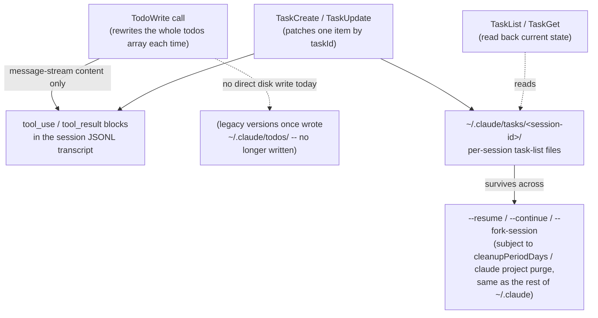
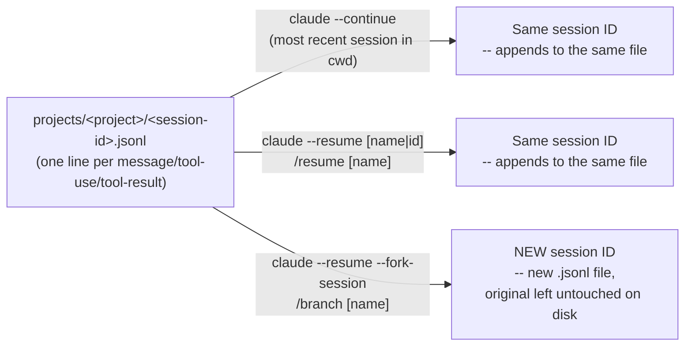
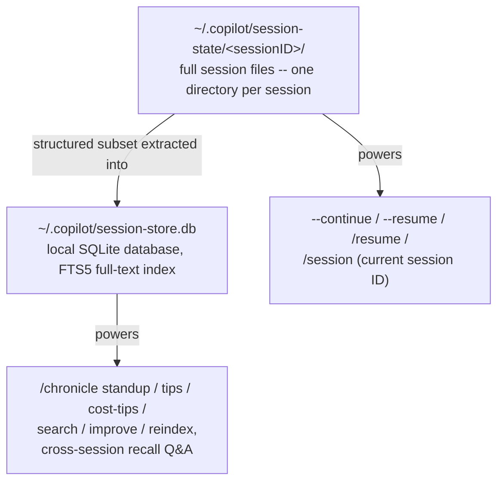
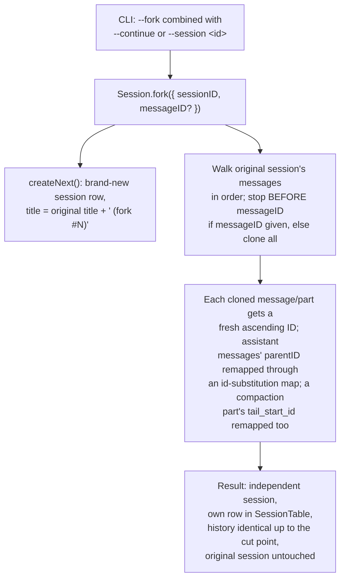
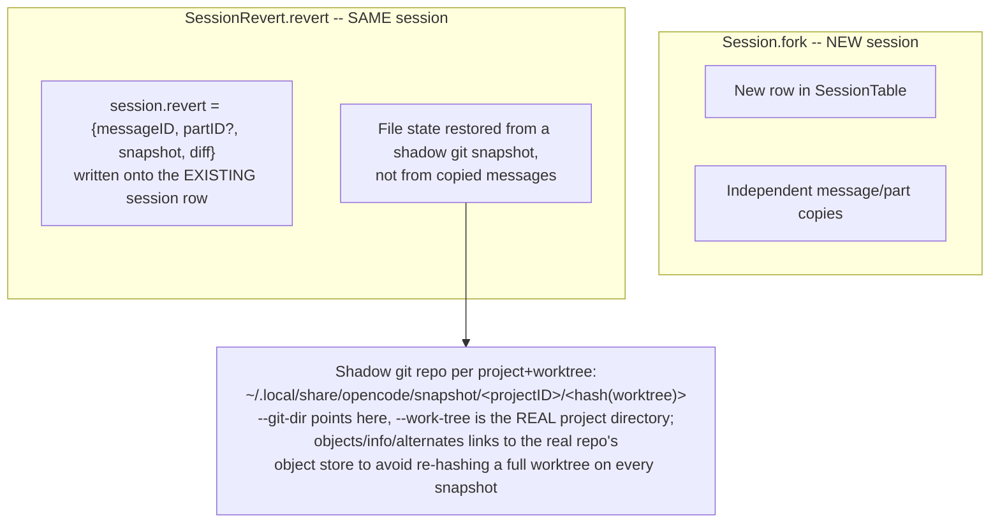
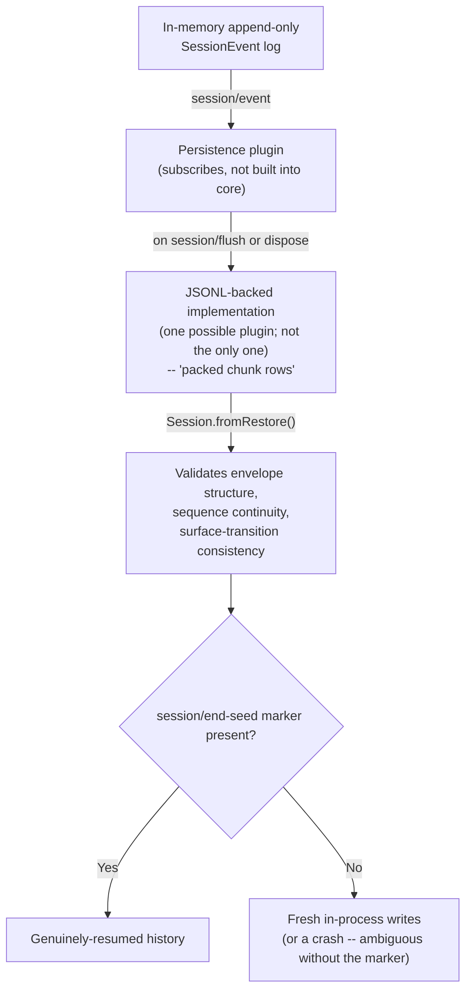
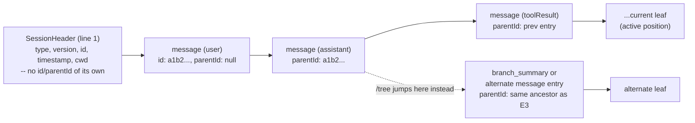
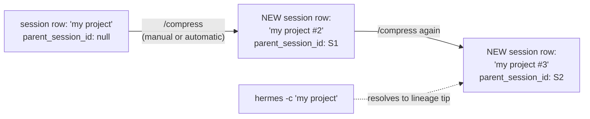

# Session & transcript persistence

**Scope note.** This page answers one specific question: once a single
agent process exits -- terminal closed, machine rebooted, `claude`/
`copilot`/`opencode`/`dsh`/`pi`/`hermes` re-invoked hours or days later -- what actually
survives on disk, under what identifier, and how do you get back into
it? That is a narrower question than two pages that sit right next to
it. [memory-management.md](memory-management.md) covers what a *fresh*
session pulls back in from disk (CLAUDE.md, auto memory, Copilot
Memory) and what a compaction inside one *live, still-running* session
keeps versus discards -- durability *within* a run, not durability of
the run's own record. [handoff-mechanism.md](handoff-mechanism.md)
covers what crosses the boundary when one agent hands work to a
*different* agent instance (a subagent, a teammate, a cloud agent) --
a spawn/return relationship between two agents that may both be alive
at the same moment; [Fan-out (subagent dispatch)](fan-out.md) §4 covers
the analogous but distinct question for DeepSeek Harness specifically
(its `inheritsParentContext` subagent-spawn descriptor, not to be
confused with this page's own §4 `fork()`, a whole-session operation).
This page is about neither: it is the on-disk transcript of one
session's own conversation, the identifier that names that transcript,
and the mechanics (`--resume`, `--continue`, `--fork-session`/`/branch`,
`--fork`, `revert`) for reopening, copying, or rewinding it after the
process that wrote it is long gone. All six products keep a
session-level record; the format, the store, and what "forking" means
at the storage layer differ completely.

---

## 1. Claude Code

Sources for this section: `code.claude.com/docs/en/sessions`,
`code.claude.com/docs/en/how-claude-code-works`,
`code.claude.com/docs/en/checkpointing`,
`code.claude.com/docs/en/claude-directory`, and
`github.com/anthropics/claude-code` `CHANGELOG.md`, all fetched
2026-08-01. §1.2 (added 2026-08-17) additionally draws on
`code.claude.com/docs/en/agent-sdk/todo-tracking`, a re-fetch of
`tools-reference` and `claude-directory`, and GitHub Issue #50656 --
cited inline in that subsection and in the full Sources list at the
bottom. VERIFIED unless tagged otherwise.

### 1.1 The transcript: one JSONL file per session, on disk from the first turn

"Claude Code saves your conversation locally as you work. Each message,
tool use, and result is written to a plaintext JSONL file under
`~/.claude/projects/`." The exact, documented path is
`~/.claude/projects/<project>/<session-id>.jsonl`, where `<project>` is
the working-directory path with every non-alphanumeric character
replaced by `-` -- so a project's transcripts are grouped by directory
identity, not by git remote. "Each line is a JSON object for a
message, tool use, or metadata entry." The docs are explicit that this
is a stability boundary, not an API: "The entry format is internal to
Claude Code and changes between versions, so scripts that parse these
files directly can break on any release" -- `/export` (human-readable
Markdown/plaintext) or the structured script interfaces (`claude -p
--output-format json`/`stream-json`, the `transcript_path` field
`hooks` and statusline commands receive, or the Agent SDK) are the
documented way to consume session data programmatically, not reading
the JSONL directly.

Related paths written per session, all under the same `projects/`
subtree and aging out together: `projects/<project>/<session>/subagents/`
(subagent transcripts -- see [handoff-mechanism.md](handoff-mechanism.md)
§1.2 for their own addressing scheme) and
`projects/<project>/<session>/tool-results/` (large tool outputs
spilled out of the main JSONL to keep it manageable). `file-history/<session>/`
sits alongside but is a separate mechanism (§1.5 below): pre-edit file
snapshots, not conversation content.

### 1.2 Task-tracking tool persistence: `TodoWrite` vs. the `Task*` family

This subsection updates the page with a gap `airchon-mentor` found live in a
prior conversation and flagged for `airchon-author` to research and persist,
rather than answering it in situ from an unresourced page. Sources: the
Agent SDK's `code.claude.com/docs/en/agent-sdk/todo-tracking` and
`code.claude.com/docs/en/tools-reference` (its "Task tool availability"
section specifically), both fetched fresh this session;
`code.claude.com/docs/en/claude-directory`'s "Application data" tables,
also fetched fresh this session and additionally corroborating what an
earlier fetch of this same page (§1.6 below) had already found regarding
`tasks/`; and GitHub Issue `anthropics/claude-code#50656`, fetched via
`gh api` this session including its full timeline. VERIFIED unless tagged
otherwise.

[Built-in tools](built-in-tools.md) §1.1 already names `TodoWrite` and the
`TaskCreate`/`TaskGet`/`TaskList`/`TaskUpdate`/`TaskOutput`/`TaskStop`
family as tools; this subsection covers what neither that page nor this
one's own §1.6 (written 2026-08-01, before this gap was found) previously
stated: which of them write anything to disk at all, where, and what that
means for `--resume`/`--continue`.

**`TodoWrite` writes nothing to disk on its own.** The Agent SDK's
`todo-tracking` doc describes `TodoWrite` purely as message-stream content:
"todo updates are reflected in the message stream" via `tool_use` blocks
carrying the full `todos` array on every call, and the doc's entire
monitoring-code pattern is built around watching that stream -- there is no
mention anywhere on that page of a file, directory, or storage location
`TodoWrite` writes to. This is corroborated independently, not merely
assumed from absence: the `claude-directory` doc's own "Cleaned up
automatically" table lists `todos/`, `statsig/`, and `logs/` together as
"Legacy directories from older versions. No longer written," and the
separate "what you lose if you delete it" table repeats the same three
paths with "Nothing. Legacy directories not written by current versions."
Read together, this means an *older* version of Claude Code did once
persist todo-checklist state to `~/.claude/todos/`, and current versions
have since stopped -- `TodoWrite` today really is transient message content
only, not merely under-documented disk state.

**The `Task*` family does write to disk, per-session.** The same
`claude-directory` "Cleaned up automatically" table names `tasks/`
directly: "Per-session task lists written by the task tools." This is a
documented path, not an inference. GitHub Issue #50656 (filed 2026-04-19,
titled "Task list UI not rendered after session resume") independently
names the exact same path at session granularity while describing a real
resume scenario: "Task data: persists correctly in
`~/.claude/tasks/<session-id>/`, only the UI rendering is affected." No
source fetched this session states the internal layout *within* that
per-session directory (one JSON file per task versus one combined file for
the whole list) -- treat "one JSON file per task" specifically as **BEST
CURRENT UNDERSTANDING, UNCONFIRMED**; only the per-session *directory*
path itself is documented and independently corroborated.



**Because `tasks/` is a real path under `~/.claude`, not a projection of the
transcript, it is swept and purged exactly like everything else this page
documents.** It sits in the same "Cleaned up automatically" table as
`projects/<project>/<session>.jsonl` and `file-history/<session>/`, so it
ages out under the same `cleanupPeriodDays` (default 30 days) as §1.6
below describes, and `claude project purge`'s own printed deletion plan
names it explicitly alongside `debug/` and `file-history/` entries ("Per-
session `tasks/`, `debug/`, and `file-history/` entries"). The practical
consequence for `--resume`/`--continue`: because task data lives in its
own file(s) keyed to the session ID rather than being embedded as ordinary
message content inside the session's own JSONL transcript, a resumed
session's `TaskList` reflects exactly the same on-disk state as when the
process exited -- it is not reconstructed from replaying the transcript.

**Model-availability caveat, precisely versioned.** Per
`tools-reference`'s "Task tool availability" section: "In Claude Code
v2.1.233 and later, the following tools aren't available on Opus 4.8,
Sonnet 5, Fable 5, Mythos 5, or later versions of those families unless
you opt in: `TodoWrite`, `TaskCreate`, `TaskGet`, `TaskUpdate`, and
`TaskList`" -- the documented rationale being that those specific model
families "keep track of multi-step work without a written checklist," so
Claude Code omits the tools' definitions and reminders to save context. On
any other model (the docs name Opus 4.7 as an example), Claude Code
provides the four `Task*` tools by default and `TodoWrite` only if you set
`CLAUDE_CODE_ENABLE_TASKS=0`. To opt back in on a gated model: export
`CLAUDE_CODE_ENABLE_TODO_TOOLS=1` before launch (every model and provider),
name a tool in `--allowedTools`/the Agent SDK's `allowedTools` option, or
list it in `--tools`/`tools`. Two environments bypass the model gate
entirely regardless of model: background sessions (`claude agent`-style)
and Claude Code on the web always provide the tools. This is a materially
more precise version boundary than a prior draft of this book's coverage
implied -- v2.1.142 (already cited in [Built-in tools](built-in-tools.md)
§1.1) is the version `Task*` became the *session-wide default* over
`TodoWrite`; v2.1.233 is a *separate, later* version gate that additionally
withholds the whole family, `TodoWrite` included, from specific newer
model families unless explicitly re-enabled. Do not conflate the two dates.

**A genuine naming overload worth flagging explicitly** (three related
uses of "Task," plus a fourth adjacent-but-differently-named concept),
visible directly in `tools-reference`'s own tool table: `Task` as a
prefix names three unrelated Claude Code mechanisms, not one.
`TaskCreate`/`TaskGet`/
`TaskList`/`TaskUpdate` are this subsection's checklist-tracking family.
`TaskOutput` ("Retrieves output from a background task... deprecated in
favor of `Read` on the task's output file path") and `TaskStop` ("Stops a
running background task by ID... also accepts an agent-team teammate or a
named background agent") instead control background Bash commands and
background subagents/teammates -- an entirely different referent for
"task," covered by [Built-in tools](built-in-tools.md) §1.3's Bash-
backgrounding mechanics, not by anything in this subsection. `CronCreate`/
`CronDelete`/`CronList` name a third, again-unrelated "scheduled tasks"
concept (recurring or one-shot prompts, documented at
`/docs/en/scheduled-tasks`), and §1.3 below's "what resumes" list names a
fourth adjacent-but-distinct concept, the "active goal" (turn-count/timer/
token-budget tracking, documented at `/docs/en/goal`). All four appear in
the same tools-reference table and none is a synonym for another; a
mention of "tasks" surviving a Claude Code resume needs the specific
mechanism named, not assumed from the word alone.

**A UI-rendering bug, not a data-loss bug -- and its real, checked-this-
session status.** GitHub Issue #50656 reports that after `--resume`/
`--continue`, the task-list UI panel does not visually reappear even
though the underlying `~/.claude/tasks/<session-id>/` data is present and
correct and a read-only `TaskList` call returns it accurately to the
model -- only a subsequent `TaskCreate`/`TaskUpdate` write re-triggers the
panel's render. The reporter's own root-cause theory, left in the issue
as an unverified comment rather than a maintainer-confirmed fix, is that
the panel's re-render is wired to fire on write events specifically, and
loading persisted state from disk on resume does not synthesize an
equivalent event. **Status, precisely, as of this session's fetch
(2026-08-17):** the issue is `closed` with `state_reason: not_planned` --
GitHub's stale-bot auto-closed it on 2026-05-26 for inactivity ("Closing
for now -- inactive for too long"), which is not the same as a maintainer
saying it was fixed or declining to fix it. A later comment, dated
2026-07-21, reports the bug still reproduces on Claude Code v2.1.173 and
states a changelog scan through v2.1.216 (2026-07-20) found no matching
fix, requesting the issue be reopened. As of this fetch, it remains
closed and has not been reopened. **BEST CURRENT UNDERSTANDING,
UNCONFIRMED:** whether this is fixed on the version a given reader has
installed -- the only two data points this session could find (a stale
auto-close, and one unresolved reopen request three months later) both
predate today, and no maintainer comment confirming or denying the bug's
current state was found in the timeline.

### 1.3 Session IDs and what resuming actually restores



`claude --continue` reopens "the most recent session in the current
directory"; `claude --resume` with no argument opens an interactive
session picker; `claude --resume <name>` and `/resume <name>` resolve a
name set via `--name`/`/rename` directly, falling back to the picker
(CLI) or an error (`/resume`, in-session) on an ambiguous match.
Critically, **name resolution is scoped to the current project
directory and its git worktrees** -- a session ID looked up from an
unrelated directory reports `No conversation found with session ID:
<session-id>`, and sessions created by `claude -p` or the Agent SDK
never populate the interactive picker at all, though their session ID
still resolves via `claude --resume <session-id>` run from the
directory they were started in.

What a resumed session restores, enumerated by the docs, is more
granular than "the conversation":

- **Conversation history** -- full, including every tool call and
  result.
- **Model** -- continues on the model the session was using, *unless*
  that model has since been retired, a launch-time `--model`/
  `ANTHROPIC_MODEL`-family variable overrides it, or the provider uses
  deployment IDs (Bedrock/Foundry/Google's Agent Platform).
- **Agent** -- a session launched with `--agent` or the `agent` setting
  resumes as that same agent (system prompt, tool restrictions, model),
  looked up first in the session's original directory (if trusted) and
  then the directory you resume from; if neither has it, the session
  falls back to default tools/prompt and surfaces a named warning.
- **Permission mode** -- restored, with two documented exceptions:
  `plan` and `bypassPermissions` are *never* restored (bypass must be
  re-enabled explicitly at relaunch); `auto` is restored only if the
  account still meets auto mode's requirements.
- **Active goals and unexpired scheduled tasks** -- carry over; a
  goal's turn count/timer/token baseline reset. Background Bash/monitor
  tasks do **not** resume.

**Not restored automatically:** `--mcp-config`, `--settings`,
`--plugin-dir`, `--fallback-model`, and `--add-dir` directories must all
be passed again at resume time (though `settings.json`/
`settings.local.json` are re-read fresh at every launch, so config that
lives there needs no re-passing). Directories added *mid-session* with
`/add-dir` are not restored either, though the session picker still uses
them to help locate the session.

**Resume-from-summary dialog.** On Pro/Max plans, resuming a session
inactive for roughly an hour and over 100,000 tokens opens a dialog
before your first message, because the prompt cache has expired by
then regardless of choice: **Resume from summary** runs `/compact`
immediately (one summarization request over the full history, then the
summary plus recent exchanges and up to five recently read files carry
forward); **Resume full session as-is** reprocesses and re-caches the
full history; **Don't ask me again** picks full-session and stops
showing the dialog. This is a session-*resume*-time cost decision,
distinct from the compaction survival table in
[memory-management.md](memory-management.md) §1.7, which governs what
an *in-progress* session keeps when it auto-compacts mid-run.

**Two terminals, one session, no fork:** "If you resume the same session
in two terminals without forking, messages from both interleave into
one transcript" -- there is no lock preventing this, only the
recommendation to fork if you want independent histories.

### 1.4 Branching/forking -- a genuinely new session ID, not a pointer

`/branch [name]` (optionally named; otherwise named after the first
prompt, or -- as of v2.1.198 -- after the first prompt *before* a
compaction summary rather than the literal string "Branched
conversation" that earlier versions fell back to) and, from the
command line, `claude --continue|--resume --fork-session` are the same
operation from two entry points: "Branching creates a copy of the
conversation so far and switches you into it, leaving the original
intact." The confirmation names both the new branch's session ID and
the original's; the original stays on disk, unchanged, and reachable
by its own name/ID from the picker.

The mechanically precise part is what does and doesn't carry over,
because `/branch` "copies the transcript and switches the running
Claude Code process to write to it" -- a copy-then-redirect operation
inside the same process, not a brand-new process:

| State | After `/branch` |
|---|---|
| Conversation history | Copied up to the point `/branch` ran |
| "Allow for this session" permission grants | Carried over -- same process, same in-memory grants. `--fork-session` into a **separate process** does *not* carry these; you re-approve there |
| In-flight background subagents/Bash commands | Keep running; their output lands in the new branch you switched into, not the original |

A CHANGELOG-confirmed bug and its fix show the boundary is real, not
theoretical: "Fixed fork-session lineage being lost after compaction in
headless and SDK sessions" -- i.e. the parent/fork relationship is
itself tracked state that can desync from the transcript content if
compaction and forking interleave, and this had shipped broken before
being fixed. A second entry, "Fixed `/branch` failing with 'No
conversation to branch' after entering a worktree or in some background
sessions," and a third, "Fixed `/branch` producing forks that fail with
'tool_use ids were found without tool_result blocks' when the source
session contained entries from rewound timelines," both point at the
same underlying fact: a fork is a structural copy of prior JSONL
entries, and anything that leaves those entries in an inconsistent
state (a stale `parentID` chain, an orphaned `tool_use` from a rewind)
can make the copy fail outright rather than silently degrade.

### 1.5 Checkpointing/`/rewind` -- a parallel, file-snapshot mechanism, not the transcript

Checkpoints are documented as a *distinct* system from the JSONL
transcript, tracking file edits rather than conversation content:
"Before Claude makes code changes, it also snapshots the affected
files." Every user prompt creates a checkpoint; Claude Code keeps
snapshots for "the 100 most recent checkpoints in a session," pruning
snapshot files no remaining checkpoint references (except each file's
first snapshot, kept as the VS Code extension's session-diff baseline).
`/rewind` (or `Esc Esc` at an empty prompt) opens a menu with five
actions per selected prior prompt: **Restore code and conversation**,
**Restore conversation** (code untouched), **Restore code** (history
untouched), **Summarize from/up to here** (compress without touching
files), and **Never mind**. Because "Claude Code saves checkpoints with
the conversation," `/rewind` still works after a `--resume` -- the
snapshots ride along with the JSONL transcript across the process
boundary this whole page is about.

Two limitations matter for anyone relying on this as a safety net:
checkpointing **does not track bash-driven file changes** (`rm`, `mv`,
`cp` run via the Bash tool are invisible to it -- git is the documented
remedy for those); and it **does not restore through symlinks or hard
links** -- a restore that hits a linked path skips it and reports
`Restored the code, but skipped N files`, with the skip reasons visible
in `~/.claude/debug/<session-id>.txt` under `/debug`. The docs are
explicit this is "local undo," not version control: "Checkpoints
complement but don't replace proper version control."

`/rewind` also has a documented escape hatch past `/clear`: as of
v2.1.191, if you ran `/clear` earlier in the same process, the rewind
menu gains a `/resume <session-id> (previous session)` entry at the top
that reopens the pre-`/clear` session -- available only until you exit
or resume something else.

### 1.6 Retention, storage location, and how to make it disappear

```mermaid
stateDiagram-v2
    state "Cleaned up automatically (cleanupPeriodDays, default 30)" as Auto
    state "Kept until you delete them" as Manual

    [*] --> Auto: "projects/&lt;project&gt;/&lt;session&gt;.jsonl,<br/>subagents/, tool-results/,<br/>file-history/&lt;session&gt;/, plans/, debug/"
    [*] --> Manual: "history.jsonl (prompt recall),<br/>stats-cache.json, remote-settings.json"
    Auto --> Deleted: "swept on next launch<br/>once older than cleanupPeriodDays"
    Manual --> Deleted: "only via explicit deletion or<br/>`claude project purge`"
```

Everything under `~/.claude/projects/` (transcripts, subagent
transcripts, spilled tool results) plus `file-history/<session>/`
(checkpoint snapshots), `plans/`, and per-session `debug/` logs are
swept on startup once older than `cleanupPeriodDays` (`settings.json`,
default **30 days**). By contrast `history.jsonl` (every prompt you've
typed, for up-arrow recall) and `stats-cache.json` (`/usage` totals)
are **not** covered by that sweep and persist indefinitely until
deleted by hand.

`CLAUDE_CONFIG_DIR` relocates the entire `~/.claude` tree.
`CLAUDE_CODE_SKIP_PROMPT_HISTORY` suppresses transcript and prompt-history
writes outright, in any mode; `--no-session-persistence` (with `claude
-p`) or `persistSession: false` (Agent SDK) do the same for a single
non-interactive run. `claude project purge <path>` (v2.1.124+) is the
documented, confirmable-plan deletion tool: it prints exactly which
files it will remove (transcripts and auto memory under `projects/`,
matching `tasks/`/`debug/`/`file-history/` entries, matching lines in
`history.jsonl`, the project's `~/.claude.json` entry) before asking
for confirmation, supports `--dry-run`, `-y`/`--yes`, `-i` (step through
item by item), and `--all` (purge every project, deleting
`history.jsonl` outright rather than filtering it).

**Plaintext, not encrypted at rest.** The docs state this directly:
"Transcripts and history are not encrypted at rest. OS file permissions
are the only protection. If a tool reads a `.env` file or a command
prints a credential, that value is written to
`projects/<project>/<session>.jsonl`." The three documented mitigations
are lowering `cleanupPeriodDays`, `CLAUDE_CODE_SKIP_PROMPT_HISTORY`, and
permission rules that deny reads of credential files outright.

### 1.7 A changelog-traced hardening history

Grepped the full `CHANGELOG.md` (2026-08-01) for
`session|resume|continue|fork|rewind|transcript|checkpoint`. The
pattern across dozens of entries is consistent: transcript durability
across restarts is treated by Anthropic as a correctness-critical
surface that keeps finding new edge cases, not a solved problem that
shipped once. A representative sample, each independently confirming a
mechanism this page describes:

- **Corruption resilience**: "Fixed `--resume` failing on large sessions
  when a transcript line was corrupted by an unclean shutdown -- the
  corrupt line is now skipped" and "pre-corrupted sessions are sanitized
  on load" (fixing a `no low surrogate in string` crash from a
  truncated emoji) -- both confirm the JSONL format is read
  defensively, line by line, and a single bad line does not sink the
  whole resume.
- **Malformed entries generally**: "Fixed a resumed session failing
  every turn, or crashing on resume, when its history held a malformed
  delta attachment," and "Fixed `--resume`/`--continue` and `/resume`
  failing with a TypeError when a transcript has a malformed attachment
  entry."
- **Silent-loss guards**: "Added warnings when transcript writes are
  failing (e.g. disk full) or when session saving is off due to an
  inherited environment variable, instead of losing transcripts
  silently," and later, "Fixed transcript write failures (e.g., disk
  full) being silently dropped instead of being logged" -- two separate
  fixes for the same failure class, months apart, which is itself a
  useful signal that "did my transcript actually get written" was
  historically hard to observe.
- **Fork/branch structural integrity**: the fork-after-compaction
  lineage bug and the rewound-timeline `tool_use`-without-`tool_result`
  fork failure, both cited in §1.4, plus "Fixed `/branch` rejecting
  conversations with transcripts larger than 50MB" -- a hard size
  ceiling on the fork operation that was later lifted.
- **Identity and addressing**: "Fixed `claude --resume <session-id>`
  losing the session's custom name and color set via `/rename`,"
  "Fixed `--resume`/`--continue` not finding sessions when the project
  path contains underscores," and "stdio MCP servers now receive the
  same `CLAUDE_CODE_SESSION_ID` as hooks/Bash on `--resume`" -- the last
  one matters for anyone building tooling around session identity: the
  session ID is propagated as an environment variable to MCP server
  subprocesses specifically on the resume path, not just at first
  launch.
- **Scale**: "Reduced session transcript size (up to 79x in edit-heavy
  sessions) and bounded checkpoint disk usage by pruning superseded
  file-history backups," "Fixed excessive memory usage (multiple GB)
  when resuming a session by transcript file path on machines with many
  stored sessions," and "Fixed `/usage` leaking up to ~2GB of memory on
  machines with large transcript histories" -- all confirm that
  transcript size and count are load-bearing performance variables, not
  incidental.

---

## 2. GitHub Copilot CLI

Sources for this section: `docs.github.com/en/copilot/concepts/agents/copilot-cli/chronicle`,
`docs.github.com/en/copilot/how-tos/copilot-cli/use-copilot-cli/chronicle`,
`docs.github.com/en/copilot/how-tos/copilot-cli/use-copilot-cli/overview`,
`docs.github.com/en/copilot/reference/copilot-cli-reference/cli-command-reference`,
and `github.com/github/copilot-cli` `changelog.md`, all fetched
2026-08-01. VERIFIED unless tagged otherwise. One further source,
`docs.github.com/en/copilot/how-tos/copilot-sdk/use-copilot-sdk/session-persistence`,
documents the separate Copilot SDK's `session.create`/`session.resume`
API and is cited only as adjacent background per this project's
AUTHORITY OVERREACH discipline -- flagged inline where used.

### 2.1 Two stores, not one: session files and a derived SQLite index



Per the docs, fetched directly: "Every Copilot CLI session is persisted
as a set of files in the `~/.copilot/session-state/` directory on your
machine. In addition to the session files, Copilot CLI stores structured
session data in a local SQLite database, referred to as the session
store." The relationship between the two is explicit and one-directional:
"This data is a subset of the full data stored in the session files" --
the session-state files are the durable, complete record; the SQLite
database (`~/.copilot/session-store.db`, with an FTS5 full-text index
across all indexed session content) is a derived, query-optimized
projection built *from* those files, not an independent source of
truth. "The session store is what powers the `/chronicle` slash command
and it also allows Copilot to answer questions you ask about your past
work." `/chronicle reindex` "reconstructs the database from session
files on disc" -- documented explicitly as the recovery path for
migrating sessions, recovering from corruption, or indexing sessions
that predate the store's existence, which only makes sense if the
session-state files, not the database, are the authoritative record.

This is architecturally the mirror image of what happens on
[memory-management.md](memory-management.md) §2.2's Copilot Memory: that
service is model-facing fact/preference storage reached via
`store_memory`/`vote_memory` tool calls, semantically about what Copilot
has learned, and is a *different* mechanism from the session-state/
session-store pair described here, which is about the conversation's own
durable record. Do not conflate the two: a session with Memory disabled
still gets a durable session-state directory and (per the changelog
entry below) can still be resumed.

### 2.2 Resume mechanics and session identity

`copilot --continue` "quickly resume[s] the most recently closed local
session"; `copilot --resume` (also `-r`, per changelog) opens the
session picker; `/resume` is the in-session equivalent, and `/resume
SESSION-ID` jumps directly to a specific session without opening the
picker. The session picker (CLI-reference page) supports `↑`/`↓`
navigation, `Enter` to open, `s` to cycle sort order (relevance →
created → name → last used), `Tab` to switch between local and remote
tabs, `d` to delete, `Esc` to close -- the local/remote tab split
reflects that a resumable session can be either a local session-state
directory or a session synced to GitHub's Mission Control (the same
sync surface that backs `/share`).

**Finding the current session's ID**: the `/session` slash command
prints it, and it's also shown when you exit an interactive session. A
changelog entry closes a related gap directly: "Exit message always
shows the session ID in the resume command instead of the friendly
name" -- i.e. the resume handle you're meant to copy-paste is the raw
ID, not whatever display name the session picked up.

**Resume and continue are documented as mutually exclusive** at the
flag level: "Reject `--continue` when used with `--resume`" (changelog)
-- you pick one entry point per invocation, not both. Session identity
is also explicitly tied to working directory, not just an opaque ID:
"Keep sessions tied to their working directory across prompts,
restarts, and workspace tools," and "`--continue`/`--resume` select the
most recent session for the current repository" -- a `--continue` run
from a different repository will not silently resume an unrelated
project's session.

### 2.3 The SDK's more detailed picture of what a session directory holds

`docs.github.com/en/copilot/how-tos/copilot-sdk/use-copilot-sdk/session-persistence`
documents the Copilot **SDK's** `session.create`/`session.resume` API
-- a distinct, broader product surface from the CLI, per this book's
standing AUTHORITY OVERREACH discipline, and cited here only as
background because it names the exact same directory the CLI docs use
(`~/.copilot/session-state/{sessionId}/`) with more internal structure
than any CLI-specific page states. Per that SDK page: state saved per
session includes full conversation history, cached tool-call results,
"agent planning state (`plan.md` file)," and session artefacts under a
`files/` subdirectory, with checkpoints in their own subdirectory too.
Provider/API keys and in-memory tool state are explicitly **not**
persisted -- a BYOK (bring-your-own-key) session must have its provider
config re-supplied on every `session.resume` call. Because the SDK page
names the identical `~/.copilot/session-state/{sessionId}/` path the
CLI-specific chronicle page uses for the CLI's own session files, it is
BEST CURRENT UNDERSTANDING, UNCONFIRMED (not stated on either page
directly) that the CLI's session-state directories share this same
internal `plan.md`/`files/`/checkpoints layout, since the CLI is built
on the same underlying session-persistence primitive the SDK exposes.
Treat the subdirectory names as a reasoned inference, not a
CLI-documented guarantee.

### 2.4 A changelog-traced hardening history

Grepped the full `changelog.md` (2026-08-01) for
`session|resume|continue|database|sqlite|chronicle|transcript`. As with
Claude Code, the pattern is a long tail of edge-case fixes on the same
mechanism rather than a single shipped-once feature:

- **Corruption and crash recovery**: "Recover corrupted session history
  on load," "Session resume works correctly after a crash that left
  partial data in the session log," and "Lone surrogates no longer
  break session resume or truncate prompts" -- the same defensive-read
  posture Claude Code's changelog shows for its own JSONL format,
  independently arrived at on a SQLite-plus-files store instead.
- **Performance at scale**: "Resume sessions faster by removing
  quadratic work when rebuilding the timeline," "Resume and switch large
  sessions faster," "Improve CLI responsiveness when reading and writing
  session databases," and "Keep session-store searches and context
  lookups responsive" -- confirming the session-store database is a
  live performance-sensitive subsystem, not a write-once archive.
- **Reliability of the identity/flag layer**: "Reject empty
  `--session-id=` values instead of ignoring them," "Reject empty
  `--resume=` values instead of starting a new session," "Show an error
  when `--name` is used with `--session-id` for an existing session,"
  and "Resume search matches session titles even when whitespace
  differs" -- all narrowing failure modes where a malformed or
  ambiguous identifier used to silently do the wrong thing (start fresh,
  match nothing) instead of erroring.
- **Cross-cutting state that resume must reproduce faithfully**:
  "Resumed sessions reproduce the original attached-file references even
  if those files later change on disk, avoiding prompt-cache resets,"
  and "Attached images and PDFs persist across session resume even if
  the source file is later changed or deleted" -- both point at the
  same design goal as Claude Code's model-pinning-on-resume behavior
  (§1.3): a resumed session should reproduce the *original* inputs it
  saw, not silently re-read a file that has since drifted.
- **Store maintenance surfaced to the user**: "Keep `/chronicle
  reindex` responsive and show progress in the timeline" and "Improve
  `/chronicle cost-tips` with more precise evidence-backed
  recommendations" -- the derived SQLite index (§2.1) is rebuildable and
  its rebuild cost is itself something the changelog tracks as a UX
  concern.

---

## 3. OpenCode

Sources for this section: `github.com/anomalyco/opencode`, `dev`
branch, fetched via `gh api` 2026-08-01
(`packages/opencode/src/session/session.ts`,
`packages/opencode/src/session/revert.ts`,
`packages/opencode/src/id/id.ts`,
`packages/opencode/src/storage/storage.ts`,
`packages/opencode/src/snapshot/index.ts`,
`packages/core/src/database/database.ts`,
`packages/core/src/database/path.ts`, `packages/core/src/global.ts`),
and `opencode.ai/docs/cli/`, fetched 2026-08-01. Per this book's
standing caveat, `dev` is not a stable release tag and may not match
the current stable release -- flagged inline below, and OpenCode's repo
carries no `CHANGELOG.md` (confirmed absent at repo root this session,
consistent with what every prior page in this book citing OpenCode has
found), so there is no behavior-change history to grep the way Claude
Code's and Copilot CLI's own changelogs allow for §1.7/§2.4 above.

### 3.1 A live architecture change the docs and community writeups don't reflect yet

This is worth stating carefully because it's a genuine gap between
what is easy to find about OpenCode's storage and what the current
source actually does. Community write-ups and OpenCode's own
`opencode.ai/docs/cli/` page describe (and the CLI page's own `export`/
`import` subcommands work with) session data as JSON files -- consistent
with a documented on-disk layout of
`~/.local/share/opencode/storage/session/message/<sessionID>/msg_<messageID>.json`
under the XDG data directory. That flat-file layout **is real**, but
reading `packages/opencode/src/storage/storage.ts` on `dev` shows it is
the **legacy** format: the file's own `MIGRATIONS` array contains a
migration function that walks exactly that path pattern
(`storage/session/message/*/*.json`) to move old per-project data into
a new location, and `packages/opencode/src/session/session.ts` on the
same branch does not read or write those files for session/message data
at all -- it operates on `SessionTable` and `PartTable` via Drizzle ORM
(`import { PartTable, SessionTable } from "@opencode-ai/core/session/sql"`).
Tracing that to `packages/core/src/database/database.ts` confirms the
current store is a **SQLite database**, not flat JSON files: the module
runs `PRAGMA journal_mode = WAL`, `synchronous = NORMAL`,
`busy_timeout = 5000`, `cache_size = -64000`, and `foreign_keys = ON` on
open, applies versioned migrations via `DatabaseMigration.apply`, and
resolves its file path (`database.ts`'s own `path()` function) to
`Global.Path.data/opencode.db` by default, or
`Global.Path.data/opencode-<channel>.db` on the beta/pre-release
installation channels, overridable entirely via the `OPENCODE_DB` flag
(including `:memory:` for an ephemeral, non-persistent database).
`packages/core/src/global.ts` resolves `Global.Path.data` to
`xdgData/opencode` -- `~/.local/share/opencode` on a standard Linux XDG
layout.

**BEST CURRENT UNDERSTANDING, UNCONFIRMED:** which format ships in the
version a given reader has installed depends on whether their release
predates or postdates this SQL migration; no version number or release
note documenting the cutover was found this session (no CHANGELOG.md
exists in this repo to check, per the sources note above), so treat
"session data lives in a SQLite database" as accurate for the `dev`
branch specifically, and treat any third-party writeup describing
per-message JSON files as describing the pre-migration format rather
than as wrong outright.

The flat-file `Storage` service is not dead, though -- it is still used
as a generic keyed-JSON blob store for auxiliary data that doesn't fit
the relational schema well: `revert.ts` (§3.4 below) writes computed
diff summaries via `storage.write(["session_diff", sessionID], diffs)`,
which resolves to a plain JSON file at
`<storage-dir>/session_diff/<sessionID>.json` per `storage.ts`'s own
`file()` helper (`path.join(dir, ...key) + ".json"`). So the accurate
picture on `dev` is **hybrid**: relational core data (sessions,
messages, parts) in SQLite; auxiliary, less-frequently-queried
artefacts still in flat per-key JSON files under the same storage root.

### 3.2 Session IDs are structured, sortable, and self-timestamping

`packages/opencode/src/id/id.ts` generates every ID in the system
(sessions, messages, parts, jobs, events, and more) from one shared
scheme, not a random UUID: a short type prefix (`ses_` for sessions,
`msg_` for messages, `prt_` for parts, plus `job_`, `evt_`, `per_`,
`que_`, `pty_`, `tool_`, `wrk_`) followed by a 6-byte encoding of
`(timestamp << 12) | counter` and 14 random base-62 characters. The
counter resets whenever the millisecond timestamp advances, guaranteeing
monotonic ordering for IDs minted in the same process even within a
single millisecond. Two directions are supported --
`Identifier.ascending(prefix)` and `Identifier.descending(prefix)` (the
descending variant bitwise-inverts the timestamp+counter value before
encoding it) -- so that, depending on which is used, lexicographic
string sort of the ID column directly yields chronological or
reverse-chronological order without a separate `ORDER BY created_at`.
A companion `timestamp(id)` function decodes the embedded creation time
back out of an ascending ID. This is a materially different identity
scheme from either other harness documented in this book: Claude
Code's and Copilot CLI's session IDs are opaque as far as their own
docs state; OpenCode's are self-describing and sortable by
construction, a source-level detail with no equivalent statement on
`opencode.ai/docs`.

### 3.3 Resume, from the CLI's own documented flags

Per `opencode.ai/docs/cli/`: `opencode session list` lists sessions
(`--max-count`/`-n` to limit, `--format table|json`); `opencode session
delete <sessionID>` removes one. Resume/continue at the CLI-invocation
level is a set of flags shared across `opencode run`, the TUI
invocation, and `opencode attach`: `--continue`/`-c` resumes the most
recent session; `--session <id>`/`-s <id>` continues a specific one by
ID. In the TUI itself, `/sessions` (aliased `/resume`/`/continue`, per
a separate WebSearch-sourced community reference **not independently
fetched this session, flagged as UNVERIFIED against
`opencode.ai/docs` directly**) lists and switches sessions
interactively.

### 3.4 Fork-from-message: a new session row, truncated at a specific message



This is the CLI-level `--fork` flag's implementation, read directly
from `packages/opencode/src/session/session.ts`'s `fork` function. The
call signature is `{ sessionID: SessionID; messageID?: MessageID }` --
an *optional* cutoff message. When `messageID` is omitted, every
message in the source session is cloned. When it is given, the walk
over the source session's messages (`messages({ sessionID })`, returned
in creation order because message IDs are ascending per §3.2) breaks
**before** copying any message whose ID is `>=` the given `messageID` --
i.e. `messageID` is an exclusive upper bound, not an inclusive one:
"fork from this point" keeps everything strictly earlier and drops the
named message and everything after it.

Every copied message and every one of its parts gets a brand-new
ascending ID (`MessageID.ascending()`, `PartID.ascending()`), and the
function threads an `idMap: Map<oldID, newID>` through the walk so that
an assistant message's `parentID` -- which in OpenCode's message schema
points at the user message it's replying to -- is rewritten to point at
the *cloned* parent's new ID, not the original's. One further, easy-to-
miss remap: if a cloned part has `type === "compaction"` and carries a
`tail_start_id` (the message ID a compaction summary starts covering
from, per [context-compression.md](context-compression.md)'s coverage
of OpenCode's `prune()`/`process()` pipeline), that reference is
rewritten through the same `idMap` too -- without this, a forked
session containing an old compaction boundary would point at a message
ID that no longer exists in the fork's own session. The new session's
title is generated by `getForkedTitle()`, which appends `(fork #1)` to
the original title, or increments an existing `(fork #N)` suffix on a
fork-of-a-fork.

The forked session is a **fully independent row** in `SessionTable`
from the moment `createNext()` returns -- there is no shared-storage
optimization here (unlike Claude Code's `--fork-session`, which within
one process reuses in-memory permission grants per §1.4): a fork is a
genuine, separate copy of the relevant message and part rows, addressed
by its own new session ID, from its first write.

### 3.5 Revert/unrevert: undo in place, not a fork -- and its own shadow-git snapshot store



`packages/opencode/src/session/revert.ts` implements a mechanism the
CLI/TUI expose as an undo, and it is architecturally the opposite of a
fork: `revert({ sessionID, messageID, partID? })` does **not** create a
new session. It walks the session's own messages to find the target
message (or a specific part within it), records that cut point as
`session.revert = { messageID, partID, snapshot, diff }` written onto
the **existing** session row via `sessions.setRevert(...)`, takes (or
reuses) a file-state snapshot via `Snapshot.Service.track()`, and
applies the collected `patch`-typed parts in reverse via
`snap.revert(patches)` to actually roll the working tree back. A
companion `unrevert({ sessionID })` restores the snapshot taken at
revert time, undoing the undo. A third function, `cleanup`, is the
"actually delete the reverted tail" operation: when called, it removes
every message (or every part past a given `partID` within one message)
strictly after the revert's cut point from the session's own row set --
this is the point at which a revert stops being reversible and starts
being a real, permanent truncation of that session's history.

The file-state half of a revert -- not the message rows, which live in
`SessionTable`/`PartTable` as normal -- is backed by a **shadow git
repository maintained per project and worktree**, read directly from
`packages/opencode/src/snapshot/index.ts`: its `gitdir` resolves to
`path.join(Global.Path.data, "snapshot", projectID, Hash.fast(worktree))`,
and every git operation against it is run with an explicit `--git-dir`
pointed at that snapshot directory and `--work-tree` pointed at the
*real* project directory -- i.e. it is a completely separate commit
history laid over the same working files, invisible to the project's
own `.git`. A deliberate space/performance optimization is visible in
the source: the snapshot repo's `objects/info/alternates` file is
written to point at the real repository's own object store
("Reuse the hashes for the git storage between the original repo and
snapshot ... on huge repos like chromium checkout the git add --all
rebuilding the [index] is expensive"), so unchanged blobs are shared by
reference rather than re-hashed and re-stored on every snapshot. This
is OpenCode's structural equivalent of Claude Code's checkpoint file
snapshots (§1.5) -- both exist to let a rewind-style undo restore file
state independent of git commits the user makes -- but where Claude
Code stores raw pre-edit file copies under `file-history/<session>/`,
OpenCode reuses git's own object model as the snapshot substrate.

**BEST CURRENT UNDERSTANDING, UNCONFIRMED:** no `opencode.ai/docs` page
fetched this session documents `revert`/`unrevert`/the shadow-git
snapshot mechanism in end-user terms (a TUI keybind or slash command
name for it was not confirmed against the docs site directly) -- this
entire subsection is source-level knowledge from the `dev` branch, not
corroborated by an OpenCode docs page the way Claude Code's
`/rewind` is documented on `code.claude.com`.

---

## 4. DeepSeek Harness

Sources for this section: VERIFIED, fetched 20 August 2026 directly from
`deepseek-ai/deepseek-harness` (`master` branch, developer preview -- see
[Hooks and lifecycle extensibility](hooks-lifecycle-extensibility.md) §4
for this book's fuller introduction to the harness itself, not repeated
here), `docs/architecture.md`, `docs/glossary.md`, and
`docs/subsystems/session.md`.

### 4.1 Turn/step vocabulary and the three-domain session-event model

DeepSeek Harness defines a **step** as one model request plus the tool
invocations it produces, and a **turn** as "one drain of admitted input in
a session," containing zero or more steps, opening before the first input
claim and closing once no work is owed or a terminal policy intervenes.
Everything that becomes part of a model request must be captured as a
durable `SessionEvent` in an append-only session log -- the architecture
doc's stated invariant is that "model-visible" and "logged" are treated as
logically equivalent (already named as a house rule in [Hooks and lifecycle
extensibility](hooks-lifecycle-extensibility.md) §4.2), so any new kind of
model-visible input requires a corresponding new entry added to the
`SessionEventMap` type, not an ad hoc side channel. Events are explicitly
split into three domains with different durability and audiences:
**session events** (durable, e.g. `turn/*`, `step/*`, `user/message`,
`assistant/*`, `tool/*`), **agent events** (live/in-memory only, e.g.
`agent/pre-step`, `agent/request`, `agent/turn-stopping`), and **capability
events** (policy/adapter attachment, e.g. `fs/*`, `tools/*`,
`telemetry/*`).

This turn/step vocabulary is independently confirmed for three of this
book's four harnesses now -- Claude Code's Agent SDK turns and OpenCode's
steps (both documented in [Agent loop: Claude Code vs.
OpenCode](agent-loop-implementations.md), not re-derived here) and now
DeepSeek's own turn/step pair defined above -- with Copilot CLI's own
loop-progress vocabulary not yet independently confirmed on that page.

### 4.2 A pluggable persistence contract: the framework ships no backend at all

`docs/subsystems/session.md` describes the persistence contract as
deliberately decoupled from the in-memory session model: the framework's
core ships **no persistence backend at all**, and "persistence plugins
subscribe to `session/event` and flush on `session/flush` / dispose" -- a
JSONL-backed implementation is named as one such plugin, encoding events as
"packed chunk rows" while preserving bit-for-bit fidelity on reload. This
is architecturally distinct from every other harness on this page: Claude
Code's JSONL transcript (§1.1) and Copilot CLI's session-state files (§2.1)
are both a fixed, first-party format the harness itself writes directly;
DeepSeek's own JSONL format is, by contrast, one interchangeable *plugin
implementation* of a persistence seam the core session model does not
itself assume exists, consistent with the capability-seam architecture
documented in full in [The LLM API contract](llm-api-contract.md) §3.4.



`Session.fromRestore()` reconstructs a session by validating envelope
structure, sequence continuity, and surface-transition consistency before
freezing the restored object; a special `session/end-seed` marker
distinguishes genuinely-resumed history from fresh in-process writes,
letting a plugin tell whether a prior open bracket (e.g. an unterminated
turn) represents a crash or a clean prior session boundary -- a
finer-grained resumption-integrity check than anything stated on the pages
fetched for either closed harness's own §1/§2 above, though closer in
spirit to Claude Code's own corruption-resilience hardening history (§1.7)
than to anything documented for Copilot CLI.

### 4.3 `fork()`: an inclusive boundary, and a rejected (not clipped) open-turn cut

`fork()` accepts a live session or session ID plus an optional **inclusive**
boundary sequence number, requires that boundary to land outside an open
turn, and produces a child session with deep-cloned seed events and
inherited lineage metadata (`parentSession`, `seedLength`, `cwd`); an
explicit `boundary` parameter enables forking from any between-turn
position rather than only the tip, and the API **rejects** (rather than
silently clips) a boundary that would land inside an open turn.

This is strikingly close to, and worth comparing directly against, this
same page's §3.4 finding for OpenCode's own source-verified
`Session.fork({sessionID, messageID?})` mechanic: two independently-built,
fully source-available harnesses have each converged on "fork a session
from an arbitrary earlier point, not just its tip" as a first-class
primitive, differing only in the specifics --

| | DeepSeek Harness `fork()` | OpenCode `Session.fork()` |
|---|---|---|
| Boundary addressing | Sequence number | Message ID |
| Boundary semantics | **Inclusive** (boundary itself is kept) | **Exclusive** (walk stops *before* copying the named message) |
| Invalid-boundary handling | **Rejects** a boundary landing inside an open turn | No open-turn concept in OpenCode's own schema to reject against |
| Copy mechanics | Deep-cloned seed events; lineage metadata (`parentSession`, `seedLength`, `cwd`) | Fresh ascending IDs per copied row; `parentID`/`tail_start_id` remapped through an `idMap` |

Neither difference is a defect in either harness -- they are two
independently-arrived-at answers to the same design question, addressed
through each harness's own native identity scheme (sequence numbers for
DeepSeek's turn/step model; ascending, self-timestamping message IDs for
OpenCode's, per §3.2 above), each choosing the boundary convention that
fits its own addressing scheme most naturally.

---

## 5. pi

Sources for this section: VERIFIED, fetched 20 August 2026 directly from
`github.com/earendil-works/pi`'s `packages/coding-agent/docs/` tree (`session-format.md`
and `sessions.md`, both in full) and cross-referenced against
`packages/coding-agent/docs/compaction.md` for the compaction-entry detail this section
shares with [context-compression.md](context-compression.md).

### 5.1 One JSONL file per session, but tree-structured from the format's own design, not bolted on

pi's session store is, like Claude Code's, a plaintext JSONL file with one JSON object
per line -- but where Claude Code's transcript is a linear append log that `/branch`
copies wholesale to fork (§1.1, §1.4), pi's own format bakes branching into every entry
from the start: "Session entries form a tree structure via `id`/`parentId` fields,
enabling in-place branching without creating new files." Every entry except the
`SessionHeader` (the first line, metadata-only, itself carrying no `id`/`parentId`) is a
node with an 8-character-hex `id`, a `parentId` pointing at the entry it followed (`null`
only for the very first real entry), and a `timestamp`. Location follows the same
directory-encodes-the-project convention Claude Code uses:
`~/.pi/agent/sessions/--<path>--/<timestamp>_<uuid>.jsonl`, where `<path>` is the working
directory with `/` replaced by `-`. Sessions carry an explicit format-version field in
the header -- version 1 (linear, legacy), version 2 (the current tree structure), version
3 (a role rename, `hookMessage` to `custom`, from an "extensions unification" pass) --
and pi auto-migrates any older session to the current version transparently on load, the
same defensive-load posture Claude Code's changelog shows repeatedly for its own format
(§1.7) and OpenCode's `MIGRATIONS` array shows for its own storage layer (§3.1), independently
converged on by three unrelated teams maintaining a plaintext or embedded-database session
format across format revisions.



### 5.2 Nine entry types, and a session-context builder that walks the tree, not the file

`session-format.md` names the full entry-type union, distinguishing types that
participate in what the LLM sees from types that exist purely for extension/UI state:
`SessionMessageEntry` (wraps an `AgentMessage` -- `user`/`assistant`/`toolResult`/
`bashExecution`/`custom`/`branchSummary`/`compactionSummary`), `ModelChangeEntry` and
`ThinkingLevelChangeEntry` (mid-session `/model` switches and reasoning-level changes,
each becoming its own tree node rather than mutating prior entries), `CompactionEntry`
and `BranchSummaryEntry` (both covered from the compaction-mechanics side in
[context-compression.md](context-compression.md)'s own pi section, not repeated here in
full), `CustomEntry` (extension state that "does NOT participate in LLM context" --
persisted but invisible to the model), `CustomMessageEntry` (the opposite: an
extension-injected message that *does* enter LLM context, with its own `display` flag
controlling whether the TUI renders it), `LabelEntry` (a user-settable bookmark on an
entry, clearable by setting `label` to `undefined`), and `SessionInfoEntry` (the
human-readable session name set by `/name`, surfaced in the `/resume` picker in place of
the first message once set). A dedicated `buildContextEntries()` function walks from the
current leaf back to the root to produce the active branch's entry list -- honoring
whichever compaction entry sits on that path, preferring a self-contained `retainedTail`
snapshot when present and falling back to walking from `firstKeptEntryId` for
older-format compactions -- and a second function, `buildSessionContext()`, converts that
entry list into the actual message array plus the active model/thinking-level settings
sent to the LLM. This two-stage build (walk the tree for the active branch, then convert
that branch's entries into an LLM-ready message list) is architecturally the same shape
as Claude Code's own compaction-aware context reconstruction and OpenCode's
compaction-`prune()`/`process()` pipeline (both cross-referenced in
[context-compression.md](context-compression.md)), but pi's version is unique among the
harnesses this book documents in having to walk an explicit parent-pointer *tree*, not
merely a linear log with a compaction cut-point, because any entry in a pi session may
have sibling branches the active leaf is not currently on.

### 5.3 `/tree`, `/fork`, and `/clone`: three genuinely different operations on the same underlying structure

`sessions.md` draws a three-way distinction this book's other harnesses collapse into
one or two mechanisms:

| Feature | Output | View | Typical use |
|---|---|---|---|
| `/tree` | Same session file | Full tree, navigable | Explore alternatives in place, without leaving the file |
| `/fork` | New session file | User-message selector | Start a new session from an earlier prompt |
| `/clone` | New session file | Current active branch only | Duplicate current work before continuing further |

`/tree` is the operation with no equivalent in this page's other three harness sections:
because branching is native to the file format (§5.1), pi can move the "current leaf"
pointer to any earlier entry -- reachable via `getTree()`/`getChildren()`/`branch(entryId)`
on the `SessionManager` API -- and continue writing new entries from there, *inside the
same file*, leaving the abandoned branch's entries physically present and still
reachable by navigating back. This is closer in spirit to OpenCode's `SessionRevert`
mechanism (§3.5) than to either harness's fork operation, except pi's version does not
delete or roll back anything -- the abandoned branch's entries simply stop being on the
active path, exactly analogous to checking out a different git branch without deleting
the one you left. Selecting a user or custom-message entry in `/tree` moves the leaf to
that entry's *parent* and drops the selected text back into the editor for revision (a
resubmit-and-fork gesture); selecting any other entry type (assistant, tool, compaction)
moves the leaf directly to it and leaves the editor empty, ready to continue from that
exact point. `/fork` and `/clone`, by contrast, both write an entirely new `.jsonl` file
-- `/fork`'s new `SessionHeader` records a `parentSession` field pointing at the
originating file's path, the one piece of cross-file lineage pi's format preserves --
with `/fork` presenting a picker over prior *user messages* specifically (fork from an
earlier prompt) while `/clone` simply duplicates the currently active branch verbatim
into a new file with no picker at all.

The `SessionManager` class (`session-manager.ts`, named directly in the docs' own Source
Files list) exposes this as a small, complete API surface: `SessionManager.create`/
`.open`/`.continueRecent`/`.inMemory`/`.forkFrom` for constructing a manager;
`newSession`/`setSessionFile`/`createBranchedSession` for session-level operations;
`appendMessage`/`appendCompaction`/`appendCustomEntry`/`appendLabelChange`/etc. (each
returning the new entry's ID) for writing; and `getLeafId`/`getBranch`/`getTree`/
`branch`/`resetLeaf` for tree navigation -- a programmatic surface any extension or
embedding application can drive directly, since it is exported from
`@earendil-works/pi-coding-agent` rather than being internal-only plumbing.

### 5.4 Deletion, and a small but genuinely distinctive UX choice

Sessions are deleted by removing their `.jsonl` file under `~/.pi/agent/sessions/`, or
interactively from the `/resume` picker (select, `Ctrl+D`, confirm). One detail worth
noting for its own sake: "When available, pi uses the `trash` CLI to avoid permanent
deletion" -- i.e. pi's own deletion path defaults to a recoverable OS trash/recycle-bin
operation rather than an unrecoverable `unlink()` when the `trash` utility is present on
the host, a small but deliberate safety margin this book has not found documented for
Claude Code's, Copilot CLI's, or OpenCode's own session-deletion paths.

---

## 6. Hermes Agent (Nous Research)

Sources for this section: VERIFIED, fetched 1 September 2026 directly
from `hermes-agent.nousresearch.com/docs/user-guide/sessions` and
`.../docs/user-guide/checkpoints-and-rollback` (both fetched in full
this session) -- see [Permissions & sandboxing
architecture](permissions-and-sandboxing.md) §6 for this book's fuller
architectural introduction to the harness itself, and
[Memory management](memory-management.md) §5 and [Fan-out (subagent
dispatch)](fan-out.md) §5 for its memory/skills and `delegate_task`
mechanisms, neither repeated in full here.

### 6.1 One canonical store, `~/.hermes/state.db`: a SQLite database, not a session-per-file format

Hermes is the only harness on this page whose *entire* conversation
history -- across every client surface, not just the CLI -- lives in a
single SQLite file: "Sessions are tracked in: SQLite database
(`~/.hermes/state.db`) -- structured session metadata with FTS5
full-text search, plus full message history." Every conversation,
"whether from the CLI, Telegram, Discord, Slack, WhatsApp, Signal,
Matrix, Teams, or any other messaging platform," is a row in the same
database, tagged with one of over twenty documented source values
(`cli`, `telegram`, `discord`, `cron`, `batch`, `acp`, and so on). The
docs name the schema directly: a **`sessions`** table (id, source
platform, user ID, a unique human-readable title, model name and
configuration, a system-prompt snapshot, token counts, `started_at`/
`ended_at` timestamps, and a **parent session ID** "for
compression-triggered session splitting" -- the subject of §6.3 below),
a **`messages`** table (role, content, tool calls, tool results, token
count), and a **`messages_fts`** FTS5 virtual table for full-text search
-- the same search substrate [Memory management](memory-management.md)
§5.3 already documents Hermes exposing to the model itself as a
cross-session recall channel. The database "uses WAL mode for
concurrent readers and a single writer, which suits the gateway's
multi-platform architecture well" -- the identical journaling mode this
page's §3.1 documents OpenCode's `opencode.db` using for the same
reason (concurrent readers, one writer), independently converged on by
two of this book's six harnesses for their session store specifically.

Hermes did not start this way: "Sessions created before `state.db`
became canonical may have leftover `*.jsonl` files in
`~/.hermes/sessions/`. They are no longer written or read by Hermes,"
safe to delete once the corresponding row is confirmed present in
`state.db`. This is a third independently-documented instance, after
OpenCode's own JSON-to-SQLite migration (§3.1, `MIGRATIONS` array) and
pi's v1→v2→v3 JSONL format revisions (§5.1), of a harness's session
store outgrowing an earlier on-disk shape over its own version
history -- though Hermes' and OpenCode's moves are the more structurally
similar pair of the two, both trading a flat per-session file format for
a relational database, where pi stayed on JSONL and instead enriched
the format in place (linear → tree-structured). A second file,
`~/.hermes/sessions/sessions.json`, sounds like a session index but is
explicitly documented as neither the store nor a full index of it: it is
"a legacy mirror of" the **gateway routing table** (`gateway_routing`,
itself inside `state.db`) that maps messaging-platform session keys to
active session IDs, written only "when `gateway.write_sessions_json:
true` (the default)" and containing only gateway/messaging entries --
"if you run a messaging platform you'll see only those... This is
expected and does not mean your CLI sessions are missing." `hermes
sessions list`, `/sessions`, and the dashboard all read `state.db`
directly, which is the only complete session index; a separate
`~/.hermes/sessions/saved/*.json` directory holds `/save` snapshots,
described explicitly as "convenience exports, not the index."

### 6.2 Session identity, per-terminal continuity, and workspace-scoped resume

Session IDs follow a fixed, documented shape --
`YYYYMMDD_HHMMSS_<hex>`, with "CLI/TUI sessions use a 6-char hex suffix
(e.g. `20250305_091523_a1b2c3`), gateway sessions use an 8-char suffix
(e.g. `20250305_091523_a1b2c3d4`)" -- a self-timestamping scheme
distinct from every other identity convention this page documents:
Claude Code's and Copilot CLI's IDs are opaque per their own docs
(§1/§2), OpenCode's `ses_`-prefixed IDs embed a timestamp+counter inside
an otherwise-opaque encoded string (§3.2), pi embeds a UUID in the
*filename* rather than the ID itself (§5.1), and Hermes' own ID is a
plain, human-legible timestamp with a short random suffix appended
directly, resolvable "by full or unique prefix" or by title.

`hermes --continue`/`-c` resumes "the most recent CLI session," but a
bare `-c` is documented as **terminal-aware** in a way this page finds
nowhere else among its six harnesses: "each CLI session drops a small
breadcrumb file under `~/.hermes/terminal-sessions/` keyed by the
terminal it runs in (tty device, tmux pane, kitty window, wezterm pane,
Zellij pane, Windows Terminal session, ...). When you run `hermes -c`
again in the same terminal, Hermes resumes *that terminal's own*
session -- so two panes side by side each continue their own
conversation instead of both grabbing the globally most-recent one." A
missing, deleted, or stale (older than 30 days) breadcrumb falls back to
plain most-recent-session behavior, and the mechanism is disabled
outright via `session.terminal_continue: false`. `--resume`/`-r` takes
an explicit ID, a title, or the reserved keyword `latest`; resuming **by
name** resolves lineage automatically -- `hermes -c "my project"` picks
the newest session in a numbered title lineage ("my project #3") rather
than erroring on ambiguity, the mechanism §6.3 below explains the origin
of. `--in <dir>` combined with `--resume latest` (or `-c`) resumes "the
latest session that belongs to `./my-project`" without a prior `cd`, and
resuming a CLI session by default also restores its recorded working
directory (git repo root or cwd) unless `--no-restore-cwd` is passed;
`hermes sessions list --workspace <needle>` filters by that same
workspace key. On resume, a **conversation recap panel** displays up to
the last ten exchanges (user messages truncated at 300 characters,
assistant replies at 200 characters/3 lines, tool calls collapsed to a
count-plus-name summary) before returning control to the live prompt --
configurable down to a minimal one-liner via `display.resume_display:
minimal`.

### 6.3 Compression as lineage-splitting: the only harness on this page where compaction *is* the fork



This is the single most structurally distinctive finding of this
section, and it inverts every other harness's compaction/fork
relationship documented elsewhere on this page. Every other product
treats compaction and forking as separate operations on separate axes:
Claude Code's `/compact` truncates history *in place*, under the *same*
session ID (§1.3's compaction-survival distinction from §1.4's `/branch`
is explicit that these are different mechanisms); OpenCode's
`Session.fork` (§3.4) and DeepSeek's `fork()` (§4.3) are both
user/API-invoked operations on a stored session, unconnected to either
harness's own compaction pipeline; pi writes a `CompactionEntry`
directly into the *same* tree-structured file rather than starting a
new one (§5.2). Hermes' own docs state the opposite design outright:
"When a session's context is compressed (manually via `/compress` or
automatically), Hermes creates a new continuation session. If the
original had a title, the new session automatically gets a numbered
title: 'my project' → 'my project #2' → 'my project #3'." Compaction and
forking are, in Hermes' storage model, the *same mechanism* -- every
compression event is definitionally a session-lineage split into a new
`sessions` row, chained to its predecessor by the `parent_session_id`
field named in §6.1, never a truncation of the row already on disk.
`hermes -c "my project"` existing specifically to resolve "the whole
lineage" back to its current tip (§6.2) is the resume-side mechanism
that makes this design usable at all: a long-lived, heavily-compressed
conversation is, on disk, a *chain* of session rows rather than one
continuously-mutated record -- closer in shape to a linked commit
history than to any other harness's own session model on this page.
**BEST CURRENT UNDERSTANDING, UNCONFIRMED:** the fetched page states
that a new continuation session is created and numbered but does not
itemize exactly what is seeded into that child row (a compacted summary
plus a fixed tail of recent messages, by analogy with every other
harness's own compaction mechanics documented across this book, versus
some other cut); that specific seeding detail was not independently
confirmed this session and is not asserted as fact above.

### 6.4 Checkpoints & `/rollback`: a separate, opt-in, cross-project shadow-git safety net

Distinct from the session/conversation store above -- the direct analog
to Claude Code's `/rewind` (§1.5) and OpenCode's `SessionRevert` (§3.5)
-- Hermes' checkpoint system snapshots *files*, not conversation
content, and is **opt-in, off by default as of v2**: "Checkpoints are
opt-in as of v2 -- most users never use `/rollback`, and the
shadow-store storage is non-trivial over time, so the default is off,"
enabled per-session with `hermes chat --checkpoints` or globally via
`checkpoints.enabled: true` in `~/.hermes/config.yaml`. Where Claude
Code snapshots files under a per-*session* `file-history/<session>/`
directory (§1.5) and OpenCode maintains a shadow git repository per
project-*and*-worktree with object-store sharing back to the real repo
via `objects/info/alternates` (§3.5), Hermes goes one step further: "a
single shared shadow git repository under `~/.hermes/checkpoints/store/`
-- your real project `.git` is never touched. Every project the agent
works in shares the same store, so git's content-addressable object DB
deduplicates across projects and across turns" -- one store for every
project on the machine, not one per project, addressed internally via a
per-project ref (`refs/hermes/<project-hash>`) and a per-project git
index.

Checkpoints trigger automatically before `write_file`/`patch` tool calls
and before a documented list of destructive terminal commands (`rm`,
`rmdir`, `cp`, `install`, `mv`, `sed -i`, `truncate`, `dd`, `shred`,
output redirects, and `git reset`/`clean`/`checkout`), capped at "at
most one checkpoint per directory per turn." `/rollback <N>` is
selective by default in a way neither Claude Code's five-option
`/rewind` menu nor OpenCode's `revert`/`unrevert` documents an
equivalent for: "Every successful `write_file`/`patch` records the
file's content hash in an **agent-write ledger**; at restore time, any
file whose current contents no longer match what Hermes last wrote (you
edited it afterwards, or Hermes never touched it) is skipped instead of
overwritten" -- `/rollback <N> --all` forces the classic full overwrite,
and an empty ledger (a pre-feature store, or a project Hermes has not
yet written to) falls back to full restore automatically. Restoring
also "undoes the last conversation turn so the agent's context matches
the restored filesystem state" -- file rollback and conversation rollback
move together as one action, where Claude Code's own `/rewind` menu
explicitly separates "Restore code and conversation," "Restore
conversation" (code untouched), and "Restore code" (history untouched)
into three independently selectable options (§1.5). Safety guards named
directly in the docs: checkpointing is transparently disabled if `git`
is not on `PATH`; overly broad directories (`/`, `$HOME`) and
repositories over 50,000 files are skipped outright; a per-file size cap
(`max_file_size_mb`, default 10 MB) excludes large binaries/datasets;
and a total store-size cap (`max_total_size_mb`, default 500 MB) drops
the oldest commit per project round-robin once exceeded, with `max_snapshots`
(default 20) enforced by "rewriting the per-project ref and running `git
gc --prune=now` afterwards, so loose objects don't accumulate." A
startup sweep (`auto_prune`, on by default *for the checkpoint store
specifically*, at `retention_days: 7`/`min_interval_hours: 24`) deletes
project entries by staleness but deliberately **never** deletes
"orphan" entries -- a workdir the sweep can't find at startup -- because
"a missing workdir at startup is ambiguous (deleted project vs. an
unmounted external volume / network share / VPN not yet up)"; orphan
removal is reserved for the explicit, confirmation-gated `hermes
checkpoints prune` command. A named **v1→v2 migration** parallels
§6.1's session-store migration: pre-v2 installs gave each working
directory its own complete shadow repo directly under
`~/.hermes/checkpoints/<hash>/`, a layout the docs state "couldn't dedup
objects across projects and had a documented no-op pruner"; old repos
are moved intact into `~/.hermes/checkpoints/legacy-<timestamp>/` on
first v2 run rather than discarded, remaining git-inspectable until
`hermes checkpoints clear-legacy` reclaims the space.

### 6.5 Cross-surface continuity: gateway routing, crash recovery, and `/handoff`

Because a Hermes session can live on any of the platform surfaces named
in §6.1, this page's usual "what survives a process restart" question
gains a dimension none of the other five harnesses document: what
survives a *gateway* restart while a chat is mid-conversation on
Telegram, Discord, Slack, or another messaging platform. The docs
describe this as a designed continuity guarantee, not an accident of
implementation: "A gateway chat is designed to be one continuous
session -- compacted repeatedly as it grows -- until you explicitly run
`/new` (or `/reset`). This holds across gateway crashes, restarts, and
updates." The mechanism is written atomically at session creation on
every creation path (`/new`, first message, `/branch` children); if that
write ever fails, "the very next turn's routing refresh repairs the row
automatically," and after a restart the gateway "re-resolves each chat
to the session with the most recent actual activity," respecting `/new`
boundaries so recovery never reaches behind an intentional reset to
resurrect an older session. A dedicated repair tool,
`hermes sessions repair-routing`, targets a named historical failure
class directly ("the damage class fixed in the v0.21 session-continuity
work; current versions prevent it by construction and self-heal at
runtime") where a conversation "jumps back in time" after a restart; it
finds message-bearing rows that lost their routing identity and
re-attaches them only on unambiguous evidence -- a `parent_session_id`
lineage link, or exactly one same-platform predecessor falling silent
within a configurable contiguity window (default 900 seconds) -- and
explicitly refuses to guess when two candidates are plausible, reporting
the conflict and leaving both rows untouched rather than risk splicing
one conversation into another. This ambiguity-averse posture is the same
design instinct §6.4 documents for orphaned checkpoint entries, applied
here to session identity instead of file state: a second, independently
sourced instance of the same conservative default within this one
harness. `repair-routing` requires an explicit `--apply` (a bare
invocation only reports proposed adoptions), and the superseded row is
marked `superseded_by_repair` so a stale duplicate can never win a
future restart's recovery pass.

`/handoff <platform>` is a distinct, forward-direction continuity
mechanism this page finds no equivalent for elsewhere on this page: it
transfers a **live CLI conversation** to a messaging platform mid-run,
under the *same session ID*, not by starting a new one. The CLI
validates the target platform has a configured home channel, marks the
session pending, and block-polls the gateway (refusing outright if the
agent is mid-turn); the gateway then asks the destination adapter for a
fresh thread (a Telegram forum topic, a Discord auto-archive thread, a
Slack `ts`-anchored thread, or a direct home-channel post on platforms
without native threading), re-binds that destination key to the
*existing* CLI session ID, and replays a synthetic confirmation turn so
the conversation resumes exactly where the CLI left off -- "same session
id, full role-aware transcript, tool calls and all." Returning is
symmetric: `/resume <title>` (or `hermes -r "<title>"`) from the CLI
picks the platform conversation back up. Documented failure modes are
similarly explicit about what does *not* happen on error: a
gateway-not-running condition times out cleanly at 60 seconds "and your
CLI session stays intact" rather than being silently lost, and a slow
transfer is distinguished from a dead gateway by heartbeat messages over
up to 15 minutes, "it never misreports a slow transfer as 'gateway not
running.'"

### 6.6 Export/import interop: a Claude-Code-shaped trace format, and reading rivals' transcripts directly

Hermes' `hermes sessions export` command supports five output formats
selected with `--format` -- `jsonl` (one JSON object per session,
the default, for machine round-trips), `md`/`qmd` (one readable
file per session plus a manifest), `html` (a single self-contained
page), and, most notable for this page's cross-harness comparisons,
`trace`: "`--format trace` emits **Claude Code JSONL** -- the transcript
shape the Hugging Face Hub auto-detects for its Agent Trace Viewer,"
optionally pushed straight to a private `hermes-traces` HF dataset via
`--upload`. This is a direct, named instance of one harness's own docs
citing a rival's on-disk transcript format as an interchange target --
the same kind of cross-harness convention-recognition [Memory
management](memory-management.md) §5.5 already documents Hermes doing
for `CLAUDE.md`/`AGENTS.md` as instruction-file conventions, now found a
second time for Claude Code's own JSONL transcript *shape* specifically
as an export target, not merely a recognized input file. The traffic
runs the other direction too: `hermes sessions import` "reads Claude
Code's session logs (`~/.claude/projects/`) and Codex CLI's rollouts
(`~/.codex/sessions/`) -- the foreign files are only read, never
modified" -- producing a new native Hermes session titled `Imported from
Claude Code: <first user message>` (or Codex CLI), with `hermes --resume
@claude`/`--resume @codex` as a picker-plus-resume shortcut. What
carries over is explicitly a lossy, clean transcript rather than a
byte-for-byte replay: "the ordered user/assistant conversation, with
tool activity condensed to short `[ran tool: ...]` notes... System
prompts, injected context, reasoning traces, and raw tool output are
left behind." No other harness on this page documents reading a rival's
own session-transcript format directly as a first-class import path;
this is the only import-plus-resume mechanism this book has found
anywhere in this book's harness-persistence coverage that treats
another product's on-disk session data as a supported source format
rather than merely a recognized instruction-file convention.

Retention on the primary store follows the same off-by-default,
explicit-opt-in shape §6.4 documents for checkpoints, but with different
defaults: `sessions.auto_prune` is "opt in -- default is false," at
`retention_days: 90` (aged from a session's *latest message*, so a
long-lived but recently active conversation is never pruned merely for
being old) and `min_interval_hours: 24`; a completed prune sweep that
actually removed rows triggers a SQLite `VACUUM` gated by its own
`min_vacuum_interval_days` (default 30) "since SQLite does not shrink
the file on plain DELETE." Active sessions -- gateway or CLI -- are
never auto-pruned regardless of age under any policy.

---

## 7. Synthesis

| Dimension | Claude Code | Copilot CLI | OpenCode | DeepSeek Harness | pi | Hermes Agent |
|---|---|---|---|---|---|---|
| Durable record format | Plaintext JSONL, one line per message/tool-use/tool-result | Session-state files (format undocumented) + a derived SQLite index (`session-store.db`, FTS5) | SQLite database (`opencode.db`, Drizzle ORM, WAL mode) on `dev`; legacy per-message JSON files superseded but still the format some community writeups describe | No first-party format at all in the framework's own core -- an append-only in-memory `SessionEvent` log persisted only by whichever pluggable persistence plugin is mounted (a JSONL "packed chunk rows" implementation is one such plugin, not a core-owned format) | Plaintext JSONL, but tree-structured (`id`/`parentId` on every entry) rather than linear -- branching is a property of the format itself, not a copy operation performed on top of it | SQLite database (`state.db`, WAL mode, FTS5), one store for every session across every client surface (CLI, TUI, and 20+ messaging-platform gateways alike); legacy per-session `*.jsonl` superseded, no longer written or read |
| Location | `~/.claude/projects/<project>/<session-id>.jsonl` | `~/.copilot/session-state/<sessionID>/`, index at `~/.copilot/session-store.db` | `<xdgData>/opencode/opencode.db` (e.g. `~/.local/share/opencode/opencode.db`), path overridable via `OPENCODE_DB` | Not stated as a fixed path in the framework's own docs -- plugin-defined, since persistence itself is a pluggable seam rather than a core-owned location | `~/.pi/agent/sessions/--<path>--/<timestamp>_<uuid>.jsonl`, `<path>` the cwd with `/` replaced by `-` | `~/.hermes/state.db`; a legacy gateway-routing mirror at `~/.hermes/sessions/sessions.json` is not a full session index, only messaging-platform entries |
| Session ID character | Opaque per the docs; propagated to MCP subprocesses as `CLAUDE_CODE_SESSION_ID` on resume | Opaque per the docs; printed by `/session` and on exit | Structured: `ses_` + embedded timestamp+counter + random suffix, ascending or descending, self-timestamping via `Identifier.timestamp()` | Sequence-numbered internally (the same numbering `fork()`'s boundary parameter addresses); no separate session-ID structure documented on the pages fetched this session | A UUID embedded in the filename itself (`<timestamp>_<uuid>.jsonl`); each *entry* additionally carries its own 8-char-hex `id`/`parentId` pair, a per-entry addressing scheme none of the other four harnesses' own session IDs provide at that granularity | Human-legible and self-timestamping in plain text: `YYYYMMDD_HHMMSS_<hex>` (6-char hex for CLI/TUI, 8-char hex for gateway sessions) -- resolvable by full/unique ID prefix or by title, the only harness on this page whose ID is directly readable without decoding |
| Resume same identity | `--continue` (most recent in cwd), `--resume [name\|id]`, `/resume` -- same session ID, appends | `--continue`/`-r --resume`, `/resume [SESSION-ID]` -- mutually exclusive `--continue`/`--resume` flags | `--continue`/`-c`, `--session <id>`/`-s <id>` | `Session.fromRestore()` -- validates envelope/sequence/surface-transition consistency and distinguishes a genuine resume from a crash via the `session/end-seed` marker; no CLI-flag-level resume syntax documented on the pages fetched this session | `-c`/`--continue` (most recent), `-r`/`--resume` (interactive picker), `--session <path\|id>` (specific file or partial UUID) | `-c`/`--continue` (most recent, or the *calling terminal's own* session via a `~/.hermes/terminal-sessions/` breadcrumb -- unique on this page); `-r`/`--resume <id\|title\|latest>`; `--in <dir>` scopes `--resume latest` to a workspace |
| Fork/branch semantics | `/branch [name]` or `--fork-session` -- copy-then-redirect in the *same process* if via `/branch` (permission grants carry over); a genuinely new process via CLI flag does not carry them | Not documented as a first-class fork/branch operation on the pages fetched this session | `--fork` + `--continue`/`--session`, backed by `Session.fork({sessionID, messageID?})` -- always a brand-new, fully independent `SessionTable` row from the first write, with an optional exclusive message cutoff | `fork()` -- a live session or session ID plus an optional **inclusive** boundary sequence number; deep-cloned seed events plus lineage metadata (`parentSession`, `seedLength`, `cwd`) | Three distinct operations, not one: `/tree` (in-place leaf move, same file, native to the tree format), `/fork` (new file, picker over prior user messages, records `parentSession` in the new header), `/clone` (new file, duplicates the active branch verbatim, no picker) | No user-invoked fork command at all -- forking *is* what `/compress`/auto-compaction does: every compression event creates a new `sessions` row chained by `parent_session_id`, auto-numbered ("my project" -> "my project #2"), the only harness on this page where compaction and forking are the same mechanism |
| Fork-from-a-specific-point | `/branch` forks at "now" (point in the live conversation), not an arbitrary earlier message | Not found | `Session.fork`'s `messageID` parameter is exactly this: fork truncated at an arbitrary earlier message, source-verified | `fork()`'s `boundary` parameter is the same capability, addressed by sequence number rather than message ID, with an inclusive rather than exclusive cutoff, and an explicit **rejection** (not a silent clip) of a boundary landing inside an open turn | `/fork`'s picker *is* fork-from-an-arbitrary-earlier-point by construction (it lists prior user messages to fork from); `/tree` additionally lets you navigate to, and continue from, any entry at all without even creating a new file | Not applicable in the same sense -- Hermes' only "fork" point is wherever compression happens to run, not an arbitrarily chosen earlier message; `session_search`'s scroll shape (cross-referenced against [Memory management](memory-management.md) §5.3) lets the agent read an arbitrary earlier point but not branch from it |
| In-session undo/rewind (not a new session) | `/rewind` -- file snapshots under `file-history/<session>/`, five independently-selectable restore modes (code/conversation/both), rides along across `--resume` | Not found as a distinct mechanism on the pages fetched | `SessionRevert.revert`/`unrevert` -- `session.revert` pointer on the existing row, file state restored via a shadow git repo (`snapshot/<projectID>/<hash>`) sharing object storage with the real repo | Not found on the pages fetched this session | `/tree`'s leaf-repositioning is the closest analog, but it moves the *conversation* pointer, not file state -- pi documents no file-snapshot/working-tree-revert mechanism of its own on the pages fetched this session (git or an external checkpointing workflow is the docs' own stated recommendation instead, per pi's `quickstart.md`, not repeated in full here) | `/rollback <N>` -- opt-in (off by default in v2), a **single shared** shadow git repo across *every* project (`~/.hermes/checkpoints/store/`), an agent-write ledger that skips user-hand-edited files unless `--all`; restoring always undoes code and conversation together, with no independent-mode split the way Claude Code's `/rewind` menu offers |
| Retention/cleanup | `cleanupPeriodDays` (default 30, `settings.json`), swept on startup; `claude project purge` for explicit, previewable deletion | Not found documented on the pages fetched this session | Not found documented; SQLite DB has no stated retention policy on `dev` | Not documented on the pages fetched this session -- consistent with retention being a persistence-plugin's own concern rather than a core-owned policy | No automatic sweep documented -- sessions persist until manually deleted (`.jsonl` removal, or `/resume` + `Ctrl+D`); deletion prefers the `trash` CLI over a permanent `unlink()` when available | Session-row pruning (`sessions.auto_prune`) is opt-in, **off by default**, at a 90-day retention window aged from the latest message, plus a separate, independently-configured checkpoint-store sweep (on by default once checkpoints are enabled, 7-day retention) that never deletes workdir-not-found "orphan" entries automatically |
| Plaintext/at-rest security note | Explicitly documented as unencrypted; OS file permissions only | Not addressed on the pages fetched | Not addressed in the source read this session | Not addressed on the pages fetched this session | Not addressed directly in `session-format.md`/`sessions.md`; [Permissions & sandboxing architecture](permissions-and-sandboxing.md) §5.1's "treats files writable by that user as inside the same local trust boundary" framing applies to the session store the same way it applies to everything else pi writes | Not addressed on the pages fetched this session |
| Behavior-change history available | `CHANGELOG.md` -- extensive, session/resume/fork/transcript entries span the full file | `changelog.md` -- extensive, same pattern | None -- no `CHANGELOG.md` in the repo; `dev`-branch source is the only trace of change over time available to this project | None found this session; a large `docs/postmortem/` directory of numbered incident writeups exists in the repository (noted here as an existence finding, not fetched or cited as a behavior-change history for this specific mechanism) | Not checked this session for a dedicated changelog entry on session-format changes specifically; the format's own version field (v1/v2/v3) is itself evidence of at least two prior breaking revisions, auto-migrated on load | No dedicated changelog page fetched this session; the docs' own named `repair-routing` fix ("the v0.21 session-continuity work") and the checkpoint store's documented v1->v2 migration are both direct, dated evidence of at least two prior breaking revisions on this exact mechanism |

**The design lesson, updated for a sixth data point.** Hermes sharpens
this page's running fork/branch comparison in the opposite direction
from pi's own contribution (§5's addressability-as-format-baseline
point, carried into §6's table row above): where every other harness on
this page treats forking as an operation a user or caller explicitly
invokes -- named, addressed, and separate from compaction -- Hermes has
no such command at all, because its own compaction mechanism *replaces*
it: every `/compress` event is, by construction, a session-lineage
split into a new database row (§6.3). This is a genuinely different
resolution to the same underlying tension pi resolves by baking
addressability into its file format and Claude Code resolves by keeping
compaction and `/branch` as two separate operations on one linear
transcript: Hermes collapses the *distinction itself* rather than
sharpening either side of it, at the cost of losing what OpenCode's and
DeepSeek's own fork primitives offer -- an arbitrary, caller-chosen cut
point -- since a Hermes lineage split only ever happens where compression
happens to run. Hermes is also the only harness on this page for which
"session" spans multiple *client surfaces* (CLI, TUI, and over twenty
messaging-platform gateways) inside one canonical store, which is why
its own persistence layer has to solve problems -- cross-restart gateway
routing recovery, a same-session-ID handoff between a terminal and a
Telegram thread -- that a single-surface CLI product like the other five
never needs to. Its `--format trace` export naming Claude Code's own
JSONL shape as its interchange target, and its `sessions import`
reading Claude Code's and Codex CLI's transcripts directly rather than
merely recognizing a rival's instruction-file convention (§6.6), is this
page's first documented instance of one harness treating a rival's
session-transcript format as a supported data-interchange surface in
either direction, not merely a coincidentally-similar design choice.

---

## Sources

Fetched 2026-08-01 unless dated 2026-08-17, 2026-08-20, or 2026-09-01
below (the §1.2 task-tracking-persistence research added the first of
those dates; §4's DeepSeek Harness section and §5's pi section were both
added 2026-08-20; §6's Hermes Agent section was added 2026-09-01).

**Claude Code (authoritative for Claude Code's documented behavior only):**
- `https://code.claude.com/docs/en/sessions` -- session storage model,
  `--continue`/`--resume`/`--fork-session`/`/branch` mechanics, what a
  resumed session restores/doesn't (including the "Active goal" and
  "Scheduled tasks" resume-carryover lines re-verified 2026-08-17 for
  §1.2's naming-overload point), resume-from-summary dialog, session
  picker shortcuts, naming, JSONL transcript path and format-stability
  warning, export/script interfaces, retention/location config table.
- `https://code.claude.com/docs/en/how-claude-code-works` -- session
  independence statement, `~/.claude/projects/` JSONL summary, rewind/
  resume/fork cross-reference.
- `https://code.claude.com/docs/en/checkpointing` -- `/rewind` menu
  actions, automatic checkpoint tracking, 100-checkpoint retention,
  bash/symlink/external-change limitations, rewind-past-`/clear`.
- `https://code.claude.com/docs/en/claude-directory` -- full application-data
  table (`cleanupPeriodDays`-swept paths vs. kept-indefinitely paths),
  plaintext-storage security note, `claude project purge` mechanics and
  examples; re-fetched 2026-08-17 specifically for §1.2's `tasks/`
  ("Per-session task lists written by the task tools") and `todos/`
  ("Legacy directory from older versions. No longer written") table rows.
- `https://code.claude.com/docs/en/agent-sdk/todo-tracking` -- fetched
  2026-08-17 for §1.2: `TodoWrite`'s message-stream-only framing, the
  `TodoWrite`-to-`Task*` migration table (`taskId`-keyed patches vs.
  whole-array rewrites), the `CLAUDE_CODE_ENABLE_TODO_TOOLS`/
  `CLAUDE_CODE_ENABLE_TASKS` opt-in/opt-out environment variables.
- `https://code.claude.com/docs/en/tools-reference` -- its "Task tool
  availability" section specifically re-fetched 2026-08-17 for §1.2's
  precise v2.1.233 model-gating boundary (Opus 4.8/Sonnet 5/Fable 5/
  Mythos 5 and later versions of those families), and its full tool
  table re-checked the same date for the `TaskCreate`/`TaskGet`/
  `TaskList`/`TaskUpdate` vs. `TaskOutput`/`TaskStop` vs. `CronCreate`/
  `CronDelete`/`CronList` three-way "Task" naming-overload point.
- `https://github.com/anthropics/claude-code` issue #50656 (via `gh api
  repos/anthropics/claude-code/issues/50656` and its `/timeline`,
  fetched 2026-08-17) -- §1.2's task-list-UI-panel-not-re-rendering-on-
  resume report, its `~/.claude/tasks/<session-id>/` path corroboration,
  and its full closure history (stale-bot auto-close with
  `state_reason: not_planned` on 2026-05-26, a 2026-07-21 comment
  reporting continued reproduction on v2.1.173 with no fix found through
  a changelog scan to v2.1.216, unreopened as of this fetch). Authoritative
  for this repo's own reported-behavior Issues, not for any underlying
  implementation.
- `https://github.com/anthropics/claude-code` `CHANGELOG.md` (via `gh api
  repos/anthropics/claude-code/contents/CHANGELOG.md`) -- the full
  hardening history cited in §1.4 and §1.7: fork-after-compaction
  lineage loss, malformed-transcript-entry crashes, corrupted-line
  skipping, transcript-write-failure warnings, 50MB fork-size limit and
  its removal, `CLAUDE_CODE_SESSION_ID` propagation to MCP servers on
  resume, transcript-size and memory-usage reductions. Authoritative
  for its own behavior-change history; this repo ships no implementation
  source.

**GitHub Copilot CLI (authoritative for Copilot CLI's documented behavior only):**
- `https://docs.github.com/en/copilot/concepts/agents/copilot-cli/chronicle` --
  the `~/.copilot/session-state/` vs. `~/.copilot/session-store.db`
  (SQLite, FTS5) architecture, the explicit "subset of the full data"
  relationship, `/chronicle reindex` as the from-files rebuild path.
- `https://docs.github.com/en/copilot/how-tos/copilot-cli/use-copilot-cli/chronicle` --
  `/chronicle` subcommands (`standup`, `tips`, `cost tips`, `search`,
  `improve`, `reindex`), `/session` for the current session ID,
  `/resume`/`/resume SESSION-ID`, `/rename`, `/share`/`/export`,
  cross-session recall framing.
- `https://docs.github.com/en/copilot/how-tos/copilot-cli/use-copilot-cli/overview` --
  `--continue`/`--resume`/`/resume` definitions, cross-environment
  session portability framing (local ↔ cloud agent).
- `https://docs.github.com/en/copilot/reference/copilot-cli-reference/cli-command-reference` --
  session-picker keyboard shortcuts (sort cycling, local/remote tabs,
  delete), `COPILOT_HOME` override.
- `https://docs.github.com/en/copilot/how-tos/copilot-sdk/use-copilot-sdk/session-persistence` --
  the Copilot **SDK's** `session.create`/`session.resume`, the
  `plan.md`/`files/`/checkpoints internal structure under
  `~/.copilot/session-state/{sessionId}/`, BYOK re-supply requirement.
  A different, broader product surface than the CLI specifically --
  cited only as background per this project's AUTHORITY OVERREACH
  discipline, never as proof of CLI-internal behavior beyond what the
  CLI's own pages state.
- `https://github.com/github/copilot-cli` `changelog.md` (via `gh api
  repos/github/copilot-cli/contents/changelog.md`) -- corruption/crash
  recovery entries, quadratic-timeline and large-session performance
  fixes, `--session-id`/`--resume`/`--name` flag-validation hardening,
  attached-file/image persistence-across-resume guarantees, `/chronicle
  reindex` responsiveness. Authoritative for its own behavior-change
  history; this repo ships no implementation source.

**OpenCode (authoritative for OpenCode's documented behavior AND, uniquely
among the three, its own real implementation):**
- `https://opencode.ai/docs/cli/` -- `opencode session list`/`delete`,
  `--continue`/`-c`, `--session`/`-s`, `--fork` flag combination.
- `https://github.com/anomalyco/opencode`, `dev` branch, via `gh api` --
  `packages/opencode/src/session/session.ts` (`fork` function: message
  walk with an exclusive `messageID` cutoff, ID remapping via `idMap`,
  `parentID`/`tail_start_id` rewriting, `getForkedTitle`); `packages/opencode/src/session/revert.ts`
  (`SessionRevert.revert`/`unrevert`/`cleanup`, the `session.revert`
  pointer written onto the existing session row); `packages/opencode/src/id/id.ts`
  (the `ses_`/`msg_`/`prt_`-prefixed, timestamp+counter+random,
  ascending/descending ID scheme and `timestamp()` decoder);
  `packages/opencode/src/storage/storage.ts` (the legacy flat-JSON
  `Storage` service, its `MIGRATIONS` array walking the old
  `storage/session/message/*/*.json` layout, still used for auxiliary
  keyed blobs like `session_diff`); `packages/opencode/src/snapshot/index.ts`
  (the shadow-git snapshot repo, `--git-dir`/`--work-tree` split,
  `objects/info/alternates` object-store sharing); `packages/core/src/database/database.ts`
  and `packages/core/src/database/path.ts` (the SQLite database itself:
  WAL mode, pragma tuning, migration application, `opencode.db`/
  `opencode-<channel>.db` path resolution, `OPENCODE_DB` override);
  `packages/core/src/global.ts` (`Global.Path.data` resolving to
  `xdgData/opencode`). Standing caveat: `dev` is not a stable release
  tag and may not match the current stable release -- flagged explicitly
  in §3.1 where the JSON-to-SQL migration timing is unconfirmed, and
  again in §3.5 where the revert/unrevert mechanism itself was not found
  documented on `opencode.ai/docs`. OpenCode's repository carries no
  `CHANGELOG.md` (confirmed absent at repo root this session), so no
  behavior-change history equivalent to §1.7/§2.4 could be produced for
  this section.

**DeepSeek Harness (authoritative for its own documented behavior; fetched
20 August 2026, `master` branch of `deepseek-ai/deepseek-harness`,
developer preview at time of fetch -- see [Hooks and lifecycle
extensibility](hooks-lifecycle-extensibility.md) §4's Sources for the full
repository-metadata citation, not repeated here):**
- `docs/architecture.md` and `docs/glossary.md` -- §4.1's turn/step
  definitions, the three-domain (session/agent/capability) event split,
  and the "model-visible means logged" invariant.
- `docs/subsystems/session.md` -- §4.2's pluggable-persistence-contract
  finding (no core-owned backend; persistence plugins subscribe to
  `session/event`, flush on `session/flush`/dispose; the JSONL "packed
  chunk rows" implementation as one such plugin), `Session.fromRestore()`'s
  validation steps, the `session/end-seed` resume-vs-crash marker, and
  §4.3's `fork()` mechanics (inclusive boundary sequence number, the
  open-turn rejection rule, deep-cloned seed events, `parentSession`/
  `seedLength`/`cwd` lineage metadata) in full.

**pi (authoritative for its own documented behavior; fetched 20 August 2026 from
`github.com/earendil-works/pi`, `main` branch):**
- `packages/coding-agent/docs/session-format.md` (via `gh api
  repos/earendil-works/pi/contents/packages/coding-agent/docs/session-format.md`) --
  §5.1's full tree-structured JSONL format (`id`/`parentId`/`timestamp` on every entry,
  the version 1/2/3 auto-migration history, the `~/.pi/agent/sessions/--<path>--/`
  location pattern), §5.2's full nine-entry-type catalogue and the
  `buildContextEntries()`/`buildSessionContext()` two-stage context-build pipeline, and
  §5.3's `SessionManager` API surface (`create`/`open`/`continueRecent`/`inMemory`/
  `forkFrom`, `newSession`/`setSessionFile`/`createBranchedSession`, the
  `append*`/tree-navigation method list).
- `packages/coding-agent/docs/sessions.md` (fetched the same way) -- §5.3's `/tree`/
  `/fork`/`/clone` three-way comparison table, the tree-navigation selection-behavior
  rules (user/custom entries move the leaf to the parent and reopen the editor;
  non-user entries move the leaf directly and leave the editor empty), and §5.4's
  `/resume` picker deletion mechanics and `trash`-CLI-preferred deletion behavior.
- `packages/coding-agent/docs/compaction.md` (cross-referenced, fetched the same way) --
  the `CompactionEntry`/`BranchSummaryEntry` structure named in passing in §5.2, covered
  in full in [context-compression.md](context-compression.md)'s own pi section rather
  than repeated here.

**Hermes Agent (authoritative for its own documented behavior; fetched
1 September 2026 from `hermes-agent.nousresearch.com/docs/`):**
- `https://hermes-agent.nousresearch.com/docs/user-guide/sessions` (fetched in full) --
  §6.1's `state.db` SQLite/WAL/FTS5 architecture and full `sessions`/`messages`/
  `messages_fts` schema (including the `parent_session_id` field), the legacy
  `*.jsonl`-to-`state.db` migration note and the `sessions.json` gateway-routing-mirror
  clarification; §6.2's `YYYYMMDD_HHMMSS_<hex>` session-ID format, the per-terminal
  `~/.hermes/terminal-sessions/` breadcrumb mechanism and its 30-day staleness fallback,
  `--continue`/`-c`/`--resume`/`-r`/`--in`/`--no-restore-cwd` resume flags, resume-by-name
  lineage resolution, and the conversation-recap-panel behavior; §6.3's full
  compression-creates-a-new-session-and-numbers-its-title quotation (the basis for this
  section's central finding and its one BEST-CURRENT-UNDERSTANDING flag on unstated
  child-row seeding mechanics); §6.5's gateway-routing continuity guarantee across
  crashes/restarts, the `repair-routing` command's lineage/contiguity evidence rules and
  its named reference to "the v0.21 session-continuity work," and the full `/handoff`
  mechanism (validation, gateway claim, per-platform thread creation, re-binding, and all
  four documented failure modes); §6.6's `hermes sessions export`/`import` command
  surface in full, including the `--format trace` Claude-Code-JSONL/HF-Agent-Trace-Viewer
  detail, the Claude Code/Codex CLI import path and what it does and does not carry over,
  and the `sessions.auto_prune`/`retention_days`/`min_vacuum_interval_days` retention
  defaults.
- `https://hermes-agent.nousresearch.com/docs/user-guide/checkpoints-and-rollback`
  (fetched in full) -- all of §6.4: the opt-in-as-of-v2/off-by-default posture and its
  enable flags, the single shared cross-project shadow git repository at
  `~/.hermes/checkpoints/store/` and its per-project ref/index addressing, the
  automatic-trigger list (file-tool calls and named destructive terminal commands, one
  checkpoint per directory per turn), the agent-write-ledger-gated selective restore
  behavior of `/rollback <N>` versus `--all`, the combined code-and-conversation restore
  (contrasted against Claude Code's own three-way-independent `/rewind` menu, §1.5), the
  full safety/performance guard list (git-on-`PATH` check, directory-scope and
  50,000-file repository-size skips, `max_file_size_mb`/`max_total_size_mb`/
  `max_snapshots` caps and their enforcement mechanics), the orphan-vs-stale distinction
  in the auto-prune sweep, and the named v1-to-v2 shadow-store migration and
  `clear-legacy` command.
- See [Permissions & sandboxing architecture](permissions-and-sandboxing.md) §6 and its
  own Sources entry for this book's fuller architectural introduction to Hermes Agent as
  a product (not re-cited here), and [Memory management](memory-management.md) §5 and
  [Fan-out (subagent dispatch)](fan-out.md) §5 for the FTS5 session-search-as-memory-
  channel and `delegate_task`-per-child-terminal-session findings this section
  cross-references rather than re-derives.
