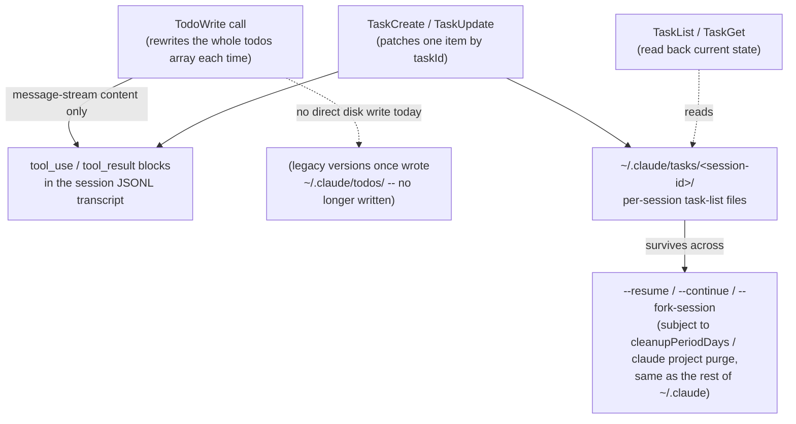
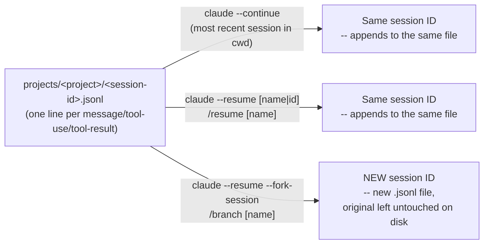
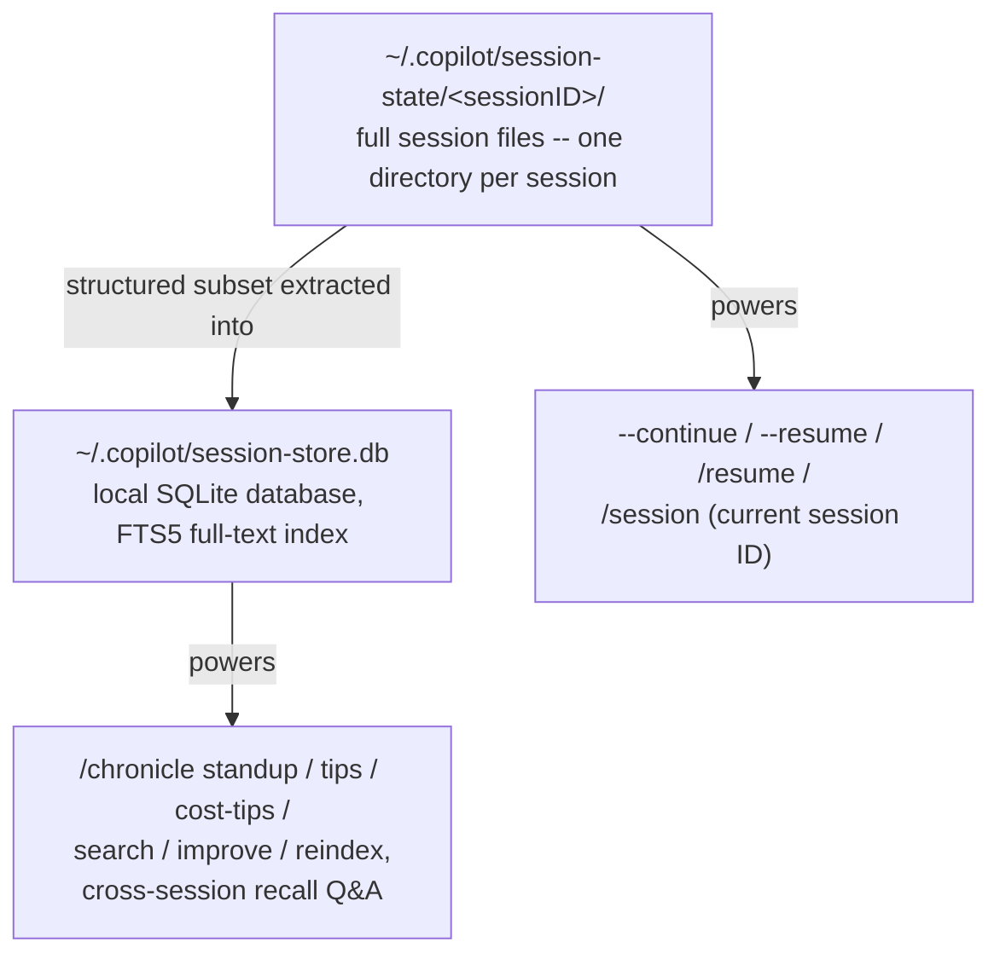
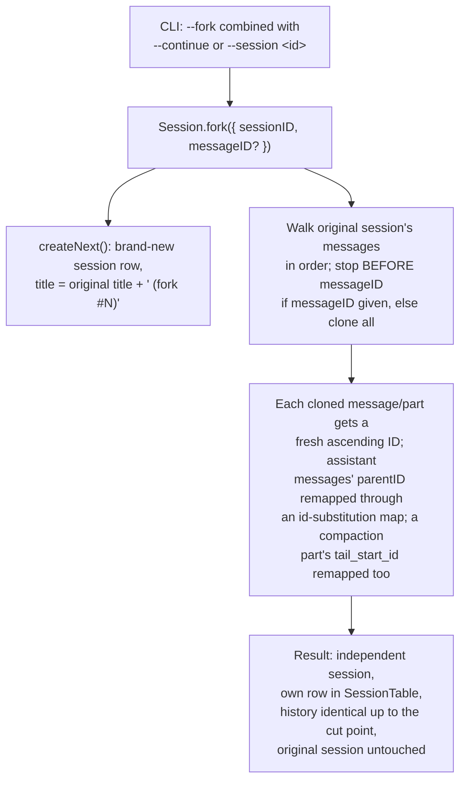
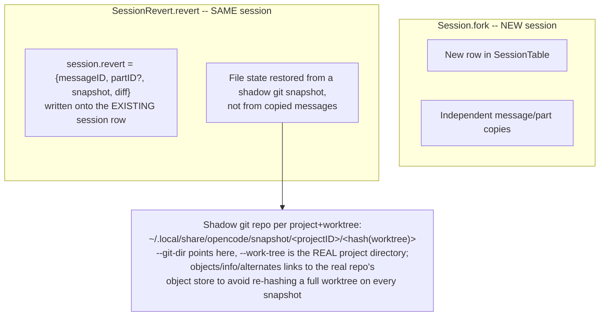

# Session & transcript persistence

**Scope note.** This page answers one specific question: once a single
agent process exits -- terminal closed, machine rebooted, `claude`/
`copilot`/`opencode` re-invoked hours or days later -- what actually
survives on disk, under what identifier, and how do you get back into
it? That is a narrower question than two pages that sit right next to
it. [memory-management.md](memory-management.md) covers what a *fresh*
session pulls back in from disk (CLAUDE.md, auto memory, Copilot
Memory) and what a compaction inside one *live, still-running* session
keeps versus discards -- durability *within* a run, not durability of
the run's own record. [handoff-mechanism.md](handoff-mechanism.md)
covers what crosses the boundary when one agent hands work to a
*different* agent instance (a subagent, a teammate, a cloud agent) --
a spawn/return relationship between two agents that may both be alive
at the same moment. This page is about neither: it is the on-disk
transcript of one session's own conversation, the identifier that
names that transcript, and the mechanics (`--resume`, `--continue`,
`--fork-session`/`/branch`, `--fork`, `revert`) for reopening, copying,
or rewinding it after the process that wrote it is long gone. All
three products keep a session-level record; the format, the store, and
what "forking" means at the storage layer differ completely.

---

## 1. Claude Code

Sources for this section: `code.claude.com/docs/en/sessions`,
`code.claude.com/docs/en/how-claude-code-works`,
`code.claude.com/docs/en/checkpointing`,
`code.claude.com/docs/en/claude-directory`, and
`github.com/anthropics/claude-code` `CHANGELOG.md`, all fetched
2026-08-01. §1.2 (added 2026-08-17) additionally draws on
`code.claude.com/docs/en/agent-sdk/todo-tracking`, a re-fetch of
`tools-reference` and `claude-directory`, and GitHub Issue #50656 --
cited inline in that subsection and in the full Sources list at the
bottom. VERIFIED unless tagged otherwise.

### 1.1 The transcript: one JSONL file per session, on disk from the first turn

"Claude Code saves your conversation locally as you work. Each message,
tool use, and result is written to a plaintext JSONL file under
`~/.claude/projects/`." The exact, documented path is
`~/.claude/projects/<project>/<session-id>.jsonl`, where `<project>` is
the working-directory path with every non-alphanumeric character
replaced by `-` -- so a project's transcripts are grouped by directory
identity, not by git remote. "Each line is a JSON object for a
message, tool use, or metadata entry." The docs are explicit that this
is a stability boundary, not an API: "The entry format is internal to
Claude Code and changes between versions, so scripts that parse these
files directly can break on any release" -- `/export` (human-readable
Markdown/plaintext) or the structured script interfaces (`claude -p
--output-format json`/`stream-json`, the `transcript_path` field
`hooks` and statusline commands receive, or the Agent SDK) are the
documented way to consume session data programmatically, not reading
the JSONL directly.

Related paths written per session, all under the same `projects/`
subtree and aging out together: `projects/<project>/<session>/subagents/`
(subagent transcripts -- see [handoff-mechanism.md](handoff-mechanism.md)
§1.2 for their own addressing scheme) and
`projects/<project>/<session>/tool-results/` (large tool outputs
spilled out of the main JSONL to keep it manageable). `file-history/<session>/`
sits alongside but is a separate mechanism (§1.5 below): pre-edit file
snapshots, not conversation content.

### 1.2 Task-tracking tool persistence: `TodoWrite` vs. the `Task*` family

This subsection updates the page with a gap `airchon-mentor` found live in a
prior conversation and flagged for `airchon-author` to research and persist,
rather than answering it in situ from an unresourced page. Sources: the
Agent SDK's `code.claude.com/docs/en/agent-sdk/todo-tracking` and
`code.claude.com/docs/en/tools-reference` (its "Task tool availability"
section specifically), both fetched fresh this session;
`code.claude.com/docs/en/claude-directory`'s "Application data" tables,
also fetched fresh this session and additionally corroborating what an
earlier fetch of this same page (§1.6 below) had already found regarding
`tasks/`; and GitHub Issue `anthropics/claude-code#50656`, fetched via
`gh api` this session including its full timeline. VERIFIED unless tagged
otherwise.

[Built-in tools](built-in-tools.md) §1.1 already names `TodoWrite` and the
`TaskCreate`/`TaskGet`/`TaskList`/`TaskUpdate`/`TaskOutput`/`TaskStop`
family as tools; this subsection covers what neither that page nor this
one's own §1.6 (written 2026-08-01, before this gap was found) previously
stated: which of them write anything to disk at all, where, and what that
means for `--resume`/`--continue`.

**`TodoWrite` writes nothing to disk on its own.** The Agent SDK's
`todo-tracking` doc describes `TodoWrite` purely as message-stream content:
"todo updates are reflected in the message stream" via `tool_use` blocks
carrying the full `todos` array on every call, and the doc's entire
monitoring-code pattern is built around watching that stream -- there is no
mention anywhere on that page of a file, directory, or storage location
`TodoWrite` writes to. This is corroborated independently, not merely
assumed from absence: the `claude-directory` doc's own "Cleaned up
automatically" table lists `todos/`, `statsig/`, and `logs/` together as
"Legacy directories from older versions. No longer written," and the
separate "what you lose if you delete it" table repeats the same three
paths with "Nothing. Legacy directories not written by current versions."
Read together, this means an *older* version of Claude Code did once
persist todo-checklist state to `~/.claude/todos/`, and current versions
have since stopped -- `TodoWrite` today really is transient message content
only, not merely under-documented disk state.

**The `Task*` family does write to disk, per-session.** The same
`claude-directory` "Cleaned up automatically" table names `tasks/`
directly: "Per-session task lists written by the task tools." This is a
documented path, not an inference. GitHub Issue #50656 (filed 2026-04-19,
titled "Task list UI not rendered after session resume") independently
names the exact same path at session granularity while describing a real
resume scenario: "Task data: persists correctly in
`~/.claude/tasks/<session-id>/`, only the UI rendering is affected." No
source fetched this session states the internal layout *within* that
per-session directory (one JSON file per task versus one combined file for
the whole list) -- treat "one JSON file per task" specifically as **BEST
CURRENT UNDERSTANDING, UNCONFIRMED**; only the per-session *directory*
path itself is documented and independently corroborated.



**Because `tasks/` is a real path under `~/.claude`, not a projection of the
transcript, it is swept and purged exactly like everything else this page
documents.** It sits in the same "Cleaned up automatically" table as
`projects/<project>/<session>.jsonl` and `file-history/<session>/`, so it
ages out under the same `cleanupPeriodDays` (default 30 days) as §1.6
below describes, and `claude project purge`'s own printed deletion plan
names it explicitly alongside `debug/` and `file-history/` entries ("Per-
session `tasks/`, `debug/`, and `file-history/` entries"). The practical
consequence for `--resume`/`--continue`: because task data lives in its
own file(s) keyed to the session ID rather than being embedded as ordinary
message content inside the session's own JSONL transcript, a resumed
session's `TaskList` reflects exactly the same on-disk state as when the
process exited -- it is not reconstructed from replaying the transcript.

**Model-availability caveat, precisely versioned.** Per
`tools-reference`'s "Task tool availability" section: "In Claude Code
v2.1.233 and later, the following tools aren't available on Opus 4.8,
Sonnet 5, Fable 5, Mythos 5, or later versions of those families unless
you opt in: `TodoWrite`, `TaskCreate`, `TaskGet`, `TaskUpdate`, and
`TaskList`" -- the documented rationale being that those specific model
families "keep track of multi-step work without a written checklist," so
Claude Code omits the tools' definitions and reminders to save context. On
any other model (the docs name Opus 4.7 as an example), Claude Code
provides the four `Task*` tools by default and `TodoWrite` only if you set
`CLAUDE_CODE_ENABLE_TASKS=0`. To opt back in on a gated model: export
`CLAUDE_CODE_ENABLE_TODO_TOOLS=1` before launch (every model and provider),
name a tool in `--allowedTools`/the Agent SDK's `allowedTools` option, or
list it in `--tools`/`tools`. Two environments bypass the model gate
entirely regardless of model: background sessions (`claude agent`-style)
and Claude Code on the web always provide the tools. This is a materially
more precise version boundary than a prior draft of this book's coverage
implied -- v2.1.142 (already cited in [Built-in tools](built-in-tools.md)
§1.1) is the version `Task*` became the *session-wide default* over
`TodoWrite`; v2.1.233 is a *separate, later* version gate that additionally
withholds the whole family, `TodoWrite` included, from specific newer
model families unless explicitly re-enabled. Do not conflate the two dates.

**A genuine naming overload worth flagging explicitly** (three related
uses of "Task," plus a fourth adjacent-but-differently-named concept),
visible directly in `tools-reference`'s own tool table: `Task` as a
prefix names three unrelated Claude Code mechanisms, not one.
`TaskCreate`/`TaskGet`/
`TaskList`/`TaskUpdate` are this subsection's checklist-tracking family.
`TaskOutput` ("Retrieves output from a background task... deprecated in
favor of `Read` on the task's output file path") and `TaskStop` ("Stops a
running background task by ID... also accepts an agent-team teammate or a
named background agent") instead control background Bash commands and
background subagents/teammates -- an entirely different referent for
"task," covered by [Built-in tools](built-in-tools.md) §1.3's Bash-
backgrounding mechanics, not by anything in this subsection. `CronCreate`/
`CronDelete`/`CronList` name a third, again-unrelated "scheduled tasks"
concept (recurring or one-shot prompts, documented at
`/docs/en/scheduled-tasks`), and §1.3 below's "what resumes" list names a
fourth adjacent-but-distinct concept, the "active goal" (turn-count/timer/
token-budget tracking, documented at `/docs/en/goal`). All four appear in
the same tools-reference table and none is a synonym for another; a
mention of "tasks" surviving a Claude Code resume needs the specific
mechanism named, not assumed from the word alone.

**A UI-rendering bug, not a data-loss bug -- and its real, checked-this-
session status.** GitHub Issue #50656 reports that after `--resume`/
`--continue`, the task-list UI panel does not visually reappear even
though the underlying `~/.claude/tasks/<session-id>/` data is present and
correct and a read-only `TaskList` call returns it accurately to the
model -- only a subsequent `TaskCreate`/`TaskUpdate` write re-triggers the
panel's render. The reporter's own root-cause theory, left in the issue
as an unverified comment rather than a maintainer-confirmed fix, is that
the panel's re-render is wired to fire on write events specifically, and
loading persisted state from disk on resume does not synthesize an
equivalent event. **Status, precisely, as of this session's fetch
(2026-08-17):** the issue is `closed` with `state_reason: not_planned` --
GitHub's stale-bot auto-closed it on 2026-05-26 for inactivity ("Closing
for now -- inactive for too long"), which is not the same as a maintainer
saying it was fixed or declining to fix it. A later comment, dated
2026-07-21, reports the bug still reproduces on Claude Code v2.1.173 and
states a changelog scan through v2.1.216 (2026-07-20) found no matching
fix, requesting the issue be reopened. As of this fetch, it remains
closed and has not been reopened. **BEST CURRENT UNDERSTANDING,
UNCONFIRMED:** whether this is fixed on the version a given reader has
installed -- the only two data points this session could find (a stale
auto-close, and one unresolved reopen request three months later) both
predate today, and no maintainer comment confirming or denying the bug's
current state was found in the timeline.

### 1.3 Session IDs and what resuming actually restores



`claude --continue` reopens "the most recent session in the current
directory"; `claude --resume` with no argument opens an interactive
session picker; `claude --resume <name>` and `/resume <name>` resolve a
name set via `--name`/`/rename` directly, falling back to the picker
(CLI) or an error (`/resume`, in-session) on an ambiguous match.
Critically, **name resolution is scoped to the current project
directory and its git worktrees** -- a session ID looked up from an
unrelated directory reports `No conversation found with session ID:
<session-id>`, and sessions created by `claude -p` or the Agent SDK
never populate the interactive picker at all, though their session ID
still resolves via `claude --resume <session-id>` run from the
directory they were started in.

What a resumed session restores, enumerated by the docs, is more
granular than "the conversation":

- **Conversation history** -- full, including every tool call and
  result.
- **Model** -- continues on the model the session was using, *unless*
  that model has since been retired, a launch-time `--model`/
  `ANTHROPIC_MODEL`-family variable overrides it, or the provider uses
  deployment IDs (Bedrock/Foundry/Google's Agent Platform).
- **Agent** -- a session launched with `--agent` or the `agent` setting
  resumes as that same agent (system prompt, tool restrictions, model),
  looked up first in the session's original directory (if trusted) and
  then the directory you resume from; if neither has it, the session
  falls back to default tools/prompt and surfaces a named warning.
- **Permission mode** -- restored, with two documented exceptions:
  `plan` and `bypassPermissions` are *never* restored (bypass must be
  re-enabled explicitly at relaunch); `auto` is restored only if the
  account still meets auto mode's requirements.
- **Active goals and unexpired scheduled tasks** -- carry over; a
  goal's turn count/timer/token baseline reset. Background Bash/monitor
  tasks do **not** resume.

**Not restored automatically:** `--mcp-config`, `--settings`,
`--plugin-dir`, `--fallback-model`, and `--add-dir` directories must all
be passed again at resume time (though `settings.json`/
`settings.local.json` are re-read fresh at every launch, so config that
lives there needs no re-passing). Directories added *mid-session* with
`/add-dir` are not restored either, though the session picker still uses
them to help locate the session.

**Resume-from-summary dialog.** On Pro/Max plans, resuming a session
inactive for roughly an hour and over 100,000 tokens opens a dialog
before your first message, because the prompt cache has expired by
then regardless of choice: **Resume from summary** runs `/compact`
immediately (one summarization request over the full history, then the
summary plus recent exchanges and up to five recently read files carry
forward); **Resume full session as-is** reprocesses and re-caches the
full history; **Don't ask me again** picks full-session and stops
showing the dialog. This is a session-*resume*-time cost decision,
distinct from the compaction survival table in
[memory-management.md](memory-management.md) §1.7, which governs what
an *in-progress* session keeps when it auto-compacts mid-run.

**Two terminals, one session, no fork:** "If you resume the same session
in two terminals without forking, messages from both interleave into
one transcript" -- there is no lock preventing this, only the
recommendation to fork if you want independent histories.

### 1.4 Branching/forking -- a genuinely new session ID, not a pointer

`/branch [name]` (optionally named; otherwise named after the first
prompt, or -- as of v2.1.198 -- after the first prompt *before* a
compaction summary rather than the literal string "Branched
conversation" that earlier versions fell back to) and, from the
command line, `claude --continue|--resume --fork-session` are the same
operation from two entry points: "Branching creates a copy of the
conversation so far and switches you into it, leaving the original
intact." The confirmation names both the new branch's session ID and
the original's; the original stays on disk, unchanged, and reachable
by its own name/ID from the picker.

The mechanically precise part is what does and doesn't carry over,
because `/branch` "copies the transcript and switches the running
Claude Code process to write to it" -- a copy-then-redirect operation
inside the same process, not a brand-new process:

| State | After `/branch` |
|---|---|
| Conversation history | Copied up to the point `/branch` ran |
| "Allow for this session" permission grants | Carried over -- same process, same in-memory grants. `--fork-session` into a **separate process** does *not* carry these; you re-approve there |
| In-flight background subagents/Bash commands | Keep running; their output lands in the new branch you switched into, not the original |

A CHANGELOG-confirmed bug and its fix show the boundary is real, not
theoretical: "Fixed fork-session lineage being lost after compaction in
headless and SDK sessions" -- i.e. the parent/fork relationship is
itself tracked state that can desync from the transcript content if
compaction and forking interleave, and this had shipped broken before
being fixed. A second entry, "Fixed `/branch` failing with 'No
conversation to branch' after entering a worktree or in some background
sessions," and a third, "Fixed `/branch` producing forks that fail with
'tool_use ids were found without tool_result blocks' when the source
session contained entries from rewound timelines," both point at the
same underlying fact: a fork is a structural copy of prior JSONL
entries, and anything that leaves those entries in an inconsistent
state (a stale `parentID` chain, an orphaned `tool_use` from a rewind)
can make the copy fail outright rather than silently degrade.

### 1.5 Checkpointing/`/rewind` -- a parallel, file-snapshot mechanism, not the transcript

Checkpoints are documented as a *distinct* system from the JSONL
transcript, tracking file edits rather than conversation content:
"Before Claude makes code changes, it also snapshots the affected
files." Every user prompt creates a checkpoint; Claude Code keeps
snapshots for "the 100 most recent checkpoints in a session," pruning
snapshot files no remaining checkpoint references (except each file's
first snapshot, kept as the VS Code extension's session-diff baseline).
`/rewind` (or `Esc Esc` at an empty prompt) opens a menu with five
actions per selected prior prompt: **Restore code and conversation**,
**Restore conversation** (code untouched), **Restore code** (history
untouched), **Summarize from/up to here** (compress without touching
files), and **Never mind**. Because "Claude Code saves checkpoints with
the conversation," `/rewind` still works after a `--resume` -- the
snapshots ride along with the JSONL transcript across the process
boundary this whole page is about.

Two limitations matter for anyone relying on this as a safety net:
checkpointing **does not track bash-driven file changes** (`rm`, `mv`,
`cp` run via the Bash tool are invisible to it -- git is the documented
remedy for those); and it **does not restore through symlinks or hard
links** -- a restore that hits a linked path skips it and reports
`Restored the code, but skipped N files`, with the skip reasons visible
in `~/.claude/debug/<session-id>.txt` under `/debug`. The docs are
explicit this is "local undo," not version control: "Checkpoints
complement but don't replace proper version control."

`/rewind` also has a documented escape hatch past `/clear`: as of
v2.1.191, if you ran `/clear` earlier in the same process, the rewind
menu gains a `/resume <session-id> (previous session)` entry at the top
that reopens the pre-`/clear` session -- available only until you exit
or resume something else.

### 1.6 Retention, storage location, and how to make it disappear

```mermaid
stateDiagram-v2
    state "Cleaned up automatically (cleanupPeriodDays, default 30)" as Auto
    state "Kept until you delete them" as Manual

    [*] --> Auto: "projects/&lt;project&gt;/&lt;session&gt;.jsonl,<br/>subagents/, tool-results/,<br/>file-history/&lt;session&gt;/, plans/, debug/"
    [*] --> Manual: "history.jsonl (prompt recall),<br/>stats-cache.json, remote-settings.json"
    Auto --> Deleted: "swept on next launch<br/>once older than cleanupPeriodDays"
    Manual --> Deleted: "only via explicit deletion or<br/>`claude project purge`"
```

Everything under `~/.claude/projects/` (transcripts, subagent
transcripts, spilled tool results) plus `file-history/<session>/`
(checkpoint snapshots), `plans/`, and per-session `debug/` logs are
swept on startup once older than `cleanupPeriodDays` (`settings.json`,
default **30 days**). By contrast `history.jsonl` (every prompt you've
typed, for up-arrow recall) and `stats-cache.json` (`/usage` totals)
are **not** covered by that sweep and persist indefinitely until
deleted by hand.

`CLAUDE_CONFIG_DIR` relocates the entire `~/.claude` tree.
`CLAUDE_CODE_SKIP_PROMPT_HISTORY` suppresses transcript and prompt-history
writes outright, in any mode; `--no-session-persistence` (with `claude
-p`) or `persistSession: false` (Agent SDK) do the same for a single
non-interactive run. `claude project purge <path>` (v2.1.124+) is the
documented, confirmable-plan deletion tool: it prints exactly which
files it will remove (transcripts and auto memory under `projects/`,
matching `tasks/`/`debug/`/`file-history/` entries, matching lines in
`history.jsonl`, the project's `~/.claude.json` entry) before asking
for confirmation, supports `--dry-run`, `-y`/`--yes`, `-i` (step through
item by item), and `--all` (purge every project, deleting
`history.jsonl` outright rather than filtering it).

**Plaintext, not encrypted at rest.** The docs state this directly:
"Transcripts and history are not encrypted at rest. OS file permissions
are the only protection. If a tool reads a `.env` file or a command
prints a credential, that value is written to
`projects/<project>/<session>.jsonl`." The three documented mitigations
are lowering `cleanupPeriodDays`, `CLAUDE_CODE_SKIP_PROMPT_HISTORY`, and
permission rules that deny reads of credential files outright.

### 1.7 A changelog-traced hardening history

Grepped the full `CHANGELOG.md` (2026-08-01) for
`session|resume|continue|fork|rewind|transcript|checkpoint`. The
pattern across dozens of entries is consistent: transcript durability
across restarts is treated by Anthropic as a correctness-critical
surface that keeps finding new edge cases, not a solved problem that
shipped once. A representative sample, each independently confirming a
mechanism this page describes:

- **Corruption resilience**: "Fixed `--resume` failing on large sessions
  when a transcript line was corrupted by an unclean shutdown -- the
  corrupt line is now skipped" and "pre-corrupted sessions are sanitized
  on load" (fixing a `no low surrogate in string` crash from a
  truncated emoji) -- both confirm the JSONL format is read
  defensively, line by line, and a single bad line does not sink the
  whole resume.
- **Malformed entries generally**: "Fixed a resumed session failing
  every turn, or crashing on resume, when its history held a malformed
  delta attachment," and "Fixed `--resume`/`--continue` and `/resume`
  failing with a TypeError when a transcript has a malformed attachment
  entry."
- **Silent-loss guards**: "Added warnings when transcript writes are
  failing (e.g. disk full) or when session saving is off due to an
  inherited environment variable, instead of losing transcripts
  silently," and later, "Fixed transcript write failures (e.g., disk
  full) being silently dropped instead of being logged" -- two separate
  fixes for the same failure class, months apart, which is itself a
  useful signal that "did my transcript actually get written" was
  historically hard to observe.
- **Fork/branch structural integrity**: the fork-after-compaction
  lineage bug and the rewound-timeline `tool_use`-without-`tool_result`
  fork failure, both cited in §1.4, plus "Fixed `/branch` rejecting
  conversations with transcripts larger than 50MB" -- a hard size
  ceiling on the fork operation that was later lifted.
- **Identity and addressing**: "Fixed `claude --resume <session-id>`
  losing the session's custom name and color set via `/rename`,"
  "Fixed `--resume`/`--continue` not finding sessions when the project
  path contains underscores," and "stdio MCP servers now receive the
  same `CLAUDE_CODE_SESSION_ID` as hooks/Bash on `--resume`" -- the last
  one matters for anyone building tooling around session identity: the
  session ID is propagated as an environment variable to MCP server
  subprocesses specifically on the resume path, not just at first
  launch.
- **Scale**: "Reduced session transcript size (up to 79x in edit-heavy
  sessions) and bounded checkpoint disk usage by pruning superseded
  file-history backups," "Fixed excessive memory usage (multiple GB)
  when resuming a session by transcript file path on machines with many
  stored sessions," and "Fixed `/usage` leaking up to ~2GB of memory on
  machines with large transcript histories" -- all confirm that
  transcript size and count are load-bearing performance variables, not
  incidental.

---

## 2. GitHub Copilot CLI

Sources for this section: `docs.github.com/en/copilot/concepts/agents/copilot-cli/chronicle`,
`docs.github.com/en/copilot/how-tos/copilot-cli/use-copilot-cli/chronicle`,
`docs.github.com/en/copilot/how-tos/copilot-cli/use-copilot-cli/overview`,
`docs.github.com/en/copilot/reference/copilot-cli-reference/cli-command-reference`,
and `github.com/github/copilot-cli` `changelog.md`, all fetched
2026-08-01. VERIFIED unless tagged otherwise. One further source,
`docs.github.com/en/copilot/how-tos/copilot-sdk/use-copilot-sdk/session-persistence`,
documents the separate Copilot SDK's `session.create`/`session.resume`
API and is cited only as adjacent background per this project's
AUTHORITY OVERREACH discipline -- flagged inline where used.

### 2.1 Two stores, not one: session files and a derived SQLite index



Per the docs, fetched directly: "Every Copilot CLI session is persisted
as a set of files in the `~/.copilot/session-state/` directory on your
machine. In addition to the session files, Copilot CLI stores structured
session data in a local SQLite database, referred to as the session
store." The relationship between the two is explicit and one-directional:
"This data is a subset of the full data stored in the session files" --
the session-state files are the durable, complete record; the SQLite
database (`~/.copilot/session-store.db`, with an FTS5 full-text index
across all indexed session content) is a derived, query-optimized
projection built *from* those files, not an independent source of
truth. "The session store is what powers the `/chronicle` slash command
and it also allows Copilot to answer questions you ask about your past
work." `/chronicle reindex` "reconstructs the database from session
files on disc" -- documented explicitly as the recovery path for
migrating sessions, recovering from corruption, or indexing sessions
that predate the store's existence, which only makes sense if the
session-state files, not the database, are the authoritative record.

This is architecturally the mirror image of what happens on
[memory-management.md](memory-management.md) §2.2's Copilot Memory: that
service is model-facing fact/preference storage reached via
`store_memory`/`vote_memory` tool calls, semantically about what Copilot
has learned, and is a *different* mechanism from the session-state/
session-store pair described here, which is about the conversation's own
durable record. Do not conflate the two: a session with Memory disabled
still gets a durable session-state directory and (per the changelog
entry below) can still be resumed.

### 2.2 Resume mechanics and session identity

`copilot --continue` "quickly resume[s] the most recently closed local
session"; `copilot --resume` (also `-r`, per changelog) opens the
session picker; `/resume` is the in-session equivalent, and `/resume
SESSION-ID` jumps directly to a specific session without opening the
picker. The session picker (CLI-reference page) supports `↑`/`↓`
navigation, `Enter` to open, `s` to cycle sort order (relevance →
created → name → last used), `Tab` to switch between local and remote
tabs, `d` to delete, `Esc` to close -- the local/remote tab split
reflects that a resumable session can be either a local session-state
directory or a session synced to GitHub's Mission Control (the same
sync surface that backs `/share`).

**Finding the current session's ID**: the `/session` slash command
prints it, and it's also shown when you exit an interactive session. A
changelog entry closes a related gap directly: "Exit message always
shows the session ID in the resume command instead of the friendly
name" -- i.e. the resume handle you're meant to copy-paste is the raw
ID, not whatever display name the session picked up.

**Resume and continue are documented as mutually exclusive** at the
flag level: "Reject `--continue` when used with `--resume`" (changelog)
-- you pick one entry point per invocation, not both. Session identity
is also explicitly tied to working directory, not just an opaque ID:
"Keep sessions tied to their working directory across prompts,
restarts, and workspace tools," and "`--continue`/`--resume` select the
most recent session for the current repository" -- a `--continue` run
from a different repository will not silently resume an unrelated
project's session.

### 2.3 The SDK's more detailed picture of what a session directory holds

`docs.github.com/en/copilot/how-tos/copilot-sdk/use-copilot-sdk/session-persistence`
documents the Copilot **SDK's** `session.create`/`session.resume` API
-- a distinct, broader product surface from the CLI, per this book's
standing AUTHORITY OVERREACH discipline, and cited here only as
background because it names the exact same directory the CLI docs use
(`~/.copilot/session-state/{sessionId}/`) with more internal structure
than any CLI-specific page states. Per that SDK page: state saved per
session includes full conversation history, cached tool-call results,
"agent planning state (`plan.md` file)," and session artefacts under a
`files/` subdirectory, with checkpoints in their own subdirectory too.
Provider/API keys and in-memory tool state are explicitly **not**
persisted -- a BYOK (bring-your-own-key) session must have its provider
config re-supplied on every `session.resume` call. Because the SDK page
names the identical `~/.copilot/session-state/{sessionId}/` path the
CLI-specific chronicle page uses for the CLI's own session files, it is
BEST CURRENT UNDERSTANDING, UNCONFIRMED (not stated on either page
directly) that the CLI's session-state directories share this same
internal `plan.md`/`files/`/checkpoints layout, since the CLI is built
on the same underlying session-persistence primitive the SDK exposes.
Treat the subdirectory names as a reasoned inference, not a
CLI-documented guarantee.

### 2.4 A changelog-traced hardening history

Grepped the full `changelog.md` (2026-08-01) for
`session|resume|continue|database|sqlite|chronicle|transcript`. As with
Claude Code, the pattern is a long tail of edge-case fixes on the same
mechanism rather than a single shipped-once feature:

- **Corruption and crash recovery**: "Recover corrupted session history
  on load," "Session resume works correctly after a crash that left
  partial data in the session log," and "Lone surrogates no longer
  break session resume or truncate prompts" -- the same defensive-read
  posture Claude Code's changelog shows for its own JSONL format,
  independently arrived at on a SQLite-plus-files store instead.
- **Performance at scale**: "Resume sessions faster by removing
  quadratic work when rebuilding the timeline," "Resume and switch large
  sessions faster," "Improve CLI responsiveness when reading and writing
  session databases," and "Keep session-store searches and context
  lookups responsive" -- confirming the session-store database is a
  live performance-sensitive subsystem, not a write-once archive.
- **Reliability of the identity/flag layer**: "Reject empty
  `--session-id=` values instead of ignoring them," "Reject empty
  `--resume=` values instead of starting a new session," "Show an error
  when `--name` is used with `--session-id` for an existing session,"
  and "Resume search matches session titles even when whitespace
  differs" -- all narrowing failure modes where a malformed or
  ambiguous identifier used to silently do the wrong thing (start fresh,
  match nothing) instead of erroring.
- **Cross-cutting state that resume must reproduce faithfully**:
  "Resumed sessions reproduce the original attached-file references even
  if those files later change on disk, avoiding prompt-cache resets,"
  and "Attached images and PDFs persist across session resume even if
  the source file is later changed or deleted" -- both point at the
  same design goal as Claude Code's model-pinning-on-resume behavior
  (§1.3): a resumed session should reproduce the *original* inputs it
  saw, not silently re-read a file that has since drifted.
- **Store maintenance surfaced to the user**: "Keep `/chronicle
  reindex` responsive and show progress in the timeline" and "Improve
  `/chronicle cost-tips` with more precise evidence-backed
  recommendations" -- the derived SQLite index (§2.1) is rebuildable and
  its rebuild cost is itself something the changelog tracks as a UX
  concern.

---

## 3. OpenCode

Sources for this section: `github.com/anomalyco/opencode`, `dev`
branch, fetched via `gh api` 2026-08-01
(`packages/opencode/src/session/session.ts`,
`packages/opencode/src/session/revert.ts`,
`packages/opencode/src/id/id.ts`,
`packages/opencode/src/storage/storage.ts`,
`packages/opencode/src/snapshot/index.ts`,
`packages/core/src/database/database.ts`,
`packages/core/src/database/path.ts`, `packages/core/src/global.ts`),
and `opencode.ai/docs/cli/`, fetched 2026-08-01. Per this book's
standing caveat, `dev` is not a stable release tag and may not match
the current stable release -- flagged inline below, and OpenCode's repo
carries no `CHANGELOG.md` (confirmed absent at repo root this session,
consistent with what every prior page in this book citing OpenCode has
found), so there is no behavior-change history to grep the way Claude
Code's and Copilot CLI's own changelogs allow for §1.7/§2.4 above.

### 3.1 A live architecture change the docs and community writeups don't reflect yet

This is worth stating carefully because it's a genuine gap between
what is easy to find about OpenCode's storage and what the current
source actually does. Community write-ups and OpenCode's own
`opencode.ai/docs/cli/` page describe (and the CLI page's own `export`/
`import` subcommands work with) session data as JSON files -- consistent
with a documented on-disk layout of
`~/.local/share/opencode/storage/session/message/<sessionID>/msg_<messageID>.json`
under the XDG data directory. That flat-file layout **is real**, but
reading `packages/opencode/src/storage/storage.ts` on `dev` shows it is
the **legacy** format: the file's own `MIGRATIONS` array contains a
migration function that walks exactly that path pattern
(`storage/session/message/*/*.json`) to move old per-project data into
a new location, and `packages/opencode/src/session/session.ts` on the
same branch does not read or write those files for session/message data
at all -- it operates on `SessionTable` and `PartTable` via Drizzle ORM
(`import { PartTable, SessionTable } from "@opencode-ai/core/session/sql"`).
Tracing that to `packages/core/src/database/database.ts` confirms the
current store is a **SQLite database**, not flat JSON files: the module
runs `PRAGMA journal_mode = WAL`, `synchronous = NORMAL`,
`busy_timeout = 5000`, `cache_size = -64000`, and `foreign_keys = ON` on
open, applies versioned migrations via `DatabaseMigration.apply`, and
resolves its file path (`database.ts`'s own `path()` function) to
`Global.Path.data/opencode.db` by default, or
`Global.Path.data/opencode-<channel>.db` on the beta/pre-release
installation channels, overridable entirely via the `OPENCODE_DB` flag
(including `:memory:` for an ephemeral, non-persistent database).
`packages/core/src/global.ts` resolves `Global.Path.data` to
`xdgData/opencode` -- `~/.local/share/opencode` on a standard Linux XDG
layout.

**BEST CURRENT UNDERSTANDING, UNCONFIRMED:** which format ships in the
version a given reader has installed depends on whether their release
predates or postdates this SQL migration; no version number or release
note documenting the cutover was found this session (no CHANGELOG.md
exists in this repo to check, per the sources note above), so treat
"session data lives in a SQLite database" as accurate for the `dev`
branch specifically, and treat any third-party writeup describing
per-message JSON files as describing the pre-migration format rather
than as wrong outright.

The flat-file `Storage` service is not dead, though -- it is still used
as a generic keyed-JSON blob store for auxiliary data that doesn't fit
the relational schema well: `revert.ts` (§3.4 below) writes computed
diff summaries via `storage.write(["session_diff", sessionID], diffs)`,
which resolves to a plain JSON file at
`<storage-dir>/session_diff/<sessionID>.json` per `storage.ts`'s own
`file()` helper (`path.join(dir, ...key) + ".json"`). So the accurate
picture on `dev` is **hybrid**: relational core data (sessions,
messages, parts) in SQLite; auxiliary, less-frequently-queried
artefacts still in flat per-key JSON files under the same storage root.

### 3.2 Session IDs are structured, sortable, and self-timestamping

`packages/opencode/src/id/id.ts` generates every ID in the system
(sessions, messages, parts, jobs, events, and more) from one shared
scheme, not a random UUID: a short type prefix (`ses_` for sessions,
`msg_` for messages, `prt_` for parts, plus `job_`, `evt_`, `per_`,
`que_`, `pty_`, `tool_`, `wrk_`) followed by a 6-byte encoding of
`(timestamp << 12) | counter` and 14 random base-62 characters. The
counter resets whenever the millisecond timestamp advances, guaranteeing
monotonic ordering for IDs minted in the same process even within a
single millisecond. Two directions are supported --
`Identifier.ascending(prefix)` and `Identifier.descending(prefix)` (the
descending variant bitwise-inverts the timestamp+counter value before
encoding it) -- so that, depending on which is used, lexicographic
string sort of the ID column directly yields chronological or
reverse-chronological order without a separate `ORDER BY created_at`.
A companion `timestamp(id)` function decodes the embedded creation time
back out of an ascending ID. This is a materially different identity
scheme from either other harness documented in this book: Claude
Code's and Copilot CLI's session IDs are opaque as far as their own
docs state; OpenCode's are self-describing and sortable by
construction, a source-level detail with no equivalent statement on
`opencode.ai/docs`.

### 3.3 Resume, from the CLI's own documented flags

Per `opencode.ai/docs/cli/`: `opencode session list` lists sessions
(`--max-count`/`-n` to limit, `--format table|json`); `opencode session
delete <sessionID>` removes one. Resume/continue at the CLI-invocation
level is a set of flags shared across `opencode run`, the TUI
invocation, and `opencode attach`: `--continue`/`-c` resumes the most
recent session; `--session <id>`/`-s <id>` continues a specific one by
ID. In the TUI itself, `/sessions` (aliased `/resume`/`/continue`, per
a separate WebSearch-sourced community reference **not independently
fetched this session, flagged as UNVERIFIED against
`opencode.ai/docs` directly**) lists and switches sessions
interactively.

### 3.4 Fork-from-message: a new session row, truncated at a specific message



This is the CLI-level `--fork` flag's implementation, read directly
from `packages/opencode/src/session/session.ts`'s `fork` function. The
call signature is `{ sessionID: SessionID; messageID?: MessageID }` --
an *optional* cutoff message. When `messageID` is omitted, every
message in the source session is cloned. When it is given, the walk
over the source session's messages (`messages({ sessionID })`, returned
in creation order because message IDs are ascending per §3.2) breaks
**before** copying any message whose ID is `>=` the given `messageID` --
i.e. `messageID` is an exclusive upper bound, not an inclusive one:
"fork from this point" keeps everything strictly earlier and drops the
named message and everything after it.

Every copied message and every one of its parts gets a brand-new
ascending ID (`MessageID.ascending()`, `PartID.ascending()`), and the
function threads an `idMap: Map<oldID, newID>` through the walk so that
an assistant message's `parentID` -- which in OpenCode's message schema
points at the user message it's replying to -- is rewritten to point at
the *cloned* parent's new ID, not the original's. One further, easy-to-
miss remap: if a cloned part has `type === "compaction"` and carries a
`tail_start_id` (the message ID a compaction summary starts covering
from, per [context-compression.md](context-compression.md)'s coverage
of OpenCode's `prune()`/`process()` pipeline), that reference is
rewritten through the same `idMap` too -- without this, a forked
session containing an old compaction boundary would point at a message
ID that no longer exists in the fork's own session. The new session's
title is generated by `getForkedTitle()`, which appends `(fork #1)` to
the original title, or increments an existing `(fork #N)` suffix on a
fork-of-a-fork.

The forked session is a **fully independent row** in `SessionTable`
from the moment `createNext()` returns -- there is no shared-storage
optimization here (unlike Claude Code's `--fork-session`, which within
one process reuses in-memory permission grants per §1.4): a fork is a
genuine, separate copy of the relevant message and part rows, addressed
by its own new session ID, from its first write.

### 3.5 Revert/unrevert: undo in place, not a fork -- and its own shadow-git snapshot store



`packages/opencode/src/session/revert.ts` implements a mechanism the
CLI/TUI expose as an undo, and it is architecturally the opposite of a
fork: `revert({ sessionID, messageID, partID? })` does **not** create a
new session. It walks the session's own messages to find the target
message (or a specific part within it), records that cut point as
`session.revert = { messageID, partID, snapshot, diff }` written onto
the **existing** session row via `sessions.setRevert(...)`, takes (or
reuses) a file-state snapshot via `Snapshot.Service.track()`, and
applies the collected `patch`-typed parts in reverse via
`snap.revert(patches)` to actually roll the working tree back. A
companion `unrevert({ sessionID })` restores the snapshot taken at
revert time, undoing the undo. A third function, `cleanup`, is the
"actually delete the reverted tail" operation: when called, it removes
every message (or every part past a given `partID` within one message)
strictly after the revert's cut point from the session's own row set --
this is the point at which a revert stops being reversible and starts
being a real, permanent truncation of that session's history.

The file-state half of a revert -- not the message rows, which live in
`SessionTable`/`PartTable` as normal -- is backed by a **shadow git
repository maintained per project and worktree**, read directly from
`packages/opencode/src/snapshot/index.ts`: its `gitdir` resolves to
`path.join(Global.Path.data, "snapshot", projectID, Hash.fast(worktree))`,
and every git operation against it is run with an explicit `--git-dir`
pointed at that snapshot directory and `--work-tree` pointed at the
*real* project directory -- i.e. it is a completely separate commit
history laid over the same working files, invisible to the project's
own `.git`. A deliberate space/performance optimization is visible in
the source: the snapshot repo's `objects/info/alternates` file is
written to point at the real repository's own object store
("Reuse the hashes for the git storage between the original repo and
snapshot ... on huge repos like chromium checkout the git add --all
rebuilding the [index] is expensive"), so unchanged blobs are shared by
reference rather than re-hashed and re-stored on every snapshot. This
is OpenCode's structural equivalent of Claude Code's checkpoint file
snapshots (§1.5) -- both exist to let a rewind-style undo restore file
state independent of git commits the user makes -- but where Claude
Code stores raw pre-edit file copies under `file-history/<session>/`,
OpenCode reuses git's own object model as the snapshot substrate.

**BEST CURRENT UNDERSTANDING, UNCONFIRMED:** no `opencode.ai/docs` page
fetched this session documents `revert`/`unrevert`/the shadow-git
snapshot mechanism in end-user terms (a TUI keybind or slash command
name for it was not confirmed against the docs site directly) -- this
entire subsection is source-level knowledge from the `dev` branch, not
corroborated by an OpenCode docs page the way Claude Code's
`/rewind` is documented on `code.claude.com`.

---

## 4. Synthesis

| Dimension | Claude Code | Copilot CLI | OpenCode |
|---|---|---|---|
| Durable record format | Plaintext JSONL, one line per message/tool-use/tool-result | Session-state files (format undocumented) + a derived SQLite index (`session-store.db`, FTS5) | SQLite database (`opencode.db`, Drizzle ORM, WAL mode) on `dev`; legacy per-message JSON files superseded but still the format some community writeups describe |
| Location | `~/.claude/projects/<project>/<session-id>.jsonl` | `~/.copilot/session-state/<sessionID>/`, index at `~/.copilot/session-store.db` | `<xdgData>/opencode/opencode.db` (e.g. `~/.local/share/opencode/opencode.db`), path overridable via `OPENCODE_DB` |
| Session ID character | Opaque per the docs; propagated to MCP subprocesses as `CLAUDE_CODE_SESSION_ID` on resume | Opaque per the docs; printed by `/session` and on exit | Structured: `ses_` + embedded timestamp+counter + random suffix, ascending or descending, self-timestamping via `Identifier.timestamp()` |
| Resume same identity | `--continue` (most recent in cwd), `--resume [name\|id]`, `/resume` -- same session ID, appends | `--continue`/`-r --resume`, `/resume [SESSION-ID]` -- mutually exclusive `--continue`/`--resume` flags | `--continue`/`-c`, `--session <id>`/`-s <id>` |
| Fork/branch semantics | `/branch [name]` or `--fork-session` -- copy-then-redirect in the *same process* if via `/branch` (permission grants carry over); a genuinely new process via CLI flag does not carry them | Not documented as a first-class fork/branch operation on the pages fetched this session | `--fork` + `--continue`/`--session`, backed by `Session.fork({sessionID, messageID?})` -- always a brand-new, fully independent `SessionTable` row from the first write, with an optional exclusive message cutoff |
| Fork-from-a-specific-point | `/branch` forks at "now" (point in the live conversation), not an arbitrary earlier message | Not found | `Session.fork`'s `messageID` parameter is exactly this: fork truncated at an arbitrary earlier message, source-verified |
| In-session undo/rewind (not a new session) | `/rewind` -- file snapshots under `file-history/<session>/`, five restore modes, rides along across `--resume` | Not found as a distinct mechanism on the pages fetched | `SessionRevert.revert`/`unrevert` -- `session.revert` pointer on the existing row, file state restored via a shadow git repo (`snapshot/<projectID>/<hash>`) sharing object storage with the real repo |
| Retention/cleanup | `cleanupPeriodDays` (default 30, `settings.json`), swept on startup; `claude project purge` for explicit, previewable deletion | Not found documented on the pages fetched this session | Not found documented; SQLite DB has no stated retention policy on `dev` |
| Plaintext/at-rest security note | Explicitly documented as unencrypted; OS file permissions only | Not addressed on the pages fetched | Not addressed in the source read this session |
| Behavior-change history available | `CHANGELOG.md` -- extensive, session/resume/fork/transcript entries span the full file | `changelog.md` -- extensive, same pattern | None -- no `CHANGELOG.md` in the repo; `dev`-branch source is the only trace of change over time available to this project |

**The design lesson.** All three products treat "can I get back into
this conversation after the process exits" as a first-class,
heavily-hardened feature rather than an afterthought -- both Claude
Code's and Copilot CLI's own changelogs show a long, ongoing tail of
corruption-recovery and identity-resolution fixes on exactly this
mechanism, which is itself evidence of how much real-world edge-case
pressure a session-durability layer receives once it ships. Where they
diverge sharply is the *shape* of "forking": Claude Code's `/branch`
forks the *live, running conversation at the current instant*, and
does so cheaply when it can stay in one process (reusing in-memory
permission state); OpenCode's `Session.fork` forks a *stored session at
an arbitrary earlier message*, which is a strictly more general
operation the CLI turns into a flag combination (`--fork` plus
`--session <id>`) rather than an in-conversation command, and pays for
that generality by always producing a fully independent row rather than
a same-process shortcut. Copilot CLI's own documentation, of the three,
says the least about fork/branch mechanics specifically, while saying
the most about the *relationship between two different stores*
(complete session-state files versus a derived, rebuildable SQLite
index) -- a distinction neither other harness's docs draw as sharply,
because neither documents a comparable derived-index layer sitting on
top of its primary transcript store. A workflow that needs
"reproducibly resume exactly this session" can rely on all three; one
that needs "branch off an arbitrary earlier point in a session that's
no longer running" is a documented, first-class operation only on
OpenCode.

---

## Sources

Fetched 2026-08-01 unless dated 2026-08-17 below (the §1.2 task-tracking-
persistence research added that date).

**Claude Code (authoritative for Claude Code's documented behavior only):**
- `https://code.claude.com/docs/en/sessions` -- session storage model,
  `--continue`/`--resume`/`--fork-session`/`/branch` mechanics, what a
  resumed session restores/doesn't (including the "Active goal" and
  "Scheduled tasks" resume-carryover lines re-verified 2026-08-17 for
  §1.2's naming-overload point), resume-from-summary dialog, session
  picker shortcuts, naming, JSONL transcript path and format-stability
  warning, export/script interfaces, retention/location config table.
- `https://code.claude.com/docs/en/how-claude-code-works` -- session
  independence statement, `~/.claude/projects/` JSONL summary, rewind/
  resume/fork cross-reference.
- `https://code.claude.com/docs/en/checkpointing` -- `/rewind` menu
  actions, automatic checkpoint tracking, 100-checkpoint retention,
  bash/symlink/external-change limitations, rewind-past-`/clear`.
- `https://code.claude.com/docs/en/claude-directory` -- full application-data
  table (`cleanupPeriodDays`-swept paths vs. kept-indefinitely paths),
  plaintext-storage security note, `claude project purge` mechanics and
  examples; re-fetched 2026-08-17 specifically for §1.2's `tasks/`
  ("Per-session task lists written by the task tools") and `todos/`
  ("Legacy directory from older versions. No longer written") table rows.
- `https://code.claude.com/docs/en/agent-sdk/todo-tracking` -- fetched
  2026-08-17 for §1.2: `TodoWrite`'s message-stream-only framing, the
  `TodoWrite`-to-`Task*` migration table (`taskId`-keyed patches vs.
  whole-array rewrites), the `CLAUDE_CODE_ENABLE_TODO_TOOLS`/
  `CLAUDE_CODE_ENABLE_TASKS` opt-in/opt-out environment variables.
- `https://code.claude.com/docs/en/tools-reference` -- its "Task tool
  availability" section specifically re-fetched 2026-08-17 for §1.2's
  precise v2.1.233 model-gating boundary (Opus 4.8/Sonnet 5/Fable 5/
  Mythos 5 and later versions of those families), and its full tool
  table re-checked the same date for the `TaskCreate`/`TaskGet`/
  `TaskList`/`TaskUpdate` vs. `TaskOutput`/`TaskStop` vs. `CronCreate`/
  `CronDelete`/`CronList` three-way "Task" naming-overload point.
- `https://github.com/anthropics/claude-code` issue #50656 (via `gh api
  repos/anthropics/claude-code/issues/50656` and its `/timeline`,
  fetched 2026-08-17) -- §1.2's task-list-UI-panel-not-re-rendering-on-
  resume report, its `~/.claude/tasks/<session-id>/` path corroboration,
  and its full closure history (stale-bot auto-close with
  `state_reason: not_planned` on 2026-05-26, a 2026-07-21 comment
  reporting continued reproduction on v2.1.173 with no fix found through
  a changelog scan to v2.1.216, unreopened as of this fetch). Authoritative
  for this repo's own reported-behavior Issues, not for any underlying
  implementation.
- `https://github.com/anthropics/claude-code` `CHANGELOG.md` (via `gh api
  repos/anthropics/claude-code/contents/CHANGELOG.md`) -- the full
  hardening history cited in §1.4 and §1.7: fork-after-compaction
  lineage loss, malformed-transcript-entry crashes, corrupted-line
  skipping, transcript-write-failure warnings, 50MB fork-size limit and
  its removal, `CLAUDE_CODE_SESSION_ID` propagation to MCP servers on
  resume, transcript-size and memory-usage reductions. Authoritative
  for its own behavior-change history; this repo ships no implementation
  source.

**GitHub Copilot CLI (authoritative for Copilot CLI's documented behavior only):**
- `https://docs.github.com/en/copilot/concepts/agents/copilot-cli/chronicle` --
  the `~/.copilot/session-state/` vs. `~/.copilot/session-store.db`
  (SQLite, FTS5) architecture, the explicit "subset of the full data"
  relationship, `/chronicle reindex` as the from-files rebuild path.
- `https://docs.github.com/en/copilot/how-tos/copilot-cli/use-copilot-cli/chronicle` --
  `/chronicle` subcommands (`standup`, `tips`, `cost tips`, `search`,
  `improve`, `reindex`), `/session` for the current session ID,
  `/resume`/`/resume SESSION-ID`, `/rename`, `/share`/`/export`,
  cross-session recall framing.
- `https://docs.github.com/en/copilot/how-tos/copilot-cli/use-copilot-cli/overview` --
  `--continue`/`--resume`/`/resume` definitions, cross-environment
  session portability framing (local ↔ cloud agent).
- `https://docs.github.com/en/copilot/reference/copilot-cli-reference/cli-command-reference` --
  session-picker keyboard shortcuts (sort cycling, local/remote tabs,
  delete), `COPILOT_HOME` override.
- `https://docs.github.com/en/copilot/how-tos/copilot-sdk/use-copilot-sdk/session-persistence` --
  the Copilot **SDK's** `session.create`/`session.resume`, the
  `plan.md`/`files/`/checkpoints internal structure under
  `~/.copilot/session-state/{sessionId}/`, BYOK re-supply requirement.
  A different, broader product surface than the CLI specifically --
  cited only as background per this project's AUTHORITY OVERREACH
  discipline, never as proof of CLI-internal behavior beyond what the
  CLI's own pages state.
- `https://github.com/github/copilot-cli` `changelog.md` (via `gh api
  repos/github/copilot-cli/contents/changelog.md`) -- corruption/crash
  recovery entries, quadratic-timeline and large-session performance
  fixes, `--session-id`/`--resume`/`--name` flag-validation hardening,
  attached-file/image persistence-across-resume guarantees, `/chronicle
  reindex` responsiveness. Authoritative for its own behavior-change
  history; this repo ships no implementation source.

**OpenCode (authoritative for OpenCode's documented behavior AND, uniquely
among the three, its own real implementation):**
- `https://opencode.ai/docs/cli/` -- `opencode session list`/`delete`,
  `--continue`/`-c`, `--session`/`-s`, `--fork` flag combination.
- `https://github.com/anomalyco/opencode`, `dev` branch, via `gh api` --
  `packages/opencode/src/session/session.ts` (`fork` function: message
  walk with an exclusive `messageID` cutoff, ID remapping via `idMap`,
  `parentID`/`tail_start_id` rewriting, `getForkedTitle`); `packages/opencode/src/session/revert.ts`
  (`SessionRevert.revert`/`unrevert`/`cleanup`, the `session.revert`
  pointer written onto the existing session row); `packages/opencode/src/id/id.ts`
  (the `ses_`/`msg_`/`prt_`-prefixed, timestamp+counter+random,
  ascending/descending ID scheme and `timestamp()` decoder);
  `packages/opencode/src/storage/storage.ts` (the legacy flat-JSON
  `Storage` service, its `MIGRATIONS` array walking the old
  `storage/session/message/*/*.json` layout, still used for auxiliary
  keyed blobs like `session_diff`); `packages/opencode/src/snapshot/index.ts`
  (the shadow-git snapshot repo, `--git-dir`/`--work-tree` split,
  `objects/info/alternates` object-store sharing); `packages/core/src/database/database.ts`
  and `packages/core/src/database/path.ts` (the SQLite database itself:
  WAL mode, pragma tuning, migration application, `opencode.db`/
  `opencode-<channel>.db` path resolution, `OPENCODE_DB` override);
  `packages/core/src/global.ts` (`Global.Path.data` resolving to
  `xdgData/opencode`). Standing caveat: `dev` is not a stable release
  tag and may not match the current stable release -- flagged explicitly
  in §3.1 where the JSON-to-SQL migration timing is unconfirmed, and
  again in §3.5 where the revert/unrevert mechanism itself was not found
  documented on `opencode.ai/docs`. OpenCode's repository carries no
  `CHANGELOG.md` (confirmed absent at repo root this session), so no
  behavior-change history equivalent to §1.7/§2.4 could be produced for
  this section.
