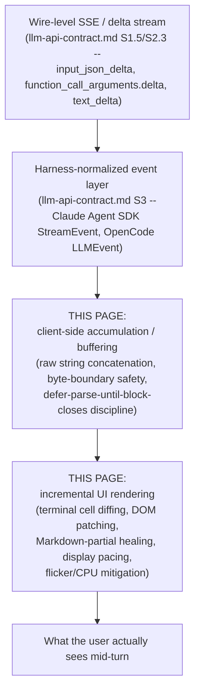
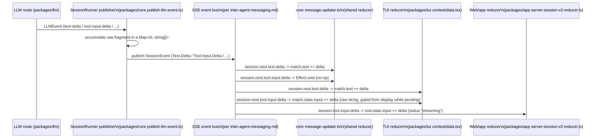
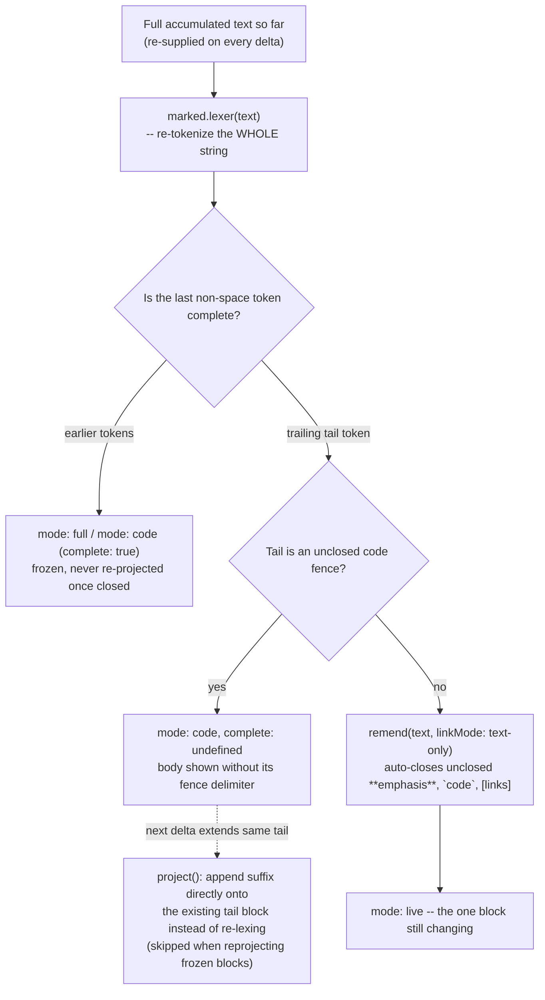
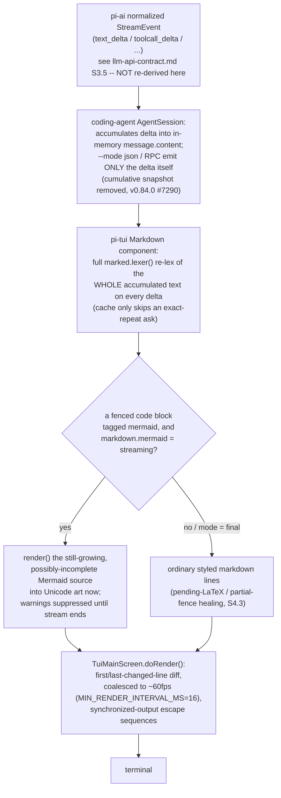
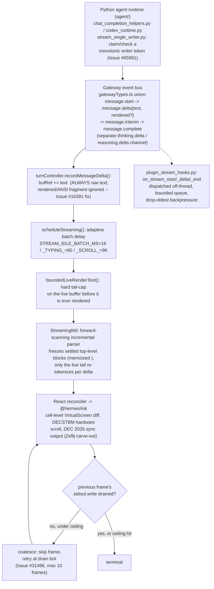

# Streaming & incremental rendering -- parsing and displaying a turn as it arrives

**Scope note.** [llm-api-contract.md](llm-api-contract.md) already grounds the
wire-level layer this page sits on top of: the Anthropic Messages API's SSE
event sequence (`message_start` -> `content_block_start`/`content_block_delta`/
`content_block_stop` -> `message_delta` -> `message_stop`), its
`input_json_delta`/`thinking_delta`/`signature_delta` fragment types (§1.5),
OpenAI's Responses API analogue (`response.function_call_arguments.delta`/
`.done`, §2.3), and, in its own §3.1-§3.3, how each harness's SDK-or-source
layer first receives that raw event stream (Claude Code's
`StreamEvent`/`SDKPartialAssistantMessage` wrapper; OpenCode's normalized
`LLMEvent` tagged union with its `tool-input-delta`/`text-delta` vocabulary).
This page does not re-derive any of that -- it picks up exactly where
llm-api-contract.md's §3 leaves off, one layer higher: what a harness's own
**client/UI side** actually does, turn by turn, with a stream it has already
received in that normalized shape. Concretely: how a partial `tool_use`
argument string is buffered before anyone tries to make sense of it, whether
and how a UI attempts to reassemble or display that partial JSON before it is
complete, how streamed text gets pushed to a terminal or browser DOM without
either flickering, burning CPU, or misrendering half-finished Markdown, and
how a client tells the difference between "the network delivered this slowly"
and "the model generated this slowly" when deciding how fast to reveal it on
screen.

Every claim below is tagged VERIFIED (fetched or read from source this
session, source named) or BEST CURRENT UNDERSTANDING, UNCONFIRMED. Claude Code
and GitHub Copilot CLI are both closed source -- this book's standing caveat
applies again here (see [retries.md](retries.md) §2.1,
[context-compression.md](context-compression.md) §2,
[caching.md](caching.md) §2, [llm-api-contract.md](llm-api-contract.md) §3.2
for the identical pattern on other topics): their own `CHANGELOG.md`s are read
as a *history of shipped behavior*, not as a specification, and are
authoritative for that behavior-change history only, never for an internal
implementation neither repository ships. OpenCode, by contrast, is fully
source-inspectable on this exact topic, and its `dev`-branch source (not a
stable release tag, per this project's standing flag) turned out to hold the
most precise, mechanism-level answers found anywhere in this book to the
handoff's original question -- "parsing partial tool-calls out of a token
stream and rendering deltas to the UI as they arrive" is, for OpenCode,
traceable line by line.



---

## 1. Claude Code

VERIFIED, `code.claude.com/docs/en/cli-reference`, fetched fresh this
session -- authoritative for the CLI's own documented headless output
formats. The `-p`/print-mode `--output-format` flag takes three documented
values: `text` (default human-readable), `json` (one structured object after
completion), and `stream-json` (incremental JSON events emitted as the agent
works). `stream-json` on its own emits tool-use/tool-result blocks (including
subagent ones) by default; `--include-partial-messages` additionally emits
the raw per-token `StreamEvent`/`SDKPartialAssistantMessage` wrapper
llm-api-contract.md §3.1 already documents in full (the raw
`content_block_delta` events, unmodified, plus `uuid`/`session_id`/
`parent_tool_use_id`); `--include-hook-events` adds hook lifecycle events
beyond the always-present `SessionStart`/`Setup`; and
`--forward-subagent-text` (from Claude Code v2.1.211 onward, per the same
docs) causes subagent text and thinking to appear as `assistant`/`user`
messages tagged with a `parent_tool_use_id` keyed by the spawning `Agent`
`tool_use` id -- v2.1.219 further added nested-subagent forwarding at
depth-2+ under the same flag (VERIFIED,
`github.com/anthropics/claude-code` `CHANGELOG.md`, fetched fresh this
session via `gh api repos/anthropics/claude-code/contents/CHANGELOG.md`, full
5,248-line file grepped for `stream|render|flicker|incremental|partial|
markdown|throttl|debounc|scroll` and read in context; all version numbers
below cite that same file). The docs do not describe how the *interactive*
terminal UI renders these deltas internally -- that half of the picture is
reconstructed below from the changelog's own multi-year record of shipped
fixes, which is a real, dated history of a genuinely hard problem, not a
specification of the mechanism.

### 1.1 A changelog-traced history of getting streamed text onto a terminal without it flickering or stalling

The earliest form of the problem the changelog documents is delivery *cadence*
itself: v2.1.78 shipped "Response text now streams line-by-line as it's
generated" (previously implied waiting for buffered chunks), and v2.1.81
almost immediately **disabled** that same line-by-line streaming specifically
on Windows (including WSL under Windows Terminal) "due to rendering issues"
-- i.e. the very first fix for the general problem this page is about
introduced a platform-specific regression serious enough to need its own
carve-out, which is itself informative: incremental terminal rendering is not
portable-by-default even once the wire-level delta stream itself works
correctly. v2.1.181 later refined the same mechanism ("Improved streaming of
long paragraphs: text now appears line-by-line instead of waiting for the
first line break"), showing the reveal granularity itself was tuned more than
once.

A second, independent axis is **render cost under sustained streaming**.
v2.1.169 "Reduced CPU usage while responses stream and during spinner
animations"; v2.1.191 went further and gave a concrete number: "Reduced CPU
usage during streaming responses by ~37% by **coalescing text updates to
100ms**" -- i.e. multiple deltas arriving inside a 100ms window are merged
into a single UI update rather than triggering one render pass per SSE event;
v2.1.196 layered "Reduced per-frame rendering work in the terminal UI by
skipping no-op subtree walks during streaming" on top of that same coalescing
discipline. v2.1.157 separately "eliminat[ed] redundant message-rendering
recomputations" for long conversations, and v2.1.172 removed "redundant
message normalization" and avoided "full message-history transforms when
streaming tool-use state is unchanged" -- naming the specific failure mode
being fixed (re-deriving the *entire* conversation's rendered state on every
single delta, rather than updating only the one message/block a given delta
actually touched).

A third axis is **terminal-level flicker**, which the changelog treats as a
distinct problem from CPU cost. v2.1.200 "Fixed rendering flicker under tmux
3.4+ by enabling synchronized terminal output" -- a reference to the terminal
synchronized-output escape-sequence convention (begin-update/end-update
markers a terminal emulator can use to buffer a whole redraw and swap it in
atomically rather than painting it incrementally and visibly). The same
synchronized-output mechanism recurs across at least three more dated
fixes for different terminal emulators (JetBrains IDEs' 2026.1+ terminals,
per an entry not tied to a single version number below the coalescing
entries; Cygwin/mintty stutter; and a garbled-startup fix in
`macOS Terminal.app` "and other terminals that don't support synchronized
output," which required detecting the *absence* of the capability and
falling back). v2.1.89 introduced a named, user-facing escape hatch for this
whole problem class: `CLAUDE_CODE_NO_FLICKER=1`, described as opting into
"flicker-free alt-screen rendering with virtualized scrollback" -- i.e. a
mode that both avoids flicker *and* only keeps the currently-visible window
of the transcript materialized in memory/DOM rather than the whole history,
a virtualization strategy distinct from, but complementary to, the
coalescing-and-diffing work above. v2.1.110 then promoted a related mechanism
to a first-class, named feature: `/tui` command and `tui` setting, "run
`/tui fullscreen` to switch to flicker-free rendering in the same
conversation" -- i.e. by v2.1.110 there were, per the changelog's own
language, two distinct opt-in renderer paths (`NO_FLICKER` and `/tui
fullscreen`) addressing the same flicker/virtualization problem via what read
as separate implementations, each independently receiving its own later bug
fixes (e.g. `NO_FLICKER`-specific memory leaks in v2.1.101's block "a
`NO_FLICKER` mode memory leak where API retries left stale streaming state,"
and `/tui`-specific scroll/dialog fixes in later versions) -- BEST CURRENT
UNDERSTANDING, UNCONFIRMED that these ever fully merged into one code path,
since the changelog itself never states that explicitly, only that both
continued to receive parallel maintenance.

A fourth axis is the **layout engine underneath the renderer**. v2.1.161
"Improved terminal rendering performance by stabilizing the layout engine's
JIT compilation profile," and v2.1.85 "Improved scroll performance with large
transcripts by replacing WASM yoga-layout with a pure TypeScript
implementation" -- both entries confirm, as real shipped facts (not
speculation), that Claude Code's terminal renderer is built on a Flexbox-style
layout algorithm (Yoga is Meta's cross-platform Flexbox implementation,
historically shipped as a WASM module in several JS UI toolkits) that was
originally used via its WASM build and was later replaced with a pure-TS
reimplementation specifically to fix a scroll-performance regression on large
transcripts -- i.e. the cost of laying out a growing, streaming transcript
was, at one point, dominated by WASM boundary-crossing or JIT-warmup cost
rather than by the terminal-write cost itself. v2.1.174 separately made a
"cell-based terminal renderer... enabled for all users by default," naming a
distinct rendering strategy (diffing at the level of individual terminal
cells rather than lines or whole frames) as the eventual default, consistent
with -- though the changelog does not explicitly connect it to -- the
flicker/CPU fixes above.

A community reverse-engineering effort (`claude-harness.dev`,
`claude-code-from-source.com`, and similar third-party write-ups surfaced via
`WebSearch` this session) describes Claude Code's renderer as originally
forked from the Ink terminal-UI library (a React-reconciler-based framework)
and since rewritten well beyond it, citing details like packed typed-array
cell buffers, double-buffered diffing, and an `<Static>`-component-style
freeze-once-rendered optimization. **This is explicitly not a source this
book treats as grounding** -- none of `code.claude.com/docs`,
`github.com/anthropics/claude-code`'s own README/CHANGELOG, or any other
authoritative source in this book's list documents Claude Code's internal
renderer implementation, and the repository itself ships no implementation
source to check it against (the same standing limitation
llm-api-contract.md §3.1 and every other page touching Claude Code's
internals notes). It is named here only as an unverified lead, consistent
with WebSearch's role in this book's sourcing discipline, and only because it
is independently *plausible* given the CHANGELOG's own references to a
"layout engine," "cell-based renderer," and Yoga -- all vocabulary consistent
with (but not proof of) an Ink-derived stack. Treat every specific technical
claim in that paragraph as BEST CURRENT UNDERSTANDING, UNCONFIRMED at best,
and more honestly as an unconfirmed community claim this page declines to
adopt as fact.

### 1.2 Reassembling partial tool-call JSON: concrete failure modes the changelog fixed

Beyond the rendering-performance axis, the changelog also documents specific,
dated bugs in the **reassembly** step llm-api-contract.md §1.5 names in the
abstract (accumulate `input_json_delta` fragments, parse only once
`content_block_stop` arrives). v2.1.92: "Fixed tool input validation failures
when streaming emits array/object fields as JSON-encoded strings" -- a real,
shipped bug in which a tool's arguments contained a field whose value was
itself a JSON-encoded string (rather than a nested object/array), and the
accumulate-then-parse-then-validate pipeline mishandled that shape until
fixed. v2.1.94 fixed two adjacent problems in the same neighborhood: "Fixed
CJK and other multibyte text being corrupted with U+FFFD in stream-json
input/output when chunk boundaries split a UTF-8 sequence" -- confirming that
Claude Code's own stream-json reassembly, at some point, buffered and decoded
network chunks as text *before* guaranteeing a chunk boundary never fell
mid-codepoint, a byte-level buffering bug one layer below the JSON-string
accumulation problem llm-api-contract.md documents -- and "Fixed SDK/print
mode not preserving the partial assistant response in conversation history
when interrupted mid-stream," a data-loss bug in exactly the
already-completed-content-blocks-survive-an-interruption mechanism
llm-api-contract.md §1.5 documents Anthropic's own docs describing at the API
level. v2.1.90 separately fixed a pure performance defect in the transport
itself: "Improved performance: SSE transport now handles large streamed
frames in linear time (was quadratic)" -- i.e. for some period, Claude Code's
own SSE-frame-handling code re-scanned or re-copied an accumulating buffer on
every incoming frame rather than appending in place, a classic
accumulation-strategy bug distinct from anything at the JSON-parsing layer.

### 1.3 Synthesis for Claude Code

Read end to end, the changelog describes a renderer under sustained,
multi-version engineering pressure from at least three independent
directions at once: (1) making the *reveal cadence* of streamed text feel
natural rather than chunk-jumpy (line-by-line granularity, later refined,
platform-gated); (2) keeping *CPU and render-pass cost* bounded as delta
volume grows (100ms coalescing, no-op subtree-walk skipping, redundant
recomputation elimination); and (3) keeping the *terminal itself* from
visibly tearing or flickering while all of the above happens (synchronized
output escape sequences, a dedicated `NO_FLICKER` mode, a separate `/tui
fullscreen` renderer, virtualized scrollback, a swapped-out layout engine).
None of these three problems is the same as the JSON-reassembly problem
llm-api-contract.md already grounds at the wire level, and the changelog
shows genuine, dated bugs in that reassembly step too (§1.2) independent of
the rendering-performance history (§1.1) -- i.e. Claude Code's engineering
history treats "get the bytes right" and "make the redraw not hurt" as two
separate, both-real problem classes, which is itself the clearest evidence
available (short of source access) that this page's topic is a genuinely
distinct layer from llm-api-contract.md's, not a restatement of it.

---

## 2. GitHub Copilot CLI

Copilot CLI is closed source; the same standing caveat applies as everywhere
else in this book. Two kinds of source were checked this session: the CLI's
own `changelog.md` (VERIFIED, `github.com/github/copilot-cli`, fetched fresh
via `gh api repos/github/copilot-cli/contents/changelog.md`, full 2,898-line
file grepped identically to Claude Code's above; version numbers below cite
that file directly), and the adjacent, explicitly-bounded Copilot SDK's own
documented streaming-events model (a different product from the CLI itself,
same adjacent-surface caveat this book applies to the SDK everywhere else --
see [orchestration.md](orchestration.md)'s Fleet-mode citation and
[llm-api-contract.md](llm-api-contract.md) §3.2's `ProviderConfig`/`wireApi`
citation for the identical pattern). Three official docs pages were checked
directly for CLI-specific streaming/rendering documentation and returned
nothing: `docs.github.com/en/copilot/reference/copilot-cli-reference/
cli-programmatic-reference`, `cli-command-reference`, and
`docs.github.com/en/copilot/how-tos/copilot-cli/use-copilot-cli/overview`
(all fetched fresh this session) -- none document a `--stream` flag,
streaming protocol, or terminal-rendering behavior, confirming the changelog
is, again, the only available window onto this behavior.

### 2.1 Token-by-token streaming, its default, and its off switch

v0.0.348 (2025-10-21) is the changelog's own origin point: "Copilot's output
now streams in token-by-token! This can be disabled with `--stream off`" --
i.e. token-by-token display became the default in that release, with a
documented, still-referenced-today opt-out flag (later changelog entries
through at least v1.0.something continue to reference `-p --stream off` as a
live, buffered-output mode with its own distinct rendering rules, e.g. a
v1.0-era fix for "Nested markdown lists render correctly in buffered output
(`-p --stream off` and detail screens)" -- confirming buffered and streamed
output are genuinely two different code paths with independently-maintained
Markdown-rendering logic, not the same renderer fed at different speeds).
The very next release, v0.0.349 (2025-10-22), fixed a bug directly in the
new streaming path's boundary with the model itself: "Fixed a bug where
every streamed output chunk was sent back to the model as part of the
conversation" -- i.e. for one release, the CLI's own display-side delta
stream leaked into the conversation-history payload sent on the *next*
request, duplicating content the model had already produced back into its
own context. This is a distinct, concrete instance of the same general
category of bug llm-api-contract.md's Claude Code coverage names abstractly
(confusing a display-only delta representation with the durable message
content that belongs in history) -- confirmed here as a real, shipped, and
fixed Copilot CLI bug rather than a hypothetical risk.

### 2.2 Flicker, spinner cost, and shell-output tailing

v1.0.66 (2026-06-30) shipped "Skip synchronized output under tmux to avoid
mouse pointer flicker" -- the same synchronized-terminal-output escape-code
mechanism Claude Code's changelog names (§1.1), here fixed in the opposite
direction: Copilot CLI found a case where *using* synchronized output caused
a flicker regression specifically for mouse-pointer rendering under tmux, and
the fix was to skip it rather than to adopt it, a useful reminder that this
mechanism is not a strict win in every terminal/multiplexer combination. The
same release also "Render[ed] the timeline as a compact 'highlight reel' with
single-line tool and reasoning rows for all users" -- a default rendering-
density change distinct from the flicker fix but shipped in the same version.
v1.0.13 (2026-03-30, repeated verbatim in v1.0.14) reads "Reduce CPU usage
during streaming by optimizing spinner rendering and task polling" -- the
same CPU-during-streaming concern Claude Code's v2.1.169/v2.1.191 address,
here attributed specifically to spinner-animation cost and a polling loop
rather than to text-diffing cost. v1.0.19 (2026-04-06) added an
OpenTelemetry-visible metric directly measuring the user-facing consequence
of all of this work: chat spans now carry a `github.copilot.time_to_first_chunk`
attribute, explicitly scoped "(streaming only)" -- i.e. Copilot CLI
instruments and exposes the exact latency this whole rendering pipeline is
trying to minimize the *perception* of, as a real observability signal
rather than only a qualitative changelog claim. v1.0.20 (2026-04-07) followed
immediately with "Reduce UI sluggishness during live response streaming."
v1.0.6 (2026-03-16) separately targeted memory rather than CPU: "Improve
streaming and tool-output memory usage."

A concrete, real-world-reported example of incremental *tool-output*
rendering specifically (as opposed to model-text rendering) comes from
GitHub Issue #1127, "Streaming output for long-running commands" (VERIFIED,
fetched via `gh issue view 1127 -R github/copilot-cli` this session): a user
reported that long-running shell commands (builds, test suites) gave "no
visibility into progress" until completion, proposing an automatic
tail-the-output mechanism. A maintainer comment closing the issue states
plainly: "This was fixed in v0.0.348. The CLI now streams incremental output
for running shell commands in the timeline automatically, without manual
polling." Note the shared version number with §2.1's token-by-token text
default -- v0.0.348 appears to have been the release that generalized
"stream deltas into the visible timeline as they occur" across both model
text *and* shell-tool stdout/stderr in the same pass, rather than treating
them as unrelated features shipped separately.

### 2.3 Adjacent-surface citation: the Copilot SDK's own streaming-events model

VERIFIED, `docs.github.com/en/copilot/how-tos/copilot-sdk/features/
streaming-events`, fetched fresh this session -- **the Copilot SDK, not
Copilot CLI itself**, same bounded-citation discipline as
llm-api-contract.md §3.2's `ProviderConfig` citation. Setting `streaming:
true` on a session causes the SDK to emit two classes of event: **ephemeral**
events ("transient; streamed in real time but not persisted to the session
log," not replayed on session resume) and **persisted** events ("saved to the
session event log on disk. Replayed when resuming a session"). The
`assistant.message_delta` ephemeral event carries `messageId` (correlating it
to the eventual persisted `assistant.message`) and `deltaContent` (the
incremental text chunk); the docs state the reconstruction discipline
explicitly and put the burden on the caller: "Accumulate deltas to build the
complete content" -- the SDK does not reassemble the full message for the
consumer, mirroring the same caller-must-accumulate discipline
llm-api-contract.md §1.5/§2.3 document at the raw-API level for both
Anthropic and OpenAI. Two further ephemeral event types cover tool execution
specifically: `tool.execution_partial_result` ("incremental output from a
running tool, e.g. streaming bash output," carrying `partialOutput` to
accumulate -- the SDK-level analogue of the shell-output-tailing behavior
§2.2's Issue #1127 confirms at the CLI level) and `tool.execution_progress`
("human-readable progress status from a running tool," carrying
`progressMessage`), with the final settled result arriving in a separate
persisted `tool.execution_complete` event.

**The one clearly-flagged, genuinely load-bearing finding from this
citation:** the documentation gives no guidance anywhere on parsing
*incomplete tool-call arguments* during streaming, and states the reason
directly -- "Tool calls arrive complete in `assistant.message` under the
`toolRequests` array; streaming doesn't fragment tool invocation metadata."
Read plainly, this describes an SDK-level design choice categorically
different from both Claude Code's and OpenCode's documented/verified
behavior elsewhere in this book: the Copilot SDK's own streaming model
fragments *text* and *tool output* into ephemeral deltas, but does **not**
fragment a tool call's *arguments* the way Anthropic's `input_json_delta` or
OpenAI's `function_call_arguments.delta` do at the wire level
(llm-api-contract.md §1.5/§2.3) -- either the SDK buffers and reassembles
that fragmentation internally before ever surfacing an event to its own
caller, or the underlying model/provider integration it wraps does not
stream tool-call arguments to begin with. The docs fetched this session do
not say which, so this is named here as a confirmed *absence of a
documented mid-stream tool-argument event*, not a confirmed mechanism behind
it -- BEST CURRENT UNDERSTANDING, UNCONFIRMED beyond that bare, directly
quoted fact. Whether Copilot CLI's own (undocumented, closed-source)
internal renderer inherits this same all-or-nothing tool-argument delivery,
or instead reassembles wire-level `input_json_delta`/`function_call_arguments.delta`
fragments itself before ever reaching whatever internal event bus its SDK
sibling documents, is not established by any source fetched this session --
flagged as the clearest remaining gap in this page's Copilot CLI coverage,
parallel to the identical gap llm-api-contract.md §3.2 already flags for the
wire-contract question one layer down.

---

## 3. OpenCode

VERIFIED throughout this section, `github.com/anomalyco/opencode`, `dev`
branch (not a stable release tag, per this project's standing flag),
located via `gh search code` and read in full via `curl` against
`raw.githubusercontent.com` this session (working around a local `gh
api`/base64-decoding failure on this platform, the same workaround
llm-api-contract.md §3.3 and other pages in this book already document).
Unlike §1 and §2, every claim below is read directly from source, not
inferred from a changelog or bounded to an adjacent product -- and OpenCode
turns out to have at least four architecturally distinct, independently
engineered answers to different slices of this page's question, spread
across three separate packages.



### 3.1 The republishing layer: one accumulation discipline shared by text, reasoning, and tool input alike

`packages/core/src/session/runner/publish-llm-event.ts` (full file read this
session) is the layer that turns the normalized `LLMEvent` stream
llm-api-contract.md §3.3 already documents (`text-delta`, `reasoning-delta`,
`tool-input-delta`, etc.) into the `SessionEvent`s actually published onto
the same directory-scoped Server-Sent-Events bus
[inter-agent-messaging.md](inter-agent-messaging.md) documents for
inter-agent traffic. Its internal `fragments()` helper is created identically
for `text`, `reasoning`, and `tool input` -- each is a `Map<string, string[]>`
keyed by block/call id, with a `start`/`append`/`end` lifecycle: `append`
pushes the raw delta string onto that id's array (`current.push(value)`), and
`end` joins the accumulated array (`current.join("")`) into the final string
handed to the corresponding `*Ended` event. Every `*-delta` `LLMEvent` case in
the file's central `publish` switch does the *same* two things regardless of
which of the three fragment types it is: append the raw text to the
in-memory accumulator, **and** immediately republish a corresponding `*.Delta`
`SessionEvent` carrying that same raw delta onward -- meaning the
accumulation for later reassembly and the live delta broadcast for
downstream UIs are two independent actions on the same append call, not one
computed from the other after the fact. Critically, this file makes **no
attempt to parse** a tool call's accumulating `partial_json`/`arguments`
string as JSON at any point during accumulation -- the parsed `input` object
only ever appears once a `tool-call` `LLMEvent` arrives (already parsed,
supplied by the LLM package's own protocol-level reassembly documented in
llm-api-contract.md §3.3), at which point `publish-llm-event.ts` republishes
it verbatim as the `Tool.Called` event's `input` field. This confirms, at the
one place in this book where the mechanism is actually visible in source,
what llm-api-contract.md's Anthropic-docs citation only states as a policy
("a client must accumulate the string fragments and parse the whole thing
only once `content_block_stop` arrives"): OpenCode's own server-side
republishing layer follows that discipline exactly, and never once attempts
a speculative partial-JSON parse.

### 3.2 A genuine divergence: the shared "core" reducer drops tool-input deltas; the TUI's own reducer keeps them

`packages/core/src/session/message-updater.ts` (full file read this session)
is the reducer that projects the `SessionEvent` stream into the actual
in-memory `Message`/`content` array structure used for persistence and, via
an `Adapter` interface, by any consumer that wires it up. Its handling of
`session.next.text.delta` and `session.next.reasoning.delta` mutates an
Immer draft directly and simply: `match.text += event.data.delta` for both --
genuinely incremental, character-by-character projection of streamed text
into the message state, no buffering delay beyond the event itself. Its
handling of `session.next.tool.input.delta`, by contrast, is a bare
`() => Effect.void` -- **a deliberate no-op**. The tool part's `state.input`
field is only ever set once, at `session.next.tool.input.ended`, to the
event's already-fully-accumulated `text` field. This is a clean, source-level
demonstration of a design choice: this shared reducer treats a tool's
growing argument string as not worth projecting incrementally into message
state at all, sidestepping the "how do I show a half-finished JSON blob"
problem by simply declining to surface it until it is whole.

`packages/tui/src/context/data.tsx` (relevant `switch` cases read this
session) implements the **same event vocabulary independently**, and departs
from `message-updater.ts` on exactly this one case:
`session.next.tool.input.delta` in the TUI's own reducer *does* mutate state
-- `if (match?.state.status === "pending") match.state.input += event.data.delta`
-- i.e. the terminal UI's own client-side projection **does** accumulate the
raw, still-partial JSON string directly into the tool part's `input` field
while the tool call is in its `"pending"` status, character by character, the
same discipline `message-updater.ts` uses for text. The two reducers are not
the same code reused twice; they are two separately-written consumers of the
identical published event stream that made two different design choices
about whether a tool's partial argument text is worth holding in live state
at all -- worth flagging as a real, source-confirmed architectural fork
inside one codebase, not a docs/source inconsistency to be smoothed over.

Whether the TUI actually *displays* that accumulating raw string while it is
still incomplete is a separate question, answered by
`packages/tui/src/util/tool-display.ts` (full 13-line file read this
session): its `toolDisplayMetadata()` function gates on status first -- "if
(!("status" in state) || state.status === "pending") return {}" -- returning
an empty object, and only extracting a tool's `structured` field for display
once status has moved past `"pending"`. `packages/tui/src/routes/session/
index.tsx`'s own `ToolPart` component mirrors the same gate: its `metadata`
getter returns `{}` while `state.status === "pending"`, and its `input`
getter reads `props.part.state.input ?? {}` unconditionally -- meaning while
pending, the TUI *has* the growing raw JSON string sitting in reactive state
(per §3.2's `data.tsx` finding) but the rendering components that would turn
an `input` value into a displayed argument line (a helper function named
`input(input: Record<string, unknown>, omit?: string[])`, read at line 2613
of the same file, which is typed to expect an already-parsed record, not a
raw string) are never invoked against it until the tool call event finalizes
that field into an actual parsed object. The net effect, confirmed end to
end across three separate files: OpenCode's terminal UI shows a spinner and
the tool's name while its arguments are still streaming, holds the growing
raw string in memory the whole time, and never attempts to parse or display
so much as a fragment of it before the call is complete -- a third distinct
strategy from either "don't even keep the partial string" (§3.2's `core`
reducer) or "attempt a speculative partial-JSON parse" (a strategy this
research found **no evidence of in any of the three harnesses examined in
this book** -- worth stating plainly as a negative finding: nobody examined
here tries to render a genuinely incomplete JSON object mid-parse).

`packages/app/src/context/server-session-v2-reducer.ts` (relevant case read
this session) -- the reducer behind OpenCode's separate web/desktop app
surface -- independently re-implements the TUI's own choice, not the shared
core's: `case "session.tool.input.delta": ... tool.state.status ===
"streaming" ? { ...tool, state: { ...tool.state, input: tool.state.input +
event.data.delta } } : ...` -- the identical raw-string-accumulation pattern,
gated on a status value named `"streaming"` rather than the TUI's
`"pending"`, a minor but real naming inconsistency between the two
independently-written client reducers worth flagging as UNCONFIRMED-as-
intentional rather than smoothed into a single shared vocabulary.

### 3.3 Incremental parsing of a growing string that is not JSON: the reasoning-title regex

`packages/tui/src/context/thinking.ts` (full 67-line file read this session)
solves a smaller, adjacent version of the same general problem for a
different content type. OpenAI's Responses API (llm-api-contract.md §2)
surfaces reasoning summaries that begin with a bolded title block --
`"**Inspecting PR workflow**\n\n<body>"` -- and the TUI wants to style that
title differently from the body prose that follows it, *while the whole
block is still streaming in via `reasoning-delta` events*. Its
`reasoningSummary()` function runs a single regex,
`/^\*\*([^*\n]+)\*\*(?:\r?\n\r?\n|$)/`, against the full accumulated text on
every call -- the regex's own alternation, `(?:\r?\n\r?\n|$)`, is written to
match either a completed title followed by a blank-line separator **or** the
literal end of the currently-accumulated string, so that a title whose
closing `**` has arrived but whose following blank line has not yet streamed
in is still recognized and displayed correctly as a title (not garbled or
left unstyled) rather than waiting for content that has not arrived yet. The
function's own source comment states the intent directly: "Treat that first
block, or a complete title still awaiting its body while streaming, as
disclosure metadata so the TUI can style its header independently from the
markdown body." This is a small but genuinely illustrative example of
"parsing a partial structure out of a token stream" done successfully and
cheaply, in contrast to the tool-argument case above where the same harness
deliberately declines to attempt it -- the difference being that a title/body
split is a much shallower, regex-tractable structure than a nested JSON
object, and a wrong guess here only costs a momentarily-unstyled title rather
than a malformed tool call.

### 3.4 Incremental Markdown rendering on the web/app surface: tokenize, freeze, heal, and reuse

`packages/session-ui` is a separate package from `packages/tui`, confirmed
this session to have **no dependency relationship with it** (`packages/tui`'s
own `package.json` lists `@opentui/core`/`@opentui/solid`/`opentui-spinner`
as its rendering stack and no `session-ui`, `marked`, or `remend` dependency
at all) -- `session-ui` is consumed instead by `packages/app` (the web/desktop
client) and `packages/enterprise` (a shared-session web view, e.g. its
`routes/share/[shareID].tsx`), confirmed via a repo-wide `gh search code` for
`@opencode-ai/session-ui` import sites this session. The terminal TUI's own
Markdown rendering therefore goes through `@opentui/core`'s own built-in
renderer instead (referenced via props like `tableOptions`/`conceal` seen in
`packages/tui/src/routes/session/index.tsx`) -- whether that library
implements anything resembling the algorithm below is out of scope for this
citation and not established by any source fetched this session; it is a
third-party terminal-rendering library, not OpenCode's own code.

`packages/session-ui/src/components/markdown-stream.ts` (full 110-line file
read this session), by contrast, implements a real, source-verified
incremental-Markdown-diffing algorithm for the web/app surface specifically,
confirmed by its own test suite
(`markdown-stream.test.ts`, partially read this session) to do the
following:



`stream(text, live)` re-tokenizes the *entire* accumulated string on every
call via `marked.lexer()` (the `marked` Markdown parser's own lexer,
producing a token array), then treats every token before the last
non-whitespace one as **frozen** -- rendered in `"full"` mode (ordinary
prose/headings/lists) or, for a token whose type is `code`, `"code"` mode
with `complete: true` -- while the single trailing token is rendered in
`"live"` mode, the one block still subject to change on the next delta. Two
test-confirmed behaviors show the deliberate care taken with this boundary:
"freezes completed top-level blocks and only keeps the tail live" (a
finished paragraph followed by a still-growing list item correctly splits
into two frozen blocks plus one live one), and "keeps a growing table
together until a later block freezes it" (a Markdown table -- which cannot
be safely rendered row-by-row without risking a malformed border -- stays
undivided in `"live"` mode for as long as it might still be the trailing,
still-growing content).

A dedicated `heal()` step (wrapping a library named `remend`, called with
`linkMode: "text-only"`) is applied to the live block specifically to make
genuinely incomplete Markdown syntax render sanely rather than garbled while
streaming -- test-confirmed cases include "heals incomplete emphasis while
streaming" (`"hello **world"` renders as `"hello **world**"`, auto-closing
the still-open bold marker) and "keeps incomplete links non-clickable until
they finish" (`"see [docs](https://example.com/gu"` renders its link text as
plain, non-hyperlinked text -- `"see docs"` -- rather than presenting a
broken or premature URL as a clickable link). A still-open fenced code block
(``` ```ts\nconst x = 1 ``` `` with no closing fence yet) gets its own
dedicated handling via `open()`/`openCode()`: the fence delimiter line itself
is stripped from what's displayed, and the code body streamed so far is
shown in `"code"` mode without `complete: true`, confirmed by the test
"splits an unfinished trailing code fence from stable content."

The `project()` function is the piece directly responsible for render-cost
discipline analogous to Claude Code's changelog-documented coalescing work
(§1.1), but implemented as an explicit reuse check rather than a time-based
debounce: given the previous projection and the new, longer accumulated
text, if the new text is simply the old text with a suffix appended, **and**
the previous trailing block was an unclosed code block that the new suffix
still does not close, `project()` skips calling `stream()`'s full re-lex
entirely and instead appends the suffix directly onto that one block's `raw`
and `src` fields in place -- confirmed by the test's own name, "appends
plain code deltas without reprojecting frozen blocks." Only when the new
text is *not* a simple suffix-extension of the old (a genuine replacement or
truncation, per the "reprojects non-prefix replacements" and "reprojects
truncation without retaining removed blocks" tests), or when the previous
tail block's fence actually closes this delta (per "closes code fences split
across provider deltas"), does it fall back to a full re-tokenization via
`stream()`. A companion `canReusePendingBlock()` function (comparing `mode`
and a `raw`-string prefix match) is exported for the actual rendering
component to decide whether an already-mounted UI block instance can be kept
alive (avoiding a remount/reflow) versus needs to be replaced -- the
render-layer analogue of a React/Solid keyed-list stability check, here keyed
specifically on whether the block's underlying raw Markdown source is still
a prefix of its predecessor.

### 3.5 Decoupling display pace from delivery cadence: the client-side typewriter pacer

`packages/session-ui/src/components/message-part.tsx` (relevant sections read
this session) contains a mechanism answering a question none of the other
sources checked in this book address explicitly: what happens when the
network delivers a large amount of already-accumulated text in one burst
(e.g. immediately after a session reconnect or resume) rather than in a
steady drip -- should the UI reveal it all at once, or still "type" it out?
A `createPacedValue(getValue, live)` helper, consumed by a `PacedMarkdown`
component, answers this with an explicit, tunable, and source-confirmed
pacing algorithm, entirely independent of §3.4's tokenizer/freeze logic (it
operates on the plain accumulated string, handing the *paced* substring --
not the full accumulated text -- to that Markdown-projection layer):

- A tick interval constant `TEXT_RENDER_PACE_MS = 24` drives a repeating
  `setTimeout` loop, re-armed on each tick while there remains unshown
  backlog (the accumulated text the reducer already has, minus what has been
  revealed to the DOM so far).
- Each tick reveals an **adaptively-sized** chunk of the backlog, computed by
  a `step(size)` function keyed on the outstanding backlog length: 2
  characters per tick when the backlog is 12 characters or fewer, 4 when
  48 or fewer, 8 when 96 or fewer, and `min(256, ceil(size / 4))` for larger
  backlogs -- i.e. the reveal rate accelerates the further behind the paced
  display falls, so a burst of accumulated text is caught up progressively
  faster rather than the pacer falling permanently behind a fast-moving
  model.
- A `next()` function extends each computed step boundary forward by up to
  8 additional characters, searching for a "snap" character matching
  `TEXT_RENDER_SNAP = /[\s.,!?;:)\]]/` (whitespace or common closing
  punctuation), so each reveal tick lands on a natural word or clause
  boundary rather than visibly splitting a word mid-letter.
- A `TEXT_RENDER_IMMEDIATE = 512` threshold is an explicit escape valve:
  if the unshown backlog ever exceeds 512 characters in one measurement (the
  large-burst-on-reconnect case above), the pacer abandons ticking entirely
  and reveals the full text immediately, rather than making a user watch a
  slow multi-second typewriter catch-up on content the model already
  finished producing.
- `live` (driven by a `streaming` memo defined as `props.message.role ===
  "assistant" && typeof (props.message).time.completed !== "number"` --
  i.e. true exactly until the corresponding `session.next.step.ended`
  `SessionEvent` sets that field, per §3.2's `message-updater.ts` finding)
  gates the whole mechanism: once a turn's step has actually ended, pacing is
  abandoned and the full final text renders immediately via a plain,
  non-paced `<Markdown>` component instead of `<PacedMarkdown>`.

This is, among every source checked in this book on this exact question, the
single clearest, most explicit, fully-source-confirmed demonstration that
"how fast the network delivered the bytes" and "how fast the UI displays
them" are treated as two genuinely separate concerns by at least one
production agent harness -- Claude Code's changelog only shows this same
concern's *symptoms* (line-by-line granularity tuning in v2.1.78/v2.1.181,
§1.1) without ever exposing the underlying algorithm, since its source is
not available to read.

---

## 4. pi

**Repo/package resolution, done live this session rather than trusted from either
existing spelling in this book.** VERIFIED via `gh api repos/earendil-works/pi`
(fetched fresh this session): the canonical repository is
`github.com/earendil-works/pi`, `main` branch, description "AI agent toolkit:
unified LLM API, agent loop, TUI, coding agent CLI." A second lookup,
`gh api repos/earendil-works/pi-mono`, resolves to the *identical*
`full_name: "earendil-works/pi"` -- i.e. `pi-mono` is not a second, parallel
repository but an old name GitHub now silently redirects from a rename, which
resolves this book's own inconsistent citation history: pages that cite
`earendil-works/pi-mono` blob URLs (this session found several, e.g. in
`docs/tui.md`'s own "Source" links) and pages that cite `earendil-works/pi`
directly are both pointing at the same repository, just via its old and new
names respectively. The root `package.json` names the workspace itself
`"pi-monorepo"` (private, unpublished) with `workspaces: ["packages/*", ...]`.
**The deeper finding the handoff asked this session to verify is that
`pi-ai` and `pi-coding-agent` are not alternate spellings of one package --
they are two distinct, separately-versioned-in-lockstep, separately-published
npm packages living in the same monorepo, each independently confirmed this
session by reading its own `package.json`:** `packages/ai/package.json` names
`@earendil-works/pi-ai` ("Unified LLM API with automatic model discovery and
provider configuration" -- the wire-protocol/model-routing layer
llm-api-contract.md §3.5 already documents in full); `packages/coding-agent/
package.json` names `@earendil-works/pi-coding-agent` ("Coding agent CLI with
read, bash, edit, write tools and session management," with `bin: { pi:
"dist/bundle/cli.js" }` -- confirming the `pi` executable itself ships from
*this* package, not from `pi-ai`); and a third package this book had not yet
named directly, `packages/tui/package.json`, names `@earendil-works/pi-tui`
("Terminal User Interface library with differential rendering for efficient
text-based applications" -- its own description already naming the exact
mechanism this page's §4.5 documents from source below). All three carry the
identical version string (`0.84.4` at the time of this session's fetch),
confirming the monorepo is versioned as one lockstepped unit even though it
publishes multiple independent packages. Practically: every other page in
this book citing `@earendil-works/pi-ai` (llm-api-contract.md, auth-and-
usage-accounting.md) and every page citing `@earendil-works/pi-coding-agent`
(deterministic-orchestration.md, session-persistence.md) were both citing a
real, correctly-named package all along -- this was never an error to
resolve, only an underspecified distinction this page is the first to state
explicitly. This page's own new material below draws on all three packages,
plus the `packages/coding-agent/CHANGELOG.md` (a *separate* changelog file
from the monorepo root, versioned identically to the packages themselves,
5,625 lines at the time of this session's fetch, VERIFIED via `gh api
repos/earendil-works/pi/contents/packages/coding-agent/CHANGELOG.md`) read
and grepped this session the same way this page already treats Claude Code's
and Copilot CLI's own changelogs (§1, §2) -- with the crucial difference that,
like OpenCode, pi genuinely ships implementation source alongside that
changelog, so most claims below are read directly from `packages/tui/src` and
`packages/coding-agent/src`, not merely inferred from a dated bug-fix
description.



### 4.1 The `--mode json` / RPC event stream: a real quadratic-growth bug, fixed by going delta-only

VERIFIED, `packages/coding-agent/docs/json.md` (fetched in full this session):
`pi --mode json "prompt"` emits one `JsonAgentSessionEvent` JSON object per
line to stdout, beginning with a `{"type":"session", ...}` header, then the
same `AgentEvent`/`AgentSessionEvent` lifecycle documented in
`packages/coding-agent/src/core/agent-session.ts` and `packages/agent/src/
types.ts` (`agent_start`/`turn_start`/`message_start`/`message_update`/
`message_end`/`turn_end`/`agent_end`, plus tool-execution and compaction
events). The docs state the accumulation discipline explicitly: "`message_update`
records are delta-only. They omit both the cumulative `message` field and
`assistantMessageEvent.partial` to keep stream size linear. ... Use
`contentIndex` and `delta` to assemble live text, thinking, or tool-call
arguments if needed" -- the identical caller-must-accumulate discipline
llm-api-contract.md §1.5/§2.3 document at the raw-API level, and the identical
one Copilot SDK's own docs state for its ephemeral `assistant.message_delta`
event (§2.3 above: "Accumulate deltas to build the complete content").
`toolcall_start` alone is the one exception, additionally carrying a
constant-sized `id`/`toolName` pair alongside the deltas so a consumer can key
its own accumulator before the call's arguments are fully assembled.

The docs' own phrase "to keep stream size linear" is not decorative -- it is a
direct, named reference to a real, dated, shipped bug. VERIFIED,
`packages/coding-agent/CHANGELOG.md`, **v0.84.0** (2026-08-06), grepped this
session for `stream|render|flicker|shrink|coalesc|mermaid|partial|fence`:
"Changed JSON and RPC `message_update` events to emit only
`assistantMessageEvent` deltas, removing the cumulative `message` and
`assistantMessageEvent.partial` fields that caused quadratic output growth.
Clients that need partial messages must assemble deltas between
`message_start` and `message_end`; the latter remains authoritative"
(`#7290`). Read plainly: before this fix, every single `message_update` event
re-serialized the *entire* accumulated partial message (not just the new
delta) onto the wire, so total bytes emitted over a streamed response grew
quadratically in the response's own length -- the same *class* of bug
Claude Code's changelog documents as a fixed quadratic-time SSE-frame-handling
defect (§1.2, v2.1.90, "SSE transport now handles large streamed frames in
linear time (was quadratic)") and the same discipline OpenCode's
`publish-llm-event.ts` enforces by construction via its `Map<string,
string[]>` fragment accumulator plus a separate, independent delta-rebroadcast
(§3.1) -- three unrelated engineering teams independently arriving at "never
re-send the whole accumulated buffer on every delta" as the fix for the same
failure mode. The fix itself needed a follow-up correction one patch cycle
later: **v0.84.2** (2026-08-14) shipped "Fixed JSON and RPC `message_update`
events dropping cumulative usage during streaming" (`#7982`), confirming that
stripping the cumulative *message* field in v0.84.0 had an unintended side
effect on the *usage* field's own reporting, which had to be restored
separately -- a concrete instance of the general risk in any "stop resending
the whole state" refactor: adjacent fields riding along with the removed
snapshot can silently break too.

### 4.2 The TUI's incremental Markdown component: whole-string re-lex plus a targeted partial-fence fix

VERIFIED, `packages/tui/src/components/markdown.ts` (1,015-line file read in
full this session). The exported `Markdown` class implements `pi-tui`'s own
`Component` interface (`render(width: number): string[]`, documented in
`packages/coding-agent/docs/tui.md`'s extension-facing API) and holds a
three-field cache -- `cachedText`/`cachedWidth`/`cachedLines` -- checked at the
top of `render()`: "if (this.cachedLines && this.cachedText === this.text &&
this.cachedWidth === width) return this.cachedLines." Because the coding
agent's own message-rendering path calls `setText()` with the full
accumulated string on every streamed delta (a plain `this.text = text;
this.invalidate()`), this cache is a **no-op-skip** guard, not an incremental
re-parse strategy: it only shortcuts a genuinely redundant re-render request
for text/width the component has already rendered, never the common
mid-stream case where the accumulated text has just grown by one delta. Every
such delta therefore forces a full re-tokenization of the **entire**
accumulated message via `markdownParser.lexer(normalizedText)` (the `marked`
library, configured with a custom `StrictStrikethroughTokenizer` and two LaTeX
tokenizer extensions), then a full re-render of every resulting token through
`renderToken()`, line-wrapping, and padding. This is a materially different
engineering tradeoff from OpenCode's `session-ui` Markdown projector (§3.4),
which explicitly freezes already-completed blocks and only re-parses the
trailing live one specifically to avoid this cost -- pi's own `packages/tui/
README.md` names its cache only as "Render caching for performance," with no
documented claim of an equivalent freeze-and-reuse discipline, and this
session's reading of the source confirms none exists in this file: pi accepts
an O(n) full re-lex on every delta as the cost of a simpler implementation,
rather than OpenCode's more involved frozen-tail bookkeeping.

One specific streaming artifact *is* handled with a targeted, source-visible
fix: `trimPartialClosingFences()`, called immediately after every `lexer()`
call. A still-streaming fenced code block's own **closing** delimiter
(```` ``` ````/`~~~`) arrives character by character just like everything
else; without correction, a partial closing marker (e.g. two of three
backticks having streamed in) is itself valid enough to affect how `marked`
tokenizes the block, so the rendered code block visibly shrinks or grows by a
line at the exact moment the fence completes -- a flicker distinct from, but
adjacent to, the general Markdown-partial-healing problem OpenCode's
`markdown-stream.ts` solves differently (§3.4). The function's own source
comment names the motivating report directly: "Trim streamed partial closing
fences so code blocks do not shrink/flicker when the final fence character
arrives. See `https://github.com/earendil-works/pi/issues/5825`." VERIFIED,
`packages/coding-agent/CHANGELOG.md`, **v0.79.9** (2026-06-20): "Fixed
inherited Markdown streaming code fence rendering so partial closing fences
no longer make code blocks shrink or flicker while content streams" (`#5846`,
by `@xl0`) -- the shipped fix this exact source function implements.

The same file's LaTeX handling applies a comparable, independently-designed
heuristic to a different partial-syntax problem: custom `latex`/`latexBlock`
tokenizer extensions carry an explicit `pending: true` flag when an opening
math delimiter (`$`, `$$`, `\(`, `\[`) has streamed in but its closing
delimiter has not yet arrived, gated by a `looksLikePendingDollarMath()`
heuristic (a regex checking for LaTeX-like control sequences or math
operators) specifically so a bare, still-open `$` is not prematurely treated
as the start of an in-progress equation when it might just as easily be plain
currency text that never closes. A `pending` token is rendered as plain text
rather than run through `renderLatex()` (both call sites gate on `!latexToken.pending`),
functionally the same "don't render an incomplete structure as if it were the
finished thing" discipline OpenCode's `remend`-based healing (§3.4) and its
reasoning-title regex (§3.3) both apply to their own respective partial-syntax
problems, arrived at independently here via a different heuristic (delimiter
pairing plus a content-shape check, rather than auto-closing or a fixed
regex).

### 4.3 A genuine, source-verified exception: live Mermaid-diagram rendering while the diagram is still streaming in

This is the single most novel finding of this session's research, and it
meaningfully complicates the design lesson §5 below draws from Claude Code,
Copilot CLI, and OpenCode alone: it is a real, shipped instance of a harness
**speculatively parsing and rendering a non-trivial, still-incomplete
structured grammar mid-stream**, something explicitly not found anywhere else
in this book, though it applies to a Mermaid diagram body, not to JSON
tool-call arguments specifically.

VERIFIED, `packages/coding-agent/src/modes/interactive/components/
mermaid.ts` (full file read this session, located via `gh search code
mermaid repo:earendil-works/pi`). `createMermaidMarkdownTransformer()` builds
a `MarkdownTransformer` that runs as part of the same markdown pipeline §4.2
documents, invoked on every delta while `markdown.mermaid` (documented in
`packages/coding-agent/docs/settings.md`, values `"off"`/`"final"`/
`"streaming"`, **default `"streaming"`**) is not `"off"`. For every top-level
fenced code block whose language tag is `mermaid`, the transformer calls
`render(token.text)` from the third-party `grok-mermaid` package directly on
the diagram source **as accumulated so far** -- which, mid-stream, is by
construction a syntactically incomplete Mermaid program (a partially-typed
node or edge declaration, an unclosed subgraph, etc.) -- and, if that render
call succeeds and the result fits the available terminal width, replaces the
raw fenced block with the rendered diagram immediately, before the fence has
even closed. The gating logic is precise about when this is attempted: the
transformer no-ops entirely when `mode === "off"` or for
`assistant-thinking` message blocks, and -- the operative condition for this
finding -- **while `context.isStreaming` is true, a render is even attempted
at all only when `mode === "streaming"`** (the default); setting
`markdown.mermaid: "final"` defers any rendering attempt until the block is
known to be complete, functionally opting back into the
"decline-to-parse-until-whole" discipline this book documents everywhere
else. A second, independent gate governs *warnings specifically*: `grok-mermaid`
can return a rendered `MermaidArt` alongside non-fatal `warnings`, and the
transformer only surfaces those warnings once `!context.isStreaming` -- i.e.
a diagram that is merely unfinished, not actually malformed, is rendered
silently while streaming rather than flashing a warning line for syntax that
simply hasn't arrived yet, deferring the "is this actually wrong, or just not
done" judgment call to the point where the source is known to be final. If
`render()` itself returns nothing, or the rendered art is wider than
`context.availableWidth`, the transformer falls back to leaving the raw
fenced block untouched -- a graceful degrade to "just show the source text"
rather than a crash or a blocked render.

The rendered output is re-encoded as more Markdown, not composited
separately: each diagram row (an array of theme-colored `Span`s inside a
`MermaidArt`) is wrapped in an inline code span via a `codeSpan()` helper that
computes a backtick-fence run one character longer than the longest backtick
run already present in that row's own text (so a diagram row that itself
contains backticks, e.g. box-drawing characters escaped as literal backticks
in a label, still round-trips through CommonMark correctly), then joined with
Markdown hard-break (two trailing spaces) so every diagram row lands on its
own rendered line -- meaning the Mermaid renderer hands its output straight
back into the same `marked`-based pipeline §4.2 documents, rather than
maintaining a separate rendering surface for diagrams. VERIFIED,
`packages/coding-agent/CHANGELOG.md`, **v0.84.0** (2026-08-06): "**Mermaid
and LaTeX rendering** -- Render Mermaid diagrams and terminal-friendly Unicode
math in interactive transcripts," with the streaming-specific capability
traced to an earlier, separately-dated entry, **v0.82.0** (2026-07-24, `#7624`,
by `@xl0` -- the same contributor who filed Issue #5825 in §4.2/§4.5): "Added
configurable themed Unicode rendering for supported Mermaid diagrams in
interactive messages, including optional rendering while streaming."

### 4.4 Render-cost coalescing: a ~60fps floor, and an explicit escape hatch for input latency

VERIFIED, `packages/tui/src/tui.ts` (1,263-line file read this session,
`TuiBase` class). A private constant, `MIN_RENDER_INTERVAL_MS = 16`, backs a
`requestRender()`/`scheduleRender()` pair functioning as a genuine
time-coalescing scheduler: `requestRender()` (called on every incoming
streamed delta touching the rendered tree) sets a `renderRequested` flag and
defers to `process.nextTick(() => this.scheduleRender())` rather than
rendering synchronously; `scheduleRender()` computes `delay =
Math.max(0, MIN_RENDER_INTERVAL_MS - elapsed)` against the time since the
last actual render and arms a single `setTimeout` at that delay, so any
number of `requestRender()` calls arriving faster than roughly a 60fps
cadence collapse into one `doRender()` pass per ~16ms window -- architecturally
the identical *purpose* as Claude Code's changelog-documented 100ms
coalescing window (§1.1, v2.1.191, "~37% CPU" reduction) and OpenCode's
24ms `TEXT_RENDER_PACE_MS` reveal ticker (§3.5), though pi's own constant is
framed in source as a literal frame-interval budget rather than as a
measured CPU-savings percentage, and -- unlike OpenCode's pacer -- pi's
mechanism coalesces *render passes*, not the *rate text is revealed*: once a
render actually fires, it always shows the full accumulated state, with no
separate reveal-throttling layer on top (§4.6 below flags this directly as a
negative finding).

A distinct, explicitly commented escape hatch exists for input latency
specifically: `requestImmediateRender()` bypasses the coalescing timer
entirely via its own `process.nextTick` callback, with the source comment
naming the exact reason: "Keyboard input is latency-sensitive. Avoid the
throttled timer path, where even `setTimeout(0)` can take a full 16 ms tick on
Windows." VERIFIED as a real, shipped fix rather than a hypothetical concern,
`packages/coding-agent/CHANGELOG.md`, **v0.84.0** (2026-08-06): "Fixed
inherited keyboard input rendering latency on Windows by letting input
preempt the throttled render timer" -- confirming this exact code path was
added specifically to correct a user-visible input-lag regression on one
platform, a smaller-scale echo of Claude Code's own platform-specific
streaming carve-out (§1.1, v2.1.81's Windows-specific line-by-line-streaming
disablement).

### 4.5 The differential-render/`clearOnShrink` tradeoff, and a still-open scroll-jump bug

VERIFIED, `packages/tui/src/tui-main-screen.ts` (654-line file read this
session) and `packages/tui/README.md` (fetched this session). `pi-tui`'s own
package description states the mechanism this section verifies directly:
"Terminal User Interface library with **differential rendering** for
efficient text-based applications." `TuiMainScreen.doRender()` renders the
full component tree to a `newLines: string[]` array every pass, then chooses
between two strategies: a `fullRender(clear: boolean)` path (wrapped in
`\x1b[?2026h`/`\x1b[?2026l` synchronized-output escape sequences -- the same
terminal convention Claude Code's changelog names for tmux 3.4+, §1.1, and
Copilot CLI's for the opposite reason, §2.2) that clears and rewrites
everything, versus a line-diff path -- confirmed directly in `packages/tui/
README.md`'s own description of its sibling `TuiAltScreen` renderer's
identical three-tier update strategy: "1. First render... 2. Width Changed or
Change Above Viewport: Clear screen and fully re-render. 3. Normal Update:
Move the cursor to the first changed line, clear to the end, and render
changed lines" -- and confirmed in `TuiMainScreen`'s own source by a loop
computing `firstChanged`/`lastChanged` line indices by comparing `newLines`
against a retained `previousLines` array line-by-line.

`fullRender` is deliberately forced, not merely a fallback, under four named
conditions read directly from source: the very first render; any terminal
**width** change (rewrapping invalidates line boundaries entirely); a
terminal **height** change, with an explicit carve-out for Termux specifically
("Termux changes height when the software keyboard shows or hides. In that
environment, a full redraw causes the entire history to replay on every
toggle" -- `isTermuxSession()` suppresses the full-redraw trigger there
alone); and -- the condition this section's remaining finding turns on --
**`this.getClearOnShrink() && newLines.length < this.maxLinesRendered &&
!this.hasOverlayEntries`**. `terminal.clearOnShrink` (`packages/coding-agent/
docs/settings.md`, boolean, **default `false`**) is documented by pi's own
docs with the tradeoff stated plainly in the settings table itself: "Clear
empty rows when content shrinks (can cause flicker)" -- pi's own
documentation names this as a live, user-facing configuration choice between
two real defects, rather than treating either as solved.

The tradeoff is not hypothetical, and remains only partially resolved as of
this session's check. VERIFIED, GitHub Issue #5825, "Streaming markdown
forces scroll to bottom" (fetched via `gh issue view 5825 -R
earendil-works/pi` this session, 42 comments, still shown as `state: CLOSED`
but with an unresolved sub-thread -- read below): the reporter (`@xl0`)
demonstrated that with `clearOnShrink` enabled, a streaming assistant message
whose rendered line count shrinks (which the Markdown re-lex of §4.2 causes
routinely as tokens resolve) periodically triggers `fullRender(true)`, whose
side effect is resetting the viewport to the bottom -- defeating a reader's
attempt to scroll up mid-stream to reread earlier output, since "Pi will
soon scroll to the bottom on its own." A maintainer (`@badlogic`) later
commented that a narrower fix "landed on `main` in `5d499272`": rather than
addressing message-body shrinkage generally, it reworked the interactive
**status-indicator row** specifically (the working/retry/compaction/
branch-summary indicator) so that when one of those indicators disappears, a
same-height blank placeholder is left in its place instead of shrinking the
rendered tree -- narrowly avoiding the `clearOnShrink` trigger for that one
row. A contributor (`@petrroll`) then replied on the same thread that the
*general* message-body case the issue originally reported "Could (still)
repro on fresh master with ^^ commit" -- i.e., read plainly from the thread
as fetched this session, the narrower status-row fix does not resolve the
broader case, and no comment in the thread as read this session states that
it has been separately fixed since. Treat "the general clearOnShrink
scroll-jump problem is fully resolved" as **BEST CURRENT UNDERSTANDING,
UNCONFIRMED** and leaning negative, not VERIFIED -- only the narrower
status-row fix is VERIFIED as shipped. This sits alongside one earlier, more
basic version of the same problem family that *was* fully fixed: `packages/
coding-agent/CHANGELOG.md`, **v0.79.0** (2026-06-08): "Fixed inherited TUI
rendering to clear stale lines when content shrinks to zero" -- i.e. pi's own
shrink-handling has iterated across at least three separate releases
(v0.79.0's zero-shrink case, v0.80.3's `#6026` status-row attempt, and the
still-only-partially-resolved `#5825`/`5d499272` case), the same
multiply-revisited-over-time pattern §1.1 documents at length for Claude
Code's own flicker fixes.

### 4.6 Two negative findings worth stating plainly

**No exposed display-pacing layer distinct from render coalescing.** Unlike
OpenCode's `createPacedValue` (§3.5), which explicitly decouples "how fast
the network delivered the bytes" from "how fast the UI shows them" via a
tunable, adaptive typewriter ticker, this session found no comparable
mechanism in pi: a repo-wide `gh search code` for `typewriter`, `pace`, and
`reveal` against `earendil-works/pi` returned zero results this session. §4.4's
`MIN_RENDER_INTERVAL_MS` coalescing floor governs only how often a render
*pass* fires, not how much of the already-accumulated text that pass reveals
-- once a render fires, it shows the full state accumulated so far,
immediately. State this as BEST CURRENT UNDERSTANDING, UNCONFIRMED beyond the
literal negative search result: absence of a hit for those three search terms
in one session's code search is not proof the feature does not exist under
some other internal name.

**Incremental tool-output streaming for the bash tool, confirmed as a real,
dated feature, parallel to Copilot CLI's own.** VERIFIED,
`packages/coding-agent/CHANGELOG.md`, **v0.73.0** (2026-05-04, `#4145`):
"**Incremental bash output streaming** -- Bash tool output now appears while
commands run instead of only after completion" -- the same feature category
Copilot CLI's Issue #1127 documents as shipped in its own v0.0.348 (§2.2), now
confirmed present in a third harness with its own independent release date.
A separate, RPC-specific instance of the same underlying capability is named
in the same changelog's **v0.81.0**-era "session-aware, streaming bash
integrations" entry and documented in `packages/coding-agent/docs/rpc.md`'s
`bash_execution_update` event: correlated incremental output specifically for
bash commands invoked over pi's RPC transport (a different caller surface
from the interactive TUI), mirroring the same "the CLI itself" vs. "an
adjacent SDK/RPC caller" layering this page already documents for Copilot
CLI against its own SDK (§2.3).

### 4.7 Synthesis for pi

Read end to end, pi's own engineering history shows the identical *shape* of
problem this page documents for Claude Code and OpenCode -- a quadratic
accumulation bug at the reassembly layer (§4.1), a multi-release,
still-not-fully-settled fight against shrink-triggered flicker/scroll-jump at
the render layer (§4.5), and an explicit render-coalescing floor tuned to a
frame-interval budget (§4.4) -- reached by a third, independent engineering
team via its own vocabulary (`clearOnShrink`, `MIN_RENDER_INTERVAL_MS`,
`fullRender`) rather than by sharing implementation with either harness
already covered. Its one genuinely distinctive contribution to this page's
overall picture is §4.3's live Mermaid rendering: the clearest example found
anywhere in this book of a harness choosing to *attempt* a speculative,
mid-stream parse of a non-trivial, still-incomplete structured grammar rather
than declining to render it until complete -- the opposite choice from every
tool-call-JSON case this page and llm-api-contract.md document, made
deliberately safe by scoping the risk narrowly (a failed or oversized render
just falls back to raw source text, and warnings specifically are held back
until the source is known to be final) rather than by avoiding the attempt
altogether.

---

## 5. Hermes Agent (Nous Research)

VERIFIED, `github.com/NousResearch/hermes-agent`, `main` branch, fetched fresh
this session (2026-09-01) via `gh api`/`gh search code` plus raw-content
`curl` against `raw.githubusercontent.com` -- Hermes Agent is a fifth,
independent, self-hosted product with no dependency on any harness covered
elsewhere on this page; see [Permissions & sandboxing
architecture](permissions-and-sandboxing.md) §6 and [Hooks and lifecycle
extensibility](hooks-lifecycle-extensibility.md) §6 for this book's fuller
architectural introduction to the harness itself, not repeated here. Like
OpenCode and pi, and unlike Claude Code and Copilot CLI, Hermes ships its
own full implementation source rather than only a documented CLI surface:
a Python agent runtime (the `agent/` package, run by a persistent
"gateway" process this book's hooks-lifecycle-extensibility.md §6.1 already
documents as running Hermes as a multi-platform messaging service, not only
a local CLI) paired with a from-scratch TypeScript/React terminal UI
(`ui-tui/`) that itself sits on `@hermes/ink` -- a private, in-repo fork of
the `ink` React-for-CLIs renderer (`ui-tui/packages/hermes-ink`, its own
`package.json` naming `react-reconciler`, `@alcalzone/ansi-tokenize`,
`wrap-ansi`, `cli-boxes` -- the same dependency footprint upstream Ink
itself ships) rather than a stock, unmodified copy. Every claim below is
read directly from that source (file paths and line-level detail cited
per subsection) or from the gateway's own typed event contract
(`ui-tui/src/gatewayTypes.ts`); no CHANGELOG.md exists in this repository
the way one does for Claude Code, Copilot CLI, or pi, so dated history
below is drawn instead from GitHub Releases (`gh api .../releases`,
31 releases fetched this session, tags `v2026.3.12` through `v2026.8.31`)
and from source-code comments that themselves name a specific, numbered
issue or pull request.



### 5.1 The gateway event vocabulary, and a real accumulate-vs-replace regression (`#16391`)

VERIFIED, `ui-tui/src/gatewayTypes.ts` (full 22,324-byte file read this
session). The gateway's own discriminated-union `GatewayEvent` type names
the exact vocabulary the TUI (and, per the repo's `web/` and `apps/`
directories, its Electron "Desktop" and browser surfaces as well) consumes
for a streaming turn: `message.start` (no payload -- a bare marker),
`message.delta` (`payload: { rendered?: string; text?: string }`),
`message.interim` (a corrective full-text snapshot, handled separately
below), and `message.complete` (final text plus `finalMessages`). A
parallel, structurally separate channel exists for the reasoning/thinking
stream (`thinking.delta`, `reasoning.delta`/`reasoning.available`), and a
third for tool-call lifecycle (`tool.progress`, `tool.generating`,
`tool.start`, `tool.complete`) -- notably, no `tool.delta`/tool-argument
fragment event appears anywhere in the 53-member union this session
grepped in full, meaning tool-call arguments are not fragmented for
display at this gateway-to-client layer at all, the same absence this
page's §5 (Synthesis, below) already finds for Claude Code, Copilot CLI,
OpenCode, and pi.

The `message.delta` payload's own two-field shape -- carrying both a plain
`text` fragment and an optional pre-rendered `rendered` ANSI fragment --
is the surface of a real, dated regression, VERIFIED directly from two
independent sources read this session: the source comment on
`turnController.ts`'s own `recordMessageDelta` method (`ui-tui/src/app/
turnController.ts`, line 682) and the regression test that reproduces it
(`ui-tui/src/__tests__/createGatewayEventHandler.test.ts`, tests literally
titled "prefers raw text over Rich-rendered ANSI on message.complete
(#16391)" and "always accumulates raw text in message.delta and ignores
`rendered` (#16391)"). Read together: the gateway's Python side can, per a
config key VERIFIED in `hermes_cli/config_defaults.py`
(`display.final_response_markdown`, values `render`/`strip`/`raw`, default
`"strip"`), pre-render the assistant's Markdown into ANSI escape codes
server-side (almost certainly via Python's `rich` library, though this
session did not independently fetch the renderer call site to confirm the
library by name) and ship that alongside the plain-text fragment on every
`message.delta`. The pre-fix code path, named directly in the source
comment, "replaced the entire buffer with `rendered` (an *incremental*
Rich ANSI fragment), which on every tick discarded everything streamed so
far -- visible as overlapping coloured text and lost prose"; the fix makes
`recordMessageDelta` always accumulate the plain `text` field only
(`this.bufRef += text`) and, per the `message.complete` test, always
prefer raw `text` over `rendered` there too, "so raw text must win" and
visible escape codes never leak into `@hermes/ink`'s own ANSI-aware
rendering pipeline -- a concrete instance of two independently-produced
ANSI streams (the gateway's `rich`-rendered fragment and Ink's own styling
layer) conflicting when composited naively, resolved here by discarding
the server-rendered copy for display purposes entirely and falling back to
it only when `text` itself is absent from the payload (a documented,
tested fallback in the same test file). This is a materially different
failure mode from every other quadratic-growth or partial-JSON bug this
page documents elsewhere (Claude Code §1.2, pi §4.1): not a reassembly-cost
problem, but two independently-styled representations of the same content
racing for which one the client trusts.

### 5.2 Fully incremental Markdown: freeze-on-paragraph-boundary scanning, arrived at independently of OpenCode's and pi's own designs

VERIFIED, `ui-tui/src/components/streamingMarkdown.tsx` (167-line file read
in full this session). The exported `StreamingMd` component's own header
comment states its own design history candidly, including two earlier,
explicitly-rejected approaches: rendering the accumulated string through
the plain `<Md text={full}/>` component on every delta "re-tokenizes the
whole message every time (O(total) x deltas)"; a "prior stable-prefix
split" that "fixed the per-delta cost but not the per-block cliff: each
advanced boundary re-tokenized the entire prefix from scratch --
O(blocks^2) -- plus an O(total) fence rescan." The shipped design fixes
both: a forward scanner (`advanceScan`, called on every delta) walks only
newly-arrived, newline-terminated lines, tracking open/closed code-fence
and display-math (`$$`/`\[`) state in a `StreamScanState` ref that persists
across deltas; every time a blank-line boundary (`"\n\n"` outside an open
fence or math block) is crossed, the text since the previous boundary is
committed as a **settled block**, pushed onto an append-only `blocks`
array, and rendered through a `<Md key={i} text={block}/>` instance that,
once mounted, never receives a changed `text` prop again -- so React's own
`memo()` and the `Md` component's internal per-instance `useMemo` mean each
settled block tokenizes **exactly once**, for the whole remaining life of
the turn. Only the still-growing tail past the last settled boundary is
re-parsed on each delta, so the amortized per-delta cost is O(tail), not
O(total) or O(blocks^2). Three invariants the comment states explicitly
are worth naming precisely because they are conservative-by-design rather
than accidental gaps: a partial trailing line (no `\n` yet) is never
scanned, since it could still turn out to open a fence; a blank-line
boundary can never be retroactively merged backward once committed, so a
Markdown setext-heading underline only binds the contiguous line directly
above it; and an unmatched `$$`/`\[` opener is treated as open **forever**,
more conservative than the plain `Md` component's own whole-text fallback
handling, specifically because a block, once frozen into the `blocks`
array, can never be un-decided later if its closing delimiter turns out to
arrive after all.

This is functionally the same "freeze completed structure, keep only the
live tail incremental" discipline this page's OpenCode section documents
(§3.4, `markdown-stream.ts`'s tokenize/freeze/heal/reuse pipeline) and
explicitly contrasts with pi's own choice (§4.2) to accept a full re-lex of
the entire accumulated message on every delta as the cost of a simpler
implementation -- Hermes' own source comments show no awareness of either
prior art, arriving at the freeze-on-boundary design through its own
two-stage optimization history (whole-text re-lex, then stable-prefix
split, then this fully incremental scanner) rather than by borrowing
either. A second, complementary cache exists for **settled** history
specifically (not the live tail): `ui-tui/src/components/markdown.tsx`'s
own `Md` component keeps a theme-keyed `WeakMap<Theme, Map<string,
ReactNode[]>>` with an LRU-bounded inner map (`MD_CACHE_LIMIT = 512`,
evicting the least-recently-used entry via `Map`'s own insertion-order
iteration), whose own comment states a *different* motivating problem
than the streaming case: "useMemo's per-instance cache dies on remount, so
virtualization re-parses every row that scrolls back into view" -- i.e.
this cache exists to keep a virtualized scrollback list cheap on
re-mount/re-scroll, a distinct concern from `StreamingMd`'s own in-flight
accumulation problem, confirmed by `messageLine.tsx`'s own source: a
message renders through `StreamingMd` only while `isStreaming` is true,
switching to the plain, LRU-cached `Md` the moment the turn's
`message.complete` event lands.

### 5.3 Context-adaptive render pacing, and a hard tail-cap on the live buffer

VERIFIED, `ui-tui/src/app/turnController.ts` and `ui-tui/src/config/
timing.ts` (both read in full this session). `scheduleStreaming()`
defers each render-triggering state patch behind a single in-flight
`setTimeout`, so a burst of `message.delta` events arriving faster than
the current delay collapses into one `patchTurnState({ streaming:
... })` call per window -- the same *purpose* as Claude Code's
changelog-documented 100ms coalescing window (§1.1), OpenCode's 24ms
reveal ticker (§3.5), and pi's fixed 16ms `MIN_RENDER_INTERVAL_MS` floor
(§4.4) -- but Hermes' own delay is not a single constant: `timing.ts`
defines `STREAM_IDLE_BATCH_MS = 16`, `STREAM_TYPING_BATCH_MS = 80`, and
`STREAM_SCROLL_BATCH_MS = 96`, and `turnController`'s own
`boostStreamingForTyping()`/`boostStreamingForScroll()`/`relaxStreaming()`
methods switch `streamDelay` between them based on what the *user* is
doing concurrently with the stream arriving -- widening the batch window
to 80ms while the user is actively typing in the composer, and to (at
least) 96ms while they are scrolling the transcript, then relaxing back to
the 16ms floor once both stop. This is a materially different design axis
from every other harness's own render-cost mitigation on this page: none
of Claude Code's, Copilot CLI's, OpenCode's, or pi's documented mechanisms
are shown varying their own coalescing window by *what the user is
concurrently doing*, only by the stream's own delivery rate or a fixed
budget.

A second, independent mechanism bounds the *size* of the rendered buffer
rather than the *rate* it is revealed at: `boundedLiveRenderText()`
(`ui-tui/src/lib/text.ts`) caps the in-flight text to `LIVE_RENDER_MAX_CHARS`
characters and a maximum line count before `StreamingMd` ever sees it,
front-trimming a huge in-progress reply down to its live tail (labelled
"showing live tail" in the truncation marker its own source emits) --
called both from `scheduleStreaming()`'s own patch and, per
`messageLine.tsx`'s source, wrapped around the text handed to
`StreamingMd` a second time at the render call site itself. No comparable
"cap the render target's own size, independent of pacing" mechanism is
named anywhere else in this book's coverage of Claude Code, Copilot CLI,
OpenCode, or pi; it is closest in spirit to, but a different mechanism
from, pi's own `clearOnShrink` tradeoff (§4.5), which manages a shrinking
*rendered line count* rather than truncating the *source text* before it
is ever tokenized.

### 5.4 `@hermes/ink`: a cell-level virtual-screen diff engine, hardware scroll regions, and a multiplexer-specific synchronized-output carve-out

VERIFIED, `ui-tui/packages/hermes-ink/src/ink/log-update.ts` (a
27,120-byte file, read in full this session) and `.../optimizer.ts`. This
is the single deepest terminal-rendering mechanism this book has sourced
anywhere: rather than diffing two full rendered *strings* line-by-line the
way pi-tui's own differential renderer does (§4.5), `@hermes/ink`'s
`LogUpdate.render(prev, next)` diffs two **cell-level virtual screens**
(`Screen`, a 2D grid of `Cell`s each carrying a character, a style-pool ID,
and an optional hyperlink) via a `diffEach(prev.screen, next.screen, ...)`
callback that visits only cells whose content, style, or hyperlink
actually changed, skipping unwritten wide-character spacer cells and cells
that would only add trailing whitespace. Several specific optimizations
are only legible at this cell granularity: a **DECSTBM hardware-scroll**
path (`setScrollRegion`/`csiScrollUp`/`csiScrollDown`) that, when a
`ScrollBox`'s `scrollTop` changes, issues a terminal-native scroll-region
shift instead of rewriting every row the scroll displaced, with the
source's own comment naming the atomicity risk directly: "without
atomicity the outer terminal renders the intermediate state -- region
scrolled, edge rows not yet painted -- a visible vertical jump on every
frame," which is why the caller passes `decstbmSafe = false` (falling back
to the ordinary cell diff, "more bytes, no intermediate state") whenever
the terminal lacks a way to make the DECSTBM-then-diff sequence atomic; a
`fullResetSequence_CAUSES_FLICKER()` escape hatch, its own name admitting
the tradeoff, forced specifically on a terminal-size change, or when
shrinking content would expose previously-scrolled-back rows a partial
clear operation cannot reach; and a final `optimize()` pass (`.../
optimizer.ts`, read in full) that merges adjacent cursor-move and style
patches, dedupes repeated hyperlink-open sequences, and cancels
cursor-hide/show pairs that cancel out, shrinking the final byte count
written to the terminal below what the raw per-cell diff alone would
produce.

Synchronized output (DEC private mode 2026, the same `BSU`/`ESU` escape
convention this page's §1.1 and §4.5 already document Claude Code's and
pi's own use of) is applied conditionally rather than unconditionally: a
source comment in `ink.tsx`, read this session, states a Hermes-specific,
named exception directly -- "Never emit BSU/ESU (DEC 2026) on terminals
that don't support it -- main screen included. Multiplexers like Zellij
re-parse and re-chunk the stream with their own timing, so the markers buy
no atomicity and stale frames get pushed into main-screen scrollback as
repeated chrome (`#66490`)." This is a third, independently-arrived-at data
point (alongside Copilot CLI's own tmux-specific synchronized-output
skip, §2.2, and pi's own unconditional use, §4.5) that terminal
multiplexers are a recurring, cross-harness source of synchronized-output
edge cases -- here resolved for one specific multiplexer (Zellij) by name,
via a dated, numbered issue.

### 5.5 Backpressure-aware frame coalescing (Issue #31486), and off-thread plugin stream-hook dispatch

VERIFIED, `ui-tui/packages/hermes-ink/src/ink/constants.ts`, `ink.tsx`, and
`ink-backpressure.test.ts` (all read this session). This is the one
mechanism on this page grounded not in a fixed time budget or a delivery-
rate heuristic, but in actual **OS-level stdout flow control**: Node's own
`stream.write()` returns `false`, and defers its completion callback,
when the underlying pipe's kernel buffer is full -- exactly the condition
the source comment names as the trigger, "a wide CR+LF burst on a
high-context session" overwhelming the terminal's own parser. `ink.tsx`
tracks `pendingWriteStart`, the timestamp of the most recent write whose
drain callback has not yet fired; if a new frame is due while a previous
write is still un-drained, the renderer does not queue another write on
top of the backed-up pipe -- doing so, the comment states, "keeps the
macrotask queue hot," which "starves the stdin 'readable' callback," the
observed symptom being an apparent input freeze during heavy streaming.
Instead it **coalesces**: the frame is skipped entirely and retried on a
`FRAME_INTERVAL_MS >> 2` timer (a quarter of the ~60fps frame budget), up
to `MAX_COALESCED_BACKPRESSURE_FRAMES = 10` consecutive skips, at which
point the write is forced through regardless of drain state -- "so a
terminal whose drain callback never fires (e.g. `EIO` on flush) can't
wedge the renderer permanently." The regression test (`ink-backpressure
.test.ts`, Issue `#31486`) constructs a `WedgedTty` whose `write()` always
returns `false` and withholds its drain callback under direct test
control, confirming the coalesce-then-force-through behavior end to end
rather than only in a source comment. None of Claude Code's, Copilot
CLI's, OpenCode's, or pi's own render-coalescing mechanisms on this page
are documented as reading an actual OS-level backpressure signal the way
this one does; every other mechanism this page finds coalesces on a
*time* budget or a *reactive-signal* change, never on the write-side
completion callback itself.

A related, source-side safety mechanism belongs to the Python gateway
rather than the TUI: `agent/stream_single_writer.py` (read in full this
session) implements a best-effort "single-writer fence," `#65991`,
guarding against exactly the race its own docstring names -- a stale,
superseded streaming attempt (from a retry, or an interrupted-then-resumed
turn) continuing to write deltas concurrently with the current legitimate
stream. `claim_stream_writer()`/`stream_writer_is_current()` wrap the
actual fence methods (`AIAgent._claim_stream_writer`/
`_stream_writer_is_current`, defined elsewhere in `run_agent.py`, not
independently read this session) in a duck-typed, exception-swallowing
accessor whose own docstring states the fail-safe direction explicitly:
"the fence is only ever allowed to drop a *provably* superseded stream --
never the sole legitimate writer," so any failure to resolve the fence
(a missing method, an exception, a `0` token) degrades to "no fence: keep
streaming" rather than aborting a legitimate turn. Separately,
`agent/plugin_stream_hooks.py` (read in full) confirms how the
`on_stream_start`/`on_stream_delta`/`on_stream_end` **observer hooks**
this book's [hooks-lifecycle-extensibility.md](hooks-lifecycle-extensibility.md)
§6.1 already documents by name are actually dispatched: each
`(hook_name, callback)` pair gets its own dedicated background thread
draining a bounded (`maxsize=1024`) queue, so `enqueue_plugin_stream_hook()`
never runs plugin callback code inline on the hot streaming path -- a
full queue drops its oldest item rather than blocking the producer -- and
`stream_reasoning_deltas_enabled()` gates the reasoning-specific variant
behind an explicit, opt-in `plugins.stream_reasoning_deltas` config key,
off by default. This directly connects hooks-lifecycle-extensibility.md's
own catalogue of Hermes' three hook systems to this page's own subject
matter: the specific reason a slow or misbehaving plugin *cannot* stall
the live render is this off-thread, bounded-queue dispatch design, verified
here at the source level rather than only asserted by the hooks page's own
docs citation.

### 5.6 Synthesis for Hermes Agent

Read end to end, Hermes' own engineering record shows the same *shape* of
problem this page already documents for Claude Code, OpenCode, and pi --
a dated, source-and-test-confirmed accumulation bug at the reassembly
layer (§5.1, `#16391`), a multi-generation incremental-Markdown design
that a source comment itself narrates through two rejected earlier stages
before landing on a fully incremental scanner (§5.2), and an explicit
render-coalescing mechanism tuned against real-world cost (§5.3-§5.5) --
reached, again, by an entirely independent engineering team via its own
vocabulary (`bufRef`, `StreamScanState`, `boundedLiveRenderText`,
`MAX_COALESCED_BACKPRESSURE_FRAMES`) with no evidence of borrowing from
any of the three other source-inspectable harnesses this page covers. Its
two genuinely distinctive contributions to this page's overall picture are
the backpressure-aware frame coalescing of §5.5 -- the only render-cost
mitigation on this page grounded in an actual OS-level flow-control signal
rather than a time budget or a reactive-value change -- and the
context-adaptive pacing of §5.3, which is the only mechanism on this page
shown varying its own batch window by what the *user* is doing (typing,
scrolling) rather than only by what the *model* is producing.

---

## 6. Synthesis

| Concern | Claude Code | Copilot CLI | OpenCode | pi | Hermes Agent |
|---|---|---|---|---|---|
| Partial tool-call JSON: attempted a mid-parse? | No evidence found; changelog shows byte/JSON reassembly *bugs* fixed (v2.1.92, v2.1.94), never a speculative-parse feature | Docs state tool calls arrive whole, no fragmentation of arguments at the SDK's own event layer (bounded, adjacent-surface citation) | Source-confirmed: never attempted anywhere in three independently-written consumers (`publish-llm-event.ts`, `message-updater.ts`, TUI's `data.tsx`) | No evidence of a JSON mid-parse either -- but source-confirmed to attempt exactly this for a *different* structured grammar: a still-incomplete Mermaid diagram body, rendered live by default (§4.3) | No evidence found -- source-confirmed absence: the gateway's own 53-member `GatewayEvent` union (§5.1) carries no tool-argument-delta event at all, only whole-shot `tool.progress`/`tool.generating`/`tool.start`/`tool.complete` |
| Partial tool-call JSON: held in live state at all while pending? | Unknown (closed source) | Unknown; docs suggest not, since arguments aren't fragmented to begin with | Diverges *within the same codebase*: the shared `core` reducer no-ops the delta entirely; the TUI's and app's own reducers accumulate the raw string but gate its display until the call is complete | `toolcall_delta`/`toolcall_end` follow the identical caller-must-accumulate discipline as the wire level (llm-api-contract.md §3.5); no source read this session shows the TUI attempting to render a partial tool-call argument string | N/A -- no event exists at this layer to hold a partial tool-call string in the first place (source-confirmed absence, §5.1) |
| Render-cost mitigation under sustained streaming | Time-based coalescing (100ms window, ~37% CPU cut, v2.1.191), no-op subtree-walk skipping (v2.1.196), a swapped-out WASM layout engine (v2.1.85) | Spinner/polling-cost optimization (v1.0.13), a `time_to_first_chunk` OTel metric (v1.0.19) to measure the user-facing consequence | SolidJS fine-grained reactive signals (only the specific memoized value that changed re-renders) plus an explicit reuse-check in the Markdown projector (`project()`'s frozen-block-skip, §3.4) -- a declarative/structural answer rather than a time-based debounce | A literal ~60fps render-pass floor (`MIN_RENDER_INTERVAL_MS = 16`, §4.4) coalescing any burst of `requestRender()` calls into one `doRender()` per window, plus a `process.nextTick`-based bypass for input latency specifically | Context-adaptive batch delay (16/80/96ms idle/typing/scrolling, §5.3) *plus* the only mechanism on this page keyed to a real OS-level signal: `stdout.write()`'s own drain callback, coalescing skipped frames up to a bounded ceiling (`MAX_COALESCED_BACKPRESSURE_FRAMES = 10`, Issue #31486, §5.5) |
| Terminal/DOM flicker mitigation | Synchronized-output escape sequences (v2.1.200 and others), a dedicated `NO_FLICKER` mode (v2.1.89) and a separate `/tui fullscreen` renderer (v2.1.110), both independently maintained | Synchronized output *skipped* under tmux specifically to avoid a flicker regression (v1.0.66) -- the same mechanism, opposite conclusion for one terminal/multiplexer combination | Not directly addressed by any source read this session (OpenTUI's own internals, a third-party dependency, were out of scope) | Same synchronized-output convention (`\x1b[?2026h`/`l`) plus a source-confirmed differential line-diff renderer (§4.5); its own `clearOnShrink` setting names an explicit, still-only-partially-fixed flicker-vs-scroll-jump tradeoff (Issue #5825) | Same synchronized-output convention, explicitly *disabled* for terminals/multiplexers (named example: Zellij, Issue #66490) that re-chunk the stream with their own timing (§5.4); backed by a cell-level (not line-level) `VirtualScreen` diff plus DECSTBM hardware scroll-region shifting -- the deepest terminal-diff mechanism sourced anywhere in this book |
| Display pace vs. delivery cadence | Symptom-level tuning only (line-by-line granularity, v2.1.78/v2.1.181); no algorithm exposed | Not documented | Fully source-verified, explicit, tunable algorithm (`createPacedValue`, §3.5) decoupling the two entirely, with its own burst-catch-up and immediate-reveal-on-large-backlog escape valve | No comparable mechanism found (repo-wide code search for "typewriter"/"pace"/"reveal" returned nothing, §4.6); render coalescing (above) is the only throttle, and it governs render-pass frequency, not reveal rate | Three named, fixed batch delays switched by *user activity* (typing/scrolling/idle, §5.3) rather than a continuously adaptive ticker; a separate, independent mechanism (`boundedLiveRenderText`) hard-caps the *size* of the live buffer before it is ever tokenized, a distinct axis from every other harness's own pacing mechanism |
| Incremental Markdown-partial handling | Changelog shows dozens of dated Markdown-rendering bugs fixed (tables, strikethrough, blockquotes, nested lists) but no exposed algorithm | Buffered (`--stream off`) vs. streamed output confirmed as genuinely separate Markdown-rendering code paths (nested-list rendering bug fixed only in buffered mode) | Fully source-verified tokenize/freeze/heal/reuse algorithm (`markdown-stream.ts`, §3.4), web/app surface only -- not shared with the terminal TUI | Fully source-verified whole-string re-lex on every delta (no freeze-tail discipline), plus a targeted fix for one specific artifact (streamed partial closing code-fences, §4.2) and a `pending`-flagged heuristic for still-open LaTeX delimiters | Fully source-verified, fully incremental forward-scanner (`StreamingMd`, §5.2): freezes each settled top-level block into a permanently-memoized component and re-tokenizes only the live tail, arrived at independently after two earlier, explicitly-rejected designs (whole-text re-lex, then a stable-prefix split) named in its own source comments |

**The design lesson.** Across all five harnesses, "parsing partial tool
calls out of a token stream" turns out, on the evidence actually gathered
this session, to have a strikingly uniform answer at the argument-JSON
layer specifically: nobody examined in this book attempts to parse or
display a genuinely incomplete JSON object mid-stream. Every mechanism found
either declines to hold the partial string in live state at all (OpenCode's
shared `core` reducer), holds it but withholds it from display until
complete (OpenCode's TUI and web/app reducers, both independently), or --
per the one adjacent-surface citation available for Copilot, per pi's own
`toolcall_end`-only-carries-parsed-arguments discipline, and per Hermes'
own gateway event union never fragmenting tool-call arguments into a delta
event at all (§5.1) -- appears not to fragment tool-call arguments for
display at all. pi's own Mermaid-rendering finding (§4.3) is the one genuine
complication to that uniformity: it shows that "decline to parse an
incomplete structured grammar mid-stream" is a choice made specifically and
consistently for tool-call JSON across every harness examined, not a
universal law about partial structured text in
general -- a harness that has already built the machinery to parse a grammar
safely (Mermaid, via a dedicated third-party renderer with its own
failure-handling contract) can and does choose to run that parse
speculatively on each delta, provided a failed or incomplete attempt degrades
gracefully rather than corrupting the render. The genuinely divergent, harder
engineering problem all five harnesses *do* visibly grapple with, each in its
own idiom, is the second-order one this page's name points at more than its
handoff description initially suggested: turning an already-safely-accumulated,
still-growing plain-text or Markdown string into a terminal or DOM update
that neither flickers, stalls, nor burns unbounded CPU as the growth rate
varies -- and, per OpenCode's uniquely source-visible §3.5 finding, optionally
re-pacing that reveal to a rate independent of the network's own delivery
cadence entirely (a refinement pi's own coalescing floor, per §4.6, does not
attempt, though Hermes' own context-adaptive batch delay, §5.3, re-paces by a
different variable again -- concurrent user activity rather than network
cadence). Claude Code's multi-year changelog record and pi's own
still-partially-open shrink/scroll-jump bug (§4.5) are, between them, the
deepest evidence in this book of how much sustained engineering effort that
second problem alone can demand even once the first one (safe JSON
reassembly) is solved -- and how it can remain only partially solved for
years at a time even in a codebase whose implementation is fully
source-inspectable. Hermes' own backpressure-aware frame coalescing (§5.5) is
a distinct, deeper layer again: it is the only mechanism this book has
sourced anywhere that ties a render-cost mitigation directly to the
operating system's own flow-control signal (a `stdout.write()` drain
callback) rather than to a measured or assumed delivery cadence, suggesting
that even a fully time-budgeted, fully source-inspectable coalescing scheme
(pi's own `MIN_RENDER_INTERVAL_MS`, §4.4) can still be insufficient once the
bottleneck moves from "how fast the model streams" to "how fast the terminal
itself can drain."

---

## Sources

Claude Code, Copilot CLI, and OpenCode sources fetched or read fresh in the
original session that authored this page (2026-08-01); the pi section (§4)
was researched and added in a separate session (2026-09-01); the Hermes
Agent section (§5) was researched and added in this same 2026-09-01 session,
sources fetched fresh then, as itemized in its own block below.

**Claude Code (authoritative for its own documented CLI behavior; no
implementation source exists in this repo):**
- `https://code.claude.com/docs/en/cli-reference` -- `--output-format
  stream-json`, `--include-partial-messages`, `--include-hook-events`,
  `--forward-subagent-text` flag documentation; covers §1 intro.
- `https://github.com/anthropics/claude-code` `CHANGELOG.md`, fetched via
  `gh api repos/anthropics/claude-code/contents/CHANGELOG.md` (full
  5,248-line file, grepped for `stream|render|flicker|incremental|partial|
  markdown|throttl|debounc|scroll` and read in context) -- every versioned
  claim in §1.1-§1.2 (v2.1.78, v2.1.81, v2.1.85, v2.1.89, v2.1.90, v2.1.92,
  v2.1.94, v2.1.101, v2.1.110, v2.1.157, v2.1.161, v2.1.169, v2.1.172,
  v2.1.174, v2.1.181, v2.1.191, v2.1.196, v2.1.200, v2.1.211, v2.1.219).
- Community reverse-engineering write-ups (`claude-harness.dev`,
  `claude-code-from-source.com`, and similar, surfaced via `WebSearch`) --
  explicitly named in §1.1 as unverified leads only, not treated as grounding
  per this book's sourcing discipline.

**GitHub Copilot CLI (authoritative for its own behavior-change history
only; no implementation source exists in this repo):**
- `https://github.com/github/copilot-cli` `changelog.md`, fetched via `gh
  api repos/github/copilot-cli/contents/changelog.md` (full 2,898-line file,
  grepped identically to Claude Code's above) -- every versioned claim in
  §2.1-§2.2 (v0.0.348, v0.0.349, v1.0.6, v1.0.13/1.0.14, v1.0.19, v1.0.20,
  v1.0.66).
- GitHub Issue #1127 ("Streaming output for long-running commands"),
  `github/copilot-cli`, fetched via `gh issue view 1127 -R
  github/copilot-cli` -- confirms v0.0.348 as the release that generalized
  incremental shell-output tailing into the timeline; covers §2.2.
- `https://docs.github.com/en/copilot/reference/copilot-cli-reference/
  cli-programmatic-reference`, `.../cli-command-reference`, and
  `https://docs.github.com/en/copilot/how-tos/copilot-cli/use-copilot-cli/
  overview` -- all checked and confirmed to document no CLI-specific
  streaming/rendering flags or mechanism, motivating reliance on the
  changelog above; covers §2 intro.
- `https://docs.github.com/en/copilot/how-tos/copilot-sdk/features/
  streaming-events` -- adjacent-surface-only citation of the Copilot SDK's
  `streaming: true`/ephemeral-vs-persisted event model
  (`assistant.message_delta`, `tool.execution_partial_result`,
  `tool.execution_progress`), explicitly flagged as describing a different
  product from Copilot CLI itself; covers §2.3.

**OpenCode (authoritative for its own documented behavior AND, unlike the
two harnesses above, its own real implementation; `dev` branch, not a stable
release tag):**
- `https://github.com/anomalyco/opencode`, `dev` branch, located via `gh
  search code` and read via `curl` against `raw.githubusercontent.com` this
  session -- full contents of `packages/core/src/session/runner/
  publish-llm-event.ts` (§3.1), `packages/core/src/session/
  message-updater.ts` (§3.2), `packages/tui/src/context/data.tsx` (relevant
  cases, §3.2), `packages/tui/src/util/tool-display.ts` (full file, §3.2),
  `packages/tui/src/routes/session/index.tsx` (relevant sections, §3.2),
  `packages/tui/src/context/thinking.ts` (full file, §3.3),
  `packages/app/src/context/server-session-v2-reducer.ts` (relevant case,
  §3.2), `packages/session-ui/src/components/markdown-stream.ts` (full file,
  §3.4), `packages/session-ui/src/components/markdown-stream.test.ts`
  (partial, §3.4), `packages/session-ui/src/components/message-part.tsx`
  (relevant sections, §3.5), `packages/tui/package.json` and
  `specs/tui-package.md` (dependency confirmation, §3.4) -- covering §3 in
  full.

**pi (authoritative for its own documented behavior AND, like OpenCode, its
own real implementation; `github.com/earendil-works/pi`, `main` branch,
fetched fresh 2026-09-01, distinct from the rest of this page's 2026-08-01
session):**
- `gh api repos/earendil-works/pi` and `gh api repos/earendil-works/pi-mono`
  -- confirmed both resolve to the identical `full_name: "earendil-works/pi"`,
  resolving this book's inconsistent `pi`/`pi-mono` citation history; covers
  §4 intro.
- `packages/ai/package.json`, `packages/tui/package.json`, `packages/
  coding-agent/package.json` (all read in full) -- confirmed the three
  distinct, lockstep-versioned npm packages `@earendil-works/pi-ai`,
  `@earendil-works/pi-tui`, `@earendil-works/pi-coding-agent` (the last
  owning the `pi` executable's own `bin` entry); covers §4 intro.
- `packages/coding-agent/docs/json.md` (fetched in full) -- `--mode json`'s
  `JsonAgentSessionEvent` shape and its explicit delta-only/
  caller-must-accumulate discipline; covers §4.1.
- `packages/coding-agent/docs/settings.md` (fetched in full) -- the
  `markdown.mermaid` (`"off"`/`"final"`/`"streaming"`, default `"streaming"`)
  and `terminal.clearOnShrink` (boolean, default `false`, "can cause
  flicker") settings; covers §4.3 and §4.5.
- `packages/tui/src/components/markdown.ts` (1,015-line file, read in full)
  -- the `Markdown` component's cache/invalidation discipline, `marked`-based
  full re-lex on every delta, `trimPartialClosingFences()`, and the
  `pending`-flagged LaTeX tokenizer extensions; covers §4.2.
- GitHub Issue #5825, "Streaming markdown forces scroll to bottom"
  (`earendil-works/pi`, fetched via `gh issue view 5825 -R earendil-works/pi`
  including all 42 comments) -- the `clearOnShrink` scroll-jump bug report,
  the narrower `5d499272` fix, and its still-open general case; covers §4.2
  and §4.5.
- `packages/coding-agent/src/modes/interactive/components/mermaid.ts`
  (fetched in full, located via `gh search code mermaid
  repo:earendil-works/pi`) -- `createMermaidMarkdownTransformer()`'s
  streaming-gated, warnings-deferred live Mermaid rendering; covers §4.3.
- `packages/tui/src/tui.ts` (1,263-line file, read in full) -- `TuiBase`'s
  `MIN_RENDER_INTERVAL_MS = 16` render-coalescing scheduler
  (`requestRender`/`scheduleRender`) and its `requestImmediateRender`
  input-latency bypass; covers §4.4.
- `packages/tui/src/tui-main-screen.ts` (654-line file, read in full) and
  `packages/tui/README.md` (fetched in full) -- `TuiMainScreen.doRender()`'s
  differential line-diff renderer, its four named `fullRender` triggers
  (first render, width change, non-Termux height change, `clearOnShrink`),
  and the synchronized-output (`\x1b[?2026h`/`l`) wrapper both `pi-tui`
  renderers share; covers §4.5.
- `packages/coding-agent/CHANGELOG.md` (5,625-line file at time of fetch,
  fetched via `gh api repos/earendil-works/pi/contents/packages/
  coding-agent/CHANGELOG.md`, grepped for `stream|render|flicker|shrink|
  coalesc|mermaid|partial|fence` and read in version-dated context) --
  every versioned claim across §4.1-§4.6 (v0.73.0/#4145, v0.79.0, v0.79.9/
  #5846, v0.80.3/#6026, v0.81.0-era RPC bash streaming, v0.82.0/#7624,
  v0.84.0/#7290 and its Mermaid/LaTeX and Windows-keyboard-latency entries,
  v0.84.2/#7982).
- A repo-wide `gh search code` for `typewriter`, `pace`, and `reveal` against
  `earendil-works/pi`, returning zero results -- the negative finding named
  in §4.6.

**Hermes Agent (authoritative for its own documented behavior AND, like
OpenCode and pi, its own real implementation; `github.com/NousResearch/
hermes-agent`, `main` branch, fetched fresh 2026-09-01, the same session as
this page's pi section but a separate research pass):**
- `gh api repos/NousResearch/hermes-agent` -- confirmed canonical repo
  identity (`homepage: hermes-agent.nousresearch.com`, MIT license,
  Python as primary language, `main` default branch); covers §5 intro.
- `ui-tui/src/gatewayTypes.ts` (22,324-byte file, fetched via
  `raw.githubusercontent.com` and read in full) -- the full `GatewayEvent`
  discriminated union, confirming the `message.start`/`message.delta`/
  `message.interim`/`message.complete` lifecycle, the separate
  `thinking.delta`/`reasoning.delta` channel, and the absence of any
  tool-argument-delta event; covers §5.1 and the Synthesis table.
- `ui-tui/src/app/turnController.ts` (36,339-byte file, read in full) --
  `recordMessageDelta()`'s accumulate-raw-text-only discipline and its
  own `#16391` source comment, `scheduleReasoning()`/`scheduleStreaming()`'s
  timer-based coalescing, `boostStreamingForTyping()`/
  `boostStreamingForScroll()`/`relaxStreaming()`'s context-adaptive
  `streamDelay` switching, and `hydrateStreamingText()`; covers §5.1 and
  §5.3.
- `ui-tui/src/config/timing.ts` (fetched in full) -- `STREAM_IDLE_BATCH_MS`
  (16), `STREAM_TYPING_BATCH_MS` (80), `STREAM_SCROLL_BATCH_MS` (96),
  `STREAM_BATCH_MS`, `REASONING_PULSE_MS`, and `RESIZE_COALESCE_MS`;
  covers §5.3.
- `ui-tui/src/lib/text.ts` (fetched in full) -- `boundedLiveRenderText()`/
  `boundedRenderText()`'s tail-capping truncation logic; covers §5.3.
- `ui-tui/src/__tests__/createGatewayEventHandler.test.ts` (fetched in
  full) -- the two `#16391` regression tests ("prefers raw text over
  Rich-rendered ANSI on message.complete" and "always accumulates raw
  text in message.delta and ignores `rendered`") that confirm the fix's
  exact before/after behavior; covers §5.1.
- `hermes_cli/config_defaults.py` (fetched via `gh api ... -H "Accept:
  application/vnd.github.raw"`) -- the `display.final_response_markdown`
  config key (`render`/`strip`/`raw`, default `"strip"`); covers §5.1.
- `ui-tui/src/components/streamingMarkdown.tsx` (167-line file, read in
  full, located via `gh search code`) -- `StreamingMd`'s fully incremental
  forward-scanning parser (`createScanState`/`applyLine`/`advanceScan`),
  its own source-comment history of two earlier, rejected designs, and its
  three named conservative invariants; covers §5.2.
- `ui-tui/src/components/markdown.tsx` (fetched in full) -- the `Md`
  component's theme-keyed, LRU-bounded (`MD_CACHE_LIMIT = 512`)
  cross-instance cache and its own virtualized-scrollback motivating
  comment; covers §5.2.
- `ui-tui/src/components/messageLine.tsx` (fetched in full) -- confirmed
  the `isStreaming`-gated switch between `StreamingMd` (in-flight) and the
  plain, LRU-cached `Md` (settled history); covers §5.2.
- `ui-tui/src/components/streamingAssistant.tsx` (fetched in full) --
  `StreamingAssistant`'s live-block flattening/ordering logic around the
  in-flight streaming segment; covers §5's intro mermaid diagram context.
- `ui-tui/packages/hermes-ink/package.json` (fetched in full) -- confirmed
  `@hermes/ink` as an in-repo fork of `ink` (shared `react-reconciler`,
  `@alcalzone/ansi-tokenize`, `wrap-ansi`, `cli-boxes` dependency
  footprint); covers §5 intro.
- `ui-tui/packages/hermes-ink/src/ink/log-update.ts` (27,120-byte file,
  read in full) -- `LogUpdate.render()`'s cell-level `VirtualScreen` diff,
  DECSTBM hardware-scroll-region shifting, and the named
  `fullResetSequence_CAUSES_FLICKER()` escape hatch; covers §5.4.
- `ui-tui/packages/hermes-ink/src/ink/optimizer.ts` (fetched in full) --
  the post-diff `optimize()` patch-merging pass; covers §5.4.
- `ui-tui/packages/hermes-ink/src/ink/ink.tsx` (fetched in full, grepped
  for `backpressure`/`pendingWriteStart`/`MAX_COALESCED`) -- the
  synchronized-output Zellij carve-out (`Issue #66490`) and the
  backpressure-aware frame-coalescing logic itself (`Issue #31486`);
  covers §5.4 and §5.5.
- `ui-tui/packages/hermes-ink/src/ink/constants.ts` (fetched in full) --
  `FRAME_INTERVAL_MS = 16` and `MAX_COALESCED_BACKPRESSURE_FRAMES = 10`,
  with the source comment's own rationale for the ceiling; covers §5.5.
- `ui-tui/packages/hermes-ink/src/ink/ink-backpressure.test.ts` (fetched
  in full) -- the `WedgedTty`-based regression test for Issue #31486,
  confirming the coalesce-then-force-through behavior end to end; covers
  §5.5.
- `agent/stream_single_writer.py` (fetched in full) -- the Python-side
  single-writer fence (`claim_stream_writer`/`stream_writer_is_current`,
  Issue #65991) and its fail-open-to-"no fence" degradation discipline;
  covers §5.5.
- `agent/plugin_stream_hooks.py` (fetched in full) -- the per-callback,
  bounded-queue (`maxsize=1024`), background-thread dispatch of
  `on_stream_start`/`on_stream_delta`/`on_stream_end` observer hooks and
  the opt-in `plugins.stream_reasoning_deltas` gate; covers §5.5, and
  connects directly to [Hooks and lifecycle
  extensibility](hooks-lifecycle-extensibility.md) §6.1's own citation of
  the same hook names from `hermes-agent.nousresearch.com/docs/user-guide/
  features/hooks`.
- `gh api repos/NousResearch/hermes-agent/releases` (31 releases fetched,
  tags `v2026.3.12` through `v2026.8.31`, bodies filtered for
  stream/render/flicker/scroll-jump/coalesce-related bullet points in the
  absence of any `CHANGELOG.md` in this repository) -- the dated Desktop
  (Electron) app history named in §5's intro paragraph (60fps render
  passes, per-token re-render elimination, GPU-acceleration-disabled
  flicker fix on remote displays, scroll-jump fixes, and an early
  `patch_stdout`-era spinner-flicker fix at `v2026.3.12`).
