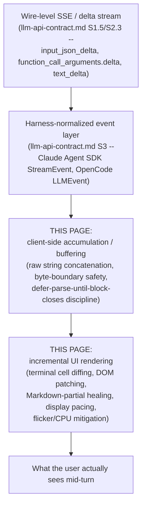
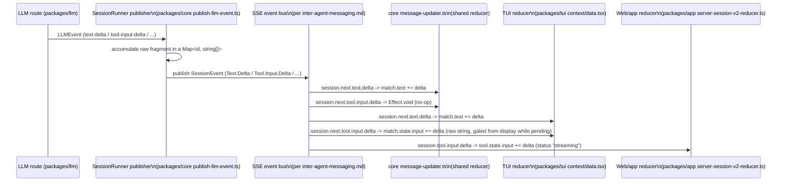
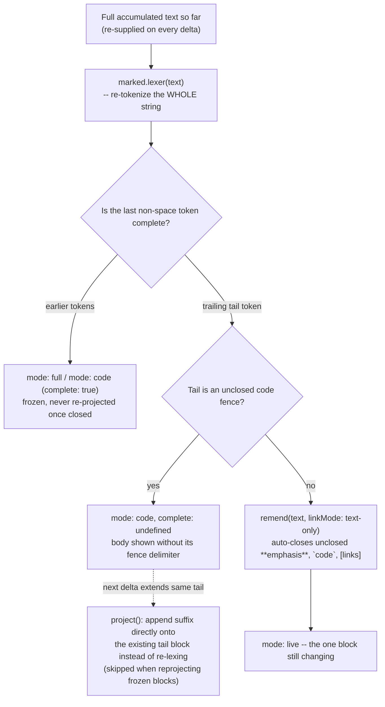

# Streaming & incremental rendering -- parsing and displaying a turn as it arrives

**Scope note.** [llm-api-contract.md](llm-api-contract.md) already grounds the
wire-level layer this page sits on top of: the Anthropic Messages API's SSE
event sequence (`message_start` -> `content_block_start`/`content_block_delta`/
`content_block_stop` -> `message_delta` -> `message_stop`), its
`input_json_delta`/`thinking_delta`/`signature_delta` fragment types (§1.5),
OpenAI's Responses API analogue (`response.function_call_arguments.delta`/
`.done`, §2.3), and, in its own §3.1-§3.3, how each harness's SDK-or-source
layer first receives that raw event stream (Claude Code's
`StreamEvent`/`SDKPartialAssistantMessage` wrapper; OpenCode's normalized
`LLMEvent` tagged union with its `tool-input-delta`/`text-delta` vocabulary).
This page does not re-derive any of that -- it picks up exactly where
llm-api-contract.md's §3 leaves off, one layer higher: what a harness's own
**client/UI side** actually does, turn by turn, with a stream it has already
received in that normalized shape. Concretely: how a partial `tool_use`
argument string is buffered before anyone tries to make sense of it, whether
and how a UI attempts to reassemble or display that partial JSON before it is
complete, how streamed text gets pushed to a terminal or browser DOM without
either flickering, burning CPU, or misrendering half-finished Markdown, and
how a client tells the difference between "the network delivered this slowly"
and "the model generated this slowly" when deciding how fast to reveal it on
screen.

Every claim below is tagged VERIFIED (fetched or read from source this
session, source named) or BEST CURRENT UNDERSTANDING, UNCONFIRMED. Claude Code
and GitHub Copilot CLI are both closed source -- this book's standing caveat
applies again here (see [retries.md](retries.md) §2.1,
[context-compression.md](context-compression.md) §2,
[caching.md](caching.md) §2, [llm-api-contract.md](llm-api-contract.md) §3.2
for the identical pattern on other topics): their own `CHANGELOG.md`s are read
as a *history of shipped behavior*, not as a specification, and are
authoritative for that behavior-change history only, never for an internal
implementation neither repository ships. OpenCode, by contrast, is fully
source-inspectable on this exact topic, and its `dev`-branch source (not a
stable release tag, per this project's standing flag) turned out to hold the
most precise, mechanism-level answers found anywhere in this book to the
handoff's original question -- "parsing partial tool-calls out of a token
stream and rendering deltas to the UI as they arrive" is, for OpenCode,
traceable line by line.



---

## 1. Claude Code

VERIFIED, `code.claude.com/docs/en/cli-reference`, fetched fresh this
session -- authoritative for the CLI's own documented headless output
formats. The `-p`/print-mode `--output-format` flag takes three documented
values: `text` (default human-readable), `json` (one structured object after
completion), and `stream-json` (incremental JSON events emitted as the agent
works). `stream-json` on its own emits tool-use/tool-result blocks (including
subagent ones) by default; `--include-partial-messages` additionally emits
the raw per-token `StreamEvent`/`SDKPartialAssistantMessage` wrapper
llm-api-contract.md §3.1 already documents in full (the raw
`content_block_delta` events, unmodified, plus `uuid`/`session_id`/
`parent_tool_use_id`); `--include-hook-events` adds hook lifecycle events
beyond the always-present `SessionStart`/`Setup`; and
`--forward-subagent-text` (from Claude Code v2.1.211 onward, per the same
docs) causes subagent text and thinking to appear as `assistant`/`user`
messages tagged with a `parent_tool_use_id` keyed by the spawning `Agent`
`tool_use` id -- v2.1.219 further added nested-subagent forwarding at
depth-2+ under the same flag (VERIFIED,
`github.com/anthropics/claude-code` `CHANGELOG.md`, fetched fresh this
session via `gh api repos/anthropics/claude-code/contents/CHANGELOG.md`, full
5,248-line file grepped for `stream|render|flicker|incremental|partial|
markdown|throttl|debounc|scroll` and read in context; all version numbers
below cite that same file). The docs do not describe how the *interactive*
terminal UI renders these deltas internally -- that half of the picture is
reconstructed below from the changelog's own multi-year record of shipped
fixes, which is a real, dated history of a genuinely hard problem, not a
specification of the mechanism.

### 1.1 A changelog-traced history of getting streamed text onto a terminal without it flickering or stalling

The earliest form of the problem the changelog documents is delivery *cadence*
itself: v2.1.78 shipped "Response text now streams line-by-line as it's
generated" (previously implied waiting for buffered chunks), and v2.1.81
almost immediately **disabled** that same line-by-line streaming specifically
on Windows (including WSL under Windows Terminal) "due to rendering issues"
-- i.e. the very first fix for the general problem this page is about
introduced a platform-specific regression serious enough to need its own
carve-out, which is itself informative: incremental terminal rendering is not
portable-by-default even once the wire-level delta stream itself works
correctly. v2.1.181 later refined the same mechanism ("Improved streaming of
long paragraphs: text now appears line-by-line instead of waiting for the
first line break"), showing the reveal granularity itself was tuned more than
once.

A second, independent axis is **render cost under sustained streaming**.
v2.1.169 "Reduced CPU usage while responses stream and during spinner
animations"; v2.1.191 went further and gave a concrete number: "Reduced CPU
usage during streaming responses by ~37% by **coalescing text updates to
100ms**" -- i.e. multiple deltas arriving inside a 100ms window are merged
into a single UI update rather than triggering one render pass per SSE event;
v2.1.196 layered "Reduced per-frame rendering work in the terminal UI by
skipping no-op subtree walks during streaming" on top of that same coalescing
discipline. v2.1.157 separately "eliminat[ed] redundant message-rendering
recomputations" for long conversations, and v2.1.172 removed "redundant
message normalization" and avoided "full message-history transforms when
streaming tool-use state is unchanged" -- naming the specific failure mode
being fixed (re-deriving the *entire* conversation's rendered state on every
single delta, rather than updating only the one message/block a given delta
actually touched).

A third axis is **terminal-level flicker**, which the changelog treats as a
distinct problem from CPU cost. v2.1.200 "Fixed rendering flicker under tmux
3.4+ by enabling synchronized terminal output" -- a reference to the terminal
synchronized-output escape-sequence convention (begin-update/end-update
markers a terminal emulator can use to buffer a whole redraw and swap it in
atomically rather than painting it incrementally and visibly). The same
synchronized-output mechanism recurs across at least three more dated
fixes for different terminal emulators (JetBrains IDEs' 2026.1+ terminals,
per an entry not tied to a single version number below the coalescing
entries; Cygwin/mintty stutter; and a garbled-startup fix in
`macOS Terminal.app` "and other terminals that don't support synchronized
output," which required detecting the *absence* of the capability and
falling back). v2.1.89 introduced a named, user-facing escape hatch for this
whole problem class: `CLAUDE_CODE_NO_FLICKER=1`, described as opting into
"flicker-free alt-screen rendering with virtualized scrollback" -- i.e. a
mode that both avoids flicker *and* only keeps the currently-visible window
of the transcript materialized in memory/DOM rather than the whole history,
a virtualization strategy distinct from, but complementary to, the
coalescing-and-diffing work above. v2.1.110 then promoted a related mechanism
to a first-class, named feature: `/tui` command and `tui` setting, "run
`/tui fullscreen` to switch to flicker-free rendering in the same
conversation" -- i.e. by v2.1.110 there were, per the changelog's own
language, two distinct opt-in renderer paths (`NO_FLICKER` and `/tui
fullscreen`) addressing the same flicker/virtualization problem via what read
as separate implementations, each independently receiving its own later bug
fixes (e.g. `NO_FLICKER`-specific memory leaks in v2.1.101's block "a
`NO_FLICKER` mode memory leak where API retries left stale streaming state,"
and `/tui`-specific scroll/dialog fixes in later versions) -- BEST CURRENT
UNDERSTANDING, UNCONFIRMED that these ever fully merged into one code path,
since the changelog itself never states that explicitly, only that both
continued to receive parallel maintenance.

A fourth axis is the **layout engine underneath the renderer**. v2.1.161
"Improved terminal rendering performance by stabilizing the layout engine's
JIT compilation profile," and v2.1.85 "Improved scroll performance with large
transcripts by replacing WASM yoga-layout with a pure TypeScript
implementation" -- both entries confirm, as real shipped facts (not
speculation), that Claude Code's terminal renderer is built on a Flexbox-style
layout algorithm (Yoga is Meta's cross-platform Flexbox implementation,
historically shipped as a WASM module in several JS UI toolkits) that was
originally used via its WASM build and was later replaced with a pure-TS
reimplementation specifically to fix a scroll-performance regression on large
transcripts -- i.e. the cost of laying out a growing, streaming transcript
was, at one point, dominated by WASM boundary-crossing or JIT-warmup cost
rather than by the terminal-write cost itself. v2.1.174 separately made a
"cell-based terminal renderer... enabled for all users by default," naming a
distinct rendering strategy (diffing at the level of individual terminal
cells rather than lines or whole frames) as the eventual default, consistent
with -- though the changelog does not explicitly connect it to -- the
flicker/CPU fixes above.

A community reverse-engineering effort (`claude-harness.dev`,
`claude-code-from-source.com`, and similar third-party write-ups surfaced via
`WebSearch` this session) describes Claude Code's renderer as originally
forked from the Ink terminal-UI library (a React-reconciler-based framework)
and since rewritten well beyond it, citing details like packed typed-array
cell buffers, double-buffered diffing, and an `<Static>`-component-style
freeze-once-rendered optimization. **This is explicitly not a source this
book treats as grounding** -- none of `code.claude.com/docs`,
`github.com/anthropics/claude-code`'s own README/CHANGELOG, or any other
authoritative source in this book's list documents Claude Code's internal
renderer implementation, and the repository itself ships no implementation
source to check it against (the same standing limitation
llm-api-contract.md §3.1 and every other page touching Claude Code's
internals notes). It is named here only as an unverified lead, consistent
with WebSearch's role in this book's sourcing discipline, and only because it
is independently *plausible* given the CHANGELOG's own references to a
"layout engine," "cell-based renderer," and Yoga -- all vocabulary consistent
with (but not proof of) an Ink-derived stack. Treat every specific technical
claim in that paragraph as BEST CURRENT UNDERSTANDING, UNCONFIRMED at best,
and more honestly as an unconfirmed community claim this page declines to
adopt as fact.

### 1.2 Reassembling partial tool-call JSON: concrete failure modes the changelog fixed

Beyond the rendering-performance axis, the changelog also documents specific,
dated bugs in the **reassembly** step llm-api-contract.md §1.5 names in the
abstract (accumulate `input_json_delta` fragments, parse only once
`content_block_stop` arrives). v2.1.92: "Fixed tool input validation failures
when streaming emits array/object fields as JSON-encoded strings" -- a real,
shipped bug in which a tool's arguments contained a field whose value was
itself a JSON-encoded string (rather than a nested object/array), and the
accumulate-then-parse-then-validate pipeline mishandled that shape until
fixed. v2.1.94 fixed two adjacent problems in the same neighborhood: "Fixed
CJK and other multibyte text being corrupted with U+FFFD in stream-json
input/output when chunk boundaries split a UTF-8 sequence" -- confirming that
Claude Code's own stream-json reassembly, at some point, buffered and decoded
network chunks as text *before* guaranteeing a chunk boundary never fell
mid-codepoint, a byte-level buffering bug one layer below the JSON-string
accumulation problem llm-api-contract.md documents -- and "Fixed SDK/print
mode not preserving the partial assistant response in conversation history
when interrupted mid-stream," a data-loss bug in exactly the
already-completed-content-blocks-survive-an-interruption mechanism
llm-api-contract.md §1.5 documents Anthropic's own docs describing at the API
level. v2.1.90 separately fixed a pure performance defect in the transport
itself: "Improved performance: SSE transport now handles large streamed
frames in linear time (was quadratic)" -- i.e. for some period, Claude Code's
own SSE-frame-handling code re-scanned or re-copied an accumulating buffer on
every incoming frame rather than appending in place, a classic
accumulation-strategy bug distinct from anything at the JSON-parsing layer.

### 1.3 Synthesis for Claude Code

Read end to end, the changelog describes a renderer under sustained,
multi-version engineering pressure from at least three independent
directions at once: (1) making the *reveal cadence* of streamed text feel
natural rather than chunk-jumpy (line-by-line granularity, later refined,
platform-gated); (2) keeping *CPU and render-pass cost* bounded as delta
volume grows (100ms coalescing, no-op subtree-walk skipping, redundant
recomputation elimination); and (3) keeping the *terminal itself* from
visibly tearing or flickering while all of the above happens (synchronized
output escape sequences, a dedicated `NO_FLICKER` mode, a separate `/tui
fullscreen` renderer, virtualized scrollback, a swapped-out layout engine).
None of these three problems is the same as the JSON-reassembly problem
llm-api-contract.md already grounds at the wire level, and the changelog
shows genuine, dated bugs in that reassembly step too (§1.2) independent of
the rendering-performance history (§1.1) -- i.e. Claude Code's engineering
history treats "get the bytes right" and "make the redraw not hurt" as two
separate, both-real problem classes, which is itself the clearest evidence
available (short of source access) that this page's topic is a genuinely
distinct layer from llm-api-contract.md's, not a restatement of it.

---

## 2. GitHub Copilot CLI

Copilot CLI is closed source; the same standing caveat applies as everywhere
else in this book. Two kinds of source were checked this session: the CLI's
own `changelog.md` (VERIFIED, `github.com/github/copilot-cli`, fetched fresh
via `gh api repos/github/copilot-cli/contents/changelog.md`, full 2,898-line
file grepped identically to Claude Code's above; version numbers below cite
that file directly), and the adjacent, explicitly-bounded Copilot SDK's own
documented streaming-events model (a different product from the CLI itself,
same adjacent-surface caveat this book applies to the SDK everywhere else --
see [orchestration.md](orchestration.md)'s Fleet-mode citation and
[llm-api-contract.md](llm-api-contract.md) §3.2's `ProviderConfig`/`wireApi`
citation for the identical pattern). Three official docs pages were checked
directly for CLI-specific streaming/rendering documentation and returned
nothing: `docs.github.com/en/copilot/reference/copilot-cli-reference/
cli-programmatic-reference`, `cli-command-reference`, and
`docs.github.com/en/copilot/how-tos/copilot-cli/use-copilot-cli/overview`
(all fetched fresh this session) -- none document a `--stream` flag,
streaming protocol, or terminal-rendering behavior, confirming the changelog
is, again, the only available window onto this behavior.

### 2.1 Token-by-token streaming, its default, and its off switch

v0.0.348 (2025-10-21) is the changelog's own origin point: "Copilot's output
now streams in token-by-token! This can be disabled with `--stream off`" --
i.e. token-by-token display became the default in that release, with a
documented, still-referenced-today opt-out flag (later changelog entries
through at least v1.0.something continue to reference `-p --stream off` as a
live, buffered-output mode with its own distinct rendering rules, e.g. a
v1.0-era fix for "Nested markdown lists render correctly in buffered output
(`-p --stream off` and detail screens)" -- confirming buffered and streamed
output are genuinely two different code paths with independently-maintained
Markdown-rendering logic, not the same renderer fed at different speeds).
The very next release, v0.0.349 (2025-10-22), fixed a bug directly in the
new streaming path's boundary with the model itself: "Fixed a bug where
every streamed output chunk was sent back to the model as part of the
conversation" -- i.e. for one release, the CLI's own display-side delta
stream leaked into the conversation-history payload sent on the *next*
request, duplicating content the model had already produced back into its
own context. This is a distinct, concrete instance of the same general
category of bug llm-api-contract.md's Claude Code coverage names abstractly
(confusing a display-only delta representation with the durable message
content that belongs in history) -- confirmed here as a real, shipped, and
fixed Copilot CLI bug rather than a hypothetical risk.

### 2.2 Flicker, spinner cost, and shell-output tailing

v1.0.66 (2026-06-30) shipped "Skip synchronized output under tmux to avoid
mouse pointer flicker" -- the same synchronized-terminal-output escape-code
mechanism Claude Code's changelog names (§1.1), here fixed in the opposite
direction: Copilot CLI found a case where *using* synchronized output caused
a flicker regression specifically for mouse-pointer rendering under tmux, and
the fix was to skip it rather than to adopt it, a useful reminder that this
mechanism is not a strict win in every terminal/multiplexer combination. The
same release also "Render[ed] the timeline as a compact 'highlight reel' with
single-line tool and reasoning rows for all users" -- a default rendering-
density change distinct from the flicker fix but shipped in the same version.
v1.0.13 (2026-03-30, repeated verbatim in v1.0.14) reads "Reduce CPU usage
during streaming by optimizing spinner rendering and task polling" -- the
same CPU-during-streaming concern Claude Code's v2.1.169/v2.1.191 address,
here attributed specifically to spinner-animation cost and a polling loop
rather than to text-diffing cost. v1.0.19 (2026-04-06) added an
OpenTelemetry-visible metric directly measuring the user-facing consequence
of all of this work: chat spans now carry a `github.copilot.time_to_first_chunk`
attribute, explicitly scoped "(streaming only)" -- i.e. Copilot CLI
instruments and exposes the exact latency this whole rendering pipeline is
trying to minimize the *perception* of, as a real observability signal
rather than only a qualitative changelog claim. v1.0.20 (2026-04-07) followed
immediately with "Reduce UI sluggishness during live response streaming."
v1.0.6 (2026-03-16) separately targeted memory rather than CPU: "Improve
streaming and tool-output memory usage."

A concrete, real-world-reported example of incremental *tool-output*
rendering specifically (as opposed to model-text rendering) comes from
GitHub Issue #1127, "Streaming output for long-running commands" (VERIFIED,
fetched via `gh issue view 1127 -R github/copilot-cli` this session): a user
reported that long-running shell commands (builds, test suites) gave "no
visibility into progress" until completion, proposing an automatic
tail-the-output mechanism. A maintainer comment closing the issue states
plainly: "This was fixed in v0.0.348. The CLI now streams incremental output
for running shell commands in the timeline automatically, without manual
polling." Note the shared version number with §2.1's token-by-token text
default -- v0.0.348 appears to have been the release that generalized
"stream deltas into the visible timeline as they occur" across both model
text *and* shell-tool stdout/stderr in the same pass, rather than treating
them as unrelated features shipped separately.

### 2.3 Adjacent-surface citation: the Copilot SDK's own streaming-events model

VERIFIED, `docs.github.com/en/copilot/how-tos/copilot-sdk/features/
streaming-events`, fetched fresh this session -- **the Copilot SDK, not
Copilot CLI itself**, same bounded-citation discipline as
llm-api-contract.md §3.2's `ProviderConfig` citation. Setting `streaming:
true` on a session causes the SDK to emit two classes of event: **ephemeral**
events ("transient; streamed in real time but not persisted to the session
log," not replayed on session resume) and **persisted** events ("saved to the
session event log on disk. Replayed when resuming a session"). The
`assistant.message_delta` ephemeral event carries `messageId` (correlating it
to the eventual persisted `assistant.message`) and `deltaContent` (the
incremental text chunk); the docs state the reconstruction discipline
explicitly and put the burden on the caller: "Accumulate deltas to build the
complete content" -- the SDK does not reassemble the full message for the
consumer, mirroring the same caller-must-accumulate discipline
llm-api-contract.md §1.5/§2.3 document at the raw-API level for both
Anthropic and OpenAI. Two further ephemeral event types cover tool execution
specifically: `tool.execution_partial_result` ("incremental output from a
running tool, e.g. streaming bash output," carrying `partialOutput` to
accumulate -- the SDK-level analogue of the shell-output-tailing behavior
§2.2's Issue #1127 confirms at the CLI level) and `tool.execution_progress`
("human-readable progress status from a running tool," carrying
`progressMessage`), with the final settled result arriving in a separate
persisted `tool.execution_complete` event.

**The one clearly-flagged, genuinely load-bearing finding from this
citation:** the documentation gives no guidance anywhere on parsing
*incomplete tool-call arguments* during streaming, and states the reason
directly -- "Tool calls arrive complete in `assistant.message` under the
`toolRequests` array; streaming doesn't fragment tool invocation metadata."
Read plainly, this describes an SDK-level design choice categorically
different from both Claude Code's and OpenCode's documented/verified
behavior elsewhere in this book: the Copilot SDK's own streaming model
fragments *text* and *tool output* into ephemeral deltas, but does **not**
fragment a tool call's *arguments* the way Anthropic's `input_json_delta` or
OpenAI's `function_call_arguments.delta` do at the wire level
(llm-api-contract.md §1.5/§2.3) -- either the SDK buffers and reassembles
that fragmentation internally before ever surfacing an event to its own
caller, or the underlying model/provider integration it wraps does not
stream tool-call arguments to begin with. The docs fetched this session do
not say which, so this is named here as a confirmed *absence of a
documented mid-stream tool-argument event*, not a confirmed mechanism behind
it -- BEST CURRENT UNDERSTANDING, UNCONFIRMED beyond that bare, directly
quoted fact. Whether Copilot CLI's own (undocumented, closed-source)
internal renderer inherits this same all-or-nothing tool-argument delivery,
or instead reassembles wire-level `input_json_delta`/`function_call_arguments.delta`
fragments itself before ever reaching whatever internal event bus its SDK
sibling documents, is not established by any source fetched this session --
flagged as the clearest remaining gap in this page's Copilot CLI coverage,
parallel to the identical gap llm-api-contract.md §3.2 already flags for the
wire-contract question one layer down.

---

## 3. OpenCode

VERIFIED throughout this section, `github.com/anomalyco/opencode`, `dev`
branch (not a stable release tag, per this project's standing flag),
located via `gh search code` and read in full via `curl` against
`raw.githubusercontent.com` this session (working around a local `gh
api`/base64-decoding failure on this platform, the same workaround
llm-api-contract.md §3.3 and other pages in this book already document).
Unlike §1 and §2, every claim below is read directly from source, not
inferred from a changelog or bounded to an adjacent product -- and OpenCode
turns out to have at least four architecturally distinct, independently
engineered answers to different slices of this page's question, spread
across three separate packages.



### 3.1 The republishing layer: one accumulation discipline shared by text, reasoning, and tool input alike

`packages/core/src/session/runner/publish-llm-event.ts` (full file read this
session) is the layer that turns the normalized `LLMEvent` stream
llm-api-contract.md §3.3 already documents (`text-delta`, `reasoning-delta`,
`tool-input-delta`, etc.) into the `SessionEvent`s actually published onto
the same directory-scoped Server-Sent-Events bus
[inter-agent-messaging.md](inter-agent-messaging.md) documents for
inter-agent traffic. Its internal `fragments()` helper is created identically
for `text`, `reasoning`, and `tool input` -- each is a `Map<string, string[]>`
keyed by block/call id, with a `start`/`append`/`end` lifecycle: `append`
pushes the raw delta string onto that id's array (`current.push(value)`), and
`end` joins the accumulated array (`current.join("")`) into the final string
handed to the corresponding `*Ended` event. Every `*-delta` `LLMEvent` case in
the file's central `publish` switch does the *same* two things regardless of
which of the three fragment types it is: append the raw text to the
in-memory accumulator, **and** immediately republish a corresponding `*.Delta`
`SessionEvent` carrying that same raw delta onward -- meaning the
accumulation for later reassembly and the live delta broadcast for
downstream UIs are two independent actions on the same append call, not one
computed from the other after the fact. Critically, this file makes **no
attempt to parse** a tool call's accumulating `partial_json`/`arguments`
string as JSON at any point during accumulation -- the parsed `input` object
only ever appears once a `tool-call` `LLMEvent` arrives (already parsed,
supplied by the LLM package's own protocol-level reassembly documented in
llm-api-contract.md §3.3), at which point `publish-llm-event.ts` republishes
it verbatim as the `Tool.Called` event's `input` field. This confirms, at the
one place in this book where the mechanism is actually visible in source,
what llm-api-contract.md's Anthropic-docs citation only states as a policy
("a client must accumulate the string fragments and parse the whole thing
only once `content_block_stop` arrives"): OpenCode's own server-side
republishing layer follows that discipline exactly, and never once attempts
a speculative partial-JSON parse.

### 3.2 A genuine divergence: the shared "core" reducer drops tool-input deltas; the TUI's own reducer keeps them

`packages/core/src/session/message-updater.ts` (full file read this session)
is the reducer that projects the `SessionEvent` stream into the actual
in-memory `Message`/`content` array structure used for persistence and, via
an `Adapter` interface, by any consumer that wires it up. Its handling of
`session.next.text.delta` and `session.next.reasoning.delta` mutates an
Immer draft directly and simply: `match.text += event.data.delta` for both --
genuinely incremental, character-by-character projection of streamed text
into the message state, no buffering delay beyond the event itself. Its
handling of `session.next.tool.input.delta`, by contrast, is a bare
`() => Effect.void` -- **a deliberate no-op**. The tool part's `state.input`
field is only ever set once, at `session.next.tool.input.ended`, to the
event's already-fully-accumulated `text` field. This is a clean, source-level
demonstration of a design choice: this shared reducer treats a tool's
growing argument string as not worth projecting incrementally into message
state at all, sidestepping the "how do I show a half-finished JSON blob"
problem by simply declining to surface it until it is whole.

`packages/tui/src/context/data.tsx` (relevant `switch` cases read this
session) implements the **same event vocabulary independently**, and departs
from `message-updater.ts` on exactly this one case:
`session.next.tool.input.delta` in the TUI's own reducer *does* mutate state
-- `if (match?.state.status === "pending") match.state.input += event.data.delta`
-- i.e. the terminal UI's own client-side projection **does** accumulate the
raw, still-partial JSON string directly into the tool part's `input` field
while the tool call is in its `"pending"` status, character by character, the
same discipline `message-updater.ts` uses for text. The two reducers are not
the same code reused twice; they are two separately-written consumers of the
identical published event stream that made two different design choices
about whether a tool's partial argument text is worth holding in live state
at all -- worth flagging as a real, source-confirmed architectural fork
inside one codebase, not a docs/source inconsistency to be smoothed over.

Whether the TUI actually *displays* that accumulating raw string while it is
still incomplete is a separate question, answered by
`packages/tui/src/util/tool-display.ts` (full 13-line file read this
session): its `toolDisplayMetadata()` function gates on status first -- "if
(!("status" in state) || state.status === "pending") return {}" -- returning
an empty object, and only extracting a tool's `structured` field for display
once status has moved past `"pending"`. `packages/tui/src/routes/session/
index.tsx`'s own `ToolPart` component mirrors the same gate: its `metadata`
getter returns `{}` while `state.status === "pending"`, and its `input`
getter reads `props.part.state.input ?? {}` unconditionally -- meaning while
pending, the TUI *has* the growing raw JSON string sitting in reactive state
(per §3.2's `data.tsx` finding) but the rendering components that would turn
an `input` value into a displayed argument line (a helper function named
`input(input: Record<string, unknown>, omit?: string[])`, read at line 2613
of the same file, which is typed to expect an already-parsed record, not a
raw string) are never invoked against it until the tool call event finalizes
that field into an actual parsed object. The net effect, confirmed end to
end across three separate files: OpenCode's terminal UI shows a spinner and
the tool's name while its arguments are still streaming, holds the growing
raw string in memory the whole time, and never attempts to parse or display
so much as a fragment of it before the call is complete -- a third distinct
strategy from either "don't even keep the partial string" (§3.2's `core`
reducer) or "attempt a speculative partial-JSON parse" (a strategy this
research found **no evidence of in any of the three harnesses examined in
this book** -- worth stating plainly as a negative finding: nobody examined
here tries to render a genuinely incomplete JSON object mid-parse).

`packages/app/src/context/server-session-v2-reducer.ts` (relevant case read
this session) -- the reducer behind OpenCode's separate web/desktop app
surface -- independently re-implements the TUI's own choice, not the shared
core's: `case "session.tool.input.delta": ... tool.state.status ===
"streaming" ? { ...tool, state: { ...tool.state, input: tool.state.input +
event.data.delta } } : ...` -- the identical raw-string-accumulation pattern,
gated on a status value named `"streaming"` rather than the TUI's
`"pending"`, a minor but real naming inconsistency between the two
independently-written client reducers worth flagging as UNCONFIRMED-as-
intentional rather than smoothed into a single shared vocabulary.

### 3.3 Incremental parsing of a growing string that is not JSON: the reasoning-title regex

`packages/tui/src/context/thinking.ts` (full 67-line file read this session)
solves a smaller, adjacent version of the same general problem for a
different content type. OpenAI's Responses API (llm-api-contract.md §2)
surfaces reasoning summaries that begin with a bolded title block --
`"**Inspecting PR workflow**\n\n<body>"` -- and the TUI wants to style that
title differently from the body prose that follows it, *while the whole
block is still streaming in via `reasoning-delta` events*. Its
`reasoningSummary()` function runs a single regex,
`/^\*\*([^*\n]+)\*\*(?:\r?\n\r?\n|$)/`, against the full accumulated text on
every call -- the regex's own alternation, `(?:\r?\n\r?\n|$)`, is written to
match either a completed title followed by a blank-line separator **or** the
literal end of the currently-accumulated string, so that a title whose
closing `**` has arrived but whose following blank line has not yet streamed
in is still recognized and displayed correctly as a title (not garbled or
left unstyled) rather than waiting for content that has not arrived yet. The
function's own source comment states the intent directly: "Treat that first
block, or a complete title still awaiting its body while streaming, as
disclosure metadata so the TUI can style its header independently from the
markdown body." This is a small but genuinely illustrative example of
"parsing a partial structure out of a token stream" done successfully and
cheaply, in contrast to the tool-argument case above where the same harness
deliberately declines to attempt it -- the difference being that a title/body
split is a much shallower, regex-tractable structure than a nested JSON
object, and a wrong guess here only costs a momentarily-unstyled title rather
than a malformed tool call.

### 3.4 Incremental Markdown rendering on the web/app surface: tokenize, freeze, heal, and reuse

`packages/session-ui` is a separate package from `packages/tui`, confirmed
this session to have **no dependency relationship with it** (`packages/tui`'s
own `package.json` lists `@opentui/core`/`@opentui/solid`/`opentui-spinner`
as its rendering stack and no `session-ui`, `marked`, or `remend` dependency
at all) -- `session-ui` is consumed instead by `packages/app` (the web/desktop
client) and `packages/enterprise` (a shared-session web view, e.g. its
`routes/share/[shareID].tsx`), confirmed via a repo-wide `gh search code` for
`@opencode-ai/session-ui` import sites this session. The terminal TUI's own
Markdown rendering therefore goes through `@opentui/core`'s own built-in
renderer instead (referenced via props like `tableOptions`/`conceal` seen in
`packages/tui/src/routes/session/index.tsx`) -- whether that library
implements anything resembling the algorithm below is out of scope for this
citation and not established by any source fetched this session; it is a
third-party terminal-rendering library, not OpenCode's own code.

`packages/session-ui/src/components/markdown-stream.ts` (full 110-line file
read this session), by contrast, implements a real, source-verified
incremental-Markdown-diffing algorithm for the web/app surface specifically,
confirmed by its own test suite
(`markdown-stream.test.ts`, partially read this session) to do the
following:



`stream(text, live)` re-tokenizes the *entire* accumulated string on every
call via `marked.lexer()` (the `marked` Markdown parser's own lexer,
producing a token array), then treats every token before the last
non-whitespace one as **frozen** -- rendered in `"full"` mode (ordinary
prose/headings/lists) or, for a token whose type is `code`, `"code"` mode
with `complete: true` -- while the single trailing token is rendered in
`"live"` mode, the one block still subject to change on the next delta. Two
test-confirmed behaviors show the deliberate care taken with this boundary:
"freezes completed top-level blocks and only keeps the tail live" (a
finished paragraph followed by a still-growing list item correctly splits
into two frozen blocks plus one live one), and "keeps a growing table
together until a later block freezes it" (a Markdown table -- which cannot
be safely rendered row-by-row without risking a malformed border -- stays
undivided in `"live"` mode for as long as it might still be the trailing,
still-growing content).

A dedicated `heal()` step (wrapping a library named `remend`, called with
`linkMode: "text-only"`) is applied to the live block specifically to make
genuinely incomplete Markdown syntax render sanely rather than garbled while
streaming -- test-confirmed cases include "heals incomplete emphasis while
streaming" (`"hello **world"` renders as `"hello **world**"`, auto-closing
the still-open bold marker) and "keeps incomplete links non-clickable until
they finish" (`"see [docs](https://example.com/gu"` renders its link text as
plain, non-hyperlinked text -- `"see docs"` -- rather than presenting a
broken or premature URL as a clickable link). A still-open fenced code block
(``` ```ts\nconst x = 1 ``` `` with no closing fence yet) gets its own
dedicated handling via `open()`/`openCode()`: the fence delimiter line itself
is stripped from what's displayed, and the code body streamed so far is
shown in `"code"` mode without `complete: true`, confirmed by the test
"splits an unfinished trailing code fence from stable content."

The `project()` function is the piece directly responsible for render-cost
discipline analogous to Claude Code's changelog-documented coalescing work
(§1.1), but implemented as an explicit reuse check rather than a time-based
debounce: given the previous projection and the new, longer accumulated
text, if the new text is simply the old text with a suffix appended, **and**
the previous trailing block was an unclosed code block that the new suffix
still does not close, `project()` skips calling `stream()`'s full re-lex
entirely and instead appends the suffix directly onto that one block's `raw`
and `src` fields in place -- confirmed by the test's own name, "appends
plain code deltas without reprojecting frozen blocks." Only when the new
text is *not* a simple suffix-extension of the old (a genuine replacement or
truncation, per the "reprojects non-prefix replacements" and "reprojects
truncation without retaining removed blocks" tests), or when the previous
tail block's fence actually closes this delta (per "closes code fences split
across provider deltas"), does it fall back to a full re-tokenization via
`stream()`. A companion `canReusePendingBlock()` function (comparing `mode`
and a `raw`-string prefix match) is exported for the actual rendering
component to decide whether an already-mounted UI block instance can be kept
alive (avoiding a remount/reflow) versus needs to be replaced -- the
render-layer analogue of a React/Solid keyed-list stability check, here keyed
specifically on whether the block's underlying raw Markdown source is still
a prefix of its predecessor.

### 3.5 Decoupling display pace from delivery cadence: the client-side typewriter pacer

`packages/session-ui/src/components/message-part.tsx` (relevant sections read
this session) contains a mechanism answering a question none of the other
sources checked in this book address explicitly: what happens when the
network delivers a large amount of already-accumulated text in one burst
(e.g. immediately after a session reconnect or resume) rather than in a
steady drip -- should the UI reveal it all at once, or still "type" it out?
A `createPacedValue(getValue, live)` helper, consumed by a `PacedMarkdown`
component, answers this with an explicit, tunable, and source-confirmed
pacing algorithm, entirely independent of §3.4's tokenizer/freeze logic (it
operates on the plain accumulated string, handing the *paced* substring --
not the full accumulated text -- to that Markdown-projection layer):

- A tick interval constant `TEXT_RENDER_PACE_MS = 24` drives a repeating
  `setTimeout` loop, re-armed on each tick while there remains unshown
  backlog (the accumulated text the reducer already has, minus what has been
  revealed to the DOM so far).
- Each tick reveals an **adaptively-sized** chunk of the backlog, computed by
  a `step(size)` function keyed on the outstanding backlog length: 2
  characters per tick when the backlog is 12 characters or fewer, 4 when
  48 or fewer, 8 when 96 or fewer, and `min(256, ceil(size / 4))` for larger
  backlogs -- i.e. the reveal rate accelerates the further behind the paced
  display falls, so a burst of accumulated text is caught up progressively
  faster rather than the pacer falling permanently behind a fast-moving
  model.
- A `next()` function extends each computed step boundary forward by up to
  8 additional characters, searching for a "snap" character matching
  `TEXT_RENDER_SNAP = /[\s.,!?;:)\]]/` (whitespace or common closing
  punctuation), so each reveal tick lands on a natural word or clause
  boundary rather than visibly splitting a word mid-letter.
- A `TEXT_RENDER_IMMEDIATE = 512` threshold is an explicit escape valve:
  if the unshown backlog ever exceeds 512 characters in one measurement (the
  large-burst-on-reconnect case above), the pacer abandons ticking entirely
  and reveals the full text immediately, rather than making a user watch a
  slow multi-second typewriter catch-up on content the model already
  finished producing.
- `live` (driven by a `streaming` memo defined as `props.message.role ===
  "assistant" && typeof (props.message).time.completed !== "number"` --
  i.e. true exactly until the corresponding `session.next.step.ended`
  `SessionEvent` sets that field, per §3.2's `message-updater.ts` finding)
  gates the whole mechanism: once a turn's step has actually ended, pacing is
  abandoned and the full final text renders immediately via a plain,
  non-paced `<Markdown>` component instead of `<PacedMarkdown>`.

This is, among every source checked in this book on this exact question, the
single clearest, most explicit, fully-source-confirmed demonstration that
"how fast the network delivered the bytes" and "how fast the UI displays
them" are treated as two genuinely separate concerns by at least one
production agent harness -- Claude Code's changelog only shows this same
concern's *symptoms* (line-by-line granularity tuning in v2.1.78/v2.1.181,
§1.1) without ever exposing the underlying algorithm, since its source is
not available to read.

---

## 4. Synthesis

| Concern | Claude Code | Copilot CLI | OpenCode |
|---|---|---|---|
| Partial tool-call JSON: attempted a mid-parse? | No evidence found; changelog shows byte/JSON reassembly *bugs* fixed (v2.1.92, v2.1.94), never a speculative-parse feature | Docs state tool calls arrive whole, no fragmentation of arguments at the SDK's own event layer (bounded, adjacent-surface citation) | Source-confirmed: never attempted anywhere in three independently-written consumers (`publish-llm-event.ts`, `message-updater.ts`, TUI's `data.tsx`) |
| Partial tool-call JSON: held in live state at all while pending? | Unknown (closed source) | Unknown; docs suggest not, since arguments aren't fragmented to begin with | Diverges *within the same codebase*: the shared `core` reducer no-ops the delta entirely; the TUI's and app's own reducers accumulate the raw string but gate its display until the call is complete |
| Render-cost mitigation under sustained streaming | Time-based coalescing (100ms window, ~37% CPU cut, v2.1.191), no-op subtree-walk skipping (v2.1.196), a swapped-out WASM layout engine (v2.1.85) | Spinner/polling-cost optimization (v1.0.13), a `time_to_first_chunk` OTel metric (v1.0.19) to measure the user-facing consequence | SolidJS fine-grained reactive signals (only the specific memoized value that changed re-renders) plus an explicit reuse-check in the Markdown projector (`project()`'s frozen-block-skip, §3.4) -- a declarative/structural answer rather than a time-based debounce |
| Terminal/DOM flicker mitigation | Synchronized-output escape sequences (v2.1.200 and others), a dedicated `NO_FLICKER` mode (v2.1.89) and a separate `/tui fullscreen` renderer (v2.1.110), both independently maintained | Synchronized output *skipped* under tmux specifically to avoid a flicker regression (v1.0.66) -- the same mechanism, opposite conclusion for one terminal/multiplexer combination | Not directly addressed by any source read this session (OpenTUI's own internals, a third-party dependency, were out of scope) |
| Display pace vs. delivery cadence | Symptom-level tuning only (line-by-line granularity, v2.1.78/v2.1.181); no algorithm exposed | Not documented | Fully source-verified, explicit, tunable algorithm (`createPacedValue`, §3.5) decoupling the two entirely, with its own burst-catch-up and immediate-reveal-on-large-backlog escape valve |
| Incremental Markdown-partial handling | Changelog shows dozens of dated Markdown-rendering bugs fixed (tables, strikethrough, blockquotes, nested lists) but no exposed algorithm | Buffered (`--stream off`) vs. streamed output confirmed as genuinely separate Markdown-rendering code paths (nested-list rendering bug fixed only in buffered mode) | Fully source-verified tokenize/freeze/heal/reuse algorithm (`markdown-stream.ts`, §3.4), web/app surface only -- not shared with the terminal TUI |

**The design lesson.** Across all three harnesses, "parsing partial tool
calls out of a token stream" turns out, on the evidence actually gathered
this session, to have a strikingly uniform answer at the argument-JSON
layer specifically: nobody examined in this book attempts to parse or
display a genuinely incomplete JSON object mid-stream. Every mechanism found
either declines to hold the partial string in live state at all (OpenCode's
shared `core` reducer), holds it but withholds it from display until
complete (OpenCode's TUI and web/app reducers, both independently), or --
per the one adjacent-surface citation available for Copilot -- appears not
to fragment tool-call arguments across the wire at all. The genuinely
divergent, harder engineering problem all three harnesses *do* visibly
grapple with, each in its own idiom, is the second-order one this page's
name points at more than its handoff description initially suggested:
turning an already-safely-accumulated, still-growing plain-text or Markdown
string into a terminal or DOM update that neither flickers, stalls, nor
burns unbounded CPU as the growth rate varies -- and, per OpenCode's
uniquely source-visible §3.5 finding, optionally re-pacing that reveal to a
rate independent of the network's own delivery cadence entirely. Claude
Code's multi-year changelog record is the deepest evidence of how much
sustained engineering effort that second problem alone can demand even once
the first one (safe JSON reassembly) is solved.

---

## Sources

All fetched or read fresh this session (2026-08-01) unless noted otherwise.

**Claude Code (authoritative for its own documented CLI behavior; no
implementation source exists in this repo):**
- `https://code.claude.com/docs/en/cli-reference` -- `--output-format
  stream-json`, `--include-partial-messages`, `--include-hook-events`,
  `--forward-subagent-text` flag documentation; covers §1 intro.
- `https://github.com/anthropics/claude-code` `CHANGELOG.md`, fetched via
  `gh api repos/anthropics/claude-code/contents/CHANGELOG.md` (full
  5,248-line file, grepped for `stream|render|flicker|incremental|partial|
  markdown|throttl|debounc|scroll` and read in context) -- every versioned
  claim in §1.1-§1.2 (v2.1.78, v2.1.81, v2.1.85, v2.1.89, v2.1.90, v2.1.92,
  v2.1.94, v2.1.101, v2.1.110, v2.1.157, v2.1.161, v2.1.169, v2.1.172,
  v2.1.174, v2.1.181, v2.1.191, v2.1.196, v2.1.200, v2.1.211, v2.1.219).
- Community reverse-engineering write-ups (`claude-harness.dev`,
  `claude-code-from-source.com`, and similar, surfaced via `WebSearch`) --
  explicitly named in §1.1 as unverified leads only, not treated as grounding
  per this book's sourcing discipline.

**GitHub Copilot CLI (authoritative for its own behavior-change history
only; no implementation source exists in this repo):**
- `https://github.com/github/copilot-cli` `changelog.md`, fetched via `gh
  api repos/github/copilot-cli/contents/changelog.md` (full 2,898-line file,
  grepped identically to Claude Code's above) -- every versioned claim in
  §2.1-§2.2 (v0.0.348, v0.0.349, v1.0.6, v1.0.13/1.0.14, v1.0.19, v1.0.20,
  v1.0.66).
- GitHub Issue #1127 ("Streaming output for long-running commands"),
  `github/copilot-cli`, fetched via `gh issue view 1127 -R
  github/copilot-cli` -- confirms v0.0.348 as the release that generalized
  incremental shell-output tailing into the timeline; covers §2.2.
- `https://docs.github.com/en/copilot/reference/copilot-cli-reference/
  cli-programmatic-reference`, `.../cli-command-reference`, and
  `https://docs.github.com/en/copilot/how-tos/copilot-cli/use-copilot-cli/
  overview` -- all checked and confirmed to document no CLI-specific
  streaming/rendering flags or mechanism, motivating reliance on the
  changelog above; covers §2 intro.
- `https://docs.github.com/en/copilot/how-tos/copilot-sdk/features/
  streaming-events` -- adjacent-surface-only citation of the Copilot SDK's
  `streaming: true`/ephemeral-vs-persisted event model
  (`assistant.message_delta`, `tool.execution_partial_result`,
  `tool.execution_progress`), explicitly flagged as describing a different
  product from Copilot CLI itself; covers §2.3.

**OpenCode (authoritative for its own documented behavior AND, unlike the
two harnesses above, its own real implementation; `dev` branch, not a stable
release tag):**
- `https://github.com/anomalyco/opencode`, `dev` branch, located via `gh
  search code` and read via `curl` against `raw.githubusercontent.com` this
  session -- full contents of `packages/core/src/session/runner/
  publish-llm-event.ts` (§3.1), `packages/core/src/session/
  message-updater.ts` (§3.2), `packages/tui/src/context/data.tsx` (relevant
  cases, §3.2), `packages/tui/src/util/tool-display.ts` (full file, §3.2),
  `packages/tui/src/routes/session/index.tsx` (relevant sections, §3.2),
  `packages/tui/src/context/thinking.ts` (full file, §3.3),
  `packages/app/src/context/server-session-v2-reducer.ts` (relevant case,
  §3.2), `packages/session-ui/src/components/markdown-stream.ts` (full file,
  §3.4), `packages/session-ui/src/components/markdown-stream.test.ts`
  (partial, §3.4), `packages/session-ui/src/components/message-part.tsx`
  (relevant sections, §3.5), `packages/tui/package.json` and
  `specs/tui-package.md` (dependency confirmation, §3.4) -- covering §3 in
  full.
