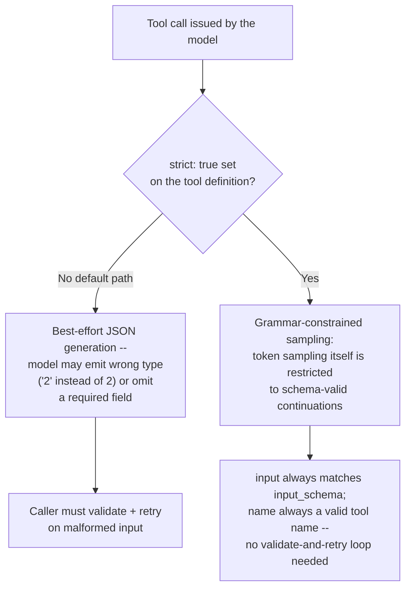
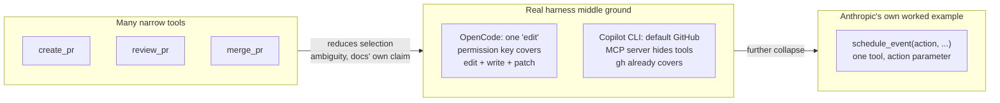
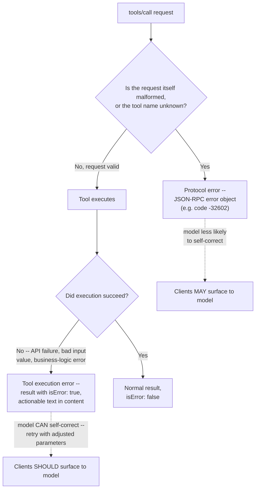
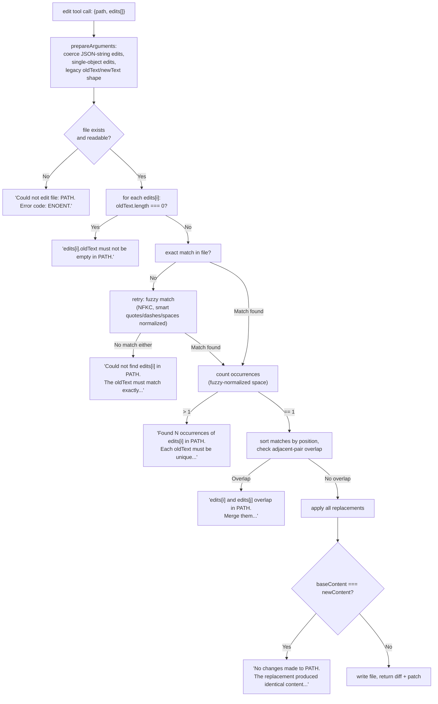
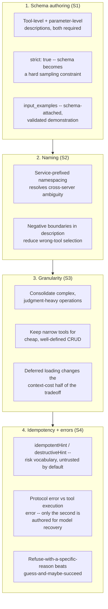

# Tool schema / interface design

**Scope, and why this is a different page from `built-in-tools.md`.**
[Built-in tools](built-in-tools.md) is an *inventory*: it names every
tool Claude Code, Copilot CLI, and OpenCode ship, what each one does
mechanically, and how each harness's permission system gates it. It
does not ask, and this page does, the design question underneath that
inventory: given that a tool is just a `name` + `description` +
JSON-Schema `input_schema` triple handed to a model, what makes one
authoring of that triple produce reliable tool-selection and
argument-construction behavior, and another produce hallucinated
arguments, wrong-tool selection, or silent failure the model can't
recover from. Every concrete tool named below that this book has
already documented mechanically is cross-referenced to
[built-in-tools.md](built-in-tools.md) rather than re-described.

**Relationship to [System-prompt / agent-instruction design as a
craft](system-prompt-design-as-craft.md).** That page's §1.5 already
establishes, from Anthropic's `building-effective-agents` post, the
umbrella framing this page operates inside: tool definitions are
*agent-computer interface (ACI) design*, deserving the same rigor as
human-computer interface design, with a named self-test ("is it
obvious how to use this tool... or would you need to think carefully
about it?") and a documented poka-yoke example (requiring absolute
filepaths eliminated a relative-path failure mode entirely by making
the error structurally impossible, rather than documenting a rule).
That page's §2 also already treats few-shot *examples in prose* versus
*prose constraints* as a system-prompt-level authoring tension. This
page does not re-derive either finding -- it picks up one level lower,
at the schema and interface itself: how a parameter is typed and named,
what a tool's response payload should contain, how many distinct tools
a capability should be split across, and what a tool should return on
failure so the calling model can self-correct. Where the two pages
share a citation (Anthropic's `define-tools`/`building-effective-agents`
guidance, the Gorilla paper), each page grounds its own claim from that
source independently rather than borrowing the other's fetch.

Every claim below is tagged VERIFIED (fetched fresh this session from a
named, authoritative source) or BEST CURRENT UNDERSTANDING,
UNCONFIRMED. Claude Code, Copilot CLI (added in a later session,
§1.6/§2.5/§3.5/§4.6), OpenCode, and (added in a still later session,
§1.5/§2.4/§3.4/§4.5) pi are four separate products from four separate
organizations; a mechanism confirmed for one is never assumed for
another without its own citation. Copilot CLI ships as a closed-source
binary -- unlike OpenCode's and pi's own real implementations, this
page's Copilot CLI coverage is grounded entirely in GitHub's own
published documentation surface, not a source read, per the `gh api
repos/github/copilot-cli` check recorded in this page's own Sources
block. Sources and fetch dates are listed in full at the bottom.

---

## 1. JSON Schema authoring for tool parameters

### 1.1 What the schema itself is, and what a harness/API actually requires of it

VERIFIED, `platform.claude.com/docs/en/agents-and-tools/tool-use/define-tools`,
fetched fresh this session -- a client tool definition sent to the
Claude API is exactly three required fields plus optional ones: `name`
(matching the regex `^[a-zA-Z0-9_-]{1,64}$`), `description` ("a
detailed plaintext description of what the tool does, when it should
be used, and how it behaves"), and `input_schema` ("a
[JSON Schema](https://json-schema.org/) object defining the expected
parameters for the tool"). The API's own tool-use system prompt
literally embeds this triple verbatim into the model's context --
Anthropic's docs quote the constructed template directly: `"Here are
the functions available in JSONSchema format: {{ TOOL DEFINITIONS IN
JSON SCHEMA }}"` -- meaning the schema is not metadata consumed by some
separate validation layer before the model ever sees it; the model
reads the literal JSON Schema text as part of its own prompt and
reasons about it the same way it would reason about any other
structured text in context. This is the single fact that makes schema
*readability*, not just schema *validity*, a genuine design lever: a
schema a human engineer finds clear is more likely to be a schema the
model interprets correctly, because the model is reading the same
document a human reviewer would.

VERIFIED, the same source's worked example pair -- the docs contrast a
"good" and a "poor" definition for an identical `get_stock_price` tool.
The poor version's `description` is one line ("Gets the stock price for
a ticker") and its `ticker` parameter has no `description` field at
all; the good version's `description` runs four sentences covering what
the tool does, its input constraints ("a valid symbol for a publicly
traded company on a major US stock exchange like NYSE or NASDAQ"), what
it returns ("the latest trade price in USD"), when to use it, and an
explicit negative boundary ("It will not provide any other information
about the stock or company"), and its `ticker` parameter carries its
own `description` ("The stock ticker symbol, e.g. AAPL for Apple
Inc."). The docs' own verdict on the pair: "The poor description is too
brief and leaves Claude with many open questions about the tool's
behavior and usage." The load-bearing structural point this pair
establishes is that *parameter-level* descriptions are not
optional decoration on top of a good tool-level description -- both
carry independent information the model uses, and the poor example is
poor specifically because it lacks both, not just one.



### 1.2 Strict mode: schema authoring as a hard guarantee, not just a hint

VERIFIED, `platform.claude.com/docs/en/agents-and-tools/tool-use/strict-tool-use`,
fetched fresh this session -- setting `"strict": true` on a tool
definition "guarantees Claude's tool inputs match your JSON Schema by
constraining the model's token sampling to schema-valid outputs (a
technique called grammar-constrained sampling)". The docs are explicit
about what this closes off relative to the default path: "Without
strict mode, Claude might return incompatible types (`"2"` instead of
`2`) or omit required fields, breaking your functions and causing
runtime errors" -- with strict mode, "Functions receive correctly-typed
arguments every time" and there is "no need to validate and retry tool
calls." This reframes schema authoring itself as a design decision with
teeth: a schema written loosely (optional fields the author actually
needs, string types standing in for what should be an `integer` or
`enum`) is a loose *contract* under default sampling, but becomes a
hard *constraint* the moment `strict: true` is set, so any ambiguity
baked into the schema becomes a guaranteed-enforced ambiguity rather
than a probabilistic one. Two authoring implications follow directly
from the docs' own guidance: (1) `additionalProperties: false` is used
in every strict-mode example given, closing off the model inventing
extra keys; (2) enumerations are used aggressively even for values a
human might type as free text -- the docs' own `search_flights` example
constrains `passengers` to `enum: [1, 2, 3, 4, 5, 6, 7, 8, 9, 10]`
rather than leaving it an unconstrained `integer`, trading schema
verbosity for eliminating an entire class of out-of-range or
wrong-format input by construction -- the same poka-yoke logic
[system-prompt-design-as-craft.md](system-prompt-design-as-craft.md)
§1.5 documents Anthropic recommending at the prompt level, applied here
directly to the schema's own type system. A stated caveat worth
carrying forward: strict-mode schemas are compiled into grammars and
cached separately from message content for up to 24 hours, and
Anthropic's own HIPAA guidance states plainly that PHI "must not be
included in tool schema definitions" -- property names, `enum` values,
`const` values, and `pattern` regexes are held to a different data-
handling standard than the model's actual prompts and responses, a
genuine security-adjacent authoring constraint specific to schema
content rather than tool behavior.

### 1.3 `input_examples`: schema-attached demonstration, distinct from prose few-shot

VERIFIED, same `define-tools` source -- a tool definition can carry an
optional `input_examples` array, "an array of example input objects to
help Claude understand how to use the tool," each one schema-validated
against the tool's own `input_schema` at request time (an invalid
example "returns a 400 error"). This is a structurally different
mechanism from the few-shot prose examples
[system-prompt-design-as-craft.md](system-prompt-design-as-craft.md)
§2.1 documents Anthropic recommending inside a system prompt's
`<examples>` block: those are free-text demonstrations of a *behavior
pattern* the model reads as prose; `input_examples` are literal,
schema-conformant JSON objects attached directly to one tool's
definition, validated mechanically rather than by the model's own
judgment, and explicitly scoped to "tools with complex inputs, nested
objects, or format-sensitive parameters" rather than every tool.
Anthropic's stated guidance keeps the two mechanisms in a clear
priority order rather than presenting them as substitutes: "Clear
descriptions are most important, but for tools with complex inputs...
you can use the `input_examples` field" -- i.e. `input_examples` is a
targeted supplement for a genuinely hard-to-specify-in-prose input
shape (the `New York, NY` example demonstrating that `unit` is
optional, rather than the docs trying to state that fact in prose), not
a first-line substitute for a well-written `description`. A stated
limitation: `input_examples` "work on user-defined and Anthropic-schema
client tools, but not on server tools such as web search or code
execution," and token cost is real but small -- "~20-50 tokens for
simple examples, ~100-200 tokens for complex nested objects."

### 1.4 Anthropic's other stated priorities for schema and response format

VERIFIED, `anthropic.com/engineering/building-effective-agents`
(already cited by [system-prompt-design-as-craft.md](system-prompt-design-as-craft.md)
§1.5 for its ACI framing; the specific schema-format guidance below is
this page's own read of the same fetch) -- three named format
priorities that apply directly to how a schema's shape, not just its
description text, is authored: give the model "enough tokens to
'think' before it writes itself into a corner" (a schema that forces an
early, terse, irreversible choice -- e.g. a single free-text field that
must encode a complex decision in one shot -- performs worse than one
letting the model reason across several simpler fields first); "keep
the format close to what the model has seen naturally occurring in text
on the internet" (idiosyncratic schema conventions the model was never
trained on cost accuracy relative to conventions it has actually seen,
such as common REST/GraphQL parameter-naming idioms); and eliminate
"formatting overhead that requires precise counting or excessive
escaping" (a parameter whose valid values require the model to count
characters or manage nested-quote escaping invites exactly the class of
error a schema redesign -- splitting into multiple simpler fields,
using an `enum`, moving to a structured sub-object -- can eliminate
structurally rather than by instruction).

### 1.5 pi: TypeBox schemas, per-field descriptions, an experimental-only strict-sampling switch, and a model-quirk input-coercion shim

VERIFIED by direct source read this session, `github.com/earendil-works/pi`, `main` branch, fetched via
`gh api repos/earendil-works/pi/contents/...` -- `packages/coding-agent/src/core/tools/{index,edit,edit-diff,bash,write,find,grep,ls}.ts`,
`packages/coding-agent/src/core/extensions/types.ts`, and `packages/coding-agent/src/core/experimental.ts`, all read in full.

**Two package names for one repo, resolved directly from source rather than left inconsistent.** This
book's own prior pi coverage cites both `@earendil-works/pi-ai` ([llm-api-contract.md](llm-api-contract.md)
§3.5's own subject, the multi-provider LLM wire-abstraction package living under `packages/ai/`) and
`@earendil-works/pi-coding-agent` ([deterministic-orchestration.md](deterministic-orchestration.md),
[session-persistence.md](session-persistence.md)), and it is fair to read that as an unresolved
inconsistency worth checking rather than assuming either is a typo for the other. It is not one:
`packages/coding-agent/package.json`, read directly this session, names the published package
`@earendil-works/pi-coding-agent`, gives its own `description` field as "Coding agent CLI with read, bash,
edit, write tools and session management" (quoted verbatim -- note the description names four of this
page's eight tools by name), and lists `@earendil-works/pi-ai` among its own runtime `dependencies`. The
question this page asks -- how a harness names, describes, and shapes the tools a model actually calls --
is squarely `pi-coding-agent`'s own concern (`packages/coding-agent/src/core/tools/`), not `pi-ai`'s (a
provider-wire-format abstraction with no tool-calling surface of its own, per its own README already read
for [llm-api-contract.md](llm-api-contract.md) §3.5). So both spellings already in this book are each
independently correct for the distinct package they name -- `pi-ai` for the wire-contract pages,
`pi-coding-agent` here and wherever the CLI's own tool-calling/session/UI behavior is the subject -- not an
error to reconcile.

**Schemas are authored in TypeBox, not raw JSON Schema or Zod, with per-field descriptions on every
parameter this session inspected.** Every built-in tool's `parameters` field is a `Type.Object({...})`
construction from the `typebox` package (which compiles to a JSON Schema `input_schema` at the wire level,
per the library's own purpose, though this session did not additionally trace pi's own JSON-Schema
serialization step). The pattern is consistent across all eight tools read this session: `bash`'s schema
carries `command: Type.String({ description: "Shell command to execute" })` and an optional
`timeout: Type.Number({ description: "Timeout in seconds (optional, no default timeout)" })`; `edit`'s
schema nests a `Type.Array` of `Type.Object({ oldText, newText })` pairs, each carrying its own
`description` naming the field's exact contract (`oldText`'s: "Exact text for one targeted replacement. It
must be unique in the original file and must not overlap with any other edits[].oldText in the same
call."); `grep`, `find`, and `ls` all carry a `description` on every optional parameter that states its own
default inline (`limit`'s on `grep`: "Maximum number of matches to return (default: 100)"). This is the
same tool-level-plus-parameter-level description discipline §1.1 documents Anthropic's own docs
recommending and §4.3 documents OpenCode's `edit.ts` independently converging on -- a third,
independently-implemented harness reaching the same authoring practice.

**A genuinely distinctive convention this session found nowhere else in this page's other harness
coverage: tool-level descriptions that embed their own runtime defaults and limits as live template
literals, not hand-copied prose.** `find.ts`'s tool-level `description` is not a static string but a
template literal: `` `Search for files by glob pattern. Returns matching file paths relative to the search
directory. Respects .gitignore. Output is truncated to ${DEFAULT_LIMIT} results or ${DEFAULT_MAX_BYTES /
1024}KB (whichever is hit first).` `` -- `DEFAULT_LIMIT` and `DEFAULT_MAX_BYTES` are the same constants
`find.ts`'s own truncation logic consumes at execution time, so the model-facing text describing the
tool's limits cannot silently drift out of sync with the tool's actual enforced behavior the way a
hand-written sentence restating the same number in prose could. `grep.ts` and `ls.ts` follow the identical
pattern for their own truncation limits and match-count caps. This is a poka-yoke move one level removed
from the ones [system-prompt-design-as-craft.md](system-prompt-design-as-craft.md) §1.5 and this page's
own §1.2 document (making a wrong model *action* structurally impossible) -- here the thing made
structurally impossible is a wrong model-facing *description*, by sourcing the description's numbers from
the same code path that enforces them rather than letting the two independently drift.

**A model-quirk-specific input-coercion shim runs before schema validation, named directly in source
comments as a named-model compatibility fix rather than generic defensive coding.** `edit.ts` exposes a
`prepareArguments` hook (part of the `ToolDefinition<TParams, ...>` interface itself, read in full from
`extensions/types.ts`: "Optional compatibility shim to prepare raw tool call arguments before schema
validation. Must return an object conforming to TParams.") whose own implementation comment states its
target directly: `"Some models (Opus 4.6, GLM-5.1) send edits as a JSON string instead of an array. Others
send a single edit object instead of a one-element edits array."` The function attempts a `JSON.parse` on
a string-typed `edits` field and re-wraps a bare single-edit object into a one-element array before the
declared schema ever validates the input, and separately migrates a legacy flat `{oldText, newText}` call
shape (from an older tool-call convention the docs read this session do not date) into the current
`edits[]` array shape. This is a concrete, source-verified instance of a design point Gorilla's own
hallucinated-argument framing ([system-prompt-design-as-craft.md](system-prompt-design-as-craft.md) §2.4,
this page's own §2.3) predicts in the abstract -- models genuinely do emit argument shapes that are
*wrong* relative to a tool's declared schema, in specific and apparently model-family-correlated ways --
and pi's own authoring response is a named, targeted normalization layer sitting structurally between the
model's raw output and schema validation, rather than either tightening the schema to reject the malformed
shape outright or leaving the caller to retry blind.

**Grammar-constrained ("strict") schema sampling exists in pi's own tool-definition interface but is
opt-in, experimental, and phrased as a preference rather than a guarantee -- a materially weaker posture
than Anthropic's own stated default-off/hard-guarantee-when-on design (§1.2).** Every `ToolDefinition`
carries an optional `constrainedSampling?: false | ConstrainedSamplingConfig` field (read directly from
`extensions/types.ts`), and every built-in tool this session read sets it via a shared helper,
`getExperimentalToolSampling()` (`packages/coding-agent/src/core/experimental.ts`, read in full):

```
const PREFER_STRICT_TOOL_SAMPLING = { type: "json_schema", strict: "prefer" } as const;
export function areExperimentalFeaturesEnabled(): boolean {
    return process.env.PI_EXPERIMENTAL === "1";
}
export function getExperimentalToolSampling() {
    return areExperimentalFeaturesEnabled() ? PREFER_STRICT_TOOL_SAMPLING : undefined;
}
```

Two things follow directly from this source read, both worth setting explicitly against §1.2's Anthropic
citation rather than left implicit: first, constrained sampling is off by default for every built-in tool
in pi -- it activates only when the operator sets the `PI_EXPERIMENTAL=1` environment variable, unlike
Anthropic's own `strict: true`, which a tool author sets per-tool-definition as a stable, production-facing
choice; second, even when enabled, the value pi requests is `strict: "prefer"` (an OpenAI-Chat-Completions-
shaped `{type: "json_schema", strict: ...}` request object, per the field's own naming, distinct from
Anthropic's plain boolean), which -- read at face value against the field's own name -- asks the provider
to *prefer* grammar-constrained sampling rather than asserting Anthropic's own documented guarantee
("Functions receive correctly-typed arguments every time," §1.2). *BEST CURRENT UNDERSTANDING, UNCONFIRMED*
beyond what this literal source excerpt states: this session did not additionally trace how each of pi's
own four wire-protocol adapters ([llm-api-contract.md](llm-api-contract.md) §3.5's
`anthropic-messages`/`openai-completions`/`openai-responses`/`google-generative-ai` protocol modules)
actually maps this one `constrainedSampling` value onto each provider's own strict/grammar-constrained
request shape, so whether `"prefer"` is honored, silently ignored, or translated into a provider-specific
hard guarantee on any one of those four backends is not established here -- only that pi's own tool-
definition surface treats the feature as experimental and preference-phrased at the point tools declare it.

### 1.6 GitHub Copilot CLI: opaque runtime arguments, a documented permission-approval schema, and no published `input_schema` equivalent

VERIFIED, `gh api repos/github/copilot-cli`, fetched fresh this session -- the public
`github/copilot-cli` repository contains no application source at all: its root holds only
`LICENSE.md`, `README.md`, `changelog.md`, and `install.sh`. Copilot CLI ships as a closed-source,
npm-distributed binary, so -- unlike OpenCode's and pi's own real implementations this page reads
directly in §1.5/§3.4/§4.3/§4.5 -- nothing below about Copilot CLI's own tool-definition internals is a
source read; every claim is grounded in GitHub's own published documentation surface, fetched fresh this
session from `docs.github.com`, and tagged accordingly. This mirrors, rather than contradicts, this book's
existing sourcing distinction for Claude Code, whose tool-definition internals are likewise undisclosed and
whose coverage throughout this book is built the same way.

The clearest documented approximation of a per-call argument contract is the hooks system's own
`preToolUse`/`postToolUse` payload shape, VERIFIED from
`docs.github.com/en/copilot/reference/hooks-reference`, fetched fresh this session. A `preToolUse` hook
receives `{ sessionId, timestamp, cwd, toolName: string, toolArgs: unknown }` in the CLI's native camelCase
format, or the same fields renamed to `tool_name`/`tool_input` when the hook is configured under the
Claude-Code-plugin-compatible PascalCase event name (`tool_input` is documented as "parsed from JSON string
when possible"). The load-bearing detail is the type GitHub's own docs assign to the argument payload:
`unknown`, not a named or referenced JSON Schema. Nothing in this session's research surfaced a
per-tool `input_schema`, `inputSchema`, or equivalent structural contract that GitHub publishes for its own
built-in tools the way Anthropic publishes `input_schema` (§1.1) or MCP mandates `inputSchema` (§4.1) --
a hook author (or, by extension, anything downstream of the hook layer) receives whatever shape of JSON a
given tool happens to have been called with, and must know that tool's own argument shape out of band,
from GitHub's prose documentation or empirical observation, rather than from a machine-readable schema
GitHub exposes alongside it. *BEST CURRENT UNDERSTANDING, UNCONFIRMED* that no such schema exists
internally -- only that this session's research, bounded to GitHub's own public documentation, found none
published.

Tool *results*, by the same source, are collapsed to a single string field before they reach this
observable layer: a successful `postToolUse` payload carries `toolResult: { resultType: "success",
textResultForLlm: string }` (or `tool_result: { result_type, text_result_for_llm }` in the VS-Code-compatible
format), and a `postToolUse` hook may substitute a `modifiedResult` object that must itself conform to the
same `{ resultType: "success", textResultForLlm: string }` shape, or append `additionalContext` text that
GitHub's own docs state is appended "to `textResultForLlm` so the model sees it after the tool output on the
same turn." Whatever a tool's own internal return value looks like -- parsed file contents, command
stdout/stderr, a structured MCP JSON-RPC result -- this is documented evidence that it is normalized to one
string before the hook layer can observe or rewrite it. *BEST CURRENT UNDERSTANDING, UNCONFIRMED* that the
model's own raw context window carries the identical single-string shape; this session's sources document
the hook-observable payload, not the literal prompt text assembled for the model, and the two are not
asserted to be identical here.

The one argument-adjacent schema GitHub does publish in full is a permission-*approval* schema, not a
tool-invocation schema, and the two should not be conflated. VERIFIED,
`docs.github.com/en/copilot/reference/copilot-cli-reference/cli-config-dir-reference`, fetched fresh this
session -- `~/.copilot/permissions-config.json`'s own documented schema keys its top-level `locations` object
by absolute path, and under each location, `tool_approvals[]` entries carry a required `kind` field whose
allowed values are `commands`, `read`, `write`, `mcp`, `mcp-sampling`, `memory`, `custom-tool`,
`extension-management`, and `extension-permission-access`, each requiring different companion fields:
`commands` requires a `command_identifiers` array; `mcp` requires `serverName` plus a `toolName` that may
be the literal `null` to approve every tool on that server; `custom-tool` requires `toolName` alone. This
schema governs whether a call is *permitted to execute*, not what shape its arguments must take -- it sits
structurally beside, not on top of, the `input_schema`/`inputSchema` layer §1.1 and §4.1 document Anthropic
and MCP publishing, and Copilot CLI's own documentation surface details the former exhaustively while
disclosing nothing at the latter's level of structural detail for its own built-in tools.

MCP tool ingestion, by contrast, is documented down to the JSON configuration format itself. VERIFIED,
`docs.github.com/en/copilot/how-tos/copilot-cli/customize-copilot/add-mcp-servers`, fetched fresh this
session -- `~/.copilot/mcp-config.json`'s `mcpServers.<name>` object accepts `type: "local"` or `type:
"stdio"` interchangeably ("Both options work the same way. STDIO is the standard MCP protocol type name,
so choose this if you want your configuration to be compatible with VS Code, the Copilot cloud agent, and
other MCP clients," per the same page) with `command`/`args`/`env`; the separately-fetched
`custom-agents-configuration` page independently corroborates this `local`/`stdio` synonymy one layer up,
for the YAML `mcp-servers` property of a custom agent profile specifically ("the `stdio` type used by
Claude Code and VS Code is mapped to cloud agent's `local` type"). A CLI-configured server otherwise
accepts `type: "http"`/`"sse"` with `url`/`headers`, plus a `tools` field accepting `["*"]` (default, all tools),
an explicit array of tool names, or `[]` (none), and a `deferTools: "auto" | "never"` field this page
returns to in §3.5. Project-level `.mcp.json`/`.github/mcp.json` configuration takes precedence over the
user-level file when server names conflict, and the built-in GitHub MCP server is available without any of
this configuration at all. Tool-level filtering is thus applied at the point of *ingestion* into the CLI's
tool inventory (the `tools` field on the server entry itself), a different point in the pipeline from the
`--allow-tool`/`--deny-tool`/`--available-tools`/`--excluded-tools` command-line layer that governs which
already-ingested tools the model may be aware of or permitted to call (VERIFIED,
`docs.github.com/en/copilot/how-tos/copilot-cli/use-copilot-cli/allowing-tools` and
`.../reference/copilot-cli-reference/cli-programmatic-reference`, both fetched fresh this session) --
cross-referenced, not re-derived, from [built-in-tools.md](built-in-tools.md) §2.1's own prior documentation
of the six permission *kinds* (`shell`/`write`/`read`/`url`/`memory`/`MCP-SERVER`) this command-line layer
operates on.

---

## 2. Naming and description conventions that measurably affect tool-selection accuracy

### 2.1 Anthropic's own naming and namespacing guidance

VERIFIED, `define-tools`, fetched fresh this session -- two concrete,
named conventions the docs state directly under "Best practices for
tool definitions": **use meaningful namespacing in tool names** ("When
your tools span multiple services or resources, prefix names with the
service (for example, `github_list_prs`, `slack_send_message`). This
makes tool selection unambiguous as your library grows, and is
especially important when using [tool search]"); and **design tool
responses to return only high-signal information** ("Return semantic,
stable identifiers (for example, slugs or UUIDs) rather than opaque
internal references, and include only the fields Claude needs to
reason about its next step. Bloated responses waste context and make
it harder for Claude to extract what matters.") The namespacing
guidance is directly load-bearing for a scaling problem this book has
already documented from a different angle:
[mcp-integration.md](mcp-integration.md)'s discovery/registration
mechanics and Claude Code's own `ToolSearch` tool (named in
[built-in-tools.md](built-in-tools.md) §1.1 as a deferred-schema-loading
mechanism) both exist because a large, flat tool namespace is a real
tool-*selection* problem, not just a context-budget problem -- prefixing
disambiguates which of several similarly-named tools across different
MCP servers a given call should route to before the model even reasons
about behavior.

### 2.2 What the wider function-calling literature measures, and why it corroborates the naming/description claim

VERIFIED, `gorilla.cs.berkeley.edu/leaderboard.html` and
`gorilla.cs.berkeley.edu/blogs/8_berkeley_function_calling_leaderboard.html`,
both fetched fresh this session -- the Berkeley Function-Calling
Leaderboard (BFCL) is described on its own leaderboard page as
evaluating "the LLM's ability to call functions (aka tools)
accurately," built on an Abstract Syntax Tree (AST) evaluation method
that, per the blog page, checks four things independently: **function
matching** ("verifying the function name matches documentation"),
**parameter validation** ("checking that all required parameters are
present and no hallucinated parameters exist"), and **type and value
matching** ("ensuring strict type compliance and value accuracy" across
booleans, integers, floats, lists, strings, and dictionaries). Two of
BFCL's named test categories are directly relevant to the
naming/description claim rather than to argument formatting: **Function
Relevance Detection**, which "tests whether the model correctly
identifies when 'none of the provided functions are relevant' and
appropriately 'output[s] to be no function call,'" and its counterpart
category (evaluated through the same mechanism per the blog page's own
account) checking whether a model "hallucinate[s] on its function and
parameter to generate function code despite lacking the function
information or instructions from the users to do so." Read together,
these categories operationalize exactly the failure modes a
poorly-named or poorly-described tool set produces in practice: a tool
whose name or description overlaps ambiguously with another tool's, or
whose description fails to state a clear negative boundary (the
`get_stock_price` "good" example's explicit "It will not provide any
other information about the stock or company" is precisely the kind of
sentence that helps a model resolve this ambiguity correctly), pushes a
model toward either wrongly abstaining when a real match exists or
wrongly firing an irrelevant tool -- BFCL is the closest thing this
book has found to an independent, standardized instrument actually
measuring that exact failure surface, rather than a single vendor's own
worked-example narrative. *BEST CURRENT UNDERSTANDING, UNCONFIRMED
beyond what these two pages themselves state:* this session did not
fetch BFCL's full per-category leaderboard scores or its underlying
paper (`proceedings.mlr.press/v267/patil25a.html`, seen only as a
search-result title, not fetched), so no specific accuracy delta
attributable to naming/description quality is asserted here -- only the
methodology and the qualitative failure-mode correspondence.

### 2.3 The hallucinated-argument framing, cross-referenced rather than re-derived

[System-prompt-design-as-craft.md](system-prompt-design-as-craft.md)
§2.4 already establishes, from the Gorilla paper's own abstract
(`arxiv.org/abs/2305.15334`, fetched in that page's own session, not
re-fetched here), that prose-only tool descriptions are prone to two
named failure modes -- "inability to generate accurate input arguments"
and "tendency to hallucinate the wrong usage of an API call" -- and that
grounding tool selection against retrieved, concrete documentation
"substantially mitigates" the hallucination specifically. This page
does not re-assert that citation as its own fresh finding; it notes
only the direct implication for schema/description authoring
specifically: a `strict: true` schema (§1.2 above) closes off the
*malformed-argument* half of Gorilla's failure-mode pair by
construction (the model cannot emit an incompatible type once sampling
is grammar-constrained), but does nothing for the *wrong-tool-selection*
half -- that half is squarely a naming/description-quality problem, not
a schema-validation problem, which is why §2.1's namespacing and
negative-boundary guidance and §2.2's BFCL relevance-detection
category are the more directly relevant grounding for it than strict
mode is.

### 2.4 pi: flat, un-namespaced tool names, and a second, dedicated prompt-guidance channel distinct from `description`

VERIFIED, same source read as §1.5 (`packages/coding-agent/src/core/tools/*.ts` and
`packages/coding-agent/src/core/extensions/types.ts`, `github.com/earendil-works/pi`, `main` branch, this
session).

**Naming: eight flat, single-word tool names, with no namespacing prefix of the kind §2.1 documents
Anthropic recommending.** `packages/coding-agent/src/core/tools/index.ts`'s own `ToolName` union names the
full built-in surface directly: `"read" | "bash" | "powershell" | "edit" | "write" | "grep" | "find" |
"ls"`. None carries a service or vendor prefix, unlike the `github_list_prs`/`slack_send_message` pattern
§2.1 documents Anthropic's own docs recommending "when your tools span multiple services or resources" --
consistent with, not a violation of, that guidance's own stated condition, since none of pi's eight
built-in tools spans an external service boundary the way an MCP-server-backed tool would; the namespacing
question only becomes live for pi once a user or extension registers additional MCP-server-backed tools
alongside these eight, which this session's source read did not additionally trace.

**Descriptions vary sharply in length across pi's own built-in tools, in a way that does not uniformly
match the "good" example's four-sentence density §1.1 documents from Anthropic's own worked pair.**
`bash`'s tool-level description is a single terse sentence with no explicit stated boundary: `"Shell
command to execute"` (matching, if anything, the *shape* of Anthropic's own "poor" `get_stock_price`
example -- one line, no negative boundary, no explicit statement of what the tool will not do) even though
its parameter-level description on `command` is likewise terse. `write`'s description, by contrast, runs to
three clauses stating both a state-transition contract and a side effect: "Write content to a file. Creates
the file if it doesn't exist, overwrites if it does. Automatically creates parent directories." `edit`'s
description is denser still, stating the tool's matching-uniqueness contract and an explicit
anti-overlap instruction in the same sentence (quoted in full at §1.5 above). This spread is worth naming
plainly rather than smoothing over: within one harness's own built-in tool set, description density is not
applied uniformly even to tools of comparable structural complexity, and `bash` in particular -- arguably
the single highest-blast-radius tool in the set, since it can invoke arbitrary shell commands -- is also
the one with the thinnest prose boundary describing what it should and should not be used for.

**A second, dedicated tool-usage-guidance channel exists in pi's own `ToolDefinition` interface, distinct
from `description` and not named as an equivalent mechanism on any other harness's own tool-definition
surface this book has documented.** Every built-in tool additionally carries an optional `promptSnippet`
(a one-line entry "for the Available tools section in the default system prompt") and an optional
`promptGuidelines` array ("guideline bullets appended to the default system prompt Guidelines section when
this tool is active"), both read directly from `extensions/types.ts`'s own `ToolDefinition` interface
comments. `edit.ts`'s own `editToolSystemPromptContribution` object is the concrete worked instance: a
`snippet` field ("Make precise file edits with exact text replacement, including multiple disjoint edits
in one call") plus four `guidelines` bullets that restate and sharpen the schema's own `oldText`-uniqueness
and no-overlap rules as imperative system-prompt instructions rather than schema-attached prose (e.g. "Keep
edits[].oldText as small as possible while still being unique in the file. Do not pad with large unchanged
regions."). This is a structurally different mechanism from both halves of the tension §1.1's `input_schema
description` field and [system-prompt-design-as-craft.md](system-prompt-design-as-craft.md) §2's system-prompt
few-shot examples already establish: it is not schema-attached (the model does not read `promptGuidelines`
inside the same JSON-Schema text `description` occupies, per §1.1's own framing of what the model literally
reads), but it is also not a free-standing few-shot example the way that page's `<examples>` block is --
it is a tool-scoped fragment of ordinary system-prompt prose, assembled into the system prompt's own
"Available tools"/"Guidelines" sections specifically *because* that tool is currently active, giving a tool
author a second, editorially separate place to put usage guidance that is verbose enough to feel
system-prompt-shaped without bloating the `input_schema`'s own `description` field the model reads as part
of its tool-definitions block. *BEST CURRENT UNDERSTANDING, UNCONFIRMED* whether Claude Code, Copilot CLI,
or OpenCode's own tool-registration surfaces expose a comparable second channel -- no source fetched in this
session or cross-referenced from this book's own prior research names an equivalent mechanism for any of
the other three harnesses, so treat its apparent absence there as unconfirmed-as-absent, not proven absent.

### 2.5 GitHub Copilot CLI: a retrieval-framed naming rationale, a model-family-conditioned runtime name vocabulary, and an alias layer distinct from either

VERIFIED, `docs.github.com/en/copilot/concepts/agents/copilot-cli/tool-search`, fetched fresh this
session -- this single page closes a gap this page's own Sources block previously flagged (a targeted
search had surfaced only custom-agent *configuration* and MCP-server *selection* guidance, not a
schema/description-authoring craft page comparable to Anthropic's `define-tools`). GitHub's own stated
naming/description guidance is explicit and retrieval-framed: "Tool search matches what the agent is trying
to do against each tool's name, its description, and its parameter names and descriptions," and its two
named recommendations are to "Name tools for what they do so that they're easier to find" and "Write
descriptions with the words people would actually search for rather than vague ones." This is a genuinely
different emphasis from Anthropic's own guidance (§2.1): Anthropic's namespacing and negative-boundary
recommendations are framed around a model correctly *choosing among a visible list* of tool definitions it
already has in context; GitHub's framing is explicitly about surviving a literal text-matching retrieval
step (§3.5 below) that runs *before* a deferred tool's full definition ever reaches context at all -- under
Copilot CLI's own tool search, a vaguely named or vaguely described tool risks never being retrieved for a
relevant task, not merely being mis-selected once visible.

VERIFIED, `docs.github.com/en/copilot/reference/hooks-reference`, fetched fresh this session -- the hooks
reference's own "Tool names for hook matching" table names Copilot CLI's actual runtime built-in tool
identifiers directly: `ask_user`, `bash`, `create`, `edit`, `glob`, `grep`, `powershell`, `task`, `view`, and
`web_fetch`, with `web_search` and `update_todo` named separately via the same page's Claude-tool-name
compatibility table. That compatibility table is itself a load-bearing naming finding this page's other
three harnesses' coverage has no counterpart for: it maps `edit` *and* `str_replace_editor` *and*
`apply_patch` to the same normalized Claude tool name `Edit`, and `grep` *and* `rg` to the same normalized
name `Grep` -- meaning Copilot CLI's own runtime tool-name vocabulary is not a single fixed set the way
Claude Code's, OpenCode's, or pi's own built-in tool names are (documented respectively in
[built-in-tools.md](built-in-tools.md) §1.1, §3.1, and this page's own §3.4); it varies by which underlying
model family's native tool-calling convention is active in a given session (`str_replace_editor` is
Anthropic's own naming convention for a text-editing tool; `apply_patch` is OpenAI/Codex's own), and the
hooks layer's own compatibility table exists specifically to normalize across that variation for matcher
purposes. *BEST CURRENT UNDERSTANDING, UNCONFIRMED* beyond what this table states directly: this session's
sources document that the mapping exists for hook-matching purposes, not the full mechanics of how or
whether the model itself is ever shown more than one name for functionally the same tool within a single
session.

The custom-agent alias vocabulary VERIFIED in §1.6's own source read
(`docs.github.com/en/copilot/reference/custom-agents-configuration`) is a third, structurally distinct
naming layer worth separating cleanly from both of the above: `execute`/`shell`/`Bash`/`powershell` as
compatible aliases resolving to "Shell tools: `bash` or `powershell`"; `read`/`Read`/`NotebookRead`
resolving to `view`; `edit`/`Edit`/`MultiEdit`/`Write`/`NotebookEdit` resolving to "Edit tools: e.g.
`str_replace`, `str_replace_editor`"; `search`/`Grep`/`Glob` resolving to `search`; `agent`/`custom-agent`/
`Task` resolving to "Custom agent" tools; and `web`/`WebSearch`/`WebFetch` and `todo`/`TodoWrite`, both
documented as "Currently not applicable for cloud agent." Unlike the runtime-name variation above, which is
model-conditioned, this alias layer is *authoring*-facing and explicitly forgiving: the docs state aliases
are "case insensitive" and that "all unrecognized tool names are ignored, which allows product-specific
tools to be specified in an agent profile without causing problems" -- a distinct naming-robustness design
from Anthropic's regex-enforced `^[a-zA-Z0-9_-]{1,64}$` tool name (§1.1) or MCP's own character rules
(§4.1): rather than rejecting or erroring on a malformed or unrecognized name, a custom agent's `tools:`
list degrades silently, dropping only the entry that doesn't resolve.

On §2.4's own flagged, cross-harness question of whether a second tool-usage-guidance channel distinct
from `description` exists elsewhere: this session's research narrows, without resolving, that question for
Copilot CLI. The nearest analogous mechanism found is agent-scoped rather than tool-scoped -- a custom
agent's Markdown body, carrying free-form behavioral instructions up to "a maximum of 30,000 characters"
per `custom-agents-configuration`, sits distinct from that same agent profile's own required `description`
frontmatter field, which is a structural echo of pi's `description`-versus-`promptGuidelines` separation at
one layer higher (the *agent*, not the *tool*). No source fetched this session names a per-tool secondary
guidance field on Copilot CLI's own built-in tool definitions comparable to pi's `promptSnippet`/
`promptGuidelines`; treat the apparent absence as unconfirmed-as-absent for Copilot CLI specifically, same
as §2.4 already states for the other three harnesses, not as newly proven.

---

## 3. The few-powerful-tools-vs-many-narrow-tools tradeoff

### 3.1 Anthropic's stated consolidation guidance, and its own worked example

VERIFIED, `define-tools` and `anthropic.com/engineering/writing-tools-for-agents`,
both fetched fresh this session -- the `define-tools` page states the
principle directly under "Best practices for tool definitions":
"**Consolidate related operations into fewer tools.** Rather than
creating a separate tool for every action (`create_pr`, `review_pr`,
`merge_pr`), group them into a single tool with an `action` parameter.
Fewer, more capable tools reduce selection ambiguity and make your tool
surface easier for Claude to navigate." The companion engineering post
states the same principle from the cost side rather than the ambiguity
side: "More tools don't always lead to better outcomes," because agents
have "limited context" unlike traditional software with abundant
memory, and gives two concrete consolidation patterns as worked
examples rather than abstractions -- collapsing separate `list_users`,
`list_events`, and `create_event` functions into a single
`schedule_event` tool handling multiple operations internally, and
replacing a generic `read_logs` tool with a `search_logs` tool that
"returns only relevant entries with context" instead of raw output the
caller must filter itself, and a `get_customer_context` tool that
compiles recent information in one call rather than requiring separate
customer/transaction/note retrieval round-trips. The stated mechanism
behind all three examples is the same: consolidation is not merely
about reducing the *count* of tools in a menu, it is about moving
selection and filtering logic that would otherwise cost the model
several turns and several thousand tokens of intermediate reasoning
into the tool's own server-side implementation, where it executes once,
deterministically, and returns only what the model actually needs next.



### 3.2 Where the three harnesses actually sit on this spectrum -- a real, cross-referenced data point

This is where the abstract tradeoff becomes concretely testable against
this book's own prior inventory work, rather than staying a design
opinion. [Built-in-tools.md](built-in-tools.md) §1.1 documents Claude
Code shipping roughly thirty distinct built-in tool names in its
`tools-reference` table; §3.1 documents OpenCode shipping a much
shorter, roughly seventeen-entry list; and §2.1 documents Copilot CLI
describing its own surface at two levels of granularity simultaneously
-- six broad permission *kinds* (`shell`/`write`/`read`/`url`/`memory`/
`MCP-SERVER`) sitting above a larger but less exhaustively enumerated
set of *functional* tools named only piecemeal across changelog
entries. Two specific, already-documented data points sharpen this
comparison in opposite directions:

- **OpenCode moved toward consolidation on exactly the axis Anthropic's
  own guidance names.** [Built-in-tools.md](built-in-tools.md) §3.2
  documents OpenCode's `permission` schema folding write, edit, and
  patch operations under one `edit` key, with the page's own synthesis
  noting this "ha\[s\] no stated counterpart in either Claude Code's or
  Copilot CLI's documented permission vocabulary." Read through this
  page's lens, that is a genuine instance of the `create_pr`/
  `review_pr`/`merge_pr`-style consolidation Anthropic recommends,
  applied not to the tool's own name but to the coarser layer of its
  *permission* grouping -- three mechanically distinct write-shaped
  operations (`write.ts`, `edit.ts`, `apply_patch.ts`, per this page's
  own §5.3 source read below) governed by a single decision the model's
  caller has to reason about, rather than three.
- **Claude Code moved *away* from consolidation on its own todo/task
  tooling, in the opposite direction from its own published API
  guidance.** [Built-in-tools.md](built-in-tools.md) §1.1 documents the
  `TodoWrite` -> `TaskCreate`/`TaskGet`/`TaskList`/`TaskUpdate`/
  `TaskOutput`/`TaskStop` migration at v2.1.142 -- one consolidated
  checklist tool split into six narrower, single-purpose ones. This is
  worth naming as a genuine, sourced tension rather than smoothing it
  over: the same organization that tells third-party API users to
  collapse `create_pr`/`review_pr`/`merge_pr` into one `action`-
  parameterized tool shipped its own flagship product moving a real
  tool family the other way. *BEST CURRENT UNDERSTANDING, UNCONFIRMED*
  as to why -- no source fetched in this session or
  [built-in-tools.md](built-in-tools.md)'s own research states
  Anthropic's internal reasoning for the split -- but the two cases are
  plausibly reconcilable rather than contradictory: Anthropic's
  consolidation guidance targets operations that are each individually
  *complex* (a PR review has many possible shapes and side effects,
  which is exactly the kind of judgment call the docs argue benefits
  from being handled inside one tool's own logic rather than dispatched
  by the model choosing among several similarly-shaped entry points),
  whereas each `Task*` operation is a narrow, cheap, single-field CRUD
  call against one already-well-defined object (a task's status, its
  output, its existence) where a single parameterized tool would
  arguably *reintroduce* the ambiguity consolidation is meant to
  remove -- the model would still have to encode "which action" as a
  string argument, which is a schema-level version of exactly the
  free-text-field risk §1.4 documents Anthropic's own format-priority
  guidance warning against. This page states that reconciliation as a
  plausible reading, not a confirmed one.
- **Copilot CLI's curated default GitHub MCP server tool list is a
  product decision squarely on this axis, already documented
  mechanically in [built-in-tools.md](built-in-tools.md) §2.1.** The
  changelog's own stated reasoning -- "we've limited the list of tools
  available to the default GitHub MCP server. In our tests, the model
  will use the GitHub CLI, `gh` (if installed) in lieu of missing MCP
  tools" -- is a direct, real-world instance of choosing *fewer* tools
  deliberately to reduce selection surface, conditioned on an
  environment fact (whether `gh` is already available) rather than
  applied uniformly, which this page's abstract tradeoff framing would
  predict as a rational response given `gh` itself already exposes a
  large, well-known command surface the model can reach through the
  `shell` tool instead.

### 3.3 Scale changes the calculus: deferred schema loading as a third option

The two poles this section has framed so far -- collapse into fewer
tools, or accept a larger tool count -- are not the only response to
tool-surface growth. [MCP-integration.md](mcp-integration.md) and
[instruction-context-budget.md](instruction-context-budget.md) already
document, and [built-in-tools.md](built-in-tools.md) §1.1 names
directly, Claude Code's `ToolSearch`/`WaitForMcpServers` tools and (per
the `define-tools` page's own "For the full set of optional properties"
reference, VERIFIED this session) a `defer_loading` property on the
tool-definition schema itself -- a third strategy that keeps a large
tool count available to the model without paying its full context cost
on every turn, by keeping a tool's full schema out of context until the
model's own search step surfaces it as plausibly relevant. This
directly changes which side of the consolidation tradeoff is
correct for a given tool library: Anthropic's own consolidation
argument (§3.1) is explicitly framed around a fixed context budget
("agents have limited context... unlike traditional software with
abundant memory") -- once deferred loading removes most of a large
library's steady-state token cost, the argument for consolidating N
narrow tools into one parameterized tool weakens specifically on the
context-cost axis, though the selection-ambiguity half of the argument
(a model still has to *choose* correctly among however many tools its
search step surfaces) is untouched by deferred loading and still
favors fewer, well-namespaced tools per §2.1's guidance. Cross-reference
[caching.md](caching.md) for the adjacent, separately-documented finding
that MCP tool *descriptions* specifically were capped at 2KB
(Claude Code v2.1.84, per
[system-prompt-design-as-craft.md](system-prompt-design-as-craft.md)
§4.1) precisely because machine-generated (OpenAPI-derived) tool
descriptions were found bloating context badly enough to need an
enforced ceiling -- a second, independently-documented data point that
schema/description size at scale is a real, shipped engineering
concern, not a hypothetical one.

### 3.4 pi: eight flat, narrow tools -- including a platform-doubled shell pair -- plus in-call batching as a distinct, narrower form of consolidation

VERIFIED, same source read as §1.5/§2.4 (`packages/coding-agent/src/core/tools/index.ts`,
`github.com/earendil-works/pi`, `main` branch, this session).

**pi's own built-in count sits close to OpenCode's, and its granularity choice on the read/write/search
surface is unambiguously many-narrow, not consolidated.** `index.ts`'s `allToolNames` set names exactly
eight built-in tools -- `read`, `bash`, `powershell`, `edit`, `write`, `grep`, `find`, `ls` -- putting pi
between [built-in-tools.md](built-in-tools.md) §3.1's roughly-seventeen-entry OpenCode list and its §1.1
thirty-entry Claude Code list, and, unlike OpenCode's own consolidated `edit` *permission* key (§3.2 above),
pi keeps `grep`/`find`/`ls` as three fully separate tools rather than folding them under one
parameterized `search`- or `action`-style tool the way Anthropic's own `writing-tools-for-agents` worked
example (§3.1 above) recommends for a conceptually adjacent `read_logs` -> `search_logs` collapse. Each of
pi's three read-only tools also carries its own independently-tuned default limit and truncation
byte-cap baked into its own description (§1.5 above) rather than a shared, single search abstraction --
consistent with, and a real concrete instance of, this section's own many-narrow pole rather than the
consolidated pole.

**A platform-driven doubling this book's other two harnesses' own tool inventories do not exhibit: `bash`
and `powershell` exist as two separate, named tools rather than one shell-execution tool that dispatches
internally by platform.** Both `createBashToolDefinition` and `createPowerShellToolDefinition` are
separately exported, separately named (`name: "bash"` / a distinct `powershell` name, per `bash.ts`'s and
`powershell.ts`'s own module exports read via `index.ts`), and separately included in `createAllTools`'s
returned tool set. *BEST CURRENT UNDERSTANDING, UNCONFIRMED* as to why pi chose two named tools here rather
than the single internally-dispatching tool its own `edit`/`write` design otherwise favors (§1.5, below) --
no docs or comments fetched this session state the rationale directly -- but a plausible reading, given
Anthropic's own consolidation guidance is explicitly framed around operations that are each individually
*complex* judgment calls best hidden behind one dispatching tool (§3.1 above), is the reverse case: `bash`
and `powershell` are not two branches of one underlying operation the way `create_pr`/`review_pr`/`merge_pr`
are -- they are two genuinely different executables with different quoting, escaping, and command-syntax
conventions the model must generate correct arguments for, so collapsing them into one tool would reintroduce
exactly the single-free-text-field risk §1.4 documents Anthropic's own format-priority guidance warning
against (the model would still have to know, and correctly encode, which shell dialect its command string
targets) rather than removing an artificial distinction the way the `Task*`-vs-`TodoWrite` case this page's
own §3.2 already flags as the opposite, unresolved tension for Claude Code.

**A narrower, call-level form of consolidation exists inside the `edit` tool itself, distinct from -- and
not a counterexample to -- this section's tool-*count* framing.** §1.5 above already documents `edit`'s
schema accepting an `edits[]` array of `{oldText, newText}` pairs rather than a single pair per call, with
its own `promptGuidelines` (§2.4) explicitly instructing the model to prefer "one edit call with multiple
entries in edits[]" over "multiple edit calls" for several separate changes to one file. This is worth
distinguishing precisely from Anthropic's own `action`-parameter consolidation (§3.1 above): Anthropic's
pattern collapses several *distinct tool definitions* (`create_pr`/`review_pr`/`merge_pr`) into one tool
choosing among *qualitatively different operations*; pi's `edits[]` batching instead collapses several
*calls to the same tool*, each doing the *same kind* of operation (one exact-text replacement) against
different locations in the same file, into one call. Both share the same underlying payoff Anthropic's own
`writing-tools-for-agents` post states for its worked examples (§3.1) -- moving work that would otherwise
cost the model several turns and several thousand tokens of intermediate reasoning into one call executed
once, deterministically -- but they operate on different axes of the tool surface (which distinct tools
exist, versus how much one tool call can accomplish), and a harness can adopt one without the other, exactly
as pi does here: eight narrow, un-consolidated tools at the definition level, one of which is internally
batchable at the call level.

### 3.5 GitHub Copilot CLI: tool search as a model-conditioned deferred-loading mechanism, directly comparable to Claude Code's

VERIFIED, `docs.github.com/en/copilot/concepts/agents/copilot-cli/tool-search`, fetched fresh this
session -- Copilot CLI's own "tool search" is a directly comparable, independently named and implemented
counterpart to the deferred-schema-loading mechanism §3.3 already documents for Claude Code
(`ToolSearch`/`WaitForMcpServers`/the `defer_loading` schema property). The mechanism is threshold-gated:
"Below roughly 30 tools, the savings you get from tool search aren't worth it, so Copilot CLI skips tool
search entirely and just loads everything." Above that threshold, only a defined subset stays always-loaded
-- the CLI's own built-in tools (`grep`, `glob`, `bash`, `edit`, and so on, per §2.5's own runtime-name
list), any MCP server's tools configured with `deferTools: "never"` in `mcp-config.json` (§1.6), and any
tool a custom agent names explicitly in its own `tools:` frontmatter list, unless that agent additionally
sets `deferred-tool-loading: true`, which hands its own named tools back to the search mechanism. Everything
else is held out of context -- "the agent can see that these tools exist and roughly what they're for, but
their full definitions aren't loaded yet" -- until a step that needs one triggers "a quick search over the
available tools" that pulls the closest matches into context, where they then "stick around for the rest of
the conversation." GitHub's own docs state the cost/payoff explicitly: "That first lookup costs an extra
exchange with the model, but you get it back many times over by keeping the context small on every later
turn" -- the identical amortized-cost logic this page's §3.3 already documents for Claude Code's own deferred
loading, arrived at independently.

A data point this page's §3.3 discussion did not have for any of its other three harnesses: Copilot CLI's
own tool search is documented as conditional on the underlying model family's own demonstrated capability,
not a universal property of the harness. GitHub's own supported-model table names, for Claude (Anthropic),
"Mythos Preview, Fable, Sonnet 4.0+, Opus 4.0+ (not Haiku)," and for GPT (OpenAI), "GPT-5.4 and later" --
"On any other model, all tools are loaded up front." This is a genuine, sourced design point neither
Claude Code's own `defer_loading` schema property nor this page's OpenCode or pi coverage states as
model-conditional: a harness's deferred-loading strategy can itself depend on a capability the underlying
model must demonstrably support, rather than being a harness-level guarantee that holds regardless of which
model a given session is running.

GitHub's own stated context-cost estimate for the problem tool search solves -- "A few dozen tool
definitions can eat 10-20K tokens before the agent has done any work," alongside "Degraded tool selection
accuracy. Once several dozen tools are in view at once, the model is more likely to reach for the wrong
one" -- is a second, independently-stated data point corroborating both Anthropic's own consolidation
framing (§3.1's "agents have limited context... unlike traditional software with abundant memory") and the
already-documented, harness-shipped 2KB MCP tool-description cap this page's §3.3 cites from
[caching.md](caching.md)/[system-prompt-design-as-craft.md](system-prompt-design-as-craft.md) for Claude
Code -- a third vendor, independently, naming the same context-budget-versus-tool-count tension as a real
engineering problem rather than a hypothetical one.

This operates on a different axis from, and composes with rather than replaces, the granularity decision
this page's own §3.2 already cross-references for Copilot CLI: the curated default GitHub MCP server tool
list (`built-in-tools.md` §2.1's own changelog quote, restated there rather than re-derived here) removes
tools from the model's available set permanently at configuration time; tool search instead keeps every
configured tool notionally available while deferring its schema's context cost until first use. Copilot
CLI's own documentation describes using both simultaneously against the same tool surface -- curating which
MCP tools are configured at all, then deferring the schemas of whichever configured tools tool search
doesn't judge immediately relevant -- consistent with this section's own framing that consolidation, curation,
and deferred loading are three separable responses to the same underlying tool-surface-growth problem, not
mutually exclusive alternatives.

Finally, GitHub's own authoring guidance for tool search doubles as this page's own naming/description
guidance for Copilot CLI (§2.5, cross-referenced rather than repeated here): "Tool search matches what the
agent is trying to do against each tool's name, its description, and its parameter names and descriptions,"
which makes description quality under Copilot CLI's own deferred-loading regime a *retrieval* concern, not
merely a *selection-among-visible-options* concern -- a framing distinction this page names once, fully, at
§2.5.

---

## 4. Idempotency and error-message design

### 4.1 MCP's tool annotation vocabulary for idempotency, destructiveness, and openness

VERIFIED, `modelcontextprotocol.io/docs/concepts/tools` (spec version
2026-07-28) and `blog.modelcontextprotocol.io/posts/2026-03-16-tool-annotations/`,
both fetched fresh this session -- a tool definition's optional
`annotations` field carries four boolean hints the specification
defines precisely, each with a stated cautious default when the field
is omitted:

| Hint | Question it answers | Default when unspecified |
|---|---|---|
| `readOnlyHint` | "Does the tool modify its environment?" | `false` (assumed **not** read-only) |
| `destructiveHint` | "If it does modify things, is the change destructive (as opposed to additive)?" | `true` (assumed **potentially destructive**) |
| `idempotentHint` | "Can you safely call it again with the same arguments?" | `false` (assumed **not** safely repeatable) |
| `openWorldHint` | "Does the tool interact with an open world of external entities, or is its domain closed?" | `true` (assumed **open-world**) |

The blog post's own worked client-behavior table gives the concrete
payoff for authoring these correctly: a client can "skip the
confirmation dialogue" for `readOnlyHint: true`, "show a warning before
executing" for `destructiveHint: true`, treat a call as "safe to retry
on failure" for `idempotentHint: true`, and "scrutinise output for
untrusted content" for `openWorldHint: true`. `idempotentHint`
specifically is the annotation this page's brief names directly: a
tool author who marks a genuinely repeatable operation (e.g. "set the
thermostat to 72 degrees," which produces the same end state no matter
how many times it is called with that argument) as idempotent lets a
calling client retry a failed or ambiguous-outcome call automatically,
without asking the model or the user to reason about whether a retry
is safe; a tool author who marks a genuinely *non*-repeatable operation
(e.g. "charge this card $10," which produces a different, cumulative
end state on each call) the same way invites exactly the double-billing
class of bug automatic retry logic exists to prevent. VERIFIED, the
spec's own explicit caution, quoted directly by the blog: "annotations
are not guaranteed to faithfully describe tool behaviour, and clients
**must** treat them as untrusted unless they come from a trusted
server" -- a server claiming `readOnlyHint: true` could, per the blog's
own framing, still delete files, so a hint is a *risk-vocabulary*
signal a client can use for UI/confirmation-prompt purposes, never a
safety guarantee it can rely on for actual sandboxing decisions. This
sits precisely alongside, and never substitutes for,
[permissions-and-sandboxing.md](permissions-and-sandboxing.md)'s
documented enforcement architecture -- an annotation is metadata a tool
*author* asserts about their own tool, not a mechanism any of the three
harnesses' own permission engines are documented (per that page's own
research) to treat as authoritative on its own.

**Stateful tools without protocol-level idempotency support.** The same
MCP tools page gives non-normative but directly relevant guidance
(VERIFIED, same fetch) for the specific case a tool needs to maintain
state across calls that has no natural idempotent shape -- a shopping
cart, an open browser session, a database transaction. Because "MCP has
no protocol-level session," the documented pattern is an explicit
*handle*: a creation tool (e.g. `create_basket`) returns an opaque
identifier (`basket_id`) in its `structuredContent`, and the model
carries that handle forward as an ordinary argument to subsequent calls
(`add_item(basket_id, sku)`). The docs name four authoring
considerations for designing such a handle: **authorization** (the
server must re-validate the caller's rights against the handle on every
call, since a handle is "a name, not a capability"); **opacity**
(handles that encode internal structure "invite parsing or guessing";
opaque identifiers do not -- directly the same "return semantic, stable
identifiers... rather than opaque internal references" guidance §2.1
documents from a different angle, though note the apparent tension: §2.1
prefers semantic identifiers for *response* fields the model reasons
about, while this guidance prefers *opaque* identifiers for a
*capability handle* the model merely carries forward without
inspecting -- the two are not actually in conflict once the distinct
purpose of each identifier is separated out, but an author who
conflates them risks either leaking exploitable structure in a handle
or making a genuinely informative field needlessly cryptic); **lifetime**
(a retention policy such as "baskets expire after 24 hours of
inactivity" belongs in the *creation* tool's own description, "so the
model can see it when deciding to create state" -- an authoring
decision, not just an implementation detail); and **expiry errors** ("A
call against an expired or unknown handle should return a tool
execution error that says so, so the model can recover by creating a
new one") -- which is the direct bridge into this section's next topic.

### 4.2 MCP's two-tier error taxonomy: what a model can and cannot recover from



VERIFIED, `modelcontextprotocol.io/docs/concepts/tools`, fetched fresh
this session -- the specification names and separates exactly two error
reporting mechanisms, and states the recoverability distinction
explicitly rather than leaving it implicit:

- **Protocol errors** -- "issues with the request structure itself
  that models are less likely to be able to fix": an unknown tool name,
  a malformed request that fails the `CallToolRequest` schema, or a
  server error. These surface as a standard JSON-RPC error object
  (`{"error": {"code": -32602, "message": "Unknown tool:
  invalid_tool_name"}}`), and the spec's own guidance to clients is
  correspondingly weaker: they "**MAY** provide protocol errors to
  language models, though these are less likely to result in successful
  recovery."
- **Tool execution errors** -- "actionable feedback that language
  models can use to self-correct and retry with adjusted parameters":
  an API failure, an input-validation error ("date in wrong format,
  value out of range"), or a business-logic error. These are reported
  *inside a normal tool result*, with `isError: true` and the actual
  explanation in the result's `content` -- the spec's own worked
  example returns exactly the shape a well-designed tool should
  produce on a recoverable failure: `"Invalid departure date: must be
  in the future. Current date is 08/08/2025."`, a sentence that states
  what was wrong, why, and (implicitly, by naming the current date) what
  a corrected retry would need to satisfy. The spec's guidance to
  clients here is correspondingly stronger: they "**SHOULD** provide
  tool execution errors to language models to enable self-correction."

The authoring implication this taxonomy makes precise: whether a
failure is worth spending words on inside the `content` text a model
actually reads depends on which category it falls into. A malformed
request the *client* sent (wrong JSON-RPC shape, an unknown tool name)
is not something the *model* caused or can necessarily fix by
rephrasing its own tool call, so investing in a rich, prose-explained
protocol-error message has a lower expected payoff than investing that
same authoring effort in the tool-execution-error path, which is
squarely the model's own recoverable mistake and therefore the message
the model will actually act on.

### 4.3 A real, source-verified production example: OpenCode's `edit` tool error catalogue

VERIFIED by direct source read this session, `github.com/anomalyco/opencode`
`dev` branch, `packages/opencode/src/tool/tool.ts` and
`packages/opencode/src/tool/edit.ts`, fetched via `gh api` (per this
project's standing `dev`-branch caveat) -- this is the strongest
concrete illustration this page can offer of tool-execution-error
design actually shipping in a real, currently-open-source agent
harness, because the source itself is inspectable end to end rather
than reconstructed from documentation.

**Schema-validation failure gets a purpose-built, model-facing error
class.** Every tool's parameters are defined as an Effect `Schema`
object with a `.annotate({ description: ... })` call on each field --
`edit.ts`'s `Parameters` schema, for instance, carries a per-field
description on `filePath` ("The absolute path to the file to modify"),
`oldString` ("The text to replace"), `newString` ("The text to replace
it with (must be different from oldString)"), and `replaceAll`
("Replace all occurrences of oldString (default false)") -- directly
the same parameter-level-description discipline §1.1 documents
Anthropic's own docs recommending, arrived at independently in a
different product's schema-authoring tooling. When a model calls a tool
with arguments that fail this schema, `tool.ts` defines a dedicated
`InvalidArgumentsError` class whose `message` getter is literally
authored as model-facing recovery instruction rather than a raw
validation-library dump: `"The ${this.tool} tool was called with
invalid arguments: ${this.detail}.\nPlease rewrite the input so it
satisfies the expected schema."` -- a two-sentence message that states
what went wrong (invalid arguments, with the specific `detail` from the
schema decoder) and what to do about it (rewrite the input), exactly
the "actionable" shape §4.2's MCP-spec example and
[system-prompt-design-as-craft.md](system-prompt-design-as-craft.md)'s
Anthropic sourcing both converge on independently. A `Def` interface
also exposes an optional `formatValidationError?(error): string` hook,
letting an individual tool override the generic decoder-error text with
a more specific, tool-appropriate message when the generic one would be
too vague to act on.

**The `edit` tool's own `replace()` function is a small catalogue of
distinct, specific, actionable failure messages -- not one generic
"edit failed" error.** Reading the source directly surfaces at least
six functionally distinct thrown errors, each targeting a different
root cause with wording chosen to tell the model exactly what changed
about its next attempt:

- `"No changes to apply: oldString and newString are identical."` --
  guards a no-op call, stated as a fact about the *inputs*, not a
  system failure.
- `"oldString cannot be empty when editing an existing file. Provide
  the exact text to replace, or use write for an intentional
  full-file replacement."` -- notably names a *different tool*
  (`write`) as the correct recovery path when the model's actual intent
  was a full overwrite rather than a targeted edit, rather than simply
  refusing the call.
- `` `File ${filePath} not found` `` and `` `Path is a directory, not a
  file: ${filePath}` `` -- two distinct messages for two distinct
  preconditions, rather than one generic "invalid path" error, each
  naming the specific path involved.
- `"Could not find oldString in the file. It must match exactly,
  including whitespace, indentation, and line endings."` -- the
  no-match failure mode, worded to name the exact three properties
  (whitespace, indentation, line endings) most likely to be silently
  wrong in a copy-pasted `oldString`, directly steering the model's
  next read-and-retry toward the actual likely cause.
- `"Found multiple matches for oldString. Provide more surrounding
  context to make the match unique."` -- the ambiguous-match failure
  mode, with the recovery instruction (add more context) stated in the
  same sentence as the diagnosis, the same shape as
  [built-in-tools.md](built-in-tools.md) §1.4's independently-documented
  Claude Code `Edit` tool refusal for an ambiguous match (which,
  per that page, is refused rather than defaulted to "replace the
  first occurrence" specifically to avoid a silent wrong-location edit)
  -- two unrelated, independently-implemented harnesses converging on
  the same design choice (refuse-and-explain over guess-and-succeed) for
  the identical ambiguity failure mode.
- `"Refusing replacement because the matched span is much larger than
  oldString. Re-read the file and provide the full exact oldString for
  the intended replacement."` -- a poka-yoke guard (`isDisproportionateMatch`)
  against one of the tool's own internal fuzzy-matching strategies
  (the file implements nine successively looser replacement strategies --
  exact, line-trimmed, block-anchor with a Levenshtein-similarity
  threshold, whitespace-normalized, indentation-flexible, escape-
  normalized, trimmed-boundary, context-aware, and multi-occurrence --
  before finally giving up) silently accepting a much-larger-than-
  intended span as a false-positive match, refusing the edit and naming
  the exact recovery action rather than applying a match the tool's own
  fuzzy logic is not confident is what the model actually meant.

**A structural idempotency observation this source read makes directly
verifiable, not merely inferable from documentation.** Calling this
`edit` tool twice with byte-identical arguments is *not* safely
repeatable in the MCP-annotation sense of `idempotentHint: true` --
the second call's `oldString` will no longer match the file's
post-first-edit content (assuming the edit changed the matched span at
all), so the tool's own no-match branch above fires on the second call
rather than silently reapplying or silently no-op'ing. This is a
concrete, source-verified instance of a broader point worth stating
plainly: a targeted-replacement edit tool is *inherently* non-idempotent
in the strict repeat-safely sense (each successful call changes the
precondition the next identical call depends on), and the correct
design response to that fact is not to fake idempotency but to make the
tool's *failure on retry* itself informative -- a second identical call
failing with "Could not find oldString in the file" is, read correctly,
positive evidence the first call already succeeded, which is exactly
the kind of signal §4.1's handle-expiry guidance names for a different
kind of stateful tool ("A call against an expired or unknown handle
should return a tool execution error that says so, so the model can
recover") generalized to a tool whose own successful side effect is
what invalidates a repeat call.

### 4.4 Cross-reference: Claude Code's own Edit-tool error design, already documented mechanically

[Built-in-tools.md](built-in-tools.md) §1.4 already documents Claude
Code's `Edit` tool three-gate check (read-before-edit satisfied? does
`old_string` match exactly? does it match exactly once or is
`replace_all: true` set?) mechanically, including the specific refusal
reasons at each gate ("read the file first," "no match," "ambiguous
match") and the v2.1.208 hardening allowing a re-edit when `old_string`
still matches unambiguously despite an intervening external change to
the file. Read through this page's lens rather than re-derived, that
mechanism is the same design pattern §4.3 documents for OpenCode's
`edit` tool, arrived at independently by a different organization: a
gated, refuse-with-a-specific-reason design rather than a
best-effort-guess design, for the identical class of tool
(exact-string-match file editing) where a wrong guess is much more
costly than an explicit, actionable refusal.

### 4.5 pi's own `edit` tool: fuzzy-match tolerance before failure, index-qualified batch errors, and a real write-vs-edit idempotency contrast

VERIFIED by direct source read this session, `github.com/earendil-works/pi`, `main` branch --
`packages/coding-agent/src/core/tools/edit.ts` and `edit-diff.ts`, read in full. This is the third
independently-implemented harness this page can document at genuine source precision on the identical
exact-string-replacement-tool design problem §4.3 (OpenCode) and §4.4 (Claude Code) already cover.



**Fuzzy-match tolerance runs silently before a match failure is ever reported, a step neither
[built-in-tools.md](built-in-tools.md) §1.4's Claude Code `Edit` gate nor §4.3's OpenCode `edit.ts`
description documents as part of its own no-match failure path.** `edit-diff.ts`'s `fuzzyFindText` tries an
exact `indexOf` match first and, only on failure, retries against a `normalizeForFuzzyMatch`-transformed
copy of both the file content and the model's own `oldText` -- a transformation that Unicode-NFKC-
normalizes the text, strips trailing per-line whitespace, and folds three classes of visually-similar
Unicode characters down to their plain-ASCII equivalents, per the source's own inline comments: smart
single and double quotation marks to a plain `'`/`"`; several Unicode dash and hyphen code points
(hyphen, non-breaking hyphen, figure dash, en dash, em dash, horizontal bar, minus sign) to a plain ASCII
hyphen; and several Unicode space variants (non-breaking space, the U+2000-series spacing characters,
narrow no-break space, medium mathematical space, ideographic space) to a plain space. Only
if the *fuzzy*-normalized search still fails does the tool report the `"Could not find..."` error quoted in
the diagram above. This is a genuine design choice with a real tradeoff, not a strictly better version of
the stricter exact-match-or-refuse designs §4.3/§4.4 document for OpenCode and Claude Code: it recovers a
whole class of near-miss `oldText` values (a model that reproduced a code block correctly but substituted a
straight quote for a curly one, or a regular hyphen for an em-dash it copied from rendered markdown) that
those two harnesses' own stricter designs would refuse outright, at the cost of pi's own edit tool silently
accepting an `oldText` that is not, byte-for-byte, actually present in the file -- a real but narrower
version of the risk §1.2 documents strict/grammar-constrained sampling closing off for malformed *arguments*
generally, here applied specifically to a fuzzy *content*-matching tolerance rather than a schema-shape
tolerance.

**Every failure mode in the batch-edit pipeline gets its own named error function, and every one of those
functions is itself index-aware -- singular phrasing for a one-edit call, `edits[i]`-qualified phrasing for
a batched call -- rather than one generic message reused regardless of batch size.** Reading
`edit-diff.ts`'s five dedicated error constructors directly (`getNotFoundError`, `getDuplicateError`,
`getEmptyOldTextError`, `getNoChangeError`, plus an inline overlap-detection throw) shows each one branching
on `totalEdits === 1` to choose between a plain, unindexed sentence ("Could not find the exact text in
PATH...") and an indexed one naming exactly which array entry failed ("Could not find edits[2] in PATH...")
-- directly the same "actionable... states what a corrected retry would need to satisfy" shape §4.2's MCP
tool-execution-error taxonomy and §4.3's OpenCode error catalogue both converge on independently, but
extended here to a batch-call shape neither of those two sources' own worked examples needed to solve,
since neither Claude Code's `Edit` nor the version of OpenCode's `edit` tool §4.3 documents accepts more
than one replacement per call. The overlap check specifically (`edits[${previous.editIndex}] and
edits[${current.editIndex}] overlap in ${path}. Merge them into one edit or target disjoint regions.`) is a
failure mode with no analogue in either single-replacement design at all, since overlap between two
distinct edits is only a possible failure once a tool accepts more than one edit per call in the first
place -- a direct consequence of §3.4's `edits[]`-batching design choice creating a new error surface that a
single-replacement tool's own error catalogue never has to cover.

**A real, source-verified idempotency contrast between pi's own `write` and `edit` tools, converging with
§4.3's OpenCode finding on the identical underlying logic despite neither codebase referencing the other.**
`write.ts`'s own description states its contract directly: "Creates the file if it doesn't exist,
overwrites if it does" -- calling `write` twice with byte-identical `{path, content}` arguments produces the
same end state both times, a genuinely, MCP-`idempotentHint`-sense-repeatable operation (§4.1's vocabulary,
cross-referenced here rather than re-derived). `edit`, by the same logic §4.3 already establishes for
OpenCode's own targeted-replacement tool, is not: a second identical call's `oldText` no longer matches the
file's post-first-edit content (assuming the edit changed the matched span), so `getNotFoundError`'s branch
fires on the retry rather than silently no-op'ing or re-applying -- and, per that same section's own
generalization, a second call failing with "Could not find..." is itself positive evidence the first call
already succeeded, the identical read this page already established for OpenCode's own `edit` tool, now
independently confirmed true of a second, unrelated implementation of the same operation. No MCP-style
`readOnlyHint`/`destructiveHint`/`idempotentHint` annotation vocabulary (§4.1) was found attached to any of
pi's own `ToolDefinition` fields read this session -- treat that as this session's own negative search
result (no such field appears in `extensions/types.ts`'s `ToolDefinition` interface), not as a confirmed,
documented design decision by pi's own authors to omit the vocabulary deliberately.

### 4.6 GitHub Copilot CLI: a binary success/failure hook channel, an external interception point for refusal text, and no published idempotency-hint vocabulary

For MCP-sourced tool calls specifically -- Copilot CLI's own built-in GitHub MCP server, and any local or
remote MCP server a user configures per §1.6 -- nothing this session's research found in GitHub's own
documentation restates or overrides §4.1's MCP annotation vocabulary or §4.2's protocol-error/
tool-execution-error taxonomy; both are cross-referenced here, not re-derived, as governing MCP-sourced
Copilot CLI tool calls the same way they govern any standards-conformant MCP client.

For Copilot CLI's own non-MCP built-in tools, the clearest documented recovery-relevant mechanism found
this session is VERIFIED, same source as §1.6/§2.5/§3.5
(`docs.github.com/en/copilot/reference/hooks-reference`) -- the `postToolUse`/`postToolUseFailure` hook
pair. A successful call reports `toolResult: { resultType: "success", textResultForLlm: string }`; a
failed call instead fires a structurally distinct `postToolUseFailure` event carrying `error: string`
rather than populating `toolResult` at all. This confirms Copilot CLI's own runtime *structurally*
distinguishes success from failure -- a different event name fires, not merely a different field value --
but GitHub's own public documentation, at the depth this session's research reached, does not publish a
catalogue of specific per-tool failure-reason strings comparable to OpenCode's own six quoted `edit`-tool
error messages (§4.3) or pi's own five named error constructors (§4.5). *BEST CURRENT UNDERSTANDING,
UNCONFIRMED* whether Copilot CLI's own built-in `edit`/`create` tools carry a comparably granular,
actionable failure-reason catalogue internally -- the hooks reference documents the event- and field-level
*shape* a result or error takes, not the specific prose a given built-in tool emits inside `error` or
`textResultForLlm` on a given failure, and no other source fetched this session closes that gap. Treat the
apparent absence of a published catalogue as unconfirmed-as-absent, not proven absent, consistent with this
page's own discipline for Claude Code's comparably undisclosed internals elsewhere.

A second, structurally distinct mechanism worth naming on its own terms is the `preToolUse` hook's own
`modifiedArgs` and `permissionDecision`/`permissionDecisionReason` fields, VERIFIED from the same source.
A `preToolUse` hook can rewrite a call's arguments before execution (`modifiedArgs`) or deny it outright,
and a denial is not documented as a silent block: GitHub's own docs state the `permissionDecisionReason`
string is the "Reason shown to the agent," required specifically "when decision is `deny`." This is the
same refuse-with-a-specific-reason shape this page's §5 synthesis already identifies as a convergent
finding across Claude Code's `Edit` gate, OpenCode's `edit` tool, and pi's own `edit` tool (§4.4/§4.3/§4.5)
-- except here the reason can originate from a user- or administrator-authored hook script external to the
tool's own implementation, rather than only from validation logic the tool's own author wrote. This
extends, rather than merely repeats, that convergent finding: Copilot CLI exposes an *external*
interception point capable of producing the same actionable-refusal shape the other three harnesses'
internal validation logic produces natively, and the CLI additionally records, in the same permission-denied
path, any free-text feedback a user types alongside a manual denial, which GitHub's own docs state is
appended to the message the agent receives as `"Denied by user via preToolUse hook prompt: <reason>. The
user provided the following feedback: <feedback>."` -- a documented instance of a human-authored refusal
reason being fed back to the model in exactly the same channel a tool's own built-in validation error would
use.

On idempotency-hint vocabulary specifically: this session's research found no Copilot-CLI-specific
equivalent to MCP's `idempotentHint`/`destructiveHint` annotations (§4.1) published for its own built-in
tools' definitions. The closest functional proxy is the coarser permission-*kind* taxonomy §1.6 and
[built-in-tools.md](built-in-tools.md) §2.1 already document: `read` requests are auto-approved by default
("read-only operations like searching, reading files, and running read-only shell commands are allowed
automatically," per the `allowing-tools` page fetched fresh this session), while `write`/`shell`/`url`/
`memory`/MCP-tool-kind requests require explicit approval -- a binary safe/unsafe partition enforced at the
permission layer, not a graded per-tool annotation vocabulary of the kind MCP's own specification defines.
*BEST CURRENT UNDERSTANDING, UNCONFIRMED* that this partition is intended by GitHub as an idempotency or
destructiveness signal specifically -- no source fetched this session states that rationale directly; only
that the partition is the closest documented analogue this session's research found, functioning as a
permission gate rather than a declared risk annotation a model itself is shown.

---

## 5. Synthesis



Pulling the four sections into one operational picture: a tool's
*schema* determines whether the model's call can even be malformed
(§1); its *name and description* determine whether the model picks the
right tool at all, independent of whether the call it constructs is
well-formed (§2); the *granularity* decision -- how many tools a
capability is split across -- trades off selection ambiguity against
context cost, and that tradeoff's correct answer is not fixed but
shifts with both the operation's own complexity (Anthropic's
consolidation guidance) and the harness's available scaling mechanisms
(deferred loading) (§3); and *what a tool returns on failure*
determines whether a wrong call becomes a one-turn self-correction or a
dead end (§4). The single thread connecting all four to
[system-prompt-design-as-craft.md](system-prompt-design-as-craft.md)'s
sibling page is that both pages ultimately answer the same underlying
question -- what text does the model actually read, and does that text
give it what it needs to act correctly -- from two different layers of
the same interface: that page from the instructions surrounding tool
use, this page from the tool definitions and results themselves. Two
real, independently-implemented harnesses (Claude Code's `Edit` gate
refusals, OpenCode's `edit` tool's error catalogue) converging on the
identical refuse-with-a-specific-actionable-reason design for the
identical failure mode (ambiguous or non-matching string replacement)
is, read across this page's sources, the strongest available evidence
that error-message design specifically is not a stylistic preference
but a convergent, empirically-motivated engineering response to the
same underlying model-recovery problem MCP's own protocol-error/
tool-execution-error split and Anthropic's "actionable... not opaque"
guidance both name from the specification and API-guidance sides
respectively.

**GitHub Copilot CLI, folded into this same picture as a data point grounded entirely in documentation
rather than a source read, since its own implementation is closed-source (§1.6).** On schema authoring
(§1.6), Copilot CLI publishes no `input_schema`/`inputSchema`-equivalent contract for its own built-in
tools at all -- its own `preToolUse`/`postToolUse` hook payloads type a call's arguments as bare `unknown`
and collapse every tool's result to a single `textResultForLlm` string, the one point on this page where a
harness's documented interface is thinner, not just differently shaped, than the other three harnesses'.
On naming (§2.5), Copilot CLI adds two findings none of the other three harnesses' coverage surfaced: a
first-party naming rationale framed explicitly around *retrieval* rather than in-context selection ("Write
descriptions with the words people would actually search for"), and a runtime tool-name vocabulary that is
itself model-family-conditioned (`str_replace_editor` and `apply_patch` both normalizing to the same
hook-facing `Edit` name) rather than fixed the way Claude Code's, OpenCode's, and pi's own built-in tool
names are. On granularity (§3.5), Copilot CLI's own "tool search" is an independently-implemented,
independently-named counterpart to Claude Code's deferred-schema-loading mechanism, corroborating its
context-cost rationale with a second vendor-stated token estimate while adding a data point neither
Claude Code's, OpenCode's, nor pi's coverage established for any harness: the mechanism itself is gated on
the underlying model family's own demonstrated capability, not a universal property of the harness. On
idempotency and errors (§4.6), Copilot CLI's own hooks reference confirms only a binary, event-level
success/failure distinction rather than a documented catalogue of specific failure-reason strings the way
Claude Code's `Edit` gate, OpenCode's `edit` tool, and pi's own `edit` tool all publish or expose in source
(§4.4/§4.3/§4.5) -- but it extends this page's own three-harness refuse-with-a-reason convergence in a
direction none of the other three exhibit, by exposing an *external*, hook-authorable interception point
(`preToolUse`'s `modifiedArgs`/`permissionDecisionReason`) capable of producing that same actionable-refusal
shape from outside the tool's own implementation, including a documented path for a human user's own
free-text feedback to be appended to the model-facing denial message.

**pi, folded into this same picture as a fourth, independently-implemented data point rather than a
repeat of Claude Code's or OpenCode's own findings.** On schema authoring (§1.5), pi corroborates the
tool-level-plus-parameter-level description discipline §1.1 and §4.3 already establish, adds a genuinely
new poka-yoke move (template-literal descriptions sourced from the same constants that enforce a tool's
own limits) neither other harness's source exhibited, and treats grammar-constrained sampling as an
experimental, preference-phrased opt-in rather than Anthropic's own stated default-off/hard-guarantee-
when-on design -- a real, sourced point of *divergence*, not convergence, worth keeping distinct from this
page's other cross-harness agreements. On naming (§2.4), pi adds a second tool-usage-guidance channel
(`promptSnippet`/`promptGuidelines`) this page found no equivalent for elsewhere, while also showing that
even one harness's own built-in tool set does not apply description-density discipline uniformly (`bash`'s
one-line description against `edit`'s multi-clause one). On granularity (§3.4), pi sits many-narrow like
OpenCode and Claude Code, but demonstrates that call-level batching (`edits[]`) and tool-definition-level
consolidation (Anthropic's `action`-parameter pattern) are separable axes a harness can adopt independently.
On idempotency and errors (§4.5), pi is the third independently-implemented harness (after Claude Code and
OpenCode) to converge on refuse-with-a-specific-actionable-reason for ambiguous or non-matching string
replacement, extends that catalogue with index-qualified batch errors neither single-replacement design
needed, and reaches the identical write-is-idempotent/edit-is-not conclusion OpenCode's own source
independently established -- while also being the one harness in this page's coverage whose edit tool
silently *tolerates* a class of near-miss text (Unicode quote/dash/space variants) that the other two
harnesses' stricter exact-match designs would refuse outright, a genuine three-way design split this page
would not have surfaced without reading pi's own source directly.

---

## Sources

All fetched fresh this session (2026-08-17) unless noted otherwise. The GitHub Copilot CLI sections
(§1.6, §2.5, §3.5, §4.6, and this page's synthesis paragraph on Copilot CLI) were added in a later session,
fetched fresh 1 September 2026, and are dated separately in their own Sources entry below. The pi sections
(§1.5, §2.4, §3.4, §4.5, and this page's synthesis paragraph on pi) were added in a still later session,
also fetched fresh 1 September 2026, and are dated separately in their own Sources entry further below.

**Anthropic (authoritative for Claude's documented tool-definition
behavior and Anthropic's own recommended tool-design technique; not
authoritative for any specific harness's undisclosed internal tool
implementations):**
- `https://platform.claude.com/docs/en/agents-and-tools/tool-use/define-tools`
  -- §1.1's schema/description/`input_schema` requirements and the
  good-vs-poor worked example, §1.3's `input_examples` mechanism and
  limitations, §2.1's namespacing and high-signal-response guidance,
  §3.1's tool-consolidation guidance and `action`-parameter example,
  §3.3's `defer_loading` property reference.
- `https://platform.claude.com/docs/en/agents-and-tools/tool-use/strict-tool-use`
  -- §1.2's grammar-constrained-sampling mechanism, the
  type-coercion/missing-field failure modes it closes, the
  `additionalProperties`/`enum` authoring pattern, and the PHI/schema-caching
  caveat.
- `https://www.anthropic.com/engineering/writing-tools-for-agents` --
  §3.1's "more tools don't always lead to better outcomes" framing and
  its `schedule_event`/`search_logs`/`get_customer_context`
  consolidation examples.
- `https://www.anthropic.com/engineering/building-effective-agents` --
  §1.4's three schema-format priorities (thinking room before an
  irreversible choice, internet-natural conventions, minimal
  escaping/counting overhead); this page's own read of a fetch already
  cited by [system-prompt-design-as-craft.md](system-prompt-design-as-craft.md)
  §1.5 for its ACI framing.

**Model Context Protocol (authoritative for the protocol's own
documented tool-schema, tool-result, and error-handling specification;
not authoritative for how any specific harness's own client
implements or enforces it):**
- `https://modelcontextprotocol.io/docs/concepts/tools` (specification
  version 2026-07-28) -- §1.1's `inputSchema`/`outputSchema` requirements
  and tool-name character rules, §4.1's four annotation hints and their
  documented defaults, §4.1's stateful-tool/handle design guidance, and
  §4.2's protocol-error-vs-tool-execution-error taxonomy and worked
  examples.
- `https://blog.modelcontextprotocol.io/posts/2026-03-16-tool-annotations/`
  -- §4.1's client-behavior-per-hint table and the "annotations...
  must \[be treated\] as untrusted unless they come from a trusted
  server" caveat.

**Berkeley Function-Calling Leaderboard (authoritative for its own
stated benchmark methodology and category definitions; not a source of
any specific numeric accuracy claim in this page, since only its
methodology pages, not its underlying paper or live scoreboard, were
fetched this session):**
- `https://gorilla.cs.berkeley.edu/leaderboard.html` -- §2.2's overview
  statement of what BFCL measures and its version history (AST metric
  at v1, enterprise/OSS functions at v2, multi-turn at v3, agentic
  evaluation at v4).
- `https://gorilla.cs.berkeley.edu/blogs/8_berkeley_function_calling_leaderboard.html`
  -- §2.2's AST evaluation four-part breakdown (function matching,
  parameter validation, type/value matching) and the Function Relevance
  Detection / hallucination-on-irrelevant-functions category
  definitions, quoted directly.

**GitHub Copilot CLI (authoritative for its own documented behavior; not authoritative for its own
undisclosed internal tool implementation, since the public `github/copilot-cli` repository ships no
application source -- see the `gh api` check below. Fetched fresh 1 September 2026.):**
- `gh api repos/github/copilot-cli` and `gh api repos/github/copilot-cli/contents/` -- confirms the
  public repository's root contains only `LICENSE.md`, `README.md`, `changelog.md`, and `install.sh`,
  grounding §1.6's opening closed-source framing.
- `https://docs.github.com/en/copilot/reference/hooks-reference` -- §1.6's `preToolUse`/`postToolUse`
  payload shapes (`toolName`/`toolArgs: unknown`, `toolResult: {resultType, textResultForLlm}`), §2.5's
  "Tool names for hook matching" runtime tool-name table and the Claude-tool-name compatibility mapping
  (`str_replace_editor`/`apply_patch` -> `Edit`, `grep`/`rg` -> `Grep`), and §4.6's `postToolUseFailure`
  event, `preToolUse`'s `modifiedArgs`/`permissionDecisionReason` decision-control fields, and the
  user-feedback-appended-to-denial message format.
- `https://docs.github.com/en/copilot/concepts/agents/copilot-cli/tool-search` -- §2.5's retrieval-framed
  naming/description guidance ("words people would actually search for") and §3.5's tool-search mechanism
  in full: the ~30-tool threshold, always-loaded exceptions (`deferTools: "never"`,
  `deferred-tool-loading: true`), the supported-model table, and the "10-20K tokens"/degraded-selection
  context-cost framing.
- `https://docs.github.com/en/copilot/reference/custom-agents-configuration` -- §1.6's/§2.5's tool-alias
  table (primary alias / compatible aliases / cloud-agent mapping), the `tools:` frontmatter property and
  its all/specific/none enabling modes, the "unrecognized tool names are ignored" robustness note, the
  30,000-character agent-prompt-body cap, and the `mcp-servers` YAML-frontmatter property's relationship to
  the repository-level MCP JSON configuration format (including the `stdio`-to-`local`-type mapping quote).
- `https://docs.github.com/en/copilot/how-tos/copilot-cli/customize-copilot/add-mcp-servers` -- §1.6's
  `mcp-config.json` schema (`type`/`command`/`args`/`env`/`url`/`headers`/`tools`/`deferTools`), the
  `/mcp add` and `copilot mcp add` ingestion paths, and the project-level-overrides-user-level precedence
  rule.
- `https://docs.github.com/en/copilot/reference/copilot-cli-reference/cli-config-dir-reference` -- §1.6's
  full `permissions-config.json` schema (the `locations`/`tool_approvals[]` structure, the `kind` enum and
  its per-kind required companion fields) and the `~/.copilot` directory's `mcp-config.json`/
  `permissions-config.json`/`settings.json` file inventory.
- `https://docs.github.com/en/copilot/how-tos/copilot-cli/use-copilot-cli/allowing-tools` -- §1.6's/§4.6's
  read-tools-auto-approved-by-default framing, the `--available-tools`/`--excluded-tools`/`--allow-tool`/
  `--deny-tool` layering, and the `--allow-tool='My MCP(create_issue)'`-style filter syntax.
- `https://docs.github.com/en/copilot/reference/copilot-cli-reference/cli-programmatic-reference` --
  §1.6's tool-kind table (`shell`/`write`/`read`/`url`/`memory`/`MCP-SERVER`) and filter-pattern examples,
  cross-referenced against [built-in-tools.md](built-in-tools.md) §2.1's own prior documentation of the
  same vocabulary rather than re-derived as a fresh finding.
- `https://docs.github.com/en/copilot/how-tos/copilot-cli/customize-copilot/use-hooks` and
  `https://docs.github.com/en/copilot/concepts/agents/copilot-cli/about-copilot-cli` -- consulted for
  context on hook configuration and CLI modes of use; not directly cited for a specific claim above beyond
  confirming the hooks-reference page's own pointer and the interactive/programmatic mode distinction.

**OpenCode (authoritative for its own documented behavior AND, unlike
Claude Code and Copilot CLI, its own real implementation; `dev` branch,
not a stable release tag):**
- `https://github.com/anomalyco/opencode`, `dev` branch, fetched via
  `gh api` this session -- full contents of
  `packages/opencode/src/tool/tool.ts` (the `Def`/`Info` tool-definition
  interface, the `InvalidArgumentsError` model-facing message design,
  the `formatValidationError` override hook) and
  `packages/opencode/src/tool/edit.ts` (the per-field schema
  descriptions, the nine-strategy fuzzy-match cascade, and the six
  distinct, quoted failure messages in §4.3).

**pi (authoritative for its own real implementation, read directly from source; fetched fresh
1 September 2026 from `github.com/earendil-works/pi`, `main` branch, via
`gh api repos/earendil-works/pi/contents/...`):**
- `packages/coding-agent/package.json` -- the published package name (`@earendil-works/pi-coding-agent`),
  its own `description` field, and its `@earendil-works/pi-ai` runtime dependency, resolving §1.5's
  two-package-name question directly from source.
- `packages/coding-agent/src/core/tools/index.ts` -- the full eight-tool `ToolName` union (`read`, `bash`,
  `powershell`, `edit`, `write`, `grep`, `find`, `ls`) and the `createAllTools`/`createCodingToolDefinitions`
  grouping functions cited in §3.4.
- `packages/coding-agent/src/core/tools/edit.ts` -- the `editSchema`/`replaceEditSchema` TypeBox
  definitions, the `editToolSystemPromptContribution` snippet/guidelines object, the `prepareArguments`
  model-quirk-coercion function and its Opus-4.6/GLM-5.1 source comment, and the tool's own `description`
  and `constrainedSampling` wiring -- cited across §1.5, §2.4, §3.4, and §4.5.
- `packages/coding-agent/src/core/tools/edit-diff.ts` -- `normalizeForFuzzyMatch`, `fuzzyFindText`,
  `countOccurrences`, and the five named error constructors (`getNotFoundError`, `getDuplicateError`,
  `getEmptyOldTextError`, `getNoChangeError`, plus the inline overlap-detection throw) cited in full in §4.5.
- `packages/coding-agent/src/core/tools/bash.ts`, `write.ts`, `find.ts`, `grep.ts`, `ls.ts` -- each tool's
  own TypeBox schema, tool-level `description` (including `find`/`grep`/`ls`'s template-literal descriptions
  citing their own `DEFAULT_LIMIT`/`DEFAULT_MAX_BYTES` constants), and `write`'s overwrite-semantics
  description underlying §4.5's idempotency contrast -- cited across §1.5, §2.4, and §3.4.
- `packages/coding-agent/src/core/extensions/types.ts` -- the full `ToolDefinition` interface (`name`,
  `label`, `description`, `promptSnippet`, `promptGuidelines`, `parameters`, `constrainedSampling`,
  `prepareArguments`, `executionMode`, `execute`), read in full and cited across §1.5, §2.4, and §4.5's
  negative search for an MCP-annotation-style field.
- `packages/coding-agent/src/core/experimental.ts` -- the `PREFER_STRICT_TOOL_SAMPLING` constant,
  `areExperimentalFeaturesEnabled()`'s `PI_EXPERIMENTAL` environment-variable gate, and
  `getExperimentalToolSampling()`, quoted in full in §1.5.
- Cross-referenced against [llm-api-contract.md](llm-api-contract.md) §3.5's own pi coverage (the
  `packages/ai/README.md`-sourced multi-provider wire-protocol findings) only to establish the
  two-package-name distinction in §1.5 -- not re-fetched or re-verified here.

**This book's own prior, cross-referenced findings (not re-fetched or
re-verified in this session; cited as already-established per this
project's own cross-reference discipline):**
- [built-in-tools.md](built-in-tools.md) §1.1/§1.4/§2.1/§3.2/§4 -- the
  full built-in tool inventories and counts across all three harnesses,
  Claude Code's `Edit` three-gate refusal mechanics, the `TodoWrite`->
  `Task*` migration, Copilot CLI's curated-default-GitHub-MCP-server
  changelog reasoning, and OpenCode's consolidated `edit` permission
  key.
- [system-prompt-design-as-craft.md](system-prompt-design-as-craft.md)
  §1.5/§2.1/§2.4/§4.1 -- the ACI-design framing and poka-yoke example,
  the few-shot-prose-example guidance (distinguished from this page's
  §1.3 `input_examples`), the Gorilla-paper hallucinated-argument
  framing (not re-fetched here), and Claude Code's v2.1.84 MCP
  tool-description 2KB cap.
- [mcp-integration.md](mcp-integration.md) and
  [instruction-context-budget.md](instruction-context-budget.md) --
  the discovery/registration and lazy-loading mechanics underlying
  §3.3's deferred-schema-loading discussion.
- [permissions-and-sandboxing.md](permissions-and-sandboxing.md) --
  cited in §4.1 only to state the boundary that a tool annotation is
  never a substitute for that page's own documented enforcement
  architecture.

**Not consulted this session, and therefore not cited above as
grounding for any specific claim:** BFCL's underlying paper
(`proceedings.mlr.press/v267/patil25a.html`) and its live per-category
leaderboard scores (seen only as search-result titles, not fetched);
a specific, exhaustive catalogue of Copilot CLI's own built-in
per-tool failure-reason strings comparable to OpenCode's or pi's own
quoted `edit`-tool error messages (§4.6) -- GitHub's own hooks
reference documents the event/field-level shape a result or error
takes, not each built-in tool's own emitted prose, and the CLI's own
implementation is closed-source, so this gap is treated as BEST
CURRENT UNDERSTANDING, UNCONFIRMED-as-absent, not proven absent. (An
earlier pass of this page's own research had also flagged, and this
session's fetch of `docs.github.com/en/copilot/concepts/agents/
copilot-cli/tool-search` has since closed, the previously-open
question of whether any Copilot-CLI-specific first-party
tool-naming/description-authoring guidance exists at all -- see §2.5.)
