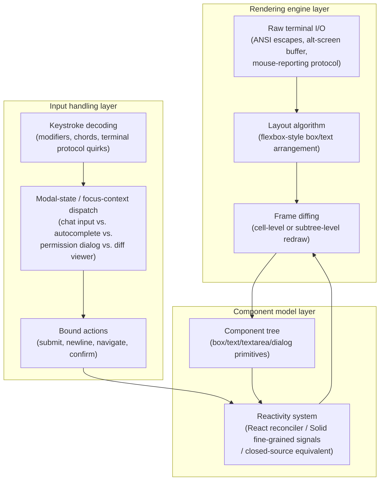
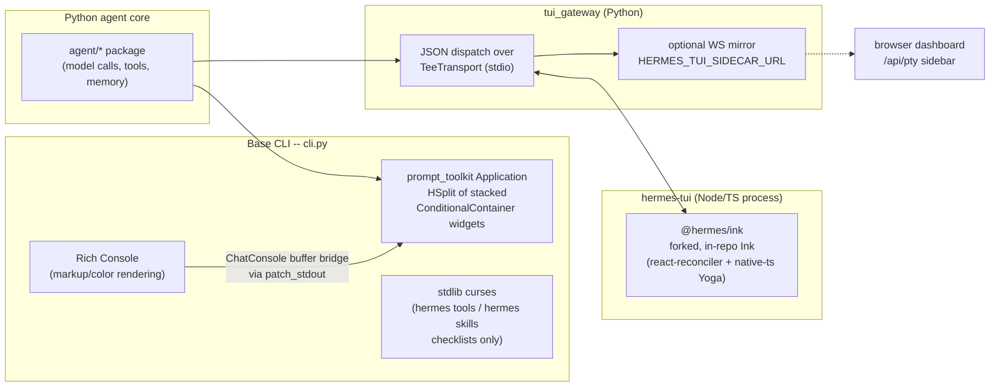

# TUI/CLI application architecture -- the rendering engine, component model, and input layer

**Scope note.** [streaming-and-incremental-rendering.md](streaming-and-incremental-rendering.md)
already covers, in depth, the buffering/reassembly/pacing problem that sits
between a wire-level token stream and a terminal update -- how a partial
`tool_use` argument string is accumulated, how Markdown gets frozen/healed/
reused mid-stream, and how display pace is decoupled from network delivery
cadence. This page does not re-derive any of that. It sits one layer over,
describing the application-architecture question that page deliberately
leaves aside: what rendering engine actually draws pixels-as-characters to
the terminal, what component/widget abstraction the interactive UI is built
from, and how the harness reads and dispatches keyboard/mouse input across
the many distinct interactive surfaces a coding-agent CLI actually has (a
chat prompt, an autocomplete popup, a permission dialog, a diff viewer, a
session list, a theme picker, and so on). Where the two pages' subject
matter overlaps -- Claude Code's Yoga-layout-engine swap, the cell-based
renderer, synchronized-terminal-output flicker fixes -- this page names the
fact once for architectural context and points back to
streaming-and-incremental-rendering.md's own dated changelog citations
rather than re-quoting them.

This is explicitly scoped as narrower, "table stakes" coverage relative to
this book's design-space pages: a terminal-UI rendering stack is table-stakes
engineering every mature CLI agent needs, not a differentiating design
decision the way orchestration or context compression are. Claude Code and
Copilot CLI are both closed source, so this page's account of their internal
component architecture is necessarily reconstructed from their own
documentation, their own changelogs, and a small number of directly-fetched
third-party sources named and bounded explicitly below -- never assumed or
carried over from OpenCode's fully source-readable implementation, which is
treated as its own independent case throughout.

---

## 1. Claude Code

### 1.1 Rendering engine

[streaming-and-incremental-rendering.md](streaming-and-incremental-rendering.md)
§1.1 already establishes, VERIFIED from Claude Code's own `CHANGELOG.md`, that
the terminal renderer is built on a Flexbox-style layout algorithm: v2.1.85
"replac[ed] WASM yoga-layout with a pure TypeScript implementation" to fix a
scroll-performance regression, and v2.1.174 made a "cell-based terminal
renderer... enabled for all users by default." That page does not go further
into what UI framework sits above that layout engine, because its own
subject is reassembly and reveal pacing, not component architecture -- this
page picks that specific thread up.

Two bounded, named sources, both fetched fresh this session, together give
the clearest publicly available picture of what that framework actually is.
First, `github.com/vadimdemedes/ink`'s own README, fetched this session,
lists Claude Code by name (described there as "An agentic coding tool made
by Anthropic") in its "Who's Using Ink?" adopters section, alongside GitHub
Copilot CLI, Google's Gemini CLI, and Canva's CLI. This is VERIFIED only as
far as the claim itself goes -- Ink's own README states this -- and that
bound matters: an adopters list in a dependency's own README is not the same
kind of source as Claude Code's own docs or its own CHANGELOG.md, and this
book cannot independently confirm from `code.claude.com/docs` or
`github.com/anthropics/claude-code` that the claim is accurate or current,
since neither of those sources documents the CLI's internal rendering
framework at all. Ink itself is a React reconciler for terminal output --
components render to `<Text>`/`<Box>` primitives, and Ink's own
Flexbox-via-Yoga layout is exactly the mechanism the Claude Code changelog's
WASM-to-TS swap (§1.1 above) is consistent with, which is the second reason
this claim reads as plausible rather than merely asserted.

Second, and separately, [streaming-and-incremental-rendering.md](streaming-and-incremental-rendering.md)
§1.1 already names, and explicitly declines to adopt as fact, a set of
third-party reverse-engineering write-ups (`claude-harness.dev`,
`claude-code-from-source.com`, and similar) describing Claude Code's
renderer as "originally forked from Ink... and since rewritten well beyond
it," citing packed typed-array cell buffers, double-buffered diffing, and an
`<Static>`-component-style freeze-once-rendered optimization as evidence of
substantial custom engineering layered on top of an Ink-shaped foundation.
Read together, the two sources are consistent with each other -- an
Ink-descended, heavily customized renderer, with its own from-scratch layout
engine swap and a cell-based diffing strategy that goes well beyond what
Ink ships out of the box -- but this page holds both at BEST CURRENT
UNDERSTANDING, UNCONFIRMED beyond the bare, directly-quoted facts each source
actually states, exactly as streaming-and-incremental-rendering.md already
does. No source available to this book states outright, in Anthropic's own
words, "Claude Code's renderer is/was built on Ink."

The CLI ships **two distinct rendering paths**, not one, and this is
VERIFIED directly from `code.claude.com/docs/en/fullscreen` and
`code.claude.com/docs/en/terminal-config`, fetched fresh this session. The
"classic" renderer keeps the conversation in the terminal's native
scrollback buffer, painting new content by writing further down the
terminal in the ordinary way a shell prints output -- this is what
[streaming-and-incremental-rendering.md](streaming-and-incremental-rendering.md)'s
`CLAUDE_CODE_NO_FLICKER` and early synchronized-output fixes were patching
around. "Fullscreen rendering" (opt-in via `/tui fullscreen`, defaulted on
for accounts created on or after 6 May 2026, opt-out via `/tui default`) is
a categorically different rendering mode: it draws to the terminal's
**alternate screen buffer** the way `vim` or `htop` do, keeps the input box
fixed at the bottom of the screen, renders "only messages that are currently
visible" (a virtualized render tree, distinct from -- but functionally
overlapping with -- the `NO_FLICKER` virtualized-scrollback mode
streaming-and-incremental-rendering.md §1.1 already names), and adds native
mouse support (click-to-position-cursor in the input, click-to-select in
list/menu dialogs including permission prompts, click-to-expand a collapsed
tool result, click-and-drag text selection with iTerm2-matching word
boundaries). Because the conversation now lives outside the terminal's own
scrollback, the docs describe a deliberate compensating feature set: `Ctrl+O`
enters a `less`-style transcript-search mode with `/`-search, `n`/`N`
next/previous-match, and vi-style `j`/`k`/`g`/`G` navigation, and a `[` key
inside that mode writes the full conversation back out into the terminal's
native scrollback on demand so external tools (`Cmd+f`, tmux copy mode) can
search it after all. The docs also flag genuine terminal-compatibility limits
of this architecture directly: fullscreen rendering is incompatible with
iTerm2's `tmux -CC` integration mode (the alternate-screen buffer and mouse
tracking do not work correctly there), and pre-3.6-series tmux lacks
synchronized-output support entirely, so fullscreen rendering can flicker
*more* under old tmux than the classic renderer does -- a second, independent
data point (beyond streaming-and-incremental-rendering.md's already-catalogued
history) that this architectural choice is not a strict win in every terminal
environment.

### 1.2 Component model: contexts as the documented proxy for a component tree

Claude Code's implementation is closed source, so no source available to this
book directly enumerates its component tree. What `code.claude.com/docs/en/keybindings`
does document, VERIFIED and fetched fresh this session, is a **context**
taxonomy that functions as strong indirect evidence of a real, modular
component/focus architecture underneath: every keybinding is scoped to one of
19 named contexts -- `Global`, `Chat` (main input area), `Autocomplete`
(suggestion menu open), `Settings`, `Confirmation` (permission and
confirmation dialogs), `Tabs`, `Help`, `Transcript` (the `less`-style viewer),
`HistorySearch` (`Ctrl+R`), `Task` (a background subagent is running),
`ThemePicker`, `Attachments` (image navigation in select dialogs), `Footer`
(the status-line's own navigable indicator row for tasks/teams/diffs/
artifacts), `MessageSelector` (the `/rewind` dialog's message-picking list),
`DiffDialog`, `ModelPicker`, `Select` (generic list/menu components reused
across multiple dialogs), `Plugin` (the plugin browse/install dialog), and
`Scroll` (fullscreen-mode conversation scrolling and text selection). Each
context has its own bound action vocabulary (e.g. `Confirmation`'s
`confirm:yes`/`confirm:no`/`confirm:toggleExplanation`; `DiffDialog`'s
`diff:previousFile`/`diff:nextFile`/`diff:viewDetails`), which is the
documentation's own evidence that these are genuinely separate, independently
interactive UI surfaces rather than one monolithic input loop with
conditional branches -- a `Select` context, in particular, is explicitly
described as reused across multiple different dialogs, which is exactly the
generic-selectable-list-component pattern a real component library would
implement once and instantiate many times. What this page cannot confirm,
absent Claude Code's own implementation source, is whether that context
taxonomy maps one-to-one onto actual framework components (as it would in an
Ink/React tree, where each context plausibly corresponds to one mounted
component subscribing to its own keypress handler) or is instead a purely
logical dispatch-routing layer independent of the rendering framework's own
component boundaries -- flagged here as BEST CURRENT UNDERSTANDING,
UNCONFIRMED, leaning toward the former given §1.1's Ink-adjacent evidence,
but not stated as settled fact.

### 1.3 Input handling

**Multi-line input.** VERIFIED, `code.claude.com/docs/en/terminal-config`,
fetched fresh this session: Enter submits; a line break without submitting
is `Ctrl+J` or a literal backslash followed by Enter, both guaranteed to work
in every terminal with no setup. `Shift+Enter` also inserts a newline, but
its terminal-level support is bounded and documented explicitly per emulator
-- native support in Ghostty/Kitty/iTerm2/WezTerm/Warp/Apple Terminal/Windows
Terminal; requires running `/terminal-setup` once (which writes a keybinding
directly into the *host terminal's* own config file) in VS Code, Cursor,
Devin Desktop, Alacritty, and Zed; and is simply unavailable in
gnome-terminal and JetBrains IDE terminals, where `Ctrl+J`/backslash-Enter
are the only options. This terminal-capability-detection burden -- some
keystrokes require cooperation from the outer terminal emulator, not just
the CLI's own input parser -- recurs as a genuine architectural constraint
throughout Claude Code's input-handling documentation (e.g. Option-key/Meta
configuration on macOS, `CLAUDE_CODE_SCROLL_SPEED`'s per-terminal
wheel-event-multiplier problem, kitty-keyboard-protocol-gated `Cmd+c`
support).

**Large-paste handling.** VERIFIED, same source: pasting more than 800
characters or more than two lines collapses the input to a placeholder (e.g.
`[Pasted text #1 +120 lines]`) so the prompt box stays visually usable, with
the full content cached under `~/.claude/paste-cache/` and resent verbatim on
submit -- including from a recalled command-history entry in a *later*
session, until the retention sweep (governed by the same `cleanupPeriodDays`
setting [session-persistence.md](session-persistence.md) documents for
transcript retention) deletes the cache file, at which point Claude Code
detects the now-missing reference and either strips the placeholder (plain
prompt) or blocks the submission entirely (shell-mode or slash-command input,
where silently dropping content would change what actually runs).

**Vim mode.** VERIFIED, same source, cross-referenced against
`code.claude.com/docs/en/interactive-mode`: an opt-in vim-style prompt editor
(`/config` -> Editor mode, or `editorMode: "vim"` in `settings.json`)
supporting a documented subset of NORMAL/VISUAL-mode motions and operators
(`hjkl`, `v`/`V` selection, `d`/`c`/`y` with text objects). The docs are
explicit about where vim mode's authority ends and the keybinding system's
begins: "Vim mode handles input at the text input level... Keybindings
handle actions at the component level" -- i.e. these are stated by Claude
Code's own docs to be two independently-operating input-handling layers, one
scoped to the prompt textarea's internal cursor/selection state machine and
one scoped to component-level actions (submit, toggle, navigate), with
`Escape` in vim mode switching INSERT->NORMAL rather than firing
`chat:cancel`, and most `Ctrl`+key chords passing through vim mode
unmodified to the keybinding dispatcher underneath. Vim motions themselves
are declared non-remappable through the keybindings file (a separate,
narrower `vimInsertModeRemaps` setting exists only for two-key INSERT-mode
sequences like mapping `jj` to Escape).

**The keybindings configuration system.** VERIFIED, `code.claude.com/docs/en/keybindings`,
fetched fresh this session -- `~/.claude/keybindings.json` is an array of
`{context, bindings}` blocks, each mapping a keystroke string to either an
action name (`"namespace:action"` format, e.g. `chat:submit`,
`app:toggleTodos`) or `null` to unbind a default. The keystroke grammar
supports modifiers (`ctrl`, `shift`, `alt`/`opt`/`option`/`meta`,
`cmd`/`command`/`super`/`win` -- the last group explicitly noted to require
Kitty-keyboard-protocol or `modifyOtherKeys` terminal support and therefore
unreliable as a portable binding target), a Shift-implied-by-uppercase-letter
convention that is explicitly suspended once any other modifier is present
(`ctrl+K` == `ctrl+k`, not `ctrl+shift+k`), and multi-keystroke **chords**
(space-separated sequences, e.g. `ctrl+x ctrl+e`) with documented
prefix-reservation semantics -- a chord in any active context keeps its
prefix reserved globally, so freeing a prefix like `ctrl+x` for reuse as a
single-key binding requires unbinding every chord across every context that
starts with it. Four shortcuts are hardcoded and cannot be rebound at all
(`Ctrl+C` interrupt, `Ctrl+D` exit, `Ctrl+M` -- identical to Enter at the
terminal protocol level -- and Caps Lock, which the docs note is never
delivered to terminal applications in the first place), and the docs name
three real terminal-multiplexer keystroke collisions (`Ctrl+B`/tmux prefix,
`Ctrl+A`/GNU screen prefix, `Ctrl+Z`/Unix SIGTSTP) as a known, unresolved
tension between the CLI's own binding space and the terminal ecosystem it
runs inside. Config changes are hot-reloaded (VERIFIED, same source: "changes
... are automatically detected and applied without restarting Claude Code").

**Modal states -- permission prompts as a first-class `Confirmation`
context.** [permissions-and-sandboxing.md](permissions-and-sandboxing.md)
already documents the approval-prompt UX and the underlying classifier
architecture in depth; this page adds only the input-handling-layer detail
those pages don't cover. The `Confirmation` context (§1.2) is a single
generic modal-dialog input handler reused for both permission prompts and
plainer confirmation dialogs, with actions including `confirm:yes`/
`confirm:no` (bound to `Y`/`Enter` and `N`/`Escape`), `confirm:cycleMode`
(`Shift+Tab`, cycling permission modes directly from inside an open prompt),
and a permission-specific `confirm:toggleExplanation` bound to `Ctrl+E` that
toggles a model-generated natural-language explanation of a pending Bash/
PowerShell command inline in the same dialog -- i.e. the permission prompt is
not a static yes/no gate but a modal component with its own secondary
disclosure state (explanation shown/hidden) layered on top of the base
accept/reject choice. In fullscreen rendering specifically, permission
prompts and other dialogs "that need a response still scroll into view
regardless of" the user's auto-scroll setting, confirming the renderer treats
an open modal as taking display priority over the ordinary streaming-text
auto-follow behavior [streaming-and-incremental-rendering.md](streaming-and-incremental-rendering.md)
otherwise governs.

---

## 2. GitHub Copilot CLI

### 2.1 Rendering engine

VERIFIED, and considerably more directly confirmed than Claude Code's case:
two independently-fetched sources this session both name **Ink** by name as
Copilot CLI's rendering framework. `github.com/vadimdemedes/ink`'s own README
lists "GitHub Copilot CLI" (described there as "Just say what you want the
shell to do") in the same "Who's Using Ink?" adopters section discussed in
§1.1 -- the same bounded caveat applies (an adopter's own listing in a
dependency's README, not GitHub's own documentation, is the source of this
specific claim). More substantively, GitHub's own engineering blog post
"From pixels to characters: the engineering behind GitHub Copilot CLI's
animated ASCII banner" (VERIFIED, `github.blog`, fetched fresh this session
-- an Anthropic/GitHub-engineering-blog-class source this book treats as
authoritative for whatever it itself documents) describes the CLI's startup
banner animation as implemented directly in Ink: components written in JSX
using Ink's `<Text>` and `<Box>` primitives, state-driven re-rendering via
React's own `useState`/`useEffect` hooks, and `setInterval`-based frame
advancement (roughly 20 frames across an 11x78-character area, an ~80ms
frame interval chosen explicitly to stay under a ~75ms/13fps threshold the
team identified as "can cause flicker in some terminals"). The post states
plainly that Ink "re-renders on every state change" and "doesn't manage
frame deltas," which the team names as the specific reason hand-crafted
animation logic -- manual cursor management via raw ANSI escape sequences and
`readline` utilities, plus a custom, segmented-character colorization pass
that groups consecutive same-colored characters to reduce ANSI escape-code
overhead -- was necessary layered on top of Ink rather than relying on Ink's
own re-render cycle to drive the animation smoothly. The post also states the
animation was engineered as "a non-blocking, best-effort enhancement --
visible when it could be rendered safely, but never at the expense of
startup performance or usability," and that the banner component alone
represents part of a codebase exceeding 6,000 lines of TypeScript (frame
definitions, dual light/dark ANSI theme mappings, and named "semantic
animation elements" such as `block_text`/`border`/`eyes`/`goggles` that
separate animation content from its runtime styling).

This is architecturally consistent with, and gives independent corroboration
to, [streaming-and-incremental-rendering.md](streaming-and-incremental-rendering.md)
§2.2's changelog-traced finding that Copilot CLI later shipped a "cell-based
terminal renderer... enabled for all users by default" (VERIFIED,
`github.com/github/copilot-cli` `changelog.md`, re-confirmed via a fresh grep
this session) -- the same terminology Claude Code's own changelog uses for
its own, independently engineered cell-diffing strategy (§1.1 above), which
this page treats as a striking naming coincidence worth flagging rather than
evidence either harness's implementation influenced the other: nothing
fetched this session establishes a shared origin, only that "cell-based
renderer" is evidently common vocabulary in this specific corner of terminal-
UI engineering (a cell-diffing strategy is also exactly what a from-scratch
custom layer built on top of Ink's own React-level re-render cycle would need
to add, since Ink itself does not natively diff at the individual-cell level
across frames).

### 2.2 Component model: modes as the primary modal-dispatch unit, not dialog contexts

Unlike Claude Code's context-per-keybindings-file taxonomy (§1.2), Copilot
CLI's own changelog documents its modal architecture primarily through a
**mode** abstraction cycled with `Tab`/`Shift+Tab`, and this abstraction has
a real, dated evolution worth tracing as evidence of genuine architectural
churn rather than a single fixed design. VERIFIED, `github.com/github/copilot-cli`
`changelog.md`, fetched and grepped fresh this session: an early entry states
plainly "Tab cycles modes forward, Shift+Tab backward; shell is now a mode"
-- confirming that at one point, "interactive," "plan," "autopilot," and
"shell" were siblings in a single cyclable mode list, the same architectural
slot a modal-state machine would occupy. A later entry reverses part of that
decision: "Shell mode removed from Shift+Tab cycle, accessed only via `!`" --
i.e. shell access was demoted from a cycled mode to a dedicated
single-keystroke trigger, an explicit UX simplification the changelog itself
frames as a deliberate mode-count reduction rather than a bug fix. Plan mode
and autopilot mode both carry real, enforced behavioral consequences beyond
display -- "Plan mode now hard-blocks built-in tool calls that would modify
the workspace," and a dedicated `exit_plan_mode` tool "is only offered to the
model while the session is in plan mode" -- confirming plan mode is not
merely a UI skin but a state that changes which tools the model-facing tool
schema itself exposes, the same tool-availability-as-a-function-of-mode
pattern [orchestration.md](orchestration.md) documents for OpenCode's own
`permission.task` glob mechanism, independently arrived at here for a
different mode axis entirely.

A second, structurally distinct modal surface is the **Sessions sidebar**
(VERIFIED, same changelog, first introduced behind `/experimental on`,
later made a default, persisted-across-restarts feature): a split-view panel
for managing multiple concurrent sessions, independently keyboard- and
mouse-navigable (arrow keys open and focus it and move the selection, `n`
spawns a session, pressing `x` twice closes one), with its own configurable
focus behavior (`sidebar.hoverFocus`, off by default; `sidebar.accentActiveSession`)
distinct from the main chat input's own focus state -- i.e. Copilot CLI's UI
has at least two independently-focusable regions active at once (the main
prompt and the sidebar), a genuinely different focus-management shape from
either Claude Code's single-context-at-a-time dispatch (§1.2) or OpenCode's
mode-stack architecture (§3.3 below), though this book has no source
confirming precisely how focus is arbitrated between the two regions
internally -- flagged as BEST CURRENT UNDERSTANDING, UNCONFIRMED beyond the
bare changelog-documented behaviors themselves.

A third finding, genuinely load-bearing for how "modal state" and
"permission/approval UX" interact architecturally: autopilot mode is
documented to **suppress** the same dialogs plan/interactive mode surface --
"Autopilot mode now auto-handles elicitation, ask_user, sampling, and
permission prompts... instead of surfacing dialogs to the user" -- meaning
the same underlying dialog components ([permissions-and-sandboxing.md](permissions-and-sandboxing.md)'s
already-documented approval UX, plus MCP elicitation and `ask_user` prompts)
are shown or silently auto-resolved depending on which mode is currently
active, rather than autopilot mode being a separate code path that skips
calling the permission system altogether. This is architecturally
significant: it means the mode value is read as an input by the same
dialog-invocation logic used in every other mode, not merely a display-layer
switch -- the modal-dialog and mode-state systems are coupled at the point
the CLI decides whether to render a blocking UI at all, not layered as fully
independent concerns.

### 2.3 Input handling

**Multi-line input.** VERIFIED via a GitHub Changelog post (`github.blog/changelog/2025-10-17-copilot-cli-multiline-input-...`,
title fetched via WebSearch this session and cross-confirmed against the
`changelog.md` entries this session's grep surfaced) and `docs.github.com/en/copilot/how-tos/copilot-cli/use-copilot-cli/overview`
(fetched fresh this session): `Shift+Enter` inserts a newline in terminals
supporting the Kitty keyboard protocol, and the VS Code integrated terminal
(and its forks) requires running `/terminal-setup` first -- the same
outer-terminal-cooperation pattern Claude Code's `/terminal-setup` addresses
for the identical `Shift+Enter` problem (§1.3), independently implemented by
a different team for the same underlying terminal-protocol limitation. Two
GitHub Issues surfaced via WebSearch this session (#14 and #1594, both
`github/copilot-cli`) request multi-line support in "regular terminals" not
already covered by this mechanism, indicating the feature's terminal-support
boundary remains a live, user-visible gap as of this session -- named here as
a WebSearch-surfaced lead corroborating the changelog's own scoped claim, not
independently verified beyond the issue titles themselves.

**Permission and trust dialogs.** VERIFIED, `docs.github.com/en/copilot/how-tos/copilot-cli/use-copilot-cli/overview`,
fetched fresh this session: approval prompts for tool use that could modify
or execute files present three options -- "Yes" (one-time), "Yes, and
approve TOOL for the rest of the running session," and "No, and tell Copilot
what to do differently (Esc)" -- with the third option notably combining
rejection *and* a free-text redirection channel in one dialog choice, a
different shape from Claude Code's separate accept/reject/explain-toggle
combination (§1.3). A distinct, first-run "folder trust" dialog (proceed for
this session only / remember this folder / exit) gates the CLI's very first
interaction with a new working directory, architecturally comparable to
[permissions-and-sandboxing.md](permissions-and-sandboxing.md)'s documented
directory-scope default but surfaced here specifically as a modal
first-launch dialog rather than a background policy check.

**Documented keyboard shortcuts** (VERIFIED, same source, plus the
changelog's own `/help` entries grepped this session): `Escape` interrupts a
running operation, `Shift+Tab` cycles modes (§2.2), `Tab` navigates fields in
multi-field forms (e.g. adding an MCP server) and completes file paths,
arrow keys navigate a file-path completion list, `Ctrl+S` saves an MCP-server
form, `Ctrl+T` toggles visibility of the model's reasoning trace, `Ctrl+O`
expands the most recent timeline item and `Ctrl+E` expands all of them,
`Ctrl+K` deletes from cursor to end of line (a readline-style binding), and
`Ctrl+X` followed by `/` inserts a slash command mid-prompt without needing
to retype it -- itself a small chord-based modal micro-state (an "insert
slash command here" pending mode) conceptually similar to, though far
simpler than, OpenCode's leader-key chord system (§3.3). A dedicated
interactive `$`-prefixed shell shortcut (`/settings shellShortcut on`,
off by default) opens a shell in the current session directory, and the
changelog confirms this shortcut works even while the agent is actively
working -- a genuine concurrent-modal-state case (the agent loop running in
the background while a manually-opened shell is simultaneously focused in
the foreground).

---

## 3. OpenCode

Unlike §1 and §2, OpenCode's TUI (`packages/tui`, `dev` branch -- not a
stable release tag, per this project's standing flag) is fully
source-inspectable, and every claim in this section is read directly from
source located via the GitHub API tree endpoint and fetched via
`raw.githubusercontent.com` this session, the same workaround
[streaming-and-incremental-rendering.md](streaming-and-incremental-rendering.md)
§3 and other pages in this book already document for this platform's `gh
api` base64-decoding limitation.

### 3.1 Rendering engine: OpenTUI, a native Zig core with a SolidJS reconciler

VERIFIED, `github.com/anomalyco/opentui`'s own README and `opentui.com/docs/getting-started`,
both fetched fresh this session. OpenTUI is "a native terminal UI core
written in Zig with TypeScript bindings," exposing "a C ABI for other
language bindings" -- i.e. the actual character-cell rendering and terminal
I/O happen in compiled Zig code, not in JavaScript, with the TypeScript layer
binding into it across an FFI boundary. Layout is documented explicitly as
Flexbox ("Layout covers Flexbox sizing and positioning"), the same layout
paradigm §1.1 finds Claude Code's own changelog consistent with (Yoga) and
Ink itself uses under the hood for both harnesses in §1-§2 -- three
independent projects converging on the identical layout algorithm family for
terminal UI, worth naming as a real, repeated pattern rather than a
coincidence specific to one harness. OpenTUI ships three consumption modes
documented directly on its getting-started page: a low-level, factory-based
"Core API" (`@opentui/core`, used directly and imperatively), a React
reconciler (`@opentui/react`), and a Solid reconciler (`@opentui/solid`) --
with the docs stating explicitly that "the same renderer and components
support the React and Solid bindings," i.e. the native Zig renderer is
genuinely framework-agnostic and the JS-side reconciler choice is a separate,
swappable layer on top of it. OpenCode's own `packages/tui/package.json`
(read in full this session) confirms its dependency choice concretely:
`@opentui/core`, `@opentui/solid`, `@opentui/keymap` (§3.3), and
`opentui-spinner`, with no `@opentui/react` dependency present -- OpenCode
uses the Solid reconciler, not the React one, a real and verifiable (not
inferred) architectural choice.

This SolidJS choice is the same fact
[streaming-and-incremental-rendering.md](streaming-and-incremental-rendering.md)'s
own synthesis table already names in passing ("SolidJS fine-grained reactive
signals" as the mechanism behind OpenCode's render-cost discipline) --
this page adds the concrete evidence for *why* that framing is accurate: the
`createStore`/`createMemo`/`createSignal` primitives visible throughout every
`packages/tui/src/**/*.tsx` file read this session (e.g. `context/permission.tsx`'s
`createStore`-backed permission-mode state, `routes/session/permission.tsx`'s
per-dialog `createStore`/`createMemo` local state) are Solid's own
fine-grained reactivity primitives, each one independently tracking only the
specific state slice it reads -- architecturally the reason a change to one
value (e.g. a dialog's currently-selected option) re-renders only the
JSX expression that reads that value, not a virtual-DOM-diffed subtree the
way a React-style reconciler would.

### 3.2 Component model: a real primitive/composite/dialog hierarchy

Reading `packages/tui/src/routes/session/permission.tsx` (full file, read
this session, already partially quoted in
[streaming-and-incremental-rendering.md](streaming-and-incremental-rendering.md)
§3.2 for an unrelated finding) end to end reveals a genuine, three-tier
component hierarchy that generalizes across the rest of the package's file
layout (`packages/tui/src/component/`, `packages/tui/src/ui/`,
`packages/tui/src/routes/`, all enumerated via a full recursive GitHub-API
tree listing this session):

- **Primitive intrinsics** -- `<box>` (a Flexbox container with `flexDirection`,
  `gap`, `padding*`, `backgroundColor`, `border`, and even absolute
  `position`/`top`/`bottom`/`left`/`right` props for overlay placement),
  `<text>` (with inline `` segments for
  mixed-color text within one line), `<textarea>` (a focus-managed,
  cursor-styled text-input primitive, seen driving both the main prompt
  input in `component/prompt/index.tsx` and the permission-rejection
  free-text field in `routes/session/permission.tsx`'s `RejectPrompt`), and
  a `<scrollbox>`/`<diff>` pair used specifically for rendering a scrollable
  syntax-highlighted diff inside the permission dialog's own `EditBody`
  sub-component (with `view()` computed reactively as `"split"` or
  `"unified"` depending on live terminal width via `useTerminalDimensions()`
  -- a responsive-layout decision recomputed on every resize, not a
  fixed choice).
- **Composite widgets** built from those primitives and given their own
  file, e.g. `component/spinner.tsx`, `component/todo-item.tsx`,
  `ui/toast.tsx`, and the reusable generic `Prompt<T>` component defined
  *inside* `permission.tsx` itself -- a parametrized modal-with-N-options
  component (`title`, optional `header`, `body`, an `options: Record<string,
  string>` map, an optional `escapeKey`, and a `fullscreen` flag) that
  `PermissionPrompt` instantiates three separate times for three different
  permission stages (see §3.4) rather than each stage hand-rolling its own
  dialog chrome -- direct, source-confirmed evidence of the
  build-once-instantiate-many-times component pattern §1.2 could only
  speculate about for Claude Code.
- **Feature-scoped dialogs and routes** -- a large, enumerable set of
  `dialog-*.tsx` files (`dialog-agent.tsx`, `dialog-mcp.tsx`,
  `dialog-model.tsx`, `dialog-provider.tsx`, `dialog-session-list.tsx`,
  `dialog-skill.tsx`, `dialog-theme-list.tsx`, `dialog-workspace-list.tsx`,
  and more, both at `packages/tui/src/component/` and, for
  session-specific dialogs, `packages/tui/src/routes/session/`
  -- `dialog-fork-from-timeline.tsx`, `dialog-message.tsx`,
  `dialog-subagent.tsx`, `dialog-timeline.tsx`), plus a smaller,
  generic `ui/dialog-*.tsx` family (`dialog-alert.tsx`, `dialog-confirm.tsx`,
  `dialog-help.tsx`, `dialog-prompt.tsx`, `dialog-select.tsx`) that reads as
  the shared, non-feature-specific dialog toolkit those feature dialogs are
  themselves plausibly built from (a `Select`-style generic list dialog
  playing the same reuse role Claude Code's own `Select` keybinding context,
  §1.2, plays for Claude Code -- though here the reuse is directly
  confirmed in source, not inferred from a keybindings-context taxonomy).

`routes/session/permission.tsx`'s `PermissionPrompt` component itself
demonstrates real content-adaptive rendering: a single `Switch`/`Match`
block inspects `props.request.permission` (`"edit"`, `"read"`, `"glob"`,
`"grep"`, `"list"`, `"bash"`, `"task"`, `"webfetch"`, `"websearch"`,
`"external_directory"`, `"doom_loop"`, or a generic fallback) and renders a
different icon, title string, and body layout for each -- e.g. `"edit"`
renders the full diff viewer (`EditBody`), `"bash"` renders the literal
shell command prefixed with `"$ "`, `"task"` renders the subagent type and
description, and an unrecognized permission kind falls back to a generic
"Call tool `<name>`" body -- meaning the permission dialog is not one
generic template but a real dispatch table over the same permission-kind
vocabulary [built-in-tools.md](built-in-tools.md) and
[permissions-and-sandboxing.md](permissions-and-sandboxing.md) already
document at the policy-enforcement layer, reused here for presentation.

### 3.3 Input handling: `@opentui/keymap`'s mode-stack architecture

This is OpenCode's most structurally distinctive finding relative to either
closed-source harness above, and it is fully source-verified.
`packages/tui/src/keymap.tsx` (read this session) wraps a separate library,
`@opentui/keymap`, and its own `/solid` bindings (`useKeymap`, `useBindings`,
`useKeymapSelector`), around a **mode-stack** abstraction it defines itself:
`createOpencodeModeStack()` maintains a plain array of `{id, mode}` entries,
exposes `push(mode)` (returning a pop function, i.e. a scoped-disposal
pattern any component can call from its own lifecycle) and `current()`
(returning the top of the stack or a fallback `OPENCODE_BASE_MODE`), and
writes the active mode into the keymap's own `registerLayerFields()`
mechanism so that every registered keybinding can declare `mode:
"<name>"` as a **precondition** on when it fires at all -- i.e. a keybinding
is not merely "active" or "inactive" globally, it is scoped to whichever
mode currently sits on top of the stack, and pushing a new mode
transparently shadows every binding that doesn't declare that mode without
those bindings needing to be explicitly disabled. This is architecturally
closer to a text editor's own modal-editing engine (Vim's own normal/insert/
visual mode stack, or Emacs's minor/major-mode composition) than to either
Claude Code's flat per-context keybindings file (§1.2) or Copilot CLI's
single cycled-mode list (§2.2) -- a genuine third design point on the same
"how does a terminal UI scope which keys do what" question this page is
tracing across all three harnesses.

`config/keybind.ts` (full file, read this session) is the concrete keybinding
*vocabulary* layered on top of that mode-stack mechanism, and its scale is
worth stating directly: well over 150 named actions across app-level
(`app_exit`, `app_debug`), diff-viewer (`diff_open`/`diff_next_hunk`/
`diff_toggle_view`, 19 actions total), session-management (`session_new`,
`session_fork`, nine numbered `session_quick_switch_N` slots), model/agent
selection, and a genuinely editor-grade `input_*` family -- `input_move_left`/
`input_select_left`/`input_line_home`/`input_visual_line_home`/
`input_word_forward`/`input_delete_word_backward`/`input_undo`/`input_redo`,
36 distinct input-editing actions in total, each with terminal-portable
default chords (e.g. `input_word_backward: "alt+f,alt+right,ctrl+right"`,
several alternative keystrokes bound to the same action to cover different
terminal/OS keyboard-modifier conventions). A dedicated **leader key**
mechanism (`LeaderDefault = "ctrl+x"`) is a first-class part of the schema
itself -- multiple actions bind through `<leader>` placeholders (`<leader>e`
opens an external editor, `<leader>n` creates a new session, `<leader>1`
through `<leader>9` are additional quick-switch slots distinct from the
plain-`<leader>N` ones) -- and a companion **which-key** panel
(`feature-plugins/system/which-key.tsx`, confirmed present in the file tree
and referenced by name via `which_key_toggle`/`which_key_group_next`/
`which_key_scroll_up` bindings in the same keybind file) is the Vim-plugin-
pattern discoverability UI that shows pending leader-key completions as they
are typed -- a feature with no documented or source-confirmed equivalent in
either Claude Code or Copilot CLI.

The permission dialog itself (§3.2) demonstrates this mode-stack mechanism
in concrete use, not just in the abstract schema: `RejectPrompt` (the
free-text rejection sub-dialog reached from `PermissionPrompt`'s `"reject"`
stage) calls `useBindings(() => ({mode: OPENCODE_BASE_MODE, commands: [...],
bindings: [...]}))` to register a **local**, component-scoped keybinding set
-- `escape` cancels back to the permission stage, `return` submits the typed
rejection reason via `input.plainText` (a direct read off the mounted
`<textarea>` ref) -- confirming keybinding registration in this architecture
is genuinely component-lifecycle-scoped (registered on mount, presumably
torn down on unmount via the same disposal pattern `push()` returns) rather
than a single static global table consulted by string lookup. The shared
`Prompt<T>` component (§3.2) registers its own left/right/`h`/`l`
option-cycling bindings and a fullscreen-toggle binding
(`permission.prompt.fullscreen`, default `Ctrl+F`) the same way, and its
fullscreen-expanded state renders through a `<Portal>` -- Solid's own
out-of-tree-render primitive -- to an absolute-positioned, near-full-height
box, a direct, source-confirmed analogue of Claude Code's own
mouse-click-to-expand collapsed-tool-result and fullscreen-dialog behaviors
(§1.1/§1.3) implemented via a completely different, independently-engineered
mechanism.

**Mouse support** is present but architecturally lighter-weight than
Claude Code's fullscreen-mode click handling (§1.1): the `Prompt` component's
option boxes each carry direct `onMouseOver`/`onMouseUp` handlers
(`onMouseOver` moves the selection cursor to the hovered option;
`onMouseUp` both selects and immediately confirms it), a simple
per-element event-handler pattern rather than a renderer-level captured
mouse-tracking layer with its own documented modifier-key/OS-specific
quirks -- OpenCode's own docs/source checked this session name no equivalent
to Claude Code's documented `CLAUDE_CODE_DISABLE_MOUSE`/`CLAUDE_CODE_DISABLE_MOUSE_CLICKS`
opt-outs or Copilot CLI's sidebar hover-focus toggle, a real, if minor, scope
gap this page flags rather than papers over.

### 3.4 A genuinely remarkable interop finding: OpenCode's external-editor integration reads Claude Code's own IDE lock-file protocol

`packages/tui/src/editor.ts` (full file, read this session) implements
`openEditor()` -- spawning `$VISUAL`/`$EDITOR` against a temp file to let a
user compose a prompt in their own editor, the same feature Claude Code's
`chat:externalEditor` keybinding (§1.3, bound to `Ctrl+E`/`Ctrl+X Ctrl+E`)
exposes independently -- and, separately in the same file,
`discoverEditorConnection(directory)`. That second function reads
`~/.claude/ide/*.lock` files directly, parses each as JSON, checks a
`transport` field for the literal value `"ws"`, extracts a `workspaceFolders`
array, and scores each lock file by whether the calling `directory` falls
inside one of those folders -- i.e. **OpenCode's own TUI directly implements
a client for Claude Code's own documented IDE-connection lock-file protocol**
(the same `~/.claude/ide/` directory and lock-file discovery mechanism
[memory-management.md](memory-management.md) and other pages in this book
have not previously needed to name, since it belongs to Claude Code's
IDE-integration surface rather than any topic already covered) in order to
find a locally-running IDE and sync editor text-selection state
(`editorIntegration.selection`, delegating to a separate `resolveZedSelection`/
`resolveZedDbPath` pair for Zed specifically) into its own prompt-composition
flow. This is a real, source-confirmed, and genuinely unusual finding: a
fully independent, open-source harness reading and interoperating with a
closed-source competitor's own undocumented-elsewhere-in-this-book local
IDE-bridge file format, directly comparable in kind (not degree) to
[configuration.md](configuration.md)'s already-documented finding that
Copilot CLI reads Claude Code's `.claude/settings.json` directly as a
cross-harness interop measure -- a second, independently-discovered instance
of the same pattern (one harness treating another's on-disk protocol as a
stable integration surface worth targeting) rather than a one-off.

---

## 4. pi

Sources for this section: VERIFIED, fetched 1 September 2026 directly from
`github.com/earendil-works/pi`, `main` branch -- `packages/tui/package.json`
and `packages/tui/README.md` in full, a recursive directory listing of
`packages/tui/src/` and `packages/tui/src/components/`, `packages/tui/src/native-modifiers.ts`
and `packages/tui/src/native-module-path.ts` in full, `packages/tui/src/keybindings.ts`
in full, `packages/coding-agent/package.json`, `packages/ai/package.json`, and
`packages/client/package.json` in full, a directory listing of
`packages/coding-agent/src/modes/` and `packages/coding-agent/src/modes/interactive/`
and `packages/coding-agent/src/modes/interactive/components/`, and the opening
~90 lines of `packages/coding-agent/src/modes/interactive/interactive-mode.ts`
together with the opening lines of `print-mode.ts` and `json-event.ts`. Unlike
Claude Code and Copilot CLI (§1-§2), and exactly like OpenCode (§3), pi's TUI
is fully source-inspectable -- every claim below is read from the package's
own source and its own README, not reconstructed indirectly.

**A package-naming finding worth resolving explicitly first, since this book
cites both spellings elsewhere.** [llm-api-contract.md](llm-api-contract.md)
§3.5, [auth-and-usage-accounting.md](auth-and-usage-accounting.md),
[context-compression.md](context-compression.md), and
[model-routing-and-selection.md](model-routing-and-selection.md) all cite
`@earendil-works/pi-ai`, while [deterministic-orchestration.md](deterministic-orchestration.md)
and [session-persistence.md](session-persistence.md) cite
`@earendil-works/pi-coding-agent`. Reading all three relevant `package.json`
files directly this session resolves this as **not an error**: pi is a
monorepo (`github.com/earendil-works/pi`) shipping several independently
versioned (all currently `0.84.4`), separately scoped npm packages, and each
citation in this book is naming the correct package for the topic it covers.
`packages/ai/package.json`'s `name` field is literally `@earendil-works/pi-ai`
("Unified LLM API with automatic model discovery and provider configuration"),
`packages/coding-agent/package.json`'s is `@earendil-works/pi-coding-agent`
("Coding agent CLI with read, bash, edit, write tools and session management",
exposing the `pi` binary itself via its `bin` field), and -- the fact this
section adds -- `packages/tui/package.json`'s own `name` field is a **third**,
previously uncited package: `@earendil-works/pi-tui` ("Terminal User Interface
library with differential rendering for efficient text-based applications"),
authored, per its own `package.json` `author` field, by Mario Zechner -- the
same first-party voice [permissions-and-sandboxing.md](permissions-and-sandboxing.md)
§5 already cites for pi's own design-rationale blog post. `interactive-mode.ts`'s
own import statements (`import ... from "@earendil-works/pi-tui"`, read
directly this session) confirm the coding-agent package consumes this exact
package by that exact name at the source level, not merely in its own
`package.json` metadata.

### 4.1 Rendering engine: `pi-tui`, a from-scratch, dependency-free TUI framework

VERIFIED. `packages/tui/package.json`'s `dependencies` field lists exactly
two runtime packages: `get-east-asian-width` (wide-character-width
calculation, needed for correct column math with CJK and other double-width
glyphs) and `marked` (Markdown parsing, backing the built-in `Markdown`
component). There is no dependency on Ink, React, Solid, blessed, or OpenTUI
anywhere in this file -- `devDependencies` lists only `@xterm/headless`
(a headless terminal emulator, evidently used for testing rendering output
rather than shipped at runtime) and `chalk` (ANSI color styling). This
directly answers this book's own open question about pi's rendering stack:
unlike Claude Code and Copilot CLI's Ink-adjacent renderer (§1.1, §2.1) and
unlike OpenCode's OpenTUI-Zig-core-plus-Solid-reconciler stack (§3.1), pi
built its own terminal-UI framework from scratch, as a fourth, independently
engineered rendering stack, and open-sourced it as its own versioned package
rather than adopting an existing one.

The README (fetched in full this session) documents the framework's own
stated feature list directly: "differential rendering and synchronized output
for flicker-free interactive CLI applications." Differential rendering here
is explicitly **line-level**, not the individual-terminal-cell diffing this
book's other pages document for Claude Code's and Copilot CLI's own
"cell-based renderer" (§1.1, §2.1) -- the README states plainly that updates
touch "only changed lines or viewport rows," and the `Component` interface's
own contract (§4.2 below) requires every component to return `string[]`, one
already-styled string per output line, which is the concrete reason the
diffing granularity sits at the line rather than the cell. Synchronized
output is implemented via "CSI 2026" (VERIFIED, README's own feature list),
the identical terminal escape-sequence mechanism
[streaming-and-incremental-rendering.md](streaming-and-incremental-rendering.md)
already documents Claude Code and Copilot CLI using for the same
flicker-suppression purpose -- a fourth independent convergence on the same
terminal protocol feature, not a shared implementation.

Two swappable renderer implementations sit behind one shared `TUI` interface
(VERIFIED, README Quick Start and "Core API" sections, and the exported
`tui-main-screen.ts`/`tui-alt-screen.ts` source files): `TuiMainScreen`
"renders into the main terminal buffer and preserves terminal scrollback" --
architecturally the same choice as Claude Code's "classic" renderer (§1.1) --
while `TuiAltScreen` "renders a fixed-height viewport in the alternate
terminal buffer with application-owned scrolling," the same alt-screen-buffer
strategy Claude Code's opt-in "fullscreen rendering" mode (§1.1) implements
independently. `TuiAltScreen` specifically supports an explicit,
terminal-height-constrained layout tree built from `VStack`/`HStack`
(allocating constrained regions) and `ScrollView` (owning scrolling for one
region), with stack entries carrying `basis`, `grow`, `shrink`, `minSize`,
`maxSize`, and responsive `visible` callbacks -- this is, verbatim, CSS
Flexbox's own `flex-basis`/`flex-grow`/`flex-shrink` vocabulary, making pi's
own from-scratch layout engine a **fourth** independent implementation of the
same Flexbox-family layout model §1.1, §3.1 already find Claude Code/Ink
(via Yoga) and OpenCode (via OpenTUI's own native Flexbox implementation)
converging on. The primary `ScrollView` additionally supports jumping between
OSC 133 semantic-prompt markers and an in-viewport `Ctrl+Shift+F` search mode
with `Enter`/`Ctrl+G` next-match and `Escape`-to-close -- a source-confirmed,
close functional analogue of Claude Code's own `Ctrl+O` `less`-style
transcript-search mode (§1.3), independently engineered.

**Bracketed-paste handling** is a first-class, named README feature
("Handles large pastes correctly with markers for >10 line pastes"), the same
architectural problem Claude Code's >800-character/two-line paste-collapsing
mechanism (§1.3) solves, independently re-implemented here at a materially
different, lower threshold (10 lines rather than 800 characters or two
lines).

**Native, compiled modifier-key detection.** This is pi-tui's most
structurally distinctive rendering-layer finding, and it is fully
source-confirmed. `native-modifiers.ts` (read in full this session) loads a
platform- and architecture-gated native Node addon -- `darwin-modifiers.node`
on macOS, `win32-console-mode.node` on Windows, both restricted to `x64`/
`arm64` -- exposing a single `isModifierPressed(name: "shift" | "command" |
"control" | "option"): boolean` function, i.e. a compiled, OS-API-level check
of live modifier-key state that exists specifically because the ordinary
ANSI/terminal-escape-sequence input channel this book documents for the other
three harnesses (§1.3's Kitty-keyboard-protocol-gated `Cmd+c` support,
§2.3's Kitty-protocol-gated `Shift+Enter`) cannot always report modifier
state reliably on its own. `native-module-path.ts` (read in full) implements
a candidate-path resolution scheme -- first trying to resolve the installed
`@earendil-works/pi-tui` package location via `require.resolve`, then falling
back to paths relative to the running module and to the process's own
executable directory -- explicitly to support **both** an npm-installed
library consumer and pi's own standalone compiled binary (`packages/coding-agent`'s
`build:binary` script, read this session, compiles the whole CLI via `bun
build --compile` into a single `dist/pi` executable with no installed
`node_modules` tree to resolve against). No comparably-documented native
modifier-detection layer is confirmed for Claude Code, Copilot CLI, or
OpenCode in this book's existing coverage -- flagged as a real, if narrow,
architectural distinction rather than a superiority claim, since none of
those three harnesses' own sources were re-checked this session specifically
for the absence of an equivalent mechanism.

### 4.2 Component model: a plain-string-array render contract, no virtual DOM

VERIFIED, the README's own "Component Interface" section and
`packages/tui/src/components/` (directory listing read this session). Every
pi-tui component implements a three-method interface --
`render(width: number): string[]` (mandatory; each returned line "must not
exceed `width`," an invariant the TUI itself enforces and errors on if
violated), `handleInput?(data: string): void` (fires only on the focused
component, receiving raw terminal input including any unparsed ANSI escape
sequences), and `invalidate?(): void` (clears cached render state so the next
`render()` call rebuilds from scratch) -- and components are composed
**imperatively**, via `addChild()`/`removeChild()` calls building a plain
runtime object tree, not declaratively via JSX compiled through a reconciler
the way Ink (§1.1, §2.1) or OpenTUI's React/Solid bindings (§3.1) work. This
is architecturally the most different of the four rendering stacks this page
now covers on exactly this axis: there is no virtual-DOM diff, no
fine-grained-signal dependency graph, and no compiled JSX step anywhere in
pi-tui's own documented API -- a component's `render()` method is called
directly by the owning `TUI` instance and its returned line array is diffed
line-by-line against the previous frame (§4.1).

Built-in components, enumerated directly from the `packages/tui/src/components/`
file listing and the README's own worked examples: `Container` (a bare
child-grouping node), `Box` (padding plus an optional background-color
function applied to all children), `Text`/`TruncatedText` (word-wrapped
versus single-line-truncated text, both with configurable padding and a
background function), `Input` (single-line, horizontally-scrolling text
entry), `Editor` (multi-line, autocomplete- and paste-aware, vertically
scrolling when content exceeds the available height -- the component backing
the main prompt, per its own required `tui`-instance constructor argument for
height-aware scrolling), `Markdown` (syntax-highlighted, themeable rendering
via the `marked` dependency), `Loader`/`CancellableLoader` (spinners), a
`SelectList`/`SettingsList` pair (the generic reusable list/menu components,
directly analogous to Claude Code's `Select` keybindings-context, §1.2, and
OpenCode's own reusable dialog primitives, §3.2 -- here, as with OpenCode,
fully source-confirmed rather than inferred from a keybindings taxonomy),
`Spacer`, `Image` (Kitty- and iTerm2-graphics-protocol inline images, the same
capability [streaming-and-incremental-rendering.md](streaming-and-incremental-rendering.md)
and this page's §1.1/§3.1 document for the other harnesses' own terminal-image
support), and the `Stack`/`VStack`/`HStack`/`ScrollView` layout family
already named in §4.1.

**Overlays as the dialog-and-modal primitive.** VERIFIED, README's own
"Overlays" section: `tui.showOverlay(component, options)` renders a component
on top of existing content without replacing it, returning an `OverlayHandle`
with `hide()`/`setHidden()`/`isHidden()`/`focus()`/`unfocus()`/`isFocused()`
methods. Positioning is resolved through a documented, explicit precedence
order -- absolute `row`/`col` beats percentage `row`/`col` beats a named
`anchor` (`center`, the four corners, the four edge-midpoints), `minWidth`
is applied as a post-calculation floor, `margin` clamps the final position to
stay inside the terminal bounds, and a per-frame `visible(termWidth,
termHeight)` callback can hide an overlay responsively (e.g. on a narrow
terminal) -- and focus arbitration between multiple simultaneously-visible
overlays is explicit rather than implicit: calling `handle.unfocus()` returns
focus "to another visible capturing overlay or the previous focus target,"
while `handle.unfocus({target: component})` or `handle.unfocus({target:
null})` lets calling code direct focus precisely, including to no component
at all. This overlay-handle API is pi-tui's own answer to the same
multiple-simultaneously-active-modal-surfaces problem Claude Code's 19-context
keybindings taxonomy (§1.2) and Copilot CLI's independently-focusable Sessions
sidebar (§2.2) both address by different means -- here, uniquely among the
four harnesses this page covers, as an explicit, source-confirmed focus-handle
API rather than a declared context enum or a changelog-inferred behavior.

**The `Focusable` interface and IME cursor positioning.** VERIFIED, README:
a component that needs a visible or IME-trackable text cursor implements
`Focusable` (`focused: boolean`, set by the TUI on focus change) and emits a
zero-width `CURSOR_MARKER` escape sequence at the cursor's logical position
within its rendered line; the TUI scans the rendered output for that marker
and positions the real hardware terminal cursor there, keeping it hidden by
default (toggle via `showHardwareCursor`, `setShowHardwareCursor(true)`, or
`PI_HARDWARE_CURSOR=1`) since "some terminals require a visible hardware
cursor for IME positioning" -- an explicit, source-documented mechanism for
correctly placing a CJK input-method candidate window that this book's
existing coverage of Claude Code, Copilot CLI, and OpenCode does not name an
equivalent for (flagged as a pi-specific finding, not a claim the other three
lack the capability, since this session did not specifically re-check their
own sources for it). Container components that embed a focusable child
(a search dialog wrapping an `Input`, for instance) must themselves implement
`Focusable` and propagate their own `focused` state down to that child, or
IME candidate-window positioning breaks -- a documented composition
obligation on any dialog author building on top of these primitives.

**The coding-agent's own feature-scoped components, built on these
primitives.** VERIFIED, a directory listing of
`packages/coding-agent/src/modes/interactive/components/` read this session:
roughly forty files, each a composite widget built from the §4.2 primitives
above -- `model-selector.ts`, `session-selector.ts`/`session-selector-search.ts`,
`theme-selector.ts`, `trust-selector.ts`, `login-dialog.ts`, `oauth-selector.ts`,
`config-selector.ts`, `settings-selector.ts`/`settings-submenu.ts`,
`extension-selector.ts`/`extension-editor.ts`/`extension-input.ts`,
`skill-invocation-message.ts`, `diff.ts`, `tool-execution.ts`, `bash-execution.ts`,
`assistant-message.ts`/`user-message.ts`/`user-message-selector.ts`,
`branch-summary-message.ts`, `compaction-summary-message.ts` (cross-reference
[context-compression.md](context-compression.md)'s own pi section for what
these last two summarize, not repeated here), `first-time-setup.ts`,
`footer.ts`, `keybinding-hints.ts`, `mermaid.ts`, and `show-images-selector.ts`
among others -- the same feature-scoped-dialog-file pattern this page already
finds in OpenCode's `dialog-*.tsx` family (§3.2), here confirmed for a fourth
harness at the same level of source precision.

### 4.3 Input handling: CLI-invocation-time modes, not runtime-cycled ones, plus an overlay-dialog interior

This is the section that most directly answers this page's own "interaction-mode
structure" question, and pi's answer is structurally different in kind from
either Claude Code's per-context taxonomy (§1.2), Copilot CLI's `Tab`-cycled
mode list (§2.2), or OpenCode's push/pop mode-stack (§3.3).

VERIFIED, a directory listing of `packages/coding-agent/src/modes/` plus the
opening comments of `print-mode.ts`, `json-event.ts`, and the `rpc/`
subdirectory's own file names, all read this session: pi's own "mode"
concept operates at **CLI invocation time**, not as a runtime-cycled or
runtime-pushed state inside one running TUI. Four mutually exclusive entry
points exist as sibling modules under `src/modes/`: `interactive`
(the full TUI covered in §4.1-§4.2, entered by running `pi` with no
`--print`/`--mode` flag), `print-mode.ts` ("single-shot: send prompts, output
result, exit" -- documented in its own file header as backing both `pi -p
"prompt"` for plain text output and `pi --mode json "prompt"` for a
structured JSON event stream), `json-event.ts` (the event-serialization logic
`print-mode.ts` calls into for that JSON-event-stream case, converting
internal `AgentSessionEvent`s into a documented wire shape), and `rpc/`
(`rpc-mode.ts`, `rpc-client.ts`, `rpc-types.ts`, `jsonl.ts` -- a JSON-RPC
server mode). That `rpc` mode is the confirmed server side of a separate,
matching package, `@earendil-works/pi-client` (`packages/client/package.json`,
read in full this session), described in its own `description` field as a
"transport-neutral client for remote pi sessions over framed CBOR bytes" --
i.e. pi's four "modes" are better understood as four distinct **process
entry points/output formats** selected once at startup (interactive TUI,
one-shot text, one-shot JSON event stream, or a long-running RPC server for
an external client), not a single running interface whose modal state changes
mid-session the way Copilot CLI's `interactive`/`plan`/`autopilot`/`shell`
cycle (§2.2) or OpenCode's mode-stack (§3.3) both are.

**Inside interactive mode specifically**, keybinding registration is a
plain, declared-vocabulary registry rather than either Claude Code's
context-enum file (§1.2) or OpenCode's push/pop mode-stack (§3.3).
`packages/tui/src/keybindings.ts` (read in full this session) declares a
`Keybindings` TypeScript interface as pi-tui's own base action vocabulary --
`tui.editor.*` (cursor motion, word/line-scoped deletion, history
navigation, undo, kill-ring yank/yank-pop -- an Emacs-style kill-ring is a
named, source-confirmed feature with no documented equivalent elsewhere in
this book's coverage of the other three harnesses), `tui.input.*` (newline,
submit, tab, copy), `tui.select.*` (list navigation/confirm/cancel), and
`tui.altScreen.*` (page/half-page/line scrolling, semantic-prompt-marker
jumps, search open/next/previous/close, top/bottom) -- with the file's own
doc comment stating explicitly that "downstream packages can add keybindings
via declaration merging," a TypeScript module-augmentation pattern letting
`packages/coding-agent`'s own `KeybindingsManager`
(`../../core/keybindings.ts`, imported by name in `interactive-mode.ts`'s own
opening imports, read this session, though its own action vocabulary was not
separately enumerated this session) extend that same registry type-safely
with app-level actions rather than maintaining a wholly separate keybinding
system. This is architecturally a flatter, single-registry design -- one
merged vocabulary of named actions, dispatched to whichever component
currently holds focus (via the overlay-focus-handle mechanism §4.2 already
documents) -- rather than either Claude Code's per-context binding files or
OpenCode's mode-stack's binding-precondition mechanism.

**Multi-line input and large-paste handling**, both already named in §4.1 as
rendering-layer features, recur here as input-handling specifics documented
directly on the `Editor` component itself (README's own "Editor" section,
fetched this session): `Enter` submits; `Shift+Enter`, `Ctrl+Enter`, or
`Alt+Enter` insert a newline, with the docs stating plainly this is
"terminal-dependent, Alt+Enter most reliable" -- the same
terminal-emulator-capability-variance problem Claude Code's and Copilot
CLI's own `Shift+Enter` documentation names explicitly (§1.3, §2.3),
independently phrased here rather than resolved via a `/terminal-setup`-style
host-terminal-config write. Large pastes (more than 10 lines) collapse to a
`[paste #1 +50 lines]`-style marker, the same UX pattern as Claude Code's
paste-cache placeholder (§1.3) at a materially lower, line-count-only
threshold rather than Claude Code's combined 800-character-or-two-line rule.
Word-level navigation (`Ctrl+Left`/`Ctrl+Right` and `Alt+Left`/`Alt+Right`,
both bound to the same word-navigation actions for cross-terminal coverage,
mirroring the same multiple-alternative-chord-per-action pattern OpenCode's
own `keybind.ts` documents, §3.3) and a documented `Ctrl+]`/`Ctrl+Alt+]`
jump-to-character mechanism (awaiting one further keypress, then moving the
cursor to its first occurrence) round out the `Editor` component's own input
vocabulary, all VERIFIED directly from the README's "Key Bindings" list for
both `Input` and `Editor`.

**No permission-approval modal exists in this TUI, by design.**
[permissions-and-sandboxing.md](permissions-and-sandboxing.md) §5.1 already
establishes, VERIFIED from pi's own `security.md`, that pi ships **neither**
a permission-rule engine **nor** an OS-level sandbox -- it runs with the
full permissions of the invoking user account and treats every file that
user can write as inside its own trust boundary. This page's own contribution
on top of that finding: the `tool-execution.ts` and `bash-execution.ts`
components enumerated in §4.2 render a tool call's *progress and output*
(this session did not re-open these two files to confirm their exact
rendering logic beyond their names and directory position, so this specific
detail is BEST CURRENT UNDERSTANDING, UNCONFIRMED), but no accept/reject
confirmation-dialog component analogous to Claude Code's `Confirmation`
context (§1.2), Copilot CLI's three-option approval dialog (§2.3), or
OpenCode's `PermissionPrompt`/`Prompt<T>` component (§3.2) is named anywhere
in the `packages/coding-agent/src/modes/interactive/components/` listing
read this session -- consistent with, and a direct architectural consequence
of, pi's documented no-permission-system design rather than a coverage gap in
this book. A `trust-selector.ts` component does exist, but nothing fetched
this session confirms whether it gates directory-level trust the way Copilot
CLI's first-run folder-trust dialog does (§2.3) or serves some other purpose
-- flagged, not asserted, as BEST CURRENT UNDERSTANDING, UNCONFIRMED.

---

## 5. Hermes Agent (Nous Research)

Hermes Agent is open source (`github.com/NousResearch/hermes-agent`, MIT
license, primarily Python -- VERIFIED, `gh api repos/NousResearch/hermes-agent`,
fetched fresh this session), and this page joins
[streaming-and-incremental-rendering.md](streaming-and-incremental-rendering.md)
§5 (fetched the same day, a separate research pass, per that section's own
dateline) as one of only two places in this book that source Hermes' own
repository directly rather than its hosted docs; the book's other Hermes
Agent sections -- including
[memory-management.md](memory-management.md) §5,
[permissions-and-sandboxing.md](permissions-and-sandboxing.md) §6, and
[hooks-lifecycle-extensibility.md](hooks-lifecycle-extensibility.md) §6 --
remain sourced from `hermes-agent.nousresearch.com/docs/` (WebFetch), never
from the repository itself. Where streaming-and-incremental-rendering.md's
own §5 already establishes a fact from source -- that `@hermes/ink`
(`ui-tui/packages/hermes-ink`) is a private, in-repo fork of `ink` rather
than a dependency on the public package, vendoring the same dependency
family (`react-reconciler`, `@alcalzone/ansi-tokenize`, `wrap-ansi`,
`cli-boxes`) upstream Ink itself ships -- this section names it once for
context below and points back to that page's own citations rather than
re-deriving it. This page instead applies the same
source-over-docs standard it already applies to OpenCode (§3) and pi (§4)
to a different layer of the same repository: not streaming/reassembly
mechanics (already that page's subject), but the **application architecture**
question this page asks of every harness -- rendering framework choice,
component/widget structure, and keybinding/input handling -- located via the
GitHub API tree endpoint and fetched via `gh api`'s base64 `contents`
endpoint this session (joining the API's own line-wrapped base64 payload
before decoding, the same `raw.githubusercontent.com`-adjacent workaround
this book's other source-inspectable-harness sections already document
needing). The finding this direct source access surfaces, and that no docs
page states anywhere, is architecturally the richest one this section has to
offer, and one streaming-and-incremental-rendering.md's own narrower focus
on `ui-tui/` never surfaces either: **Hermes ships two independent,
differently-implemented terminal front ends over one shared Python agent
core**, not one -- a shape with no analogue anywhere else on this page.

### 5.1 Rendering engine: a prompt_toolkit REPL and a forked, in-repo Ink client, bridged to one Python core

The default entry point, `cli.py` (read in full this session, 1,040,649
bytes decoded), builds its interactive loop directly on **prompt_toolkit**
(`prompt_toolkit==3.0.52`, VERIFIED from `pyproject.toml`'s own dependency
list, which annotates it "Interactive CLI (`prompt_toolkit` is used directly
by `cli.py`)"), not Ink, not a custom cell-diffing engine, and not curses for
the main chat loop. `HermesCLI`'s own `run()` method constructs a
`prompt_toolkit.application.Application` with `layout=Layout(HSplit(...))`,
`full_screen=False`, and `mouse_support=False` -- explicit, source-read
constructor arguments confirming Hermes' primary CLI deliberately opts out of
both the alternate-screen buffer every one of §1's, §2's, and §3's own
fullscreen/alt-screen modes uses, and of native mouse handling entirely.
Instead, `run()` prints `shutil.get_terminal_size().lines - 1` blank lines
before rendering anything, an explicit, source-commented trick "to push the
entire TUI to the bottom of the terminal so the banner, responses, and
prompt all appear pinned to the bottom" while conversation output prints
into the terminal's ordinary scrollback above it -- architecturally a third
distinct answer to the "classic scrollback vs. alt-screen" question this
page has now traced across four other harnesses, neither a real alt-screen
mode nor an un-anchored classic renderer, but a classic renderer whose fixed
chrome is pinned to the visible bottom edge by a one-time cursor-position
trick rather than by an alternate buffer. `erase_when_done=True` on the same
`Application` constructor call is stated, in a source comment, to exist
specifically so that on exit "the live bottom chrome (status bar, input box,
separator rules)" is erased rather than frozen into scrollback, "so a dead
status bar + empty prompt" does not "sit between the conversation transcript
and the \"Resume this session\" block" and "stack with the next session's UI
on resume" (a named, dated regression, `#38252`) -- the conversation
transcript itself is unaffected, since it was already printed through
`patch_stdout` into real scrollback and only the managed chrome is erased.

Rich markup is used for color and panel rendering, but its rendered ANSI
never touches the terminal directly: a `ChatConsole` adapter class
(read in full, `cli.py` lines ~9286-9371) wraps a genuine `rich.console.Console`
instance pointed at an in-memory `io.StringIO` buffer
(`force_terminal=True, color_system="truecolor"`), and its own `print()`
method re-reads the live terminal width on every call (`shutil.get_terminal_size()`,
"so panels adapt to current size"), strips OSC escape sequences (the same
class of hyperlink escape prompt_toolkit's own ANSI parser does not handle),
and routes the result line-by-line through a `_cprint()` helper that calls
prompt_toolkit's own `print_formatted_text(ANSI(...))` -- explicitly, per a
source comment, because "raw ANSI escapes written via `print()` are swallowed
by `patch_stdout`'s `StdoutProxy`." `_cprint()` itself is thread-aware:
emissions from the same thread the `Application`'s event loop runs on print
directly, but emissions from a background thread (named examples in the
source: the self-improvement background review's summary, curator summaries)
are rescheduled via `run_in_terminal()` through `loop.call_soon_threadsafe()`,
which the source comment states "pauses the input area, prints the line
above it, and redraws the prompt cleanly" -- an explicit, source-documented
answer to the same cross-thread-emission-vs.-fixed-input-area race every
fixed-bottom-chrome TUI on this page must solve somehow, here solved by
prompt_toolkit's own primitive rather than a bespoke queue. A third, entirely
separate rendering technology exists for a narrower surface: `hermes_cli/curses_ui.py`
(read in full, 45,106 bytes) implements "a curses multi-select with keyboard
navigation, plus a text-based numbered fallback for terminals without curses
support," used specifically by the `hermes tools` and `hermes skills`
checklist commands -- i.e. Hermes' base CLI runs **three** distinct rendering
technologies (prompt_toolkit for the main REPL, Rich for markup piped through
it, stdlib `curses` with its own numbered-fallback for two narrow auxiliary
commands), a wider spread than any other harness on this page names for a
single product.

The second front end is structurally unrelated: `ui-tui/` is a separate
npm-managed TypeScript workspace (`package.json` name `hermes-tui`, entry
`src/entry.tsx`, VERIFIED, fetched and read this session) built on
`@hermes/ink`, an in-repo fork of `ink` rather than a dependency on the
public package -- the fork's existence and its vendored, upstream-Ink-shaped
dependency list are already established from source in
[streaming-and-incremental-rendering.md](streaming-and-incremental-rendering.md)
§5's own intro and not re-derived here. What that page's narrower streaming
focus does not cover, and this session confirmed independently by reading
`ui-tui/packages/hermes-ink/package.json` and its layout sources in full, is
the fork's own from-scratch reconciler (`src/ink/reconciler.ts`), its own
render pipeline (`render-to-screen.ts`, `render-node-to-output.ts`,
`renderer.ts`, `log-update.ts`), and, most notably, its own **pure-TypeScript
port of the Yoga layout algorithm** at `src/native-ts/yoga-layout/` (`enums.ts`
plus a single `index.ts`, imported by `layout/yoga.ts` as
`'../../native-ts/yoga-layout/index.js'`) -- the same WASM-Yoga-to-pure-TS
substitution §1.1 documents Claude Code's own changelog making independently
in v2.1.85, here arrived at by a different team building a different, forked
Ink rather than by patching an existing dependency. The root `ui-tui/package.json`
confirms the substitution is total, not partial: its own `overrides` block
reads `"ink-text-input": {"ink": "npm:@hermes/ink@0.0.1"}` -- an npm alias
that makes the third-party `ink-text-input` component (a real, unmodified
upstream package) resolve its own `ink` peer dependency to Hermes' in-repo
fork instead, letting the ecosystem's existing Ink-based components run
against the fork unmodified. A low-level `termio/` subdirectory
(`csi.ts`, `dec.ts`, `esc.ts`, `osc.ts`, `sgr.ts`, `parser.ts`, `tokenize.ts`)
implements Hermes' own ANSI/DEC-escape tokenizer and parser from scratch,
underneath the reconciler layer, rather than delegating that parsing to a
third-party terminfo/ANSI library.

This TypeScript front end does not talk to a model directly: it is a client
of `tui_gateway`, a separate Python package (`tui_gateway/entry.py`, `server.py`,
`transport.py`, `event_publisher.py`, `event_replay.py`, and roughly twenty
`methods_*.py` RPC-handler modules, all enumerated via a recursive tree
listing this session). `entry.py`'s own imports -- `from tui_gateway.server
import _CRASH_LOG, dispatch, resolve_skin, write_json` and `from tui_gateway.transport
import TeeTransport` -- confirm the primary channel is a JSON dispatch
protocol carried over a `TeeTransport`, i.e. stdio between the Node process
that owns `hermes-tui`/`@hermes/ink` and the Python process that owns the
agent loop, with `event_replay.py`'s `replay_epoch` supporting reconnect/replay
semantics for a client that disconnects and reattaches mid-session (directly
corroborated by a `tests/tui_gateway/test_attach_does_not_wait_for_agent.py`
test file name read from the tree listing). A documented secondary channel
exists purely for observability: `entry.py`'s own `_install_sidecar_publisher()`
function, read in full, "mirror[s] every dispatcher emit to the dashboard
sidebar via WS," activated only when `HERMES_TUI_SIDECAR_URL` is set --
stated in its own docstring to be set "by the dashboard's `/api/pty` endpoint
when a chat tab passes a `channel` query param" -- and is explicitly
best-effort: "connect failure or runtime drop falls back to stdio-only." A
shared module, `agent/pet/render.py` (read in full this session), states
this split in its own docstring in the clearest terms available anywhere in
this codebase: it is "shared by the base CLI (writes the escape bytes to its
own stdout) and the TUI (`tui_gateway` ships the encoded bytes to Ink, which
writes them) so the decode + capability-detection + protocol-encoding logic
exists exactly once" -- direct, source-quoted confirmation, independent of
everything inferred from the package structure above, that "the TUI" and "the
base CLI" are two distinct, separately-maintained rendering surfaces sharing
exactly the logic that must not diverge (image-protocol decoding) and
nothing else about how they draw to a terminal.

### 5.2 Component model: stacked always-mounted widgets in the base CLI, a real overlay system in the Ink client

The two front ends solve "how many independently interactive surfaces can be
on screen at once" in genuinely different ways, and both are fully
source-confirmed rather than inferred. In `cli.py`, `HermesCLI._build_tui_layout_children()`
(read in full) assembles the root `HSplit`'s children as one fixed,
ordered Python list -- `sudo_widget`, `secret_widget`, `approval_widget`,
`slash_confirm_widget`, `clarify_widget`, `model_picker_widget`,
`command_palette_widget`, `spinner_widget`, `spacer`, extra
wrapper-CLI-registered widgets, a `_pet_widget`, a `_stash_panel_widget`,
`status_bar`, `input_rule_top`, `image_bar`, `input_area`, `input_rule_bot`,
`voice_status_bar`, and `completions_menu`, filtered to drop any entry that
is `None` -- and every one of the named dialog widgets (sudo password entry,
dangerous-command approval, a slash-command confirmation, a `clarify`
question panel, model picker, command palette, spinner) is a
`ConditionalContainer` gated by a `Condition` filter evaluated on every
redraw, not a pushed/popped screen or a floated dialog. This is a **fifth**
distinct answer to the "how does a terminal UI scope many modal surfaces"
question this page has now traced across five harnesses: not Claude Code's
per-context keybindings taxonomy (§1.2), not Copilot CLI's cycled `mode` list
(§2.2), not OpenCode's push/pop mode-stack (§3.3), not pi's overlay-focus-handle
API (§4.2/§4.3), but a single, always-mounted, vertically stacked list of
conditionally-visible rows in one `HSplit`, with mutual exclusivity (only one
modal widget realistically visible at a time in practice) enforced by
convention in the surrounding Python logic rather than by the layout
mechanism itself. The style dictionary passed to that same `Application`
(`self._tui_style_base`, read in full) names distinct style keys for every
one of those widgets -- `sudo-border`/`sudo-title`/`sudo-text`,
`approval-border`/`approval-title`/`approval-desc`/`approval-cmd`/`approval-choice`/`approval-selected`,
`clarify-border`/`clarify-title`/`clarify-question`/`clarify-choice`/`clarify-selected`/`clarify-active-other`/`clarify-answer`/`clarify-countdown`,
and a `voice-*` family (`voice-prompt`, `voice-recording`, `voice-processing`,
`voice-status`, `voice-status-recording`) confirming a live voice-recording
mode is a first-class piece of this same stacked-widget chrome, not a
separate surface.

The Ink-based `hermes-tui` client answers the same question with a
structurally different, source-confirmed mechanism: `ui-tui/src/components/overlayPrimitives.tsx`,
`overlay.tsx`, `overlayControls.tsx`, and `overlayScrollbar.tsx`, backed by a
dedicated `ui-tui/src/app/overlayStore.ts` (all enumerated via a directory
listing this session), implement a genuine floating-overlay system -- a
component family this page's OpenCode section (§3.3, `<Portal>`) and pi
section (§4.2, `OverlayHandle`) each independently document their own
versions of, here confirmed as a fourth, independently-engineered instance
rather than re-derived from either. Concrete overlay-consuming components
enumerated directly from the file listing include `billingOverlay.tsx`,
`subscriptionOverlay.tsx`, `agentsOverlay.tsx`, `modelPicker.tsx`,
`petPicker.tsx`, `pluginsHub.tsx`, and `skillsHub.tsx`, composed under
`appOverlays.tsx`/`appChrome.tsx`/`appLayout.tsx` -- a real, feature-scoped
dialog family in the same architectural role as OpenCode's `dialog-*.tsx`
files (§3.2) and pi's ~forty interactive-mode components (§4.2), here
confirmed for a fifth harness at comparable source precision. A `petSprite.tsx`/`petPicker.tsx`
pair renders the same ASCII/graphics-protocol pet mascot `agent/pet/render.py`
(§5.1) decodes -- an animated companion feature with no documented analogue
anywhere else on this page, closer in spirit to Copilot CLI's own animated
startup banner (§2.1) than to a functional UI element, but persistent across
the session rather than a one-time startup animation.

### 5.3 A widget SDK: third-party interactive mini-apps registered into the same Ink tree

This is worth its own subsection because no comparable, source-confirmed
mechanism exists anywhere else on this page. `ui-tui/src/sdk/` (a full
directory listing read this session) contains `host.tsx`, `index.ts`,
`registry.ts`, `types.ts`, `userWidgets.ts`, and an `apps/` subdirectory with
four concrete example widgets -- `weather.tsx`, `ticker.tsx`, `gridTest.tsx`,
and `dialogTest.tsx` -- registered through `apps/index.ts`. `widgetGrid.tsx`
(a component) and `widgetSdk.test.ts`/`widgetGrid.test.ts`/`widgetGridComponent.test.tsx`
(test files confirming the SDK is exercised, not merely scaffolded) together
describe a grid-based surface onto which independently-authored interactive
components -- built from the same `@hermes/ink` primitives §5.1 and §5.2
document -- can be registered and rendered alongside the chat transcript,
under a name (`userWidgets.ts`) that reads as intentionally public-facing
rather than internal-only. Nothing fetched this session confirms whether
third-party widget authorship is currently documented or supported outside
this repository's own test/example apps, so the *existence* of a working
registry-plus-example-apps mechanism is VERIFIED, source-read fact, while
whether it is an externally usable extension point today is held to BEST
CURRENT UNDERSTANDING, UNCONFIRMED.

### 5.4 Input handling: `Condition`-filtered keybindings, terminal-quirk shims, and a deliberately mouse-free base CLI

`cli.py`'s keybinding registration is built entirely on prompt_toolkit's own
native mechanism -- `@kb.add(key, filter=Condition(lambda: ...))` decorators,
hundreds of them read across the file (`c-g`, `c-s`, `c-p`, `c-q`, `c-d`,
`c-z`, `tab`, `escape`, arrow keys, each scoped by its own `Condition`
predicate function such as `_editor_filter`, `_stash_panel_filter`,
`_palette_active`, `_normal_input...`) -- rather than a separate mode-enum,
mode-stack, or overlay-focus-handle abstraction of its own; the filter
predicate itself *is* the scoping mechanism, evaluated fresh on every
keypress. Multi-line input is handled by three independent bindings, each
with a documented, terminal-specific rationale in its own source comment:
plain `Enter` submits; `Alt+Enter` (`escape enter`) inserts a newline and
"works on mac/Linux/WSL," but is intercepted by Windows Terminal itself
(which uses that chord to toggle its own fullscreen mode) so Windows users
get `Ctrl+Enter`/`Ctrl+J` instead, which the source comment states explicitly
is "enabled by default to match Claude Code / Codex / OpenCode behavior" --
a rare, directly-quoted instance of one harness's own source citing three
named competitors' conventions as the reason for a design choice, distinct
in kind from this book's other documented cross-harness file-format
readership (§3.4) but the same underlying pattern of one harness explicitly
orienting a design decision around its rivals' documented behavior. Large
pastes collapse to a `[Pasted text #N: <n> lines -> <path>]` placeholder
once either a 5-line or a 2,000-character threshold is crossed (both
configurable via `paste_collapse_threshold`/`paste_collapse_char_threshold`
in `config.yaml`), with the full pasted text written to a permanent,
human-readable file under `~/.hermes/pastes/` rather than an opaque cache --
materially different from Claude Code's ephemeral, retention-swept
`~/.claude/paste-cache/` (§1.3) and pi's own 10-line threshold (§4.3), and,
per a source comment naming a real GitHub issue (`#16263`, "macOS Tahoe 26 +
iTerm2/Ghostty"), instrumented with a diagnostic canary that logs a warning
if the paste handler blocks the prompt_toolkit event loop for more than
500ms. `mouse_support=False` is passed explicitly to the `Application`
constructor (§5.1) -- the base CLI is the only harness's primary interactive
surface on this page with mouse handling deliberately, unconditionally
disabled rather than opt-in, absent, or lighter-weight. A dedicated,
non-trivial terminal-compatibility shim layer, `hermes_cli/pt_input_extras.py`
(named via its own imports at the top of `cli.py`: `install_shift_enter_alias`,
`install_ctrl_enter_alias`, `install_cmd_backspace_alias`,
`install_modify_other_keys_aliases`, `install_keypress_data_normalization`,
`install_ignored_terminal_sequences`), installed unconditionally at import
time, is Hermes' own answer to the same terminal-emulator-capability-parity
problem every harness on this page names somewhere (§1.3's `/terminal-setup`,
§2.3's Kitty-protocol gating, §3.3's alternative-chord redundancy, §4.3's
"Alt+Enter most reliable") -- solved here by patching prompt_toolkit's own
input layer with named compatibility aliases at startup rather than by
documenting a per-terminal support matrix or writing into the host
terminal's own config file. A real historical failure mode is documented
directly in `pyproject.toml`'s own dependency comments: Pillow was promoted
from an optional, lazily-installed extra into Hermes' base install
specifically because a mid-session lazy install of it once "deadlocked the
CLI under prompt_toolkit" (`#40490`) -- concrete, source-dated evidence that
prompt_toolkit's own event loop is fragile to a blocking synchronous import
triggered mid-session, a constraint this book has not previously needed to
name for any Ink-, OpenTUI-, or pi-tui-based renderer.

The `hermes-tui`/`@hermes/ink` client's own input-handling surface is
comparatively mouse-friendly and editor-grade, per its own test-file names
read this session (no full keybinding source was read for this client
beyond `use-input.ts`'s existence): `AlternateScreen.tsx` (§5.1) accepts a
`mouseTracking` prop selecting between named DEC mouse-tracking presets --
its own doc comment states the default `'all'` preset enables "wheel + click
+ drag + hover (1000 + 1002 + 1003 + 1006)," with a narrower `'wheel'` preset
(1000 + 1006 only) specifically to "silence the noisy hover events that tmux
turns into \"No image in clipboard\" spam over the prompt row" -- a named,
source-documented terminal-multiplexer-specific workaround in the same
family as §1.1's tmux-`-CC`/pre-3.6-tmux caveats and §3.4's Zed-specific
selection-sync branch, here for mouse-hover noise rather than flicker or
IDE sync. Test-file names alone (`textInputKillLine.test.ts`,
`textInputLineKill.test.ts`, `textInputWordDelete.test.ts`,
`textInputLineNav.test.ts`) indicate an Emacs-kill-ring-adjacent editing
vocabulary comparable in shape, though not confirmed identical in mechanism,
to pi-tui's own documented kill-ring (§4.1); `imeVietnameseTelex.test.tsx`
indicates IME composition support comparable in problem-space to pi-tui's
own `Focusable`/`CURSOR_MARKER` IME mechanism (§4.2), though this session did
not open either test file to confirm the underlying implementation, so both
comparisons are held to BEST CURRENT UNDERSTANDING, UNCONFIRMED beyond the
bare fact that dedicated test coverage for each behavior exists under those
names. `termux.test.ts`/`termuxComposerLayout.test.ts` name a third
terminal-compatibility target (Termux, Android) with no confirmed analogue
named elsewhere on this page.

---

## 6. Synthesis

| Concern | Claude Code | Copilot CLI | OpenCode | pi | Hermes Agent |
|---|---|---|---|---|---|
| Rendering engine | Ink-adjacent (BEST CURRENT UNDERSTANDING, corroborated by Ink's own adopters list + a community reverse-engineering claim of substantial custom rewrite); Yoga-based Flexbox layout, later a pure-TS reimplementation (VERIFIED via changelog, cross-ref streaming-and-incremental-rendering.md §1.1); two distinct rendering paths (classic scrollback vs. alt-screen "fullscreen") | Ink, directly confirmed (VERIFIED via Ink's own README adopters list AND a first-party GitHub engineering blog naming Ink components/hooks explicitly); a later, separately-named "cell-based renderer" layered on top | OpenTUI: a native Zig core exposed over a C ABI, Flexbox layout, consumed via the Solid reconciler specifically (not the also-available React one) -- fully source/docs-verified, the most precisely documented of the three | `@earendil-works/pi-tui`: a wholly from-scratch, dependency-free framework (no Ink/OpenTUI/blessed) -- fully source-verified. Line-level (not cell-level) differential rendering, CSI 2026 synchronized output, two swappable renderers (`TuiMainScreen`/`TuiAltScreen`) behind one shared interface, its own Flexbox-vocabulary (`basis`/`grow`/`shrink`) alt-screen layout engine, and native compiled (darwin/win32) modifier-key detection with no confirmed equivalent elsewhere in this page | **Two**, fully source-verified: a `prompt_toolkit` `Application` (non-fullscreen, `mouse_support=False`, bottom-pinned via a blank-line-push trick rather than an alt screen) for the default `cli.py` CLI, plus a wholly separate, in-repo *fork* of Ink (`@hermes/ink`, no dependency on the public `ink` package) with its own reconciler and its own pure-TS Yoga port, driving a second client (`hermes-tui`) that talks to the same Python agent core over a JSON-RPC-over-stdio bridge (`tui_gateway`) -- a client/server split with no analogue elsewhere on this page |
| Component model | Reconstructed only indirectly, via a 19-context keybindings taxonomy documented for input-scoping purposes, not as an explicit UI-architecture description | Reconstructed indirectly from changelog behavior; a distinct split-view Sessions sidebar shown to be independently focusable from the main chat surface | Fully source-verified three-tier hierarchy: primitive intrinsics (`box`/`text`/`textarea`/`scrollbox`/`diff`) -> composite widgets (a reusable parametrized `Prompt<T>` dialog component instantiated three ways for one feature) -> feature-scoped dialog/route files, plus a shared generic dialog toolkit | Fully source-verified: a plain `Component` interface (`render(width): string[]`, no virtual DOM/JSX/reconciler at all) composed imperatively via `addChild`/`removeChild`; ~18 built-in primitives/composites plus an explicit `OverlayHandle` focus-arbitration API for dialogs; roughly forty feature-scoped app components built on top in the coding-agent package | Fully source-verified, and split by front end: the `cli.py` REPL stacks every dialog widget (sudo, approval, clarify, model picker, command palette, spinner) as always-mounted `ConditionalContainer` rows in one `HSplit`, gated by filter predicates rather than floated or pushed/popped; the Ink-based `hermes-tui` client instead implements a genuine floating-overlay system (`overlayStore.ts`/`overlayPrimitives.tsx`) plus a documented widget-registry SDK (`ui-tui/src/sdk/`) letting independently-authored mini-apps render inside the same tree, unique on this page |
| Modal-state architecture | Per-context keybinding scoping (`Confirmation`, `DiffDialog`, `Select`, etc.), each context independently defining its own actions; fullscreen mode gives open dialogs explicit auto-follow display priority | A cycled `mode` list (interactive/plan/autopilot, shell demoted out of the cycle in a later release) whose current value is read by the same dialog-invocation logic that decides whether to surface permission/elicitation/`ask_user` dialogs at all, rather than being a separate code path | A genuine mode**-stack** (push/pop, shadowing rather than toggling), architecturally closer to a modal text editor's own mode machinery than either other harness's flatter scoping mechanism | Two independent layers, structurally unlike the other three: mutually exclusive **CLI-invocation-time** entry points (interactive/print/print-json/rpc, chosen once at startup, never cycled or pushed mid-session) plus, inside interactive mode, one flat merged keybinding registry (extended via TypeScript declaration merging) dispatched to whichever component the overlay-focus mechanism currently targets | A **fifth** distinct shape in `cli.py`: no context enum, mode list, mode-stack, or focus-handle API at all -- every modal widget is always mounted and visibility-gated by a per-widget `Condition` filter evaluated on every redraw, with mutual exclusivity a convention in the surrounding Python rather than a property the layout mechanism enforces |
| Multi-line input mechanism | `Ctrl+J`/backslash-Enter always work; `Shift+Enter` requires either native terminal support or a one-time `/terminal-setup` write into the *outer* terminal's own config | `Shift+Enter` requires Kitty-keyboard-protocol support or the same `/terminal-setup`-into-outer-terminal pattern; two open GitHub Issues confirm the terminal-coverage gap is still live | A dedicated, densely-populated `input_*` keybinding family (36 actions) covering cursor movement, selection, word/line/buffer-scoped deletion, undo/redo, and both logical- and "visual"-line home/end variants -- editor-grade granularity, source-confirmed rather than inferred | `Shift+Enter`/`Ctrl+Enter`/`Alt+Enter` all insert a newline in the `Editor` component, docs stating "Alt+Enter most reliable" across terminals; a documented Emacs-style kill-ring (yank/yank-pop) with no confirmed equivalent in the other three | `Enter` submits; `Alt+Enter` inserts a newline on mac/Linux/WSL; `Ctrl+Enter`/`Ctrl+J` on Windows (where Windows Terminal itself intercepts Alt+Enter) -- its own source comment states this is "enabled by default to match Claude Code / Codex / OpenCode behavior," a rare instance of one harness's source citing named rivals as the reason for a default |
| Leader-key / chord support | Chords supported in the keybindings file (space-separated sequences, e.g. `ctrl+x ctrl+e`) with documented prefix-reservation semantics, but no single default "leader" concept | A narrower single chord (`Ctrl+X` then `/` for slash-command insertion); no broader leader-key system documented | A first-class `<leader>` placeholder (default `ctrl+x`) used across dozens of bindings, paired with a dedicated which-key discoverability panel -- a Vim-plugin-derived pattern with no confirmed equivalent in either other harness | No leader-key or chord system found in the base `Keybindings` registry read this session (`Ctrl+]`/`Ctrl+Alt+]` jump-to-character is the closest analogue, a two-step but not chorded action) | No leader-key or chord system found in `cli.py`'s `Condition`-filtered bindings; scoping is per-filter-predicate rather than per-prefix |
| Permission-prompt modal design | A single generic `Confirmation` context reused for yes/no/explain-toggle, with `Shift+Tab` permission-mode cycling available from inside the open dialog | Three-option dialog combining accept-once/accept-for-session/reject-with-redirection-text in one prompt; suppressed entirely under autopilot mode rather than auto-answered by a separate path | A three-stage `Switch`/`Match` state machine (`permission` -> `always` -> `reject`) built from one reusable `Prompt<T>` component instantiated per stage, with a permission-kind-specific body dispatch table (edit/bash/task/webfetch/etc.) and its own local, component-scoped keybindings | None exists -- pi ships no permission-rule engine at all (VERIFIED, cross-ref [permissions-and-sandboxing.md](permissions-and-sandboxing.md) §5.1), so no accept/reject confirmation component is named anywhere in its interactive-mode component listing, a structural consequence of that design choice rather than a coverage gap | An `approval_widget` `ConditionalContainer` styled distinctly from the `sudo_widget`/`clarify_widget` rows it shares an `HSplit` with; cross-ref [permissions-and-sandboxing.md](permissions-and-sandboxing.md) §6 for the underlying Smart/Manual/Off approval-mode policy this widget surfaces, not re-derived here |
| Cross-harness interop found | -- | Reads Claude Code's `.claude/settings.json` directly (already documented in [configuration.md](configuration.md)) | Reads Claude Code's `~/.claude/ide/*.lock` file protocol directly to discover a connected IDE for editor-selection sync (§3.4, newly documented here) | None found this session | None found this session, beyond a source comment naming Claude Code/Codex/OpenCode as the reason for a keybinding default (§5.4) -- a rhetorical rather than file-format-level interop instance |

**The design lesson.** All five harnesses converge on the same underlying
layout paradigm (Flexbox, whether via Yoga proper, an Ink-inherited Yoga
binding, OpenTUI's own native implementation of the same model, pi-tui's own
from-scratch `basis`/`grow`/`shrink` alt-screen layout engine, or Hermes'
own from-scratch pure-TS Yoga port inside its forked Ink) and on
the same broad shape of problem (a terminal UI needs many independently
interactive surfaces -- a chat prompt, a permission dialog, a diff viewer, a
session picker -- each with its own keybinding vocabulary and focus state),
but they diverge meaningfully in how that modal-scoping problem gets solved:
Claude Code's documented context taxonomy and Copilot CLI's cycled-mode list
both read as flatter, single-active-scope-at-a-time designs; OpenCode's
source-verified mode**-stack** is a strictly more general mechanism (nested,
shadowing, disposal-scoped) borrowed conceptually from modal text editors
rather than invented fresh for a coding-agent CLI; pi splits the problem
along a different seam entirely, separating a **process-level** mode choice
(interactive/print/print-json/rpc, fixed for the lifetime of one invocation)
from a **single flat keybinding registry** governing everything inside
interactive mode, with an explicit overlay-focus-handle API doing the work
Claude Code's context enum and OpenCode's mode-stack each do differently;
and Hermes Agent, uniquely, does not pick one answer at all -- its default
CLI stacks every modal surface as an always-mounted, `Condition`-filtered
row in one persistent `HSplit`, while its separate Ink-based client
implements a conventional floating-overlay system instead, because the two
front ends are genuinely different codebases sharing only a Python agent
core underneath. None of this is presented here as one harness having
"solved" terminal-UI architecture better than another -- the underlying
problem (numerous modal surfaces, imperfect terminal-emulator capability
parity, a permission system that must interrupt the main loop safely, where
one exists at all) is genuinely table-stakes engineering common to any
mature terminal agent, and each harness's own solution shows real,
independently-earned engineering effort rather than one copying another.
The one place a direct dependency *is* real rather than merely analogous is
the rendering framework itself: Ink is independently confirmed, by name,
underneath both Claude Code and Copilot CLI, and Hermes Agent's own
`hermes-tui` client is a third, source-confirmed Ink lineage -- not a
dependency on the upstream package, but an in-repo fork carrying forward its
reconciler-and-Yoga-layout shape -- which makes OpenCode's from-scratch
native-Zig renderer (OpenTUI) and pi's own from-scratch, dependency-free
`pi-tui` package the two genuinely independent rendering stacks among the
five, with Claude Code, Copilot CLI, and Hermes Agent's second front end all
sharing one Ink-descended lineage to varying degrees of fidelity to the
original. pi's own case remains additionally notable for solving a
terminal-input-fidelity problem (reliable modifier-key detection) via
compiled native code rather than protocol negotiation alone, and pi remains
the only one of the five with no permission-approval dialog to render at
all, by its own documented design -- while Hermes Agent is the only one of
the five to ship two independent rendering stacks for two independent
front ends over a single shared agent core in the first place.

---

## Sources

All fetched or read fresh in the session that added them -- 2026-08-17 for
§1-§3 and the Synthesis table's original three-harness content, 1 September
2026 for §4's pi coverage and the Synthesis table's/design-lesson's pi
additions, and 1 September 2026 for §5's Hermes Agent coverage and the
Synthesis table's/design-lesson's Hermes Agent additions -- unless noted
otherwise inline.

**Claude Code (authoritative for its own documented behavior; no
implementation source exists in this repo):**
- `https://code.claude.com/docs/en/fullscreen` -- the alt-screen "fullscreen
  rendering" mode, its mouse-support feature set, transcript search/review,
  and its named terminal-compatibility limits (tmux `-CC`, pre-3.6 tmux);
  covers §1.1.
- `https://code.claude.com/docs/en/terminal-config` -- multi-line input
  mechanisms and their per-terminal support matrix, large-paste collapsing
  and the paste cache, vim mode, `/terminal-setup`'s host-terminal-config
  writes; covers §1.3.
- `https://code.claude.com/docs/en/keybindings` -- the full 19-context
  keybindings taxonomy, the keystroke/chord/modifier grammar, reserved
  shortcuts, terminal-multiplexer conflicts, hot-reload behavior; covers
  §1.2-§1.3.
- `https://code.claude.com/docs/en/interactive-mode` -- cross-checked against
  the vim-mode/keybinding-layering statement quoted in §1.3.
- `https://github.com/vadimdemedes/ink` README, "Who's Using Ink?" section --
  names both Claude Code and Copilot CLI as adopters; bounded per §1.1/§2.1's
  own caveat (an adopter list in a dependency's README, not either harness's
  own documentation).
- Community reverse-engineering write-ups (`claude-harness.dev`,
  `claude-code-from-source.com`, surfaced via WebSearch), already named and
  explicitly not adopted as fact in
  [streaming-and-incremental-rendering.md](streaming-and-incremental-rendering.md)
  §1.1 -- referenced here, not re-fetched this session.
- `github.com/anthropics/claude-code` `CHANGELOG.md` -- the Yoga-layout-engine
  swap (v2.1.85) and cell-based-renderer default (v2.1.174) citations, both
  already fetched and dated in
  [streaming-and-incremental-rendering.md](streaming-and-incremental-rendering.md)
  §1.1 and cross-referenced here rather than re-fetched.

**GitHub Copilot CLI (authoritative for its own behavior-change history
only; no implementation source exists in this repo):**
- `https://github.blog/engineering/from-pixels-to-characters-the-engineering-behind-github-copilot-clis-animated-ascii-banner/`
  -- first-party GitHub engineering blog, fetched fresh this session;
  confirms Ink (`<Text>`/`<Box>`, `useState`/`useEffect`, JSX components),
  the animation's frame-timing engineering, and the "non-blocking,
  best-effort" design principle; covers §2.1.
- `https://github.com/vadimdemedes/ink` README -- Copilot CLI's own "Who's
  Using Ink?" listing; covers §2.1.
- `https://github.com/github/copilot-cli` `changelog.md`, fetched via `curl`
  against `raw.githubusercontent.com` this session (2,979 lines, grepped for
  mode/sidebar/renderer/flicker/multiline/keybinding-related terms) --
  every mode-cycle, Sessions-sidebar, autopilot-dialog-suppression, and
  cell-based-renderer claim in §2.1-§2.2.
- `https://docs.github.com/en/copilot/how-tos/copilot-cli/use-copilot-cli/overview`
  -- documented keyboard shortcuts, the three-option permission-approval
  dialog, and the folder-trust dialog; covers §2.3.
- GitHub Changelog post, "Copilot CLI: Multiline input, new MCP enhancements,
  and Haiku 4.5" (2025-10-17), and GitHub Issues #14 and #1594
  (`github/copilot-cli`) -- located via WebSearch this session, titles and
  summaries only; covers the multi-line-input terminal-coverage gap in §2.3.

**OpenCode (authoritative for its own documented behavior AND, unlike the
two harnesses above, its own real implementation; `dev` branch, not a
stable release tag):**
- `https://github.com/anomalyco/opentui` README and
  `https://opentui.com/docs/getting-started/` -- the native-Zig-core/C-ABI
  architecture, Flexbox layout, and the React/Solid/Core-API binding trio;
  covers §3.1.
- `https://github.com/anomalyco/opencode`, `dev` branch, located via a full
  recursive `git/trees` API listing and read via `curl` against
  `raw.githubusercontent.com` this session -- full contents of
  `packages/tui/package.json` (dependency confirmation, §3.1),
  `packages/tui/src/config/keybind.ts` (full file, the complete keybinding
  vocabulary and leader-key/which-key wiring, §3.3),
  `packages/tui/src/keymap.tsx` (relevant sections, the mode-stack
  implementation, §3.3), `packages/tui/src/context/permission.tsx` (full
  file, §3.1), `packages/tui/src/routes/session/permission.tsx` (full file,
  the three-stage permission dialog and the reusable `Prompt<T>` component,
  §3.2-§3.3), `packages/tui/src/component/prompt/index.tsx` (partial, the
  main prompt-input component's structure, §3.3), `packages/tui/src/editor.ts`
  (full file, the external-editor spawn mechanism and the `~/.claude/ide`
  lock-file-reading `discoverEditorConnection()` function, §3.4) -- covering
  §3 in full.

**pi (authoritative for its own documented behavior AND, like OpenCode, its
own real implementation; `main` branch, fetched 1 September 2026 via `gh api`
against `github.com/earendil-works/pi`):**
- `packages/tui/package.json` and `packages/tui/README.md` (both in full) --
  the dependency-free-framework finding, the `TuiMainScreen`/`TuiAltScreen`
  split, differential/synchronized-output rendering, the `Component`/
  `Focusable`/overlay APIs, the built-in-component list, and the `Input`/
  `Editor` key-bindings tables; covers §4.1-§4.3.
- `packages/tui/src/native-modifiers.ts` and `packages/tui/src/native-module-path.ts`
  (both in full) -- the darwin/win32 native modifier-key-detection addon and
  its candidate-path resolution scheme; covers §4.1.
- `packages/tui/src/keybindings.ts` (in full) -- the base `Keybindings`
  interface and its declaration-merging extension pattern; covers §4.3.
- Directory listings of `packages/tui/src/` and `packages/tui/src/components/`
  -- the built-in-component enumeration in §4.2.
- `packages/coding-agent/package.json`, `packages/ai/package.json`, and
  `packages/client/package.json` (all in full) -- the three-package naming
  resolution (`@earendil-works/pi-ai` vs. `@earendil-works/pi-coding-agent`
  vs. `@earendil-works/pi-tui`) and the `@earendil-works/pi-client`
  CBOR-transport confirmation for `rpc` mode; covers the opening of §4 and
  §4.3.
- Directory listings of `packages/coding-agent/src/modes/`,
  `packages/coding-agent/src/modes/interactive/`, and
  `packages/coding-agent/src/modes/interactive/components/`, plus the opening
  lines of `interactive-mode.ts`, `print-mode.ts`, and `json-event.ts` --
  the four CLI-invocation-time modes and the ~40 feature-scoped interactive
  components; covers §4.2-§4.3.
- Cross-referenced against this book's own
  [permissions-and-sandboxing.md](permissions-and-sandboxing.md) §5.1 (pi's
  no-permission-system, no-sandbox finding, itself sourced from pi's own
  `security.md`) for §4.3's permission-modal-absence finding, not re-fetched
  this session.

**Hermes Agent (fetched 1 September 2026; authoritative for its own real
implementation, `main` branch, `github.com/NousResearch/hermes-agent`, via
`gh api` against the GitHub Contents API, base64 payloads joined before
decoding to avoid the API's own line-wrapping artifact -- one of only two
Hermes Agent sections in this book sourced from the repository itself
rather than `hermes-agent.nousresearch.com/docs/`, the other being
[streaming-and-incremental-rendering.md](streaming-and-incremental-rendering.md)
§5; see §5's own opening paragraph for that distinction stated in full):**
- `repos/NousResearch/hermes-agent` (repo metadata via `gh api`) -- MIT
  license, primary language Python, public repository; grounds §5's own
  opening open-source claim.
- `pyproject.toml` (in full) -- the `prompt_toolkit==3.0.52`/`rich==14.x`
  direct-dependency declarations and the "used directly by `cli.py`"
  annotation (§5.1), and the Pillow-lazy-install/`#40490` prompt_toolkit
  event-loop-deadlock comment (§5.4).
- `cli.py` (in full, 1,040,649 bytes decoded) -- the `Application(layout=...,
  full_screen=False, mouse_support=False, erase_when_done=True, ...)`
  constructor call and its surrounding comments (§5.1); the
  blank-line-push-to-bottom startup trick in `HermesCLI.run()` (§5.1); the
  `ChatConsole` Rich-to-`patch_stdout` bridge and `_cprint()`'s
  same-thread/cross-thread `run_in_terminal` branching (§5.1);
  `_build_tui_layout_children()` and `self._tui_style_base` (§5.2); the
  `@kb.add(key, filter=Condition(...))` keybinding pattern, the
  `handle_enter`/`handle_alt_enter`/`handle_ctrl_enter_newline` multi-line-input
  bindings and their "match Claude Code / Codex / OpenCode behavior" comment,
  and the `handle_paste` bracketed-paste handler with its
  `paste_collapse_threshold`/`paste_collapse_char_threshold` config keys and
  `#16263` diagnostic-canary comment (§5.4).
- `hermes_cli/curses_ui.py` (in full, 45,106 bytes) -- the stdlib-`curses`
  multi-select-plus-numbered-fallback UI backing `hermes tools`/`hermes
  skills`, a third rendering technology alongside prompt_toolkit and Rich
  (§5.1).
- `agent/pet/render.py` (in full) -- the module docstring stating it is
  "shared by the base CLI (writes the escape bytes to its own stdout) and
  the TUI (`tui_gateway` ships the encoded bytes to Ink, which writes
  them)," the single most direct confirmation of the two-front-end
  architecture this section documents (§5.1), plus the kitty/iTerm/sixel/
  unicode terminal-graphics-protocol cascade (§5.2).
- `tui_gateway/entry.py` (in full) -- the `TeeTransport`/`dispatch`/
  `write_json` JSON-dispatch-over-stdio primary channel and the
  `_install_sidecar_publisher()` WebSocket-mirror-to-dashboard secondary
  channel gated on `HERMES_TUI_SIDECAR_URL` (§5.1).
- A recursive tree listing of the repository root, `tui_gateway/`, and
  `tests/tui_gateway/` -- the `tui_gateway` package's own module inventory
  (`server.py`, `transport.py`, `event_publisher.py`, `event_replay.py`,
  ~20 `methods_*.py` RPC handlers) and the `test_attach_does_not_wait_for_agent.py`
  test-file name corroborating reconnect/replay semantics (§5.1).
- `ui-tui/package.json` and `ui-tui/packages/hermes-ink/package.json` (both
  in full) -- the `hermes-tui`/`@hermes/ink` package names, the absence of
  any dependency on the public `ink` package, the vendored Ink-shaped
  dependency list (`react-reconciler@0.33.0`, `react@19.2.7`, and others),
  and the `"ink-text-input": {"ink": "npm:@hermes/ink@0.0.1"}` `overrides`
  alias (§5.1).
- `ui-tui/packages/hermes-ink/src/ink/layout/yoga.ts` (opening import block)
  and a directory listing of `ui-tui/packages/hermes-ink/src/native-ts/yoga-layout/`
  -- the in-repo pure-TypeScript Yoga port (§5.1).
- `ui-tui/packages/hermes-ink/src/ink/components/AlternateScreen.tsx` (in
  full) -- the alt-screen-buffer component and its configurable
  `mouseTracking` prop (`'all'` = DEC 1000+1002+1003+1006, `'wheel'` =
  1000+1006, named specifically to silence tmux hover-event noise) (§5.4).
- Full recursive directory listings of `ui-tui/src/` and
  `ui-tui/packages/hermes-ink/src/` (via the GitHub API tree endpoint) --
  the `overlayStore.ts`/`overlayPrimitives.tsx`/`overlay*.tsx` component
  family (§5.2); the `billingOverlay.tsx`/`subscriptionOverlay.tsx`/
  `agentsOverlay.tsx`/`modelPicker.tsx`/`petPicker.tsx`/`pluginsHub.tsx`/
  `skillsHub.tsx` feature-scoped dialog files (§5.2); the `src/sdk/`
  widget-registry directory (`host.tsx`, `registry.ts`, `userWidgets.ts`,
  `apps/weather.tsx`, `apps/ticker.tsx`, `apps/gridTest.tsx`,
  `apps/dialogTest.tsx`) and its accompanying test files (§5.3); and the
  `textInputKillLine.test.ts`/`textInputWordDelete.test.ts`/
  `imeVietnameseTelex.test.tsx`/`termux.test.ts`/`termuxComposerLayout.test.ts`
  test-file names cited, by name only and not by their contents, as
  BEST-CURRENT-UNDERSTANDING evidence of editor-grade input handling and
  IME/Termux compatibility coverage (§5.4).
