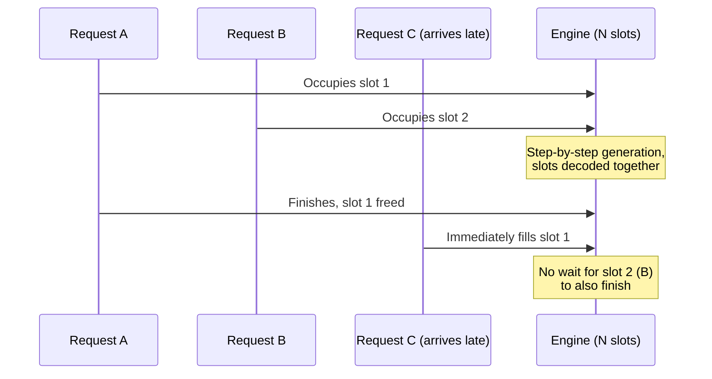

# Batching and continuous batching of concurrent requests

A single inference request processes one sequence at a time through
the model's compute graph. **Batching** runs several sequences through
that same graph together, sharing the cost of loading weight tensors
from memory across all of them in one pass -- since a modern
accelerator is usually memory-bandwidth-bound rather than compute-bound
for the matrix-vector-shaped work of single-sequence decoding, serving
several requests' next-token computations together can approach the
same latency as serving one, for dramatically higher aggregate
throughput. The complication is that real requests do not arrive, or
finish, in lockstep: a **static batch** (form a batch of N requests, run
them all to completion together, only then start the next batch) forces
every request in the batch to wait for the *slowest* member to finish
before any of them can return, and wastes compute on padding once
shorter sequences in the batch have already produced their end token.
**Continuous batching** (also called iteration-level batching in
serving-systems literature this book's own sources do not use that
exact term for) instead lets requests join and leave the batch at
essentially every generation step: a finished sequence's slot is freed
and immediately backfilled by a newly-arrived request, rather than the
whole batch waiting for every member to finish together.

## 1. How llama-server implements it: slots

VERIFIED (`ggml-org/llama.cpp`'s `tools/server/README.md`, fetched
2026-09-03): llama-server's continuous-batching implementation is
organised around **slots** -- a fixed number of independent processing
slots, configured via `-np`/`--parallel`, each of which can hold one
in-flight request's own KV cache and generation state (the KV cache
being the per-session resource this book's own
[kv-cache-and-context-window-management.md](kv-cache-and-context-window-management.md)
page covers in depth). The documentation describes this directly:
"continuous batching enables the server to handle multiple concurrent
requests efficiently through slot-based request management, with each
slot processing independently" -- when one slot's request finishes, a
newly-arrived request can take that slot on the very next generation
step, rather than the whole server waiting for every currently-active
slot to finish together the way a static batch would. The server's
`-b`/`--batch-size` (default `2048`, the *logical* maximum batch size)
and `-ub`/`--ubatch-size` (default `512`, the *physical* maximum batch
submitted to the compute backend per step) flags govern how much
prompt-processing and generation work the server is willing to pack
into one underlying compute-graph invocation at a time, independently
of how many parallel slots (`-np`) are configured -- a lower
`--ubatch-size` trades some throughput for a smaller peak memory
footprint per step.

## 2. Why this matters more than it might first appear

The throughput gain from batching several requests' next-token steps
together is largest precisely when each individual request's own
compute is small relative to the cost of moving the model's weights
through memory once per step -- which is the normal regime for
single-token-at-a-time decoding against a model whose weights
comfortably outweigh the per-token compute. A server design that could
only batch requests that happened to start at exactly the same moment
(a static batch) would, in practice, batch almost nothing under real,
staggered arrival patterns -- continuous batching is what actually
lets a serving engine capture the memory-bandwidth-sharing benefit of
batching under realistic, uncoordinated request arrival, not merely
under a synthetic benchmark where every request starts simultaneously.

## 3. Interaction with offloading and quantization

Continuous batching's throughput benefit is not free of the other
engine-level concerns this book covers: every slot needs its own KV
cache allocation (scaling with that request's own context length, per
[kv-cache-and-context-window-management.md](kv-cache-and-context-window-management.md)),
so the number of slots a given VRAM budget can actually sustain is
bounded jointly by how large the model's own weights are (further
reduced by [quantization-at-inference-time.md](quantization-at-inference-time.md))
and how much context each concurrent request is expected to carry.
Raising `-np`/`--parallel` without a correspondingly generous VRAM
budget, or without also reducing per-slot context length, simply moves
the bottleneck from "requests queue for a free slot" to "the KV cache
allocation itself does not fit" -- the same CPU/GPU offload tradeoffs
covered on
[cpu-gpu-heterogeneous-offloading.md](cpu-gpu-heterogeneous-offloading.md)
then decide whether an over-committed slot's KV cache spills to
slower host memory rather than simply failing to allocate.

## 4. Why this matters specifically for a multi-agent harness

A single agent's own request stream is already often bursty and
concurrent in practice: a fan-out step that dispatches several
subagents at once, or a tool-use loop that fires several independent
model calls in parallel while waiting on external tool results, both
generate multiple simultaneously-in-flight requests against what may
be one shared local model instance rather than one request at a time.
Continuous batching is the mechanism that determines whether that
fan-out pattern actually gets the throughput a multi-agent design is
counting on, or instead serialises behind a static-batch-style queue
that defeats the purpose of running several agents concurrently in the
first place. This is a direct, practical reason an agent-harness
builder choosing between exposing a local model behind a raw CLI
single-shot invocation versus behind a persistent server process
(covered generally on [server-api-modes.md](server-api-modes.md))
should prefer the server path whenever more than one agent, or one
agent's own concurrent tool calls, might realistically hit the same
local model at once: a single-shot CLI invocation per call has no
opportunity to batch anything, while a persistent server with
continuous batching turns concurrent harness-level calls into shared,
amortised engine-level work automatically.

## Sources

- `ggml-org/llama.cpp`, `tools/server/README.md` -- fetched
  2026-09-03. Authoritative for the slot-based continuous-batching
  design, the `-np`/`--parallel`, `-b`/`--batch-size`, and
  `-ub`/`--ubatch-size` flags, and the quoted independent-slot-
  processing description.
- §1's framing of *why* memory-bandwidth-bound single-token decoding
  makes batching valuable, and §2's static-vs-continuous-batching
  general contrast, are BEST CURRENT UNDERSTANDING, UNCONFIRMED against
  this session's three named sources -- standard inference-serving-
  systems reasoning rather than a claim any of the three fetched
  documents states in exactly those terms; held apart here from the
  VERIFIED llama-server-specific claims in §1 and §3.
