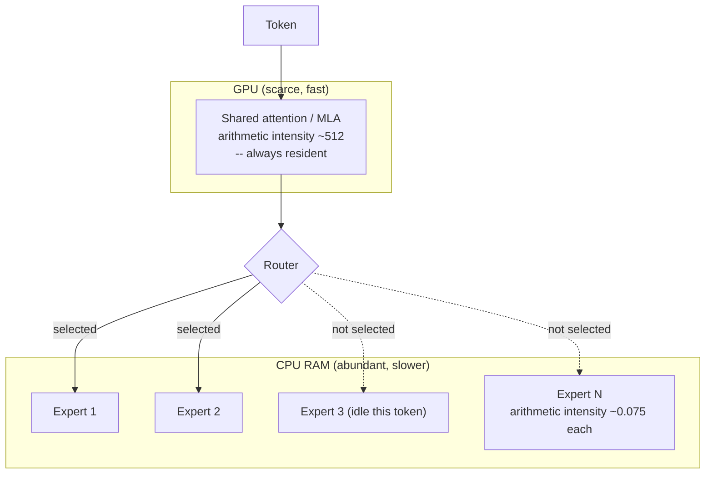

# CPU/GPU/heterogeneous offloading, and expert offloading for MoE models

The starting assumption behind most inference-engine design is that a
model's weights either fit entirely in accelerator (GPU) memory or
they do not. **Offloading** is what an engine does when they do not:
it splits the model's tensors across two or more memory/compute tiers
-- typically GPU VRAM and CPU host RAM -- running each tensor's compute
on whichever device holds it, rather than requiring the whole model to
fit on one device before it can run at all. This section covers
offloading as a general engine-level layer-placement decision; §3
below covers the specific, more advanced case of **expert offloading**
for Mixture-of-Experts models, which is the reason KTransformers exists
as a distinct project at all.

## 1. Layer-granularity CPU+GPU hybrid inference (llama.cpp's model)

VERIFIED (`ggml-org/llama.cpp`'s top-level `README.md` and
`tools/cli/README.md`, both fetched 2026-09-03): llama.cpp's own
framing is direct -- "CPU+GPU hybrid inference to partially accelerate
models larger than the total VRAM capacity" is listed as a core
project capability, controlled by the `-ngl`/`--gpu-layers N` flag,
which "accepts an exact count, `'auto'`, or `'all'`" of the model's
layers to place on the GPU (default: `auto`), with `--device
<dev1,dev2,..>` selecting which accelerator(s) to use at all (`none`
disables offloading entirely, forcing pure CPU execution). The
granularity here is the **transformer layer**: a chosen number of a
model's sequential layers are placed on GPU, and the rest remain on
CPU, with activations crossing the CPU/GPU boundary once per layer
transition rather than the engine trying to split an individual
layer's own weight matrix across devices. This is a coarse,
general-purpose mechanism that works for any dense transformer
architecture without needing to know anything special about that
architecture's internal structure -- exactly the property that makes
it the right *default* offloading strategy, and exactly the property
Mixture-of-Experts models can improve on with a more architecture-
aware strategy (§3).

## 2. Why heterogeneous offloading is a memory-vs-speed tradeoff, not a free lunch

Every offloaded layer still has to run its compute somewhere, and a
CPU core computing a matrix multiplication is categorically slower at
that operation than a GPU's parallel compute units are -- offloading a
layer to CPU because it does not fit in VRAM trades "it runs at all"
for "it runs at CPU speed for that portion of the forward pass," and
every activation crossing the CPU/GPU boundary also pays a real,
non-zero data-transfer cost across the PCIe bus. The `-ngl` knob is
therefore best understood as trading inference latency directly
against how much of a too-large-for-VRAM model can be served at all: a
low `-ngl` value keeps most of the model on CPU (fits comfortably, runs
slowly), while pushing `-ngl` toward `all` keeps as much as possible on
the faster GPU path, up to whatever VRAM budget is available before an
out-of-memory failure. This tradeoff compounds directly with
[quantization-at-inference-time.md](quantization-at-inference-time.md):
a more aggressively quantized model needs fewer VRAM bytes per layer,
which is what actually lets a larger fraction of it fit on GPU at a
given `-ngl` setting in the first place, and with
[kv-cache-and-context-window-management.md](kv-cache-and-context-window-management.md):
a large requested context window competes with the model's own weights
for the same finite VRAM budget the `-ngl` decision is drawing from.

## 3. Expert offloading: why MoE models need a fundamentally different offloading strategy

[`references/models/mixture-of-experts-and-frankenmerging.md`](../models/mixture-of-experts-and-frankenmerging.md)
covers the MoE architecture itself: sparse feed-forward "expert"
sublayers, a router network selecting `num_experts_per_tok` of
`num_local_experts` total experts per token, and the key memory fact
that page's own §4 already establishes -- "even though only a fraction
of the total parameters are used during inference, the entire model,
including all experts, needs to be loaded into memory." A
layer-granularity offload strategy like §1's treats an MoE layer as one
indivisible unit to place on either CPU or GPU, which forces the same
all-experts-resident-in-VRAM requirement that page describes -- for a
model the scale of DeepSeek-R1 (671B total parameters, VERIFIED per
`ktransformers.net`'s own support-matrix page, fetched 2026-09-03,
which names it explicitly as the framework's motivating scale target),
that requirement puts the model entirely out of reach of any
consumer-scale VRAM budget regardless of quantization.

**KTransformers exists specifically to break that requirement apart at
finer-than-layer granularity.** VERIFIED (`kvcache-ai/ktransformers`'s
own `doc/en/deepseek-v2-injection.md`, the upstream project repository
underlying `ktransformers.net`'s docs, fetched 2026-09-03): the
framework's placement strategy is described as **"arithmetic intensity
guided offloading"** -- it measures how much compute each module type
actually does per byte of memory it occupies, and places
high-arithmetic-intensity modules on GPU while placing
low-arithmetic-intensity modules on CPU, *independently of which
transformer layer either belongs to*. The documentation's own concrete
numbers: the MLA (Multi-head Latent Attention) module has an
arithmetic intensity of roughly `512`, while a sparse MoE expert module
run at batch size 1 has an arithmetic intensity of only about `0.075`
-- a difference of roughly four orders of magnitude. Because the
attention path is computed on essentially every token regardless of
which experts get selected, and does relatively heavy compute per byte
of weight it holds, keeping it on GPU yields a large speed return per
VRAM byte spent; because any *individual* expert is touched sparsely
(only when the router selects it for a given token, and cheaply even
then, since it is a single feed-forward pass) but the *full set* of
experts must still be held in memory somewhere in case any of them is
selected, storing the bulk of the expert weights on abundant, cheap CPU
RAM and paying the CPU-compute cost only for whichever experts actually
get selected on a given token is a far better use of scarce, expensive
VRAM than the alternative of forcing every expert onto GPU regardless
of how rarely each one fires.

This is implemented via KTransformers' own **operator-injection**
mechanism -- a YAML-rule-driven system that walks a loaded model's
module tree and swaps matched modules (by name pattern and/or class)
for KTransformers' own optimized implementations, each carrying an
explicit `generate_device`/`prefill_device` (and separate
`prefill_op`/`generate_op`, since prefill and token-by-token generation
can warrant different kernels for the same module) placement --
covered as engine-specific mechanism detail on
[ktransformers.md](ktransformers.md) §2, since the YAML rule schema
itself is a KTransformers-specific authoring surface rather than a
general offloading concept.

## 4. Why this matters for an agent-harness builder

An agent harness that wants to run a large, capable, genuinely
tool-competent model locally -- rather than a smaller model chosen
mainly because it fits in available VRAM -- runs directly into the
constraint §3 describes: the largest, most capable open-weight
tool-using models available today are disproportionately MoE
architectures (DeepSeek, Kimi, Qwen3's larger variants, GLM, all named
explicitly on KTransformers' own support matrix), and a naive
layer-granularity offload strategy makes running them locally at all
infeasible on consumer or single-workstation hardware regardless of
quantization, because the *entire* expert set must still be resident
somewhere. Expert offloading is what actually makes "run a
671B-parameter tool-using model on a single workstation with one or a
few consumer GPUs" a realistic target rather than a cluster-only one --
directly relevant to an agent-harness builder who specifically wants a
large, capable *local* model (for privacy, cost, or latency reasons a
hosted-API model does not satisfy) without hosted-cluster-scale
hardware.

## Sources

- `ggml-org/llama.cpp`, top-level `README.md` and `tools/cli/README.md`
  -- both fetched 2026-09-03. Authoritative for §1-2's `-ngl`/
  `--gpu-layers`, `--device`, and CPU+GPU hybrid-inference framing.
- [`references/models/mixture-of-experts-and-frankenmerging.md`](../models/mixture-of-experts-and-frankenmerging.md)
  §1 and §4, this project's existing MoE reference (Maxime Labonne's
  frankenMoE blog, fetched 2026-09-03 in that book) -- authoritative
  for the MoE architecture and the all-experts-must-be-resident memory
  fact §3 builds on.
- `ktransformers.net`, support-matrix documentation page -- fetched
  2026-09-03. Authoritative for the named supported model families
  (DeepSeek, Kimi, MiniMax, Qwen, GLM) and DeepSeek-R1's 671B-parameter
  scale as the framework's motivating target.
- `kvcache-ai/ktransformers`, `doc/en/deepseek-v2-injection.md` (the
  upstream project repository underlying `ktransformers.net`'s
  documentation) -- fetched 2026-09-03. Authoritative for "arithmetic
  intensity guided offloading" as KTransformers' own named strategy,
  the ~512-vs-~0.075 MLA/expert intensity figures, and the operator-
  injection mechanism's `generate_device`/`prefill_device`/
  `prefill_op`/`generate_op` fields, detailed further on
  [ktransformers.md](ktransformers.md) §2.
