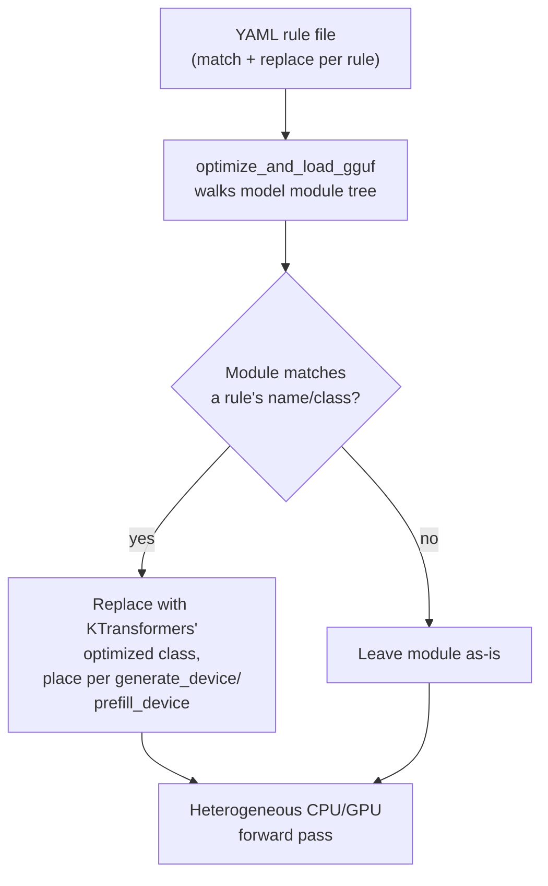

# KTransformers: heterogeneous CPU/GPU inference for large MoE models

Where llama.cpp and Ollama are general-purpose local inference engines
that happen to run MoE models about as well as they run dense ones,
KTransformers is a **distinct project built specifically around the
Mixture-of-Experts case** -- its entire reason to exist, per its own
documentation and this book's own
[cpu-gpu-heterogeneous-offloading.md](cpu-gpu-heterogeneous-offloading.md)
§3, is making the largest available open-weight MoE models (DeepSeek,
Kimi, Qwen3, GLM, and similar, up to and including 671B-total-parameter
models) runnable on hardware that could never hold every expert on GPU
at once. This page covers what is genuinely specific to KTransformers:
its YAML-based operator-injection mechanism, its own precision/backend
naming, and its current serving architecture -- the general
arithmetic-intensity-guided-offloading *concept* it relies on is
covered in depth on
[cpu-gpu-heterogeneous-offloading.md](cpu-gpu-heterogeneous-offloading.md)
§3 and cross-linked rather than repeated here.

## 1. What it is, and a documentation-vintage caveat worth stating plainly

VERIFIED (`ktransformers.net`'s own documentation, fetched 2026-09-03):
the project describes itself as "a CPU-GPU heterogeneous computing
project for large MoE model inference and LoRA fine-tuning" -- "an LLM
inference and fine-tuning framework based on CPU/GPU heterogeneous
computing, lowering the barrier to local deployment." Its currently
published documentation organises around two public surfaces:
**inference serving**, via `kt-kernel` (the CPU-side MoE expert
backend) integrated into `sglang-kt` (a KTransformers-adapted build of
the SGLang serving engine, launched either through the `kt run`
registry shortcut or manually via
`python -m sglang.launch_server ... --kt-*`, per
[model-management-and-distribution.md](model-management-and-distribution.md)
§3), and **LoRA supervised fine-tuning**, via a KTransformers-integrated
build of LLaMA-Factory. This is a meaningfully different architecture
from KTransformers' own earlier, more widely-known design -- documented
directly in the *upstream* project repository's own tutorial content
(`kvcache-ai/ktransformers`'s `doc/en/deepseek-v2-injection.md`,
fetched 2026-09-03 for §2 below), which describes a design centred on
injecting optimized modules directly into a HuggingFace-`transformers`-
style model object via `optimize_and_load_gguf`, with no SGLang
integration in the picture. Both are genuinely sourced this session,
from KTransformers' own current docs site and its own upstream
repository respectively, and are presented here as two real,
temporally-ordered facts about the same project rather than blended
into one description: the YAML operator-injection *mechanism* in §2
below is documented at the upstream-repository level and is the
architectural foundation the current `kt-kernel`/`sglang-kt` serving
stack builds on top of, per the current docs' own description of
`kt-kernel` as supplying "the MoE expert backend."

## 2. The YAML operator-injection mechanism

VERIFIED (`kvcache-ai/ktransformers`'s `doc/en/deepseek-v2-injection.md`,
fetched 2026-09-03): rather than forking or hand-patching a model's own
source implementation to place different modules on different devices,
KTransformers walks the already-loaded model's module tree (via its own
`optimize_and_load_gguf` function) and matches each discovered module
against a **YAML rule file** the operator supplies, replacing matched
modules with KTransformers' own optimized implementations. Each rule
has two parts:

- **`match`** -- identifies which module(s) to target, by `name` (a
  regular expression over the module's dotted path, e.g.
  `^model\.layers\..*\.self_attn$`) and/or `class` (a Python class-type
  filter); the two can be combined, in which case both must match.
- **`replace`** -- specifies the replacement: `class` (the Python class
  to import and instantiate in the matched module's place, or
  `default` to leave it unreplaced), `kwargs` (initialisation
  parameters for the replacement), `recursive` (whether to also walk
  and match the replaced module's own submodules -- set to `False` for
  a `ModuleList` the rule intends to replace as one indivisible unit
  rather than element-by-element), and device-placement fields:
  `generate_device`/`prefill_device` (which device -- `"cpu"`,
  `"cuda"`, `"cuda:1"`, and so on -- runs this module during token
  generation versus prompt prefill, since the two phases can warrant
  different placement or kernels for the same module), matched by
  corresponding `generate_op`/`prefill_op` implementation-selection
  fields, and `out_device` for where a module's output should land.

The documentation's own stated rationale for this external-
configuration approach rather than a source-level fork: it lets an
operator "inject optimised kernels without forking transformer
implementations, maintaining compatibility across model versions while
enabling heterogeneous device strategies transparently" -- the YAML
file is the single artifact that encodes an entire model's device-
placement strategy, reusable and versionable independently of the
model's own upstream `transformers` implementation. The concrete
placement decision this mechanism is used to encode -- attention/MLA
modules pinned to GPU, sparse MoE expert modules placed on CPU, guided
by each module type's own measured arithmetic intensity -- is the
general offloading concept documented in depth on
[cpu-gpu-heterogeneous-offloading.md](cpu-gpu-heterogeneous-offloading.md)
§3, including the specific ~512-vs-~0.075 intensity figures from the
same source document.

## 3. Precision and backend naming

VERIFIED (`ktransformers.net`'s support-matrix and inference-overview
documentation, fetched 2026-09-03): KTransformers names its own set of
supported precision/backend formats -- `BF16` and `FP8`/
`FP8_PERCHANNEL` (native, unconverted precisions some MoE checkpoints
ship in directly, e.g. DeepSeek's own native FP8 release weights),
`RAWINT4` and `GPTQ_INT4`, `AMXINT4`/`AMXINT8` (weight layouts
specifically converted for Intel's AMX instruction-set backend, per
§4's AMX mention below), `MXFP4` (documented as specific to the
DeepSeek V4-Flash model), and `LLAMAFILE`. The documentation is
explicit that "method names are not interchangeable across model
families," since different architectures can demand distinct weight
layouts or CPU instruction-set backends for what is nominally the same
named precision -- a materially more architecture-coupled precision
story than llama.cpp's own GGUF quantization-type naming
([llama-cpp.md](llama-cpp.md) §3), which is designed to apply uniformly
across whatever dense architecture a given GGUF file describes. This
difference is a direct consequence of KTransformers' own design
priority: because it is optimising heterogeneous CPU/GPU execution for
specific, large, named MoE architectures rather than providing one
uniform quantization scheme across arbitrary models, its precision
formats are allowed to be as architecture-specific as the performance
gain warrants.

## 4. Supported models and hardware

VERIFIED (`ktransformers.net`'s support-matrix documentation, fetched
2026-09-03): the currently documented model families are DeepSeek
(V4-Flash, V3.2, V3-0324, R1-0528), Kimi (K2 Thinking, K2.5), MiniMax
(M2, M2.1, M2.5), Qwen (Qwen3, Qwen3.5, Qwen3-Coder-Next), and GLM
(GLM-5, GLM-5.1) -- named, curated support for specific large MoE
checkpoints rather than "any GGUF file" the way llama.cpp's loader is
architecture-generic. Hardware backends span CPU-based execution using
AMX instruction sets specifically for expert inference (the CPU-side
half of §2's placement strategy), with Intel xPU and AMD-CPU/ROCm paths
documented as legacy or under-validation rather than primary,
first-class targets. DeepSeek R1 at 671B total parameters is named
directly on this page as the scale exemplar the framework's
CPU/GPU heterogeneous design is built to make locally deployable at
all.

## 5. Why an agent-harness builder specifically cares about KTransformers

An agent-harness builder who wants a **large, genuinely capable,
tool-competent open-weight model running entirely on local/private
hardware** -- rather than a smaller model chosen because it fits in
available VRAM, or a hosted API the harness's privacy/cost/latency
requirements rule out -- is choosing between "run a smaller dense
model llama.cpp/Ollama handle natively" and "run one of the actually-
frontier-scale open MoE models via an engine built specifically for
that case." KTransformers is the second answer, and its value
proposition is entirely about §2-3's mechanism: expert offloading by
arithmetic intensity is what turns a 671B-parameter model from
"requires a multi-GPU cluster" into "runs, at usable speed, on a single
workstation with a consumer-to-prosumer GPU plus a large pool of system
RAM." The tradeoff a harness operator accepts in exchange is exactly
what §1's documentation-vintage caveat and §4's curated-model-list
both point at: KTransformers is a narrower, more architecture-coupled
tool than llama.cpp or Ollama, targeting a specific, named, currently-
evolving list of large MoE checkpoints rather than acting as a
general-purpose engine for arbitrary local models, and its own
documentation and serving architecture are visibly moving targets
(the SGLang-integrated `kt-kernel`/`sglang-kt` stack) relative to the
comparatively stable, longer-established llama.cpp/GGUF ecosystem the
other two engines in this book sit on.

## Sources

- `ktransformers.net`, documentation landing page, installation guide,
  inference-overview page, and support-matrix page -- all fetched
  2026-09-03. Authoritative for §1's current `kt-kernel`/`sglang-kt`
  serving architecture, §3's precision/backend naming, and §4's
  supported-model and hardware lists.
- `kvcache-ai/ktransformers`, `doc/en/deepseek-v2-injection.md` (the
  upstream project repository underlying `ktransformers.net`'s
  documentation) -- fetched 2026-09-03. Authoritative for §2's full
  YAML match/replace rule schema, the `optimize_and_load_gguf`
  mechanism, and the quoted no-forking design rationale; also the
  source for the arithmetic-intensity figures detailed in full on
  [cpu-gpu-heterogeneous-offloading.md](cpu-gpu-heterogeneous-offloading.md)
  §3.
- §1's explicit flagging of the architectural gap between the current
  docs-site description and the upstream tutorial document's own
  design is this page's own synthesis of what both sourced documents
  actually say, not a claim either document states about the other
  directly -- held apart here per this book's GROUNDING DISCIPLINE
  rather than silently harmonised into one description.
