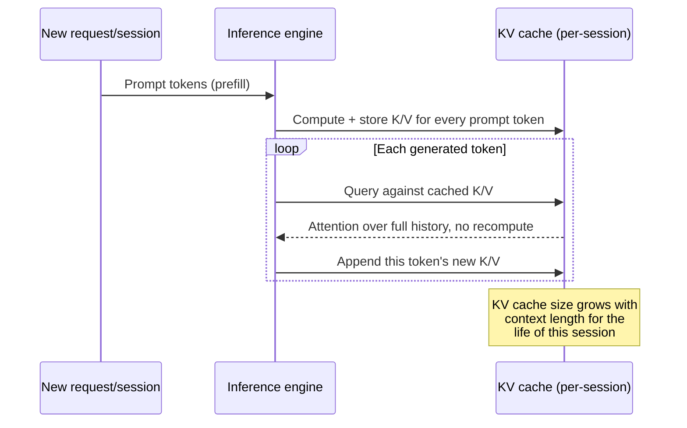

# The KV cache and context-window management during generation

Autoregressive generation produces one token at a time, and a naive
implementation would recompute attention over the *entire* preceding
sequence from scratch for every new token -- quadratic work repeated
on every step. The **key-value (KV) cache** avoids this: for every
attention layer, the key and value projections computed for each
already-generated (or prompt) token are stored, so that generating the
next token only requires computing that one new token's query against
the *already-cached* keys/values of everything before it, plus
appending that new token's own key/value into the cache for the step
after. This is what makes single-token-at-a-time generation practical
at all, but it introduces a cost that scales with **context length**,
not with model size -- and unlike the model's own weights, which are
fixed once loaded, the KV cache grows for the entire duration of a
session and must be managed as a first-class, dynamic memory budget
by whatever engine is serving the model.

## 1. Why the KV cache is a *second*, session-scoped memory cost

[`references/models/parameter-count-and-scale.md`](../models/parameter-count-and-scale.md)
already establishes that a model's weight memory is a fixed function
of its parameter count and chosen precision. The KV cache is
orthogonal to that: it grows with **sequence length x number of layers
x number of attention heads (or KV-heads, under GQA/MQA) x head
dimension x 2 (key and value) x precision**, and it is allocated **per
active session/request**, not once per loaded model. Two sessions
against the same loaded model each need their own KV cache; a single
long-running agent session that keeps growing its context (accumulating
tool outputs, prior turns, retrieved documents) keeps growing its KV
cache allocation for as long as that session stays open, up to
whatever context-length ceiling the engine and the model's own trained
positional scheme support. This is precisely the mechanism that makes
"how much context can I actually afford to keep resident" a genuine,
per-deployment capacity-planning question for an agent harness, not
just an abstract token-budget concern.

## 2. Context-window sizing as an explicit, engine-facing setting

Because the KV cache is a real, growing memory allocation, every
engine this book covers exposes context length as an explicit
load-time or session-time configuration rather than an implicit,
always-maximal setting:

- **llama.cpp**: VERIFIED (`tools/cli/README.md`, fetched 2026-09-03),
  the `-c`/`--ctx-size N` flag sets the context window an engine
  instance will allocate KV-cache space for; a value of `0` tells the
  engine to fall back to whatever context length the loaded GGUF
  file's own metadata declares as that architecture's trained/default
  context length (see [model-file-formats.md](model-file-formats.md)
  §4 on architecture-declared metadata generally).
- **Ollama**: VERIFIED (`docs.ollama.com/context-length.md`, fetched
  2026-09-03), Ollama picks an automatic default context length keyed
  off *available VRAM* rather than a fixed number -- under 24 GiB VRAM
  it defaults to 4,000 tokens, 24-48 GiB to 32,000 tokens, and 48 GiB
  or above to 256,000 tokens -- explicitly because, per the
  documentation, "setting a larger context length will increase the
  amount of memory required to run a model," i.e. the same KV-cache-
  scales-with-context-length mechanism described in §1 above, made
  automatic rather than left to the operator. The documentation names
  agentic workloads directly as a reason to override that automatic
  default upward: "tasks requiring substantial context -- such as web
  search, agents, and coding tools -- should utilise at least 64,000
  tokens," set via the `OLLAMA_CONTEXT_LENGTH` environment variable at
  server-launch time (`OLLAMA_CONTEXT_LENGTH=64000 ollama serve`), or
  per-request via a Modelfile `PARAMETER num_ctx` value (see
  [ollama.md](ollama.md) §2) -- the same VERIFIED default (`2048`) and
  parameter name the Modelfile reference documents generally.
- Ollama's own `ollama ps` command surfaces the *consequence* of a
  context/VRAM mismatch directly: it reports whether a running model
  is resident entirely on GPU or is experiencing CPU offload, which
  the documentation notes "may degrade performance" -- context-window
  sizing and the CPU/GPU offloading decisions covered on
  [cpu-gpu-heterogeneous-offloading.md](cpu-gpu-heterogeneous-offloading.md)
  are therefore coupled: a context window sized past what fits in VRAM
  alongside the model's own weights forces part of the KV cache (or
  the weights themselves) onto the slower CPU/host-memory path.

## 3. KV-cache quantization: a second, independent precision axis

VERIFIED (`ggml-org/llama.cpp`'s `tools/cli/README.md`, fetched
2026-09-03): llama.cpp exposes `-ctk`/`--cache-type-k TYPE` and
`-ctv`/`--cache-type-v TYPE` flags that quantize the *cached
activations* -- the keys and values themselves -- to a lower-precision
type such as `q4_0` or `q8_0`, independently of whatever precision the
model's own weights are stored and computed at (per
[quantization-at-inference-time.md](quantization-at-inference-time.md)
§4). This is a distinct lever from weight quantization: it does not
change the model's own capacity or the accuracy of its weight matrices
at all, it only reduces the per-token, per-layer memory cost of
*holding onto* the attention history for the current session. Because
the KV cache's total size scales linearly with context length (§1),
quantizing it is disproportionately valuable for long-context, long-
running sessions -- exactly the shape of session an agentic loop that
accumulates many tool-call turns tends to produce -- where the KV
cache, not the model weights, can become the larger of the two memory
consumers well before the context window's nominal ceiling is reached.

## 4. Why this matters for an agent-harness builder specifically

An agent harness rarely runs a single, short, fixed-length prompt --
it accumulates tool outputs, intermediate reasoning, retrieved
documents, and multi-turn history into a growing context across a
session. Three consequences follow directly from §1-3 for anyone
building or operating a harness against a local engine:

- **Context-window sizing is a capacity-planning decision, not a
  cosmetic default.** Ollama's own documentation explicitly calling
  out "agents" as a workload that should override its automatic,
  VRAM-scaled default upward (§2) is a direct acknowledgement that
  agentic context growth is exactly the pattern the default heuristic
  under-provisions for.
- **KV-cache quantization is a cheap lever for exactly the
  long-context, many-tool-call session shape an agent loop produces**,
  because the memory it saves scales with the dimension (context
  length) that keeps growing across an agent session, unlike weight
  quantization which is a one-time, fixed saving regardless of session
  length.
- **A harness that runs many concurrent agent sessions against one
  shared local engine instance is really requesting many independent
  KV-cache allocations at once**, which is the direct link into this
  book's next page,
  [batching-and-continuous-batching.md](batching-and-continuous-batching.md):
  an engine's batching/slot design is, at its core, a strategy for
  managing multiple simultaneously-live KV caches against one loaded
  set of weights.

## Sources

- `ggml-org/llama.cpp`, `tools/cli/README.md` -- fetched 2026-09-03.
  Authoritative for `-c`/`--ctx-size`, `-ctk`/`--cache-type-k`, and
  `-ctv`/`--cache-type-v`.
- `docs.ollama.com/context-length.md` -- fetched 2026-09-03.
  Authoritative for Ollama's VRAM-tiered automatic context-length
  defaults, the `OLLAMA_CONTEXT_LENGTH` environment variable, the
  quoted agent/coding-tool 64,000-token recommendation, and the
  `ollama ps` CPU/GPU-offload visibility note.
- `docs.ollama.com/modelfile.md` -- fetched 2026-09-03. Source of the
  `num_ctx` Modelfile `PARAMETER` and its documented default (2048),
  cross-referenced from [ollama.md](ollama.md) §2.
- §1's general mechanism-level description of why the KV cache exists
  and how it scales (layers x heads x head-dimension x 2 x precision x
  sequence length) is BEST CURRENT UNDERSTANDING, UNCONFIRMED against
  these specific sources -- standard transformer-attention-caching
  mechanics rather than a claim stated in those terms by any of the
  three fetched documents, held apart here from the VERIFIED
  flag/behaviour claims above.
