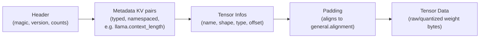

# Model file formats for inference: GGUF and why a purpose-built format exists

A model that has just finished training or fine-tuning lives in a
**training-checkpoint format** -- most commonly a Hugging Face
`safetensors`/`pytorch_model.bin` directory alongside a `config.json`
and tokenizer files. That format is optimised for the training
framework's own concerns: resumability, framework interoperability,
and mapping cleanly onto a `transformers`-style Python class hierarchy.
An **inference engine** consuming that same model at serving time has a
different set of concerns entirely -- load the weights into memory (or
map them directly from disk) as fast as possible, know unambiguously
which architecture and hyperparameters the file describes without a
side-channel `config.json`, and carry engine-specific artifacts (a
chosen quantization scheme, an adjusted tokenizer, hyperparameters like
context length) as one self-describing unit. **GGUF** is llama.cpp's
(and, by extension, the broader `ggml`-ecosystem's) answer to that
second set of concerns, and it is the format this book's other two
concrete engines -- Ollama and, for compatible model families,
KTransformers -- also consume or produce.

## 1. GGUF's predecessors and why they were replaced

VERIFIED (`ggml-org/ggml`'s own GGUF specification,
`github.com/ggml-org/ggml/blob/master/docs/gguf.md`, fetched
2026-09-03): GGUF is the successor to three earlier, increasingly
patched formats used by the `ggml` ecosystem -- plain **GGML**, **GGMF**,
and **GGJT**. The spec is explicit about what was wrong with all three:
"there's no way to identify which model architecture a given model is
for" (a loader had to be told out-of-band, or guess), and "adding or
removing any new hyperparameters is a breaking change, which is
impossible for a reader to detect" -- a newer model file silently
produced garbage output (or crashed) against an older build of the
loader, with no way for the loader to know it was reading a file it
did not fully understand. GGUF's design goal is to make a model file
**unambiguous and self-describing**: everything a loader needs --
architecture name, hyperparameters, tokenizer, and the tensors
themselves -- lives in one file, in a schema a reader can validate
before trusting the rest of the content.

## 2. GGUF's on-disk structure

VERIFIED (same source): a GGUF file is a single binary stream laid out
in four ordered sections:

```
Header -> Metadata KV pairs -> Tensor Infos -> Padding -> Tensor Data
```

The **header** carries a magic number (`0x47474655`, the ASCII bytes
`GGUF`), a format version (3, as of the fetched spec, which also
documents big-endian model support), and explicit counts of how many
tensors and how many metadata key-value pairs follow -- letting a
reader allocate and stream-parse without a second pass. The
**metadata key-value section** is GGUF's central departure from its
predecessors: rather than an unlabelled, positional list of
hyperparameters (GGML/GGJT's design, which is exactly what made adding
a field a breaking change), GGUF stores **typed, named key-value
pairs** -- keys in `lower_snake_case` with dot-separated namespacing
(e.g. `llama.context_length`, `general.architecture`), values typed as
one of 13 supported kinds (`uint8`/`int8`/`uint16`/`int16`/`uint32`/
`int32`/`uint64`/`int64`/`float32`/`float64`/`bool`/`string`/`array`,
the last nestable). A reader that does not recognise a given key
simply ignores it rather than failing, and third-party or
forward-looking metadata can be namespaced under a project-specific
prefix (the spec's own example: `rustformers.custom_field`) without
colliding with the core schema. The **tensor info section** then lists,
for every tensor in the model, its name (up to 64 UTF-8 bytes), its
shape (up to four dimensions), its `ggml` element type (see §4 below),
and its byte offset into the tensor-data section that follows. A
**padding** region aligns the start of tensor data (see §3), and the
**tensor data** section itself is the actual weight bytes, laid out
contiguously per the offsets just declared.



## 3. Alignment and its direct link to memory-mapped loading

VERIFIED (same source): GGUF mandates that tensor data begin at an
address aligned to a configurable boundary, stored in the
`general.alignment` metadata key (default 32 bytes, and required to be
a multiple of 8), computed as
`align_offset(position) = position + (ALIGNMENT - (position % ALIGNMENT)) % ALIGNMENT`,
with the gap between the tensor-info section and the tensor-data
section zero-padded to satisfy it. The spec states the reason directly:
this alignment exists so "models can be loaded using `mmap` for fast
loading and saving." This is not a cosmetic detail -- it is the
structural precondition for the memory-mapped loading behaviour this
book covers on its own page,
[memory-mapped-model-loading.md](memory-mapped-model-loading.md): an
`mmap` call can only hand a process a pointer directly into a tensor's
bytes, with zero copy, if that tensor's offset already satisfies the
host CPU's page-alignment requirements. A format that packed tensors
back-to-back with no alignment guarantee (as GGUF's unversioned
predecessors effectively did) would force a loader to copy every
tensor into a freshly aligned buffer before use, defeating the entire
point of memory-mapping the file.

## 4. Tensor element types and quantization as a GGUF-native concept

VERIFIED (same source): each tensor's declared type is one value from
an enumerated `ggml` type list (`GGML_TYPE_COUNT = 40` in the fetched
spec), covering full-precision floating point (`F32`, `F16`, `F64`,
`BF16`), plain integer types (`I8`/`I16`/`I32`/`I64`), and a large
family of **quantized** types (`Q4_0`, `Q4_1`, `Q5_0`, `Q5_1`, `Q8_0`,
`Q8_1`, the "K-quant" family, the "I-quant" family such as `IQ2_XXS`
and `IQ3_XXS`, and specialised formats like `TQ1_0` and `MXFP4`). A
separate metadata key, `general.quantization_version`, tracks the
version of the quantization *scheme* independently of the tensor's
declared type, letting the community refine how a given type is
computed without bumping the container format's own version number.
The practical consequence for an inference engine: **a GGUF file mixes
precisions per tensor** -- it is entirely normal for a model's
embedding and output layers to be stored at higher precision (e.g.
`F16` or `Q8_0`) while the bulk of its feed-forward weights are stored
at a more aggressive quantization level (e.g. `Q4_K_M`), because the
format has no requirement that every tensor share one type. What each
of these type names actually means numerically (the K-quant vs.
I-quant distinction, block sizes, and llama.cpp's own naming
convention) is engine-specific detail covered on
[llama-cpp.md](llama-cpp.md); the underlying quantization *concepts* --
affine vs. symmetric schemes, calibration, per-tensor vs. per-channel
granularity -- are covered in depth on this book's sibling area,
[`references/models/quantization.md`](../models/quantization.md), and
this book's own
[quantization-at-inference-time.md](quantization-at-inference-time.md)
page covers how an inference *engine* (as opposed to a quantization
*tool*) consumes a tensor already stored this way.

## 5. Why this matters for an agent-harness builder

An agent harness that shells out to, or embeds, a local inference
engine typically points that engine at one `.gguf` file (or, for
Ollama, a name that resolves to one under the hood -- see
[ollama.md](ollama.md) §2). Understanding that this one file is
simultaneously the architecture descriptor, the hyperparameter source,
the tokenizer carrier, and the weight store explains several
harness-relevant behaviours directly: why swapping a GGUF file is
usually enough to swap an entire local model with no separate config
to keep in sync; why a model's advertised context length
(`llama.context_length` or an architecture-specific equivalent key) is
something the engine reads *from the file itself* rather than from a
harness-side setting (a harness can still request a smaller context at
load time, but cannot exceed what the file's own metadata and trained
positional scheme support without explicit RoPE-scaling configuration);
and why community "re-quantizes" of the same base model circulate as
independent GGUF files with the same architecture metadata but
different tensor types and file sizes -- swapping between them is a
pure inference-time precision/VRAM tradeoff with no separate
conversion step required at harness-integration time, because the GGUF
metadata still round-trips architecture identity correctly per §1's
motivating design goal.

## Sources

- `ggml-org/ggml`, GGUF file format specification --
  `github.com/ggml-org/ggml/blob/master/docs/gguf.md`. Fetched
  2026-09-03. Authoritative for the GGML/GGMF/GGJT predecessor
  limitations, the four-section file layout, the typed metadata KV
  design, the tensor-info schema, the alignment requirement and its
  mmap rationale, and the GGML tensor-type enumeration.
- `ggml-org/llama.cpp`, top-level README --
  `github.com/ggml-org/llama.cpp` (raw `README.md`, fetched
  2026-09-03) -- confirms llama.cpp is "build on top of the `ggml`
  library" and lists GGUF-consuming quantization levels
  (1.5-bit through 8-bit), cross-referenced from
  [llama-cpp.md](llama-cpp.md).
