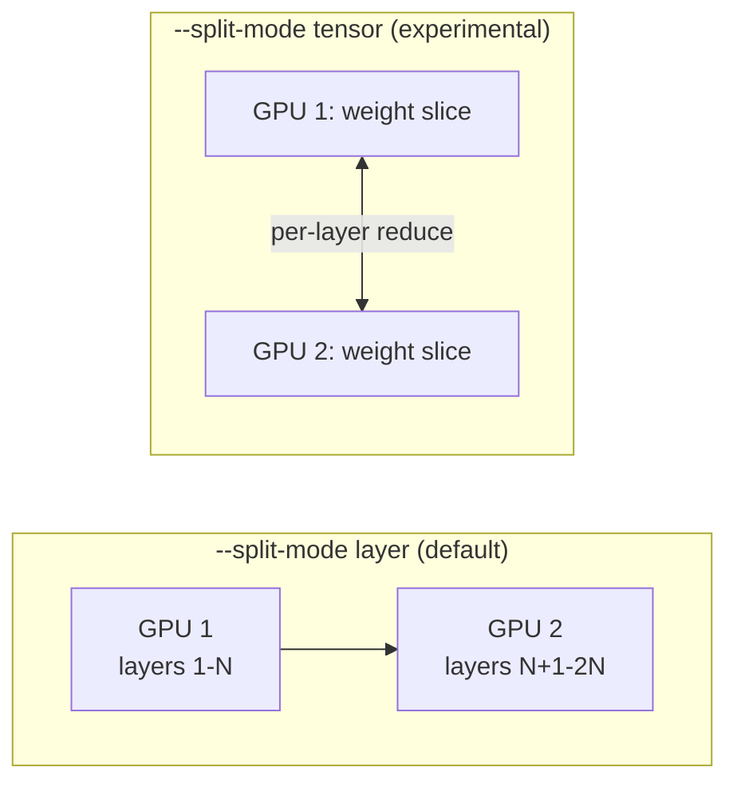

# Multi-GPU inference: pipeline (layer) parallelism vs. tensor parallelism

Once a deployment has more than one GPU available, an inference engine
has a second offloading decision to make beyond
[cpu-gpu-heterogeneous-offloading.md](cpu-gpu-heterogeneous-offloading.md)'s
CPU-vs-GPU split: **how to divide the model's own weights and compute
across multiple GPUs.** There are two structurally different answers,
and llama.cpp implements both as selectable modes rather than picking
one as the only option.

## 1. Layer (pipeline) parallelism -- the default

VERIFIED (`ggml-org/llama.cpp`'s `docs/multi-gpu.md`, fetched
2026-09-03): the default `--split-mode layer` mode assigns "each GPU
... a contiguous slice of layers," with the KV cache for a given layer
residing on whichever GPU owns that layer. The documentation
characterises this as the mode that "balances memory distribution with
compatibility and performs well during the prefill phase, even with
slower interconnections between processors" -- because token
activations only need to cross a GPU-to-GPU boundary once per
layer-group transition (a small, infrequent transfer), this mode
tolerates a slow inter-GPU link (e.g. consumer PCIe without NVLink)
reasonably well. The documentation's own summary is that pipeline
parallelism "processes tokens sequentially through the pipeline,"
minimising inter-GPU transfers at the cost of not using every GPU's
compute simultaneously on a single token's own generation step --
each GPU in the pipeline is idle while an earlier GPU in the chain is
still working on that token's earlier layers, though this idling
matters less once continuous batching (see
[batching-and-continuous-batching.md](batching-and-continuous-batching.md))
keeps several requests' work flowing through the pipeline at once.

## 2. Tensor parallelism -- experimental, latency-oriented

VERIFIED (same source): `--split-mode tensor` instead splits "both
weights and KV across the participating GPUs via a 'meta device'
abstraction" -- every GPU holds a *slice* of every layer's own weight
matrix, rather than a full copy of a subset of layers, and all GPUs
work on the *same* layer of the *same* token simultaneously, exchanging
partial results via "multiple cross-GPU reductions per layer." The
documentation states this mode "excels at token generation speed and
can approach prefill performance on larger models with fast GPU
interconnects," at the cost of needing a genuinely fast interconnect
to make those frequent per-layer reductions cheap, and is explicitly
flagged as "experimental" and "isn't supported for all model
architectures" -- a materially less mature path than the default layer
mode. The documentation's own framing of the tradeoff: "pipeline
parallelism prioritises batch throughput; tensor parallelism minimises
individual request latency" -- the two modes optimise for different
serving goals, not one being a strict upgrade of the other.

## 3. Configuration surface

VERIFIED (same source): alongside `--split-mode`, `--tensor-split`
sets the *proportion* of the model assigned to each GPU (the
documentation's own example: `3,1` assigns 75% of the split to the
first listed GPU and 25% to the second, letting an operator with
mismatched-VRAM GPUs weight the split accordingly rather than assuming
identical devices), and `--main-gpu` designates which single device to
use when `--split-mode none` restricts execution to one GPU only
(useful for pinning a smaller model to a specific card in a
multi-GPU host rather than letting either parallelism mode spread it).

## 4. Relationship to KTransformers' heterogeneous placement

Multi-GPU tensor/pipeline parallelism (this page) and CPU/GPU
heterogeneous expert offloading
([cpu-gpu-heterogeneous-offloading.md](cpu-gpu-heterogeneous-offloading.md)
§3) are answering different questions -- "how do I split work across
*several accelerators of the same kind*" versus "how do I split work
across *fundamentally different kinds* of compute (CPU vs. GPU) by
each module's own arithmetic intensity" -- and a large-MoE deployment
can need both at once: KTransformers' own inference-overview
documentation (fetched 2026-09-03) names "tensor parallelism
configuration" as one of the reasons to use its manual
`python -m sglang.launch_server ... --kt-*` launch path rather than
the simpler `kt run` registry shortcut (see
[ktransformers.md](ktransformers.md) §2) -- i.e. tensor-parallelism
across GPUs is an available option *alongside* its arithmetic-
intensity-guided CPU/GPU expert placement, not a mutually exclusive
alternative to it, though the fetched documentation does not name the
exact flag,
rather than the two being mutually exclusive strategies -- a
multi-GPU host can still tensor-split the GPU-resident attention path
across several cards while the bulk of the MoE expert weights remain
offloaded to CPU RAM per §3 of that page.

## 5. Why an agent-harness builder cares

The pipeline-vs-tensor choice maps directly onto two different
harness-facing performance goals named on
[batching-and-continuous-batching.md](batching-and-continuous-batching.md):
if a harness's dominant workload is **many concurrent agent/tool-call
requests** where aggregate throughput matters more than any single
request's own latency, the default layer/pipeline mode's throughput-
oriented, slow-interconnect-tolerant design is the safer choice and
requires no special interconnect hardware; if a harness instead has a
**single, latency-critical interactive agent loop** where each
individual round-trip's speed is what the user actually feels (e.g. a
synchronous coding-assistant turn a person is waiting on), tensor
parallelism's per-request latency advantage is the more relevant
target -- provided the deployment actually has the fast GPU
interconnect the experimental mode assumes, and provided the specific
model architecture in use is one of the ones the mode currently
supports, both of which the documentation flags as real, current
limitations rather than settled guarantees.

## Sources

- `ggml-org/llama.cpp`, `docs/multi-gpu.md` -- fetched 2026-09-03.
  Authoritative for §1-3 in full: the layer/tensor/none split modes,
  the `--split-mode`/`--tensor-split`/`--main-gpu` flags, and the
  quoted throughput-vs-latency framing.
- `ktransformers.net`, support-matrix and installation documentation
  pages -- fetched 2026-09-03. Source of §4's tensor-parallelism-
  alongside-expert-offloading configuration option, detailed further
  on [ktransformers.md](ktransformers.md) §2.
- [cpu-gpu-heterogeneous-offloading.md](cpu-gpu-heterogeneous-offloading.md),
  this book's own page, for the CPU/GPU heterogeneous-placement concept
  §4 contrasts this page's same-kind-of-accelerator parallelism
  against.
