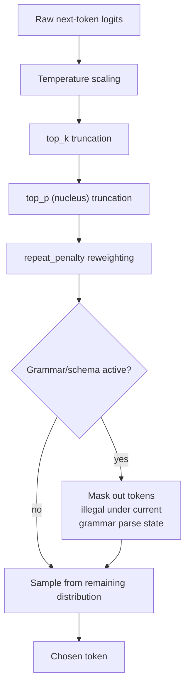

# Sampling and decoding parameters

A language model's forward pass produces a probability distribution
over its entire vocabulary for the next token -- not a single
predetermined answer. **Decoding** is the process of turning that
distribution into an actual chosen token, repeated once per generated
token, and **sampling parameters** are the knobs that control how that
choice is made. Every engine this book covers exposes essentially the
same core parameter set, because they are implementing the same
well-established decoding techniques against the same kind of
next-token distribution -- what differs engine to engine is which
layer surfaces the knob (a Modelfile default vs. a per-request API
field vs. a CLI flag) and what the default values are, covered as
engine-specific detail on each engine's own page.

## 1. The core sampling knobs

VERIFIED (`docs.ollama.com/modelfile.md`, fetched 2026-09-03, which
documents this exact parameter set as Modelfile `PARAMETER` options
with concrete defaults):

- **`temperature`** (Ollama's documented default: `0.8`) -- scales the
  logits before converting them to probabilities; a higher value
  flattens the distribution (more randomness, more diverse/creative
  output), a lower value sharpens it toward the single highest-
  probability token (more deterministic, more repetitive output). A
  temperature of exactly `0` degenerates to greedy decoding -- always
  picking the single most probable token.
- **`top_k`** (default `40`) -- before sampling, discard every token
  outside the `k` highest-probability candidates, then sample (with
  temperature applied) only among those `k`. A higher `top_k` widens
  the candidate pool and increases diversity; a very low `top_k`
  (e.g. `1`) makes decoding effectively greedy regardless of
  temperature.
- **`top_p`** (nucleus sampling, default `0.9`) -- instead of a fixed
  candidate *count*, keep the smallest set of highest-probability
  tokens whose cumulative probability mass reaches `p`, then sample
  among those. `top_k` and `top_p` are commonly applied together (as
  Ollama's own default parameter set does): `top_k` bounds the
  absolute candidate count first, and `top_p` then further trims that
  bounded set down to whatever cumulative-probability nucleus it
  actually needs on a given step, which can be much smaller than `k`
  when the distribution is already concentrated on a few tokens, or
  can matter less when the distribution is already flat.
- **`repeat_penalty`** (default `1.0`, i.e. off) -- applies a
  downweighting penalty to tokens that have already appeared within a
  lookback window, discouraging the model from looping on the same
  phrase or token repeatedly. **`repeat_last_n`** (default `64`) sets
  the size of that lookback window in tokens.
- **`seed`** -- fixes the pseudo-random number generator's seed used
  by sampling, making an otherwise-stochastic decoding process
  reproducible for a given prompt and parameter set (useful for
  regression testing an agent's own prompts/tools, since it removes
  sampling randomness as a confound when comparing two runs).
- **`num_predict`** -- caps the maximum number of tokens the engine
  will generate before stopping regardless of whether the model
  produced a natural end-of-sequence token.
- **`stop`** -- one or more literal strings that, once generated,
  immediately terminate generation -- the mechanism a harness uses to
  make an engine stop exactly at a structural boundary it cares about
  (e.g. a role-turn delimiter in a chat template) rather than running
  on until `num_predict` or an end-of-sequence token.

## 2. Grammar- and schema-constrained decoding: a fundamentally different mechanism

The parameters in §1 all operate by reweighting or truncating the
*probability distribution itself* before sampling -- they never
forbid a token outright, they only make some tokens less (or
effectively zero) likely to be picked. **Grammar-constrained decoding**
works differently: it forbids tokens outright, at the vocabulary level,
based on a formal grammar rather than a probability threshold.

VERIFIED (`ggml-org/llama.cpp`'s `grammars/README.md`, fetched
2026-09-03): llama.cpp implements this via **GBNF** ("GGML BNF"), which
the documentation describes as "an extension of BNF that primarily
adds a few modern regex-like features." A GBNF grammar is a set of
production rules (`nonterminal ::= sequence`, combining quoted
terminal strings, character ranges, and operators like `|`
alternation, `*`/`+` repetition, `?` optionality, and `{}` counted
repetition) that together define every string the output is allowed to
be. During generation, at every single decoding step, the engine
checks each *candidate* token against the grammar's current parse
state and masks out (assigns zero probability to) any token that would
make the output no longer match the grammar -- so the sampling
parameters from §1 still operate, but only over whatever subset of the
vocabulary the grammar leaves legal at that position. The documentation
is explicit that this constrains the model's own token distribution,
not its awareness of the task: "the JSON schema is only used to
constrain the model output and is not injected into the prompt" -- the
model has no idea a schema is being enforced unless a harness also
tells it so in the prompt text itself; the grammar guarantees
*well-formedness*, not that the content is what was actually asked for.

VERIFIED (same source): llama.cpp additionally supports automatic
**JSON-Schema-to-GBNF conversion** -- a caller passes a JSON Schema
directly (to the CLI, the server, or the completion tools) and the
engine compiles an equivalent GBNF grammar internally, rather than
requiring a hand-written grammar for what is usually the single most
common structured-output need: guaranteeing the model's output parses
as valid JSON matching a given shape.

## 3. Why grammar-constrained output is the load-bearing mechanism for tool calling

VERIFIED (`ggml-org/llama.cpp`'s `docs/function-calling.md`, fetched
2026-09-03): llama-server's OpenAI-compatible tool-calling support is
built on exactly this mechanism -- a chat-template-driven formatting
layer (Jinja2 templates, enabled via `--jinja`, with native handlers
for model families like Llama 3.1/3.3, Qwen 2.5, Mistral Nemo,
Functionary, and DeepSeek R1 distills, plus a documented "generic"
fallback for unrecognised templates, which the documentation notes
"may consume more tokens and be less efficient") that formats the
available tool definitions into the prompt, combined with grammar
constraints that force the model's structured `tool_calls` output to
actually parse as valid JSON matching the tool's declared argument
schema. This is the general concept the "server/API modes" page
covers from the harness-facing side
([server-api-modes.md](server-api-modes.md) §3): an OpenAI-shaped
`tools` array in a request only reliably yields a parseable
`tool_calls` response if the serving engine backs that contract with
an enforcement mechanism like grammar-constrained decoding rather than
hoping the model's own training makes it comply by convention.

## 4. Why an agent-harness builder cares

An agent harness is, mechanically, a loop that repeatedly asks a model
to either emit free-form reasoning/response text or emit a
machine-parseable structured call (a tool invocation, a routing
decision, a JSON-shaped intermediate artifact) -- and the reliability
of that second case is exactly what §2-3's grammar-constrained
decoding exists to guarantee. A harness that only tunes `temperature`/
`top_p`/`repeat_penalty` for "good conversational output" and then
separately expects the model to reliably emit well-formed tool calls
is relying on the model's own training alone; a harness that instead
routes structured-output requests through the engine's grammar/schema
path is relying on a decode-time *guarantee* of syntactic validity
regardless of the model's own reliability, at the cost of the "generic
fallback" tax §3 names for chat templates the engine does not natively
recognise. `seed`-based reproducibility (§1) is separately valuable for
harness development and regression testing: it isolates whether an
observed change in agent behaviour came from a prompt/tool-definition
change versus ordinary sampling variance.

## Sources

- `docs.ollama.com/modelfile.md` -- fetched 2026-09-03. Authoritative
  for the `temperature`/`top_k`/`top_p`/`repeat_penalty`/
  `repeat_last_n`/`seed`/`num_predict`/`stop` parameter set and their
  documented Ollama defaults.
- `ggml-org/llama.cpp`, `grammars/README.md` -- fetched 2026-09-03.
  Authoritative for GBNF's design, the match-at-every-token masking
  mechanism, and the JSON-Schema-to-GBNF conversion feature, including
  the quoted "not injected into the prompt" note.
- `ggml-org/llama.cpp`, `docs/function-calling.md` -- fetched
  2026-09-03. Authoritative for the Jinja2-chat-template-plus-grammar
  tool-calling architecture, the native-handler model list, and the
  generic-fallback efficiency caveat.
- §1's general description of how temperature/top-k/top-p mathematically
  reshape a probability distribution (as opposed to Ollama's specific
  documented defaults, which are VERIFIED) is BEST CURRENT
  UNDERSTANDING, UNCONFIRMED against these three sources -- standard
  decoding-strategy mechanics rather than a claim any of them states
  in exactly those mechanistic terms.
