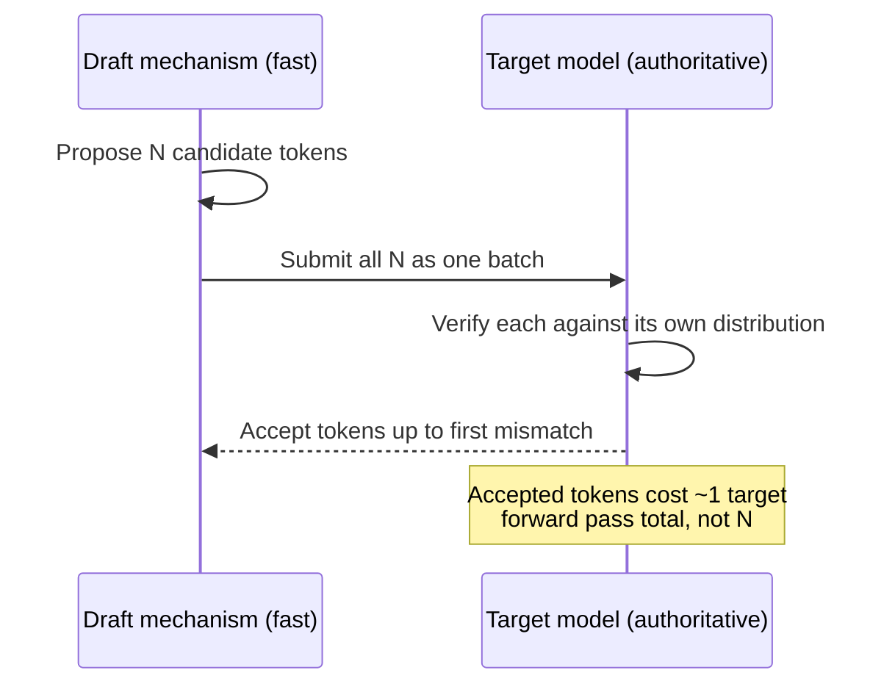

# Speculative decoding

Autoregressive generation is inherently sequential -- each token
depends on every token before it, so a model cannot generate token
`N+1` before it has already produced token `N`. This makes single-
sequence generation latency-bound by how many *sequential* forward
passes it takes, one per output token, even when the accelerator
running each individual pass has plenty of spare compute capacity
(the same memory-bandwidth-bound-not-compute-bound situation that
makes batching valuable per
[batching-and-continuous-batching.md](batching-and-continuous-batching.md)).
**Speculative decoding** exploits that spare compute: a cheap, fast
mechanism proposes several candidate *draft* tokens ahead of where the
main ("target") model has actually verified, and the target model then
checks all of those draft tokens in a single batched forward pass
instead of one sequential pass per token -- when the draft's guesses
turn out correct, several tokens' worth of output are produced for
roughly the cost of one target-model forward pass.

## 1. The core mechanism: draft, then verify in one batch

VERIFIED (`ggml-org/llama.cpp`'s `docs/speculative.md`, fetched
2026-09-03): the documentation frames the technique as exploiting
"batch efficiency" directly -- a fast draft mechanism "predicts
multiple tokens ahead of the main model," and the target model then
verifies "in a single batch operation," which the documentation states
is "more efficient than computing n sequentially." Because the target
model still has final say over every token (it checks each draft token
against what it would itself have generated, and accepts a draft token
only if the two agree, discarding the rest of that draft run from the
first mismatch onward), speculative decoding is a **pure latency
optimisation with no change to output quality or distribution** -- the
final generated sequence is identical to what the target model alone
would have produced token-by-token; the only thing speculative decoding
changes is how many *sequential* forward passes it took to get there.

## 2. llama.cpp's family of draft mechanisms

VERIFIED (same source): llama.cpp supports several distinct ways of
producing the draft tokens, split into two families. **Model-based
drafting** uses a genuinely separate, smaller model or module to
propose tokens: a plain **draft model** (a smaller, faster companion
model of the same tokenizer/vocabulary family, loaded alongside the
target via `--spec-draft-model`/`-md`), **EAGLE-3** (which reads the
target model's own hidden states rather than running an independent
forward pass, for better-informed predictions), **DFlash** (produces
an entire block of tokens per forward pass via block diffusion rather
than one-at-a-time autoregression), and **DSpark** (extends DFlash
with a semi-autoregressive refinement step). **Pattern-based drafting**
needs no auxiliary model at all: `ngram-simple`, `ngram-map-k`, and
`ngram-mod` search the already-generated token history itself for
matching n-gram sequences to propose as the next draft tokens --
useful specifically when the target model is likely to repeat or
closely paraphrase text it has already produced (e.g. echoing back
part of a long tool-output context), a shape of workload where no
separate draft model is needed to get a strong hit rate. Key CLI
surface: `--spec-type` selects the mechanism (e.g. `draft-eagle3`,
`ngram-mod`), `--spec-draft-n-max N` caps how many tokens are
speculated ahead per round (default 3), and `--spec-draft-ngl` sets
how many of the *draft* model's own layers are GPU-offloaded,
independently of the target model's own `-ngl` setting from
[cpu-gpu-heterogeneous-offloading.md](cpu-gpu-heterogeneous-offloading.md).

## 3. Why the payoff depends entirely on acceptance rate

VERIFIED (same source): the documentation is explicit that the
technique's value is conditional -- "success depends on acceptance
rates -- when draft predictions match target model outputs,
substantial speedups occur," and llama.cpp exposes statistics tracking
that acceptance rate specifically so an operator can tune the draft
mechanism's configuration against it. A draft mechanism that guesses
correctly often (a strong, well-matched draft model; a target-model
task whose continuations are unusually predictable) yields large
speedups because most rounds accept most of their speculated tokens;
a draft mechanism that guesses poorly wastes the extra compute the
batched verification pass spent on draft tokens that get rejected
anyway, since a fully-rejected round costs the same one verification
pass as an accepted one but produces only as many tokens as the
*first* correct guess in that round (which can be zero extra tokens
beyond what a single ordinary forward pass would have produced) --
speculative decoding can therefore net out to no real benefit, or a
mild overhead, against a task/draft-mechanism pairing with a low hit
rate, which is exactly why the CLI surfaces acceptance-rate telemetry
rather than treating the feature as an unconditional win.

## 4. Why an agent-harness builder cares

Two agent-harness-shaped workloads line up unusually well with
speculative decoding's actual strengths per §2-3. First, **an agent
that is largely echoing, quoting, or lightly transforming its own
recent context** (summarising a tool's output verbatim in parts,
restating a file it just read, continuing a partially-written code
edit) is precisely the "text likely to repeat already-seen n-grams"
case the pattern-based drafters target, and needs no extra draft-model
VRAM or setup at all to benefit. Second, **a harness that already
keeps a small, fast model resident anyway** (e.g. for routing or a
lightweight sub-task, per this project's own
[`references/models/parameter-count-and-scale.md`](../models/parameter-count-and-scale.md)
capability-tier framing) has that model already available to repurpose
as a speculative-decoding draft model for a larger target model's own
generation, at only the marginal cost of the extra draft-side forward
passes rather than a wholly new dependency. Either way, the acceptance-
rate telemetry from §3 is the right signal for a harness operator to
actually check before assuming speculative decoding is paying for
itself on a given workload, rather than enabling it unconditionally
and assuming it can only help.

## Sources

- `ggml-org/llama.cpp`, `docs/speculative.md` -- fetched 2026-09-03.
  Authoritative for every claim above: the draft-then-verify-in-batch
  mechanism, the model-based (draft model, EAGLE-3, DFlash, DSpark) and
  pattern-based (n-gram family) drafter taxonomy, the key CLI flags
  (`--spec-type`, `--spec-draft-model`/`-md`, `--spec-draft-n-max`,
  `--spec-draft-ngl`), and the acceptance-rate-dependent performance
  framing.
