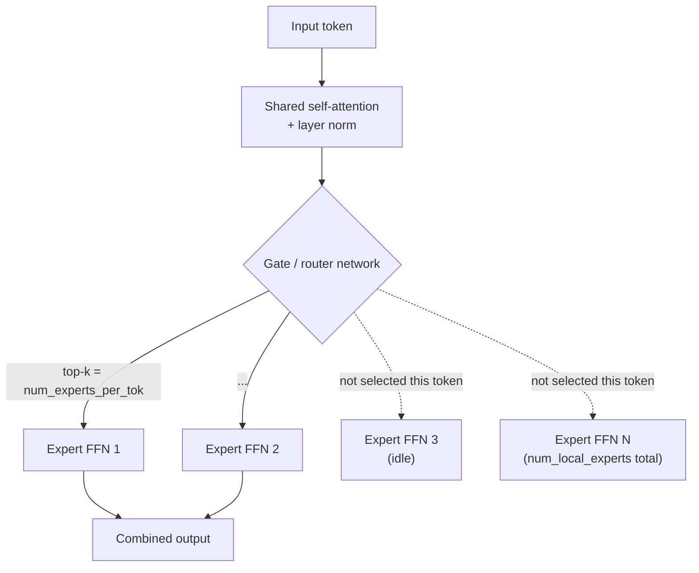

# Mixture of Experts and frankenMoE: the architecture axis

This page covers a third classification axis, orthogonal to both
[task-and-pipeline-classification.md](task-and-pipeline-classification.md)
(what the model does) and
[parameter-count-and-scale.md](parameter-count-and-scale.md) (how big
it is): **how the model's parameters are organized internally** --
specifically, the distinction between a dense model, where every
parameter is used on every forward pass, and a Mixture of Experts
(MoE) model, where only a subset of the model's parameters activates
per token. Its primary source is Maxime Labonne's **"Create Mixtures
of Experts with MergeKit"** article (`huggingface.co/blog/mlabonne/frankenmoe`,
fetched 2026-09-03).

## 1. What a Mixture of Experts is

VERIFIED (frankenMoE blog, fetched 2026-09-03): an MoE architecture
achieves "improved efficiency and performance through multiple
specialised subnetworks," built from two core components. **Sparse MoE
layers** "replace the dense feed-forward network layers in the
transformer architecture," so that only a subset of experts activates
for any given input, in contrast to a dense model where the entire
feed-forward network engages on every token. A **gate network/router**
determines the token-to-expert assignment, routing each input to the
expert(s) best suited to it. Two configuration parameters govern the
architecture's shape: **`num_local_experts`**, the total number of
experts (8, for Mixtral); and **`num_experts_per_tok`**, the number of
experts actually engaged per token per layer (2, for Mixtral) --
"balancing accuracy against training/inference speed." Only the
feed-forward sublayers are replaced this way; the blog notes the
self-attention layers and layer-norm weights are shared across the
whole model rather than duplicated per expert, which is why Mixtral-8x7B's
real parameter count comes out to roughly 45B rather than a naive
56B (`8 x 7B`) -- "since non-FFN parameters remain shared."

This is the mechanism-level reason MoE models are attractive at all:
compute cost per token scales with `num_experts_per_tok` (a small,
fixed number), not with `num_local_experts` (the full parameter
count), so an MoE model can hold far more total learned capacity than
a same-compute-cost dense model while still running each individual
token through only a small, fixed fraction of it.

## 2. FrankenMoE vs. a native pretrained MoE

VERIFIED (same source): "the fundamental distinction concerns training
methodology." A **native MoE** (Mixtral is the blog's own example)
trains its experts and its router jointly, from scratch, as one
architecture from the start. A **frankenMoE** -- the blog's own term,
also called MoErges -- instead **"upcycle[s] existing [fine-tuned,
dense] models and initialize[s] the router afterward."** Concretely:
several already-trained dense models (each independently fine-tuned
for a different specialty -- chat, code, math, role-play, in the
blog's own worked example) each contribute their feed-forward layers
as one "expert" slot in the new MoE, while the self-attention and
layer-norm weights are taken from (shared with) a chosen base model,
mirroring the shared-attention structure described in §1. Only after
this layer-splicing/"frankensteining" step is the gate/router
network attached and initialized -- it was never trained jointly with
the experts the way a native MoE's router was, which is the entire
substance of the "franken-" prefix: the experts were never trained
to cooperate with a shared router, so getting a working router is a
separate, downstream problem that §3's methods address.

## 3. MergeKit's MoE mode: config and gate initialization

VERIFIED (same source): MergeKit builds a frankenMoE from a YAML
configuration naming a base model (source of the shared attention/norm
weights) and a list of expert source models, each expert paired with
one or more **positive prompts** -- example inputs the router should
learn to route toward that expert. Three router-initialization methods
are documented:

- **Random** -- weights are randomly initialized. The blog flags this
  as risking "identical expert selection" (the router fails to
  differentiate experts meaningfully) and states it "requires
  fine-tuning" afterward to become useful, i.e. it is not a
  self-sufficient method on its own.
- **Cheap embed** -- router weights are derived by "applying raw token
  embedding transformations across all layers." The blog describes
  this as "computationally inexpensive" -- no forward pass through the
  full expert models is required to compute it.
- **Hidden** -- the blog's recommended method: it "creates hidden
  representations of a list of positive and negative prompts by
  extracting them from the last layer of the LLM," and initializes the
  router from those representations. The blog states this method
  "proves most effective for appropriate token routing" of the three.

**Agentic relevance:** the choice of positive prompts *is*, in effect,
authoring a routing policy by example rather than by explicit rule --
conceptually close to how an agent harness's own semantic router
(`task-and-pipeline-classification.md` §6's `sentence-similarity`-based
routing) is configured by labeled example queries rather than a fixed
if/else tree. A harness builder assembling a frankenMoE for
tool-specialized behavior (one expert tuned for code tools, one for
search/retrieval tools, one for conversational chat) is doing the same
kind of per-capability specialization an agent harness's own subagent
or tool-routing layer does at the orchestration level -- just pushed
down into the model's own internal architecture instead of the
harness's control flow (`references/harnesses/agent-topology.md` and
`references/harnesses/inter-agent-messaging.md` document that
orchestration-level analogue).

## 4. Practical tradeoffs

VERIFIED (same source): the blog is explicit that frankenMoEs are not
a free efficiency win over a single dense model of comparable
capability. On **memory**: "even though only a fraction of the total
parameters are used during inference, the entire model, including all
experts, needs to be loaded into memory" -- so the VRAM requirement
tracks a frankenMoE's *full* parameter count (all experts combined,
via the rule of thumb on [parameter-count-and-scale.md](parameter-count-and-scale.md)
§3) even though only `num_experts_per_tok` of those experts' weights
actually execute per token. On **speed vs. a simpler alternative**: the
blog names the core caveat directly -- frankenMoEs' "higher VRAM
demand and slower inference speeds... can make it challenging to see
their advantage over simpler merging techniques" (i.e. a plain
weight-averaged merge of the same source models, without the MoE
routing overhead, may be a more practical choice depending on the
deployment target). Where frankenMoEs do show a clear advantage, per
the blog, is **knowledge preservation**: because each expert's
feed-forward weights are kept intact from its own specialized
fine-tune rather than averaged/blended with the others the way a
simple merge would, a frankenMoE is "preserving knowledge, which can
result in stronger models" than a same-source-model dense merge, at
the cost of the extra memory and routing overhead just described.

**Agentic relevance:** this is a direct, concrete instance of the
cost/perf tradeoff every model-selection decision in an agent harness
ultimately reduces to (see [parameter-count-and-scale.md](parameter-count-and-scale.md)
§5's capability-tier discussion) -- a frankenMoE trades additional
memory footprint (pay for the full, all-experts parameter count) for
either broader multi-specialty capability without a quality-diluting
merge, or for tool-use models that route different query shapes
(coding vs. conversational vs. mathematical, in the blog's own
example) to differently-specialized weights within a single served
model, rather than needing to orchestrate several fully separate
served models at the harness level.

## 5. Worked example: Beyonder-4x7B-v3

VERIFIED (same source): the blog's own named example combines four
Mistral-based 7B expert models -- **mlabonne/AlphaMonarch-7B** (chat),
**beowolx/CodeNinja-1.0-OpenChat-7B** (code),
**mlabonne/NeuralDaredevil-7B** (mathematics), and
**SanjiWatsuki/Kunoichi-DPO-v2-7B** (role-play) -- into a single
frankenMoE with two experts active per token, yielding a 24.2B-parameter
model (again below the naive `4 x 7B = 28B` because attention/norm
weights are shared per §1). The blog reports this composed model
"achieved top performance across multiple benchmarks whilst
demonstrating robustness to prompt variations" relative to its
individual 7B source experts.

## Sources

- Maxime Labonne, "Create Mixtures of Experts with MergeKit" --
  `huggingface.co/blog/mlabonne/frankenmoe`. Fetched 2026-09-03.
  Authoritative for every claim above: the sparse-MoE-layer/gate
  architecture, the frankenMoE-vs-native-MoE distinction, MergeKit's
  YAML config and three gate-initialization methods, the
  memory/speed/knowledge-preservation tradeoffs, and the
  Beyonder-4x7B-v3 worked example.
- [parameter-count-and-scale.md](parameter-count-and-scale.md), for
  the VRAM-per-parameter arithmetic §4 applies to a frankenMoE's full
  (all-experts) parameter count.
