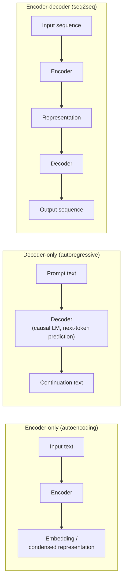

# Model terminology: a grounding glossary

This page is the terminology anchor for the rest of `references/models/` --
every other page in this area uses the terms defined here precisely and
consistently, and links back to this page rather than redefining them
inline. Its primary source is the **Hugging Face `transformers`
glossary** (`huggingface.co/docs/transformers/glossary`, fetched
2026-09-03), which the `transformers` docs themselves describe as
defining "general machine learning and Transformers terms to help you
better understand the documentation." Every definition below marked
VERIFIED is quoted or closely paraphrased from that page as fetched
this session. A small number of terms used throughout this area
(`checkpoint` used loosely, `capability tier`) are not their own
glossary entries there; those are flagged BEST CURRENT UNDERSTANDING,
UNCONFIRMED and explained from adjacent verified terms instead.

## 1. Learning-paradigm vocabulary

VERIFIED, from the glossary:

- **Supervised learning** -- "A form of model training that directly
  uses labeled data to correct and instruct model performance. Data is
  fed into the model being trained, and its predictions are compared
  to the known labels. The model updates its weights based on how
  incorrect its predictions were."
- **Unsupervised learning** -- "A form of model training in which data
  provided to the model is not labeled... Unsupervised learning
  techniques leverage statistical information of the data distribution
  to find patterns."
- **Self-supervised learning** -- "A category of machine learning
  techniques in which a model creates its own learning objective from
  unlabeled data. It differs from unsupervised learning and supervised
  learning in that the learning process is supervised, but not
  explicitly from the user." The glossary's own example is masked
  language modeling (defined in §3 below): the model is given text
  with tokens removed and learns to predict them, so the "label" is
  derived automatically from the unlabeled text itself rather than
  hand-annotated.
- **Semi-supervised learning** -- "A broad category of machine
  learning training techniques that leverages a small amount of
  labeled data with a larger quantity of unlabeled data."
- **Transfer learning** -- "A technique that involves taking a
  pretrained model and adapting it to a dataset specific to your task.
  Instead of training a model from scratch, you can leverage knowledge
  obtained from an existing model as a starting point."

These four categories matter for classification purposes because
**how** a model was trained is a separate axis from **what task** it
performs (covered on
[task-and-pipeline-classification.md](task-and-pipeline-classification.md))
and from **how many parameters** it has (covered on
[parameter-count-and-scale.md](parameter-count-and-scale.md)) -- a
model card can and often does report all three independently.

## 2. Pretraining, fine-tuning, and inference

VERIFIED, from the glossary:

- **Pretrained model** -- "A model that has been pretrained on some
  data (for instance all of Wikipedia). Pretraining methods involve a
  self-supervised objective, which can be reading the text and trying
  to predict the next word (see causal language modeling) or masking
  some words and trying to predict them (see masked language
  modeling)." The glossary adds that speech and vision models have
  their own pretraining objectives (Wav2Vec2's contrastive
  true/false speech-representation task; BEiT's masked-image-patch
  task), so "pretrained" is a general term not limited to text.
- **Finetuned models** -- "Finetuning is a form of transfer learning
  which involves taking a pretrained model, freezing its weights, and
  replacing the output layer with a newly added model head. The model
  head is trained on your target dataset."
- **Inference** -- "the process of evaluating a model on new data
  after training is complete."
- **Large language models (LLM)** -- "A generic term that refers to
  transformer language models (GPT-3, BLOOM, OPT) that were trained on
  a large quantity of data. These models also tend to have a large
  number of learnable parameters (e.g. 175 billion for GPT-3)." This
  is the glossary's own anchor for the parameter-count discussion on
  [parameter-count-and-scale.md](parameter-count-and-scale.md) -- note
  it defines "LLM" by two correlated properties (training-data volume
  and parameter count), not parameter count alone.

BEST CURRENT UNDERSTANDING, UNCONFIRMED: the word **checkpoint** is
used constantly throughout the Hugging Face ecosystem (model cards,
`from_pretrained("org/checkpoint-name")` calls, the `llm_tutorial_optimization`
guide cited on parameter-count-and-scale.md) to mean a specific
saved/versioned set of trained weights an architecture can be loaded
from, but it is not a standalone entry on the fetched glossary page
itself -- it is the practical, file-level referent of "pretrained
model" or "finetuned model" above, not a distinct concept.

## 3. Encoder, decoder, and encoder-decoder architectures

This is the single most load-bearing distinction for
[task-and-pipeline-classification.md](task-and-pipeline-classification.md),
which uses it to explain why `text-generation` and
`text2text-generation` are different pipeline tags rather than the
same one under two names.

VERIFIED, from the glossary:

- **Encoder models** ("also known as autoencoding models") -- "take an
  input (such as text or images) and transform them into a condensed
  numerical representation called an embedding. Oftentimes, encoder
  models are pretrained using techniques like masked language
  modeling, which masks parts of the input sequence and forces the
  model to create more meaningful representations." The glossary
  cross-references **autoencoding models** directly to this entry.
- **Masked language modeling (MLM)** -- "A pretraining task where the
  model sees a corrupted version of the texts, usually done by masking
  some tokens randomly, and has to predict the original text." This is
  the pretraining objective behind the `fill-mask` pipeline tag (see
  task-and-pipeline-classification.md §NLP task types).
- **Decoder models** ("Also referred to as autoregressive models") --
  "involve a pretraining task (called causal language modeling) where
  the model reads the texts in order and has to predict the next
  word. It's usually done by reading the whole sentence with a mask to
  hide future tokens at a certain timestep." The glossary
  cross-references **autoregressive models** directly to this entry.
- **Causal language modeling** -- "A pretraining task where the model
  reads the texts in order and has to predict the next word. It's
  usually done by reading the whole sentence but using a mask inside
  the model to hide the future tokens at a certain timestep." This is
  the pretraining objective behind the `text-generation` pipeline tag,
  and is the mechanism every modern chat/instruction-following LLM
  used in agent harnesses is trained with.
- **Sequence-to-sequence (seq2seq)** -- "Models that generate a new
  sequence from an input, like translation models, or summarization
  models (such as Bart or T5)." These are **encoder-decoder**
  architectures: an encoder condenses the input into a representation
  the way an encoder model does, and a decoder generates a new output
  sequence from that representation the way a decoder model does, both
  halves trained jointly. This is the architectural family behind the
  `text2text-generation` pipeline tag.
- **Decoder input IDs** -- "This input is specific to encoder-decoder
  models, and contains the input IDs that will be fed to the decoder...
  Most encoder-decoder models (BART, T5) create their
  `decoder_input_ids` on their own from the `labels`."

This three-way split is the architectural basis for the task
classification on the next page: encoder-only models (BERT-family)
back `fill-mask`, `text-classification`, `token-classification`,
`feature-extraction`, and `sentence-similarity`; decoder-only models
(GPT/Llama/Mistral-family) back `text-generation`; encoder-decoder
models (BART/T5-family) back `text2text-generation`, and are also the
architecture the glossary's own seq2seq entry names for translation
and summarization specifically.

## 4. Tokenization and model I/O

VERIFIED, from the glossary:

- **Token** -- "A part of a sentence, usually a word, but can also be
  a subword (non-common words are often split in subwords) or a
  punctuation symbol."
- **Input IDs** -- "token indices, numerical representations of tokens
  building the sequences that will be used as input by the model." The
  glossary's own worked example shows a WordPiece tokenizer splitting
  the out-of-vocabulary word "VRAM" into `V`, `##RA`, `##M` before
  conversion to integer IDs.
- **Attention mask** -- "an optional argument used when batching
  sequences together" that "indicates to the model which tokens should
  be attended to, and which should not" -- concretely, a binary tensor
  where `1` marks a real token and `0` marks a padding position added
  to equalize sequence lengths within a batch.
- **Token type IDs** (also called segment IDs) -- used by some models
  (BERT) to distinguish two sequences packed into one input (e.g. a
  question-answering context and its question), represented as a
  binary mask over the joined `[CLS] sequence_a [SEP] sequence_b [SEP]`
  input.
- **Position IDs** -- "transformers are unaware of the position of
  each token" on their own (unlike RNNs), so `position_ids` are "used
  by the model to identify each token's position in the list of
  tokens"; if not passed explicitly they default to absolute
  positional embeddings.
- **Labels** -- "an optional argument which can be passed in order for
  the model to compute the loss itself," shaped differently per task
  head (per-sequence for classification, per-token for token
  classification/MLM, per-target-sequence for seq2seq, etc. -- the
  glossary enumerates the exact tensor shape for each head type).
- **Model head** -- "the last layer of a neural network that accepts
  the raw hidden states and projects them onto a different dimension.
  There is a different model head for each task," e.g.
  `GPT2ForSequenceClassification` adds "a sequence classification head
  -- a linear layer -- on top of the base `GPT2Model`." The base models
  (e.g. bare `BertModel`) "do not accept labels... simply outputting
  features" -- i.e. a headless base model is exactly what backs the
  `feature-extraction` pipeline tag.
- **Backbone** -- "the network (embeddings and layers) that outputs
  the raw hidden states or features," usually feeding a head; the
  glossary's example is `ViTModel` used bare as a backbone under
  another model (DPT).

## 5. Feature extraction and multimodality

VERIFIED, from the glossary:

- **Feature extraction** -- "The process of selecting and transforming
  raw data into a set of features that are more informative and useful
  for machine learning algorithms. Some examples of feature extraction
  include transforming raw text into word embeddings and extracting
  important features such as edges or shapes from image/video data."
  This is the glossary-level definition behind the Hub's
  `feature-extraction` pipeline tag documented on
  [task-and-pipeline-classification.md](task-and-pipeline-classification.md).
- **Multimodal** -- "A task that combines texts with another kind of
  inputs (for instance images)."
- **Natural language processing (NLP)** -- "A generic way to say 'deal
  with texts.'"
- **Natural language understanding (NLU)** -- "All tasks related to
  understanding what is in a text (for instance classifying the whole
  text, individual words)."
- **Natural language generation (NLG)** -- "All tasks related to
  generating text (for instance... translation)."

These three (NLP/NLU/NLG) are the coarse category labels the task
taxonomy on the next page refines into concrete pipeline tags: NLU
tasks are `text-classification`, `token-classification`, `fill-mask`,
`question-answering`, `sentence-similarity`; NLG tasks are
`text-generation`, `text2text-generation`, `summarization`,
`translation`.

## 6. Why this page exists as a separate reference

Every other page in `references/models/` assumes the reader already
has these terms available and does not redefine "attention mask" or
"seq2seq" inline -- it links here instead, the same discipline
`references/rag/foundations.md` uses for `references/rag/`'s own
paper-level definitions. Where a later page in this area uses a term
from a *different* source (e.g. `num_local_experts` from the frankenMoE
blog on
[mixture-of-experts-and-frankenmerging.md](mixture-of-experts-and-frankenmerging.md),
or the affine/symmetric quantization scheme names from the Optimum
guide on [quantization.md](quantization.md)), that page defines the
term itself and cites its own source directly, rather than folding it
into this glossary -- this page's scope is bounded to what the
`transformers` glossary itself actually defines.

## Sources

- Hugging Face `transformers` glossary --
  `huggingface.co/docs/transformers/glossary`. Fetched 2026-09-03.
  Authoritative for every quoted definition in this page; version
  observed corresponds to the `v5.15.1` docs build.
