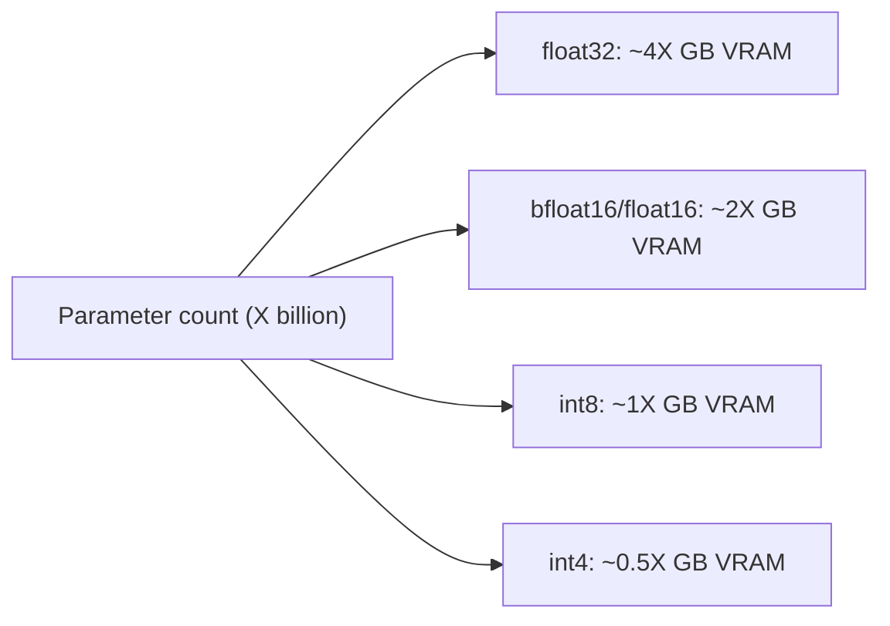

# Parameter count and scale: the second classification axis

If [task-and-pipeline-classification.md](task-and-pipeline-classification.md)
answers "what does this model do," this page answers "how big is it,"
which is the axis that actually determines whether an agent harness
can run a given model at all, on what hardware, at what latency, and
at what cost. This page assumes model-terminology.md's definitions of
**pretrained model** and **large language model (LLM)**.

## 1. What a "parameter" is, and what parameter count signals

VERIFIED (`transformers` glossary, fetched 2026-09-03, see
model-terminology.md §2): the glossary defines **large language models
(LLM)** as "a generic term that refers to transformer language models
(GPT-3, BLOOM, OPT) that were trained on a large quantity of data.
These models also tend to have a large number of learnable parameters
(e.g. 175 billion for GPT-3)." A parameter, in this sense, is one
learned numeric weight inside the model's matrices (attention
projections, feed-forward layers, embedding tables, and so on) --
model-terminology.md §4's **model head** and **backbone** entries
describe some of the structures those parameters live in. Parameter
count is a coarse proxy for two things that matter to an agentic-
development project far more directly than the raw number itself: how
much memory is required to hold the model, and (loosely, and with many
counter-examples in either direction) how much capability the model
has learned to encode.

## 2. Naming conventions: 7B, 13B, 70B

BEST CURRENT UNDERSTANDING, UNCONFIRMED as a single documented Hub
policy (neither the `transformers` glossary nor any of this page's
other sources devotes a page to naming convention itself) but directly
observable, consistent practice across widely-used open model
families: a model's parameter count, rounded to the nearest billion,
is appended to its name as a suffix -- `7B`, `13B`, `70B`, and so on
(e.g. the Llama family's 7B/13B/70B releases, Mistral's 7B release,
Mixtral's `8x7B` naming discussed on
[mixture-of-experts-and-frankenmerging.md](mixture-of-experts-and-frankenmerging.md)).
This convention exists because parameter count is the single most
Hub-searchable, card-visible number that predicts deployability --
whether a model fits on a given GPU, whether it can run locally at
all, and roughly what inference cost per token to expect -- more
reliably than the model's release date or benchmark scores, which
change per model family and are not directly comparable across
vendors. Because the same `XB` suffix is used across totally different
architectures, training-data recipes, and instruction-tuning regimes,
two same-suffix models (e.g. two different "13B" chat models) are not
guaranteed to have comparable capability -- the suffix is a scale
label, not a capability score.

## 3. Memory footprint: the load-bearing rule of thumb

VERIFIED (`huggingface.co/docs/transformers/llm_tutorial_optimization`,
fetched 2026-09-03): the guide gives an explicit, quotable formula for
the VRAM required just to *load* a model's weights, before any
inference-time activation or cache memory is counted:

> "Loading the weights of a model having X billion parameters requires
> roughly 4 \* X GB of VRAM in float32 precision"

and, because "models are... rarely trained in full float32 precision,
but usually in bfloat16 precision or less frequently in float16
precision":

> "Loading the weights of a model having X billion parameters requires
> roughly 2 \* X GB of VRAM in bfloat16/float16 precision"

The guide derives this directly from bytes-per-parameter: 4 bytes for
each float32 parameter, 2 bytes for each bfloat16/float16 parameter
(see [quantization.md](quantization.md) §2 for int8/int4's further
reduction to roughly 1 and 0.5 bytes per parameter respectively). The
guide's own worked examples, at bfloat16: **GPT-3** (175B) needs
`2 * 175 = 350 GB`; **BLOOM** (176B) needs `352 GB`; **Llama-2-70b**
needs `2 * 70 = 140 GB`; **Falcon-40b** needs `80 GB`; **MPT-30b**
needs `60 GB`; **StarCoder** (15.5B) needs `31 GB`. The guide notes
that "the largest GPU chip on the market is the A100 & H100 offering
80GB of VRAM" (as of its writing), so every one of those models except
StarCoder requires either quantization (see
[quantization.md](quantization.md)) or splitting the model across
multiple GPUs via tensor or pipeline parallelism to run at all on a
single accelerator generation of that class.

For short inputs specifically, the same guide states "the memory
requirement for inference is very much dominated by the memory
requirement to load the weights" -- i.e. for the common case of a
short prompt and a moderate number of generated tokens, the rule of
thumb above is a reasonable stand-in for total inference memory, not
just loading memory. That approximation breaks down for long-context
agentic workloads specifically, per §4 below.

## 4. Why scale interacts with context length: the KV cache

VERIFIED, same source: as context length grows, a second
parameter-count-dependent memory cost becomes significant --the
**key-value (KV) cache**, which stores each attention layer's key and
value vectors for every previous token so they need not be
recomputed at each auto-regressive decoding step. The guide computes
this concretely for `bigcode/octocoder`: at a hypothetical 16,000-token
input, "the number of float values that need to be stored in the
key-value cache" comes out to roughly 8 billion floats, and "storing 8
billion float values in float16 precision requires around 15 GB of RAM
which is circa half as much as the model weights themselves" for that
15.5B-parameter model. The guide names **Multi-Query Attention (MQA)**
and **Grouped-Query Attention (GQA)** as architectural techniques that
shrink this cost by sharing key-value projection weights across
attention heads (MQA: one shared pair for all heads; GQA: a small
number `n < n_head` of shared pairs, trading some of MQA's memory/speed
gain back for less capability loss) -- for the octocoder example, MQA
brings the 16,000-token KV cache from "15 GB to less than 400 MB." The
guide states its conclusion plainly: "it is strongly recommended to
make use of either GQA or MQA if the LLM is deployed with
auto-regressive decoding and is required to handle large input
sequences as is the case for example for chat" -- which describes
essentially every agent harness's own core loop (long-running
multi-turn sessions with growing tool-result and conversation history,
exactly the workload `references/harnesses/context-compression.md`
and `references/harnesses/memory-management.md` document from the
harness-policy side).

**Agentic relevance:** an agent harness's context grows continuously
as it accumulates tool results, prior turns, and retrieved documents
(see `references/harnesses/instruction-context-budget.md`), which is
precisely the workload where KV-cache growth -- not just base weight
memory -- becomes the binding constraint. A model choice that fits
comfortably at a short prompt length can still run out of memory or
degrade sharply in throughput once an agentic session's context grows
long, so scale-driven deployment decisions for agent harnesses need to
budget for KV-cache growth specifically, not only for the
parameter-count-to-weight-memory rule of thumb in §3.

## 5. Latency, cost, and capability tiers in practice

BEST CURRENT UNDERSTANDING, UNCONFIRMED as a single cited source (this
synthesizes the memory mechanics verified above rather than quoting a
single page that states it as policy), but a direct consequence of
§3-4: larger parameter count generally means (a) more VRAM/RAM needed
to hold the weights and KV cache, (b) more memory bandwidth consumed
per generated token, which the `llm_tutorial_optimization` guide
names directly as the actual per-token latency bottleneck for
auto-regressive decoding ("the required memory bandwidth for the
constant reloading can become a serious time bottleneck" during
decoding), and (c), correlated but not guaranteed, more capability per
the glossary's own LLM definition linking parameter count to training
data volume. These three facts compose into the practical tiers an
agent-harness builder chooses between:

- **Small models (roughly single-digit billions of parameters and
  below)** -- fit in consumer-GPU VRAM or even CPU RAM at reduced
  precision, cheap and fast enough to call on every request, but
  weakest at complex multi-step reasoning and long tool-use chains.
  Well suited to the auxiliary `feature-extraction`,
  `text-classification`, and `token-classification` roles named on
  [task-and-pipeline-classification.md](task-and-pipeline-classification.md)
  §5, §9, §10, rather than to an agent's own core reasoning loop.
- **Mid-scale models (roughly 7B-70B)** -- the range this page's naming
  convention in §2 is most associated with; the point at which a model
  becomes commonly usable as an agent's own core `text-generation`
  loop, at a cost of tens to low hundreds of gigabytes of VRAM at
  bfloat16 per §3's formula, making local/self-hosted deployment
  feasible on a single high-end workstation GPU or a small multi-GPU
  node, especially once quantized (see
  [quantization.md](quantization.md)).
- **Frontier-scale hosted models (from tens of billions up to
  reported/estimated hundreds of billions or more, often themselves
  Mixture-of-Experts architectures -- see
  [mixture-of-experts-and-frankenmerging.md](mixture-of-experts-and-frankenmerging.md))**
  -- generally consumed only via a hosted API rather than
  self-hosted, because §3's memory formula puts them well beyond
  single-node deployment; the harness pays per-token API cost and
  network latency instead of local VRAM cost, which is the deployment
  shape `references/harnesses/llm-api-contract.md` and
  `references/harnesses/auth-and-usage-accounting.md` document from
  the harness-integration side.

The practical decision an agent-harness builder faces -- local vs.
hosted, and which scale tier for which role in a multi-model pipeline
-- is therefore a direct function of this page's §3-4 memory mechanics
plus the task role from
[task-and-pipeline-classification.md](task-and-pipeline-classification.md):
route cheap, high-frequency, narrow sub-tasks to small models, and
reserve the largest available model for the steps that actually need
its reasoning capability, a pattern `references/harnesses/model-routing-and-selection.md`
documents in more harness-specific detail (per-harness routing
mechanisms) than this reference area covers.

## Sources

- `huggingface.co/docs/transformers/glossary` -- fetched 2026-09-03.
  Source of the LLM/parameter-count definition in §1 (see
  model-terminology.md).
- `huggingface.co/docs/transformers/llm_tutorial_optimization` --
  fetched 2026-09-03. Source of the float32/bfloat16/float16 VRAM
  rule-of-thumb formulas and worked examples in §3, and the KV-cache
  memory analysis and MQA/GQA mitigation in §4. Not one of this book's
  four assigned source URLs, but a `transformers` docs page fetched to
  ground the parameter-count-to-memory claims this page needed and
  none of the four assigned sources cover directly.
- Naming-convention discussion in §2 and the capability-tier synthesis
  in §5 are this page's own reasoning from the verified facts above,
  explicitly tagged BEST CURRENT UNDERSTANDING, UNCONFIRMED rather than
  attributed to any single fetched source.
