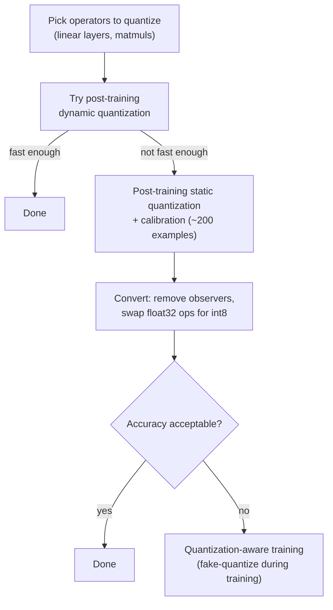

# Quantization: the deployment-precision axis

This is the fourth classification axis this reference area covers, and
the one most directly actionable at deployment time: given a chosen
task type ([task-and-pipeline-classification.md](task-and-pipeline-classification.md)),
a chosen scale ([parameter-count-and-scale.md](parameter-count-and-scale.md)),
and possibly a Mixture-of-Experts architecture
([mixture-of-experts-and-frankenmerging.md](mixture-of-experts-and-frankenmerging.md)),
**at what numeric precision are its weights (and activations) actually
stored and computed when it runs?** Its primary source is the Hugging
Face **Optimum quantization concept guide**
(`huggingface.co/docs/optimum/concept_guides/quantization`, fetched
2026-09-03).

## 1. Definition and motivation

VERIFIED (Optimum quantization guide, fetched 2026-09-03): "Quantization
is a technique to reduce the computational and memory costs of running
inference by representing the weights and activations with
low-precision data types like 8-bit integer (`int8`) instead of the
usual 32-bit floating point (`float32`)." The guide names three
concrete benefits of reducing bit-width: the resulting model "requires
less memory storage," "consumes less energy (in theory)," and integer
arithmetic "can be performed much faster" than floating-point
arithmetic for operations like matrix multiplication -- and lower
bit-width also "allows [running] models on embedded devices, which
sometimes only support integer data types" at all.

## 2. Precision formats

VERIFIED (same source): the guide names four common lower-precision
data types, each paired with the wider **accumulation data type** used
when summing/multiplying many values of that type (needed because,
e.g., two `int8` values near the representable maximum of 127 would
overflow `int8` itself if summed in that same precision): `float16`
(accumulated in `float16`), `bfloat16` (accumulated in `float32`),
`int16` (accumulated in `int32`), and `int8` (accumulated in `int32`).
The guide's "going further" section on numeric representation adds the
concrete bit layout for the floating-point formats: a sign bit, an
exponent field (5 bits for `float16`, 8 bits for `bfloat16`, 8 bits for
`float32`, 11 bits for `float64`), and a mantissa (11 bits, 10
explicitly stored, for `float16`; 8 bits, 7 explicitly stored, for
`bfloat16`; 24 bits, 23 explicitly stored, for `float32`). The two most
common quantization transitions the guide documents are `float32 ->
float16` and `float32 -> int8`.

**`float32 -> float16`** is comparatively simple, per the guide,
because "both data types follow the same representation scheme"
(floating-point). The guide names three practical questions to check
before quantizing an operation to `float16`: does the operation have a
`float16` kernel implementation; does the target hardware actually
support `float16` compute (the guide notes some Intel CPUs historically
"[have] been supporting `float16` as a storage type, but computation is
done after converting to `float32`," with full native compute support
arriving later in Cooper Lake/Sapphire Rapids); and is the operation
sensitive to `float16`'s narrower representable range -- the guide's
own example is `LayerNorm`'s epsilon (~`1e-12`), smaller than
`float16`'s smallest representable value (~`6e-5`), which "can cause
`NaN` issues."

## 3. Quantizing to int8: the affine scheme

VERIFIED (same source): `float32 -> int8` is harder, because `int8`
can represent only 256 distinct values against `float32`'s wide range.
The guide's **affine quantization scheme**: for a float `x` in range
`[a, b]`, `x = S * (x_q - Z)`, where `x_q` is the quantized `int8`
value, `S` (the **scale**) is a positive `float32`, and `Z` (the
**zero-point**) is the `int8` value corresponding to `float32` zero --
important, the guide notes, because zero "is used everywhere throughout
machine learning models" and must be exactly representable. The forward
direction is `x_q = round(x/S + Z)`, with values outside `[a, b]`
clipped to the nearest representable boundary. Determining `S` and `Z`
from an observed `[a, b]` range is itself a separate problem the guide
defers to the cited Jacob et al. 2017 paper and to Lei Mao's blog post,
named as further reading rather than reproduced in the guide itself.

## 4. Symmetric vs. affine, and per-tensor vs. per-channel granularity

VERIFIED (same source): the general `x = S*(x_q - Z)` mapping above is
called **affine** because the mapping from `[a,b]` to the `int8` space
is an affine transformation. A common special case is the **symmetric
quantization scheme**, which considers a symmetric float range `[-a,
a]` mapped onto the integer range `[-127, 127]` (deliberately excluding
`-128` from the full signed `int8` range `[-128, 127]`) -- this lets
`Z = 0` exactly, which "can provide a speedup since a lot of addition
operations can be skipped," at the cost of one lost representable
value out of 256.

Separately, quantization parameters can be computed at different
**granularities**: **per-tensor**, one `(S, Z)` pair for an entire
tensor, or **per-channel** (also per-axis), one `(S, Z)` pair for each
element along one chosen dimension -- the guide's example is a tensor
of shape `[N, C, H, W]` computing per-channel parameters along the `C`
dimension, yielding `C` separate `(S, Z)` pairs. Per-channel
quantization "can give a better accuracy" than per-tensor "but it
requires more memory" to store the extra scale/zero-point pairs -- an
explicit accuracy-vs-memory-overhead tradeoff on top of the base
precision-reduction tradeoff.

## 5. Calibration: dynamic quantization, static quantization, and QAT

VERIFIED (same source): quantizing weights to `int8` is straightforward
because "the actual range is known at quantization-time," but
activation ranges are not known in advance the same way, which is
where **calibration** comes in -- "the step during quantization where
the `float32` ranges are computed." The guide names three calibration
approaches, in increasing order of upfront cost and (generally)
resulting accuracy:

1. **Post-training dynamic quantization** -- the activation range for
   each activation "is computed on the fly at runtime." Gives strong
   results with minimal setup work, but the guide notes "it can be a
   bit slower than static quantization because of the overhead
   introduced by computing the range each time," and "it is also not
   an option on certain hardware."
2. **Post-training static quantization** -- the activation range is
   computed in advance, at quantization time, "typically by passing
   representative data through the model and recording the activation
   values." The guide's concrete steps: attach observers to record
   activation values, run "around 200 examples" through the model as a
   calibration dataset, then compute each range using a chosen
   calibration technique (below).
3. **Quantization-aware training (QAT)** -- the activation range is
   computed at training time itself, using "fake quantize" operators in
   place of plain observers: these record values the same way an
   observer does, but *also simulate the quantization error during
   training*, letting the model's own weights adapt to compensate for
   it before it is ever actually quantized for deployment.

For both static PTQ and QAT, the guide names concrete **calibration
techniques** for turning observed activation values into a `[a, b]`
range: **min-max** (the observed minimum and maximum directly -- "works
well with weights"), **moving average min-max** ("works well with
activations"), and **histogram-based** methods that additionally
choose a range by an optimization criterion -- **entropy**
minimization, **mean-square-error** minimization, or a fixed
**percentile** of observed values (noting exact percentile targeting
"is not always possible to exactly match... when doing symmetric
quantization").

The guide's own recommended **practical procedure** to quantize a
model to `int8`: (1) choose which operators to quantize -- "the ones
dominating in terms of computation time, for instance linear
projections and matrix multiplications"; (2) try post-training dynamic
quantization first, and stop there if it is fast enough; (3) otherwise
try post-training static quantization (attach observers, run
calibration); (4) choose and run a calibration technique; (5) convert
the model -- observers removed, `float32` operators swapped for their
`int8` counterparts; (6) evaluate accuracy, and if it is not good
enough, restart from step 3 with quantization-aware training instead of
static PTQ.

## 6. Practical VRAM impact for LLM deployment

VERIFIED (`huggingface.co/docs/transformers/llm_tutorial_optimization`,
fetched 2026-09-03 -- supplementary to the Optimum guide, cited
directly on [parameter-count-and-scale.md](parameter-count-and-scale.md)
§3 for its bf16/fp32 formulas): the same guide gives a concrete,
measured worked example of int8/int4 quantization's memory payoff for
a real LLM (`bigcode/octocoder`, ~15.5B parameters). Loaded at
bfloat16, peak measured VRAM was approximately 29 GB (matching the
`~2*X GB` rule of thumb from parameter-count-and-scale.md §3). Loaded
with 8-bit quantization (via the `bitsandbytes` library, `load_in_8bit=True`),
peak VRAM dropped to about 15 GB -- "down to just a bit over 15 GBs
and could therefore run this model on consumer GPUs like the 4090."
Loaded at 4-bit (`load_in_4bit=True`), peak VRAM dropped further to
about 9.5 GB -- "just 9.5GB! That's really not a lot for a >15 billion
parameter model," per the guide, small enough to run on "RTX3090, V100,
and T4," GPUs it names as "quite accessible for most people."

The same guide is explicit about the accompanying speed tradeoff,
consistent with the Optimum guide's own framing in §1 above: because
dequantization happens at compute time ("quantize all weights to the
target precision; load the quantized weights... pass the input
sequence... in bfloat16 precision; dynamically dequantize weights to
bfloat16 to perform the computation"), "inference time is often *not*
reduced when using quantized weights, but rather increases" -- 4-bit
in particular runs slower than 8-bit "due to the more aggressive
quantization method... leading to quantize and dequantize taking
longer during inference." The guide's own summary: "model quantization
trades improved memory efficiency against accuracy and in some cases
inference time" -- memory savings are close to guaranteed; latency and
accuracy costs are real but often small enough, especially for
text-generation-style next-token-argmax decoding, to be worth paying.
The guide adds one further mechanism-level note specific to text
generation: quantization "works especially well for text generation
since all we care about is choosing the set of most likely next tokens
and don't really care about the exact values of the next token logit
distribution" -- as long as an `argmax`/`top-k` operation over the
logits gives the same result, the precision loss from quantization is
largely invisible to the final output.

VERIFIED, same source, on the energy dimension the Optimum guide
raises only in passing ("consumes less energy (in theory)"): a
benchmarking study cited in the guide's "Energy efficiency in
practice" section found the relationship is size-dependent rather than
uniformly favorable -- for large models (>=5B parameters), NF4
quantization "achieves near-FP16 energy consumption with significant
memory savings," but for small models (<3B parameters), the same NF4
quantization "can *increase* energy consumption by 25-56% despite
achieving 75% memory compression," because "the dequantization
overhead exceeds the memory bandwidth savings at this scale." The same
section also notes batch size has a larger energy effect than
precision choice at typical serving batch sizes ("increasing batch
size from 1 to 8-64 reduces per-token energy by 84-96%").

## 7. When to quantize an agentic-pipeline model

Synthesizing §1-6 for an agent-harness deployment decision: quantize
when the deployment target's VRAM budget cannot fit the model at its
native precision per the [parameter-count-and-scale.md](parameter-count-and-scale.md)
§3 rule of thumb -- the load-bearing case being running a mid-to-large
`text-generation` model locally on consumer or single-GPU-workstation
hardware rather than a hosted multi-GPU cluster. Prefer int8 over int4
when the accuracy margin matters and the extra few gigabytes are
affordable (§6's 15 GB vs. 9.5 GB for the same octocoder example);
prefer int4 when fitting on the smallest available accelerator is the
binding constraint and the workload tolerates a further, generally
modest, quality/latency cost. For the small auxiliary models named
throughout [task-and-pipeline-classification.md](task-and-pipeline-classification.md)
(`feature-extraction`, `text-classification`, `token-classification`
models, typically well under 3B parameters), §6's energy-efficiency
finding is a caution worth carrying forward specifically: quantizing
these smaller, high-call-frequency models may not pay off the way it
reliably does for a large `text-generation` model, and should be
benchmarked rather than assumed. QAT (§5) is worth the extra training
investment specifically when a quantized model will be served at very
high call volume for a long lifetime (justifying the one-time
retraining cost) and static/dynamic PTQ's accuracy loss is
unacceptable for the task -- most agent-harness deployments, which
consume off-the-shelf pre-quantized checkpoints (e.g. GGUF/AWQ/GPTQ
community quantizations of a released model) rather than quantizing a
model themselves, will use PTQ-quantized checkpoints by default and
only reach for QAT if the model is being trained/fine-tuned in-house
anyway.

## Sources

- Hugging Face Optimum, "Quantization" concept guide --
  `huggingface.co/docs/optimum/concept_guides/quantization`. Fetched
  2026-09-03. Authoritative for the definition, precision formats,
  affine/symmetric schemes, per-tensor/per-channel granularity, the
  three calibration approaches (dynamic PTQ, static PTQ, QAT), the
  calibration-technique list, and the practical int8 quantization
  procedure (§1-5).
- `huggingface.co/docs/transformers/llm_tutorial_optimization` --
  fetched 2026-09-03. Source of the concrete octocoder VRAM
  measurements (29 GB / 15 GB / 9.5 GB across bf16/int8/int4), the
  inference-speed-vs-memory tradeoff framing, the text-generation-
  specific argmax/top-k robustness-to-quantization note, and the
  cited energy-efficiency benchmarking findings in §6. Not one of this
  book's four assigned source URLs, fetched as a supplementary
  `transformers` docs page to ground §6's practical numbers, the same
  page also cited on
  [parameter-count-and-scale.md](parameter-count-and-scale.md) §3.
- §7 is this page's own synthesis of the verified facts above for an
  agentic-deployment decision, not itself a claim attributed to either
  source.
