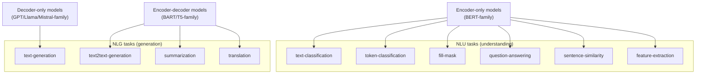

# Task and pipeline classification: what a model is *for*

This page covers the first and coarsest axis a Hugging Face Hub model
is classified along: its **task**, also called its **pipeline type**.
It assumes the encoder/decoder/encoder-decoder vocabulary from
[model-terminology.md](model-terminology.md) -- read that page first if
those terms are unfamiliar.

## 1. A sourcing note: what `docs/hub/models-tasks` actually documents

VERIFIED (fetched 2026-09-03): the assigned source URL,
`huggingface.co/docs/hub/models-tasks`, does **not** itself enumerate
task definitions the way this page's title might suggest. As currently
published, that page is titled "Tasks" and its actual content is a
**contributor's guide for proposing a brand-new task type to the Hub**
-- its own opening definition is: "Tasks, or pipeline types, describe
the 'shape' of each model's API (inputs and outputs) and are used to
determine which Inference API and widget we want to display for any
given model," followed immediately by process instructions ("open a
new issue in the `huggingface_hub` repository... use the 'Adding a new
task' template"), the three ways a new task's inference can be wired
up (a `transformers` pipeline class, a Community Inference API
library, or custom inference code), and the UI-registration steps
(adding the task to `huggingface.js`'s `PIPELINE_DATA`, picking an
icon, building a widget). It explicitly says the Hub's task
classification "is relatively coarse-grained... you should rarely have
to create a new task" -- which is the page's one substantive framing
claim about task classification as a *mechanism*: task/pipeline tags
are a fixed, curated, deliberately small vocabulary, not something a
model author extends freely per model.

Because that page does not define the individual task types
(`text-generation`, `feature-extraction`, etc.) an agentic-development
reader actually needs, this page cross-verifies each one directly
against its own dedicated Hub task page (`huggingface.co/tasks/<task>`,
all fetched 2026-09-03) -- the same Hub surface `docs/hub/models-tasks`
describes the governance process for. Every task definition below is
VERIFIED against those pages, named individually per task.

## 2. The task taxonomy, top level

VERIFIED (`huggingface.co/tasks`, fetched 2026-09-03): the Hub groups
its pipeline tags into six top-level categories: **Multimodal**
(Document Question Answering, Image-Text-to-Text, Visual Question
Answering, and others combining more than one input/output modality),
**Natural Language Processing** (Feature Extraction, Fill-Mask,
Question Answering, Sentence Similarity, Summarization, Table Question
Answering, Text Classification, Text Generation, Text Ranking, Token
Classification, Translation, Zero-Shot Classification), **Computer
Vision** (Image Classification, Object Detection, Image Segmentation,
Text-to-Image, and others), **Audio** (Audio Classification,
Automatic Speech Recognition, Text-to-Speech, Audio-to-Audio),
**Tabular** (Tabular Classification, Tabular Regression), and
**Reinforcement Learning**.

An agentic-development project overwhelmingly interacts with the **NLP**
category -- the model doing an agent's own reasoning/planning/tool-call
generation is a `text-generation` model, and most of an agent
pipeline's auxiliary models (retrievers, rerankers, classifiers,
extractors) are other NLP task types. Computer Vision and Audio task
types matter to an agent harness only insofar as it needs a specific
capability wired in as a tool (e.g. an OCR/image-captioning call, a
speech-to-text tool) rather than as the agent's own core loop model,
so this page covers the NLP category in full depth and does not
enumerate the Vision/Audio/Tabular/RL categories task-by-task.

## 3. `text-generation`

VERIFIED (`huggingface.co/tasks/text-generation`, fetched 2026-09-03):
"Generating text is the task of generating new text given another
text. These models can, for example, fill in incomplete text or
paraphrase." The page groups both decoder-only and instruction-tuned
chat models under this one tag, and names it as covering "popular
large language models that are used for chats or following
instructions" (Mixtral 8x7B, Cohere Command R+, Meta Llama3 70B cited
as examples), code-generation models trained on source code (StarCoder
cited, "80+ languages"), and open-ended story generation from a
prompt. Mechanically, per the page: completion models "predict the
next word given a bunch of words" -- i.e. autoregressive, causal-LM
decoding as defined on model-terminology.md §3 -- and instruction-tuned
variants "will produce better responses to instructions than base
models," which is the practical reason agent harnesses almost always
select an instruction/chat-tuned checkpoint rather than a raw
base-pretrained decoder.

**Agentic relevance:** this is the task type behind the model that
*is* the agent -- every harness documented in `references/harnesses/`
(Claude Code, Copilot CLI, OpenCode, and the rest) is, at its core, a
loop that repeatedly calls a `text-generation`-task model, feeds it a
system prompt plus conversation/tool-result history, and interprets
its output as either free text or a structured tool call (see
`references/harnesses/agent-loop.md` for the Thought/Action/Observation
framing this feeds into, and
`references/harnesses/tool-schema-and-interface-design.md` for how
tool-call structure is layered on top of raw text generation). Model
selection for an agent's *own* reasoning loop is a `text-generation`
selection decision, further refined by the scale axis
([parameter-count-and-scale.md](parameter-count-and-scale.md)) and the
precision axis ([quantization.md](quantization.md)).

## 4. `text2text-generation`

The dedicated `huggingface.co/tasks/text2text-generation` page returned
HTTP 404 when fetched this session (2026-09-03) -- it is not currently
a live standalone Hub task page, unlike the other NLP tasks on this
list. BEST CURRENT UNDERSTANDING, UNCONFIRMED for the tag's continued
existence as a distinct `pipeline_tag` value versus having been folded
into the Hub's broader `text-generation` category (the fetched
`text-generation` task page's own wording -- "this task encompasses
both text-generation and text-to-text generation models" -- is
consistent with that folding). What *is* VERIFIED, from
model-terminology.md's glossary citations: `text2text-generation` names
the pipeline for **encoder-decoder (seq2seq)** models -- "models that
generate a new sequence from an input, like translation models, or
summarization models (such as Bart or T5)," per the `transformers`
glossary's own seq2seq entry -- as distinct from `text-generation`'s
decoder-only, causal, continue-the-prompt shape. Concretely: a
`text-generation` call hands the model a prompt and asks it to extend
it; a `text2text-generation` call hands an encoder-decoder model a
complete input sequence (e.g. a sentence in French) and asks it to
produce a complete, independently-structured output sequence (e.g. the
same sentence in English) -- the model's decoder is conditioned on the
encoder's representation of the whole input rather than continuing
that input's own token stream.

**Agentic relevance:** an agent-building project would reach for a
`text2text-generation`-shaped model specifically for a fixed,
well-defined input-to-output transformation used as one step of a
pipeline or as a tool the agent calls -- a dedicated translation step,
a dedicated summarization/compaction step (see
`references/harnesses/context-compression.md` for the harness-level
mechanics of *why* an agent harness needs to shrink its own context;
a small `text2text-generation` summarizer is one way to implement that
compaction step) -- rather than for the agent's own open-ended
reasoning loop, which needs `text-generation`'s prompt-continuation
shape instead. In practice, most current agent harnesses use a single
large instruction-tuned `text-generation` model for both roles
(reasoning and any internal summarization), because modern
decoder-only chat models can be prompted to summarize just as well as
a dedicated seq2seq model can -- the `text2text-generation` distinction
is more visible in classic NLP pipeline design than in current
LLM-agent harness design, but understanding it is still necessary to
read model cards correctly (a `T5`/`BART`-family checkpoint's
`pipeline_tag` will say `text2text-generation`, not `text-generation`,
and its inference API shape differs accordingly).

## 5. `feature-extraction`

VERIFIED (`huggingface.co/tasks/feature-extraction`, fetched
2026-09-03): "Feature extraction is the task of extracting features
learnt in a model" -- concretely, transforming input data into
numerical embeddings that capture learned patterns and semantic
meaning, produced by a headless base model (per model-terminology.md
§4's "backbone" entry -- a bare `BertModel`, for instance, "does not
accept labels... simply outputting features"). The page names transfer
learning (a model trained on one domain's text learns grammatical
structure transferable to a different classification task), retrieval
and reranking (finding and reordering relevant documents from a large
corpus by embedding similarity), and explicitly retrieval-augmented
generation: "Feature extraction models (primarily retrieval and
reranking models) can be used in RAG to reduce model hallucinations
and ground the model." The `sentence-transformers` library is named as
the dominant tool for producing embeddings for this purpose, and the
MTEB leaderboard as the standard benchmark for comparing
feature-extraction/embedding models.

**Agentic relevance:** this is the task type behind an agent's
retrieval stack -- every embedding model documented across
`references/rag/` (used to embed a document corpus into a vector
store, per `references/rag/basic-rag-pipeline.md` and
`references/rag/vector-store-integrations.md`) is a
`feature-extraction`-task model. It is also the mechanism behind
semantic tool-selection and semantic caching (`references/rag/semantic-caching.md`):
if an agent harness embeds candidate tool descriptions or past-query
cache keys to compare against an incoming request by cosine distance,
that embedding step is a `feature-extraction` call. Because these
models produce a fixed-size vector rather than free text, they are
typically small (tens to a few hundred million parameters is common)
relative to the `text-generation` model doing the agent's own
reasoning, which matters directly for the cost/latency tradeoffs on
[parameter-count-and-scale.md](parameter-count-and-scale.md) -- an
agent harness commonly pairs one large `text-generation` model with
several much smaller `feature-extraction`/`sentence-similarity` models
run far more frequently and far more cheaply per call.

## 6. `sentence-similarity`

VERIFIED (`huggingface.co/tasks/sentence-similarity`, fetched
2026-09-03): "Sentence Similarity is the task of determining how
similar two texts are," implemented by converting "input texts into
vectors (embeddings) that capture semantic information and calculate
how close (similar) they are between them," with similarity most
commonly scored by cosine similarity ("the cosine of the angle between
two vectors"). The page names information retrieval (ranking documents
by similarity score against a query) and clustering/grouping
(organizing texts by semantic relatedness) as its two primary use
cases, and identifies `sentence-transformers` as the library built
specifically around this task.

**Agentic relevance:** `sentence-similarity` is `feature-extraction`'s
downstream consumer, not an architecturally different task -- both
tags describe the same embedding models, `sentence-similarity` framing
usage around the comparison step (cosine distance between two already-
produced embeddings) rather than the embedding-production step itself.
An agent harness's retriever, its semantic router (deciding which tool
or which subagent a query should go to based on embedding similarity
to labeled examples), and its semantic cache lookup are all
`sentence-similarity` operations layered on top of `feature-extraction`
output.

## 7. `question-answering`

VERIFIED (`huggingface.co/tasks/question-answering`, fetched
2026-09-03): "Question Answering models can retrieve the answer to a
question from a given text, which is useful for searching for an
answer in a document." The page distinguishes three variants:
**extractive QA**, where the model identifies and pulls the answer
directly as a span from the supplied context (typically BERT-family
encoder models, e.g. `deepset/roberta-base-squad2`); **open generative
QA**, where the model produces a free-text answer conditioned on
supplied context (related to `text-generation`); and **closed
generative QA**, where no context is supplied and the model answers
purely from what it learned during training. It further distinguishes
open-domain (unrestricted subject matter) from closed-domain models
(specialized to a field, e.g. legal or medical documents), and names
`google/tapas-base-finetuned-wtq` as a specialized model for
table-structured question answering.

**Agentic relevance:** extractive QA is a narrower, cheaper alternative
to a full RAG-plus-generation pipeline when the answer is known to be a
literal span inside a retrieved document -- an agent harness that needs
to pull a specific fact out of a tool result without paying for a full
generation call can route that sub-step to a small extractive QA
model instead of the agent's main `text-generation` model. "Closed
generative QA" is, definitionally, exactly what an agent's main LLM
does whenever it answers from its own parametric knowledge without
calling a retrieval tool -- naming that path explicitly is useful when
deciding, per query, whether an agent should retrieve at all (the same
decision `references/rag/foundations.md` §5 documents the HuggingFace
Agents Course framing as an agentic choice rather than a fixed
pipeline step).

## 8. `summarization`

VERIFIED (`huggingface.co/tasks/summarization`, fetched 2026-09-03):
"Summarization is the task of producing a shorter version of a
document while preserving its important information," distinguishing
**extractive** summarization (retrieving/selecting existing sentences
from the source) from **abstractive** summarization (generating novel
text that was not present verbatim in the source). The page names
`facebook/bart-large-cnn` (an encoder-decoder, `text2text-generation`-
family checkpoint per §4 above) as "a strong summarization model
trained on English news articles," and separately names T5-style
sequence-to-sequence architectures as the abstractive approach.

**Agentic relevance:** directly relevant to context-window management
-- summarization is the concrete mechanism behind compacting long tool
outputs, long conversation history, or a large retrieved document set
down to a size the agent's main model's context budget can absorb (see
`references/harnesses/context-compression.md` and
`references/harnesses/instruction-context-budget.md` for the
harness-level policy question of *when* to compact; this task tag is
the model-level mechanism that performs the compaction once triggered).
As with `text2text-generation` in §4, current agent harnesses commonly
prompt their own main `text-generation` model to summarize inline
rather than routing to a dedicated `summarization`-tagged checkpoint,
trading a small amount of extra cost against not needing a second
model in the deployment.

## 9. `text-classification`

VERIFIED (`huggingface.co/tasks/text-classification`, fetched
2026-09-03): "Text Classification is the task of assigning a label or
class to a given text." Named use cases: sentiment analysis on
customer-facing text, natural language inference (classifying a
premise/hypothesis pair as entailment, contradiction, or neutral), and
grammatical-acceptability judgment. Example models cited include
`distilbert-base-uncased-finetuned-sst-2-english` for general sentiment,
domain-specialized variants (`ProsusAI/finbert` for financial
sentiment, `cardiffnlp/twitter-roberta-base-sentiment-latest` for
tweets), and `papluca/xlm-roberta-base-language-detection` for language
identification.

**Agentic relevance:** this is the task type behind cheap, low-latency
**guardrail and routing** classifiers sitting in front of or alongside
an agent's main model -- intent classification (which tool-family or
subagent should handle this request), input/output moderation
classifiers, language-detection gates before a translation step, and
NLI-style consistency checks (e.g. verifying a generated claim is
entailed by retrieved evidence, a lightweight alternative to the
LLM-as-judge critique agents documented in
`references/rag/rag-evaluation.md`). Because these are typically small
encoder-only models, they are far cheaper per call than routing the
same decision through the main `text-generation` model, which is the
practical reason many harnesses put a `text-classification` model in
the hot path even when a large LLM is also available.

## 10. `token-classification`

VERIFIED (`huggingface.co/tasks/token-classification`, fetched
2026-09-03): "a natural language understanding task in which a label
is assigned to some tokens in a text." The page's two named variants:
**Named Entity Recognition (NER)** -- "the task of recognising named
entities in a text. These entities can be the names of people,
locations, or organisations" (`dslim/bert-base-NER` cited as a general
model, `blaze999/Medical-NER` as a domain-specialized one) -- and
**part-of-speech (PoS) tagging**, where "the model recognises parts of
speech, such as nouns, pronouns, adjectives, or verbs."

**Agentic relevance:** structured information extraction from
unstructured tool output or documents -- pulling out named entities
(people, organizations, dates, identifiers) as a cheap, deterministic-
shaped alternative to asking the main LLM to extract and format that
same information as JSON. Also directly relevant to PII redaction/
guardrail pipelines that need to locate specific entity spans in text
before it is either sent to a model or logged, a concern
`references/harnesses/permissions-and-sandboxing.md` and this book's
observability pages touch on from the harness-policy side without
naming the underlying model task explicitly.

## 11. `fill-mask`

VERIFIED (`huggingface.co/tasks/fill-mask`, fetched 2026-09-03):
"Masked language modeling is the task of masking some of the words in
a sentence and predicting which words should replace those masks" --
this is the pipeline-level exposure of the masked-language-modeling
pretraining objective defined on model-terminology.md §3, applied at
inference time to encoder-only models like BERT. The page frames its
practical use narrowly: **domain adaptation**, i.e. continuing to
train (or directly reusing) a masked-LM on a domain-specific corpus
(medical, legal) before fine-tuning it further for a downstream task
such as `text-classification` or `question-answering`; the `fill-mask`
pipeline itself lets a user pass text containing a `<mask>` token and
returns ranked probable replacements.

**Agentic relevance:** the weakest direct link to agent-harness
engineering of any task on this page -- `fill-mask` is overwhelmingly
a **pretraining/model-preparation-time** task (how an encoder model
was trained, or how it gets domain-adapted before fine-tuning) rather
than something an agent harness calls at request time. It is included
here because it explains *why* encoder models exist and what
`text-classification`/`token-classification`/`feature-extraction`
models were pretrained to do before being fine-tuned or used headless
-- the mechanism underlying every encoder-based auxiliary model named
in §5, §9, and §10 above.

## 12. `translation`

VERIFIED (`huggingface.co/tasks/translation`, fetched 2026-09-03):
"Translation is the task of converting text from one language to
another." The page's named use case is multilingual conversational
agents specifically, via two concrete strategies: translating an
entire training dataset of intents/responses to bootstrap a
classification model in a new target language, or translating user
input and agent output live at request time to bridge languages the
core model was not trained/tuned in. Example models: `facebook/nllb-200-1.3B`
(broad language coverage, strong on low-resource languages),
`google-t5/t5-base` (a general-purpose `text2text-generation`
Transformer usable for English-to-German/French/Romanian translation
among other seq2seq tasks), and `Helsinki-NLP/opus-mt-en-fr` (a
checkpoint dedicated to one language pair).

**Agentic relevance:** the one task on this page whose own Hub
documentation names agent use cases explicitly. A harness serving
users across languages can either translate at the edges (user input
in, translate to the model's strongest language, run the main
`text-generation` loop, translate the output back out) or rely on a
sufficiently multilingual `text-generation` model directly -- the
dedicated-translation-model path trades an extra model and an extra
network/inference hop for potentially better translation quality and
lower cost per call than routing translation through a large general
LLM.

## Sources

- `huggingface.co/docs/hub/models-tasks` -- fetched 2026-09-03.
  Authoritative for the Hub's task/pipeline-tag governance mechanism
  (how a new task type gets proposed, wired into the Inference API,
  and surfaced in the UI) and for the one-sentence framing of what a
  task/pipeline tag is; NOT a source for individual task definitions
  (see §1 above for why).
- `huggingface.co/tasks` (index) and the following per-task pages, all
  fetched 2026-09-03: `/tasks/text-generation`, `/tasks/feature-extraction`,
  `/tasks/sentence-similarity`, `/tasks/question-answering`,
  `/tasks/summarization`, `/tasks/text-classification`,
  `/tasks/token-classification`, `/tasks/fill-mask`, `/tasks/translation`.
  `/tasks/text2text-generation` returned HTTP 404 this session (see §4).
  These pages are the actual source of every per-task definition and
  quoted example above.
- [model-terminology.md](model-terminology.md), itself sourced from the
  `transformers` glossary -- used here for the encoder/decoder/seq2seq
  architectural framing underlying §3, §4, §5, and §11.
