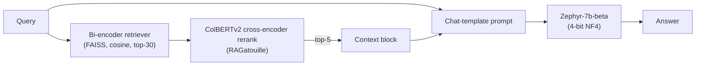

# Advanced RAG techniques: token-aware chunking, embedding visualization, and reranking

Source: **"Advanced RAG on Hugging Face documentation using
LangChain"**, authored by Aymeric Roucher
(huggingface.co/learn/cookbook/advanced_rag, notebook fetched this
session as raw `.ipynb`). The notebook explicitly positions itself as
the sequel to the introductory notebook covered in
`basic-rag-pipeline.md` — its own opening line: "For an introduction to
RAG, you can check [this other cookbook]" (`rag_zephyr_langchain`) —
and frames its purpose around a single diagram it describes as marking,
"in blue[,] all possibilities for system enhancement," with the
notebook's own framing that "tuning the system properly will yield
significant performance gains." This page documents each of the
concrete tuning levers the notebook actually exercises: token-aware
chunking, embedding-space visualization, and cross-encoder reranking,
in that order, plus the further levers the notebook names but leaves as
future work.

## 1. The retriever half: chunk size, chunking method, and the token-vs-character trap

The notebook's knowledge base is the `m-ric/huggingface_doc` dataset
loaded via `datasets.load_dataset`, wrapped into LangChain `Document`
objects. Its first chunking pass uses a plain
`RecursiveCharacterTextSplitter` with `chunk_size=1000` characters and
a hierarchical, Markdown-aware separator list taken from LangChain's
own `MarkdownTextSplitter` class: `["\n#{1,6} ", "```\n", "\n\\*\\*\\*+\n",
"\n---+\n", "\n___+\n", "\n\n", "\n", " ", ""]` — i.e. split first on
Markdown headings, then code fences, then horizontal rules, then
paragraph and line breaks, and only fall back to splitting mid-word as
an absolute last resort. The notebook's own explanation of recursive
chunking in general: "the method will first break down the document
wherever there is a double line break... [then] again on simple line
breaks... then on sentence ends... if some chunks are still too big,
they will be split whenever they overflow the maximum size" — the
global document structure is preserved at the cost of some variation in
final chunk size.

The notebook then deliberately surfaces a subtle bug in that first
pass: chunk size was counted in **characters**, but the embedding
model (`thenlper/gte-small`) truncates its input at a fixed
`max_seq_length` counted in **tokens**. Plotting the resulting
token-length histogram, the notebook observes "the chunk lengths are
not aligned with our limit of 512 tokens, and some documents are above
the limit, thus some part of them will be lost in truncation" — a
character-based chunk-size parameter silently produces oversized
chunks whenever the underlying text is token-dense (code, dense
technical prose), and those chunks get silently truncated by the
embedder with no error raised. The fix demonstrated is to switch to
`RecursiveCharacterTextSplitter.from_huggingface_tokenizer(...)`, which
counts length via the embedding model's own tokenizer instead of raw
character count, with `chunk_overlap` set to `chunk_size / 10` and
duplicate chunks removed via a dict-keyed dedup pass over
`doc.page_content`. This chunking bug and its fix is the single most
concrete, reusable lesson this notebook contributes beyond the
introductory notebook: **always size chunks in the same unit the
embedding model itself will truncate on, not in characters, unless you
have separately verified the two are proportional for your corpus.**

## 2. Distance metric and index choice

The notebook builds the vector index with FAISS via
`langchain_community.vectorstores.FAISS`, explicitly setting
`distance_strategy=DistanceStrategy.COSINE` and normalizing embeddings
at encode time (`encode_kwargs={"normalize_embeddings": True}`),
because, per the notebook, "our particular model works well with
cosine similarity." It gives a compact definition of the three common
distance choices: "**Cosine similarity** computes the similarity
between two vectors as the cosinus of their relative angle... **Dot
product** takes into account magnitude, with the sometimes undesirable
effect that increasing a vector's length will make it more similar to
all others... **Euclidean distance** is the distance between the ends
of vectors," and notes that "once vectors are normalized, the choice of
a specific distance does not matter much" — i.e. cosine and normalized
dot product/Euclidean become equivalent rankings once every vector has
unit norm, so the real decision is whether to normalize, not which
metric name to pick afterward.

## 3. Visualizing the embedding space with PaCMAP

To make the abstract "nearest neighbor in embedding space" operation
concrete, the notebook projects the full set of chunk embeddings (384
dimensions, matching `gte-small`'s output size) down to two dimensions
with **PaCMAP**, chosen, per the notebook, over alternatives like
t-SNE or UMAP because "it is efficient (preserves local and global
structure), robust to initialization parameters and fast." It embeds a
user query into the same space and plots it as a distinctly marked
point among the corpus chunks, coloring chunks by source document, to
give a visual account of why nearest-neighbor search over embeddings
retrieves the chunks it does — semantically similar chunks cluster
spatially, and retrieval is literally "find the k corpus points closest
to the query's point." This is a diagnostic/pedagogical technique
specific to this notebook, not a production pipeline component.

## 4. The reader half: prompt, and reranking with ColBERTv2

The reader model is again `HuggingFaceH4/zephyr-7b-beta`, loaded
4-bit-quantized exactly as in `basic-rag-pipeline.md` §5, with the
notebook noting the reader's context window must be large enough to
hold the retrieved-context block: "the reader model's `max_seq_length`
must accommodate our prompt, which includes the context output by the
retriever call: the context consists of 5 documents of 512 tokens each,
so we aim for a context length of 4k tokens at least." The prompt is
built via `tokenizer.apply_chat_template` on an explicit system/user
message pair rather than a hand-written template string (the more
general approach the introductory notebook flagged but didn't use),
with the system message instructing the model to "give a comprehensive
answer to the question... Provide the number of the source document
when relevant. If the answer cannot be deduced from the context, do not
give an answer" — an explicit instruction against fabricating an answer
absent supporting context.

The notebook's headline addition over the introductory pipeline is
**reranking**: retrieve more candidates than are ultimately needed
(`num_retrieved_docs=30`), then rerank that larger candidate pool with
a stronger, more expensive model before truncating to the final
`num_docs_final=5` passed to the reader. The reranker used is
**ColBERTv2** (`colbert-ir/colbertv2.0`, `arxiv.org/abs/2112.01488`
per the notebook's own citation), loaded through the RAGatouille
library's `RAGPretrainedModel.from_pretrained`. The notebook's own
distinction between the embedding-based retriever and this reranker:
ColBERTv2 "instead of a bi-encoder like our classical embedding
models... is a cross-encoder that computes more fine-grained
interactions between the query tokens and each document's tokens" — a
bi-encoder embeds the query and each document independently and
compares fixed vectors (cheap, so it can scan the whole corpus), while
a cross-encoder jointly attends over the query and a candidate document
together (expensive, so it is only run over the retriever's already-
narrowed shortlist), trading throughput for precision at the reranking
stage specifically.



The notebook packages this into a single reusable function,
`answer_with_rag(question, llm, knowledge_index, reranker=None,
num_retrieved_docs=30, num_docs_final=5)`, which performs the
retrieve → optionally-rerank → truncate → build-context → prompt →
generate sequence end to end and returns both the answer and the
retained source chunks, printing progress at each stage
("Retrieving documents...", "Reranking documents...", "Generating
answer...").

## 5. Levers named but not implemented in this notebook

The notebook closes with an explicit, self-labeled "To go further"
list of further tuning levers it names but does not itself build,
which is useful precisely because it demarcates the boundary of what
this specific notebook actually demonstrates versus what it merely
gestures at:

- **Set up a proper evaluation pipeline** before iterating further — the
  notebook's own words: "you cannot improve the model performance that
  you do not measure" — pointed at in this reference area's
  `rag-evaluation.md`, a separate cookbook notebook by the same author
  that actually builds this.
- **Semantic chunking** as an alternative to recursive character/token
  chunking, named but not implemented here.
- **Changing the embedding model or the vector index** (FAISS is used
  throughout; alternatives are named, not swapped in).
- **Query expansion** — "reformulate the user query in slightly
  different ways to retrieve more documents" — named as a retrieval
  lever, not implemented in this notebook.
- **Prompt compression** of the retrieved context before it reaches the
  reader, and **citing sources / making the system conversational** as
  reader-side improvements — named, not implemented.

Each of these is a real, separate technique the notebook flags rather
than demonstrates; documenting them here as "named but unimplemented"
keeps this page's claims scoped to what was actually fetched and read
this session rather than inferring implementations that were not
shown.
