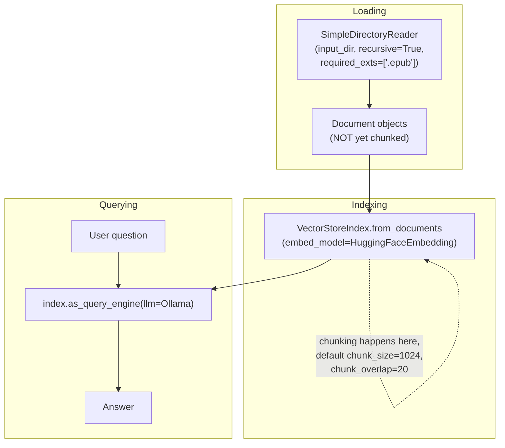

# Agentic RAG with LlamaIndex: the "librarian" pattern and a fully local stack

Source: **"Building A RAG Ebook 'Librarian' Using LlamaIndex"**,
authored by Jonathan Jin
(huggingface.co/learn/cookbook/rag_llamaindex_librarian, notebook
fetched this session as raw `.ipynb`). Despite this reference area's
naming convention (the page name echoes "agentic RAG"), the notebook
itself does not build a multi-tool agent in the sense
`foundations.md` §5 describes (the HuggingFace Agents Course's Alfred
example, choosing between several callable tools) — it builds a single
fixed retrieve-then-generate pipeline, structurally the same shape as
`basic-rag-pipeline.md`, but using **LlamaIndex** instead of LangChain
as the orchestration framework, which the notebook motivates as its
central point of interest: LlamaIndex is, per the notebook, "a data
framework for LLM-based applications that's, unlike LangChain,
designed specifically for RAG." This page documents that framework
comparison and the notebook's fully-local model stack.

## 1. The stated goal: a lightweight, fully local ebook librarian

The notebook's framing device is a public-library analogy: "think
about the last time you visited a library and took advantage of the
expertise of the knowledgeable staff there to help you find what you
need out of the troves of textbooks, novels, and other resources at
the library." Its explicit requirements, stated directly: the system
should be "**lightweight** and **run locally as much as possible**
with **minimal dependencies**," specifically targeting hardware "such
as M1 Macbooks" rather than assuming cloud GPU access. Every component
choice in the notebook is justified against that constraint:
**LlamaIndex** for orchestration, **Ollama** for "a user-friendly
solution for running LLMs such as Llama 2 locally," `BAAI/bge-base-en-v1.5`
as an embedding model chosen for performing "reasonably well and
[being] reasonably lightweight in size" per the MTEB leaderboard, and
**Llama 2** itself as the generator, run through Ollama.

## 2. LlamaIndex's three-phase framing: Loading, Indexing, Querying

The notebook gives LlamaIndex's own three-phase decomposition of a RAG
pipeline directly: "**Loading**, in which you tell LlamaIndex where
your data lives and how to load it; **Indexing**, in which you augment
your loaded data to facilitate querying, e.g. with vector embeddings;
[and] **Querying**, in which you configure an LLM to act as the query
interface for your indexed data," attributing this framing to
LlamaIndex's own "High-Level Concepts" documentation page. This is a
named-phase vocabulary distinct from how the LangChain-based notebooks
elsewhere in this reference area describe the same underlying steps
(load → split → embed → index → retrieve → prompt → generate) — the
phases are the same work, described with LlamaIndex's own terms rather
than LangChain's, which is itself a useful data point about how the
two frameworks frame the same problem differently at the API-design
level.

### 2.1 Loading: `SimpleDirectoryReader` and multi-format support for free

The notebook's test "library" is two `.epub` files pulled directly from
Project Gutenberg (*Pride and Prejudice*, *Les Misérables*), arranged in
a nested per-author directory structure. Loading uses LlamaIndex's
`SimpleDirectoryReader(input_dir="./test/", recursive=True,
required_exts=[".epub"])`, which the notebook highlights as "magically"
supporting "a whole host of multi-model file types for free" —
`.epub` is one of many formats the loader recognizes without any
format-specific code from the notebook author. The notebook explicitly
flags a subtlety about this phase's output: the loaded `Document`
objects "have not been chunked at this stage — that will happen during
indexing," i.e. loading and chunking are two distinct LlamaIndex
phases, unlike the LangChain-based notebooks elsewhere in this area,
where chunking is typically performed as an explicit standalone step
(a `RecursiveCharacterTextSplitter` call) sitting between loading and
embedding.

### 2.2 Indexing: `VectorStoreIndex`, and LlamaIndex's OpenAI-by-default trap

`VectorStoreIndex.from_documents(documents, embed_model=embedding_model)`
is LlamaIndex's own description, quoted directly by the notebook, of
"a 'default' entrypoint for indexing," which "by default... uses a
simple, in-memory dictionary to store the indices," while also
supporting "a wide variety of vector storage solutions" for readers
who need to scale beyond an in-memory index (unlike this notebook,
which never leaves the in-memory default). The notebook flags a
default-configuration trap worth recording explicitly: "by default,
[LlamaIndex uses] OpenAI (specifically `gpt-3.5-turbo`)" for both
embeddings and generation unless told otherwise — meaning a reader who
naively instantiates `VectorStoreIndex.from_documents(documents)`
without passing `embed_model` explicitly will silently attempt to call
OpenAI's API (and, absent an API key, fail, or, with a key configured,
incur unintended API cost) rather than running fully locally as this
notebook's stated goal requires. The notebook avoids that trap by
explicitly constructing `HuggingFaceEmbedding(model_name="BAAI/bge-small-en-v1.5")`
(note: a smaller variant than the `bge-base-en-v1.5` named in the
notebook's own introduction, an internal inconsistency in the source
notebook itself, recorded here rather than silently corrected) and
passing it as `embed_model` explicitly. The notebook also states
LlamaIndex's own documented chunking defaults for this indexing phase:
"a chunk size of 1024 and a chunk overlap of 20" when no explicit
splitter configuration is supplied — smaller-chunk-size-averse relative
to the 512-token chunk sizes tuned deliberately in
`advanced-rag-techniques.md`, since this notebook does not tune
chunking at all and simply accepts LlamaIndex's built-in default.

### 2.3 Querying: `as_query_engine`, backed by Ollama-served Llama 2

The query layer is constructed with `llama_index.llms.ollama.Ollama(model="llama2",
request_timeout=40.0)`, then `index.as_query_engine(llm=llama)` — a
single method call that wires the vector index's retrieval mechanism
together with the configured LLM into one callable object, with
`query_engine.query("...")` performing the full retrieve-then-generate
sequence internally. Running Ollama itself requires a separate,
out-of-Python step: the notebook starts the Ollama server as a
background process (`get_ipython().system_raw('ollama serve &')` in
the Colab-specific version of the notebook, or, per the notebook's own
note for non-Colab environments, "in a separate terminal, run: `ollama
serve`"), then pulls the Llama 2 weights with `ollama pull llama2`
before any query can succeed — Ollama itself is a standalone local
inference server process, not a Python library that runs the model
in-process, which is the specific mechanism enabling this notebook's
"runs locally, even on Apple silicon" claim without requiring PyTorch,
CUDA, or `transformers`-level model loading anywhere in the Python code
itself.

## 3. Named future work: citations, richer metadata, persistent indexing

The notebook closes with three explicitly named, unimplemented
extensions, structurally the same "named but not built" pattern
recorded for other notebooks in this reference area
(`advanced-rag-techniques.md` §5, `structured-generation-for-rag.md`
§5): **forcing citations** — "to guard against the risk of our
librarian hallucinating, how might we require that it provide
citations for everything that it says?" (a concern this reference
area's `structured-generation-for-rag.md` documents a concrete,
constrained-decoding-based answer to, from a different source
notebook); **using extended metadata** from ebook-library-management
tools like Calibre (publisher, edition information not present in the
`.epub` text itself); and **efficient/persistent indexing** — the
notebook's own observation that, as built, "the resulting script would
re-index our library on each invocation," which is "fine" for a
two-book test library but "will very quickly become annoying for
users" at real library scale, naming index persistence as the fix
without implementing it in this notebook.
