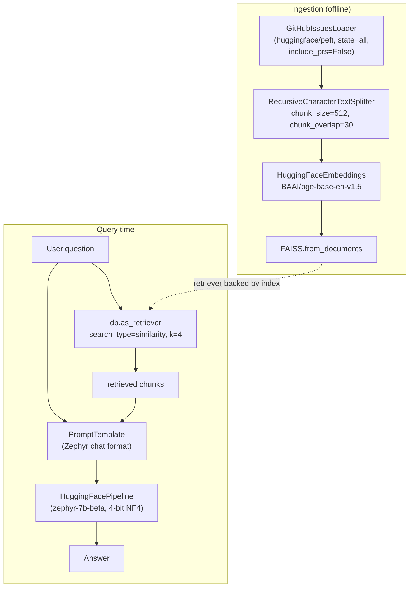

# The basic RAG pipeline: LangChain, Zephyr, and FAISS over GitHub issues

Source: **"Simple RAG for GitHub issues using Hugging Face Zephyr and
LangChain"**, authored by Maria Khalusova
(huggingface.co/learn/cookbook/rag_zephyr_langchain, notebook fetched
this session as raw `.ipynb` from
`github.com/huggingface/cookbook/blob/main/notebooks/en/rag_zephyr_langchain.ipynb`).
This is the cookbook's own introductory RAG notebook — every other
cookbook-derived page in this reference area (`advanced-rag-techniques.md`,
`rag-evaluation.md`, `heterogeneous-data-sources.md`) points back to
this one as "an introduction to RAG" before building on it, so it is
documented first and in full here as the baseline every later page's
"advanced" or "custom-data" variation is a delta against. See
`foundations.md` for the paper-level definitions (parametric/
non-parametric memory, RAG-Sequence) this notebook's implementation is
a practical instance of.

## 1. What the notebook builds, end to end

The notebook's own summary: it builds "a RAG (Retrieval Augmented
Generation) for a project's GitHub issues using
`HuggingFaceH4/zephyr-7b-beta` model, and LangChain." Concretely, the
knowledge base is every open and closed issue (pull requests excluded)
from the `huggingface/peft` GitHub repository, retrieved live via the
GitHub API, and the notebook's own worked example question is "How do
you combine multiple adapters?" — a question whose correct answer
depends on PEFT-specific vocabulary (LoRA "adapters") that a base LLM,
per the notebook's own demonstrated failure case, misinterprets as a
question about physical computer hardware adapters when asked without
retrieved context.

## 2. Data acquisition: `GitHubIssuesLoader`

The notebook loads issues via LangChain's `GitHubIssuesLoader`
(`langchain_community.document_loaders`), configured with
`repo="huggingface/peft"`, a GitHub personal access token obtained
interactively via `getpass`, `include_prs=False` (the notebook's own
comment: "By default, pull requests are considered issues as well,
here we chose to exclude them from data"), and `state="all"` (loads
both open and closed issues). This is the notebook's chosen mechanism
for turning a live, frequently-updated GitHub repository into
LangChain `Document` objects without any manual export step.

## 3. Chunking: `RecursiveCharacterTextSplitter`

Because "the content of individual GitHub issues may be longer than
what an embedding model can take as input," per the notebook, the raw
issue documents are split with LangChain's
`RecursiveCharacterTextSplitter`, configured with `chunk_size=512` and
`chunk_overlap=30`. The notebook describes this splitter as "the most
common and straightforward approach to chunking," and explains the
overlap parameter's purpose directly: "keeping some overlap between
chunks allows us to preserve some semantic context between the
chunks." No token-aware splitting is used in this introductory
notebook (contrast `advanced-rag-techniques.md`, where the more
advanced notebook explicitly upgrades to a tokenizer-aware splitter
after observing this character-count approach produces chunks that
overflow the embedding model's token limit).

## 4. Embedding and vector store: `BAAI/bge-base-en-v1.5` + FAISS

Chunk embeddings are produced with LangChain's `HuggingFaceEmbeddings`
wrapper around the `BAAI/bge-base-en-v1.5` model. The notebook
recommends checking the "Massive Text Embedding Benchmark (MTEB)
Leaderboard" (`huggingface.co/spaces/mteb/leaderboard`) to track which
embedding models currently perform best, rather than treating
`bge-base-en-v1.5` as a fixed recommendation. The vector store is
**FAISS** ("a library developed by Facebook AI... offers efficient
similarity search and clustering of dense vectors... one of the most
used libraries for NN search in massive datasets," per the notebook),
constructed in one call: `FAISS.from_documents(chunked_docs,
HuggingFaceEmbeddings(model_name='BAAI/bge-base-en-v1.5'))`. The
retriever is then obtained with `db.as_retriever(search_type="similarity",
search_kwargs={'k': 4})` — similarity search, top-4 results, per the
notebook's own inline comments.

## 5. The generator: quantized Zephyr-7B via `transformers` + LangChain

The reader/generator model is `HuggingFaceH4/zephyr-7b-beta`, loaded in
**4-bit quantized form** via `transformers`' `BitsAndBytesConfig`
(`load_in_4bit=True`, `bnb_4bit_use_double_quant=True`,
`bnb_4bit_quant_type="nf4"`, `bnb_4bit_compute_dtype=torch.bfloat16`),
explicitly "to make inference faster," per the notebook. The notebook
recommends checking the "Open-source LLM leaderboard" to identify
whether a newer, more capable model should be substituted, treating
the choice of `zephyr-7b-beta` as a snapshot-in-time default rather
than a fixed recommendation, consistent with the same "swap the
generator freely" argument made in `foundations.md` §1.

The prompt is Zephyr's own chat-template format, hand-written in the
notebook as a `PromptTemplate` with `<|system|>`, `<|user|>`, and
`<|assistant|>` markers and a `{context}` / `{question}` slot pair; the
notebook's own note flags that `tokenizer.apply_chat_template` is the
more general/robust way to produce this formatting from a list of
role/content dicts, rather than hand-writing the template literally
(the hand-written version is used here only because it doubles as a
readable illustration of Zephyr's exact expected format).

## 6. Chain assembly with LangChain Expression Language (LCEL)

The notebook composes the pieces with LCEL's pipe operator twice: first
`llm_chain = prompt | llm | StrOutputParser()` builds a standalone
question-answering chain with no retrieval; then the full RAG chain
wraps that: `rag_chain = {"context": retriever, "question":
RunnablePassthrough()} | llm_chain`. The dict-literal-as-runnable
idiom here is doing two jobs at once — routing the incoming question
into the retriever to produce `context`, while `RunnablePassthrough()`
forwards the original, unmodified question straight through to the
`question` slot in parallel — so that both slots the prompt template
declared (`{context}`, `{question}`) are populated from the single
user-supplied `question` string, with no explicit orchestration code
needed beyond the LCEL composition itself.

## 7. The demonstrated payoff: side-by-side comparison

The notebook's own closing comparison is the clearest illustration of
what RAG buys over a bare model call, and is worth recording verbatim
in substance: invoking `llm_chain` directly with an empty context on
the question "How do you combine multiple adapters?" produces an
answer where, per the notebook, "the model interpreted the question as
one about physical computer adapters, while in the context of PEFT,
'adapters' refer to LoRA adapters" — i.e. the base model's parametric
knowledge has no notion of the domain-specific sense of "adapter" at
all. Invoking `rag_chain.invoke(question)` on the identical question
retrieves four relevant GitHub-issue chunks first, and the notebook
reports this "really helps the exact same model, provide a much more
relevant and informed answer to the library-specific question" — same
weights, same decoding settings, the only difference is the injected
retrieved context. The notebook closes by noting a concrete follow-up
it did not implement: since the answer to this particular question
turned out to already be covered in PEFT's own documentation rather
than only in GitHub issues, "for the next iteration of this RAG it may
be worth including documentation embeddings" too — i.e. broadening the
corpus beyond GitHub issues is flagged as the natural next step, not
performed in this notebook.
