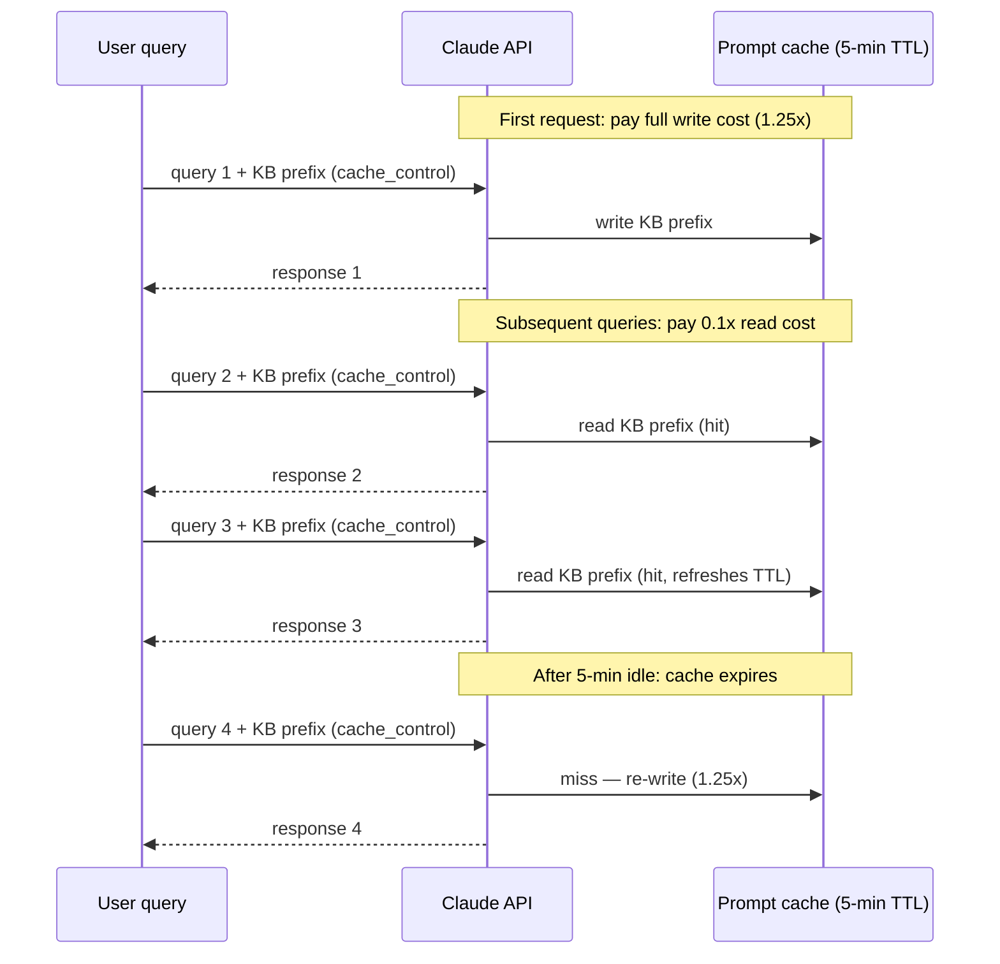
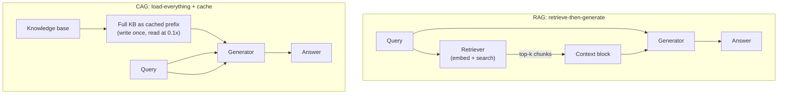

# Cache Augmented Generation (CAG): loading the whole knowledge base instead of retrieving

**Note on naming.** The pattern described here is known in industry
practice as "Cache Augmented Generation" (CAG). The pieces that make it
viable — the retrieval-vs-in-context tradeoff, and the prefix-caching
mechanism that makes loading a large context affordable — are each
VERIFIED from named sources fetched this session. The synthesis itself
("skip retrieval, load everything, cache the prefix") is **BEST CURRENT
UNDERSTANDING, UNCONFIRMED**: no single fetched source states the CAG
pattern in exactly those words. The pattern name "CAG" is industry
currency rather than a claim from a specific paper. See the grounding
section at the end of this page for the precise provenance of each
claim.

## 1. The tradeoff CAG is built on: retrieval vs. in-context knowledge

Oded Ovadia, Menachem Brief, Moshik Mishaeli, and Oren Elisha, in
"Fine-Tuning or Retrieval? Comparing Knowledge Injection in LLMs"
(arxiv.org/abs/2312.05934, fetched this session from the arXiv abstract
page, submitted December 2023), establish the empirical baseline that
motivates CAG's existence as a pattern. The paper compares two
approaches to injecting new knowledge into an LLM: unsupervised
fine-tuning and retrieval-augmented generation (RAG). Its abstract
states the central finding: "while unsupervised fine-tuning offers
some improvement, RAG consistently outperforms it, both for existing
knowledge encountered during training and entirely new knowledge." The
paper further finds that "LLMs struggle to learn new factual
information through unsupervised fine-tuning."

This establishes a key premise for CAG: if RAG (retrieving relevant
context at inference time) outperforms fine-tuning (baking knowledge
into weights), then providing context *in the prompt itself* is an
effective way to inject knowledge into an LLM. RAG does this by
retrieving a *subset* of the knowledge base — the chunks most relevant
to the query. CAG's proposition is to skip the retrieval step and load
the *entire* knowledge base into the context window, relying on the
model's attention mechanism to find the relevant portions at inference
time rather than on a separate retriever to pre-filter them.

## 2. The cost problem CAG solves: prompt caching

The obvious objection to loading an entire knowledge base into the
context window on every query is cost: a 200K-token knowledge base sent
as a prefix on every request would incur full input-token cost on every
single call. CAG as a pattern becomes economically viable only because
of **prompt caching** — a mechanism that allows a large prefix to be
processed once and then reused across subsequent requests at a steeply
discounted rate.

Anthropic's prompt-caching documentation
(platform.claude.com/docs/en/build-with-claude/prompt-caching, fetched
this session) describes the mechanism. The docs state that prompt
caching "optimizes your API usage by allowing resuming from specific
prefixes in your prompts," and that it "significantly reduces processing
time and costs for repetitive tasks or prompts with consistent
elements." Two caching modes are available:

- **Automatic caching**: a single `cache_control` field at the top
  level of the request body; the system "automatically applies the
  cache breakpoint to the last cacheable block" and the breakpoint
  "moves forward automatically as conversations grow."
- **Explicit cache breakpoints**: placing `cache_control` directly on
  individual content blocks, for fine-grained control over exactly what
  gets cached; up to 4 explicit breakpoints per request.

The pricing structure is what makes CAG viable. Per Anthropic's
documentation, cached tokens are priced at a fraction of base input
cost:

- **5-minute cache writes** cost 1.25× the base input token price.
- **1-hour cache writes** cost 2× the base input token price.
- **Cache hits and refreshes** cost 0.1× the base input token price
  (i.e., 10% of base input cost for most models; some models use a
  0.025× multiplier).

The 0.1× read multiplier is the load-bearing number for CAG: a
knowledge base cached as a prefix is charged at 10% of its normal
input cost on every subsequent request that hits the cache, and the
cache is "refreshed for no additional cost each time the cached content
is used." The 5-minute TTL means the cache must be hit within that
window or it expires and the full write cost is re-incurred; the
1-hour TTL extends this window at 2× write cost.

The docs also describe a **20-block lookback window**: on each request,
the system checks at most 20 positions per breakpoint for existing
cache entries, counting the breakpoint itself as the first. This
matters for CAG because it constrains how far back the system can find
a previously-written cache entry without an explicit breakpoint at or
near that position — a growing conversation that pushes past 20 blocks
from the last write will miss the cache unless additional breakpoints
are placed.

For the harness-level mechanics of prompt caching — how Claude Code
and OpenCode expose the `cache_control` parameter, the `compat` field,
provider-specific support — see `references/harnesses/caching.md`, which
covers the same Anthropic prompt-caching source from the harness
configuration perspective. This page is concerned with the RAG-level
architectural pattern, not the per-harness configuration surface.

## 3. When CAG is viable

CAG as an architectural pattern is viable when three conditions hold
simultaneously:

1. **The context window is large enough.** The model must be able to
   accept the entire knowledge base plus the user's query plus the
   expected response within its maximum context length. Models with
   200K+ token context windows (e.g., Claude's context window, as
   documented in the harness-level context-window page at
   `references/harnesses/context-compression.md`) make this feasible
   for moderate-sized knowledge bases that would not have fit in
   earlier, smaller context windows.

2. **The knowledge base fits.** The knowledge base itself must be
   small enough to fit within the context window after accounting for
   the space reserved for the query and response. A 150K-token API
   documentation set fits; a 50-million-token legal corpus does not.
   This is a hard size ceiling that RAG does not have, since RAG
   retrieves only a subset.

3. **Prompt caching makes the cost manageable.** Without prompt
   caching, sending a 150K-token prefix on every request would cost
   150K input tokens per query. With prompt caching at the 0.1× read
   multiplier, each subsequent query costs only 15K input-token
   equivalents for the cached portion (plus the small per-query
   increment). The one-time write cost (1.25× for a 5-minute TTL)
   is amortized across all queries that hit the cache within the TTL
   window. This is the condition that was not economically practical
   before prompt caching existed as a feature.

## 4. CAG vs. RAG: the architectural tradeoff

CAG and RAG represent two different points on a design tradeoff. The
distinction is grounded in the verified pieces above but the synthesis
into "CAG does X, RAG does Y" is **BEST CURRENT UNDERSTANDING,
UNCONFIRMED** — it is reasoned from the individual verified facts, not
stated as a comparison by any single fetched source.

**What CAG avoids that RAG has:**

- **Retrieval errors.** RAG's retriever may fail to find the relevant
  chunks — either because the embedding model maps the query to the
  wrong neighborhood, or because the relevant information is split
  across chunks in a way that loses context. CAG simply loads
  everything; there is no retrieval step to fail. The Ovadia et al.
  result that RAG outperforms fine-tuning does not, by itself, tell
  us what happens when RAG's retriever fails — but the fact that
  retrieval is an *imperfect pre-filter* is the structural reason CAG
  exists as an alternative.

- **Retrieval latency.** RAG adds a retrieval round-trip (embedding
  the query + searching the vector index) before the LLM can begin
  generating. CAG has no separate retrieval step; the model attends
  over the cached prefix directly. (BEST CURRENT UNDERSTANDING,
  UNCONFIRMED: the implicit assumption here is that the LLM's own
  attention over a cached prefix is faster than a separate embedding +
  vector-search round-trip, which is plausible but not measured by
  any fetched source.)

**What CAG cannot do that RAG can:**

- **Scale to large knowledge bases.** CAG is bounded by the context
  window. If the knowledge base exceeds the window, CAG is not
  possible — there is no way to load more than the window allows.
  RAG scales to arbitrarily large knowledge bases because it only
  retrieves a subset. This is the hard ceiling.

- **Avoid full-context processing cost.** Even with prompt caching,
  CAG processes the entire knowledge base on every request (the
  cached read is cheaper, but it is not free — it is 0.1× the input
  cost). RAG processes only the retrieved chunks. For a knowledge
  base much larger than the typical retrieval set (say 150K tokens
  vs. 2.5K tokens of retrieved context), the per-query cached-read
  cost of CAG will exceed the per-query input cost of RAG, even
  before accounting for the periodic cache-write cost when the TTL
  expires. RAG is cheaper per query at scale; CAG is cheaper to build
  (no retriever, no embedding pipeline, no vector store) and avoids
  retrieval-failure risk.

The bottom line: CAG trades retrieval-failure risk and retrieval
latency for a hard context-window ceiling and higher per-query
processing cost. It is viable for moderate-sized knowledge bases where
the context window is large enough and prompt caching keeps the cost
within budget. For knowledge bases that exceed the context window, or
where per-query cost matters more than retrieval reliability, RAG
remains the appropriate architecture.

## 5. Relationship to the RAG foundations

CAG is not a variant of RAG; it is an alternative to RAG. The Lewis et
al. formulation documented in `references/rag/foundations.md` defines
RAG as a retrieve-then-generate pipeline: a non-parametric memory
(dense vector index) is accessed via a neural retriever, and the
retrieved passages condition the generator. CAG bypasses the retrieval
half of this architecture entirely. There is no vector index, no
retriever, no top-k selection. The "non-parametric memory" in CAG is
simply the cached prefix itself — the entire knowledge base present in
the prompt context, not a retrieved subset of it.

This is why CAG is sometimes framed as a "retrieval-free" approach:
it removes the retrieval component that defines RAG. The tradeoff it
makes — loading everything rather than retrieving something — is only
viable because of two developments that postdate Lewis et al.'s
original RAG formulation: (a) context windows large enough to hold a
meaningful knowledge base, and (b) prompt caching that makes the
per-query cost of a large cached prefix affordable. Both are recent;
Lewis et al.'s 2020 formulation predates either being practical at
scale.

## 6. Grounding summary

The following table records the exact provenance of each claim on this
page, per the grounding discipline for this reference area:

| Claim | Source | Status |
| :--- | :--- | :--- |
| RAG outperforms fine-tuning for knowledge injection | Ovadia et al. 2023 (arxiv.org/abs/2312.05934, abstract fetched this session) | VERIFIED |
| LLMs struggle to learn new factual info via fine-tuning | Ovadia et al. 2023 (same abstract) | VERIFIED |
| Prompt caching allows resuming from prefix; reduces cost/latency | Anthropic prompt-caching docs (platform.claude.com/docs/en/build-with-claude/prompt-caching, fetched this session) | VERIFIED |
| Automatic caching: top-level `cache_control`, breakpoint on last cacheable block | Anthropic prompt-caching docs (same) | VERIFIED |
| Explicit breakpoints: up to 4, on individual content blocks | Anthropic prompt-caching docs (same) | VERIFIED |
| 5-min cache write = 1.25× base input; 1-hour write = 2×; cache read = 0.1× | Anthropic prompt-caching docs (same, pricing table) | VERIFIED |
| 5-minute TTL, refreshed on use; 1-hour TTL available | Anthropic prompt-caching docs (same) | VERIFIED |
| 20-block lookback window per breakpoint | Anthropic prompt-caching docs (same) | VERIFIED |
| CAG = "load entire KB, cache prefix, skip retrieval" as a named pattern | No single fetched source states this in exactly these words | BEST CURRENT UNDERSTANDING, UNCONFIRMED |
| CAG avoids retrieval errors and latency | Reasoned from the structure of RAG's retrieve-then-generate pipeline (per `foundations.md`) vs. CAG's no-retrieval architecture | BEST CURRENT UNDERSTANDING, UNCONFIRMED |
| CAG is bounded by context window; RAG scales to larger KBs | Reasoned from context-window limits vs. RAG's subset retrieval | BEST CURRENT UNDERSTANDING, UNCONFIRMED |
| Pattern name "Cache Augmented Generation" / "CAG" | Industry currency, not from any fetched paper | BEST CURRENT UNDERSTANDING, UNCONFIRMED |
