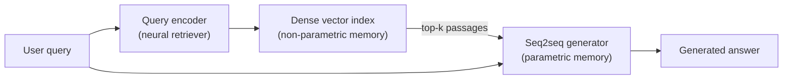
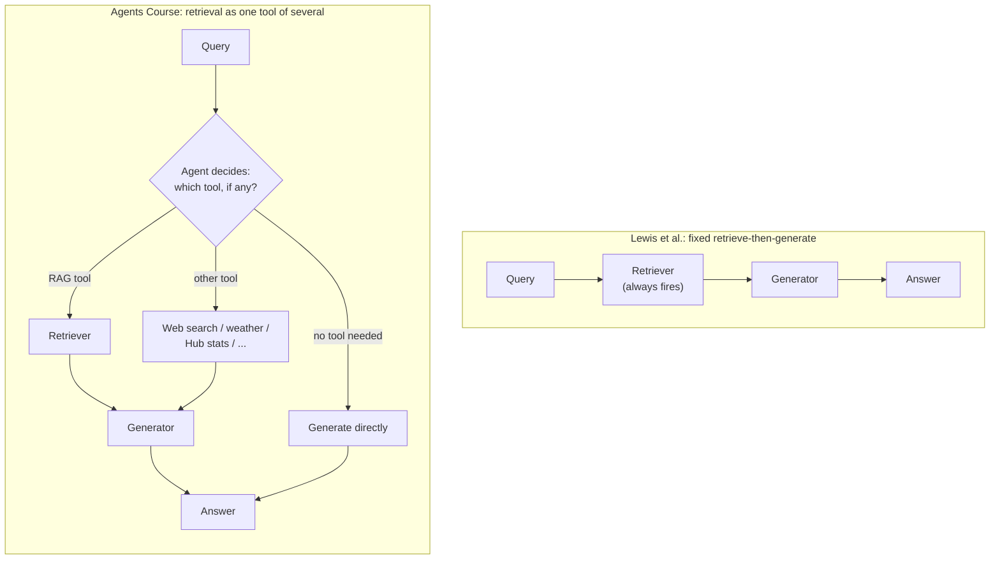

# RAG foundations: the Lewis et al. formulation and the agentic reframing

This page establishes the two reference definitions every other page in
this area builds on: the original academic formulation of
retrieval-augmented generation from Lewis, Perez, Piktus, Petroni,
Karpukhin, Goyal, Küttler, Lewis, Yih, Rocktäschel, Riedel, and Kiela,
**"Retrieval-Augmented Generation for Knowledge-Intensive NLP Tasks"**
(arxiv.org/abs/2005.11401, submitted 2020-05-22, this session fetched
the abstract page directly), and the practitioner-level "agentic RAG"
reframing given by the **HuggingFace Agents Course**, Unit 3, page
"Agentic Retrieval Augmented Generation (RAG)"
(huggingface.co/learn/agents-course/en/unit3/agentic-rag/agentic-rag,
fetched this session). Every other page in `references/rag/` cites the
HuggingFace Cookbook notebook it draws from directly; this page is the
one exception that goes back to the underlying paper and course
material those notebooks all assume as background.

## 1. The problem RAG was built to solve

Lewis et al.'s abstract frames the motivating problem precisely: large
pre-trained language models "store factual knowledge in their
parameters" and reach state-of-the-art results when fine-tuned on
downstream NLP tasks, but "their ability to access and precisely
manipulate knowledge is still limited," so on **knowledge-intensive
tasks** their performance lags behind task-specific architectures.
Two further problems compound this, per the same abstract: such models
cannot provide **provenance** for their decisions (there is no way to
point at *why* the model said something, because everything is baked
into weights), and **updating their world knowledge** after training
requires further training, not a data update. The paper's own name for
the fix for the second problem — pre-trained models with a
differentiable access mechanism to explicit non-parametric memory — had
"so far been only investigated for extractive downstream tasks" before
this paper, i.e. earlier work could point at a span of retrieved text
as an answer, but could not generate free text conditioned on it.

The cookbook notebook `rag_zephyr_langchain` (Maria Khalusova,
huggingface.co/learn/cookbook/rag_zephyr_langchain) restates the same
motivation in practitioner terms: "RAG is a popular approach to address
the issue of a powerful LLM not being aware of specific content due to
said content not being in its training data, or hallucinating even when
it has seen it before," and contrasts it with fine-tuning — fine-tuning
"can be costly, and, when done repeatedly (e.g. to address data drift),
leads to 'model shift'," a term the notebook uses for undesirable
changes in model behavior from repeated retraining. RAG's alternative,
per that same notebook, is that "the external data is converted into
embedding vectors with a separate embeddings model, and the vectors are
kept in a database," so keeping the corpus current means re-embedding
changed documents (cheap, since embedding models are "typically small")
rather than re-training the generator, and the generator itself can be
swapped for a stronger or smaller model at any time without touching
the retrieval side.

## 2. The Lewis et al. architecture: parametric + non-parametric memory

The paper's own description, from the fetched abstract: RAG "models
combine pre-trained parametric and non-parametric memory for language
generation." The **parametric memory** is a pre-trained seq2seq model
(the generator); the **non-parametric memory** is "a dense vector index
of Wikipedia, accessed with a pre-trained neural retriever." This is
the paper's specific instantiation — a dense passage retriever over a
Wikipedia dump — but the general shape (a trainable generator paired
with a vector index accessed via nearest-neighbor search) is the
template every notebook in this reference area follows with a
different retriever, index, and generator substituted in.

Critically, per the abstract, the paper explores "a general-purpose
fine-tuning recipe for retrieval-augmented generation," meaning the
retriever and generator are not treated as two independently frozen
off-the-shelf components glued together at inference time only — the
paper's own contribution is a training procedure for the combined
system. That is the one respect in which the Lewis et al. formulation
differs most sharply from what the cookbook notebooks in this
reference area actually do: none of the eleven cookbook notebooks
covered elsewhere in this area fine-tune either the retriever or the
generator; they compose off-the-shelf embedding models, off-the-shelf
vector stores, and off-the-shelf instruction-tuned LLMs into a
retrieve-then-generate pipeline at inference time only, which is a
practical simplification of, not a replication of, Lewis et al.'s
original recipe.

## 3. RAG-Sequence vs. RAG-Token

The abstract states the paper "compare[s] two RAG formulations, one
which conditions on the same retrieved passages across the whole
generated sequence, the other can use different passages per token."
The paper's own names for these (established in its body, referenced
here only insofar as the abstract itself frames the comparison) are
**RAG-Sequence**, where a single retrieved set of passages is held
fixed for generating the entire output sequence, and **RAG-Token**,
where the marginal distribution over retrieved passages can shift at
every generated token, letting different parts of a long answer draw
on different retrieved evidence. This is a paper-level architectural
distinction; none of the cookbook notebooks implement per-token
re-retrieval — every notebook in this reference area performs a single
retrieval pass (or a single retrieval-plus-rerank pass) before handing
a fixed context block to the generator for the entire response, which
is closer in spirit to RAG-Sequence's fixed-context assumption, though
none of the notebooks describe themselves in those terms.

## 4. Results claimed in the abstract

Per the fetched abstract, the fine-tuned RAG models "set the
state-of-the-art on three open domain QA tasks, outperforming
parametric seq2seq models and task-specific retrieve-and-extract
architectures." Separately, on language generation tasks, the authors
report that "RAG models generate more specific, diverse, and factual
language than a state-of-the-art parametric-only seq2seq baseline" —
i.e. the claimed benefit is not confined to QA-style extractive
accuracy; the paper also reports a qualitative generation-diversity
and factuality benefit for free-form text generation, grounded by
conditioning on retrieved evidence rather than parametric memory alone.
This reference area does not independently verify these benchmark
numbers (they are not restated in full here); the claim is recorded as
"the paper reports," consistent with this area's grounding discipline.

## 5. The agentic reframing: RAG as one tool among several

The HuggingFace Agents Course's Unit 3 page reframes retrieval not as a
fixed pipeline stage but as a decision available to an agent. Fetched
directly from the course page this session, its framing: "RAG solves
this problem by finding and retrieving relevant information from your
data and forwarding that to the LLM," restating the same motivation as
Lewis et al. above — but then it immediately generalizes past a single
fixed retrieve-then-generate sequence: in the course's own running
example (an agent named "Alfred" helping plan a gala), "Alfred needs to
find the latest news and weather information" and "Alfred needs to
structure and search the guest information," and critically, "instead
of answering the question on top of documents automatically, Alfred
can decide to use any other tool or flow to answer the question."

That sentence is the entire substance of the "agentic" qualifier: in
the Lewis et al. architecture, retrieval fires unconditionally on every
query, as a fixed step in the pipeline the model has no control over.
In the course's agentic framing, retrieval is exposed to the model as
one callable tool among several (a RAG tool for guest data, a web
search tool, a weather tool, a Hub-statistics tool, per the course's
own worked example), and the model's own discretion decides per-query
whether to call it, call something else instead, call several tools in
sequence, or skip retrieval entirely if the question does not need it.
This is a *general* agent-engineering framing, not a claim about any
specific cookbook notebook's implementation — none of the eleven
notebooks reviewed in this reference area actually build a multi-tool
agentic RAG system in the course's sense; every one of them wires a
single retriever into a single generator as a fixed chain. The
distinction matters for readers of this area because it explains why
that is a deliberate scope choice on the cookbook's part (these are
introductory-to-intermediate RAG-pipeline recipes) rather than the
current state of the art in agent-based retrieval, which is a separate,
broader design space than this reference area's scope covers (see
`references/harnesses/context-retrieval-and-agentic-search.md` for
that broader RAG-vs-agentic-search design-space treatment as it
applies to coding-agent harnesses specifically, an entirely different
application domain from the document/QA corpora this area's notebooks
retrieve over).

## 6. What this means for the rest of this reference area

Every other page in `references/rag/` documents a HuggingFace Cookbook
notebook's concrete implementation of the *fixed* retrieve-then-generate
shape described in §2 above, with variation in which retriever, which
vector store, which reranker, which generator, and which pre/post-
processing steps are used. None of them implement the Lewis et al.
paper's joint fine-tuning recipe (§2), the RAG-Token per-step
re-retrieval variant (§3), or the Agents Course's multi-tool agentic
dispatch (§5) — those three ideas are the three axes along which the
cookbook's practical recipes are simplifications of the broader
literature, and this page exists so that simplification is explicit
and attributed rather than silently assumed.
