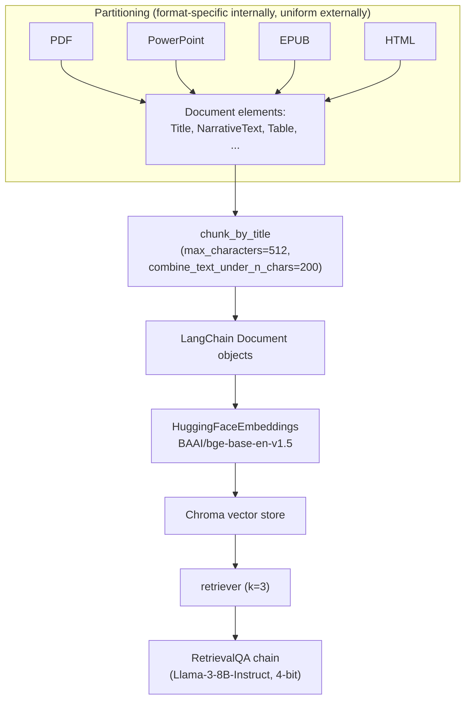
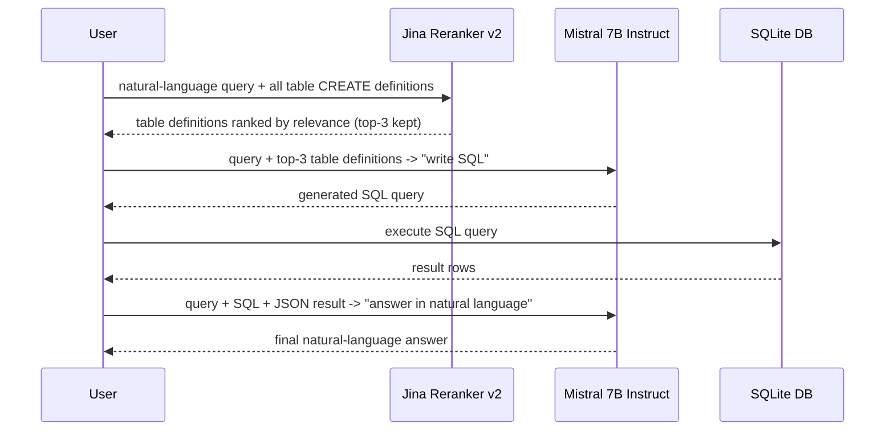

# RAG over heterogeneous data sources: unstructured documents and SQL databases

This page covers two cookbook notebooks that each replace the
"knowledge base is a pile of similarly-shaped text documents" premise
underlying every other page in this reference area with a
structurally different corpus: a mixed pile of real-world document
formats (PDF, PowerPoint, EPUB, HTML) in one case, and a relational
SQL database in the other. Each notebook accordingly replaces the
usual chunk-and-embed retrieval step with a format-appropriate
alternative.

- **"Building RAG with Custom Unstructured Data"**, authored by Maria
  Khalusova
  (huggingface.co/learn/cookbook/rag_with_unstructured_data, fetched
  this session)
- **"RAG backed by SQL and Jina Reranker v2"**, authored by Scott
  Martens @ Jina AI
  (huggingface.co/learn/cookbook/rag_with_sql_reranker, fetched this
  session)

## 1. Unstructured documents: partition first, chunk second

The unstructured-data notebook's own framing of the problem: "a lot of
important knowledge is stored in various formats like PDFs, emails,
Markdown files, PowerPoint presentations, HTML pages, Word documents,
and so on," and its worked example deliberately mixes four such formats
in one corpus — a PDF (a government IPM/pesticide manual), a
PowerPoint (`Citrus_IPM_090913.pptx`), an EPUB (a Project Gutenberg
ebook), and an HTML page (a garden-pest blog post) — all on the shared
topic of integrated pest management, to demonstrate that a single RAG
pipeline can retrieve across genuinely different source file types
uniformly. The tool doing that unification is **Unstructured**
(`Unstructured-IO/unstructured`), which the notebook uses via its
**Local source connector** (`LocalRunner` with `SimpleLocalConfig`,
`PartitionConfig`, `ProcessorConfig`, `ReadConfig`) to walk a local
directory and process every file inside it, though the notebook notes
Unstructured "can ingest documents from local directories, S3 buckets,
blob storage, SFTP, and many other places," with source-connector
choice affecting only "authentication options," not the processing
model. The notebook lists the full set of formats Unstructured
supports out of the box: `.eml, .html, .md, .msg, .rst, .rtf, .txt,
.xml, .png, .jpg, .jpeg, .tiff, .bmp, .heic, .csv, .doc, .docx, .epub,
.odt, .pdf, .ppt, .pptx, .tsv, .xlsx` — image formats among them,
implying Unstructured applies OCR/document-understanding models to
image-based inputs as part of the same uniform pipeline.

The key structural difference this notebook documents, relative to
every character/token-splitter-based notebook elsewhere in this
reference area: Unstructured's **partitioning** step runs first and
independently of chunk sizing. Partitioning breaks each document down
into typed **document elements** — the notebook names `Title`,
`NarrativeText`, and `Table` as example element types — each carrying
"metadata that Unstructured was able to obtain," where "some metadata
is common for all elements, such as filename," while other metadata is
type- or format-specific (a `Table` element's metadata includes an
HTML representation of the table itself; email elements carry
sender/recipient metadata). Because partitioning has already separated
a document into semantically distinct structural units before any
chunking occurs, the notebook argues this "avoid[s] a situation where
unrelated pieces of text end up in the same element, and then same
chunk" — a failure mode a naive fixed-size character splitter run over
raw extracted text cannot itself detect, since it has no notion of
document structure to respect. Chunking proper is then a second,
separate pass, `chunk_by_title(elements, max_characters=512,
combine_text_under_n_chars=200)`: individual elements are only
further split if they individually exceed `max_characters`, and short
elements (e.g. individual list items) can optionally be merged back
together up to `combine_text_under_n_chars`, rather than every element
being forced through a single uniform splitting pass regardless of its
own size.

Downstream of chunking, the pipeline reconverges with the shape used
throughout this reference area: chunked Unstructured elements are
converted to LangChain `Document` objects (with a metadata cleanup step
— `del metadata["languages"]`, and `chromautils.filter_complex_metadata`
— needed specifically because "ChromaDB doesn't support complex
metadata, e.g. lists," a vector-store-specific constraint the notebook
flags explicitly), embedded with `BAAI/bge-base-en-v1.5` into a
**ChromaDB** store, retrieved via `as_retriever(search_type="similarity",
search_kwargs={"k": 3})`, and answered by a 4-bit-quantized
`meta-llama/Meta-Llama-3-8B-Instruct` wired through LangChain's
`RetrievalQA.from_chain_type` convenience chain rather than the
LCEL pipe-composition pattern used in `basic-rag-pipeline.md`.

The notebook names, without implementing, two further extensions
worth recording: connecting to a **different, non-local source
connector** (an S3 bucket is given as the example); and adopting
**hybrid search** — "a combination of keyword-based search algorithms
with vector search methods" — as a way to improve on a single
similarity-search retriever, plus a pointer to a separate cookbook
example (`agents#2--rag-with-iterative-query-refinement--source-selection`,
not itself fetched here) for leveraging elements' own metadata at
retrieval time via a custom agent-based retriever tool.

## 2. SQL databases: rerank table schemas, generate SQL, then narrate the result

The second notebook inverts the usual RAG shape entirely: instead of
retrieving *chunks of prose* that get concatenated into a context
block, it retrieves *table schema definitions* that get used to write
an SQL query, whose *query result* becomes the context for a final
natural-language answer. The notebook's own five-step description of
the mechanism: given an SQL database, "we extract SQL table
definitions (the `CREATE` line in an SQL dump) and store them"; "the
user enters a query in natural language"; **Jina Reranker v2**
(`jinaai/jina-reranker-v2-base-multilingual`, described by the
notebook as "an SQL-aware reranking model") "sorts the table
definitions in order of their relevance to the user's query"; the
top-ranked table definitions plus the user's query are handed to
**Mistral 7B Instruct** with "a request to write an SQL query to fit
the task"; that generated SQL query is executed against the real
database; and finally "the SQL query result is converted to JSON and
presented to Mistral Instruct in a new prompt, along with the user's
original query, the SQL query, and a request to compose an answer for
the user in natural language."

The corpus here is a small open SQLite database of video game sales
records (`videogames.db`, sourced from a public GitHub sample-database
repository), with eight `CREATE TABLE` statements
(`platform`, `genre`, `publisher`, `region`, `game`, `game_publisher`,
`game_platform`, `region_sales`) stored in-memory as a Python list —
the notebook is explicit that this pre-extraction step "we've done...
for you" for this tutorial, and that "scaling up from this example
might require more sophisticated storage" for a database with many more
tables than eight. **Jina Reranker v2** is run locally
(`AutoModelForSequenceClassification.from_pretrained(...,
trust_remote_code=True)`) via a `rank_tables(query, table_specs,
top_n)` function that scores every `[query, table_definition]` pair
with `reranker_model.compute_score(pairs)` and returns them sorted
highest-scoring first — the same cross-encoder-style pairwise scoring
mechanism `advanced-rag-techniques.md` §4 describes for ColBERTv2, here
applied to whole table schemas as the retrieval unit instead of
prose passages, which is the notebook's central point of novelty: the
"retrieval" step in this pipeline is reranking table definitions
directly, with no embedding-based nearest-neighbor search or vector
index anywhere in the pipeline at all, given the small, closed set of
candidate tables.

SQL generation and the final natural-language answer are both produced
by `mistralai/Mixtral-8x7B-Instruct-v0.1`, accessed through
LlamaIndex's `HuggingFaceInferenceAPI` wrapper class (the notebook
names Mistral 7B Instruct in its introduction but its actual code uses
the larger Mixtral-8x7B-Instruct model — an inconsistency between the
notebook's prose and its code, recorded here rather than silently
reconciled) and LlamaIndex's `PromptTemplate` class for both prompts.
The SQL-generation prompt template explicitly instructs the model to
"make sure you ONLY output an SQL query and no explanation," and the
notebook's end-to-end `answer_sql(user_query)` function wraps all four
steps (rank → generate SQL → execute → narrate) in per-step exception
handling, printing which specific step failed (ranking, SQL generation,
SQL execution, or answer generation) if an exception is raised, with
one specific defensive hack called out directly in the code comments:
generated SQL has its backslashes stripped before execution "because
sometimes Mistral puts them in its generated code" — a concrete,
named failure mode of using an LLM to generate executable SQL that the
notebook works around rather than treating as fully solved.

## 3. What both notebooks have in common

Both notebooks replace the "one embedding model, one vector index,
one similarity search" retrieval mechanism used throughout the rest of
this reference area with a structurally different retrieval unit
suited to their corpus's actual shape: **document elements chunked by
structural boundary** (via Unstructured's partitioning) for the
mixed-document-format case, and **whole table schemas reranked by an
SQL-aware cross-encoder** (via Jina Reranker v2, with no vector index
at all) for the relational-database case. Read together with
`vector-store-integrations.md` (which holds the retrieval *unit*
constant — prose chunks — while varying the vector *store*) and
`advanced-rag-techniques.md` §4 (which holds the retrieval *unit*
constant while adding a reranking *stage* on top of embedding-based
retrieval), this page's two notebooks are this reference area's clearest
demonstrations that the retrieval unit itself — what, structurally, gets
matched against a query — is a corpus-dependent design choice, not a
fixed "always chunks of prose" assumption.
