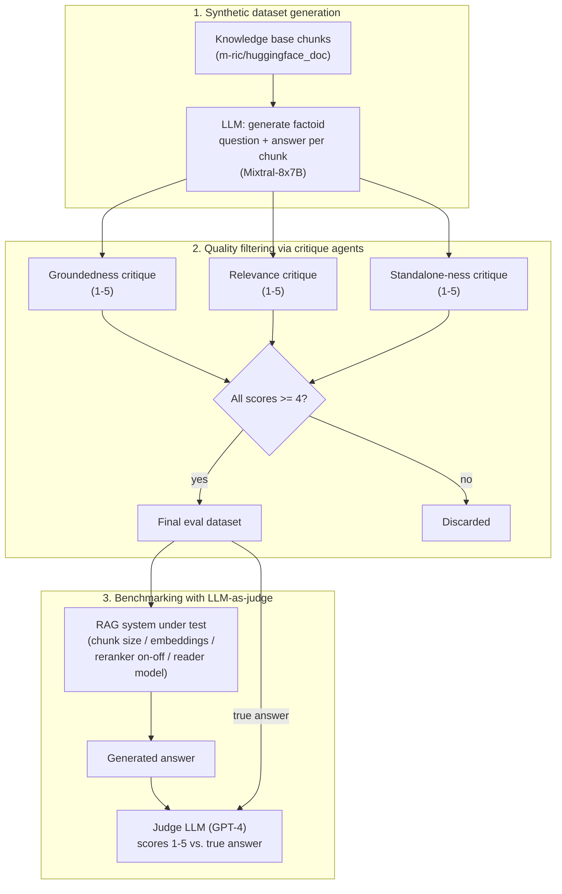

# RAG evaluation: synthetic datasets, critique agents, and LLM-as-judge

Source: **"RAG Evaluation"**, authored by Aymeric Roucher
(huggingface.co/learn/cookbook/rag_evaluation, notebook fetched this
session as raw `.ipynb`). This notebook is the direct answer to the
gap `advanced-rag-techniques.md` §5 recorded as named-but-unimplemented
in its source notebook — "you cannot improve the model performance
that you do not measure" — and shares that same author. It builds a
complete evaluation pipeline in three stages: synthesize a QA dataset
from the knowledge base itself, filter that synthetic dataset for
quality using further LLM calls, then benchmark a configurable RAG
system against the filtered dataset using a separate LLM acting as
judge.

## 1. Why a synthetic dataset, and how it is generated

The notebook's own framing of the evaluation problem: a working RAG
pipeline needs "an evaluation dataset with question - answer couples"
and "an evaluator to compute the accuracy of our system," and its
approach to producing the first of those without manual annotation is
to have "the evaluation dataset... synthetically generated by an LLM,"
then have separate LLM calls filter out low-quality generated
questions. The source knowledge base is the same `m-ric/huggingface_doc`
dataset used in `advanced-rag-techniques.md`, chunked with
`RecursiveCharacterTextSplitter` at `chunk_size=2000` /
`chunk_overlap=200` — notably a larger chunk size than the 512-token
chunks used for the RAG system itself later in the same notebook,
because these larger chunks are the *source context* handed to the
question-generation LLM, not the retrieval unit.

For each of `N_GENERATIONS` (10, in the notebook's own reduced-cost run)
randomly sampled chunks, a single LLM call
(`mistralai/Mixtral-8x7B-Instruct-v0.1`, via `huggingface_hub.InferenceClient`)
is prompted with a fixed template (`QA_generation_prompt`) instructing
it to "write a factoid question and an answer given a context," where
the question "should be answerable with a specific, concise piece of
factual information from the context" and "MUST NOT mention something
like 'according to the passage' or 'context'" — i.e. the generated
question must read as something a real user would type into a search
box, not as a reading-comprehension-exercise question that references
its own source passage. The notebook's own honest scope note: "for
your specific knowledge base... you should generate much more, in the
>200 samples" — the 10-sample run in the notebook is deliberately
small "for cost and time considerations," not a claim that 10 samples
is methodologically adequate.

## 2. Three critique agents, each scoring a distinct failure mode

Before trusting any LLM-generated question, the notebook runs three
independent LLM-based **critique agents**, each scoring the *question*
(not the RAG system) on a 1-5 scale against one specific criterion,
citing `huggingface.co/papers/2312.10003` as the source of the first
two criteria:

- **Groundedness**: "can the question be answered from the given
  context?" — catches questions the generation step invented details
  for that are not actually supported by the source chunk.
- **Relevance**: "is the question relevant to users?" — the notebook's
  own negative example: "What is the date when transformers 4.29.1 was
  released?" is scored low because it is "not relevant for ML
  practitioners" even though it may be perfectly answerable from
  context.
- **Standalone-ness**: a criterion the notebook attributes to its own
  observation rather than the cited paper — "is the question
  understandable free of any context, for someone with domain
  knowledge/Internet access?" The notebook's own worked contrast: "What
  is the name of the checkpoint from which the ViT model is imported?"
  scores 1 (it implicitly references "this guide," so it fails without
  the source document in hand), while a question containing "obscure
  technical nouns or acronyms like Gradio, Hub, Hugging Face or Space"
  can still legitimately score 5, since domain jargon alone does not
  make a question context-dependent — only an implicit backward
  reference to "the passage" or "this article" does.

Each critique prompt deliberately asks the model to produce a written
rationale (`Evaluation: ...`) *before* the numeric score
(`Total rating: ...`), and the notebook states its reasoning for that
ordering explicitly: "asking it to first output rationale gives the
model more tokens to think and elaborate an answer before summarizing
it into a single score" — i.e. the rationale-then-score ordering is a
deliberate chain-of-thought-style scaffold for the scoring call itself,
not incidental formatting. Generated questions are kept in the final
evaluation dataset only if `groundedness_score >= 4 and relevance_score
>= 4 and standalone_score >= 4`, all three thresholds applied
simultaneously — a question failing any one of the three criteria is
dropped entirely, regardless of how well it scores on the other two.

## 3. The RAG system under test

With a filtered evaluation dataset in hand (the notebook loads a
pre-generated larger version, `m-ric/huggingface_doc_qa_eval`, to skip
re-running the expensive generation-and-critique steps for the
benchmarking stage proper), the notebook builds a RAG system nearly
identical in shape to `advanced-rag-techniques.md`'s: token-aware
`RecursiveCharacterTextSplitter.from_huggingface_tokenizer` chunking
with duplicate removal, a FAISS index with cosine distance via
`HuggingFaceEmbeddings`, an `answer_with_rag` function taking an
optional `RAGPretrainedModel` reranker (again ColBERTv2 via
RAGatouille), and a Zephyr-family chat-template prompt. The notebook
adds one caching mechanism not present in the earlier notebook:
`load_embeddings` checks for a previously saved FAISS index on disk
(keyed by chunk size and embedding model name in the folder path) via
`FAISS.load_local`, and only rebuilds the index from scratch if no
matching cached index folder is found — avoiding redundant re-embedding
of the same corpus across repeated benchmark runs with the same
chunk-size/embedding-model combination.

The reader in this notebook is accessed via `langchain_community.llms.HuggingFaceHub`
wrapping `HuggingFaceH4/zephyr-7b-beta` as a hosted endpoint (rather
than the quantized-local-model pattern used in
`basic-rag-pipeline.md`/`advanced-rag-techniques.md`), configured with
`max_new_tokens=512`, `top_k=30`, `temperature=0.1`,
`repetition_penalty=1.03`. `run_rag_tests` iterates the evaluation
dataset, calls `answer_with_rag` for each question, and writes
incremental results (question, true answer, generated answer, source
document, retrieved docs) to a JSON output file named after the exact
test configuration (`test_settings`, e.g. combining chunk size,
embedding model name, rerank on/off, and reader model name into one
string) — explicitly checkpointing: "if the file already exists," it
loads prior results and skips questions already answered, so an
interrupted benchmark run can resume rather than restart.

## 4. Scoring the RAG system's answers with an LLM judge

The notebook's own framing of the final measurement step: "the RAG
system and the evaluation datasets are now ready. The last step is to
judge the RAG system's output on this evaluation dataset... we setup a
judge agent." Out of the broader space of RAG evaluation metrics —
the notebook links to the Ragas library's own metrics documentation as
a survey of what else could be measured — the notebook "choose[s] to
focus only on Answer Correctness since it is the best end-to-end
metric of our system's performance," i.e. deliberately narrows scope to
one metric rather than attempting a multi-metric evaluation.

The judge model is **GPT-4** (`gpt-4-1106-preview` via
`langchain.chat_models.ChatOpenAI`), chosen "for its empirically good
performance," with the notebook explicitly naming two open-source
alternatives it did not use in this run — `kaist-ai/prometheus-13b-v1.0`
and `BAAI/JudgeLM-33B-v1.0` — as models one "could try" instead. The
judge prompt (`EVALUATION_PROMPT`) follows the structure the notebook
attributes to Prometheus's own prompt template: give the judge a
**detailed, scale-anchored rubric** rather than a bare 1-5 request,
with the notebook's own stated reasoning: "this helps the model ground
its metric precisely. If instead you give the judge LLM a vague scale
to work with, the outputs will not be consistent enough between
different examples." Concretely, each of the five integer scores 1
through 5 is given its own one-sentence description in the prompt (for
this notebook's single Answer Correctness rubric: from "completely
incorrect, inaccurate, and/or not factual" at 1, up through "completely
correct, accurate, and factual" at 5), and the same
rationale-before-score ordering used for the critique agents in §2 is
reused here too, with the notebook again noting this "gives it more
tokens to help it formalize and elaborate a judgement." The judge's
output is parsed by splitting on the literal marker string
`[RESULT]`, which the prompt itself instructs the model to always
include, separating free-text feedback from the final integer score.

`evaluate_answers` iterates the RAG system's generated answers,
building one judge prompt per answer from the generated answer, the
question, and the dataset's true answer, storing both the numeric
score and the judge's written feedback back into the same results file
under keys named after the specific judge (`eval_score_GPT4`,
`eval_feedback_GPT4`) — a naming convention that anticipates running
more than one judge model over the same generated answers for
cross-judge comparison, without the notebook itself demonstrating a
second judge in this run. The notebook's own closing benchmarking loop
sweeps `chunk_size` and embedding-model choices, and independently
toggles `rerank` on and off, producing one distinctly named output file
per configuration — the mechanism by which a reader could, in
principle, quantify exactly how much the ColBERTv2 reranking step
documented in `advanced-rag-techniques.md` §4 actually improves Answer
Correctness for a given corpus, though the notebook does not itself
report or discuss the resulting comparison numbers.
