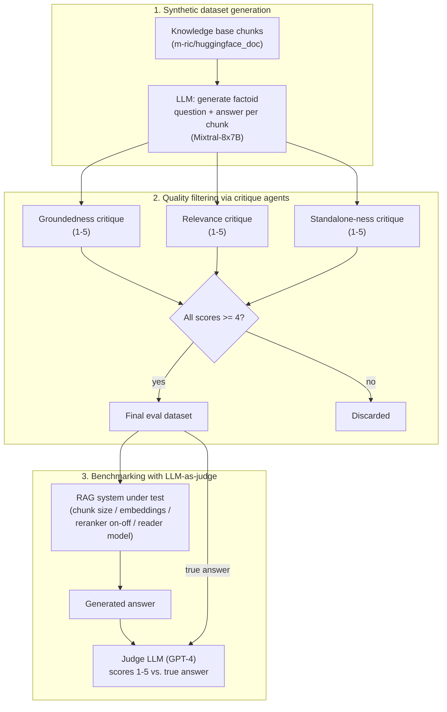
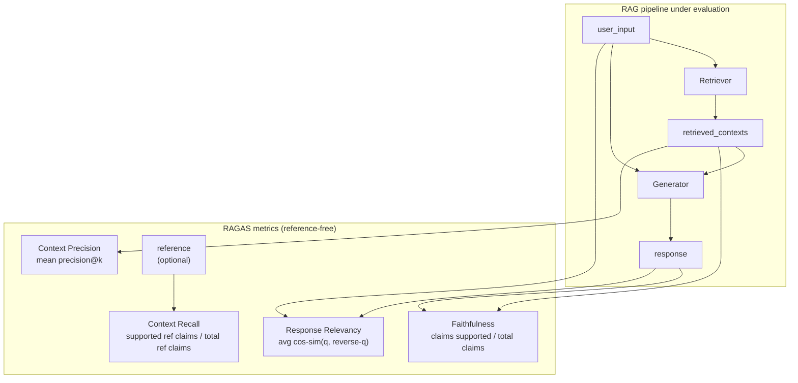

# RAG evaluation: synthetic datasets, critique agents, LLM-as-judge, and RAGAS

Sections §1–§4 are sourced from the **"RAG Evaluation"** HuggingFace
Cookbook notebook, authored by Aymeric Roucher
(huggingface.co/learn/cookbook/rag_evaluation, notebook fetched this
session as raw `.ipynb`). This notebook is the direct answer to the
gap `advanced-rag-techniques.md` §5 recorded as named-but-unimplemented
in its source notebook — "you cannot improve the model performance
that you do not measure" — and shares that same author. It builds a
complete evaluation pipeline in three stages: synthesize a QA dataset
from the knowledge base itself, filter that synthetic dataset for
quality using further LLM calls, then benchmark a configurable RAG
system against the filtered dataset using a separate LLM acting as
judge.

Section §5 below covers RAGAS (Retrieval Augmented Generation
Assessment), a separate evaluation framework introduced by Shahul Es
et al. (arxiv.org/abs/2309.15217, fetched this session) and documented
at docs.ragas.io. RAGAS is a reference-free alternative to the
Cookbook's synthetic-QA-plus-LLM-judge approach: where §1–§4 require
ground-truth answers for scoring, RAGAS metrics operate without human
annotations. Both approaches are documented here in full because they
address different evaluation constraints.

## 1. Why a synthetic dataset, and how it is generated

The notebook's own framing of the evaluation problem: a working RAG
pipeline needs "an evaluation dataset with question - answer couples"
and "an evaluator to compute the accuracy of our system," and its
approach to producing the first of those without manual annotation is
to have "the evaluation dataset... synthetically generated by an LLM,"
then have separate LLM calls filter out low-quality generated
questions. The source knowledge base is the same `m-ric/huggingface_doc`
dataset used in `advanced-rag-techniques.md`, chunked with
`RecursiveCharacterTextSplitter` at `chunk_size=2000` /
`chunk_overlap=200` — notably a larger chunk size than the 512-token
chunks used for the RAG system itself later in the same notebook,
because these larger chunks are the *source context* handed to the
question-generation LLM, not the retrieval unit.

For each of `N_GENERATIONS` (10, in the notebook's own reduced-cost run)
randomly sampled chunks, a single LLM call
(`mistralai/Mixtral-8x7B-Instruct-v0.1`, via `huggingface_hub.InferenceClient`)
is prompted with a fixed template (`QA_generation_prompt`) instructing
it to "write a factoid question and an answer given a context," where
the question "should be answerable with a specific, concise piece of
factual information from the context" and "MUST NOT mention something
like 'according to the passage' or 'context'" — i.e. the generated
question must read as something a real user would type into a search
box, not as a reading-comprehension-exercise question that references
its own source passage. The notebook's own honest scope note: "for
your specific knowledge base... you should generate much more, in the
>200 samples" — the 10-sample run in the notebook is deliberately
small "for cost and time considerations," not a claim that 10 samples
is methodologically adequate.

## 2. Three critique agents, each scoring a distinct failure mode

Before trusting any LLM-generated question, the notebook runs three
independent LLM-based **critique agents**, each scoring the *question*
(not the RAG system) on a 1-5 scale against one specific criterion,
citing `huggingface.co/papers/2312.10003` as the source of the first
two criteria:

- **Groundedness**: "can the question be answered from the given
  context?" — catches questions the generation step invented details
  for that are not actually supported by the source chunk.
- **Relevance**: "is the question relevant to users?" — the notebook's
  own negative example: "What is the date when transformers 4.29.1 was
  released?" is scored low because it is "not relevant for ML
  practitioners" even though it may be perfectly answerable from
  context.
- **Standalone-ness**: a criterion the notebook attributes to its own
  observation rather than the cited paper — "is the question
  understandable free of any context, for someone with domain
  knowledge/Internet access?" The notebook's own worked contrast: "What
  is the name of the checkpoint from which the ViT model is imported?"
  scores 1 (it implicitly references "this guide," so it fails without
  the source document in hand), while a question containing "obscure
  technical nouns or acronyms like Gradio, Hub, Hugging Face or Space"
  can still legitimately score 5, since domain jargon alone does not
  make a question context-dependent — only an implicit backward
  reference to "the passage" or "this article" does.

Each critique prompt deliberately asks the model to produce a written
rationale (`Evaluation: ...`) *before* the numeric score
(`Total rating: ...`), and the notebook states its reasoning for that
ordering explicitly: "asking it to first output rationale gives the
model more tokens to think and elaborate an answer before summarizing
it into a single score" — i.e. the rationale-then-score ordering is a
deliberate chain-of-thought-style scaffold for the scoring call itself,
not incidental formatting. Generated questions are kept in the final
evaluation dataset only if `groundedness_score >= 4 and relevance_score
>= 4 and standalone_score >= 4`, all three thresholds applied
simultaneously — a question failing any one of the three criteria is
dropped entirely, regardless of how well it scores on the other two.

## 3. The RAG system under test

With a filtered evaluation dataset in hand (the notebook loads a
pre-generated larger version, `m-ric/huggingface_doc_qa_eval`, to skip
re-running the expensive generation-and-critique steps for the
benchmarking stage proper), the notebook builds a RAG system nearly
identical in shape to `advanced-rag-techniques.md`'s: token-aware
`RecursiveCharacterTextSplitter.from_huggingface_tokenizer` chunking
with duplicate removal, a FAISS index with cosine distance via
`HuggingFaceEmbeddings`, an `answer_with_rag` function taking an
optional `RAGPretrainedModel` reranker (again ColBERTv2 via
RAGatouille), and a Zephyr-family chat-template prompt. The notebook
adds one caching mechanism not present in the earlier notebook:
`load_embeddings` checks for a previously saved FAISS index on disk
(keyed by chunk size and embedding model name in the folder path) via
`FAISS.load_local`, and only rebuilds the index from scratch if no
matching cached index folder is found — avoiding redundant re-embedding
of the same corpus across repeated benchmark runs with the same
chunk-size/embedding-model combination.

The reader in this notebook is accessed via `langchain_community.llms.HuggingFaceHub`
wrapping `HuggingFaceH4/zephyr-7b-beta` as a hosted endpoint (rather
than the quantized-local-model pattern used in
`basic-rag-pipeline.md`/`advanced-rag-techniques.md`), configured with
`max_new_tokens=512`, `top_k=30`, `temperature=0.1`,
`repetition_penalty=1.03`. `run_rag_tests` iterates the evaluation
dataset, calls `answer_with_rag` for each question, and writes
incremental results (question, true answer, generated answer, source
document, retrieved docs) to a JSON output file named after the exact
test configuration (`test_settings`, e.g. combining chunk size,
embedding model name, rerank on/off, and reader model name into one
string) — explicitly checkpointing: "if the file already exists," it
loads prior results and skips questions already answered, so an
interrupted benchmark run can resume rather than restart.

## 4. Scoring the RAG system's answers with an LLM judge

The notebook's own framing of the final measurement step: "the RAG
system and the evaluation datasets are now ready. The last step is to
judge the RAG system's output on this evaluation dataset... we setup a
judge agent." Out of the broader space of RAG evaluation metrics —
the notebook links to the Ragas library's own metrics documentation as
a survey of what else could be measured — the notebook "choose[s] to
focus only on Answer Correctness since it is the best end-to-end
metric of our system's performance," i.e. deliberately narrows scope to
one metric rather than attempting a multi-metric evaluation.

The judge model is **GPT-4** (`gpt-4-1106-preview` via
`langchain.chat_models.ChatOpenAI`), chosen "for its empirically good
performance," with the notebook explicitly naming two open-source
alternatives it did not use in this run — `kaist-ai/prometheus-13b-v1.0`
and `BAAI/JudgeLM-33B-v1.0` — as models one "could try" instead. The
judge prompt (`EVALUATION_PROMPT`) follows the structure the notebook
attributes to Prometheus's own prompt template: give the judge a
**detailed, scale-anchored rubric** rather than a bare 1-5 request,
with the notebook's own stated reasoning: "this helps the model ground
its metric precisely. If instead you give the judge LLM a vague scale
to work with, the outputs will not be consistent enough between
different examples." Concretely, each of the five integer scores 1
through 5 is given its own one-sentence description in the prompt (for
this notebook's single Answer Correctness rubric: from "completely
incorrect, inaccurate, and/or not factual" at 1, up through "completely
correct, accurate, and factual" at 5), and the same
rationale-before-score ordering used for the critique agents in §2 is
reused here too, with the notebook again noting this "gives it more
tokens to help it formalize and elaborate a judgement." The judge's
output is parsed by splitting on the literal marker string
`[RESULT]`, which the prompt itself instructs the model to always
include, separating free-text feedback from the final integer score.

`evaluate_answers` iterates the RAG system's generated answers,
building one judge prompt per answer from the generated answer, the
question, and the dataset's true answer, storing both the numeric
score and the judge's written feedback back into the same results file
under keys named after the specific judge (`eval_score_GPT4`,
`eval_feedback_GPT4`) — a naming convention that anticipates running
more than one judge model over the same generated answers for
cross-judge comparison, without the notebook itself demonstrating a
second judge in this run. The notebook's own closing benchmarking loop
sweeps `chunk_size` and embedding-model choices, and independently
toggles `rerank` on and off, producing one distinctly named output file
per configuration — the mechanism by which a reader could, in
principle, quantify exactly how much the ColBERTv2 reranking step
documented in `advanced-rag-techniques.md` §4 actually improves Answer
Correctness for a given corpus, though the notebook does not itself
report or discuss the resulting comparison numbers.

## 5. RAGAS: reference-free RAG evaluation

The RAGAS framework — **Retrieval Augmented Generation Assessment** —
was introduced by Shahul Es, Jithin James, Luis Espinosa-Anke, and
Steven Schockaert in the paper "Ragas: Automated Evaluation of
Retrieval Augmented Generation" (arxiv.org/abs/2309.15217, fetched this
session from the arXiv abstract page). The paper's abstract frames the
core contribution: RAGAS is "a framework for **reference-free**
evaluation of Retrieval Augmented Generation (RAG) pipelines" whose
metrics "can be used to evaluate these different dimensions **without
having to rely on ground truth human annotations**." The paper's stated
motivation for removing the ground-truth requirement: "such a framework
can crucially contribute to faster evaluation cycles of RAG
architectures, which is especially important given the fast adoption of
LLMs."

This is the key distinction from the HuggingFace Cookbook approach in
§1–§4 above. The Cookbook pipeline requires (a) a synthetic QA dataset
with a `true_answer` per question, generated by an LLM and filtered by
critique agents (§1–§2), and (b) an LLM judge (GPT-4) that scores the
RAG system's generated answer against that true answer (§4). Every
evaluation run depends on the quality and coverage of the synthetic
ground truth. RAGAS inverts this: its metrics evaluate the RAG
pipeline's components — the retriever and the generator — by having an
LLM reason about the internal consistency of the response with the
retrieved context and the question, without requiring a pre-existing
reference answer for any of them. The notebook itself acknowledges
RAGAS by name: its §4 links to "the Ragas library's own metrics
documentation as a survey of what else could be measured" beyond the
single Answer Correctness metric the notebook itself implements —
VERIFIED from the notebook's own text, as cited above.

The RAGAS documentation (docs.ragas.io/en/stable/concepts/metrics/
available_metrics/, fetched this session) organizes its RAG metrics
into a "Retrieval Augmented Generation" category listing eight
metrics. This section documents the four core metrics the RAGAS paper
itself introduced and that the docs pages define with formulas and
worked examples: **Faithfulness**, **Context Precision**, **Context
Recall**, and **Response Relevancy** (also called **Answer Relevancy**
in the docs). The docs index also lists Context Entities Recall, Noise
Sensitivity, and multimodal variants; those are named in the docs but
not covered in the founding paper and are out of scope here.

### 5.1 Faithfulness

The RAGAS documentation defines the **Faithfulness** metric
(docs.ragas.io/en/stable/concepts/metrics/available_metrics/
faithfulness/, fetched this session) as measuring "how factually
consistent a `response` is with the `retrieved context`," ranging from
0 to 1, where "a response is considered **faithful** if all its claims
can be supported by the retrieved context." The calculation, per the
docs, follows three steps:

1. Identify all the claims in the response.
2. Check each claim to see if it can be inferred from the retrieved
   context.
3. Compute the faithfulness score:

$$\text{Faithfulness Score} = \frac{\text{Number of claims in the response supported by the retrieved context}}{\text{Total number of claims in the response}}$$

The docs provide a worked example: for the question "Where and when
was Einstein born?" with the context "Albert Einstein (born 14 March
1879) was a German-born theoretical physicist," the high-faithfulness
answer "Einstein was born in Germany on 14th March 1879" scores 1.0,
while the low-faithfulness answer "Einstein was born in Germany on
20th March 1879" scores 0.5 — the docs break it into two statements
("Einstein was born in Germany" → supported, "Einstein was born on
20th March 1879" → not supported), yielding $\frac{1}{2} = 0.5$. This
metric directly catches the hallucination failure mode: a response
that fabricates details not present in the retrieved context receives
a low Faithfulness score, regardless of whether those details happen
to be factually correct in the real world — the metric measures
consistency with the *retrieved context*, not with ground truth.

### 5.2 Context Precision

The **Context Precision** metric
(docs.ragas.io/en/stable/concepts/metrics/available_metrics/
context_precision/, fetched this session) "evaluates the retriever's
ability to rank relevant chunks higher than irrelevant ones for a given
query in the retrieved context." It is calculated, per the docs, as
the mean of precision@k for each chunk in the context:

$$\text{Context Precision@K} = \frac{\sum_{k=1}^{K} \left( \text{Precision@k} \times v_k \right)}{\text{Total number of relevant items in the top } K \text{ results}}$$

where $K$ is the total number of chunks in `retrieved_contexts`,
$v_k \in \{0, 1\}$ is the relevance indicator at rank $k$, and
$\text{Precision@k} = \frac{\text{true positives@k}}{\text{true positives@k} + \text{false positives@k}}$.

The docs' worked example illustrates the ranking sensitivity: with the
question "Where is the Eiffel Tower located?" and two retrieved
contexts — the Eiffel Tower one first, then the Brandenburg Gate one —
Context Precision scores ~1.0. Swapping the order so the irrelevant
Brandenburg Gate chunk ranks first drops the score to ~0.5. This makes
the metric sensitive not just to *whether* relevant chunks were
retrieved but to *where* they rank — a retriever that returns the
right document at position 10 of 10 scores worse than one that returns
it at position 1, even though both technically retrieved it.

### 5.3 Context Recall

The **Context Recall** metric
(docs.ragas.io/en/stable/concepts/metrics/available_metrics/
context_recall/, fetched this session) measures "how many of the
relevant documents (or pieces of information) were successfully
retrieved" and "focuses on not missing important results." The docs
are explicit that "calculating context recall always requires a
reference to compare against" — but the reference is a reference
*answer*, not reference contexts: "the LLM-based Context Recall metric
uses `reference` as a proxy for `reference_contexts`, which makes it
easier to use as annotating reference contexts can be very
time-consuming." The formula, per the docs:

$$\text{Context Recall} = \frac{\text{Number of claims in the reference supported by the retrieved context}}{\text{Total number of claims in the reference}}$$

The mechanism: the reference answer is broken into claims, each claim
is checked against the retrieved context for attribution, and the score
is the fraction of reference claims that find support in what was
retrieved. The docs' example: for the question "Where is the Eiffel
Tower located?" with retrieved context "Paris is the capital of France"
and reference "The Eiffel Tower is located in Paris," the score is 1.0
— the LLM judges that the reference claim (the Eiffel Tower is in
Paris) is attributable to the retrieved context (Paris is the capital of
France), even though the exact string "Eiffel Tower" does not appear in
the context.

Context Recall is the one RAGAS metric that does require a reference
answer, making it not purely reference-free in the way Faithfulness and
Response Relevancy are. The paper's overall framework claim of
"reference-free" is exact for Faithfulness, Context Precision, and
Response Relevancy; Context Recall requires a reference but not the
full annotated ground-truth-context dataset that the Cookbook approach
in §1–§4 needs. The distinction is between "no reference answer at
all" (Faithfulness, Response Relevancy) and "a reference answer as a
proxy for reference contexts" (Context Recall) — both are cheaper than
the Cookbook's synthetic-QA-generation-plus-critique pipeline.

### 5.4 Response Relevancy (Answer Relevancy)

The **Response Relevancy** metric — titled "Answer Relevancy" in the
docs page URL and "Response Relevancy" in the page heading
(docs.ragas.io/en/stable/concepts/metrics/available_metrics/
answer_relevance/, fetched this session) — measures "how relevant a
response is to the user input," ranging from 0 to 1, where "higher
scores indicating better alignment with the user input." The docs are
explicit that "this metric focuses on how well the answer matches the
intent of the question, **without evaluating factual accuracy**. It
penalizes answers that are incomplete or include unnecessary details."
The calculation, per the docs, follows two steps:

1. Generate a set of artificial questions (default is 3) based on the
   response — these are reverse-engineered questions designed to
   reflect the content of the response.
2. Compute the cosine similarity between the embedding of the original
   user input ($E_o$) and the embedding of each generated question
   ($E_{g_i}$), then take the average:

$$\text{Answer Relevancy} = \frac{1}{N} \sum_{i=1}^{N} \text{cosine similarity}(E_{g_i}, E_o)$$

where $E_{g_i}$ is the embedding of the $i$-th generated question,
$E_o$ is the embedding of the user input, and $N$ is the number of
generated questions (default 3, configurable via the `strictness`
parameter). The docs note a mathematical subtlety: "while the score
usually falls between 0 and 1, it is not guaranteed due to cosine
similarity's mathematical range of -1 to 1."

The docs' worked example: for the question "Where is France and what
is it's capital?" the low-relevance answer "France is in western
Europe" generates reverse-questions like "In which part of Europe is
France located?" — which are close to the original question but miss
the capital part, yielding a lower mean cosine similarity than the
high-relevance answer "France is in western Europe and Paris is its
capital," whose reverse-questions would capture both the location and
the capital. The underlying concept, per the docs: "if the answer
correctly addresses the question, it is highly probable that the
original question can be reconstructed solely from the answer." This
is a clever indirect measurement: rather than checking whether the
answer contains specific facts (that is Faithfulness's job), it checks
whether the answer's *content* is topically aligned with the question
by seeing whether you can reconstruct the question from it.

### 5.5 How the four metrics compose

The four metrics target different failure modes in a RAG pipeline, and
the paper's framing is that they are meant to be used together to
cover the different dimensions of RAG quality. The paper's abstract
enumerates the dimensions: "the ability of the retrieval system to
identify relevant and focused context passages, the ability of the LLM
to exploit such passages in a faithful way, or the quality of the
generation itself." Mapping these to the four core metrics:

- **Context Precision** and **Context Recall** evaluate the
  *retriever*: Context Precision measures whether relevant chunks rank
  high, Context Recall measures whether all relevant information was
  retrieved.
- **Faithfulness** evaluates the *generator's* relationship to the
  retriever: does the response stick to what was retrieved, or does it
  hallucinate beyond it?
- **Response Relevancy** evaluates the *generator's* relationship to
  the question: does the response actually address what was asked, or
  does it wander off-topic?

The key compositional insight: a RAG system can score well on one
metric and poorly on another. A system with a weak retriever but a
strong generator might score low on Context Recall (relevant documents
not retrieved) but high on Faithfulness (the generator faithfully
reports what little it was given) — and its Response Relevancy would
depend on whether the retrieved subset happened to answer the
question. A system with a strong retriever but a hallucinating
generator would score high on Context metrics but low on Faithfulness.
This multi-metric decomposition is what distinguishes RAGAS from the
Cookbook's single-metric Answer Correctness approach: rather than one
end-to-end score, RAGAS gives diagnostic visibility into which
component — retrieval or generation — is the bottleneck.
