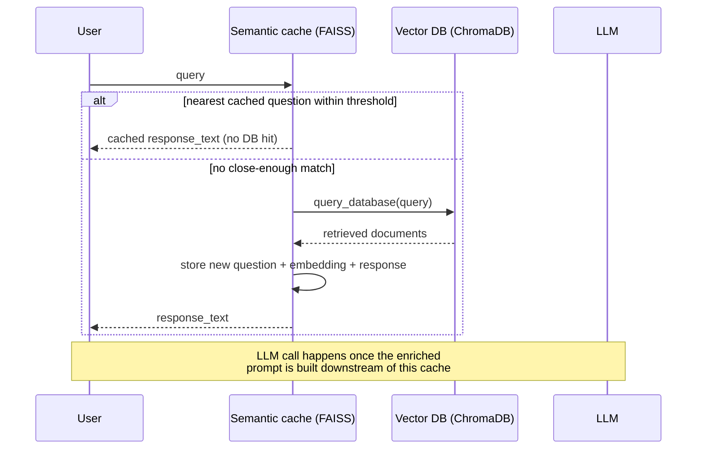

# Semantic caching for RAG: placement, threshold, and eviction

Source: **"Implementing semantic cache to improve a RAG system with
FAISS"**, authored by Pere Martra
(huggingface.co/learn/cookbook/semantic_cache_chroma_vector_database,
notebook fetched this session as raw `.ipynb`). Despite the cookbook
URL slug naming Chroma, the notebook's own title and the cache
mechanism it actually builds are FAISS-based; Chroma is used only as
the underlying knowledge-base vector store the cache sits in front of,
not as the caching mechanism itself — a naming mismatch worth flagging
explicitly since it is easy to misread from the URL alone.

## 1. The problem: production RAG has two expensive, repeatable steps

The notebook opens by distinguishing tutorial-scale RAG from
production-scale RAG: "most tutorials that guide you through creating a
RAG system are designed for single-user use... within a notebook,"
whereas a production deployment "might encounter from tens to
thousands of recurrent requests." Per the notebook, a RAG system has
exactly two points that are time-consuming and repeatable across
different users asking semantically the same thing: "retrieve the
information used to construct the enriched prompt" and "call the Large
Language Model to obtain the response." A **semantic cache** — as
opposed to an exact-string cache — recognizes that two differently
worded queries can carry the same intent, and the notebook gives its
own illustrative triple: "What is the capital of France?", "Tell me the
name of the capital of France?", and "What The capital of France is?"
all "convey the same intent and should be identified as the same
question," even though none of the three strings match another
byte-for-byte.

## 2. Where the cache sits: before retrieval, not before generation

The notebook's most substantive design argument is about **cache
placement** — at which of the two expensive points (per §1) the cache
should sit. Its stated reasoning: "placing it at the model's response
point may lead to a loss of influence over the obtained response,"
illustrated concretely — "our cache system could consider 'Explain the
French Revolution in 10 words' and 'Explain the French Revolution in a
hundred words' as the same query. If our cache system stores model
responses, users might think that their instructions are not being
followed accurately." Both of those differently-constrained requests,
however, "will require the same information to enrich the prompt" —
i.e. the *retrieved evidence* is legitimately identical across the two
requests even though the *desired output* is not. This is why the
notebook places its semantic cache "between the user's request and the
retrieval of information from the vector database" rather than between
the user and the LLM's final response: caching retrieved context is
safe to share across paraphrases that preserve intent, while caching
generated answers risks silently dropping a caller's own
output-shaping instructions. The notebook is explicit that this is "a
design decision" contingent on the system's response characteristics,
not a universal rule — "it's evident that caching model responses
would yield the most time savings, but... it comes at the cost of
losing user influence over the response."

## 3. The knowledge base underneath: ChromaDB

Independent of the cache, the notebook's underlying RAG knowledge base
is built with **ChromaDB**, described as "one of the most well-known
and widely used open-source vector databases," instantiated as a
`chromadb.PersistentClient(path=...)`, with documents added to a named
collection via `collection.add(documents=..., metadatas=[{topic: ...}],
ids=[...])`. The corpus is a subset (`MAX_ROWS = 15000` rows, out of a
larger set, "as we are working in a free and limited space") of the
`keivalya/MedQuad-MedicalQnADataset` medical Q&A dataset, with the
`Answer` column stored as document content and the `qtype` column
stored as metadata. Retrieval is a plain `collection.query(query_texts=...,
n_results=...)` call; the notebook notes metadata "isn't directly
involved in the initial search process" but "can be used to filter or
refine the results after retrieval."

## 4. The cache mechanism: FAISS `IndexFlatL2` with a Euclidean threshold

The cache itself is a from-scratch `semantic_cache` class built
directly on `faiss.IndexFlatL2`, not on any dedicated caching library.
Its constructor takes a `thresold` (sic, the notebook's own spelling)
Euclidean-distance cutoff (default `0.35`), a `max_response` capacity,
and an optional `eviction_policy` string. Cached state — parallel lists
of `questions`, `embeddings`, `answers`, and `response_text` — is
persisted to and reloaded from a JSON file on disk (`retrieve_cache` /
`store_cache` functions) so the cache survives across sessions rather
than living only in process memory.

The notebook's own justification for choosing **Euclidean distance**
over the more commonly used cosine distance: "Euclidean distance is
the default metric used by Faiss. Although Cosine distance can also be
calculated, doing so adds complexity that may not significantly
contribute to the final result" — a pragmatic default-over-optimal
choice specific to this notebook, not a general claim that Euclidean
outperforms cosine for semantic caching.

On each `ask(question)` call, the cache: (1) encodes the question with
a `SentenceTransformer('all-mpnet-base-v2')` encoder; (2) searches the
FAISS index for its single nearest neighbor (`self.index.search(embedding,
1)`); (3) if the nearest neighbor's distance is at or below the
threshold, returns the cached `response_text` directly, logging that
the answer was "recovered from Cache," with no call to ChromaDB or the
LLM at all; (4) otherwise, falls through to `query_database`, appends
the new question/embedding/answer/response to the cache's parallel
lists, adds the new embedding to the FAISS index (`self.index.add`),
runs the eviction policy, and persists the updated cache to disk. Every
`ask` call logs the elapsed wall-clock time, so a cache hit vs. miss is
directly observable as a large latency difference between the two
branches in the notebook's own printed output.

## 5. Index-type choice and eviction policy, named as tunable

The notebook surveys FAISS index types as a tunable choice rather than
treating `IndexFlatL2` as the only option, giving its own capsule
comparison: "FlatL2 or FlatIP. Well-suited for small datasets, it may
not be the fastest, but its memory consumption is not excessive... LSH.
It works effectively with small datasets and is recommended for use
with vectors of up to 128 dimensions... HNSW. Very fast but demands a
substantial amount of RAM... IVF. Works well with large datasets
without consuming much memory or compromising performance." `FlatL2`
is chosen for this notebook specifically because the cache dataset
here is expected to stay small; a production cache expected to hold
many more distinct questions would, per this same tradeoff table, be a
candidate for IVF or HNSW instead.

For eviction, the notebook implements **FIFO** (first-in, first-out):
when the cache exceeds `max_response` entries, the oldest entries are
popped from the front of all four parallel lists in `evict()`. It
explicitly names **LRU** (least-recently-used) as a more sophisticated
alternative "not yet available and will be implemented later," because
LRU "requires knowledge of when each item in the cache was last
accessed" — state this notebook's cache does not track. This is
recorded here as a named-but-unimplemented alternative, consistent
with this reference area's grounding discipline of not attributing
capabilities to a source beyond what it actually demonstrates.
