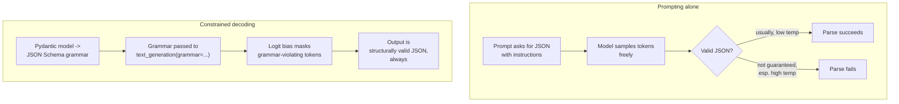

# Structured generation for RAG: from prompting to constrained decoding

Source: **"RAG with source highlighting using Structured generation"**,
authored by Aymeric Roucher
(huggingface.co/learn/cookbook/structured_generation, notebook fetched
this session as raw `.ipynb`). The notebook opens by pointing back to
its own author's introductory RAG notebook ("if you need an
introduction to RAG, you can check out this other cookbook," i.e.
`advanced_rag`, covered in `advanced-rag-techniques.md`) and frames
**structured generation** as a general technique with several possible
uses before narrowing to one specific application: "Structured
generation is a method that forces the LLM output to follow certain
constraints, for instance to follow a specific pattern." The notebook's
own named use cases for the general technique: outputting "a
dictionary with specific keys," guaranteeing a minimum output length,
"force[ing] the output to follow a certain regex pattern for downtream
processing," and — the one this notebook actually builds — "highlight
sources supporting the answer in Retrieval-Augmented-Generation (RAG)."

## 1. The target: an answer plus verifiable source snippets

The notebook's concrete goal is a RAG system that "not only provides an
answer, but also highlights the supporting snippets that this answer is
based on" — i.e. the generator's output must carry enough structure for
downstream code to locate, within the original retrieved context, the
exact spans of text the answer draws on, so they can be visually
highlighted for the end user as evidence. This directly answers a
provenance concern raised in `foundations.md` §1 (Lewis et al.'s
observation that parametric-only models cannot "provide provenance for
their decisions") by making provenance an explicit, machine-checkable
part of the generation contract rather than an afterthought.

## 2. Naive approach: prompting for JSON, and where it breaks

The notebook's first attempt is pure prompting: a template
(`RAG_PROMPT_TEMPLATE_JSON`) instructs the model to "provide your
answer as a JSON blob... provide all relevant short source snippets
from the documents on which you directly based your answer... and a
confidence score as a float between 0 and 1," with an explicit
constraint that "source snippets should be very short, a few words at
most... and they MUST be extracted from the context, with the exact
same wording and spelling" (so that a naive substring search against
the original context can locate them for highlighting). Run against
`meta-llama/Meta-Llama-3-8B-Instruct` via
`huggingface_hub.InferenceClient` at low temperature, this works — the
notebook parses the output directly with Python's `ast.literal_eval`,
since the model happened to emit a string that is valid Python-dict
syntax, and successfully highlights the answer's supporting snippets in
the source text.

The notebook then deliberately breaks this same prompt by raising
temperature to `1.6` "to simulate the possibly less coherent outputs of
a less powerful model," and reports plainly: "now, the output is not
even in correct JSON." This is the notebook's central motivating
failure: **prompting alone can produce a well-formed structured output
most of the time, but provides no guarantee**, and that guarantee gets
weaker exactly when the model is less capable or less confident (here,
simulated via higher temperature) — precisely the operating conditions
under which a downstream JSON parser is likeliest to throw.

## 3. Constrained decoding: grammars that make malformed output unreachable

The notebook's fix is **constrained decoding**, which it defines as
forcing "the LLM to only output tokens that conform to a set of rules
called a grammar," where "this grammar can be defined using Pydantic
models, JSON schema, or regular expressions." Concretely, the notebook
defines a Pydantic model,
`AnswerWithSnippets(BaseModel)` with fields `answer: Annotated[str,
StringConstraints(min_length=10, max_length=100)]`, `confidence:
Annotated[float, confloat(ge=0.0, le=1.0)]`, and `source_snippets:
List[Annotated[str, StringConstraints(max_length=30)]]` — i.e. the
schema itself encodes not just field names and types but length and
range bounds. `AnswerWithSnippets.schema()` converts that Pydantic
model into a JSON Schema document, which is then passed directly as
the `grammar` parameter to `InferenceClient.text_generation` (or via
the lower-level `.post` call with `"grammar": {"type": "json", "value":
schema}` in the request body). Re-running the identical high-temperature
(`1.6`) prompt with this grammar attached, the notebook reports: "the
generated output is now correct JSON format, with the exact keys and
types we defined in our grammar" — the *content* may still be
nonsensical at that temperature, but the *shape* of the output is now
structurally guaranteed rather than merely likely.

## 4. The mechanism underneath: logit biasing via Outlines

The notebook names the library actually implementing constrained
decoding under the hood of HuggingFace's Inference API: **Outlines**
("the library that runs under the hood on our Inference API to
constrain output generation... you can also use it locally"). Its
mechanism, per the notebook's own one-line description with a direct
link into the Outlines source: it works "by applying a bias on the
logits to force selection of only the ones that conform to your
constraint" — i.e. at each decoding step, tokens whose selection would
make the output-so-far unable to complete into a grammar-valid
sequence are masked out of the logit distribution before sampling, so
the model is *structurally incapable* of emitting an invalid token at
that position, rather than merely being instructed not to. The notebook
demonstrates the same schema-constrained generation running fully
locally via `outlines.models.transformers(repo_id)` and
`outlines.generate.json(model, schema_as_str)`, showing the technique
is not tied to HuggingFace's hosted Inference API specifically. It
further names **Text-Generation-Inference (TGI)**'s own constrained
generation support ("guidance") as a third place the same grammar-based
approach is available, without demonstrating it directly in this
notebook.

## 5. A second application named in passing: LLM-as-judge scoring

The notebook closes by naming one further use of the same mechanism
outside RAG source-highlighting entirely: constraining an "LLM judge"
workflow's output to a fixed JSON shape — `{"score": 1, "rationale":
"...", "confidence_level": 0.85}` — "you can also use constrained
generation to output a JSON, as follows," pointing at a separate
`llm_judge` cookbook notebook (not itself fetched or documented in this
reference area) as where that pattern is used in full. This is
recorded here only as a named cross-reference the source notebook
itself makes, not as an independently verified claim about that other
notebook's contents — see `rag-evaluation.md` for this reference area's
actual documentation of an LLM-as-judge evaluation pipeline, drawn from
a different, directly-fetched source notebook.
