# Vector store integrations: Milvus, Elasticsearch, and MongoDB Atlas

This page covers three cookbook notebooks that each swap the retriever
half of the basic pipeline (`basic-rag-pipeline.md`) onto a different
production-grade vector database, holding the general
retrieve-then-generate shape constant while varying where and how
vectors are stored, indexed, and searched:

- **"Build RAG with Hugging Face and Milvus"**, authored by Chen Zhang
  (huggingface.co/learn/cookbook/rag_with_hf_and_milvus, fetched this
  session)
- **"Building A RAG System with Gemma, Elasticsearch and Hugging Face
  Models"**, authored by lloydmeta
  (huggingface.co/learn/cookbook/rag_with_hugging_face_gemma_elasticsearch,
  fetched this session)
- **"Building A RAG System with Gemma, MongoDB and Open Source
  Models"**, authored by Richmond Alake
  (huggingface.co/learn/cookbook/rag_with_hugging_face_gemma_mongodb,
  fetched this session)

The Elasticsearch notebook's own credits section states it "was
adapted from" the MongoDB notebook and from two external cookbooks
(OpenAI's Elasticsearch RAG cookbook and an Elasticsearch-labs
model-loading cookbook), which is corroborated by inspection: both the
Elasticsearch and MongoDB notebooks retrieve over the same corpus (the
`MongoDB/embedded_movies` / `AIatMongoDB/embedded_movies` movie-plot
dataset, a movie name difference the two notebooks use for the
otherwise-identical dataset) and generate with the same model,
`google/gemma-2b-it`, letting this page compare them directly as two
implementations of one shared design.

```mermaid
flowchart TB
    subgraph Milvus["Milvus (rag_with_hf_and_milvus)"]
        M1["PyPDFLoader + RecursiveCharacterTextSplitter<br/>(AI Act PDF, chunk=1000/200)"] --> M2["SentenceTransformer<br/>BAAI/bge-small-en-v1.5"]
        M2 --> M3["MilvusClient.insert<br/>metric_type=IP"]
        M3 --> M4["milvus_client.search<br/>(client-side query embedding)"]
    end
    subgraph ES["Elasticsearch (rag_with_hugging_face_gemma_elasticsearch)"]
        E1["MongoDB/embedded_movies dataset"] --> E2{"USE_ELASTICSEARCH_<br/>VECTORISATION?"}
        E2 -->|True| E3["Eland-deployed model on ES ML node<br/>vectorises at ingest + query time"]
        E2 -->|False| E4["SentenceTransformer locally<br/>(client-side embeddings)"]
        E3 --> E5["ES knn search,<br/>query_vector_builder"]
        E4 --> E5
    end
    subgraph Mongo["MongoDB Atlas (rag_with_hugging_face_gemma_mongodb)"]
        D1["AIatMongoDB/embedded_movies dataset"] --> D2["SentenceTransformer<br/>thenlper/gte-large"]
        D2 --> D3["collection.insert_many<br/>(PyMongo)"]
        D3 --> D4["$vectorSearch aggregation stage<br/>(Atlas Vector Search index)"]
    end
```

## 1. Milvus: a purpose-built vector database, local-first by default

The Milvus notebook's corpus is the EU's "AI Act" regulatory PDF,
loaded with LangChain's `PyPDFLoader` and split with
`RecursiveCharacterTextSplitter` at `chunk_size=1000` /
`chunk_overlap=200`. Embeddings are produced client-side with
`sentence_transformers.SentenceTransformer("BAAI/bge-small-en-v1.5")`
via a small `emb_text` helper that normalizes embeddings
(`normalize_embeddings=True`).

The distinguishing mechanism the notebook documents is **Milvus
Lite**: connecting with `MilvusClient(uri="./hf_milvus_demo.db")` — a
local file path rather than a server URL — "automatically utilizes
Milvus Lite to store all data in this file," per the notebook, meaning
the entire vector database is a single embedded file with no server
process to run, which the notebook frames as "the most convenient
method" for prototyping. The same `MilvusClient` API scales up
unchanged to a self-hosted server (`uri="http://localhost:19530"`,
described as appropriate once a collection holds "more than a million
vectors") or to Zilliz Cloud (MongoDB's own commercial managed Milvus
offering, configured by setting both `uri` and `token` to the cloud
deployment's endpoint and API key) — i.e. one client API, three
deployment targets selected purely by the connection string, per the
notebook's own inline guidance.

Collection creation is schema-light: `milvus_client.create_collection`
takes just `dimension` (the embedding size) and `metric_type="IP"`
(inner product distance) plus `consistency_level="Strong"`; if no
field schema is given, Milvus auto-creates an `id` primary key field, a
`vector` field, and a reserved dynamic JSON field that absorbs any
other keys inserted per record (the notebook inserts a `text` field
this way, with no schema declaration needed for it). Search is a single
call, `milvus_client.search(collection_name=..., data=[emb_text(question)],
limit=3, search_params={"metric_type": "IP", "params": {}},
output_fields=["text"])`, returning hits each carrying an `entity` dict
(the requested output fields) and a `distance` score. Retrieved lines
are flattened into a plain newline-joined context string, wrapped in
`<context>`/`<question>` XML-style tags in the prompt template, and
sent to `mistralai/Mixtral-8x7B-Instruct-v0.1` via
`huggingface_hub.InferenceClient.text_generation` — i.e. generation
here is a hosted inference call, not a locally loaded model, unlike
the quantized-local-model pattern in `basic-rag-pipeline.md` and
`advanced-rag-techniques.md`.

## 2. Elasticsearch: the ES-side-vectorization vs. self-vectorization choice

The Elasticsearch notebook's central design decision, exposed as a
single boolean flag `USE_ELASTICSEARCH_VECTORISATION`, is **where the
embedding computation happens**: with the flag `True`, "your ES
cluster vectorises for you when ingesting and querying" — the
embedding model itself (here `thenlper/gte-small`) is deployed *into*
the Elasticsearch cluster via **Eland**
(`eland_import_hub_model --hub-model-id thenlper/gte-small
--task-type text_embedding --start`), and thereafter both document
ingestion and query embedding happen inside ES on an **ML node**,
requiring the cluster to have at least one such node provisioned. With
the flag `False`, embeddings are computed client-side with a plain
`SentenceTransformer`, exactly as in the Milvus and MongoDB notebooks,
and only the finished vectors are sent to ES. The notebook's own
framing of the tradeoff: "ES-vectorising means your clients don't have
to implement it, so that's the default here; however, if you don't
have any ML nodes, or your own embedding setup is better/faster,"
self-vectorizing is the fallback — i.e. this is a genuine
infrastructure tradeoff (offload embedding compute to the search
cluster vs. keep it in the application tier), not a performance-neutral
stylistic choice.

The index mapping itself branches on the same flag: with ES-side
vectorization, the mapping nests the vector under
`embedding.predicted_value` as a `dense_vector` field alongside ES's
own model-output metadata (`is_truncated`, `model_id`), populated by an
**ingest pipeline** (`client.ingest.put_pipeline`) running an
`inference` processor that maps the document's `fullplot` field to the
model's `text_field` input at index time, set as the index's
`default_pipeline` so every bulk-inserted document is vectorized
automatically on the way in with no per-request embedding call from
the client. With self-vectorization, the mapping is a flat
`embedding` field of type `dense_vector`, populated by the client
before the bulk insert. Search similarly branches: ES-side
vectorization builds a `knn` query with a `query_vector_builder` block
naming the deployed `model_id` and the raw query text (ES embeds the
query itself, server-side), while self-vectorization computes the
query embedding client-side and passes it as a literal `query_vector`
array — both paths converge on the same `client.search(index=...,
knn=knn, size=5)` call shape. Bulk ingestion uses
`elasticsearch.helpers.bulk` in batches of 100, with the notebook
noting that ES-side vectorization "can take a lot longer" per batch
and so needs a longer client `request_timeout` (600s vs. the 10s
default) to avoid connection timeouts during ingest.

Generation uses `google/gemma-2b-it` loaded locally via `transformers`
(`AutoModelForCausalLM.from_pretrained`, CPU by default with a
commented-out GPU `device_map="auto"` alternative), fed a
`combined_query` string that concatenates the raw user query with a
plain-text-formatted block of retrieved `Title: ... Plot: ...` lines —
notably a plainer, less-structured prompt than the Milvus notebook's
XML-tag-delimited context block, with no explicit "answer only from
context" instruction given to the model.

## 3. MongoDB Atlas: `$vectorSearch` as an aggregation pipeline stage

The MongoDB notebook uses **MongoDB Atlas Vector Search**, treating
vector similarity search not as a separate API surface but as one
stage (`$vectorSearch`) in MongoDB's existing aggregation pipeline
mechanism, chained directly with a `$project` stage that shapes the
returned fields and surfaces the similarity score via
`{"$meta": "vectorSearchScore"}`. This is the most structurally
distinct retrieval mechanism among the three stores covered on this
page: Milvus and Elasticsearch both expose a dedicated
search/query call; MongoDB instead extends its general-purpose
document-aggregation pipeline with one additional stage type, so
vector search composes with MongoDB's other aggregation stages
(filtering, projection, joins) using the same pipeline-array syntax
used for every other MongoDB aggregation.

Embeddings are produced client-side with `SentenceTransformer("thenlper/gte-large")`
(1024-dimensional, notably the "large" variant rather than the
"small" variant the other two notebooks use — the notebook flags that
the Atlas vector index's declared `numDimensions` must be changed to
match if a different `gte-*` size is substituted: 768 for `gte-base`,
384 for `gte-small`). The vector search index itself
(`{"fields": [{"numDimensions": 1024, "path": "embedding", "similarity":
"cosine", "type": "vector"}]}`) is created through the Atlas web
console rather than programmatically in this notebook — the notebook
treats index creation as a one-time manual setup step, distinct from
the Elasticsearch notebook's `client.indices.create` call, which is
issued programmatically from the notebook itself. Data is inserted via
plain PyMongo (`collection.insert_many(dataset_df.to_dict("records"))`)
after a `collection.delete_many({})` reset, with the notebook noting
"it's not necessary to chunk the text in the full plot, as we can
ensure that the text length remains within a manageable range" —
i.e. this notebook is the one of the three whose corpus (short movie
plot summaries) is small enough that no chunking step appears at all,
unlike the PDF/GitHub-issue corpora used elsewhere in this reference
area.

Generation, like the Elasticsearch notebook, uses `google/gemma-2b-it`
loaded via `transformers`, here explicitly moved to GPU
(`device_map="auto"` uncommented, tensors moved with `.to("cuda")`),
fed the same plain-text `Title: ... Plot: ...` concatenated-context
format as the Elasticsearch notebook — confirming the Elasticsearch
notebook's own claim to have adapted its query/generation code from
this MongoDB notebook.

## 4. What varies and what stays constant across all three

Holding the three notebooks side by side, the retriever-swap pattern
this page set out to document is exact: embedding model choice
(`bge-small-en-v1.5` / `gte-small` / `gte-large`), distance metric
naming (`IP` inner product / cosine `dense_vector` / cosine
`$vectorSearch`), and the generator (Mixtral via hosted inference /
Gemma-2b-it local CPU-or-GPU / Gemma-2b-it local GPU) all vary
independently of the vector-store choice, while the overall shape —
embed corpus once, store vectors with metadata, embed the query,
nearest-neighbor search, concatenate retrieved text into a prompt,
generate — is identical across all three. None of the three notebooks
introduces reranking, chunking-strategy experimentation, or evaluation
(the concerns of `advanced-rag-techniques.md` and `rag-evaluation.md`
respectively); all three are, structurally, "the basic pipeline
(`basic-rag-pipeline.md`) with the vector store swapped."
