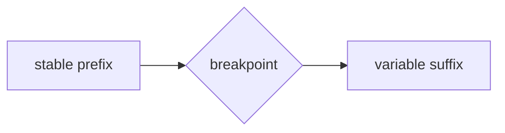

# Chapter Template -- The Road to Agentic Archon

Use this template for every `/book/chapters/NN-slug.md`.

```markdown
# Ch. {{N}} -- {{Title}}

**Prerequisites:** [prev chapter links] | **Sources:** [`references/...` links the wiki verified]
**Reading time:** ~{{minutes}} min | **You will learn:** {{3 bullets}}

> Why this chapter exists: one paragraph placing this chapter on the knowledge tree. Which earlier chapter does this build on, and which later chapter will need it?

## The idea in plain language

Three to five paragraphs, Fowler/Beck voice. Name the concept in one sentence, show the smallest example, then expand. Progressive disclosure only. No jargon without a glossary link on first use.

## How it actually works (mechanism)

Grounded prose. Name the actual config keys, file paths, tool names, and lifecycle stages the source wiki pages give you. One paragraph per mechanism facet. Carry over edge cases the wiki flagged. Tag claims VERIFIED vs BEST CURRENT UNDERSTANDING as the wiki does; cite the source page per section (`[caching.md](../../references/harnesses/caching.md)`).

### Mermaid -- when the concept can be seen

Place exactly one diagram directly above the prose it illustrates when `mermaid_needed=true` for this chapter:



Keep labels ASCII, under 25 nodes. Choose `flowchart` for structure, `sequenceDiagram` for flow, `stateDiagram-v2` for states.

## Edge cases and gotchas the wiki flagged

Bullets of the real gotchas the wiki documented (e.g. timestamp invalidates cache, bounded tool surface, etc.). Each bullet cites its source page.

## Sources and grounding note

This chapter distills:
- `references/harnesses/{{topic}}.md` -- § source sections, VERIFIED from {{primary source}}
- `references/...` -- inherited grounding tags preserved.

If a mechanism gap exists in the wiki, note it here verbatim: "This section is not yet in the wiki -- ask `airchon-author` to research {{topic}}."

---
Prev: [{{prev}}](../index.md) | Index: [index.md](../index.md) | Next: [{{next}}](../index.md) | Glossary: [{{terms}}](../glossary.md)
```
