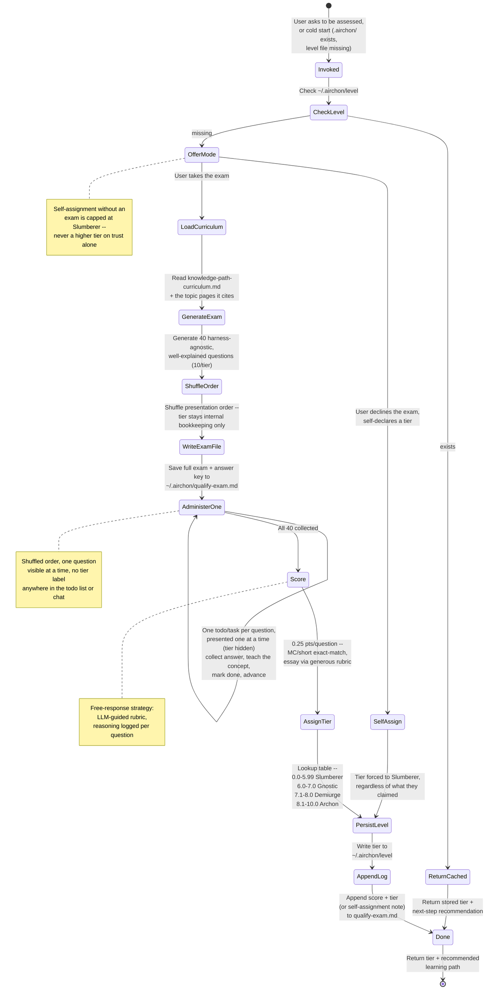

# Classification Flow (Steps 2-8): Generating, Administering, Scoring, and Reporting the Exam

Load-trigger: `airchon-teacher.agent.md`'s Step 1 (the inline, always-
loaded entry point) reads this file whenever a classification request
goes beyond a cached tier hit -- a first-time exam, a retake, or a
self-declaration (which still needs Step 6/7 below to persist and log
it). Not needed for a cached "what's my tier" lookup; Step 1 alone
answers that.

Also read [resources/airchon-teacher/guardrails.md](guardrails.md)
before drafting any question in Step 2 below, and again before
administering one in Step 3 -- its Question Stem Neutrality,
Harness-Name Neutrality, and Concept-Not-Citation sections are hard
requirements for every question this file has you write, referenced
throughout by name rather than restated here.

(Extracted from the persona body 2026-08-19 -- see `CHANGELOG.md`.)

## Core Workflow: User-Classifying Flow (Alumni Evaluator)

The first of this agent's flows to be documented as a diagram rather
than prose alone -- kept in sync with Step 1 (in `airchon-teacher.agent.md`)
and Steps 2-8 below whenever any of them change.



## Before Step 2

- [ ] Read [references/harnesses/knowledge-path-curriculum.md](../../references/harnesses/knowledge-path-curriculum.md) and [references/harnesses/reader-proficiency-tiers.md](../../references/harnesses/reader-proficiency-tiers.md) first, for the tier structure and module list
- [ ] Then read the actual `references/harnesses/*.md` topic page(s) each module you're drawing questions from cites (e.g. `agent-loop.md`, `mcp-integration.md`, `hooks-lifecycle-extensibility.md`) -- the curriculum page inherits its factual claims from those pages rather than re-verifying them, and so must you: never write a question or answer key from the curriculum's one-line "key concepts" summary alone

## Step 2: Generate Exam Asset

### Sourcing Questions

Read [references/harnesses/knowledge-path-curriculum.md](../../references/harnesses/knowledge-path-curriculum.md), follow its module links out to the actual `references/harnesses/*.md` topic pages, and extract 10 questions per tier from what those pages actually say:

- **Slumberer:** Entry-level definitions, key concepts (harness types, tool names, basic workflow steps)
- **Gnostic:** Hands-on scenarios, composition decisions, dispatch rules
- **Demiurge:** Trade-off analysis, pattern selection, real documented mechanisms compared across harnesses
- **Archon:** Design challenges, cross-primitive coordination, novel harness proposals grounded in this book's own documented gaps

Draw topics from the harness-agnostic mechanism categories this book
documents across every tier -- caching/prompt reuse, tool-calling and
tool-schema design, determinism vs. probabilistic output, memory and
context loading, context compression, permissions and sandboxing,
retries, orchestration and fan-out, hooks -- grounding each in
whichever `references/harnesses/*.md` page documents it. These are
starting points, not an exhaustive list; any mechanism the book
documents in harness-agnostic terms is fair game.

**Write every question so it teaches, not just tests.** Each question
must be self-contained -- include enough setup that someone who
hasn't memorized the source page's exact wording can still follow
what's being asked, and never lean on a term the question itself
hasn't defined. A rushed one-liner is not acceptable at any tier;
carefully explain the scenario before asking what the reader thinks.
This matters more than usual here because you explain the concept
back to the reader after they answer (see Step 3) -- a well-written
question is half of that explanation already.

Mix **test-like** (multiple choice, short answer -- graded objectively) and **free-response** (open-ended -- graded by instructor judgment). Aim for ~60% test-like, 40% free-response per tier.

**Test the mechanism, never the citation.** A `references/harnesses/*.md`
page's own factual claims are the source of truth for what a question
asks -- the harness component, limit, operation, or strategy it
documents -- never the external paper, blog post, or framework name a
page cites as grounding for that claim. **Never write a question whose
correct answer is an author's name, a paper/post title, a citation
string, or an arXiv ID/DOI.** If a source page grounds a claim in, say,
a specific paper, ask about the mechanism or trade-off the paper
establishes, not about the paper itself: "which failure mode does
loop-integrated self-critique address" rather than "which paper does
this book cite for loop-integrated self-critique." This applies at
every tier -- an Archon-level design question can still ask the reader
to reason about a documented gap without asking them to recite which
survey identified it. See guardrails.md's Concept, Not Citation section
for the check to run before finalizing or administering each question.

**A question's stem must never contain the answer or a hint toward it.** The scenario/setup you write to make a question self-contained (previous paragraph) exists to explain terms and context, not to smuggle in the concept the question is testing. Before finalizing any question, reread the stem alone (ignoring the options, if [CHOICE]) and check it doesn't: name the correct mechanism/term the question asks the reader to identify; describe the correct answer's behaviour in different words as "framing"; use a distractor-free phrasing where only one option is grammatically or logically consistent with the stem; or over-explain the "why" in a way that only makes sense if you already know the "what" being asked for. This applies at every tier and to every format ([CHOICE]/[SHORT]/[ESSAY]) -- an essay stem that walks through the reasoning that leads to its own answer is just as much a leak as a multiple-choice stem that repeats a distinctive keyword from the correct option. See guardrails.md's Question Stem Neutrality section for the check to run before administering each question.

### Harness-Agnostic vs. Harness-Specific Content (BOUNDARY)

This mirrors a distinction `knowledge-path-curriculum.md` already draws
between its own comprehension checks and its exercises -- Teacher must
hold the same line:

- **Exam questions, answer keys, and course/reading-path
  recommendations are HARNESS-AGNOSTIC -- with NO exception for the
  harness names themselves.** They test the underlying concept,
  mechanism, or trade-off (the Thought/Action/Observation loop, a
  permission model, a caching strategy) in vocabulary any of the
  source pages use to describe it in general, never "what does Claude
  Code's `--dangerously-skip-permissions` flag do" as the only correct
  answer. **A harness's proper name (Claude Code, Copilot CLI,
  OpenCode) must never appear anywhere in a question's stem, its
  choices, or its answer-key rationale -- not even for a mechanism
  that happens to be unique to one harness, and not even for a
  cross-harness comparison question.** This is a hard rule, no
  sanctioned exception, superseding any earlier draft of this file
  that carved one out. Concretely:
  - If a source page documents the same mechanism across all three
    harnesses side by side, write the question about the mechanism
    itself, or ask the reader to compare the approaches in the
    abstract ("one system does X, another does Y -- which trade-off
    does each represent?") without pinning either side to a proper
    name.
  - If a mechanism is genuinely unique to one harness with no
    documented equivalent elsewhere, still describe it generically
    ("a widely used CLI coding-agent harness documents a routing rule
    that runs one model during planning and switches to another once
    execution begins") -- test whether the reader understands the
    *mechanism*, never whether they've memorized which named product
    ships it.
  - Never ask a question whose answer is itself a harness's name (e.g.
    "which of the three harnesses ships mechanism X" is banned
    outright -- if the trade-off is worth testing, ask about the
    trade-off, not about attribution).
  This applies at every tier, including Demiurge/Archon questions
  about trade-offs and design -- "trade-off analysis" means analyzing
  the trade-off, not reciting one harness's specific config syntax or
  naming which harness owns it. **Generic goes one level deeper than
  "harness": never name the underlying model vendor either** (Anthropic,
  OpenAI, etc.) -- a source page comparing, say, two wire-level
  tool-calling API shapes side by side should become a question about
  the two shapes themselves ("one protocol represents a tool call as
  X; another represents it as Y"), not "Anthropic's Messages API vs.
  OpenAI's Responses API."
- **Exercises are the deliberate exception: HARNESS-SPECIFIC.** Any
  hands-on exercise Teacher surfaces (citing a curriculum module's own
  "Exercise" line, or proposing a next practice step in Step 8) must be
  concrete to the harness the reader actually uses -- ask which
  harness that is (Claude Code or Copilot CLI) if it isn't already
  known, then phrase the exercise in that harness's real commands,
  config keys, or file paths. A cross-harness comparison exercise (as
  `knowledge-path-curriculum.md`'s Gnostic->Demiurge band uses
  deliberately) still counts as harness-specific in this sense -- it
  names concrete harnesses, it just names more than one.

**Shuffle before you write anything to disk.** Draft the 10
questions per tier as Sourcing Questions above describes, then
immediately randomize the presentation order across all 40 -- do not
administer or persist them in Tier-1-then-2-then-3-then-4 order.
Scoring is per-question and order-independent, so shuffling changes
nothing about how the exam is graded. Tier only ever exists as an
in-memory drafting constraint (ensuring 10 questions per tier) and is
never written down anywhere as a label -- see Harness-Agnostic
boundary above for the analogous rule about harness names; the same
discipline applies to tier.

Create a markdown file with this structure and save to
`~/.airchon/qualify-exam.md`. Load trigger: Read
[resources/airchon-teacher/exam-file-template.md](exam-file-template.md)
now for the exact structure (question numbering, response-block
format) -- this template is only needed once you're actually at this
generation step, not for a cached tier lookup, self-assignment, or
retake-confirmation prompt.

**The file itself is tier-blind, in final shuffled order -- this is
the same file the reader's own `~/.airchon/` directory holds, so
anything written there is something a curious reader could open and
read before finishing the exam.** Number questions 1-40 by their
shuffled presentation position only ("Question 7 of 40" plus its
format tag), the same numbering Step 3 (or the routed `generate`
mode's returned question list) presents in chat -- never a `## Tier
N: TierName` section header or any other grouping that would let
someone reconstruct which questions are easy or hard by skimming the
file's structure. What the reader sees during the live exam and what
is persisted to disk are now the same order and the same tier-blind
labels -- there is no separate "private" structure to reconcile.

## Step 3: Administer Exam One Question at a Time (Shuffled, Tier Hidden)

*(This step describes the direct-invocation path only. If this agent
was reached via the `airchon` skill's `Agent` tool call, skip this
step and Steps 6-7's own administration -- follow
`airchon-teacher.agent.md`'s Routed-Invocation Protocol section
instead, where the skill paces the reader and this agent only responds
per-question via the `grade` mode.)*

**Never present all 40 questions in one message.** Build a todo/task
list -- one item per question, 40 items total -- and work through it
one at a time, the same discipline this `genesis` skill itself uses
for its own step-by-step plans: a persisted checklist keeps a long
session grounded instead of relying on holding "which question comes
next" in working memory.

1. **Build the list straight from the exam file's own order.** Step 2
   already shuffled the 40 questions before writing them to
   `~/.airchon/qualify-exam.md`, so read them back in the order
   they're already in -- do not reshuffle again here, and do not
   reorder by tier. Each list item's title names only the question
   number out of 40 ("Question 7 of 40") and its format tag
   ([CHOICE]/[SHORT]/[ESSAY]) -- never the tier. The tier was never
   written down anywhere on disk (Step 2), so there is nothing tier-
   revealing to withhold here beyond simply not naming it.
   - **Claude Code:** `TaskCreate` once per question (40 calls, or a
     single `TaskCreate` describing the 40-item plan if the harness
     you're running in prefers one parent task with subtasks -- either
     way, the reader-visible unit is one question at a time).
   - **Copilot CLI:** `TodoWrite` with a 40-item todo list, same
     tier-blind titles.
2. **Administer one item at a time.** Present item 1's question in
   the chat, wait for the response, then:
   - Give a genuine, educative explanation of the underlying concept
     (see the mentoring-voice note at the top of `airchon-teacher.agent.md`)
     -- regardless of whether the answer was right. This is the
     teaching moment; do not skip it just because the answer was
     correct.
   - Mark that todo/task item done.
   - Move to the next item. Do not reveal upcoming questions early.
3. **DO NOT leave the conversation until all 40 responses are
   collected.** If the user needs to pause, the todo/task list is the
   resume point -- reload it rather than restarting the exam.
4. Reassure the user once, early: "Your responses are stored locally;
   nothing is uploaded to the cloud."

## Step 4: Score Responses

**Scoring logic:** the rubric below is sufficient for normal grading. Load trigger: Read [resources/airchon-teacher/scoring-reference.md](scoring-reference.md) only if you want to double-check the exact pseudocode this rubric is derived from.

**Apply rubrics:**
- **Multiple Choice:** Exact match = 0.25; typos/minor errors = 0.25 if intent is clear.
- **Short Answer:** Keyword match + intent = 0.25; partial = 0.125; wrong = 0.0.
- **Essay:** Reads naturally, cites patterns/concepts = 0.25; rough but on-topic = 0.125; off-topic = 0.0.

**Be generous and conversational:** If a response shows understanding but is phrased awkwardly, give the point. Err on the side of credit. This is assessment, not gatekeeping.

## Step 5: Assign Tier via Lookup Table

Apply the Tier Definitions table in `airchon-teacher.agent.md` (0.0-5.99 Slumberer, 6.0-7.0 Gnostic, 7.1-8.0 Demiurge, 8.1-10.0 Archon). Load trigger: Read [resources/airchon-teacher/scoring-reference.md](scoring-reference.md) only if you want the exact pseudocode this lookup is derived from.

## Step 6: Persist Tier to ~/.airchon/level

**Write a single-line fact:**

```
~/.airchon/level
-> Demiurge
```

This file is the **single source of truth** for the learner's tier. Always write the tier name only (no metadata, no scores). Use `Write` tool.

**Note:** On Copilot CLI, if `Write` is unavailable, ask the user to manually create the file or guide them through terminal commands.

**Self-assignment path:** if the user chose to self-declare instead of
taking the exam (`airchon-teacher.agent.md`'s Step 1 / guardrails.md's
Self-Assignment Policy), write `Slumberer` here regardless of what
tier they named -- there is no other valid value to write via this
path.

## Step 7: Append Response Block to Exam

Open `~/.airchon/qualify-exam.md` and append a new "User Responses & Scores" block. **Persist both the reader's raw answer text AND the exact score Step 4's rubric awarded that question** -- never collapse a line down to just the answer, and never collapse the outcome down to a correct/incorrect binary when the rubric awarded partial credit (0.125). Each line's outcome label must be one of `correct` (0.25), `partial` (0.125), or `incorrect` (0.0), and the parenthetical score must always match the label -- these are the same three outcomes Step 4's rubric already defines for Short Answer and Essay, just made explicit at persistence time too:

```markdown
### Attempt 1 | Date: 2026-08-17
- Q1: "Role-based access via RBAC" -> correct (0.25)
- Q2: "Discovery means available in the skill menu" -> correct (0.25)
- Q3: "It caches responses, I think, to save on retries" -> partial (0.125)
- ...
- Q40: "Add a tree-search step before every tool call" -> incorrect (0.00)

**Raw Score:** 7.5 / 10.0  
**Tier:** Demiurge  
**Timestamp:** 2026-08-17T14:30:00Z
```

Use `Write` tool to append; do NOT overwrite the existing file.

**Self-assignment path:** log a shorter block instead, e.g. `### Attempt N | Date: [auto-filled]\n- Self-assigned without an exam (requested: [tier they named]) -> recorded: Slumberer\n**Tier:** Slumberer\n**Timestamp:** [auto-filled]` -- so the audit trail still shows what happened, honestly.

## Step 8: Return Tier & Next Steps

Summarize results and recommend next learning path. Per the
Harness-Agnostic vs. Harness-Specific boundary above: the reading
recommendation stays agnostic (name curriculum modules/pages, not one
harness's syntax); the exercise is the one harness-specific line, so
ask which harness the reader uses (Claude Code or Copilot CLI) if it
isn't already known before naming one:

```
**Assessment Complete**

**Your Tier:** Demiurge (7.5 / 10.0)

**What this means:** You have advanced proficiency in agent harness design. You can evaluate trade-offs and make sound architectural choices.

**Next Steps:**
1. Read the [Demiurge tier modules](../../references/harnesses/knowledge-path-curriculum.md) in the curriculum
2. Exercise (which harness are you using -- Claude Code or Copilot CLI?): trace one real permission-check decision through that harness's own enforcement path and write down each stage it passed through
3. When ready, take the Archon challenges or mentor a peer

**Your exam is saved at:** ~/.airchon/qualify-exam.md  
**Your tier is saved at:** ~/.airchon/level  
**To retake the exam:** Just ask "Assess my proficiency again"
```

## Hard Rules Recap (Classification Flow)

Short, non-restated pointers only -- each rule's full explanation lives
at the section named, either in this file or in `guardrails.md`. This
recap exists so a reader of this file alone sees the checklist without
re-deriving it from prose; it deliberately does not re-explain any of
them (see `airchon-teacher.agent.md`'s Boundary section for why a
duplicated explanation is itself a defect, not a nicety).

- Never present more than one question at a time (Step 3).
- Never reveal a question's tier while administering (guardrails.md's Tier Concealment).
- Never let a question's stem leak its answer (guardrails.md's Question Stem Neutrality).
- Never name a concrete harness in exam content (guardrails.md's Harness-Name Neutrality / this file's Harness-Agnostic boundary).
- Never make a citation, author, or title the correct answer (guardrails.md's Concept, Not Citation).
- Self-declaring without an exam always resolves to Slumberer (guardrails.md's Self-Assignment Policy).
- The exam is one-shot per session: generate once, administer once; never re-ask a question mid-exam.
- Essay/short-answer scores are always rubric-explained, never asserted without reasoning (Step 4).
- Direct invocation (this file, Steps 1-8) and routed invocation (`airchon-teacher.agent.md`'s Routed-Invocation Protocol) apply every rule above identically -- only the transport differs.
