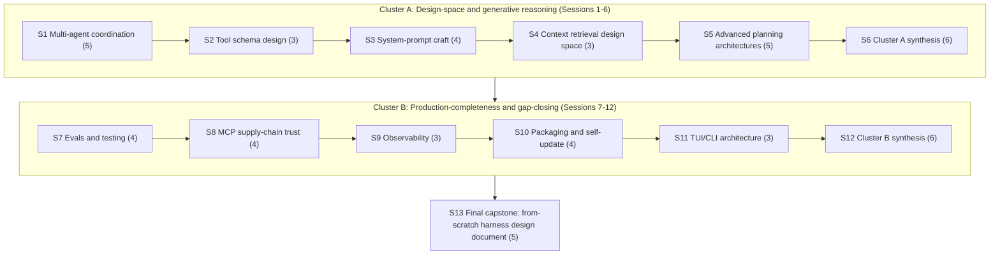

# Session breakdown (agenda only): Demiurge -> Archon

**What this file is.** A pacing layer on top of
[knowledge-path-curriculum.md](knowledge-path-curriculum.md)'s
"Transition 3: Demiurge -> Archon" section -- the 10-page design-space
/original-survey/production-completeness band. That page's learning
objectives, per-module key concepts, comprehension checks, and
exercises answer "what has to be taught." This file answers a
different, added question: "how do you chunk that same material into
discrete, schedulable teaching sessions, sized so no single sitting is
overloaded and no sitting is so thin it isn't worth convening" -- the
same question the sibling files
[slumberer-to-gnostic-sessions.md](slumberer-to-gnostic-sessions.md)
and [gnostic-to-demiurge-sessions.md](gnostic-to-demiurge-sessions.md)
answered for Transitions 1 and 2, scaled to a band roughly half the
module count of Transition 2's (10 modules against 21) but different
in kind, not just in size: this band's own ten pages are, in
`reader-proficiency-tiers.md`'s own words, "original design-space
surveys and syntheses, not single-harness research reports" -- several
self-describe in `index.md` as an "ORIGINAL DESIGN-SPACE SURVEY" or as
explicit "table stakes" production-completeness coverage rather than a
differentiating design decision -- so this file's sessions carry
correspondingly more generative agenda items (sketch a from-scratch
mechanism, design a re-verification check) per module than either
prior transition's more observational ones.

**Why this lives here, not in the wiki-book.** `references/harnesses/`
is the general-purpose, cross-agent wiki-book -- `airchon-mentor` reads
it conversationally, `airchon-author` is its only writer, and its
content (harness-internals research, the tier rubric, the curriculum
scaffold) serves any reader. Session pacing for actually *running* a
Demiurge->Archon course is different in kind: it is scoped to one
specific agent's own domain (`airchon-teacher`'s proficiency-tier
mission) rather than general reference material. Written directly here,
alongside its two siblings, rather than ever having lived inline in
`knowledge-path-curriculum.md` first -- see that page's own pointer
paragraph under "Transition 3" and `CHANGELOG.md` for the provenance
of this scoping decision, first established for Transition 1 and
repeated without a wiki-book detour for Transition 2 and now this one.
As of 2026-08-18, `airchon-teacher` directly consumes this file the
same way it now consumes its Transition-1 sibling -- see that file's
own note on this (and `CHANGELOG.md`'s 2026-08-18 entry) for the shared
rationale, not repeated here. The 10 module-content sessions below
(Sessions 1-5, 7-11) name no exercise of
their own -- Course-Delivery Flow pulls each one's practical exercise
live from its corresponding module's own Exercise field in
`knowledge-path-curriculum.md` instead of duplicating that text here;
only the two cluster-synthesis sessions and the final capstone keep
their own named exercise below, unchanged.

Like the rest of `knowledge-path-curriculum.md`'s pedagogical
scaffolding (comprehension checks, exercises, capstone), this session
breakdown is original pedagogical design, not a researched claim about
how anyone actually learns. Every item named in each session's agenda
below is inherited by reference from `knowledge-path-curriculum.md`'s
own Module sections for this transition (its "Key concepts,"
"Comprehension check," and "Exercise" fields) or from its own Capstone
section -- nothing here is a new concept not already scoped there; a
session's job is only to say *which* items get discussed together and
in what grouping, not to re-explain them. Every item below is also
phrased generically per `classification-flow.md`'s Harness-Agnostic
boundary: no underlying model vendor is named anywhere in this file --
only the three harness names this whole book compares (Claude Code,
Copilot CLI, OpenCode) are named, exactly where the source curriculum
page itself names one of them as a concrete worked example.

**Why 13 sessions, not fewer or more.** The band's 10 modules carry, in
total, 38 discrete key-concept items when each module's own "Key
concepts" field is broken into its constituent teaching points (the
same granularity both sibling files used) -- ranging module-by-module
from 3 items (tool-schema-and-interface-design.md,
context-retrieval-and-agentic-search.md, observability-and-self-
diagnostics.md, tui-cli-application-architecture.md) to 5
(multi-agent-coordination-design-space.md,
advanced-planning-and-execution-architectures.md, the two richest
modules in the band, each naming four or more distinct sub-mechanisms
in one "Key concepts" field). Three session-count choices were
rejected before settling on 13:

- **One session per cluster (2 sessions total)** would force 18-20
  key-concept items -- five modules' worth, each already requiring
  generative, design-from-scratch engagement rather than the more
  observational recall the two prior transitions' comprehension checks
  asked for -- into a single sitting. That is three to four times the
  3-6-item range both sibling files established as the sensible floor
  and ceiling, and it would collapse first exposure to genuinely
  distinct design questions (e.g. a tool-annotation-hint schema
  question and a compaction-survival-phrasing question) into the same
  block.
- **One session per module with no synthesis sessions at all (10
  sessions)** would teach every module's key concepts but discard the
  natural two-way split this band's own pages already draw for
  themselves -- several of the five Cluster-A pages self-describe in
  `index.md` as an "ORIGINAL DESIGN-SPACE SURVEY" or a "design-space
  companion" to an earlier mechanics page, while the five Cluster-B
  pages self-describe as explicit "table stakes" coverage "not a
  differentiating design decision," closing named items on a prior
  gap-analysis pass. Dropping the two synthesis sessions that let a
  reader integrate within each of those self-described groupings would
  leave the comprehension-check-and-exercise practice this band's
  material organizes itself around with nowhere to happen short of one
  end-of-transition sitting holding all ten comprehension checks plus
  exercise selection at once -- the same overload failure the
  cluster-per-session option above was rejected for, merely deferred to
  the end.
- **Splitting any individual module's already-short 3-5-item
  key-concepts list across two sessions** would produce sittings of one
  or two items each -- precisely the "so thin it's pointless" failure
  mode `slumberer-to-gnostic-sessions.md` names as the reason it
  rejected four-or-more sessions for its own, much smaller band.

13 is the smallest count that avoids all three failure modes at once:
**10 module-content sessions** (Sessions 1-5 and 7-11 -- one per
module, agenda drawn directly and only from that module's own "Key
concepts" field, sized 3-5 items exactly as that field's own
granularity dictates, no combining and no further splitting), **2
cluster-synthesis sessions** (Sessions 6 and 12 -- one per cluster,
immediately after that cluster's own module sessions, each sized 6
items: one item per module in the cluster, each item being that
module's own "Comprehension check" question walked cold, plus one item
selecting a single representative "Exercise" from that cluster's
modules to actually run, rather than attempting all five of that
cluster's exercises in one sitting), and **1 final capstone session**
(Session 13, sized 5 items, breaking the transition's own single
"from-scratch harness design document" capstone task into its concrete
deliverable steps). This keeps every session in the same 3-6 item
range both prior transitions established as the sensible floor and
ceiling, while letting the course's own shape mirror the two-way
design-space-vs-production-completeness split this band's own pages
already draw for themselves in `index.md`, rather than inventing a
different grouping.

---

## Cluster A: Design-space and generative reasoning (Sessions 1-6)

**Session 1 -- The multi-agent coordination design space.** Items to
cover, in order:
1. Topology patterns from the general multi-agent-systems literature:
   centralized, decentralized, layered, and shared-message-pool
   coordination.
2. Blackboard architectures as a shared-scratchpad coordination
   pattern.
3. Consensus/voting among peer agents as a coordination pattern.
4. Market-based (competitive-bidding, Contract-Net-Protocol-style)
   task allocation as a coordination pattern.
5. Where each shipped harness mechanic (Claude Code, Copilot CLI,
   OpenCode) actually lands on this topology map, including which
   pattern none of the three implements at all.

**Session 2 -- Tool schema / interface design.** Items to cover, in
order:
1. JSON Schema authoring for tool definitions, per official tool-use
   documentation guidance: description quality and grammar-constrained,
   strictly-typed parameter schemas.
2. The few-powerful-vs-many-narrow tool-count tradeoff, tested against
   a real cross-harness tool-count inventory.
3. Idempotency and error-message design via the Model Context
   Protocol specification's four tool annotation hints
   (`readOnlyHint`/`destructiveHint`/`idempotentHint`/`openWorldHint`).

**Session 3 -- System-prompt / agent-instruction design as a craft.**
Items to cover, in order:
1. Tool-calling-style phrasing and the "right altitude" framing for
   instruction text.
2. Few-shot tool-call examples vs. prose constraints as complementary
   authoring techniques.
3. Compaction-survival phrasing: writing instructions that remain
   effective after a context-compaction event.
4. Prompt-injection-resistant authoring as a complement to -- never a
   substitute for -- enforcement architecture.

**Session 4 -- Context retrieval / RAG vs. agentic search as a design
space.** Items to cover, in order:
1. The retrieval-augmented-generation-vs-agentic-search design space,
   as two competing code-discovery strategies.
2. The finding that none of Claude Code, Copilot CLI, or OpenCode ships
   embeddings-based retrieval as its primary code-discovery strategy
   today, all three converging on iterative search instead.
3. The open question this design space raises: is an
   embeddings-for-candidates/agentic-search-for-verification hybrid a
   genuine technical ceiling none of the three has reached, or a
   deliberate operational-scope choice each team declined to own?

**Session 5 -- Advanced/novel planning and execution architectures.**
Items to cover, in order:
1. The negative finding: no shipped harness implements tree-search
   -style planning, a loop-integrated self-critique mechanism, per-step
   multi-model ensembling, or speculative tool execution inside its
   primary task loop.
2. Tree-search/best-of-N-style planning and the literature it is
   grounded in.
3. Loop-integrated self-critique and the literature it is grounded in.
4. Per-step multi-model ensembling and the literature it is grounded
   in.
5. Speculative tool execution and the literature it is grounded in,
   including a reasoned account of why a read/write tool-kind safety
   distinction plausibly blocks it from shipping today.

**Session 6 -- Cluster A synthesis.** No new material -- every item
here is integration of Sessions 1-5, not a new concept:
1. Walk multi-agent-coordination-design-space.md's comprehension check:
   which shipped feature is the clearest real blackboard-architecture
   instance, and which coordination pattern no shipped harness
   implements at all.
2. Walk tool-schema-and-interface-design.md's comprehension check: the
   four tool annotation hints, and what the destructive-action hint is
   supposed to signal to a client.
3. Walk system-prompt-design-as-craft.md's comprehension check: what
   "right altitude" means in system-prompt phrasing, and why
   prompt-injection resistance is treated as authoring-side rather than
   enforcement-side.
4. Walk context-retrieval-and-agentic-search.md's comprehension check:
   the cited reason for one harness reversing an early
   retrieval-augmented-generation-plus-vector-database implementation.
5. Walk advanced-planning-and-execution-architectures.md's
   comprehension check: one of the four missing mechanisms and the
   specific paper grounding it in the literature.
6. Run one representative exercise from this cluster (recommended:
   advanced-planning-and-execution-architectures.md's -- sketch a
   from-scratch design for loop-integrated self-critique, reusing this
   book's own already-documented primitives and naming which existing
   primitive each part of the design reuses).

---

## Cluster B: Production-completeness and gap-closing (Sessions 7-12)

**Session 7 -- Evals and testing a harness.** Items to cover, in
order:
1. The four-layer testing pyramid: unit-level wire-format correctness,
   session/integration correctness, API/route-surface coverage, and
   end-to-end capability evals.
2. Record/replay ("cassette"-style) testing as a worked example of the
   pyramid's lower layers.
3. A golden regression matrix run across many provider/model targets as
   a worked example of the pyramid's upper layers.
4. Deterministic streaming-event unit testing as a worked example of
   asserting exact event sequences across a split-mid-stream chunk
   boundary.

**Session 8 -- MCP supply-chain trust/vetting.** Items to cover, in
order:
1. The three separable trust axes: identity, code-safety, and
   continuity.
2. The named attack taxonomy: tool description poisoning, tool
   shadowing, and tool-name squatting.
3. The "rug pull" attack specifically, and why it is fundamentally a
   continuity-axis problem rather than an identity- or code-safety-axis
   one.
4. The finding that no shipped harness re-verifies a previously
   -approved server's tool definitions on update.

**Session 9 -- Observability and self-diagnostics.** Items to cover,
in order:
1. The four separable observability layers this design space argues
   for: cost export, execution tracing, an interactive debug surface,
   and vendor product telemetry.
2. A worked example of a beta distributed-tracing signal with a
   request/tool-call/hook span hierarchy.
3. The argument that a harness should keep these four layers
   structurally distinct rather than sharing one undifferentiated pipe.

**Session 10 -- Packaging, distribution, and self-update mechanics.**
Items to cover, in order:
1. Multi-channel distribution: installer scripts, package managers, and
   signed repositories.
2. Integrity chains: cryptographic signing and code-signing
   verification of a downloaded binary.
3. Auto-update mechanics and their failure modes: a streamed-download
   memory issue and a launcher-preservation gap, as two concrete named
   examples.
4. A fully source-verified example of per-install-method upgrade
   branching (the update logic differing by which channel originally
   installed the harness).

**Session 11 -- TUI/CLI application architecture.** Items to cover, in
order:
1. The rendering-engine/component-model/input-handling layer, one level
   above lower-level buffering/reassembly/pacing concerns.
2. A fully source-verified terminal-UI stack: a native systems-language
   rendering core, a flexbox-style layout engine, and a
   reconciler-based component library.
3. A keybinding "mode-stack" architecture (push/pop, shadowing) as a
   design choice distinct from a flatter keybinding-scoping model.

**Session 12 -- Cluster B synthesis.** No new material -- every item
here is integration of Sessions 7-11, not a new concept:
1. Walk evals-and-testing-a-harness.md's comprehension check: the
   record/replay test package named, and what its
   hard-fail-on-a-missing-recording discipline enforces.
2. Walk mcp-supply-chain-trust.md's comprehension check: what a "rug
   pull" is in this attack taxonomy, and why the no-re-verification
   -on-update finding makes that attack specifically dangerous.
3. Walk observability-and-self-diagnostics.md's comprehension check:
   the four observability layers, and one real example of two of them
   being conflated in a shipped product.
4. Walk packaging-distribution-and-self-update.md's comprehension
   check: one integrity mechanism a distribution channel uses to prove
   a downloaded binary hasn't been tampered with.
5. Walk tui-cli-application-architecture.md's comprehension check: what
   a keybinding "mode-stack" is, and how one harness's implementation
   of it differs from a flatter keybinding-scoping model.
6. Run one representative exercise from this cluster (recommended:
   mcp-supply-chain-trust.md's -- design a concrete re-verification
   mechanism, specifying what gets hashed/signed/compared and at what
   lifecycle point the check would need to run, that closes the
   update-time trust gap this cluster's own finding identifies).

---

## Session 13 -- Final capstone: from-scratch harness design document

No new material -- every item here is execution of
`knowledge-path-curriculum.md`'s own Transition-3 capstone task, broken
into its concrete deliverable steps:
1. Select one substantial, genuinely novel feature that this band's ten
   pages document as either unshipped anywhere or shipped inconsistently
   across the three real harnesses.
2. State the design problem in the vocabulary of the relevant
   design-space page(s) covered in Sessions 1-11.
3. Survey what each real harness currently does or doesn't do, with
   citations to the specific session/module page(s) that established
   that finding.
4. Propose a concrete design -- tool schemas, config keys, permission
   gates, observability signals, or coordination topology, as the
   feature requires -- reusing named existing primitives from this book
   wherever a suitable one exists rather than inventing new machinery
   gratuitously.
5. Name at least one open question the design does not resolve,
   flagged honestly as unresolved rather than papered over, and
   self-check (or peer-review) the whole document against the
   capstone's own grading criteria: that it engages with real cited
   findings from the ten Cluster A/B pages, and that its open-questions
   section is honest rather than decorative.

---

## Extension (2026-08-24): Cluster 8 session additions

**Why this section exists, appended rather than folded in above.**
`knowledge-path-curriculum.md`'s 2026-08-24 revision note added Cluster
8 (Agentic SDLC design-space and methodology, sourced from
`references/sdlc/`) to this transition after the 13-session breakdown
above was already written. That page's own note under "Session
breakdown (agenda only), Demiurge -> Archon" flags this explicitly: "as
with the Transition 2 pacing file, this 13-session count predates
Cluster 8 below and covers only the original ten-page band." Per this
file's operating rule -- preserve existing session numbering, never
renumber or rewrite a session once taught from -- the fix is additive:
Sessions 1-13 above are untouched, and Cluster 8 gets its own sessions
numbered 14 onward, continuing the sequence rather than being spliced
in before the existing Session 13 capstone. A course already in
progress against the original 13 sessions is unaffected; a course
starting fresh now runs all 24 sessions straight through, with the
original Session 13 capstone still sitting where it always did (the
ten core Cluster A/B pages only) and Cluster 8's own capstone variant
arriving as the new Session 24 below.

**Grounding-status reminder, restated per `knowledge-path-curriculum.md`'s
own instruction not to drop it when teaching from this page.** Every
item in Cluster 8's sessions below is sourced from `references/sdlc/`
pages, attributed "the handbook says" to the Agentic SDLC Handbook, not
independently cross-verified the way Clusters A and B's ten pages are.
It does not carry this wiki-book's own VERIFIED/BEST-CURRENT
-UNDERSTANDING tagging -- say so explicitly when teaching this cluster,
the same distinction `knowledge-path-curriculum.md`'s Cluster 8 overview
and Archon-tier learning objectives both restate inline.

**Why 11 more sessions, not fewer or more.** Cluster 8 carries 9 module
sections (`09-10-part-iii-preface-and-practitioners-mindset.md` through
the bundled case-studies-and-appendix-B module), the last of which
alone cites five separate sources (four case studies plus the Genesis
worked-example appendix) -- carrying, in total, 27 discrete
key-concept items when each module's own "Key concepts" field is broken
into its constituent teaching points at the same granularity the
original 13-session rationale above used, ranging module-by-module from
2 items (`prose-framework.md`, `22-the-reference-architecture-earned.md`)
to 5 (the case-studies module, one item per case study/appendix). The
same three failure modes the original rationale above rejected apply
again: one session for the whole cluster would force all 27 items into
a single sitting; one session per module with no synthesis session (9
sessions) would leave the comprehension-check-and-exercise-selection
practice this book's other clusters group into their own synthesis
session with nowhere to happen; splitting any one module's already
-short 2-3-item key-concepts list across two sessions reproduces the
"so thin it's pointless" failure this file's opening rationale already
named. **9 module-content sessions** (one per module, sized to that
module's own key-concepts granularity, 2-5 items), plus **1
cluster-synthesis session** (walking all nine modules' comprehension
checks plus selecting one representative exercise to actually run --
larger than Cluster A/B's own 6-item synthesis sessions because Cluster
8 itself has nearly double the module count of either, not because a
different grouping principle was applied), plus **1 capstone-variant
session** (covering `knowledge-path-curriculum.md`'s own "Cluster 8
variant" of the Transition-3 capstone) is the smallest count avoiding
all three failure modes, continuing the numbering as Sessions 14-24.

---

## Cluster 8: Agentic SDLC design-space and methodology (Sessions 14-23)

**Session 14 -- The practitioner's mindset.** Items to cover, in
order:
1. The eight terms practitioners cannot avoid: Primitive, Manifest,
   Lockfile, CODEOWNERS, Harness, Subagent, Recursion bound, MCP.
2. The five-layer supply chain restated from Ch. 4.
3. The four composition patterns (Panel/Wave/Scatter-Gather/Subagent)
   named as the field's converged vocabulary before Ch. 17 develops them
   mechanically.

**Session 15 -- The PROSE framework.** Items to cover, in order:
1. The five constraints (Progressive Disclosure, Reduced Scope,
   Orchestrated Composition, Safety Boundaries, Explicit Hierarchy) and
   their paired anti-patterns.
2. The handbook's own framing of PROSE as "an opinionated discipline,
   not a standards body or a published spec."

**Session 16 -- The deterministic/probabilistic boundary.** Items to
cover, in order:
1. The "two computers, one program" framing.
2. The seam where "the model proposes; the gate disposes."
3. Strong-form vs. weak-form supervised execution.
4. Hallucination as a system property rather than a model defect.

**Session 17 -- Multi-agent orchestration (Cluster 8).** Items to
cover, in order:
1. The single- vs. multi-agent decision matrix (files changed,
   concerns, dependency shape, expertise, time pressure, context
   -overload risk).
2. The Writer/Reviewer/Tester specialization pattern.
3. The one-file-one-agent rule.

**Session 18 -- The execution meta-process.** Items to cover, in
order:
1. The five-phase AUDIT/PLAN/WAVE/VALIDATE/SHIP methodology.
2. The plan-approval gate described as "the single most important
   gate."
3. The one-file-one-agent rule carried over from Ch. 17.
4. The ADAPT loop for handling escalations mid-execution.

**Session 19 -- Architectural patterns, a Rosetta Stone.** Items to
cover, in order:
1. The four-layer substrate: Foundation/Assembly/Composition/Execution.
2. The precise/partial/weak-or-none classical-analogue rating scheme.
3. The claim that Composition-layer patterns map cleanest to
   Gang-of-Four because "composition has been a solved problem in
   software since the 1990s."

**Session 20 -- Anti-patterns and failure modes.** Items to cover, in
order:
1. The 19-anti-pattern taxonomy, each mapped to one of PROSE's five
   constraints.
2. The governing claim that "AI failures don't crash, they produce
   plausible wrong output."
3. The anti-patterns' handbook-stated origin, each "born from a
   failure."

**Session 21 -- The reference architecture, earned.** Items to cover,
in order:
1. Composition as a recursive Skill-Persona-Persona-Skill triplet
   applied at every depth.
2. The Maya's-PR-#4711 worked example: a Security Reviewer dispatching
   a fresh CVE Triage Skill mid-review when it hits a change class
   outside its own rubric.

**Session 22 -- Case studies and the Genesis worked example.** Items to
cover, in order:
1. PR #394's 75-file/6-agent-panel/8-plan-iteration/5-wave overhaul and
   its "context remains finite, output remains probabilistic, human
   judgment is the differentiator" lessons.
2. The 11-persona/4-pod handbook-writing project.
3. The five-fix PDF-rendering publishing pipeline.
4. The growth-engine project's platform-limitation escalation and
   persona-drift incident.
5. Genesis's own before/after fix of a panel-in-one-thread anti-pattern
   into fan-out-with-arbiter.

**Session 23 -- Cluster 8 synthesis.** No new material -- every item
here is integration of Sessions 14-22, not a new concept:
1. Walk 09-10-part-iii-preface-and-practitioners-mindset.md's
   comprehension check: the four composition patterns this overview
   introduces, and which one the handbook treats as the "anchor case."
2. Walk prose-framework.md's comprehension check: one of PROSE's five
   constraints, its paired anti-pattern, and one concrete authoring
   practice this page gives for satisfying it.
3. Walk 16-deterministic-probabilistic-boundary.md's comprehension
   check: what this page's opening example (an agent fabricating a
   customer name and creating a real GitHub issue) argues was the
   actual root cause of the incident.
4. Walk 17-multi-agent-orchestration.md's comprehension check: two
   dimensions this page's decision matrix names as pushing a task
   toward multiple agents, and the approximate file-count boundary it
   gives (noting its own caveat about that boundary's precision).
5. Walk 18-the-execution-meta-process.md's comprehension check: the
   five phases in order, and which one this page singles out as the
   "highest-impact moment in the entire process."
6. Walk 19-architectural-patterns-rosetta-stone.md's comprehension
   check: this page's four architectural layers in order, and which one
   Ch. 14's load lifecycle belongs to.
7. Walk 20-anti-patterns-and-failure-modes.md's comprehension check:
   two anti-patterns this page maps to the same PROSE constraint, and
   how they differ in symptom despite sharing a root-cause category.
8. Walk 22-the-reference-architecture-earned.md's comprehension check:
   in the Maya's-PR-#4711 example, what triggers the Security Reviewer
   to dispatch a new Skill mid-thread, and what that Skill loads in
   turn.
9. Walk the case-studies module's comprehension check: one concrete
   numeric detail from the PR #394 case study, and one named escalation
   type from that same case study.
10. Run one representative exercise from this cluster (recommended:
    the case-studies module's -- read the Genesis worked example's
    before/after fix, and apply the same diagnostic move (name the
    anti-pattern, name why it "looks like X but executes as Y," name
    the concrete fix) to one composition choice in a real or
    hypothetical multi-agent system of your own; this exercise is the
    natural capstone of the cluster's own build-up since it draws on
    the practitioner vocabulary, PROSE constraints, and anti-pattern
    taxonomy taught across Sessions 14-20).

---

## Session 24 -- Cluster 8 capstone variant

No new material -- every item here is execution of
`knowledge-path-curriculum.md`'s own "Cluster 8 variant" of the
Transition-3 capstone, broken into its concrete deliverable steps:
1. Propose a from-scratch feature or fix for a gap Cluster 8's own
   pages surface (an unresolved anti-pattern, a missing re
   -verification step in the load lifecycle, a genuinely new
   composition pattern beyond Panel/Wave/Scatter-Gather/Subagent).
2. State the design problem in the vocabulary of the relevant Cluster 8
   page(s) covered in Sessions 14-22.
3. Survey what Cluster 8's own pages and at least one of its case
   studies establish about the gap, with citations to the specific
   page(s) that established that finding.
4. Propose a concrete design -- reusing named existing primitives from
   this book (including Clusters A/B's own primitives, where a suitable
   one exists) rather than inventing new machinery gratuitously.
5. Name at least one open question the design does not resolve,
   flagged honestly as unresolved rather than papered over.
6. Explicitly flag, in the document's own text, that its cited findings
   carry Cluster 8's "the handbook says" grounding status rather than
   this book's own VERIFIED tagging -- per this variant's own grading
   standard, omitting that distinction is treated as a capstone failure
   in its own right, not a stylistic nicety. Self-check (or
   peer-review) the whole document against both this and the original
   capstone's grading criteria: real cited findings (not invented ones),
   and an honest rather than decorative open-questions section.
