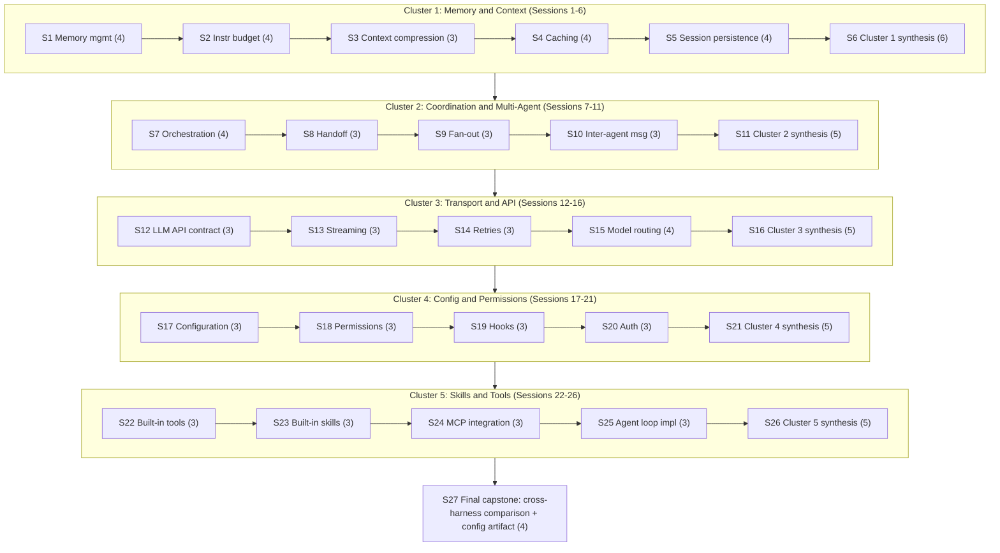
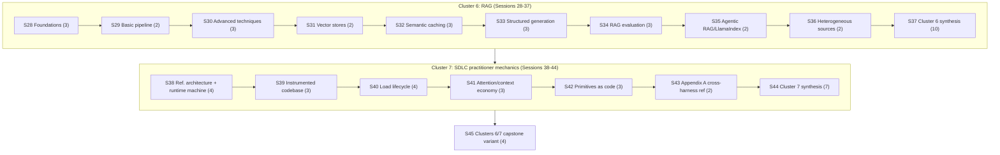

# Session breakdown (agenda only): Gnostic -> Demiurge

**What this file is.** A pacing layer on top of
[knowledge-path-curriculum.md](knowledge-path-curriculum.md)'s
"Transition 2: Gnostic -> Demiurge" section -- the 21-page
core-mechanics band, already grouped by that page into five thematic
clusters (Memory & Context, Coordination & Multi-Agent, Transport &
API, Config & Permissions, Skills & Tools). That page's learning
objectives, per-module key concepts, comprehension checks, and
exercises answer "what has to be taught." This file answers a
different, added question: "how do you chunk that same material into
discrete, schedulable teaching sessions, sized so no single sitting is
overloaded and no sitting is so thin it isn't worth convening" -- the
same question the sibling file
[slumberer-to-gnostic-sessions.md](slumberer-to-gnostic-sessions.md)
answered for Transition 1, scaled to a band roughly ten times the size
(21 modules across five clusters, against Transition 1's two modules).

**Why this lives here, not in the wiki-book.** `references/harnesses/`
is the general-purpose, cross-agent wiki-book -- `airchon-mentor` reads
it conversationally, `airchon-author` is its only writer, and its
content (harness-internals research, the tier rubric, the curriculum
scaffold) serves any reader. Session pacing for actually *running* a
Gnostic->Demiurge course is different in kind: it is scoped to one
specific agent's own domain (`airchon-teacher`'s proficiency-tier
mission) rather than general reference material. Written directly here,
alongside its Transition-1 sibling, rather than ever having lived
inside `knowledge-path-curriculum.md` first -- see that page's own
pointer paragraph under "Transition 2" and `CHANGELOG.md` for the
provenance of this scoping decision. As of 2026-08-18, `airchon-teacher`
directly consumes this file the same way it now consumes its
Transition-1 sibling -- see that file's own note on this (and
`CHANGELOG.md`'s 2026-08-18 entry) for the shared rationale, not
repeated here. The 21 module-content sessions below
(Sessions 1-5, 7-10, 12-15, 17-20, 22-25) name no exercise of their
own -- Course-Delivery Flow pulls each one's practical exercise live
from its corresponding module's own Exercise field in
`knowledge-path-curriculum.md` instead of duplicating that text here;
only the five cluster-synthesis sessions and the final capstone keep
their own named exercise below, unchanged.

Like the rest of `knowledge-path-curriculum.md`'s pedagogical
scaffolding (comprehension checks, exercises, capstone), this session
breakdown is original pedagogical design, not a researched claim about
how anyone actually learns. Every item named in each session's agenda
below is inherited by reference from `knowledge-path-curriculum.md`'s
own Module sections for this transition (its "Key concepts,"
"Comprehension check," and "Exercise" fields) or from its own Capstone
section -- nothing here is a new concept not already scoped there; a
session's job is only to say *which* items get discussed together and
in what grouping, not to re-explain them.

**Why 27 sessions, not fewer or more.** The band's 21 modules carry, in
total, 69 discrete key-concept items when each module's own "Key
concepts" field is broken into its constituent teaching points (the
same granularity `slumberer-to-gnostic-sessions.md` used for its two
modules' six and four items) -- ranging module-by-module from 3 items
(context-compression.md, fan-out.md, handoff-mechanism.md,
inter-agent-messaging.md, and most of Clusters 3-5's modules) to 4
(memory-management.md, instruction-context-budget.md, caching.md,
session-persistence.md, orchestration.md, model-routing-and-selection.md).
Three session-count choices were rejected before settling on 27:

- **One session per cluster (5 sessions total)** would force 12-19
  key-concept items -- spanning four or five modules, each already
  requiring per-harness (Claude Code/Copilot CLI/OpenCode) concrete
  detail -- into a single sitting. That is two to four times the
  4-6-item ceiling the Transition-1 breakdown established as the point
  past which a sitting stops being absorbable, and it collapses first
  exposure to several genuinely distinct mechanisms (e.g. caching's
  server-side prefix reuse and session-persistence's process-restart
  durability) into the same block, exactly the short-circuit risk that
  breakdown's own rationale warned against.
- **One session per module with no synthesis sessions at all (21
  sessions)** would teach every module's key concepts but leave the
  comprehension-check-and-exercise practice this band's own five
  clusters group naturally around with nowhere to happen -- either
  skipped, or crammed into one end-of-transition synthesis sitting
  the way Transition 1 used a single Session 3. At ten times
  Transition 1's material, one such sitting would itself become the
  same kind of overloaded session the cluster-per-session option
  above was rejected for (21 comprehension-check questions plus
  exercise selection in one block).
- **Splitting any individual module's already-short 3-4-item
  key-concepts list across two sessions** would produce sittings of
  one or two items each -- precisely the "so thin it's pointless"
  failure mode `slumberer-to-gnostic-sessions.md` names as the reason
  it rejected four-or-more sessions for its own, much smaller band.

27 is the smallest count that avoids all three failure modes at once:
**21 module-content sessions** (Sessions 1-5, 7-10, 12-15, 17-20,
22-25 -- one per module, agenda drawn directly and only from that
module's own "Key concepts" field, sized 3-4 items exactly as that
field's own granularity dictates, no combining and no further
splitting), **5 cluster-synthesis sessions** (Sessions 6, 11, 16, 21,
26 -- one per cluster, immediately after that cluster's own module
sessions, each sized 5-6 items: one item per module in the cluster,
each item being that module's own "Comprehension check" question
walked cold, plus one item selecting a single representative
"Exercise" from that cluster's modules to actually run, rather than
attempting all of that cluster's exercises in one sitting), and **1
final capstone session** (Session 27, sized 4 items, breaking the
transition's own single "cross-harness mechanism comparison + operator
configuration" capstone task into its concrete deliverable steps).
This keeps every session in the same 3-6 item range Transition 1
established as the sensible floor and ceiling, while letting the
course's own shape mirror the five clusters `knowledge-path-curriculum.md`
already organizes the material into, rather than inventing a
different grouping.

---

## Cluster 1: Memory & Context (Sessions 1-6)

**Session 1 -- Memory management.** Items to cover, in order:
1. Instruction-file hierarchies and load order (e.g. `CLAUDE.md`).
2. Claude Code's auto-memory mechanism vs. Copilot CLI's server-side
   Copilot Memory.
3. Injection timing: what "eagerly loaded" vs. "reloaded on edit"
   means in practice.
4. Compaction-survival: what memory content does or does not survive a
   compaction event.

**Session 2 -- Instruction context budget.** Items to cover, in order:
1. Why `@`-style imports don't reduce eager-load cost.
2. Path-scoped rules (`paths:`) vs. `applyTo:` as two harnesses'
   answers to the same scoping problem.
3. Skills as the invoke-only (lazy-load) tier, contrasted with the
   eager-load tier.
4. Levers each harness offers for trimming what loads eagerly, and how
   to measure what actually loaded.

**Session 3 -- Context compression.** Items to cover, in order:
1. Mid-run compression as distinct from the eager-load budget
   (Session 2) and from compaction-survival (Session 1).
2. Claude Code's evict-then-summarize two-phase mechanism and its
   auto-compact default trigger.
3. OpenCode's source-verified `prune()`/`process()` pipeline.

**Session 4 -- Caching.** Items to cover, in order:
1. Server-side prefix reuse as distinct from compression (shrinking,
   Session 3) and memory loading (Session 1).
2. Cache scope and TTL-by-auth-path.
3. Subagent/fork cache-inheritance behavior.
4. One action that invalidates a cache and one that preserves it, and
   why editing an early system-prompt section costs more than
   appending a new user message.

**Session 5 -- Session & transcript persistence.** Items to cover, in
order:
1. Single-session durability across process restarts, as distinct
   from mid-run compaction-survival (Session 1) and agent-to-agent
   handoff (Cluster 2).
2. What a `--resume`/`--continue`-style command actually restores vs.
   leaves behind.
3. Fork/branch semantics vs. an in-place undo mechanism.
4. The literal file path or storage backend a session transcript is
   written to, per harness.

**Session 6 -- Cluster 1 synthesis.** No new material -- every item
here is integration of Sessions 1-5, not a new concept:
1. Walk memory-management.md's comprehension check: the practical
   difference between "eagerly loaded" and "reloaded on edit" memory
   content, and which the source page documents as mid-session-edit
   -aware.
2. Walk instruction-context-budget.md's comprehension check: one lever
   per harness for trimming eager-load cost, and why moving content
   into a skill changes its loading cost.
3. Walk context-compression.md's comprehension check: the trigger
   proportion of context capacity per harness, and what "evict-then
   -summarize" means as opposed to "summarize everything."
4. Walk caching.md's comprehension check: one cache-invalidating and
   one cache-preserving action, and the early-edit-vs-append cost
   asymmetry.
5. Walk session-persistence.md's comprehension check: the literal
   storage path or backend for one harness, and one thing a resume
   command does not restore.
6. Run one representative exercise from this cluster (recommended:
   session-persistence.md's -- kill a real harness process mid-session
   and use its documented resume mechanism to recover, comparing what
   came back against what the module predicted).

---

## Cluster 2: Coordination & Multi-Agent (Sessions 7-11)

**Session 7 -- Orchestration.** Items to cover, in order:
1. The general orchestrator/manager-agent concept.
2. Claude Code's turn-by-turn model vs. its script-held Dynamic
   -workflows plan (`agent()`/`pipeline()`).
3. Copilot CLI's `/fleet` orchestrator agent.
4. OpenCode's primary-agent/subagent taxonomy.

**Session 8 -- Handoff mechanism.** Items to cover, in order:
1. Agent-to-agent context transfer specifically, as distinct from
   compaction-survival (Cluster 1, Session 1).
2. Claude Code's fresh-context subagents vs. its named, resumeable
   ones.
3. OpenCode's `Task` tool (`session.create(parentID)`, `task_id`
   resume).

**Session 9 -- Fan-out (subagent dispatch).** Items to cover, in
order:
1. Launch mechanics as distinct from handoff (what crosses, Session 8)
   and orchestration (who holds the plan, Session 7).
2. Claude Code's three distinct fan-out layers and their concurrency
   /depth caps.
3. OpenCode's `FiberSet`-based concurrent dispatch.

**Session 10 -- Inter-agent messaging.** Items to cover, in order:
1. The wire format/transport layer once agents are already talking.
2. Claude Code's `SendMessage` tool and its file-based mailbox.
3. OpenCode's finding of no dedicated inter-agent message type at all
   (ordinary message rows over the same SSE bus).

**Session 11 -- Cluster 2 synthesis.** No new material -- every item
here is integration of Sessions 7-10, not a new concept:
1. Walk orchestration.md's comprehension check: the difference between
   a "turn-by-turn" and a "script-held plan" orchestration model, and
   which harness/feature pair instantiates each.
2. Walk handoff-mechanism.md's comprehension check: whether a Claude
   Code subagent starts with a fresh or inherited context, and what
   mechanism resumes it later.
3. Walk fan-out.md's comprehension check: the three fan-out layers for
   Claude Code, and which one has no documented hard concurrency cap.
4. Walk inter-agent-messaging.md's comprehension check: which harness
   has a dedicated addressed mailbox and which treats agent-to-agent
   communication as indistinguishable from any other session event.
5. Run one representative exercise from this cluster (recommended:
   fan-out.md's -- trigger a real parallel-subagent dispatch and count
   how many ran concurrently against the documented cap).

---

## Cluster 3: Transport & API (Sessions 12-16)

**Session 12 -- The LLM API contract.** Items to cover, in order:
1. One wire protocol's tool-call representation: `tool_use`/`tool_result`
   content blocks, a `stop_reason` enumeration, and an SSE event
   sequence.
2. A second wire protocol's tool-call representation: `tool_calls`/
   `call_id` and a `finish_reason` enumeration.
3. OpenCode's source-verified `Protocol`/`Endpoint`/`Auth`/`Framing`
   route decomposition unifying both.

**Session 13 -- Streaming & incremental rendering.** Items to cover,
in order:
1. The client/UI-side layer one level above the wire-level SSE
   contract (Session 12).
2. Buffering/reassembly/pacing discipline as a distinct concern from
   wire-level parsing.
3. Claude Code's delta-coalescing history as a concrete performance
   -engineering example.

**Session 14 -- Retries.** Items to cover, in order:
1. Failure recovery on a single outbound request, as distinct from
   context-overflow handling (Cluster 1) and cache-prefix reuse
   (Cluster 1).
2. Claude Code's `CLAUDE_CODE_MAX_RETRIES` and its retry-vs-not
   category list.
3. OpenCode's two-layer architecture: a bounded transport retry
   wrapped by an effectively uncapped whole-turn retry.

**Session 15 -- Model routing / selection.** Items to cover, in order:
1. Which underlying model answers a given step, as a question distinct
   from failure recovery (Session 14) or tool dispatch.
2. Claude Code's four-tier session-model precedence stack.
3. Copilot CLI's Auto model selection two-system router.
4. OpenCode's `defaultModel()` startup-resolution algorithm.

**Session 16 -- Cluster 3 synthesis.** No new material -- every item
here is integration of Sessions 12-15, not a new concept:
1. Walk llm-api-contract.md's comprehension check: the SSE event
   sequence from `message_start` to `message_stop`, and which event
   carries an in-progress tool-call argument delta.
2. Walk streaming-and-incremental-rendering.md's comprehension check:
   why "reassembly at the JSON-parsing level" is distinguished from
   "buffering and pacing," and whether any covered harness parses
   genuinely incomplete tool-call JSON mid-stream.
3. Walk retries.md's comprehension check: the practical difference
   between OpenCode's bounded transport retry and its wrapping
   whole-turn retry, and which is effectively uncapped.
4. Walk model-routing-and-selection.md's comprehension check: one
   harness's model-selection precedence order, highest to lowest, with
   one config key or flag named at each level.
5. Run one representative exercise from this cluster (recommended:
   retries.md's -- deliberately induce a retryable failure and observe
   how many attempts a real harness makes and at what backoff
   interval).

---

## Cluster 4: Config & Permissions (Sessions 17-21)

**Session 17 -- Configuration.** Items to cover, in order:
1. Claude Code's four-scope `settings.json` hierarchy (Managed/User
   /Project/Local).
2. Copilot CLI's `~/.copilot` layout and precedence chain.
3. OpenCode's `mergeConfigConcatArrays()` eight-source merge order.

**Session 18 -- Permissions & sandboxing architecture.** Items to
cover, in order:
1. The enforcement architecture underneath the permission-rule schema
   (Session 17's config).
2. Claude Code's OS-level sandboxed-Bash two-layer (filesystem
   /network) design and its named escape hatches.
3. OpenCode's finding that it ships no OS-level sandbox at all.

**Session 19 -- Hooks and lifecycle extensibility.** Items to cover,
in order:
1. The mechanism for user-side code to sit directly inside the loop's
   control flow.
2. Claude Code's ~30-event catalogue and the exit-code-2-only-blocks
   rule.
3. OpenCode's two-surface plugin model (a generic `event` bus vs. a
   typed `Hooks` interface).

**Session 20 -- Auth & usage accounting.** Items to cover, in order:
1. API-key/OAuth handling and precedence.
2. Token/cost tracking surfaces (e.g. `/usage`).
3. Three genuinely distinct budget-enforcement mechanisms at three
   different layers (SDK-level, workflow-level, org-level).

**Session 21 -- Cluster 4 synthesis.** No new material -- every item
here is integration of Sessions 17-20, not a new concept:
1. Walk configuration.md's comprehension check: one harness's full
   config precedence chain, highest to lowest, and one documented
   exception to strict precedence.
2. Walk permissions-and-sandboxing.md's comprehension check: Claude
   Code's two independent sandbox layers for its Bash tool, and one
   documented escape hatch that bypasses one of them.
3. Walk hooks-lifecycle-extensibility.md's comprehension check: which
   exit code blocks the action a Claude Code hook is attached to, and
   what other non-zero exit codes do instead.
4. Walk auth-and-usage-accounting.md's comprehension check: Claude
   Code's full authentication precedence stack, and which of the three
   budget-enforcement layers counts subagent spend toward a shared cap.
5. Run one representative exercise from this cluster (recommended:
   permissions-and-sandboxing.md's -- configure the strictest
   permission mode a harness offers, attempt an action you expect to
   be denied, and document the exact denial message and which layer
   produced it).

---

## Cluster 5: Skills & Tools (Sessions 22-26)

**Session 22 -- Built-in tools.** Items to cover, in order:
1. The full tool inventory per harness (Claude Code's `tools-reference`
   table, Copilot CLI's permission-"kind" vocabulary, OpenCode's
   `allow`/`ask`/`deny` model).
2. What "permission-required" means as a column in Claude Code's own
   tools-reference table.
3. The `Edit` tool's three-gate check as a named concrete mechanism.

**Session 23 -- Built-in skills.** Items to cover, in order:
1. What ships as a skill by default vs. user-authored content.
2. Claude Code's bundled-skill set and its `disableBundledSkills`
   /`skillOverrides` visibility controls.
3. OpenCode's finding of no confirmed bundled skills at all.

**Session 24 -- MCP integration.** Items to cover, in order:
1. Discovery/registration/invocation of MCP servers.
2. Config formats and transports across harnesses.
3. Tool-calling semantics once a server is registered.

**Session 25 -- Agent loop implementations.** Items to cover, in
order:
1. The harness-specific companion to the general agent-loop page
   (agent-loop.md, covered in Transition 1).
2. Claude Code's Agent SDK-documented loop: turns, `max_turns`
   /`max_budget_usd`, compaction, parallel tool execution.
3. OpenCode's source-verified loop
   (`packages/core/src/session/runner/max-steps.ts`).

**Session 26 -- Cluster 5 synthesis.** No new material -- every item
here is integration of Sessions 22-25, not a new concept:
1. Walk built-in-tools.md's comprehension check: what "permission
   -required" means as a table column, and one tool that requires it
   and one that doesn't.
2. Walk built-in-skills.md's comprehension check: two of Claude Code's
   bundled skills, and what `disableBundledSkills` controls.
3. Walk mcp-integration.md's comprehension check: one config file
   format used to register an MCP server, and the transport it uses to
   talk to that server.
4. Walk agent-loop-implementations.md's comprehension check: what
   `max_turns` bounds in Claude Code's documented Agent SDK loop, and
   how that differs from what `max_budget_usd` bounds.
5. Run one representative exercise from this cluster (recommended:
   mcp-integration.md's -- register a real MCP server with one harness
   and verify its tools appear and are invocable in a live session).

---

## Session 27 -- Final capstone: cross-harness mechanism comparison + operator configuration

No new material -- every item here is execution of
`knowledge-path-curriculum.md`'s own Transition-2 capstone task,
broken into its concrete deliverable steps:
1. Choose one of the five clusters above and one mechanism within it
   (e.g. "how context gets compressed mid-run," or "how a permission
   decision gets enforced").
2. Produce a comparison table with one row per harness (Claude Code,
   Copilot CLI, OpenCode) naming the specific config key/file path
   /tool name/limit each uses for that mechanism, with a citation to
   the source page for each cell.
3. Produce a real, working configuration artifact for at least one of
   those harnesses (a `settings.json`, a hooks config, a permission
   rule set, etc.) that deliberately exercises the documented limit or
   gate, run against a live session, with its output captured.
4. Self-check (or peer-review) both artifacts against the capstone's
   own grading criteria: every table cell traceable to the cited page
   rather than invented, and the configuration artifact actually doing
   what it claims when run.

---

## Extension (2026-08-24): Clusters 6-7 session additions

**Why this section exists, appended rather than folded in above.**
`knowledge-path-curriculum.md`'s 2026-08-24 revision note added two
clusters to this transition after the 27-session breakdown above was
already written: Cluster 6 (Retrieval-Augmented Generation, sourced from
`references/rag/`) and Cluster 7 (Agentic SDLC practitioner mechanics,
sourced from `references/sdlc/`). That page's own note under "Session
breakdown (agenda only), Gnostic -> Demiurge" flags this explicitly: the
27-session count "was set before Clusters 6 and 7 below existed and
covers only the original five-cluster/21-module band." Per this file's
operating rule -- preserve existing session numbering, never renumber or
rewrite a session once taught from -- the fix is additive: Sessions 1-27
above are untouched, and the two new clusters get their own sessions
numbered 28 onward, continuing the sequence rather than being spliced in
before the existing Session 27 capstone. A course already in progress
against the original 27 sessions is unaffected; a course starting fresh
now runs all 45 sessions straight through, with the original Session 27
capstone still sitting where it always did (per-cluster, Clusters 1-5
only) and the two new clusters' own capstone variant arriving as the new
Session 45 below.

**Grounding-status reminder, restated per `knowledge-path-curriculum.md`'s
own instruction not to drop it when teaching from this page.** Every
item in Cluster 6's sessions below is sourced from `references/rag/`
pages, which attribute their own claims to the HuggingFace Cookbook
notebooks and Lewis et al. (2020). Every item in Cluster 7's sessions
below is sourced from `references/sdlc/` pages, attributed "the handbook
says" to the Agentic SDLC Handbook. Neither carries this wiki-book's own
VERIFIED/BEST-CURRENT-UNDERSTANDING tagging -- say so explicitly when
teaching either cluster, the same distinction
`knowledge-path-curriculum.md`'s Cluster 6 and Cluster 7 overviews each
restate inline.

**Why 18 more sessions, not fewer or more.** Cluster 6 carries 9 modules
(`references/rag/foundations.md` through `heterogeneous-data-sources.md`)
and Cluster 7 carries 6 (`04-the-reference-architecture.md`/`11-the
-runtime-machine.md` treated as one paired module, through `appendix-a
-cross-harness-reference.md`), for 15 modules total -- fewer than
Transition 2's original 21, but each carries a genuinely hands-on,
build-something exercise (Cluster 6 especially: reproduce a pipeline,
add a reranker, swap a vector store, add a cache, evaluate it) rather
than the original band's more observational "read a config key, predict
its behavior, confirm it" exercise shape. The same three session-count
failure modes the original 27-session rationale above rejected apply
again here: one session per cluster (2 sessions) would force 6-19
key-concept items covering nine build-on-each-other pipeline stages into
one sitting; one session per module with no synthesis (15 sessions)
would leave nowhere for the comprehension-check-and-exercise-selection
practice the other five clusters group into their own synthesis session;
splitting any one module's already-short 2-4-item key-concepts list
across two sessions reproduces the "so thin it's pointless" failure this
file's opening rationale already named. **15 module-content sessions
-- one per module, sized to that module's own key-concepts granularity
(2-4 items, matching Cluster 6's own Vector-store-integrations and
Agentic-RAG-with-LlamaIndex modules being the thinnest at 2 apiece, and
Cluster 7's Load-lifecycle module being the richest at 4)**, plus **2
cluster-synthesis sessions** (one per cluster, following that cluster's
module sessions, walking every module's comprehension check plus
selecting one representative exercise to actually run), plus **1
capstone-variant session** (covering `knowledge-path-curriculum.md`'s
own "Cluster 6/7 variant" of the Transition-2 capstone, since Clusters 6
and 7 have no second/third harness to cross-compare against the way
Clusters 1-5 do) is the smallest count avoiding all three failure modes,
continuing the numbering as Sessions 28-45.

---

## Cluster 6: Retrieval-Augmented Generation (Sessions 28-37)

**Session 28 -- RAG foundations.** Items to cover, in order:
1. Lewis et al.'s parametric/non-parametric memory split.
2. RAG-Sequence vs. RAG-Token.
3. The HuggingFace Agents Course's agentic-RAG reframing of retrieval as
   one callable tool among several rather than a fixed pipeline stage.

**Session 29 -- The basic RAG pipeline.** Items to cover, in order:
1. The introductory LangChain + Zephyr + FAISS pipeline over GitHub
   issues.
2. The `GitHubIssuesLoader` -> `RecursiveCharacterTextSplitter` -> embed
   -> retrieve -> prompt -> generate baseline shape every later module
   varies.

**Session 30 -- Advanced RAG techniques.** Items to cover, in order:
1. The character-vs-token chunking trap: a character-based `chunk_size`
   silently disagreeing with a tokenizer's count.
2. PaCMAP embedding-space visualization.
3. ColBERTv2 cross-encoder reranking via RAGatouille.

**Session 31 -- Vector store integrations.** Items to cover, in order:
1. Three notebooks swapping the retriever half of the basic pipeline
   onto Milvus, Elasticsearch, and MongoDB Atlas.
2. What stays constant (the retrieve-then-generate shape) while the
   store underneath changes.

**Session 32 -- Semantic caching for RAG.** Items to cover, in order:
1. Cache placement before retrieval, not before generation.
2. FAISS `IndexFlatL2` with a Euclidean distance threshold.
3. FIFO eviction.

**Session 33 -- Structured generation for RAG.** Items to cover, in
order:
1. Source-snippet highlighting as a provenance mechanism.
2. The naive JSON-prompting approach and where it breaks.
3. Outlines' logit-biasing constrained-decoding mechanism as the fix.

**Session 34 -- RAG evaluation.** Items to cover, in order:
1. Synthetic QA-dataset generation from the knowledge base itself.
2. Groundedness/relevance/standalone-ness critique agents as a quality
   filter.
3. An LLM-as-judge (GPT-4-style) scoring rubric.

**Session 35 -- Agentic RAG with LlamaIndex.** Items to cover, in
order:
1. LlamaIndex's Loading/Indexing/Querying three-phase framing as an
   alternative vocabulary to LangChain's load/split/embed/index/retrieve
   /prompt/generate.
2. A fully local Ollama + Llama 2 + `BAAI/bge-base-en-v1.5` stack chosen
   specifically to avoid an OpenAI-by-default dependency.

**Session 36 -- RAG over heterogeneous data sources.** Items to cover,
in order:
1. Unstructured's partition-then-chunk pipeline for mixed document
   formats (PDF, PPTX, EPUB, HTML) in one corpus.
2. Jina Reranker v2 scoring whole SQL table schemas directly, with no
   vector index at all.

**Session 37 -- Cluster 6 synthesis.** No new material -- every item
here is integration of Sessions 28-36, not a new concept:
1. Walk foundations.md's comprehension check: the two problems Lewis et
   al.'s abstract names as compounding a language model's limited
   ability to "access and precisely manipulate knowledge," and how
   non-parametric memory addresses each.
2. Walk basic-rag-pipeline.md's comprehension check: why the notebook's
   worked example fails against the base model with no retrieved
   context, and what retrieval specifically adds back.
3. Walk advanced-rag-techniques.md's comprehension check: why a
   character-based `chunk_size` risks overflowing an embedding model's
   token budget, and the fix this page documents.
4. Walk vector-store-integrations.md's comprehension check: one
   production vector store this page documents and the embedding model
   its notebook pairs it with.
5. Walk semantic-caching.md's comprehension check: why the cache sits
   before retrieval rather than before the final LLM call.
6. Walk structured-generation-for-rag.md's comprehension check: the
   provenance problem (named back in foundations.md) this page's
   source-highlighting feature concretely solves.
7. Walk rag-evaluation.md's comprehension check: the three
   critique-agent scores a synthetic QA pair is filtered on, and what
   happens to a pair that fails any one of them.
8. Walk agentic-rag-with-llamaindex.md's comprehension check: LlamaIndex's
   "OpenAI-by-default trap" and the concrete substitution the notebook
   makes to avoid it.
9. Walk heterogeneous-data-sources.md's comprehension check: why the
   SQL-backed notebook skips the usual chunk-and-embed retrieval step
   entirely, and what it uses instead.
10. Run one representative exercise from this cluster (recommended:
    rag-evaluation.md's -- generate five synthetic QA pairs from your
    own pipeline's knowledge base, critique each on this page's three
    axes, and run the surviving pairs through an LLM-as-judge comparison
    against your pipeline's real answers; this exercise is the natural
    capstone of the cluster's own build-up since it requires the
    pipeline built and varied across Sessions 28-36 to already exist).

---

## Cluster 7: Agentic SDLC practitioner mechanics (Sessions 38-44)

**Session 38 -- The reference architecture and the runtime machine.**
Items to cover, in order:
1. The Human/Agent/Platform three-layer participant model (Ch. 4).
2. The four-part agentic runtime machine: Model/Harness/Agent Source
   Code/Client (Ch. 11).
3. "The harness is the compiler" framing (Ch. 11).
4. Cross-harness file-naming incompatibility as a direct consequence of
   the Agent Source Code layer having no shared standard.

**Session 39 -- The instrumented codebase.** Items to cover, in order:
1. The seven primitive types this page's own table covers.
2. The five load modes: eager preload, lazy on-demand, dispatcher
   -mediated, user-invoked, event-driven.
3. The instrumentation audit as a practice for converting tacit team
   knowledge into structured, harness-loadable files.

**Session 40 -- The load lifecycle.** Items to cover, in order:
1. The four-phase Resolve -> Materialize -> Bind -> Activate pipeline.
2. The three binding modes.
3. The phantom-dependency and bundle-leakage anti-patterns.
4. The governing claim that "a skill... can fail to bind -- and the
   harness will not tell you why."

**Session 41 -- Attention and context economy.** Items to cover, in
order:
1. Window (hard token ceiling) vs. attention (a smaller, position
   -sensitive effective-focus cache).
2. Context rot and attention starvation as two distinct silent-failure
   modes.
3. The U-shaped attention curve, citing Liu et al.'s "Lost in the
   Middle" and Anthropic's needle-in-a-haystack evaluations.

**Session 42 -- Primitives as code.** Items to cover, in order:
1. The package model: one skill = one Module/Facade, a bundle = a
   Composite, a dependency edge = a Package Reference.
2. The lockfile pinning a resolved dependency graph by content hash.
3. Overrides and versioning as the mechanism keeping two teams' shared
   content from drifting apart.

**Session 43 -- Appendix A, the cross-harness reference.** Items to
cover, in order:
1. The ten APM primitive concepts this page's master table covers
   (project-wide rules, scope-attached rules, personas, skills, hooks,
   MCP config, session compaction, and others).
2. The five harnesses (Copilot, Claude Code, Cursor, Codex CLI,
   OpenCode) that table maps each concept's concrete file/config
   convention across.

**Session 44 -- Cluster 7 synthesis.** No new material -- every item
here is integration of Sessions 38-43, not a new concept:
1. Walk the reference-architecture-and-runtime-machine module's
   comprehension check: in the "harness is the compiler" framing, what
   plays the role of source code, and what plays the role of the
   compiled artifact.
2. Walk 12-the-instrumented-codebase.md's comprehension check: the five
   load modes, and one primitive type whose load mode is "eager
   preload, scoped by `applyTo` glob."
3. Walk 14-the-load-lifecycle.md's comprehension check: given a skill
   with correct frontmatter, in the right directory, with a sharp
   description, that fails to activate with no error message -- which
   phase is the most likely point of failure, and why the fix rarely
   lives in the skill file itself.
4. Walk 15-attention-and-context-economy.md's comprehension check: the
   difference between "an instruction the model has read" and "an
   instruction the model has seen," and which one attention starvation
   describes.
5. Walk 21-primitives-as-code.md's comprehension check: the structural
   problem behind two skills disagreeing about a shared review
   checklist, and how treating the checklist as a package fixes it.
6. Walk appendix-a-cross-harness-reference.md's comprehension check:
   one row of its master table and the concrete file/path convention it
   gives for two different harnesses.
7. Run one representative exercise from this cluster (recommended:
   21-primitives-as-code.md's -- take two primitives you have already
   written in this cluster's earlier exercises that share some content,
   and refactor that shared content into a single declared dependency
   both primitives reference, rather than each embedding its own copy;
   this exercise is the natural capstone of the cluster's own build-up
   since it requires primitives already written in Sessions 39-40 to
   already exist).

---

## Session 45 -- Clusters 6/7 capstone variant

No new material -- every item here is execution of
`knowledge-path-curriculum.md`'s own "Cluster 6/7 variant" of the
Transition-2 capstone, broken into its concrete deliverable steps. This
variant exists because Clusters 6 and 7 have no second or third harness
to cross-compare against the way the original Session 27 capstone
(Clusters 1-5) does -- RAG-the-technique and the SDLC handbook's
instrumented-codebase discipline are each single-source material, not
three-implementations-of-one-mechanism:
1. Choose Cluster 6 or Cluster 7, and select one working artifact you
   already produced in one of that cluster's own exercises above (a
   real pipeline component for Cluster 6, a real primitive/lockfile
   pairing for Cluster 7) -- one you actually ran and can show the
   output of.
2. Produce a short comparison note, with citations, of how that
   cluster's mechanism differs from the closest analogous mechanism in
   Clusters 1-5 (e.g. Cluster 6's semantic-cache placement before
   retrieval vs. `caching.md`'s server-side prompt-prefix reuse; Cluster
   7's four-phase load lifecycle vs. `instruction-context-budget.md`'s
   eager-load budget).
3. Explicitly flag, in the note's own text, that the chosen cluster's
   cited findings carry Cluster 6's or Cluster 7's own single-source
   grounding status ("the source says" for RAG, "the handbook says" for
   SDLC) rather than this wiki-book's own VERIFIED/BEST-CURRENT
   -UNDERSTANDING tagging -- omitting that distinction is a capstone
   failure in its own right, not a stylistic nicety, per this book's own
   grounding discipline.
4. Self-check (or peer-review) both artifacts against the capstone
   variant's own grading criteria: the artifact actually runs/works as
   claimed, and the comparison note keeps the two epistemic registers
   (this book's VERIFIED tagging vs. the chosen cluster's single-source
   attribution) visibly distinct rather than blurred together.

---

## Extension (2026-09-03): Clusters 9-10 session additions

**Why this section exists, appended rather than folded in above.**
`knowledge-path-curriculum.md`'s own note under its "Session breakdown
(agenda only), Gnostic -> Demiurge" pointer paragraph has read, since
2026-08-24, that this file's session count "was set before Clusters 6,
7, 9, and 10 below existed and covers only the original
five-cluster/21-module band." That was accurate in full on 2026-08-24
itself -- Clusters 9 and 10 did not exist yet, and the "Extension
(2026-08-24)" section above closed the Clusters-6/7 half of the gap the
same day -- but the note has been stale on its Clusters-6/7 half ever
since that same 2026-08-24 extension shipped, and stale on its
Clusters-9/10 half from the moment those two clusters were later added
to the curriculum page. This section closes the remaining, real gap:
Cluster 9 (AI model classification, `references/models/`) and Cluster 10
(local/self-hosted inference engines, `references/inference-engines/`).
Per this file's operating rule -- preserve existing session numbering,
never renumber or rewrite a session once taught from -- the fix is again
additive: Sessions 1-45 above are untouched, and the two new clusters
get their own sessions numbered 46 onward, continuing the sequence
rather than being spliced in before the existing Session 45 capstone
variant. A course already in progress against the first 45 sessions is
unaffected; a course starting fresh now runs all 68 sessions straight
through.

**Grounding-status reminder, restated per `knowledge-path-curriculum.md`'s
own instruction not to drop it when teaching from this page.** Every
item in Cluster 9's sessions below is sourced from `references/models/`
pages, which attribute their own claims to the Hugging Face Hub
/`transformers`/Optimum documentation and Maxime Labonne's frankenMoE
blog post, applying that same-shaped VERIFIED/BEST-CURRENT-UNDERSTANDING
discipline internally but scoped to that named corpus, not to this
wiki-book's own `references/harnesses/` sources. Every item in Cluster
10's sessions below is sourced from `references/inference-engines/`
pages, which attribute their own claims to each named inference engine's
own documentation or repository (llama.cpp's, Ollama's, KTransformers')
the same way. Say so explicitly when teaching either cluster, the same
distinction `knowledge-path-curriculum.md`'s Cluster 9 and Cluster 10
overviews each restate inline.

**Why 23 more sessions, not fewer or more.** Cluster 9 carries 5 modules
(`model-terminology.md` through `quantization.md`) and Cluster 10
carries 14 (`model-file-formats.md` through `ktransformers.md`), for 19
modules total -- fewer than either original band, but Cluster 10 alone
is nearly as large as the original five-cluster/21-module band by module
count. The same three session-count failure modes rejected twice above
apply again here:

- **One session per cluster (2 sessions)** would force 28 (Cluster 9) or
  55 (Cluster 10) key-concept items -- five and fourteen modules
  respectively, each already requiring source-specific concrete detail
  -- into a single sitting apiece, many times over the 3-6-item ceiling
  established as the point past which a sitting stops being absorbable.
- **One session per module with no synthesis at all (19 sessions)**
  would teach every module's key concepts but leave the
  comprehension-check-and-exercise-selection practice this file's other
  clusters group into their own synthesis session with nowhere to
  happen.
- **Splitting any individual module's already-short 3-6-item
  key-concepts list across two sessions** would produce sittings of one
  or two items each, reproducing the "so thin it's pointless" failure
  this file's opening rationale already named.

**19 module-content sessions** -- one per module, sized to that module's
own key-concepts granularity (Cluster 9's own Task-and-pipeline
-classification and Parameter-count-and-scale modules being the thinnest
at 5 items apiece, and its Model-terminology, Mixture-of-Experts-and
-frankenMoE, and Quantization modules the richest at 6; Cluster 10's own
Batching-and-continuous-batching, CPU/GPU-heterogeneous-offloading, and
Multi-GPU-inference modules being the thinnest at 3 items apiece, and its
llama.cpp and Ollama modules the richest at 5), no combining and no
further splitting, plus **2 cluster-synthesis sessions** (one per
cluster, immediately after that cluster's own module sessions, walking
every module's own comprehension check plus selecting one representative
exercise to actually run -- Cluster 10's synthesis session necessarily
carries 15 items rather than the smaller clusters' 5-6-item norm,
continuing this file's own precedent, set by Session 37's 10-item
Cluster-6 synthesis, of scaling a synthesis session's size to its own
cluster's module count rather than capping every synthesis session at a
fixed ceiling), plus **2 capstone-variant sessions** -- one more than the
single Session 45 the prior extension needed, because
`knowledge-path-curriculum.md`'s revision adding Clusters 9 and 10 also
split what had been a single "Cluster 6/7 variant" into a three-way
"Cluster 6/7/9 variant" (Session 45 above already executes this variant
in full for whichever of Clusters 6 or 7 a learner chose when that
session was taught from, so Cluster 9 needs its own session extending
that same variant's scope rather than a rewrite of Session 45 itself,
per this file's hard rule against rewriting a taught session) plus a
wholly separate "Cluster 10 variant" the curriculum page explicitly does
not fold into the combined 6/7/9 shape and so cannot share a session
with it -- is the smallest count avoiding all three failure modes,
continuing the numbering as Sessions 46-68.

```mermaid
flowchart TB
    subgraph C9["Cluster 9: AI model classification (Sessions 46-52)"]
        U46["S46 Model terminology (6)"] --> U47["S47 Task/pipeline classification (5)"]
        U47 --> U48["S48 Parameter count and scale (5)"]
        U48 --> U49["S49 MoE and frankenMoE (6)"]
        U49 --> U50["S50 Quantization (6)"]
        U50 --> U51["S51 Cluster 9 synthesis (6)"]
        U51 --> U52["S52 Cluster 6/7/9 capstone contribution (4)"]
    end
    subgraph C10["Cluster 10: Local inference engines (Sessions 53-68)"]
        U53["S53 Model file formats (4)"] --> U54["S54 Memory-mapped loading (4)"]
        U54 --> U55["S55 Quantization at inference time (4)"]
        U55 --> U56["S56 KV cache/context window (4)"]
        U56 --> U57["S57 Sampling/decoding params (4)"]
        U57 --> U58["S58 Batching (3)"]
        U58 --> U59["S59 CPU/GPU offloading (3)"]
        U59 --> U60["S60 Multi-GPU inference (3)"]
        U60 --> U61["S61 Speculative decoding (4)"]
        U61 --> U62["S62 Server/API modes (4)"]
        U62 --> U63["S63 Model mgmt/distribution (4)"]
        U63 --> U64["S64 llama.cpp (5)"]
        U64 --> U65["S65 Ollama (5)"]
        U65 --> U66["S66 KTransformers (4)"]
        U66 --> U67["S67 Cluster 10 synthesis (15)"]
        U67 --> U68["S68 Cluster 10 capstone variant (4)"]
    end
    C9 --> C10
```

---

## Cluster 9: AI model classification (Sessions 46-52)

**Session 46 -- Model terminology.** Items to cover, in order:
1. The pretrained/fine-tuned/LLM distinction.
2. Encoder, decoder, and encoder-decoder (seq2seq) architectures.
3. Causal vs. masked language modeling.
4. Tokens, input IDs, and attention masks.
5. A model's backbone vs. its task-specific head.
6. Feature-extraction and multimodal terminology.

**Session 47 -- Task and pipeline classification.** Items to cover, in
order:
1. The Hub's task/pipeline-tag taxonomy across NLP/Vision/Audio
   /Multimodal/Tabular/RL categories.
2. `text-generation` as an agent's own reasoning loop.
3. `feature-extraction`/`sentence-similarity` for embeddings, RAG, and
   semantic routing/caching.
4. `summarization` for context compaction.
5. `text-classification`/`token-classification` for routing, guardrails,
   and entity extraction.

**Session 48 -- Parameter count and scale.** Items to cover, in order:
1. What a parameter is.
2. The `7B`/`13B`/`70B` naming convention.
3. The verified `~4*X GB` (float32)/`~2*X GB` (bfloat16/float16) VRAM
   rule of thumb.
4. The KV cache as a second, context-length-dependent memory cost
   distinct from weight VRAM (MQA/GQA as mitigations).
5. Small/mid-scale/frontier-hosted capability-tier tradeoffs.

**Session 49 -- Mixture of Experts and frankenMoE.** Items to cover, in
order:
1. Sparse MoE layers and the gate/router network.
2. `num_local_experts` vs. `num_experts_per_tok`.
3. The frankenMoE-vs-native-MoE training-methodology distinction.
4. MergeKit's three router-initialization methods (random, cheap_embed,
   hidden).
5. The memory-vs-speed-vs-knowledge-preservation tradeoffs.
6. The worked Beyonder-4x7B-v3 example.

**Session 50 -- Quantization.** Items to cover, in order:
1. The definition and motivation for quantization.
2. float16/bfloat16/int16/int8 formats.
3. The affine and symmetric int8 quantization schemes.
4. Per-tensor vs. per-channel granularity.
5. The three calibration approaches (dynamic PTQ, static PTQ, QAT).
6. The worked VRAM example (29 GB to 15 GB to 9.5 GB across bf16/int8
   /int4) and its accompanying inference-speed tradeoff.

**Session 51 -- Cluster 9 synthesis.** No new material -- every item
here is integration of Sessions 46-50, not a new concept:
1. Walk model-terminology.md's comprehension check: the difference
   between a model's backbone and a task-specific head, and why swapping
   a head for a new task does not require retraining the backbone from
   scratch.
2. Walk task-and-pipeline-classification.md's comprehension check: which
   Hub task tag you would reach for to build a semantic cache or a RAG
   retriever, and why that is a different task type than the one
   powering the agent's own reasoning loop.
3. Walk parameter-count-and-scale.md's comprehension check: roughly how
   much VRAM a 13B-parameter model needs at bfloat16 using this page's
   rule of thumb, and why a growing session context adds a second,
   separate memory cost on top of that number.
4. Walk mixture-of-experts-and-frankenmerging.md's comprehension check:
   what `num_experts_per_tok` actually bounds, and why a sparse MoE
   model's active-parameter count at inference time differs from its
   total parameter count.
5. Walk quantization.md's comprehension check: the practical difference
   between per-tensor and per-channel quantization granularity, and
   which one this page documents as generally preserving more accuracy
   at the same bit-width.
6. Run one representative exercise from this cluster (recommended:
   quantization.md's -- pick a real model you have access to, quantize
   it at two of the three precisions this page compares, and record the
   actual or computed memory and speed difference).

**Session 52 -- Cluster 9's contribution to the Cluster 6/7/9 capstone
variant.** No new material -- every item here is execution of
`knowledge-path-curriculum.md`'s "Cluster 6/7/9 variant" of the
Transition-2 capstone, scoped to Cluster 9's own contribution to that
now-three-way-combined variant. Session 45 above already executed this
variant's full two-artifact structure for whichever of Clusters 6 or 7 a
learner chose at the time that session was taught from, per this file's
own hard rule against rewriting a taught session -- this session extends
that same variant's scope to Cluster 9, the third cluster
`knowledge-path-curriculum.md`'s later revision folded into the combined
variant after Session 45 was already written:
1. Choose one working artifact you already produced in Cluster 9's own
   exercises above (a real classification worked through on an actual
   model's card or config) -- one you actually checked and can show the
   output of.
2. Produce a short comparison note, with citations, of how Cluster 9's
   mechanism (a model's parameter-count-driven VRAM cost) differs from
   the closest analogous mechanism in Clusters 1-5 (e.g.
   `context-compression.md`'s own context-length-driven memory
   pressure), per the curriculum page's own worked example of that
   comparison.
3. Explicitly flag, in the note's own text, that Cluster 9's cited
   findings carry its own single-source grounding status (attributed to
   the Hugging Face Hub/`transformers`/Optimum documentation and Maxime
   Labonne's frankenMoE blog post) rather than this wiki-book's own
   VERIFIED/BEST-CURRENT-UNDERSTANDING tagging -- the same discipline
   Session 45's own item 3 already applied to Clusters 6 and 7.
4. Self-check (or peer-review) this session's own artifact and note
   against the same grading criteria Session 45's item 4 names, applied
   to Cluster 9's material specifically: the artifact actually runs
   /works as claimed, and the note keeps the two epistemic registers
   (this book's VERIFIED tagging vs. Cluster 9's own single-source
   attribution) visibly distinct rather than blurred together.

---

## Cluster 10: Local/self-hosted inference engines (Sessions 53-68)

**Session 53 -- Model file formats for inference.** Items to cover, in
order:
1. Why a training-checkpoint format and an inference-serving format
   solve different problems.
2. GGUF's predecessors (GGML/GGMF/GGJT) and the architecture
   -identification failure they had.
3. GGUF's four-section layout (header, typed/namespaced metadata KV
   pairs, tensor infos, tensor data).
4. The per-tensor `ggml` type enumeration.

**Session 54 -- Memory-mapped model loading.** Items to cover, in order:
1. `mmap`-based loading trading a full-file copy for lazy, page-cache
   -backed loading.
2. GGUF's alignment requirement as the structural precondition that
   makes it possible.
3. The `auto`/`mmap`/`mlock`/`mmap+mlock`/`dio` load-mode surface.
4. The load-speed-vs-pageout-risk tradeoff each mode makes.

**Session 55 -- Quantization as an inference-engine-level concern.**
Items to cover, in order:
1. How an engine consumes, rather than produces, an already-quantized
   tensor (cross-linking Cluster 9's own quantization module, Session
   50).
2. Why dequantization happens inline, per weight block, at compute time
   rather than once at load time.
3. GGUF's mixed-per-tensor-precision consequence.
4. KV-cache quantization and offload placement as runtime knobs that
   compose with a fixed weight quantization.

**Session 56 -- The KV cache and context-window management.** Items to
cover, in order:
1. Why KV-cache cost scales with context length rather than model size.
2. Context-window sizing as an explicit, VRAM-aware setting.
3. The documented call-out that agentic workloads need a larger-than
   -default window.
4. KV-cache quantization as a precision axis independent of weight
   quantization.

**Session 57 -- Sampling and decoding parameters.** Items to cover, in
order:
1. The shared core parameter set (`temperature`, `top_k`, `top_p`,
   `repeat_penalty`/`repeat_last_n`, `seed`, `num_predict`, `stop`).
2. Grammar-constrained decoding (GBNF) as a token-masking mechanism
   distinct from reweighting.
3. Its automatic JSON-Schema-to-grammar conversion.
4. Why this mechanism, not the chat template alone, is what makes a
   `tools` array reliably yield parseable `tool_calls`.

**Session 58 -- Batching and continuous batching.** Items to cover, in
order:
1. Why memory-bandwidth-bound single-token decoding makes batching
   valuable.
2. The slot-based continuous-batching design (`--parallel`/`--batch-size`
   /`--ubatch-size`).
3. Why continuous batching, not a static batch, is what actually
   captures that benefit under real, staggered request arrival.

**Session 59 -- CPU/GPU/heterogeneous offloading, and expert
offloading.** Items to cover, in order:
1. Layer-granularity `--gpu-layers`/`--device` hybrid inference as the
   general-purpose default.
2. Why that granularity cannot avoid holding every MoE expert in memory
   at once (cross-linking Cluster 9's own MoE module, Session 49).
3. Arithmetic-intensity-guided offloading (the ~512-vs-~0.075 MLA-vs
   -expert figures) as the finer-than-layer strategy that makes a
   671B-parameter MoE model locally deployable at all.

**Session 60 -- Multi-GPU inference.** Items to cover, in order:
1. `--split-mode layer` (throughput-oriented, tolerant of slow
   interconnects) vs. `--split-mode tensor` (experimental, latency
   -oriented, needs a fast interconnect).
2. The `--tensor-split`/`--main-gpu` configuration surface.
3. How this composes with, rather than replaces, expert-placement
   strategy.

**Session 61 -- Speculative decoding.** Items to cover, in order:
1. The draft-then-verify-in-one-batch mechanism as a pure latency
   optimization with no output-distribution change.
2. The model-based (draft model, EAGLE-3, DFlash, DSpark) and
   pattern-based (n-gram family) drafter taxonomy.
3. Why payoff is entirely acceptance-rate-dependent.
4. The two agent-harness workload shapes that line up well with it
   (context-echoing generation; an already-resident small model
   repurposed as a draft model).

**Session 62 -- Server/API modes.** Items to cover, in order:
1. One-shot CLI invocation vs. a persistent server process.
2. What "OpenAI-compatible" concretely covers and where each engine's
   own documented compatibility gaps are.
3. Native implementation of the same endpoint family.
4. Why concurrency-aware serving (batching, Session 58), not the API
   shape alone, is what actually delivers the throughput a harness
   integration is really after.

**Session 63 -- Model management and distribution.** Items to cover, in
order:
1. Direct-file-path/Hugging-Face-reference model loading.
2. A name/manifest/Modelfile-build layer on top of the same GGUF
   ecosystem (`pull`/`create`/`show`/`rm`, Modelfile-as-Dockerfile
   -analogue).
3. A curated registry for a run-shortcut command.
4. Which of the documented responsibility splits best fits reproducible,
   inspectable per-persona model configuration.

**Session 64 -- llama.cpp.** Items to cover, in order:
1. Project goals and hardware-backend breadth (Apple Silicon, x86,
   RISC-V, CUDA/HIP/MUSA/Vulkan/SYCL and more).
2. The `llama cli`/`llama serve` binaries.
3. The K-quant/I-quant GGUF quantization-type naming families and the
   `Q4_K_M` default recommendation.
4. Ollama's own documented dependency on llama.cpp as its backend.
5. The convenience-vs-hardware-breadth tradeoff of choosing it directly.

**Session 65 -- Ollama.** Items to cover, in order:
1. The confirmed llama.cpp dependency, held alongside Ollama's newer,
   directly-`ggml`-based Go engine built for multimodal architectures.
2. The full Modelfile instruction set.
3. Documented GPU-vendor support and VRAM-based automatic scheduling.
4. The dual native-REST and OpenAI-compatible API surfaces.
5. First-party integrations with named coding-agent harnesses.

**Session 66 -- KTransformers.** Items to cover, in order:
1. What the project is today (`kt-kernel`/`sglang-kt` serving,
   LLaMA-Factory-integrated LoRA fine-tuning), held explicitly apart from
   its upstream repository's own documented YAML operator-injection
   mechanism (`match`/`replace` rules, `optimize_and_load_gguf`,
   `generate_device`/`prefill_device` placement).
2. Its own architecture-coupled precision/backend naming.
3. Its curated large-MoE model list up to DeepSeek R1's 671B parameters.
4. Why it is the answer for a harness builder specifically wanting a
   frontier-scale open-weight model running on local hardware.

**Session 67 -- Cluster 10 synthesis.** No new material -- every item
here is integration of Sessions 53-66, not a new concept:
1. Walk model-file-formats.md's comprehension check: what specific
   failure GGUF's predecessor formats had that GGUF's own metadata
   section fixes, and why that failure matters for a harness that treats
   "swap the local model" as a cheap operation.
2. Walk memory-mapped-model-loading.md's comprehension check: why
   mmap-based loading specifically requires GGUF's alignment guarantee to
   work correctly, and what risk `mlock` exists to close.
3. Walk quantization-at-inference-time.md's comprehension check: why
   "the model file is quantized" does not automatically mean "inference
   is faster," per this page's own account of when dequantization
   actually happens.
4. Walk kv-cache-and-context-window-management.md's comprehension check:
   why this page treats KV-cache size as a per-session cost distinct
   from the model's own weight VRAM cost, and what documented setting
   controls it directly.
5. Walk sampling-and-decoding-parameters.md's comprehension check: the
   mechanistic difference between a sampling parameter like `top_p` and
   a grammar constraint like GBNF, and why only the latter guarantees
   syntactically valid output.
6. Walk batching-and-continuous-batching.md's comprehension check: why a
   static batch fails to capture the same throughput benefit continuous
   batching does, under real, staggered request arrival.
7. Walk cpu-gpu-heterogeneous-offloading.md's comprehension check: why a
   plain layer-granularity offloading scheme cannot avoid loading every
   expert of an MoE model into memory at once, and what finer-grained
   strategy this page documents to get around that.
8. Walk multi-gpu-and-tensor-parallelism.md's comprehension check: which
   of this page's two split modes you would choose for a throughput
   -seeking multi-agent harness fanning out many concurrent requests, and
   which for a single latency-critical interactive loop, and why.
9. Walk speculative-decoding.md's comprehension check: why this page
   insists speculative decoding changes no output distribution, only
   latency, and what property of the verify step guarantees that.
10. Walk server-api-modes.md's comprehension check: why this page argues
    an OpenAI-compatible API surface alone is not what delivers
    throughput to a harness integration, and what mechanism from an
    earlier module actually does.
11. Walk model-management-and-distribution.md's comprehension check:
    what this page's Modelfile-as-Dockerfile analogy actually means, and
    what specifically a Modelfile lets you version that a bare model
    file path does not.
12. Walk llama-cpp.md's comprehension check: what choosing llama.cpp
    directly, rather than a wrapper built on top of it, trades away and
    what it gains, per this page's own account.
13. Walk ollama.md's comprehension check: why Ollama maintains two
    separate backends (llama.cpp and its own Go engine) rather than one,
    per this page's own account of what each is for.
14. Walk ktransformers.md's comprehension check: what problem
    KTransformers' operator-injection mechanism (`match`/`replace`
    rules) actually solves, and why a harness builder wanting a
    671B-parameter model running locally reaches for KTransformers rather
    than llama.cpp's own layer-granularity offloading.
15. Run one representative exercise from this cluster (recommended:
    cpu-gpu-heterogeneous-offloading.md's -- using a model too large for
    your available VRAM, configure layer-granularity offloading to split
    it across CPU and GPU, and record which layer count is the largest
    you can offload to GPU before running out of memory; this exercise is
    the natural capstone of the cluster's own build-up since it draws
    directly on the file-format, mmap, quantization, and KV-cache
    material from Sessions 53-56).

**Session 68 -- Cluster 10's own capstone variant.** No new material --
every item here is execution of `knowledge-path-curriculum.md`'s own
"Cluster 10 variant" of the Transition-2 capstone, broken into its
concrete deliverable steps. This variant is explicitly distinct from the
combined Cluster 6/7/9 variant Sessions 45 and 52 above execute, because
Cluster 10 has three real, named engines (llama.cpp, Ollama,
KTransformers) that genuinely can be compared, closer in shape to the
original Session 27 capstone (Clusters 1-5) than to Clusters 6/7/9's
single-source shape:
1. Choose shape (a) or shape (b) per `knowledge-path-curriculum.md`'s own
   "Cluster 10 variant" instructions, and state explicitly which you
   chose and why the cluster's own material did or did not support a
   three-engine tabulation for the mechanism you picked.
2. If shape (a): produce a comparison table with one row per engine
   (llama.cpp, Ollama, KTransformers) naming the specific flag
   /environment variable/config surface each uses for one mechanism (e.g.
   context-window sizing, or GPU/CPU placement), with citations, plus a
   real, working configuration for at least one engine that you actually
   ran and can show the output of. If shape (b): produce the same
   two-artifact structure Session 52 above used for Cluster 9 (a working
   artifact from one of Cluster 10's own exercises, plus a comparison
   note against the closest analogous Clusters-1-5 mechanism), scoped to
   Cluster 10's own material instead.
3. Explicitly flag, in whichever artifact you produce, that Cluster 10's
   cited findings carry their own single-source-per-engine grounding
   status (attributed to each named engine's own documentation or
   repository) rather than this wiki-book's own VERIFIED/BEST-CURRENT
   -UNDERSTANDING tagging.
4. Self-check (or peer-review) both artifacts against the capstone
   variant's own grading criteria: the artifact(s) actually run/work as
   claimed, and the two epistemic registers (this book's VERIFIED tagging
   vs. Cluster 10's own single-source-per-engine attribution) stay
   visibly distinct rather than blurred together.
