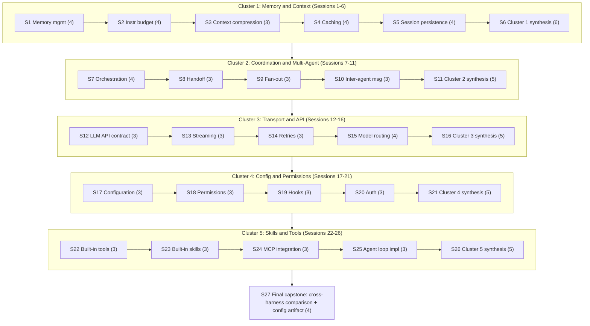

# Session breakdown (agenda only): Gnostic -> Demiurge

**What this file is.** A pacing layer on top of
[knowledge-path-curriculum.md](../../references/harnesses/knowledge-path-curriculum.md)'s
"Transition 2: Gnostic -> Demiurge" section -- the 21-page
core-mechanics band, already grouped by that page into five thematic
clusters (Memory & Context, Coordination & Multi-Agent, Transport &
API, Config & Permissions, Skills & Tools). That page's learning
objectives, per-module key concepts, comprehension checks, and
exercises answer "what has to be taught." This file answers a
different, added question: "how do you chunk that same material into
discrete, schedulable teaching sessions, sized so no single sitting is
overloaded and no sitting is so thin it isn't worth convening" -- the
same question the sibling file
[slumberer-to-gnostic-sessions.md](slumberer-to-gnostic-sessions.md)
answered for Transition 1, scaled to a band roughly ten times the size
(21 modules across five clusters, against Transition 1's two modules).

**Why this lives here, not in the wiki-book.** `references/harnesses/`
is the general-purpose, cross-agent wiki-book -- `airchon-mentor` reads
it conversationally, `airchon-author` is its only writer, and its
content (harness-internals research, the tier rubric, the curriculum
scaffold) serves any reader. Session pacing for actually *running* a
Gnostic->Demiurge course is different in kind: it is scoped to one
specific agent's own domain (`airchon-teacher`'s proficiency-tier
mission) rather than general reference material. Written directly here,
alongside its Transition-1 sibling, rather than ever having lived
inside `knowledge-path-curriculum.md` first -- see that page's own
pointer paragraph under "Transition 2" and `CHANGELOG.md` for the
provenance of this scoping decision. As of 2026-08-18, `airchon-teacher`
directly consumes this file the same way it now consumes its
Transition-1 sibling -- see that file's own note on this (and
`CHANGELOG.md`'s 2026-08-18 entry) for the shared rationale, not
repeated here. The 21 module-content sessions below
(Sessions 1-5, 7-10, 12-15, 17-20, 22-25) name no exercise of their
own -- Course-Delivery Flow pulls each one's practical exercise live
from its corresponding module's own Exercise field in
`knowledge-path-curriculum.md` instead of duplicating that text here;
only the five cluster-synthesis sessions and the final capstone keep
their own named exercise below, unchanged.

Like the rest of `knowledge-path-curriculum.md`'s pedagogical
scaffolding (comprehension checks, exercises, capstone), this session
breakdown is original pedagogical design, not a researched claim about
how anyone actually learns. Every item named in each session's agenda
below is inherited by reference from `knowledge-path-curriculum.md`'s
own Module sections for this transition (its "Key concepts,"
"Comprehension check," and "Exercise" fields) or from its own Capstone
section -- nothing here is a new concept not already scoped there; a
session's job is only to say *which* items get discussed together and
in what grouping, not to re-explain them.

**Why 27 sessions, not fewer or more.** The band's 21 modules carry, in
total, 69 discrete key-concept items when each module's own "Key
concepts" field is broken into its constituent teaching points (the
same granularity `slumberer-to-gnostic-sessions.md` used for its two
modules' six and four items) -- ranging module-by-module from 3 items
(context-compression.md, fan-out.md, handoff-mechanism.md,
inter-agent-messaging.md, and most of Clusters 3-5's modules) to 4
(memory-management.md, instruction-context-budget.md, caching.md,
session-persistence.md, orchestration.md, model-routing-and-selection.md).
Three session-count choices were rejected before settling on 27:

- **One session per cluster (5 sessions total)** would force 12-19
  key-concept items -- spanning four or five modules, each already
  requiring per-harness (Claude Code/Copilot CLI/OpenCode) concrete
  detail -- into a single sitting. That is two to four times the
  4-6-item ceiling the Transition-1 breakdown established as the point
  past which a sitting stops being absorbable, and it collapses first
  exposure to several genuinely distinct mechanisms (e.g. caching's
  server-side prefix reuse and session-persistence's process-restart
  durability) into the same block, exactly the short-circuit risk that
  breakdown's own rationale warned against.
- **One session per module with no synthesis sessions at all (21
  sessions)** would teach every module's key concepts but leave the
  comprehension-check-and-exercise practice this band's own five
  clusters group naturally around with nowhere to happen -- either
  skipped, or crammed into one end-of-transition synthesis sitting
  the way Transition 1 used a single Session 3. At ten times
  Transition 1's material, one such sitting would itself become the
  same kind of overloaded session the cluster-per-session option
  above was rejected for (21 comprehension-check questions plus
  exercise selection in one block).
- **Splitting any individual module's already-short 3-4-item
  key-concepts list across two sessions** would produce sittings of
  one or two items each -- precisely the "so thin it's pointless"
  failure mode `slumberer-to-gnostic-sessions.md` names as the reason
  it rejected four-or-more sessions for its own, much smaller band.

27 is the smallest count that avoids all three failure modes at once:
**21 module-content sessions** (Sessions 1-5, 7-10, 12-15, 17-20,
22-25 -- one per module, agenda drawn directly and only from that
module's own "Key concepts" field, sized 3-4 items exactly as that
field's own granularity dictates, no combining and no further
splitting), **5 cluster-synthesis sessions** (Sessions 6, 11, 16, 21,
26 -- one per cluster, immediately after that cluster's own module
sessions, each sized 5-6 items: one item per module in the cluster,
each item being that module's own "Comprehension check" question
walked cold, plus one item selecting a single representative
"Exercise" from that cluster's modules to actually run, rather than
attempting all of that cluster's exercises in one sitting), and **1
final capstone session** (Session 27, sized 4 items, breaking the
transition's own single "cross-harness mechanism comparison + operator
configuration" capstone task into its concrete deliverable steps).
This keeps every session in the same 3-6 item range Transition 1
established as the sensible floor and ceiling, while letting the
course's own shape mirror the five clusters `knowledge-path-curriculum.md`
already organizes the material into, rather than inventing a
different grouping.

---

## Cluster 1: Memory & Context (Sessions 1-6)

**Session 1 -- Memory management.** Items to cover, in order:
1. Instruction-file hierarchies and load order (e.g. `CLAUDE.md`).
2. Claude Code's auto-memory mechanism vs. Copilot CLI's server-side
   Copilot Memory.
3. Injection timing: what "eagerly loaded" vs. "reloaded on edit"
   means in practice.
4. Compaction-survival: what memory content does or does not survive a
   compaction event.

**Session 2 -- Instruction context budget.** Items to cover, in order:
1. Why `@`-style imports don't reduce eager-load cost.
2. Path-scoped rules (`paths:`) vs. `applyTo:` as two harnesses'
   answers to the same scoping problem.
3. Skills as the invoke-only (lazy-load) tier, contrasted with the
   eager-load tier.
4. Levers each harness offers for trimming what loads eagerly, and how
   to measure what actually loaded.

**Session 3 -- Context compression.** Items to cover, in order:
1. Mid-run compression as distinct from the eager-load budget
   (Session 2) and from compaction-survival (Session 1).
2. Claude Code's evict-then-summarize two-phase mechanism and its
   auto-compact default trigger.
3. OpenCode's source-verified `prune()`/`process()` pipeline.

**Session 4 -- Caching.** Items to cover, in order:
1. Server-side prefix reuse as distinct from compression (shrinking,
   Session 3) and memory loading (Session 1).
2. Cache scope and TTL-by-auth-path.
3. Subagent/fork cache-inheritance behavior.
4. One action that invalidates a cache and one that preserves it, and
   why editing an early system-prompt section costs more than
   appending a new user message.

**Session 5 -- Session & transcript persistence.** Items to cover, in
order:
1. Single-session durability across process restarts, as distinct
   from mid-run compaction-survival (Session 1) and agent-to-agent
   handoff (Cluster 2).
2. What a `--resume`/`--continue`-style command actually restores vs.
   leaves behind.
3. Fork/branch semantics vs. an in-place undo mechanism.
4. The literal file path or storage backend a session transcript is
   written to, per harness.

**Session 6 -- Cluster 1 synthesis.** No new material -- every item
here is integration of Sessions 1-5, not a new concept:
1. Walk memory-management.md's comprehension check: the practical
   difference between "eagerly loaded" and "reloaded on edit" memory
   content, and which the source page documents as mid-session-edit
   -aware.
2. Walk instruction-context-budget.md's comprehension check: one lever
   per harness for trimming eager-load cost, and why moving content
   into a skill changes its loading cost.
3. Walk context-compression.md's comprehension check: the trigger
   proportion of context capacity per harness, and what "evict-then
   -summarize" means as opposed to "summarize everything."
4. Walk caching.md's comprehension check: one cache-invalidating and
   one cache-preserving action, and the early-edit-vs-append cost
   asymmetry.
5. Walk session-persistence.md's comprehension check: the literal
   storage path or backend for one harness, and one thing a resume
   command does not restore.
6. Run one representative exercise from this cluster (recommended:
   session-persistence.md's -- kill a real harness process mid-session
   and use its documented resume mechanism to recover, comparing what
   came back against what the module predicted).

---

## Cluster 2: Coordination & Multi-Agent (Sessions 7-11)

**Session 7 -- Orchestration.** Items to cover, in order:
1. The general orchestrator/manager-agent concept.
2. Claude Code's turn-by-turn model vs. its script-held Dynamic
   -workflows plan (`agent()`/`pipeline()`).
3. Copilot CLI's `/fleet` orchestrator agent.
4. OpenCode's primary-agent/subagent taxonomy.

**Session 8 -- Handoff mechanism.** Items to cover, in order:
1. Agent-to-agent context transfer specifically, as distinct from
   compaction-survival (Cluster 1, Session 1).
2. Claude Code's fresh-context subagents vs. its named, resumeable
   ones.
3. OpenCode's `Task` tool (`session.create(parentID)`, `task_id`
   resume).

**Session 9 -- Fan-out (subagent dispatch).** Items to cover, in
order:
1. Launch mechanics as distinct from handoff (what crosses, Session 8)
   and orchestration (who holds the plan, Session 7).
2. Claude Code's three distinct fan-out layers and their concurrency
   /depth caps.
3. OpenCode's `FiberSet`-based concurrent dispatch.

**Session 10 -- Inter-agent messaging.** Items to cover, in order:
1. The wire format/transport layer once agents are already talking.
2. Claude Code's `SendMessage` tool and its file-based mailbox.
3. OpenCode's finding of no dedicated inter-agent message type at all
   (ordinary message rows over the same SSE bus).

**Session 11 -- Cluster 2 synthesis.** No new material -- every item
here is integration of Sessions 7-10, not a new concept:
1. Walk orchestration.md's comprehension check: the difference between
   a "turn-by-turn" and a "script-held plan" orchestration model, and
   which harness/feature pair instantiates each.
2. Walk handoff-mechanism.md's comprehension check: whether a Claude
   Code subagent starts with a fresh or inherited context, and what
   mechanism resumes it later.
3. Walk fan-out.md's comprehension check: the three fan-out layers for
   Claude Code, and which one has no documented hard concurrency cap.
4. Walk inter-agent-messaging.md's comprehension check: which harness
   has a dedicated addressed mailbox and which treats agent-to-agent
   communication as indistinguishable from any other session event.
5. Run one representative exercise from this cluster (recommended:
   fan-out.md's -- trigger a real parallel-subagent dispatch and count
   how many ran concurrently against the documented cap).

---

## Cluster 3: Transport & API (Sessions 12-16)

**Session 12 -- The LLM API contract.** Items to cover, in order:
1. One wire protocol's tool-call representation: `tool_use`/`tool_result`
   content blocks, a `stop_reason` enumeration, and an SSE event
   sequence.
2. A second wire protocol's tool-call representation: `tool_calls`/
   `call_id` and a `finish_reason` enumeration.
3. OpenCode's source-verified `Protocol`/`Endpoint`/`Auth`/`Framing`
   route decomposition unifying both.

**Session 13 -- Streaming & incremental rendering.** Items to cover,
in order:
1. The client/UI-side layer one level above the wire-level SSE
   contract (Session 12).
2. Buffering/reassembly/pacing discipline as a distinct concern from
   wire-level parsing.
3. Claude Code's delta-coalescing history as a concrete performance
   -engineering example.

**Session 14 -- Retries.** Items to cover, in order:
1. Failure recovery on a single outbound request, as distinct from
   context-overflow handling (Cluster 1) and cache-prefix reuse
   (Cluster 1).
2. Claude Code's `CLAUDE_CODE_MAX_RETRIES` and its retry-vs-not
   category list.
3. OpenCode's two-layer architecture: a bounded transport retry
   wrapped by an effectively uncapped whole-turn retry.

**Session 15 -- Model routing / selection.** Items to cover, in order:
1. Which underlying model answers a given step, as a question distinct
   from failure recovery (Session 14) or tool dispatch.
2. Claude Code's four-tier session-model precedence stack.
3. Copilot CLI's Auto model selection two-system router.
4. OpenCode's `defaultModel()` startup-resolution algorithm.

**Session 16 -- Cluster 3 synthesis.** No new material -- every item
here is integration of Sessions 12-15, not a new concept:
1. Walk llm-api-contract.md's comprehension check: the SSE event
   sequence from `message_start` to `message_stop`, and which event
   carries an in-progress tool-call argument delta.
2. Walk streaming-and-incremental-rendering.md's comprehension check:
   why "reassembly at the JSON-parsing level" is distinguished from
   "buffering and pacing," and whether any covered harness parses
   genuinely incomplete tool-call JSON mid-stream.
3. Walk retries.md's comprehension check: the practical difference
   between OpenCode's bounded transport retry and its wrapping
   whole-turn retry, and which is effectively uncapped.
4. Walk model-routing-and-selection.md's comprehension check: one
   harness's model-selection precedence order, highest to lowest, with
   one config key or flag named at each level.
5. Run one representative exercise from this cluster (recommended:
   retries.md's -- deliberately induce a retryable failure and observe
   how many attempts a real harness makes and at what backoff
   interval).

---

## Cluster 4: Config & Permissions (Sessions 17-21)

**Session 17 -- Configuration.** Items to cover, in order:
1. Claude Code's four-scope `settings.json` hierarchy (Managed/User
   /Project/Local).
2. Copilot CLI's `~/.copilot` layout and precedence chain.
3. OpenCode's `mergeConfigConcatArrays()` eight-source merge order.

**Session 18 -- Permissions & sandboxing architecture.** Items to
cover, in order:
1. The enforcement architecture underneath the permission-rule schema
   (Session 17's config).
2. Claude Code's OS-level sandboxed-Bash two-layer (filesystem
   /network) design and its named escape hatches.
3. OpenCode's finding that it ships no OS-level sandbox at all.

**Session 19 -- Hooks and lifecycle extensibility.** Items to cover,
in order:
1. The mechanism for user-side code to sit directly inside the loop's
   control flow.
2. Claude Code's ~30-event catalogue and the exit-code-2-only-blocks
   rule.
3. OpenCode's two-surface plugin model (a generic `event` bus vs. a
   typed `Hooks` interface).

**Session 20 -- Auth & usage accounting.** Items to cover, in order:
1. API-key/OAuth handling and precedence.
2. Token/cost tracking surfaces (e.g. `/usage`).
3. Three genuinely distinct budget-enforcement mechanisms at three
   different layers (SDK-level, workflow-level, org-level).

**Session 21 -- Cluster 4 synthesis.** No new material -- every item
here is integration of Sessions 17-20, not a new concept:
1. Walk configuration.md's comprehension check: one harness's full
   config precedence chain, highest to lowest, and one documented
   exception to strict precedence.
2. Walk permissions-and-sandboxing.md's comprehension check: Claude
   Code's two independent sandbox layers for its Bash tool, and one
   documented escape hatch that bypasses one of them.
3. Walk hooks-lifecycle-extensibility.md's comprehension check: which
   exit code blocks the action a Claude Code hook is attached to, and
   what other non-zero exit codes do instead.
4. Walk auth-and-usage-accounting.md's comprehension check: Claude
   Code's full authentication precedence stack, and which of the three
   budget-enforcement layers counts subagent spend toward a shared cap.
5. Run one representative exercise from this cluster (recommended:
   permissions-and-sandboxing.md's -- configure the strictest
   permission mode a harness offers, attempt an action you expect to
   be denied, and document the exact denial message and which layer
   produced it).

---

## Cluster 5: Skills & Tools (Sessions 22-26)

**Session 22 -- Built-in tools.** Items to cover, in order:
1. The full tool inventory per harness (Claude Code's `tools-reference`
   table, Copilot CLI's permission-"kind" vocabulary, OpenCode's
   `allow`/`ask`/`deny` model).
2. What "permission-required" means as a column in Claude Code's own
   tools-reference table.
3. The `Edit` tool's three-gate check as a named concrete mechanism.

**Session 23 -- Built-in skills.** Items to cover, in order:
1. What ships as a skill by default vs. user-authored content.
2. Claude Code's bundled-skill set and its `disableBundledSkills`
   /`skillOverrides` visibility controls.
3. OpenCode's finding of no confirmed bundled skills at all.

**Session 24 -- MCP integration.** Items to cover, in order:
1. Discovery/registration/invocation of MCP servers.
2. Config formats and transports across harnesses.
3. Tool-calling semantics once a server is registered.

**Session 25 -- Agent loop implementations.** Items to cover, in
order:
1. The harness-specific companion to the general agent-loop page
   (agent-loop.md, covered in Transition 1).
2. Claude Code's Agent SDK-documented loop: turns, `max_turns`
   /`max_budget_usd`, compaction, parallel tool execution.
3. OpenCode's source-verified loop
   (`packages/core/src/session/runner/max-steps.ts`).

**Session 26 -- Cluster 5 synthesis.** No new material -- every item
here is integration of Sessions 22-25, not a new concept:
1. Walk built-in-tools.md's comprehension check: what "permission
   -required" means as a table column, and one tool that requires it
   and one that doesn't.
2. Walk built-in-skills.md's comprehension check: two of Claude Code's
   bundled skills, and what `disableBundledSkills` controls.
3. Walk mcp-integration.md's comprehension check: one config file
   format used to register an MCP server, and the transport it uses to
   talk to that server.
4. Walk agent-loop-implementations.md's comprehension check: what
   `max_turns` bounds in Claude Code's documented Agent SDK loop, and
   how that differs from what `max_budget_usd` bounds.
5. Run one representative exercise from this cluster (recommended:
   mcp-integration.md's -- register a real MCP server with one harness
   and verify its tools appear and are invocable in a live session).

---

## Session 27 -- Final capstone: cross-harness mechanism comparison + operator configuration

No new material -- every item here is execution of
`knowledge-path-curriculum.md`'s own Transition-2 capstone task,
broken into its concrete deliverable steps:
1. Choose one of the five clusters above and one mechanism within it
   (e.g. "how context gets compressed mid-run," or "how a permission
   decision gets enforced").
2. Produce a comparison table with one row per harness (Claude Code,
   Copilot CLI, OpenCode) naming the specific config key/file path
   /tool name/limit each uses for that mechanism, with a citation to
   the source page for each cell.
3. Produce a real, working configuration artifact for at least one of
   those harnesses (a `settings.json`, a hooks config, a permission
   rule set, etc.) that deliberately exercises the documented limit or
   gate, run against a live session, with its output captured.
4. Self-check (or peer-review) both artifacts against the capstone's
   own grading criteria: every table cell traceable to the cited page
   rather than invented, and the configuration artifact actually doing
   what it claims when run.
