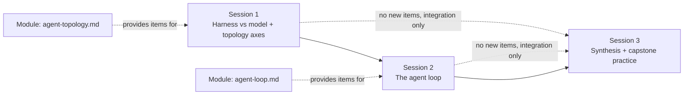

# Session breakdown (agenda only): Slumberer -> Gnostic

**What this file is.** A pacing layer on top of
[knowledge-path-curriculum.md](../../references/harnesses/knowledge-path-curriculum.md)'s
"Transition 1: Slumberer -> Gnostic" section. That page's learning
objectives, per-module key concepts, comprehension checks, and
exercises answer "what has to be taught." This file answers a
different, added question: "how do you chunk that same material into
discrete, schedulable teaching sessions, sized so no single sitting is
overloaded and no sitting is so thin it isn't worth convening."

**Why this lives here, not in the wiki-book.** `references/harnesses/`
is the general-purpose, cross-agent wiki-book -- `airchon-mentor` reads
it conversationally, `airchon-author` is its only writer, and its
content (harness-internals research, the tier rubric, the curriculum
scaffold) serves any reader. Session pacing for actually *running* a
Slumberer->Gnostic course is different in kind: it is scoped to one
specific agent's own domain (`airchon-teacher`'s proficiency-tier
mission) rather than general reference material. Moved here 2026-08-17
at the operator's request, out of `knowledge-path-curriculum.md`, so it
sits next to the agent whose domain it belongs to instead of inside the
shared wiki-book alongside general harness-internals research. As of
2026-08-18, `airchon-teacher` directly consumes this file to deliver the
course session-by-session (its own Course-Delivery Flow) -- an earlier
revision of that agent explicitly refused to do this ("You do NOT
create courses"); see `CHANGELOG.md`'s 2026-08-18 entry. Session 1 and
Session 2 below name no exercise of their own -- Course-Delivery Flow
pulls each one's practical exercise live from its corresponding
module's own Exercise field in `knowledge-path-curriculum.md` instead,
rather than duplicating that text into this file.

Like the rest of `knowledge-path-curriculum.md`'s pedagogical
scaffolding (comprehension checks, exercises, capstones), this session
breakdown is original pedagogical design, not a researched claim about
how anyone actually learns. Every item named in each session's agenda
below is inherited by reference from `knowledge-path-curriculum.md`'s
own Module sections for this transition (or, for the capstone, its
Capstone section) -- nothing here is a new concept not already scoped
there; a session's job is only to say *which* items get discussed
together and in what grouping, not to re-explain them.

**Why three sessions, not two or four.** The whole transition rests on
only two modules with, respectively, six and four discrete items (the
counts below) -- a genuinely small surface. Two sessions (one per
module) would be the bare minimum and would work, but it collapses
review-before-application into the same sitting as first exposure to
new vocabulary, which is exactly the condition under which
`knowledge-path-curriculum.md`'s own capstone warns learners "most
commonly ... short-circuit" the essay by reaching for
harness-specific concreteness before that's the assignment. A third,
content-free session gives the annotate-a-transcript exercise and the
capstone draft room to happen as deliberate practice rather than being
squeezed after Session 2's new material in the same sitting. Four or
more sessions, conversely, would require splitting either module's
already-short item list across sittings thin enough that some session
would contain only one or two agenda items -- exactly the "so thin
it's pointless" failure mode this breakdown is meant to avoid. Three
sessions is the smallest number that keeps every session's item count
in the four-to-six range while still giving synthesis and capstone
practice a session of their own.

**Session 1 -- Harness vs. model, and the topology axes.** Items to
cover, in order:
1. What a "harness" is as an engineering artifact distinct from the LLM
   it wraps.
2. At least three concrete things a harness typically adds on top of
   the bare model (tool access, memory/instruction injection, permission
   gating).
3. Reactive vs. deliberative agents, as a topology axis.
4. Single-agent vs. multi-agent systems, as a topology axis held
   explicitly at the topology level -- not yet the mechanics, which stay
   out of scope until orchestration.md/fan-out.md/inter-agent-messaging.md
   in the next transition.
5. Tool-augmented vs. fully autonomous agents, as a topology axis.
6. The "LLM + tools + memory + planning" component decomposition, and
   how its scope compares across a narrower, product-specific framing
   of "agent" vs. broader definitions from the general agentic-systems
   literature.

**Session 2 -- The agent loop.** Items to cover, in order:
1. The Thought/Action/Observation cycle and the ReAct pattern, by name.
2. The while-loop framing: what specifically gets appended back into the
   prompt once a tool executes, and why that append has to happen before
   the loop can produce its next Thought.
3. The stop-and-parse distinction between "the model emitted plain text"
   and "the model emitted a structured tool call."
4. The three ways that distinction gets resolved in practice: JSON-mode,
   code-generating, and native function-calling agents.

**Session 3 -- Synthesis and capstone practice.** No new material --
every item here is integration of Sessions 1-2, not a new concept:
1. Walk both modules' comprehension-check questions together, cold (no
   notes): the four-axes question from Session 1's material and the
   append-before-next-Thought question from Session 2's material.
2. Run the annotate-a-transcript exercise: take a real, unlabeled
   multi-step agent transcript and label each line as Thought, Action, or
   Observation.
3. Draft, or peer-review a draft of, the trace-a-request capstone essay
   (300-500 words, abstract vocabulary only, no concrete harness's config
   keys, file paths, or tool names named).
